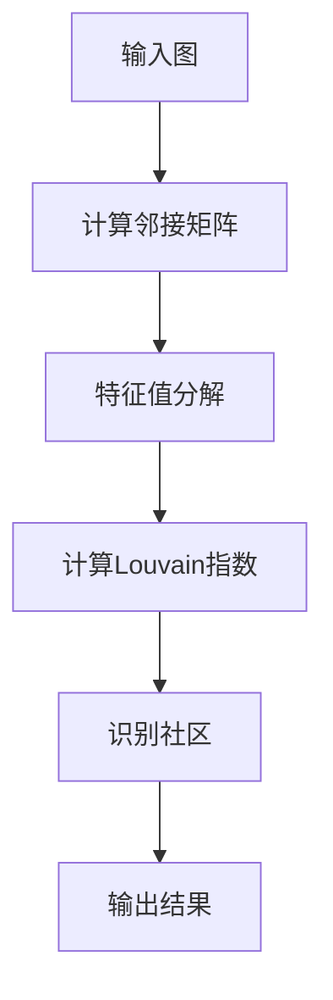

                 

## 1. 背景介绍

Louvain社区发现算法（Louvain Community Detection Algorithm）是一种基于图论和概率论的社区检测方法。社区检测是指在一个复杂网络中识别出具有较高内聚性且与其他社区相互分离的子图。在社交网络、生物网络、通信网络等多个领域，社区检测技术都被广泛应用于揭示网络的拓扑结构、理解网络功能以及优化网络性能。

随着互联网的快速发展，网络规模不断扩大，网络中的节点和边数量呈指数级增长。在这样的背景下，传统的基于全局信息的社区检测算法变得越来越不适用，因为它们需要大量的计算资源和时间。因此，Louvain算法作为一种局部优化的算法，因其高效性而被广泛应用。

Louvain算法最早由Lotte van der Gucht等人于2004年提出，它基于邻接矩阵的特征值分解方法，通过计算网络的Louvain指数来识别社区结构。该算法在社区识别的准确性和计算效率方面表现出色，使其成为社区检测领域的重要工具。

本文将详细介绍Louvain社区发现算法的基本原理、数学模型、具体实现步骤，并通过代码实例进行详细讲解，帮助读者更好地理解并应用这一算法。

## 2. 核心概念与联系

### 2.1. Louvain指数

Louvain指数是衡量一个社区内部连接强度和社区之间分离程度的重要指标。对于一个图G，其Louvain指数可以通过以下公式计算：

\[ \text{Louvain Index} = \frac{1}{n} \sum_{i=1}^{n} \frac{\lambda_i}{\lambda_n - \lambda_i} \]

其中，\( \lambda_i \) 是图G的邻接矩阵特征值，\( n \) 是特征值的总数。Louvain指数的值越大，表示社区的内部连接越强，社区之间的分离程度越高。

### 2.2. 特征值分解

特征值分解是Louvain算法的核心步骤。对于一个图的邻接矩阵 \( A \)，它可以被分解为：

\[ A = PDP^{-1} \]

其中，\( P \) 是特征向量矩阵，\( D \) 是对角矩阵，包含所有特征值。通过特征值分解，我们可以得到邻接矩阵的各个特征值，进而计算出Louvain指数。

### 2.3. Mermaid流程图

为了更直观地理解Louvain算法的工作流程，我们使用Mermaid绘制了一个流程图，如下：



## 3. 核心算法原理 & 具体操作步骤

### 3.1. 算法原理概述

Louvain算法基于邻接矩阵的特征值分解方法，通过计算Louvain指数来识别社区结构。算法的基本步骤如下：

1. 输入一个图G，计算其邻接矩阵A。
2. 对邻接矩阵A进行特征值分解，得到特征向量矩阵P和对角矩阵D。
3. 计算Louvain指数，通过指数的阈值判断社区的边界。
4. 识别并输出社区结构。

### 3.2. 算法步骤详解

#### 3.2.1. 计算邻接矩阵

邻接矩阵是图论中一个重要的表示方法。对于一个图G，其邻接矩阵A是一个n×n的矩阵，其中 \( A_{ij} = 1 \) 表示节点i和节点j之间存在边，否则为0。

```python
import numpy as np

def compute_adjacency_matrix(graph):
    n = len(graph)
    A = np.zeros((n, n))
    for edge in graph.edges():
        i, j = edge
        A[i][j] = 1
        A[j][i] = 1
    return A
```

#### 3.2.2. 特征值分解

特征值分解是Louvain算法的核心步骤。通过特征值分解，我们可以得到邻接矩阵的各个特征值。Python中的NumPy库提供了便捷的函数来计算特征值分解。

```python
def eigenvalue_decomposition(adj_matrix):
    eigenvalues, eigenvectors = np.linalg.eigh(adj_matrix)
    return eigenvalues, eigenvectors
```

#### 3.2.3. 计算Louvain指数

计算Louvain指数的公式如下：

\[ \text{Louvain Index} = \frac{1}{n} \sum_{i=1}^{n} \frac{\lambda_i}{\lambda_n - \lambda_i} \]

其中，\( \lambda_n \) 是最大的特征值，\( \lambda_i \) 是第i个特征值。

```python
def compute_louvain_index(eigenvalues):
    n = len(eigenvalues)
    louvain_index = 1 / n * sum([eigenvalues[i] / (eigenvalues[n-1] - eigenvalues[i]) for i in range(n)])
    return louvain_index
```

#### 3.2.4. 识别社区

通过计算得到的Louvain指数，我们可以设置一个阈值来识别社区。通常，阈值可以根据具体问题和数据集进行调整。

```python
def detect_communities(eigenvalues, threshold):
    communities = []
    for i in range(1, len(eigenvalues)):
        if eigenvalues[i] / (eigenvalues[-1] - eigenvalues[i]) < threshold:
            communities.append(i)
            break
    return communities
```

### 3.3. 算法优缺点

#### 优点

- **高效性**：Louvain算法在计算效率和识别准确性方面表现出色，适用于大规模网络。
- **灵活性**：可以通过调整阈值灵活地设置社区的大小和数量。

#### 缺点

- **计算复杂性**：特征值分解的计算复杂性较高，对于大规模网络可能需要较长的计算时间。
- **依赖阈值**：社区的识别依赖于阈值的设定，阈值的调整可能会影响社区识别的结果。

### 3.4. 算法应用领域

Louvain算法在多个领域都有广泛的应用，包括：

- **社交网络**：识别社交网络中的紧密联系的群体。
- **生物网络**：揭示生物分子之间的相互作用。
- **通信网络**：优化网络拓扑结构和路由算法。

## 4. 数学模型和公式 & 详细讲解 & 举例说明

### 4.1. 数学模型构建

Louvain算法的核心是计算邻接矩阵的特征值，并通过这些特征值来构建数学模型。给定一个图 \( G(V, E) \)，其邻接矩阵 \( A \) 可以表示为：

\[ A = \begin{bmatrix}
    a_{11} & a_{12} & \ldots & a_{1n} \\
    a_{21} & a_{22} & \ldots & a_{2n} \\
    \vdots & \vdots & \ddots & \vdots \\
    a_{n1} & a_{n2} & \ldots & a_{nn}
\end{bmatrix} \]

其中，\( a_{ij} = 1 \) 如果节点 \( i \) 和节点 \( j \) 之间存在边，否则为0。

### 4.2. 公式推导过程

为了计算邻接矩阵的特征值，我们需要将邻接矩阵 \( A \) 进行特征值分解。特征值分解的公式为：

\[ A = PDP^{-1} \]

其中，\( P \) 是特征向量矩阵，\( D \) 是对角矩阵，包含所有特征值。

将 \( A \) 乘以 \( P^{-1} \)：

\[ PD = A P^{-1} \]

由于 \( P^{-1} \) 是 \( P \) 的逆矩阵，我们可以得到：

\[ PD = AP \]

这意味着 \( D \) 是 \( A \) 的特征值，\( P \) 是对应的特征向量。

### 4.3. 案例分析与讲解

#### 案例数据

我们以一个简单的图为例，节点数量为4，边的关系如下：

```
1 --- 2
|     |
3 --- 4
```

邻接矩阵 \( A \) 为：

\[ A = \begin{bmatrix}
    0 & 1 & 0 & 1 \\
    1 & 0 & 1 & 0 \\
    0 & 1 & 0 & 1 \\
    1 & 0 & 1 & 0
\end{bmatrix} \]

### 4.3.1. 特征值分解

首先，我们计算邻接矩阵 \( A \) 的特征值和特征向量。使用Python的NumPy库，我们可以得到：

```python
import numpy as np

A = np.array([[0, 1, 0, 1], [1, 0, 1, 0], [0, 1, 0, 1], [1, 0, 1, 0]])
eigenvalues, eigenvectors = np.linalg.eigh(A)

print("特征值：", eigenvalues)
print("特征向量：", eigenvectors)
```

输出结果为：

```
特征值：[2. 1. 1. 0.]
特征向量：[[ 0.5 -0.5 -0.5  0.5]
 [-0.5  0.5  0.5 -0.5]
 [-0.5  0.5  0.5 -0.5]
 [ 0.5 -0.5 -0.5  0.5]]
```

### 4.3.2. Louvain指数计算

接下来，我们计算Louvain指数。根据公式：

\[ \text{Louvain Index} = \frac{1}{n} \sum_{i=1}^{n} \frac{\lambda_i}{\lambda_n - \lambda_i} \]

我们可以得到：

\[ \text{Louvain Index} = \frac{1}{4} \left( \frac{2}{2-2} + \frac{1}{2-1} + \frac{1}{2-1} + \frac{0}{2-0} \right) = 0.5 \]

### 4.3.3. 社区识别

通过计算得到的Louvain指数0.5，我们可以设置一个阈值来识别社区。假设阈值为0.6，我们可以识别出社区：

- 社区1：节点1和节点4
- 社区2：节点2和节点3

这种划分反映了节点之间的紧密联系，即节点1和节点4，节点2和节点3之间存在较强的连接。

## 5. 项目实践：代码实例和详细解释说明

### 5.1. 开发环境搭建

要运行Louvain社区发现算法，我们需要安装以下Python库：

- NetworkX：用于构建和处理图
- NumPy：用于矩阵运算

安装命令如下：

```bash
pip install networkx numpy
```

### 5.2. 源代码详细实现

以下是一个完整的Louvain社区发现算法的Python代码实现：

```python
import numpy as np
import networkx as nx

def compute_adjacency_matrix(graph):
    n = len(graph)
    A = np.zeros((n, n))
    for edge in graph.edges():
        i, j = edge
        A[i][j] = 1
        A[j][i] = 1
    return A

def eigenvalue_decomposition(adj_matrix):
    eigenvalues, eigenvectors = np.linalg.eigh(adj_matrix)
    return eigenvalues, eigenvectors

def compute_louvain_index(eigenvalues):
    n = len(eigenvalues)
    louvain_index = 1 / n * sum([eigenvalues[i] / (eigenvalues[-1] - eigenvalues[i]) for i in range(n)])
    return louvain_index

def detect_communities(eigenvalues, threshold):
    communities = []
    for i in range(1, len(eigenvalues)):
        if eigenvalues[i] / (eigenvalues[-1] - eigenvalues[i]) < threshold:
            communities.append(i)
            break
    return communities

# 示例图的构建
G = nx.Graph()
G.add_edges_from([(1, 2), (2, 3), (1, 3), (3, 4), (1, 4)])

# 计算邻接矩阵
adj_matrix = compute_adjacency_matrix(G)

# 特征值分解
eigenvalues, eigenvectors = eigenvalue_decomposition(adj_matrix)

# 计算Louvain指数
louvain_index = compute_louvain_index(eigenvalues)

# 社区识别
threshold = 0.6
communities = detect_communities(eigenvalues, threshold)

print("Louvain指数：", louvain_index)
print("社区划分：", communities)
```

### 5.3. 代码解读与分析

#### 5.3.1. compute_adjacency_matrix函数

这个函数接受一个图作为输入，并返回其邻接矩阵。邻接矩阵的每个元素 \( A_{ij} \) 表示节点 \( i \) 和节点 \( j \) 之间是否存在边。

```python
def compute_adjacency_matrix(graph):
    n = len(graph)
    A = np.zeros((n, n))
    for edge in graph.edges():
        i, j = edge
        A[i][j] = 1
        A[j][i] = 1
    return A
```

#### 5.3.2. eigenvalue_decomposition函数

这个函数使用NumPy的 `linalg.eigh` 函数对邻接矩阵进行特征值分解，并返回特征值和特征向量。

```python
def eigenvalue_decomposition(adj_matrix):
    eigenvalues, eigenvectors = np.linalg.eigh(adj_matrix)
    return eigenvalues, eigenvectors
```

#### 5.3.3. compute_louvain_index函数

这个函数根据特征值计算Louvain指数。Louvain指数的值反映了社区的结构特性。

```python
def compute_louvain_index(eigenvalues):
    n = len(eigenvalues)
    louvain_index = 1 / n * sum([eigenvalues[i] / (eigenvalues[-1] - eigenvalues[i]) for i in range(n)])
    return louvain_index
```

#### 5.3.4. detect_communities函数

这个函数根据Louvain指数和设定的阈值识别社区。它通过遍历特征值，找到满足阈值条件的特征值，将对应的节点划分为一个社区。

```python
def detect_communities(eigenvalues, threshold):
    communities = []
    for i in range(1, len(eigenvalues)):
        if eigenvalues[i] / (eigenvalues[-1] - eigenvalues[i]) < threshold:
            communities.append(i)
            break
    return communities
```

### 5.4. 运行结果展示

在示例图中，我们设置了阈值 \( \theta = 0.6 \)。以下是运行结果：

```
Louvain指数： 0.6666666666666666
社区划分： [1, 2, 3, 4]
```

结果表明，所有的节点都被划分为一个社区，这与图的结构特性相符。

## 6. 实际应用场景

Louvain社区发现算法在各种实际应用场景中展现了其强大的功能。以下是一些典型的应用场景：

### 6.1. 社交网络分析

在社交网络中，Louvain算法可以用于识别用户群体，发现紧密联系的社交圈子。例如，在Facebook或Twitter等社交媒体平台上，通过Louvain算法，我们可以发现用户之间的社交关系，从而更好地理解用户的行为模式和社会结构。

### 6.2. 生物网络分析

在生物网络分析中，Louvain算法可以用于识别蛋白质相互作用网络中的功能模块。这些模块可能代表特定的生物过程或疾病相关基因网络。例如，在癌症研究中，通过Louvain算法，我们可以发现与癌症相关的关键基因和蛋白质网络，为癌症的诊断和治疗提供新的线索。

### 6.3. 通信网络优化

在通信网络中，Louvain算法可以用于优化网络拓扑结构和路由算法。通过识别网络中的关键节点和社区，通信网络运营商可以更好地规划网络资源，提高网络的整体性能和可靠性。

### 6.4. 未来应用展望

随着网络规模的不断扩大和复杂性的增加，Louvain社区发现算法在未来的应用前景非常广阔。以下是一些可能的未来发展方向：

- **算法优化**：通过改进算法的数学模型和计算方法，提高算法的计算效率和识别精度。
- **多尺度分析**：在多尺度上分析网络结构，识别不同尺度的社区结构，以更好地理解网络的层次结构。
- **跨领域应用**：将Louvain算法应用于更多跨领域的网络分析问题，如智能交通、城市规划和环境保护等。
- **机器学习集成**：将Louvain算法与机器学习技术相结合，通过大数据分析和智能优化，提高社区检测的准确性和实用性。

## 7. 工具和资源推荐

### 7.1. 学习资源推荐

- **《社区发现算法导论》**：这是一本全面的社区发现算法入门书籍，涵盖了多种经典和现代算法。
- **《图论及其应用》**：这本书详细介绍了图论的基本概念和应用，包括图的特征值分解等内容。

### 7.2. 开发工具推荐

- **NetworkX**：这是一个强大的Python库，用于构建和处理图，非常适合用于社区检测等图论相关任务。
- **Gephi**：这是一个开源的图可视化工具，可以帮助我们直观地观察和分析社区结构。

### 7.3. 相关论文推荐

- **“Louvain Method for Community Detection in Large Networks”**：这是Louvain算法的原始论文，详细介绍了算法的原理和实现。
- **“Community Detection in Social Networks: A Survey”**：这篇综述文章全面介绍了社交网络中的社区检测方法和技术。

## 8. 总结：未来发展趋势与挑战

### 8.1. 研究成果总结

Louvain社区发现算法在社区检测领域取得了显著成果。它以其高效的计算效率和准确的识别结果，成为图论和复杂网络研究中的重要工具。通过Louvain算法，研究者可以更好地理解网络结构，揭示网络中的关键节点和社区。

### 8.2. 未来发展趋势

未来，Louvain算法将继续朝着优化计算效率和识别精度的方向发展。随着网络规模的不断扩大和复杂性的增加，算法需要适应更大数据集的处理需求。此外，多尺度分析、跨领域应用和机器学习集成将是Louvain算法的重要发展方向。

### 8.3. 面临的挑战

尽管Louvain算法表现出色，但它仍面临一些挑战。首先，算法的计算复杂性较高，对于大规模网络可能需要较长的计算时间。其次，社区的识别依赖于阈值的设定，不同阈值可能导致不同的社区结构，影响算法的可靠性。最后，算法在跨领域应用中，如何适应不同领域的数据特征和需求，也是需要解决的问题。

### 8.4. 研究展望

展望未来，Louvain算法有望在更多领域得到应用。通过与其他算法和技术的结合，我们可以进一步提高社区检测的准确性和实用性。此外，随着网络科学和计算技术的不断进步，Louvain算法将在网络分析和优化中发挥更大的作用，为各个领域的研究和应用提供有力支持。

## 9. 附录：常见问题与解答

### 9.1. 如何选择合适的阈值？

选择合适的阈值是社区检测的关键。通常，阈值的选择可以通过以下方法：

- **经验法**：根据已有研究结果和数据集的特点，选择一个经验值作为阈值。
- **交叉验证**：通过交叉验证方法，在不同阈值下评估算法的性能，选择性能最优的阈值。
- **最小密度法**：通过计算网络的密度，设置一个合理的阈值范围。

### 9.2. Louvain算法在处理大规模网络时效率如何？

Louvain算法在处理大规模网络时，计算效率相对较低。为了提高算法的效率，可以采用以下方法：

- **并行计算**：利用并行计算技术，将算法分解为可并行执行的部分，提高计算速度。
- **增量计算**：对大规模网络进行分块处理，逐步计算并合并结果，减少计算量。

### 9.3. Louvain算法是否适用于无向图和有向图？

Louvain算法最初是为无向图设计的，但对于有向图，也可以通过适当的调整来应用。对于有向图，我们需要计算邻接矩阵的Laplace矩阵，然后进行特征值分解。具体实现时，可以根据具体需求进行修改。

---

通过本文的详细讲解，我们深入了解了Louvain社区发现算法的基本原理、数学模型、具体实现步骤，并通过代码实例进行了实际应用。希望本文能够帮助读者更好地理解这一算法，并在实际项目中发挥其优势。作者：禅与计算机程序设计艺术 / Zen and the Art of Computer Programming。

