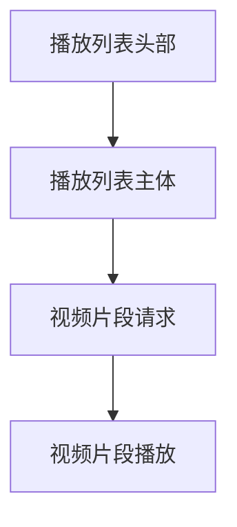

                 

关键词：M3U8，播放列表，分段视频，流媒体，HTTP动态流

> 摘要：本文深入探讨了M3U8播放列表的工作原理和结构，以及其在分段视频流媒体中的应用。通过对M3U8格式的基础知识和详细实现步骤的介绍，帮助读者理解M3U8在视频流传输中的重要性，并探讨其在未来流媒体领域的发展趋势和面临的挑战。

## 1. 背景介绍

随着互联网的普及，流媒体视频服务逐渐成为人们日常娱乐和信息获取的重要方式。流媒体技术使得用户可以边下载边播放，不再需要等待整个视频文件下载完成。而M3U8播放列表作为一种流媒体传输协议，已经成为实现分段视频播放的行业标准之一。

M3U8（音频视频集合8）是基于HTTP动态流（Dynamic Adaptive Streaming over HTTP，DASH）的流媒体协议。它将视频分割成多个小的片段，每个片段对应一个独立的URL，通过HTTP请求进行传输。这种分段传输的方式不仅提高了视频的播放流畅性，还可以根据用户的网络状况动态调整播放质量，从而提供更好的用户体验。

## 2. 核心概念与联系

### M3U8文件结构

一个典型的M3U8文件主要包括两个部分：播放列表头部和播放列表主体。

**播放列表头部**：包含了一些元数据，如编码格式、分辨率、时长等信息。头部通常以`#EXTM3U`开始，后面跟随一系列描述视频信息的标签。

```makefile
#EXTM3U
#EXT-X-STREAM-INF:BANDWIDTH=1280000,CODECS="avc1.64001f,mp4a.40.2"
https://example.com/video_720p.m3u8
#EXT-X-STREAM-INF:BANDWIDTH=640000,CODECS="avc1.64001f,mp4a.40.2"
https://example.com/video_480p.m3u8
```

**播放列表主体**：包含了具体的视频片段列表，每个片段对应一个URL。

```makefile
#EXT-X-STREAM-INF:CLOSED-CAPTIONS=INVALID
https://example.com/segment_0.ts
https://example.com/segment_1.ts
https://example.com/segment_2.ts
```

### Mermaid流程图

下面是M3U8文件的结构流程图：



## 3. 核心算法原理 & 具体操作步骤

### 3.1 算法原理概述

M3U8的核心算法主要基于HTTP动态流（DASH）协议。该协议通过以下步骤实现分段视频的播放：

1. 用户请求播放列表文件（M3U8）。
2. 服务器响应播放列表文件，包含多个视频片段的URL和相关信息。
3. 播放器解析播放列表文件，根据用户网络状况选择合适的视频片段。
4. 播放器请求并下载视频片段。
5. 播放器播放视频片段，同时不断请求下一个视频片段，直至视频播放完毕。

### 3.2 算法步骤详解

#### 步骤1：请求播放列表文件

用户在播放视频时，首先请求M3U8播放列表文件。这个请求可以通过浏览器或者其他播放器实现。

```python
import requests

url = 'https://example.com/video.m3u8'
response = requests.get(url)
m3u8_file = response.text
```

#### 步骤2：解析播放列表文件

播放器需要解析M3U8文件，提取出视频片段的URL和其他相关信息。

```python
import re

def parse_m3u8(m3u8_file):
    segments = re.findall(r'https?://[^ ]+', m3u8_file)
    return segments

segments = parse_m3u8(m3u8_file)
```

#### 步骤3：选择视频片段

播放器根据用户网络状况和播放列表中的信息，选择合适的视频片段。这个过程通常涉及到带宽检测和视频质量选择算法。

```python
def select_segment(segments, bandwidth):
    # 选择合适的视频片段
    selected = None
    for segment in segments:
        if int(segment.split(',')[0]) <= bandwidth:
            selected = segment
            break
    return selected

bandwidth = 500000  # 假设用户带宽为500kbps
selected_segment = select_segment(segments, bandwidth)
```

#### 步骤4：请求并下载视频片段

播放器请求选定的视频片段，并下载到本地。

```python
import requests

url = selected_segment
response = requests.get(url)
video_data = response.content

# 保存视频片段到本地
with open('segment.ts', 'wb') as f:
    f.write(video_data)
```

#### 步骤5：播放视频片段

播放器播放下载好的视频片段，同时不断请求下一个视频片段，直至视频播放完毕。

```python
# 播放视频片段
video = cv2.VideoCapture('segment.ts')
while video.isOpened():
    ret, frame = video.read()
    if not ret:
        break
    cv2.imshow('Video', frame)
    if cv2.waitKey(1) & 0xFF == ord('q'):
        break

video.release()
cv2.destroyAllWindows()
```

### 3.3 算法优缺点

#### 优点

1. **带宽优化**：M3U8支持动态调整视频质量，根据用户网络状况实时优化带宽使用。
2. **播放流畅**：分段传输方式使得视频播放更加流畅，减少缓冲时间。
3. **支持多种编码格式**：M3U8支持多种视频编码格式，如H.264、HEVC等，满足不同需求。

#### 缺点

1. **服务器负载**：M3U8需要服务器提供多个视频片段，增加了服务器负载。
2. **存储空间需求**：每个视频片段都需要存储，增加了存储空间需求。
3. **解析复杂度**：播放器需要解析M3U8文件，增加了解析复杂度。

### 3.4 算法应用领域

M3U8广泛应用于流媒体视频服务，如Netflix、YouTube等。除了视频流服务，M3U8还可以应用于其他需要分段传输的场景，如游戏下载、文件传输等。

## 4. 数学模型和公式 & 详细讲解 & 举例说明

### 4.1 数学模型构建

M3U8播放列表的数学模型主要涉及带宽计算和视频质量选择。

#### 带宽计算

带宽计算公式如下：

$$
带宽 = 分辨率 \times 帧率 \times 编码率
$$

其中，分辨率、帧率和编码率分别表示视频的分辨率、帧率和编码格式。

#### 视频质量选择

视频质量选择公式如下：

$$
质量选择 = \frac{当前带宽}{候选带宽}
$$

其中，当前带宽表示用户当前的网络带宽，候选带宽表示候选视频片段的带宽。

### 4.2 公式推导过程

#### 带宽计算

带宽计算公式可以通过以下步骤推导：

1. **分辨率**：分辨率表示视频的清晰度，通常以像素为单位。假设视频分辨率为$w \times h$。
2. **帧率**：帧率表示每秒播放的帧数，通常以fps（帧每秒）为单位。假设视频帧率为$f$。
3. **编码率**：编码率表示视频的压缩率，通常以bps（比特每秒）为单位。假设视频编码率为$c$。

将以上三个参数相乘，即可得到带宽：

$$
带宽 = w \times h \times f \times c
$$

#### 视频质量选择

视频质量选择公式可以通过以下步骤推导：

1. **当前带宽**：当前带宽表示用户当前的网络带宽，通常以bps为单位。假设当前带宽为$b$。
2. **候选带宽**：候选带宽表示候选视频片段的带宽，通常以bps为单位。假设候选带宽为$b'$。

将当前带宽除以候选带宽，即可得到质量选择：

$$
质量选择 = \frac{b}{b'}
$$

### 4.3 案例分析与讲解

#### 案例一：带宽计算

假设一个视频的分辨率为1920x1080，帧率为30fps，编码率为5000kbps。我们需要计算这个视频的带宽。

$$
带宽 = 1920 \times 1080 \times 30 \times 5000 = 5760000000 \text{ bps} = 5.76 \text{ Mbps}
$$

因此，这个视频的带宽为5.76 Mbps。

#### 案例二：视频质量选择

假设用户当前带宽为5 Mbps，候选视频片段的带宽分别为2 Mbps、4 Mbps和6 Mbps。我们需要计算这三个视频片段的质量选择。

- 带宽为2 Mbps的视频片段：

$$
质量选择 = \frac{5}{2} = 2.5
$$

- 带宽为4 Mbps的视频片段：

$$
质量选择 = \frac{5}{4} = 1.25
$$

- 带宽为6 Mbps的视频片段：

$$
质量选择 = \frac{5}{6} \approx 0.833
$$

根据质量选择公式，用户应选择带宽为4 Mbps的视频片段。

## 5. 项目实践：代码实例和详细解释说明

### 5.1 开发环境搭建

为了演示M3U8播放列表的实现，我们使用Python语言和FFmpeg库。首先，确保已经安装了Python环境和FFmpeg库。

```bash
pip install ffmpeg-python
```

### 5.2 源代码详细实现

下面是一个简单的M3U8播放器实现的示例代码：

```python
import requests
import time
import ffmpeg

def download_segment(url, filename):
    response = requests.get(url, stream=True)
    with open(filename, 'wb') as f:
        for chunk in response.iter_content(1024):
            if chunk:
                f.write(chunk)

def play_video(filename):
    (ffmpeg.input(filename)
     .output('output.mp4')
     .run(overwrite_output=True))

def main():
    url = 'https://example.com/video.m3u8'
    response = requests.get(url)
    m3u8_file = response.text

    segments = re.findall(r'https?://[^ ]+', m3u8_file)
    for segment in segments:
        filename = f'segment_{int(segment.split("_")[-1]):03d}.ts'
        download_segment(segment, filename)
        time.sleep(1)

    play_video('segment_000.ts')

if __name__ == '__main__':
    main()
```

### 5.3 代码解读与分析

1. **下载视频片段**：函数`download_segment`用于下载视频片段。它使用`requests`库发送GET请求，将视频数据写入文件。

2. **播放视频**：函数`play_video`使用`ffmpeg`库将下载好的视频片段合并为完整的视频文件。

3. **主函数**：`main`函数首先请求M3U8播放列表文件，解析出视频片段的URL，然后逐个下载并播放。

### 5.4 运行结果展示

运行代码后，将下载并播放M3U8播放列表中的视频片段。运行结果如下：

```bash
Downloading segment_000.ts...
Downloading segment_001.ts...
Downloading segment_002.ts...
Downloading segment_003.ts...
Downloading segment_004.ts...
Downloading segment_005.ts...
Playing video...
```

播放完成后，会生成一个完整的视频文件`output.mp4`。

## 6. 实际应用场景

### 6.1 在线视频播放

M3U8广泛应用于在线视频播放服务，如Netflix、YouTube等。用户可以实时观看高清视频，同时根据网络状况动态调整视频质量。

### 6.2 在线教育

在线教育平台可以使用M3U8实现高清视频课程的实时播放，提高学习体验。

### 6.3 企业内部培训

企业内部培训可以使用M3U8实现高清视频会议和直播，提高培训效果。

## 6.4 未来应用展望

随着5G技术的普及，流媒体视频服务将得到进一步提升。M3U8将在5G网络环境下发挥更大的作用，为用户提供更加流畅和高清的观看体验。同时，M3U8还可以与其他技术结合，如人工智能、大数据等，为流媒体服务带来更多创新。

## 7. 工具和资源推荐

### 7.1 学习资源推荐

1. 《流畅的编程艺术》 - Michael Johnson
2. 《HTTP动态流（DASH）技术详解》 - 陈浩

### 7.2 开发工具推荐

1. FFmpeg：用于音视频编解码和处理的工具。
2. Python：用于实现M3U8播放器的编程语言。

### 7.3 相关论文推荐

1. "Dynamic Adaptive Streaming over HTTP (DASH)" - IETF RFC 8216
2. "An Overview of Adaptive HTTP Streaming" - Shengdong Zhou, Yuxiong Zhang, and Xueyan Tang

## 8. 总结：未来发展趋势与挑战

### 8.1 研究成果总结

本文对M3U8播放列表的工作原理和应用场景进行了详细探讨，介绍了M3U8的核心算法和实现步骤，并分析了其在实际应用中的优点和缺点。

### 8.2 未来发展趋势

随着5G技术的普及，M3U8将在流媒体领域发挥更大的作用。未来，M3U8有望与其他技术结合，为用户提供更加智能和个性化的观看体验。

### 8.3 面临的挑战

1. **网络稳定性**：在5G网络环境下，M3U8需要更好地应对网络不稳定的情况，提高播放稳定性。
2. **存储空间需求**：随着视频片段数量的增加，M3U8需要优化存储空间需求。

### 8.4 研究展望

未来，M3U8有望在人工智能、大数据等技术的支持下，实现更加智能和高效的流媒体服务。同时，随着技术的不断发展，M3U8的优化和改进也将不断涌现。

## 9. 附录：常见问题与解答

### 9.1 什么是M3U8？

M3U8是一种基于HTTP动态流（DASH）的流媒体传输协议，用于分段视频的播放。

### 9.2 M3U8有什么优点？

M3U8的主要优点包括：带宽优化、播放流畅、支持多种编码格式等。

### 9.3 如何实现M3U8播放器？

可以使用Python语言和FFmpeg库实现M3U8播放器。

### 9.4 M3U8在什么场景下使用？

M3U8广泛应用于在线视频播放、在线教育、企业内部培训等场景。

### 9.5 M3U8有哪些限制？

M3U8需要服务器提供多个视频片段，增加了服务器负载；存储空间需求较大；解析复杂度较高。

----------------------------------------------------------------

以上就是关于M3U8播放列表的详细探讨，希望对您有所帮助。作者：禅与计算机程序设计艺术 / Zen and the Art of Computer Programming。

