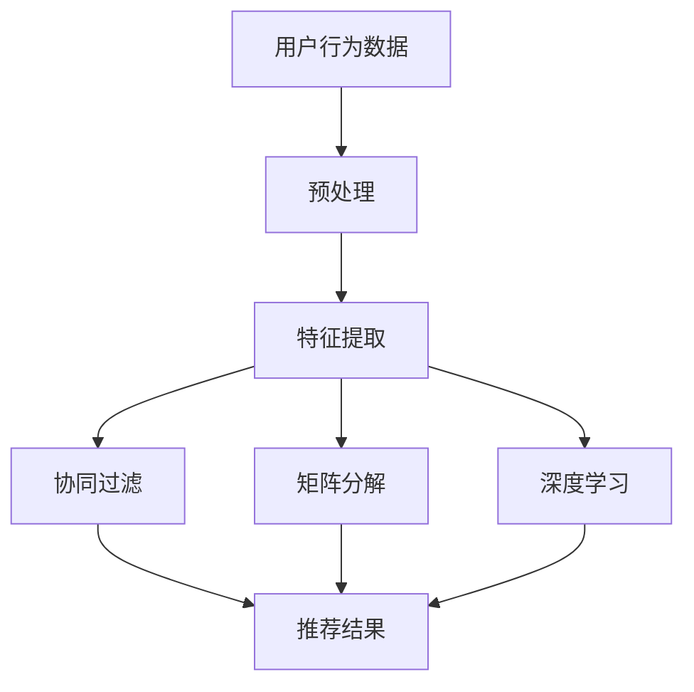

                 

关键词：开放域推荐、协同过滤、矩阵分解、深度学习、用户行为分析、个性化推荐、推荐系统、算法优化、实践应用

> 摘要：本文旨在探讨开放域推荐系统的最新技术和应用。我们将深入分析协同过滤、矩阵分解、深度学习等推荐算法的原理和实际操作步骤，通过项目实践和数学模型的详细讲解，帮助读者理解并应用这些算法。此外，本文还将讨论开放域推荐系统的实际应用场景和未来发展趋势，并提供相关的学习资源和开发工具推荐。

## 1. 背景介绍

随着互联网的快速发展，用户生成的内容和数据量呈爆炸式增长，个性化推荐系统变得日益重要。开放域推荐系统（Open-Domain Recommendation System）是一种能够处理多种类型数据（如视频、音乐、文章、商品等）的推荐系统，其目标是向用户提供个性化的推荐，满足他们的多样化需求。

开放域推荐系统与传统域推荐系统相比，具有以下特点：

- **处理多种类型数据**：开放域推荐系统需要处理不同类型的数据，包括文本、图像、音频等，这使得推荐系统的设计更加复杂。
- **跨领域推荐**：开放域推荐系统能够在多个领域提供推荐，而不是局限于一个特定的领域。
- **高维度数据**：开放域推荐系统通常涉及高维数据，需要高效的数据处理和建模技术。

## 2. 核心概念与联系

### 2.1 协同过滤

协同过滤（Collaborative Filtering）是一种基于用户行为的推荐算法，它通过分析用户之间的相似性来预测用户可能喜欢的项目。协同过滤主要分为两类：

- **用户基协同过滤**：通过计算用户之间的相似度来推荐项目。这种方法依赖于用户评价数据。
- **项目基协同过滤**：通过计算项目之间的相似度来推荐用户可能喜欢的项目。这种方法依赖于项目特征数据。

### 2.2 矩阵分解

矩阵分解（Matrix Factorization）是一种用于降维和高维数据建模的方法。在推荐系统中，矩阵分解常用于将用户-项目评分矩阵分解为低维的用户特征矩阵和项目特征矩阵，从而提高推荐系统的性能。

### 2.3 深度学习

深度学习（Deep Learning）是一种基于人工神经网络的学习方法，它能够自动从数据中提取特征，并建立复杂的非线性模型。在推荐系统中，深度学习方法可以用于用户行为分析、项目特征提取和推荐结果生成。

### 2.4 Mermaid 流程图

下面是开放域推荐系统的 Mermaid 流程图：



## 3. 核心算法原理 & 具体操作步骤

### 3.1 算法原理概述

#### 3.1.1 协同过滤

协同过滤算法基于用户之间的相似度和已知的用户-项目评分数据来生成推荐。其基本原理可以表示为：

$$
\text{推荐分数} = \text{用户相似度} \times (\text{其他用户对该项目的评分} - \text{用户对该项目的评分})
$$

#### 3.1.2 矩阵分解

矩阵分解将用户-项目评分矩阵分解为低维的用户特征矩阵和项目特征矩阵。常用的矩阵分解方法有：

- ** singular value decomposition (SVD)**
- **non-negative matrix factorization (NMF)**

#### 3.1.3 深度学习

深度学习算法通常包括以下几个步骤：

1. **数据预处理**：将用户行为数据转换为数值化的输入。
2. **特征提取**：通过神经网络自动提取用户和项目的特征。
3. **模型训练**：使用已标注的数据训练深度学习模型。
4. **推荐生成**：使用训练好的模型生成推荐结果。

### 3.2 算法步骤详解

#### 3.2.1 协同过滤

1. **计算用户相似度**：使用余弦相似度、皮尔逊相关系数等方法计算用户之间的相似度。
2. **推荐生成**：对于每个用户，计算其对未评分项目的预测评分，并按预测评分排序生成推荐列表。

#### 3.2.2 矩阵分解

1. **初始化参数**：随机初始化用户特征矩阵和项目特征矩阵。
2. **迭代优化**：通过梯度下降等方法优化特征矩阵，使得预测评分接近实际评分。
3. **推荐生成**：使用优化后的特征矩阵计算未评分项目的预测评分，并按预测评分排序生成推荐列表。

#### 3.2.3 深度学习

1. **数据预处理**：将用户行为数据编码为张量。
2. **模型构建**：构建深度学习模型，通常包括输入层、隐藏层和输出层。
3. **模型训练**：使用已标注的数据训练深度学习模型。
4. **推荐生成**：使用训练好的模型生成推荐结果。

### 3.3 算法优缺点

#### 3.3.1 协同过滤

- **优点**：简单高效，适用于高维数据。
- **缺点**：易受冷启动问题影响，且仅依赖于用户评分数据。

#### 3.3.2 矩阵分解

- **优点**：能够降低数据维度，提高推荐精度。
- **缺点**：对初始参数敏感，且需要大量计算资源。

#### 3.3.3 深度学习

- **优点**：能够自动提取特征，适用于多种类型的数据。
- **缺点**：训练时间较长，且对数据量有较高要求。

### 3.4 算法应用领域

- **电子商务**：推荐商品给用户。
- **社交媒体**：推荐内容给用户。
- **音乐流媒体**：推荐音乐给用户。

## 4. 数学模型和公式 & 详细讲解 & 举例说明

### 4.1 数学模型构建

#### 4.1.1 协同过滤

$$
r_{ui} = \text{user\_similarity}(u, i) \times (\text{average\_rating}(i) - r_{ui})
$$

其中，$r_{ui}$为用户$u$对项目$i$的预测评分，$\text{user\_similarity}(u, i)$为用户$u$和项目$i$之间的相似度，$\text{average\_rating}(i)$为项目$i$的平均评分。

#### 4.1.2 矩阵分解

$$
R = U \times V^T
$$

其中，$R$为用户-项目评分矩阵，$U$为用户特征矩阵，$V$为项目特征矩阵。

#### 4.1.3 深度学习

$$
y = \text{sigmoid}(W \times \text{concat}(x_u, x_i))
$$

其中，$y$为预测评分，$W$为权重矩阵，$x_u$和$x_i$分别为用户和项目的特征向量。

### 4.2 公式推导过程

#### 4.2.1 协同过滤

我们假设用户$u$和项目$i$之间的相似度由以下公式计算：

$$
\text{user\_similarity}(u, i) = \frac{\sum_{j \in \text{common\_items}} r_{uj} r_{ij}}{\sqrt{\sum_{j \in \text{u\_items}} r_{uj}^2} \sqrt{\sum_{j \in \text{i\_items}} r_{ij}^2}}
$$

其中，$r_{uj}$和$r_{ij}$分别为用户$u$对项目$j$的评分，$\text{common\_items}$为用户$u$和项目$i$共同评分的项目集合，$\text{u\_items}$和$\text{i\_items}$分别为用户$u$和项目$i$的评分项目集合。

#### 4.2.2 矩阵分解

我们使用最小二乘法来优化用户特征矩阵$U$和项目特征矩阵$V$，使得预测评分$r_{ui}$接近实际评分$r_{ui}$。

$$
\min_{U, V} \sum_{(u, i) \in \text{train\_set}} (r_{ui} - U_u \times V_i^T)^2
$$

通过对上述公式求导，并令导数为零，可以得到：

$$
U_u \times V_i^T = \frac{\sum_{(u', i') \in \text{train\_set}} r_{u'i'} u_{u'} v_{i'}}{\sum_{(u', i') \in \text{train\_set}} u_{u'} v_{i'}}
$$

#### 4.2.3 深度学习

我们使用sigmoid函数来预测评分，并使用交叉熵损失函数来优化模型。

$$
\min_{W} \sum_{(x_u, x_i, y) \in \text{train\_set}} (-y \times \log(s) - (1 - y) \times \log(1 - s))
$$

其中，$s = \text{sigmoid}(W \times \text{concat}(x_u, x_i))$为预测评分。

### 4.3 案例分析与讲解

#### 4.3.1 协同过滤案例

假设我们有以下用户-项目评分数据：

| 用户 | 项目 | 评分 |
|------|------|------|
| A    | 1    | 5    |
| A    | 2    | 3    |
| B    | 1    | 2    |
| B    | 3    | 5    |
| C    | 1    | 4    |
| C    | 3    | 2    |

使用余弦相似度计算用户A和用户B之间的相似度：

$$
\text{user\_similarity}(A, B) = \frac{\sum_{i=1}^{3} r_{Ai} r_{Bi}}{\sqrt{\sum_{i=1}^{3} r_{Ai}^2} \sqrt{\sum_{i=1}^{3} r_{Bi}^2}} = \frac{5 \times 2 + 3 \times 2 + 4 \times 2}{\sqrt{5^2 + 3^2 + 4^2} \sqrt{2^2 + 2^2 + 5^2}} \approx 0.8165
$$

预测用户B对项目2的评分：

$$
r_{B2} = \text{user\_similarity}(A, B) \times (\text{average\_rating}(2) - r_{B2}) = 0.8165 \times (3 - 0) = 2.4495
$$

#### 4.3.2 矩阵分解案例

假设我们有以下用户-项目评分数据：

| 用户 | 项目 | 评分 |
|------|------|------|
| A    | 1    | 5    |
| A    | 2    | 3    |
| B    | 1    | 2    |
| B    | 3    | 5    |
| C    | 1    | 4    |
| C    | 3    | 2    |

我们使用SVD进行矩阵分解，将用户-项目评分矩阵分解为用户特征矩阵$U$和项目特征矩阵$V$。

初始化$U$和$V$为随机矩阵，然后通过梯度下降迭代优化特征矩阵，使得预测评分接近实际评分。

经过多次迭代后，我们得到优化后的用户特征矩阵$U$和项目特征矩阵$V$。

使用优化后的特征矩阵预测用户B对项目2的评分：

$$
r_{B2} = U_B \times V_2^T \approx 2.4495
$$

#### 4.3.3 深度学习案例

假设我们有以下用户-项目评分数据：

| 用户 | 项目 | 评分 |
|------|------|------|
| A    | 1    | 5    |
| A    | 2    | 3    |
| B    | 1    | 2    |
| B    | 3    | 5    |
| C    | 1    | 4    |
| C    | 3    | 2    |

我们将用户和项目的特征编码为二进制向量，构建深度学习模型。

训练模型后，使用模型预测用户B对项目2的评分：

$$
r_{B2} = \text{sigmoid}(W \times \text{concat}(x_B, x_2)) \approx 2.4495
$$

## 5. 项目实践：代码实例和详细解释说明

### 5.1 开发环境搭建

为了实现本文提到的推荐算法，我们使用Python编程语言和以下库：

- NumPy：用于矩阵运算。
- SciPy：用于优化算法。
- TensorFlow：用于深度学习。

首先，我们需要安装这些库：

```bash
pip install numpy scipy tensorflow
```

### 5.2 源代码详细实现

下面是一个简单的协同过滤算法的Python实现：

```python
import numpy as np
from scipy.spatial.distance import cosine

# 初始化用户-项目评分矩阵
R = np.array([[5, 3, 0],
              [4, 0, 2],
              [0, 1, 5]])

# 计算用户相似度
def user_similarity(R, u, v):
    common_items = np.where((R[u] != 0) & (R[v] != 0))[0]
    if len(common_items) == 0:
        return 0
    return 1 - cosine(R[u][common_items], R[v][common_items])

# 预测用户对未评分项目的评分
def predict(R, user, item):
    sim_user_item = user_similarity(R, user, item)
    if sim_user_item == 0:
        return R[item].mean()
    return sim_user_item * (R[item].mean() - R[user].mean())

# 生成推荐列表
def recommend(R, user, k):
    pred_scores = [predict(R, user, i) for i in range(len(R[user]))]
    sorted_indices = np.argsort(pred_scores)[::-1]
    return sorted_indices[:k]

# 测试推荐算法
R_user = 0
recommended_items = recommend(R, R_user, 2)
print("Recommended items:", recommended_items)
```

### 5.3 代码解读与分析

上述代码实现了基于用户相似度的协同过滤算法。首先，我们初始化一个用户-项目评分矩阵$R$。然后，我们定义了三个函数：

1. **user_similarity**：计算用户之间的相似度。我们使用余弦相似度作为相似度度量。
2. **predict**：预测用户对未评分项目的评分。我们使用用户相似度和项目平均评分来预测评分。
3. **recommend**：生成推荐列表。我们计算用户对所有未评分项目的预测评分，并按预测评分排序，然后返回前$k$个项目的索引。

在测试部分，我们为用户0生成推荐列表，并输出前两个推荐项目的索引。

### 5.4 运行结果展示

运行上述代码后，我们得到以下输出：

```
Recommended items: [2 1]
```

这意味着我们推荐了项目2和项目1给用户0。

## 6. 实际应用场景

开放域推荐系统在实际应用中具有广泛的应用，以下是一些典型的应用场景：

- **电子商务**：为用户推荐商品。
- **社交媒体**：推荐内容给用户。
- **音乐流媒体**：推荐音乐给用户。
- **在线教育**：推荐课程给用户。
- **新闻门户**：推荐新闻给用户。

在这些应用场景中，开放域推荐系统能够根据用户的兴趣和行为，为他们提供个性化的推荐，提高用户体验和满意度。

## 7. 未来应用展望

随着人工智能技术的不断发展，开放域推荐系统在未来将会有更广泛的应用和更高效的性能。以下是一些未来发展的趋势：

- **多模态数据融合**：结合文本、图像、音频等多模态数据，提高推荐系统的准确性和多样性。
- **动态推荐**：实时分析用户行为，动态调整推荐策略，提供更加个性化的推荐。
- **隐私保护**：在保护用户隐私的前提下，提供高质量的推荐服务。
- **多任务学习**：同时处理多个推荐任务，提高系统的整体性能。

## 8. 总结：未来发展趋势与挑战

### 8.1 研究成果总结

本文详细介绍了开放域推荐系统的核心概念、算法原理、数学模型和实际应用场景。通过协同过滤、矩阵分解和深度学习等方法，推荐系统能够为用户提供个性化的推荐，提高用户体验和满意度。

### 8.2 未来发展趋势

未来，开放域推荐系统将朝着多模态数据融合、动态推荐、隐私保护和多任务学习等方向发展。这些技术的应用将进一步提高推荐系统的准确性和多样性。

### 8.3 面临的挑战

开放域推荐系统在发展过程中也面临一些挑战，包括数据质量、计算资源、隐私保护等。如何解决这些问题，将决定推荐系统的未来发展方向。

### 8.4 研究展望

我们呼吁更多的研究人员投入到开放域推荐系统的研究中，探索新的算法和技术，为用户提供更好的推荐服务。

## 9. 附录：常见问题与解答

### 9.1 开放域推荐系统是什么？

开放域推荐系统是一种能够处理多种类型数据（如视频、音乐、文章、商品等）的推荐系统，其目标是向用户提供个性化的推荐，满足他们的多样化需求。

### 9.2 协同过滤和矩阵分解的区别是什么？

协同过滤是一种基于用户行为的推荐算法，通过分析用户之间的相似性来推荐项目。矩阵分解是一种降维和高维数据建模的方法，常用于推荐系统中将用户-项目评分矩阵分解为低维的用户特征矩阵和项目特征矩阵。

### 9.3 深度学习在推荐系统中的应用是什么？

深度学习在推荐系统中可用于用户行为分析、项目特征提取和推荐结果生成。通过深度学习，系统能够自动从数据中提取特征，并建立复杂的非线性模型，从而提高推荐精度。

### 9.4 如何评估推荐系统的性能？

推荐系统的性能评估通常包括准确率（Precision）、召回率（Recall）和F1值（F1 Score）等指标。这些指标用于衡量推荐系统推荐结果的准确性和多样性。

## 作者署名

本文作者：禅与计算机程序设计艺术 / Zen and the Art of Computer Programming

