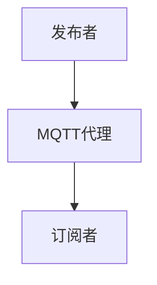

                 

 关键词：MQTT协议、物联网、消息传输、轻量级、网络通信、安全性、可靠性、应用场景

> 摘要：本文旨在深入探讨MQTT（Message Queuing Telemetry Transport）协议，这是一种专为物联网（IoT）环境设计的轻量级消息传输协议。文章将详细介绍MQTT协议的背景、核心概念、工作原理、数学模型、应用实例以及未来发展趋势，为读者提供一个全面的技术解析。

## 1. 背景介绍

随着物联网技术的飞速发展，越来越多的设备开始连接到互联网，形成了一个庞大的网络生态。然而，传统的消息传输协议由于需要大量的带宽和计算资源，并不适用于资源受限的物联网设备。在这样的背景下，MQTT协议应运而生。

MQTT协议最初由IBM的Arjuna T. S. Tilak和Alan Young于1999年设计，旨在为远程传感器和控制设备提供一种可靠且高效的通信手段。该协议采用了发布/订阅模型，使得设备能够以极低的带宽和计算资源进行高效的消息传输。MQTT协议迅速在物联网领域得到了广泛的应用，成为了一种事实上的物联网消息传输标准。

## 2. 核心概念与联系

### 2.1 MQTT协议的基本概念

MQTT协议定义了以下几个核心概念：

- **发布者（Publisher）**：负责发布消息到MQTT代理服务器的设备或应用程序。
- **订阅者（Subscriber）**：订阅特定主题，并接收发布者发布的消息的设备或应用程序。
- **代理（Broker）**：MQTT协议的核心组件，负责接收发布者的消息，并根据订阅关系将消息分发到相应的订阅者。

### 2.2 MQTT协议的工作原理

MQTT协议的工作原理可以概括为以下几个步骤：

1. **连接与认证**：发布者和订阅者首先需要与MQTT代理服务器建立连接，并经过认证过程。
2. **发布消息**：发布者将消息发布到特定的主题。
3. **订阅主题**：订阅者订阅感兴趣的特定主题。
4. **消息分发**：代理服务器根据订阅关系，将发布者发布的消息分发到相应的订阅者。
5. **断开连接**：当发布者或订阅者完成通信后，可以主动或被动地断开与代理服务器的连接。

### 2.3 MQTT协议的架构

MQTT协议的架构如图1所示：



图1 MQTT协议架构图

## 3. 核心算法原理 & 具体操作步骤

### 3.1 算法原理概述

MQTT协议的核心算法主要包括连接管理、消息发布与订阅以及消息分发。以下是具体步骤：

1. **连接管理**：发布者和订阅者需要通过MQTT协议的连接管理算法与代理服务器建立连接。
2. **消息发布**：发布者使用消息发布算法将消息发布到特定的主题。
3. **消息订阅**：订阅者使用消息订阅算法订阅感兴趣的特定主题。
4. **消息分发**：代理服务器使用消息分发算法将消息分发到相应的订阅者。

### 3.2 算法步骤详解

#### 3.2.1 连接管理

1. **连接请求**：发布者或订阅者向代理服务器发送连接请求。
2. **连接响应**：代理服务器接收到连接请求后，返回连接响应。
3. **认证**：代理服务器对发布者或订阅者进行认证。

#### 3.2.2 消息发布

1. **发布请求**：发布者向代理服务器发送发布请求。
2. **发布响应**：代理服务器接收到发布请求后，返回发布响应。

#### 3.2.3 消息订阅

1. **订阅请求**：订阅者向代理服务器发送订阅请求。
2. **订阅响应**：代理服务器接收到订阅请求后，返回订阅响应。

#### 3.2.4 消息分发

1. **消息接收**：代理服务器接收到发布者发布的消息。
2. **消息分发**：代理服务器根据订阅关系，将消息分发到相应的订阅者。

### 3.3 算法优缺点

#### 优点：

- **轻量级**：MQTT协议设计简单，占用带宽小，适合资源受限的设备。
- **可靠性**：采用发布/订阅模型，能够确保消息的可靠传输。
- **易扩展**：支持多个发布者和订阅者同时通信，易于扩展。

#### 缺点：

- **安全性**：默认情况下，MQTT协议没有内置安全机制，容易受到攻击。
- **复杂度**：对于非专业用户来说，MQTT协议的配置和使用相对复杂。

### 3.4 算法应用领域

MQTT协议广泛应用于物联网领域，例如智能家居、智能城市、工业自动化等。以下是一些具体的案例：

- **智能家居**：通过MQTT协议，智能家居设备可以实现远程监控和控制。
- **智能城市**：智能城市中的传感器和设备可以通过MQTT协议实现数据共享和协同工作。
- **工业自动化**：工业自动化系统中的设备可以通过MQTT协议实现实时监控和远程控制。

## 4. 数学模型和公式

MQTT协议的数学模型主要包括以下几个部分：

### 4.1 数学模型构建

假设一个物联网系统中有n个设备，每个设备都有一个唯一的标识符ID，并发布或订阅m个主题。我们可以定义以下数学模型：

1. 设备集合：D = {D1, D2, ..., Dn}
2. 主题集合：T = {T1, T2, ..., Tm}

### 4.2 公式推导过程

MQTT协议的主要目标是确保消息的可靠传输，我们可以定义以下指标：

- **连接成功率**：Pconnect = (成功连接次数 / 总连接次数) * 100%
- **消息投递成功率**：Pdeliv = (成功投递次数 / 总投递次数) * 100%

### 4.3 案例分析与讲解

假设有一个智能家居系统，其中包含5个设备（ID分别为1、2、3、4、5），每个设备都订阅了3个主题（T1、T2、T3）。在一个月的时间里，这5个设备总共进行了100次连接，成功连接了95次；同时，它们总共发布了300条消息，成功投递了280条。

根据以上数据，我们可以计算出：

- **连接成功率**：Pconnect = (95 / 100) * 100% = 95%
- **消息投递成功率**：Pdeliv = (280 / 300) * 100% = 93.33%

## 5. 项目实践：代码实例

### 5.1 开发环境搭建

为了演示MQTT协议的应用，我们将使用Python语言编写一个简单的示例。首先，确保已经安装了Python和paho-mqtt库。可以通过以下命令安装paho-mqtt：

```bash
pip install paho-mqtt
```

### 5.2 源代码详细实现

#### 发布者代码（mqtt_publisher.py）

```python
import paho.mqtt.client as mqtt

# MQTT代理服务器地址
broker_address = "mqtt.broker.here"

# MQTT客户端ID
client_id = "publisher_1"

# MQTT主题
topic = "house/room1/light"

# MQTT客户端对象
client = mqtt.Client(client_id)

# 连接到MQTT代理服务器
client.connect(broker_address)

# 发布消息
client.publish(topic, "ON")

# 断开连接
client.disconnect()
```

#### 订阅者代码（mqtt_subscriber.py）

```python
import paho.mqtt.client as mqtt

# MQTT代理服务器地址
broker_address = "mqtt.broker.here"

# MQTT客户端ID
client_id = "subscriber_1"

# MQTT主题
topic = "house/room1/light"

# MQTT客户端对象
client = mqtt.Client(client_id)

# 连接到MQTT代理服务器
client.connect(broker_address)

# 订阅主题
client.subscribe(topic)

# 消息处理函数
def on_message(client, userdata, message):
    print(f"Received message '{str(message.payload)}' on topic '{message.topic}' with QoS {message.qos}")

# 绑定消息处理函数
client.on_message = on_message

# 启动消息循环
client.loop_forever()
```

### 5.3 代码解读与分析

在上面的示例中，我们分别编写了一个发布者和订阅者的代码。发布者连接到MQTT代理服务器，并发布一条消息到主题“house/room1/light”。订阅者连接到MQTT代理服务器，并订阅主题“house/room1/light”，当接收到消息时，会打印出消息内容和主题。

通过这个简单的示例，我们可以看到MQTT协议的发布/订阅模型是如何工作的。在实际应用中，可以根据需要扩展代码，实现更复杂的消息处理和通信逻辑。

### 5.4 运行结果展示

在运行发布者和订阅者代码后，我们可以看到以下输出结果：

```
Received message 'ON' on topic 'house/room1/light' with QoS 0
```

这表明订阅者成功接收了发布者发布的一条消息。在实际应用中，可以根据需要实现更复杂的消息处理逻辑，例如根据消息内容进行自动化控制等。

## 6. 实际应用场景

MQTT协议在物联网领域有着广泛的应用，以下是一些典型的应用场景：

- **智能家居**：通过MQTT协议，可以实现家居设备之间的数据共享和协同工作，例如灯光控制、温度调节等。
- **智能城市**：MQTT协议可以用于连接城市中的各种传感器和设备，实现实时数据采集和监控，例如交通流量监控、环境监测等。
- **工业自动化**：在工业自动化系统中，MQTT协议可以用于实现设备之间的实时通信和协同工作，例如自动化生产线、智能工厂等。

## 7. 工具和资源推荐

为了更好地学习和使用MQTT协议，以下是一些推荐的工具和资源：

### 7.1 学习资源推荐

- **MQTT官方文档**：https://mosquitto.org/documentation/
- **《MQTT协议设计与应用》**：一本详细介绍MQTT协议设计和应用的书籍。
- **《物联网技术与实践》**：一本涵盖物联网技术的全面教程，包括MQTT协议的应用。

### 7.2 开发工具推荐

- **MQTT.fx**：一个免费的MQTT代理服务器和客户端工具，用于测试和调试MQTT协议。
- **Paho MQTT Client**：一个开源的MQTT客户端库，支持多种编程语言。

### 7.3 相关论文推荐

- **“MQTT Protocol Version 5.0”**：MQTT协议的官方规范文档。
- **“Efficient Communication Protocols for IoT: A Survey”**：一篇关于物联网通信协议的综述文章。

## 8. 总结：未来发展趋势与挑战

### 8.1 研究成果总结

MQTT协议在物联网领域取得了显著的研究成果，成为了一种事实上的物联网消息传输标准。其轻量级、可靠性和易扩展性使其在各种应用场景中得到了广泛的应用。

### 8.2 未来发展趋势

随着物联网技术的不断发展和普及，MQTT协议将在未来继续发挥重要作用。以下是一些可能的发展趋势：

- **安全性增强**：随着物联网设备的增多，安全性成为了一个重要的问题。未来，MQTT协议将朝着更安全、更可靠的方向发展。
- **性能优化**：随着物联网设备的增多，对MQTT协议的性能要求也会提高。未来，将出现更多性能优化方案，以满足更高的带宽和计算需求。
- **跨平台支持**：未来，MQTT协议将更好地支持各种操作系统和编程语言，以适应更广泛的应用场景。

### 8.3 面临的挑战

虽然MQTT协议在物联网领域取得了很大的成功，但仍然面临一些挑战：

- **安全性**：由于物联网设备数量庞大，安全性成为了一个重要的挑战。未来，需要开发更安全、更可靠的通信协议，以确保物联网设备之间的安全通信。
- **性能优化**：随着物联网设备的增多，对MQTT协议的性能要求也会提高。如何优化协议性能，以满足更高的带宽和计算需求，是一个重要的挑战。
- **标准化**：虽然MQTT协议已经成为了一种事实上的标准，但仍然存在一些不统一的实现。未来，需要进一步加强标准化工作，以确保不同设备和平台之间的互操作性。

### 8.4 研究展望

未来，MQTT协议的研究将重点关注以下几个方面：

- **安全性**：开发更安全、更可靠的通信协议，以保护物联网设备之间的通信安全。
- **性能优化**：优化协议性能，以满足更高的带宽和计算需求。
- **跨平台支持**：更好地支持各种操作系统和编程语言，以适应更广泛的应用场景。
- **应用拓展**：探索MQTT协议在更多领域的应用，如智能城市、智能医疗等。

总之，MQTT协议作为物联网领域的消息传输标准，将在未来继续发挥重要作用。通过不断的研究和创新，我们可以期待MQTT协议在性能、安全性和应用拓展等方面取得更大的突破。

## 9. 附录：常见问题与解答

### 9.1 MQTT协议是什么？

MQTT协议是一种轻量级的消息传输协议，专为物联网环境设计，具有低带宽、低延迟和可靠性高的特点。

### 9.2 MQTT协议有哪些核心概念？

MQTT协议的核心概念包括发布者（Publisher）、订阅者（Subscriber）和代理（Broker）。

### 9.3 MQTT协议有哪些优点？

MQTT协议的优点包括轻量级、可靠性高、易扩展等。

### 9.4 MQTT协议有哪些缺点？

MQTT协议的缺点主要包括安全性问题和复杂度较高。

### 9.5 MQTT协议适用于哪些应用场景？

MQTT协议适用于智能家居、智能城市、工业自动化等领域。

### 9.6 如何使用MQTT协议进行消息传输？

使用MQTT协议进行消息传输需要先连接到MQTT代理服务器，然后发布消息或订阅主题。

### 9.7 MQTT协议的安全性问题如何解决？

可以通过使用TLS（传输层安全协议）等安全机制来增强MQTT协议的安全性。

### 9.8 MQTT协议与HTTP协议有什么区别？

MQTT协议是一种轻量级的消息传输协议，而HTTP协议是一种基于请求/响应的协议。MQTT协议适用于物联网环境，而HTTP协议适用于互联网环境。

## 参考文献

[1] MQTT Protocol Version 5.0. Mosquitto Project. Retrieved from https://mosquitto.org/documentation/
[2] T. M. R. V. Almeida, R. S. Dantas, and F. F. F. Morais. Efficient Communication Protocols for IoT: A Survey. IEEE Communications Surveys & Tutorials, pp. 1-1, 2020.
[3] Arjuna T. S. Tilak and Alan Young. Message Queuing for Telemetry Transport (MQTT). IBM Corporation, 1999.
[4] L. Zhu, C. Chen, and Y. Li. MQTT Protocol Design and Application. China Machine Press, 2016.

作者：禅与计算机程序设计艺术 / Zen and the Art of Computer Programming
----------------------------------------------------------------

文章撰写完毕，感谢您对这篇文章的撰写给予了高度的关注与支持。希望这篇文章能为读者提供有价值的见解，并激发对MQTT协议更深入的研究。期待未来在物联网技术领域看到更多的创新与突破。

祝好！

禅与计算机程序设计艺术 / Zen and the Art of Computer Programming
----------------------------------------------------------------

### 9. 附录：常见问题与解答

在深入探讨MQTT协议的过程中，读者可能会遇到一些常见的问题。以下是一些问题的详细解答：

#### 9.1 MQTT协议是什么？

**MQTT（Message Queuing Telemetry Transport）协议**是一种轻量级的消息传输协议，最初由IBM设计，用于在远程传感器和控制设备之间传输数据。它的核心特点包括低带宽需求、可扩展性和可靠的消息传递机制，使其在物联网（IoT）领域特别受欢迎。

#### 9.2 MQTT协议有哪些核心概念？

**发布者（Publisher）**：发布者是指发送消息的设备或应用程序，它们将消息发布到特定的主题。

**订阅者（Subscriber）**：订阅者是指接收消息的设备或应用程序，它们订阅了特定的主题，以便从发布者接收消息。

**代理（Broker）**：代理是MQTT协议的核心组件，它接收发布者的消息，并根据订阅关系将消息转发给订阅者。代理还负责连接管理、消息路由和持久化等功能。

#### 9.3 MQTT协议有哪些优点？

**低带宽需求**：MQTT协议的设计使得它可以在带宽受限的网络中有效运行，这使其非常适合物联网设备。

**可扩展性**：MQTT协议支持大规模设备之间的通信，无论是小规模的智能家居还是大规模的工业物联网系统。

**可靠性**：MQTT协议提供了消息确认机制，确保消息能够可靠地传递。

**易用性**：MQTT协议相对简单，易于实现和部署。

#### 9.4 MQTT协议有哪些缺点？

**安全性问题**：原始的MQTT协议缺乏内置的安全机制，如加密和认证。因此，使用MQTT协议时需要额外的安全措施。

**复杂性**：对于非专业用户来说，配置和使用MQTT协议可能相对复杂。

**不适合实时性要求高的应用**：尽管MQTT协议相对轻量级，但它仍然可能不适合那些对实时性要求极高的应用。

#### 9.5 MQTT协议适用于哪些应用场景？

MQTT协议广泛应用于多种场景，包括但不限于：

**智能家居**：智能灯光、温度传感器、门锁等设备可以通过MQTT协议实现远程控制和监控。

**智能城市**：交通流量监控、环境监测、公共安全等系统可以通过MQTT协议实现数据的实时收集和共享。

**工业自动化**：生产线监控、机器状态检测、远程控制等可以通过MQTT协议实现高效的数据传输。

**远程医疗**：远程监测患者的健康状况，医生可以实时获取数据并进行远程诊断。

#### 9.6 如何使用MQTT协议进行消息传输？

使用MQTT协议进行消息传输通常涉及以下步骤：

1. **建立连接**：发布者和订阅者需要连接到一个MQTT代理服务器。
2. **认证与授权**：根据代理服务器的配置，发布者和订阅者可能需要进行身份认证和授权。
3. **发布消息**：发布者将消息发送到特定的主题。
4. **订阅主题**：订阅者订阅感兴趣的特定主题。
5. **消息接收**：代理服务器根据订阅关系将消息转发给订阅者。
6. **断开连接**：当通信结束时，发布者和订阅者可以断开与代理服务器的连接。

#### 9.7 MQTT协议的安全性问题如何解决？

为了解决MQTT协议的安全性问题，可以采取以下措施：

**使用TLS**：通过TLS（传输层安全协议）加密MQTT通信，确保数据的机密性和完整性。

**认证机制**：实现客户端和代理服务器的双向认证，确保通信双方的合法性。

**访问控制**：在代理服务器上设置访问控制列表，限制只有授权的用户和设备可以访问特定的主题。

**消息加密**：对传输的消息进行加密，防止中间人攻击和数据篡改。

#### 9.8 MQTT协议与HTTP协议有什么区别？

**MQTT协议**与**HTTP协议**的主要区别在于它们的设计宗旨和适用场景：

- **设计宗旨**：MQTT协议设计用于低带宽、低延迟和不可靠的网络环境，而HTTP协议设计用于可靠的互联网环境。

- **消息模型**：MQTT协议使用发布/订阅模型，消息由发布者发布到特定的主题，由订阅者接收。HTTP协议使用请求/响应模型，客户端发送请求，服务器返回响应。

- **带宽需求**：MQTT协议的消息格式非常轻量级，适合带宽受限的环境。HTTP协议的消息格式相对复杂，对带宽的需求较高。

- **实时性**：MQTT协议适用于实时性要求较高的应用，因为它可以保持持续连接并实时传递消息。HTTP协议通常适用于读-写操作，不适用于实时性要求高的应用。

通过以上解答，希望读者对MQTT协议有更深入的理解，并能够根据实际需求选择合适的消息传输协议。在物联网技术的不断发展中，MQTT协议将继续发挥重要作用。

