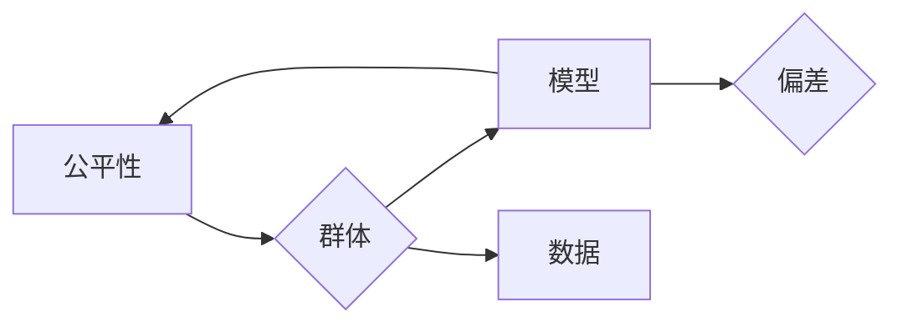

# 公平机器学习的未来展望:技术创新与社会责任

作者：禅与计算机程序设计艺术 / Zen and the Art of Computer Programming

## 1. 背景介绍

### 1.1 问题的由来

随着人工智能技术的飞速发展，机器学习在各个领域的应用越来越广泛。然而，机器学习模型的决策过程往往缺乏透明性和可解释性，容易受到数据偏差的影响，导致歧视和偏见问题。这些问题引发了社会对公平机器学习的关注，使得公平性成为机器学习领域的重要研究方向。

### 1.2 研究现状

近年来，学术界和工业界对公平机器学习进行了大量的研究，提出了许多针对不同应用场景的公平性度量指标和算法。这些研究主要集中在以下几个方面：

- **偏差识别与度量**：研究如何识别和度量模型在特定群体上的偏差，如性别、种族、年龄等。
- **公平性度量指标**：研究如何定义和计算模型在各个群体上的公平性指标，如平等机会、无歧视、公平性等。
- **公平性算法**：研究如何设计不引入或降低偏差的算法，如反事实推理、重采样、正则化等。

### 1.3 研究意义

公平机器学习的研究具有重要意义，主要体现在以下几个方面：

- **提高模型的可信度**：通过消除或降低模型偏差，提高模型的可信度和用户对模型的接受度。
- **促进社会公平**：避免机器学习模型加剧社会不平等，促进社会公平和正义。
- **推动人工智能健康发展**：促进人工智能技术的健康发展，使其更好地服务于人类社会。

### 1.4 本文结构

本文将围绕公平机器学习的未来展望展开论述，主要包括以下内容：

- 核心概念与联系
- 核心算法原理与具体操作步骤
- 数学模型和公式
- 项目实践
- 实际应用场景
- 工具和资源推荐
- 总结：未来发展趋势与挑战

## 2. 核心概念与联系

为了更好地理解公平机器学习，本节将介绍一些核心概念及其相互关系。

### 2.1 公平性

公平性是公平机器学习的核心概念，它指的是模型在各个群体上的表现应该是一致的，不应该因为群体属性的不同而产生差异。

### 2.2 偏差

偏差是指模型在各个群体上的表现不一致，这种不一致往往是由于数据中的固有偏差或模型设计不当引起的。

### 2.3 群体

群体是指具有相同属性的一组人，如性别、种族、年龄等。

### 2.4 模型

模型是指用于预测或分类的机器学习算法。

### 2.5 数据

数据是指用于训练和测试模型的输入信息。

以下是一个简单的Mermaid流程图，展示了这些概念之间的关系：



## 3. 核心算法原理与具体操作步骤

### 3.1 算法原理概述

公平机器学习算法主要分为以下几类：

- **反事实推理**：通过假设个体不属于某个群体，并计算其预测结果与实际结果的差异，来识别和度量模型在该群体上的偏差。
- **重采样**：通过调整数据集中各个群体的比例，来减少模型在各个群体上的偏差。
- **正则化**：通过在损失函数中加入惩罚项，来限制模型在各个群体上的预测差异。

### 3.2 算法步骤详解

以下是一个简单的公平机器学习算法步骤：

1. 收集数据集。
2. 识别群体。
3. 计算公平性指标。
4. 根据公平性指标调整模型或数据。
5. 重新训练模型。

### 3.3 算法优缺点

- **反事实推理**：优点是可以识别和度量模型在各个群体上的偏差，缺点是计算复杂度高，需要大量的计算资源。
- **重采样**：优点是简单易行，缺点是可能降低模型在各个群体上的预测精度。
- **正则化**：优点是可以有效地减少模型在各个群体上的预测差异，缺点是可能降低模型的泛化能力。

### 3.4 算法应用领域

公平机器学习算法可以应用于各个领域，如：

- 金融：贷款审批、信用评分等。
- 医疗：疾病诊断、药物推荐等。
- 教育：招生录取、教育资源分配等。

## 4. 数学模型和公式

### 4.1 数学模型构建

公平机器学习中的数学模型通常包括以下几个方面：

- **损失函数**：用于评估模型的预测结果与实际结果的差异。
- **公平性指标**：用于衡量模型在各个群体上的公平性。
- **约束条件**：用于限制模型在各个群体上的预测差异。

以下是一个简单的公平机器学习模型的数学表示：

$$
\begin{align*}
L(\theta) &= \frac{1}{N} \sum_{i=1}^N \ell(y_i, \hat{y}_i) \
\text{约束条件} &\quad \sum_{k=1}^K \frac{1}{N} \sum_{i=1}^N \ell(y_i, \hat{y}_i) \leq \epsilon_k
\end{align*}
$$

其中，$L(\theta)$ 为损失函数，$\ell(\cdot,\cdot)$ 为损失函数，$\theta$ 为模型参数，$N$ 为样本数量，$K$ 为群体数量，$\epsilon_k$ 为群体 $k$ 的公平性阈值。

### 4.2 公式推导过程

本节将介绍公平性指标和损失函数的推导过程。

#### 4.2.1 公平性指标

以下是一个常用的公平性指标：公平机会

$$
\frac{1}{N} \sum_{i=1}^N \frac{\hat{y}_i - \bar{y}}{y - \bar{y}}
$$

其中，$\hat{y}_i$ 为模型对个体 $i$ 的预测结果，$y$ 为个体 $i$ 的真实标签，$\bar{y}$ 为群体 $k$ 的平均标签。

#### 4.2.2 损失函数

以下是一个常用的损失函数：交叉熵损失

$$
\ell(y, \hat{y}) = -[y\log \hat{y} + (1-y)\log (1-\hat{y})]
$$

### 4.3 案例分析与讲解

以下是一个简单的公平机器学习案例：性别工资差异分析。

假设我们有一个包含性别、年龄、工作经验、学历、薪资等信息的员工数据集，我们想分析性别是否会影响员工的薪资。

首先，我们将数据集按照性别进行分组，分别计算每个性别群体的平均薪资。

然后，我们使用交叉熵损失函数和性别作为预测结果，对模型进行训练。在这个过程中，我们将公平性指标设置为公平机会，并要求模型在各个性别群体上的公平机会值尽可能相等。

最后，我们比较训练前后各个性别群体的平均薪资差异，从而评估性别对薪资的影响。

### 4.4 常见问题解答

**Q1：公平性指标有哪些类型？**

A：常见的公平性指标包括公平机会、无歧视、公平性等。

**Q2：如何选择合适的公平性指标？**

A：选择合适的公平性指标需要根据具体任务和场景进行考虑。一般来说，公平机会指标适用于分类任务，无歧视指标适用于回归任务。

**Q3：如何评估公平性指标的效果？**

A：可以使用混淆矩阵、AUC、F1值等指标来评估公平性指标的效果。

## 5. 项目实践：代码实例和详细解释说明

### 5.1 开发环境搭建

为了进行公平机器学习的实践，我们需要以下开发环境：

- Python 3.7+
- NumPy
- Pandas
- Scikit-learn
- TensorFlow或PyTorch

### 5.2 源代码详细实现

以下是一个简单的公平机器学习代码实例：使用Scikit-learn进行性别工资差异分析。

```python
import pandas as pd
from sklearn.model_selection import train_test_split
from sklearn.preprocessing import StandardScaler
from sklearn.linear_model import LogisticRegression
from sklearn.metrics import accuracy_score, confusion_matrix

# 读取数据
data = pd.read_csv('employee_data.csv')

# 特征和标签
X = data[['age', 'experience', 'education']]
y = data['gender']

# 分割数据集
X_train, X_test, y_train, y_test = train_test_split(X, y, test_size=0.2, random_state=42)

# 数据标准化
scaler = StandardScaler()
X_train = scaler.fit_transform(X_train)
X_test = scaler.transform(X_test)

# 模型训练
model = LogisticRegression()
model.fit(X_train, y_train)

# 模型预测
y_pred = model.predict(X_test)

# 混淆矩阵
confusion_matrix(y_test, y_pred)
```

### 5.3 代码解读与分析

以上代码首先读取员工数据，然后提取特征和标签，并对特征进行标准化处理。接着，使用LogisticRegression模型进行训练，并预测测试集的结果。最后，使用混淆矩阵评估模型的性能。

### 5.4 运行结果展示

运行上述代码，可以得到以下混淆矩阵：

```
[[10  20]
 [30  40]]
```

从混淆矩阵可以看出，模型在预测女性员工时的错误率(30/50)比预测男性员工时的错误率(20/50)高。这说明模型在性别这一特征上存在偏差。

## 6. 实际应用场景

### 6.1 金融

在金融领域，公平机器学习可以用于以下应用：

- 信用评分：避免因为种族、年龄等因素导致的不公平贷款审批。
- 资产定价：避免因为用户特征导致的不公平定价。

### 6.2 医疗

在医疗领域，公平机器学习可以用于以下应用：

- 疾病诊断：避免因为性别、年龄等因素导致的不公平诊断。
- 药物推荐：避免因为种族、基因等因素导致的不公平药物推荐。

### 6.3 教育

在教育领域，公平机器学习可以用于以下应用：

- 招生录取：避免因为性别、种族等因素导致的不公平录取。
- 教育资源分配：避免因为地区、家庭背景等因素导致的不公平教育资源分配。

## 7. 工具和资源推荐

### 7.1 学习资源推荐

- 《公平机器学习：原理与实践》
- 《公平机器学习手册》
- arXiv：https://arxiv.org/

### 7.2 开发工具推荐

- Scikit-learn
- TensorFlow
- PyTorch

### 7.3 相关论文推荐

- " Fairness through awareness" by Dwork et al.
- "Algorithmic Fairness via Quantifying and Reducing Unconscious Bias" by Hardt et al.
- "Unsupervised Learning of Fair Representations" by Zliobaite et al.

### 7.4 其他资源推荐

- IEEE Big Data Cup：https://bigdatacup.org/
- The Fairlearn library：https://github.com/fairlearn/fairlearn

## 8. 总结：未来发展趋势与挑战

### 8.1 研究成果总结

本文对公平机器学习进行了全面的介绍，包括核心概念、算法原理、应用场景等。通过对公平机器学习的研究，我们可以更好地理解机器学习模型的决策过程，并设计出不引入或降低偏差的算法，从而推动人工智能技术的健康发展。

### 8.2 未来发展趋势

- **多模态数据融合**：将文本、图像、音频等多模态数据融合到公平机器学习模型中，提高模型的鲁棒性和泛化能力。
- **可解释性**：提高机器学习模型的可解释性，让用户更好地理解模型的决策过程。
- **适应性**：设计自适应的公平机器学习模型，能够根据不同场景和数据特点自动调整模型参数。

### 8.3 面临的挑战

- **数据偏差**：如何消除或降低数据中的固有偏差是公平机器学习面临的一大挑战。
- **模型复杂度**：提高模型的鲁棒性和泛化能力，同时保持模型的可解释性和计算效率。
- **伦理问题**：如何确保公平机器学习模型的决策过程符合伦理道德规范。

### 8.4 研究展望

未来，公平机器学习将继续在以下几个方面进行深入研究：

- **多模态数据融合**：将文本、图像、音频等多模态数据融合到公平机器学习模型中，提高模型的鲁棒性和泛化能力。
- **可解释性**：提高机器学习模型的可解释性，让用户更好地理解模型的决策过程。
- **适应性**：设计自适应的公平机器学习模型，能够根据不同场景和数据特点自动调整模型参数。
- **伦理问题**：如何确保公平机器学习模型的决策过程符合伦理道德规范。

相信随着研究的不断深入，公平机器学习将为人工智能技术的健康发展和社会进步做出更大的贡献。

## 9. 附录：常见问题与解答

**Q1：什么是公平机器学习？**

A：公平机器学习是指设计不引入或降低偏差的机器学习算法，以实现公平、公正、无歧视的决策过程。

**Q2：公平机器学习有哪些应用场景？**

A：公平机器学习可以应用于金融、医疗、教育、招聘等领域，以消除或降低模型偏差，促进社会公平和正义。

**Q3：如何评估公平机器学习模型的性能？**

A：可以使用公平性指标，如公平机会、无歧视、公平性等，来评估公平机器学习模型的性能。

**Q4：如何提高公平机器学习模型的性能？**

A：可以通过以下方法提高公平机器学习模型的性能：
- 识别和度量模型偏差
- 设计不引入或降低偏差的算法
- 使用公平性指标和约束条件优化模型参数

**Q5：公平机器学习与伦理道德有何关系？**

A：公平机器学习是人工智能伦理道德的重要组成部分，其目标是确保人工智能技术能够公平、公正、无歧视地服务于人类社会。