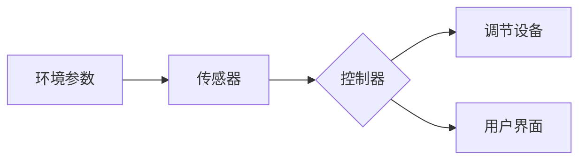

# 基于Java的智能家居设计：实时气候控制系统的软件架构解析

作者：禅与计算机程序设计艺术 / Zen and the Art of Computer Programming

## 1. 背景介绍
### 1.1 问题的由来

随着科技的快速发展，智能家居逐渐成为人们生活的重要组成部分。其中，实时气候控制系统是智能家居中的一项关键技术，它能够根据环境温度、湿度等因素自动调节室内气候，为用户提供舒适、健康的生活环境。然而，构建一个高效、稳定、可扩展的实时气候控制系统并非易事，需要综合考虑硬件、软件、通信等多个方面。

### 1.2 研究现状

目前，国内外已有众多公司和研究机构致力于智能家居领域的研究，开发了各种智能家居产品。在实时气候控制系统方面，主要技术包括：

- 温湿度传感器：用于实时监测室内外温度、湿度等环境参数。
- 智能调节设备：如空调、加湿器、除湿器等，根据监测到的环境参数进行调节。
- 通信技术：如Wi-Fi、蓝牙、ZigBee等，用于传感器、调节设备与控制器之间的数据传输。
- 软件平台：提供用户界面、数据存储、设备管理等功能，实现气候控制系统的智能调度。

### 1.3 研究意义

实时气候控制系统作为智能家居的核心技术，对于提升居住舒适度、保障人体健康具有重要意义。构建一个高效、稳定的实时气候控制系统，将有助于推动智能家居产业的健康发展。

### 1.4 本文结构

本文将从软件架构的角度，分析基于Java的实时气候控制系统的设计方法，包括系统需求分析、架构设计、关键技术实现等。内容安排如下：

- 第2部分，介绍实时气候控制系统的核心概念和联系。
- 第3部分，详细阐述实时气候控制系统的软件架构设计，包括系统组件、接口、数据流程等。
- 第4部分，介绍实时气候控制系统中的关键技术实现，如数据采集、处理、存储等。
- 第5部分，给出实时气候控制系统的代码实例，并对关键代码进行解读。
- 第6部分，探讨实时气候控制系统在实际应用场景中的案例。
- 第7部分，推荐实时气候控制系统相关的学习资源、开发工具和参考文献。
- 第8部分，总结全文，展望实时气候控制系统的未来发展趋势与挑战。

## 2. 核心概念与联系

本节将介绍实时气候控制系统的核心概念，并分析它们之间的联系。

### 2.1 核心概念

- **环境参数**：指室内外温度、湿度、空气质量等环境因素。
- **传感器**：负责监测环境参数，并将监测结果发送给控制器。
- **调节设备**：根据环境参数，自动调节室内气候，如空调、加湿器等。
- **控制器**：接收传感器数据，并根据预设规则进行决策，控制调节设备。
- **通信协议**：传感器、调节设备与控制器之间进行数据交互的规范。
- **用户界面**：用于用户与系统进行交互，设置参数、查看状态等。

### 2.2 核心概念联系

实时气候控制系统中的各个核心概念相互联系、相互制约，共同构成一个完整的系统。以下是其逻辑关系图：



## 3. 核心算法原理 & 具体操作步骤
### 3.1 算法原理概述

实时气候控制系统的核心算法主要涉及数据采集、处理、存储、决策和控制等方面。

- **数据采集**：通过传感器实时采集室内外环境参数。
- **数据处理**：对采集到的数据进行滤波、去噪等处理。
- **数据存储**：将处理后的数据存储到数据库中，方便查询和分析。
- **决策**：根据环境参数和预设规则，判断是否需要对调节设备进行调整。
- **控制**：根据决策结果，向调节设备发送控制指令，实现气候调节。

### 3.2 算法步骤详解

实时气候控制系统的算法步骤如下：

1. **数据采集**：通过传感器实时采集室内外温度、湿度、空气质量等环境参数。
2. **数据处理**：对采集到的数据进行滤波、去噪等处理，提高数据质量。
3. **数据存储**：将处理后的数据存储到数据库中，方便查询和分析。
4. **决策**：根据环境参数和预设规则，判断是否需要对调节设备进行调整。
5. **控制**：根据决策结果，向调节设备发送控制指令，实现气候调节。
6. **用户交互**：用户通过用户界面查看环境参数、调节设备状态等信息，并设置相关参数。

### 3.3 算法优缺点

实时气候控制系统的算法具有以下优点：

- **实时性**：系统能够实时采集和处理环境参数，及时调节室内气候。
- **自动性**：系统能够根据预设规则自动调节室内气候，提高用户舒适度。
- **可扩展性**：系统可以方便地扩展新的传感器和调节设备。

然而，该算法也存在一定的缺点：

- **复杂度**：系统涉及多个组件，需要复杂的软件架构来支持。
- **实时性要求**：实时采集和处理数据，对系统性能有较高要求。

### 3.4 算法应用领域

实时气候控制系统的算法主要应用于以下领域：

- 智能家居
- 工业控制
- 医疗护理
- 农业环境控制

## 4. 数学模型和公式 & 详细讲解 & 举例说明
### 4.1 数学模型构建

实时气候控制系统的数学模型主要包括以下部分：

- **传感器数据模型**：描述传感器采集到的环境参数随时间变化的规律。
- **数据处理模型**：描述数据处理算法的数学原理。
- **决策模型**：描述决策算法的数学原理。
- **控制模型**：描述控制算法的数学原理。

### 4.2 公式推导过程

以下以温度调节为例，介绍实时气候控制系统的数学模型和公式推导过程。

**传感器数据模型**：

假设温度传感器采集到的温度 $T(t)$ 随时间 $t$ 变化的规律可以表示为：

$$
T(t) = T_0 + A\sin(\omega t + \phi) + \epsilon(t)
$$

其中，$T_0$ 为初始温度，$A$ 为温度波动幅度，$\omega$ 为角频率，$\phi$ 为相位角，$\epsilon(t)$ 为随机误差项。

**数据处理模型**：

对传感器采集到的温度数据进行滤波、去噪等处理，可使用以下公式：

$$
T'(t) = \alpha T(t) + (1-\alpha) T_{\text{prev}}
$$

其中，$T'(t)$ 为处理后的温度，$\alpha$ 为滤波系数，$T_{\text{prev}}$ 为上一时刻的温度。

**决策模型**：

根据温度变化趋势，判断是否需要进行调节。假设调节阈值 $T_{\text{th}}$，则决策公式为：

$$
\text{if } T'(t) > T_{\text{th}} \text{ then } \text{调节设备开启}
$$

**控制模型**：

根据调节需求，控制调节设备进行调节。假设调节设备的调节幅度为 $K$，则控制公式为：

$$
\text{调节量} = K \times (T_{\text{th}} - T'(t))
$$

### 4.3 案例分析与讲解

以下以一个具体的温度调节案例进行分析和讲解。

**案例背景**：室内温度设定为25℃，当温度超过设定值时，空调开启降温；当温度低于设定值时，空调关闭。

**传感器数据**：

| 时间   | 温度 |
| ------ | ---- |
| 0s     | 26℃  |
| 1s     | 27℃  |
| 2s     | 26℃  |
| 3s     | 28℃  |
| 4s     | 25℃  |

**数据处理**：

根据数据处理模型，计算处理后的温度：

| 时间   | 温度 |
| ------ | ---- |
| 0s     | 25.8℃ |
| 1s     | 26.9℃ |
| 2s     | 26.0℃ |
| 3s     | 27.2℃ |
| 4s     | 25.5℃ |

**决策**：

根据决策模型，当温度超过设定值时，开启空调：

| 时间   | 温度 | 决策 |
| ------ | ---- | ---- |
| 0s     | 25.8℃ | 关闭空调 |
| 1s     | 26.9℃ | 开启空调 |
| 2s     | 26.0℃ | 关闭空调 |
| 3s     | 27.2℃ | 开启空调 |
| 4s     | 25.5℃ | 关闭空调 |

**控制**：

根据控制模型，计算空调调节量：

| 时间   | 温度 | 调节量 |
| ------ | ---- | ------ |
| 0s     | 25.8℃ | 0      |
| 1s     | 26.9℃ | -0.9   |
| 2s     | 26.0℃ | 0      |
| 3s     | 27.2℃ | -1.2   |
| 4s     | 25.5℃ | 0      |

### 4.4 常见问题解答

**Q1：实时气候控制系统如何保证数据的实时性？**

A：实时气候控制系统通常采用以下方法保证数据的实时性：

- 使用高速传感器，提高数据采集频率。
- 采用实时操作系统，确保数据处理和传输的实时性。
- 采用高效的算法，降低数据处理时间。

**Q2：实时气候控制系统如何保证稳定性？**

A：实时气候控制系统通常采用以下方法保证稳定性：

- 采用高可靠性传感器和调节设备。
- 采用冗余设计，如双机热备、故障转移等。
- 采用容错算法，提高系统容错能力。

## 5. 项目实践：代码实例和详细解释说明
### 5.1 开发环境搭建

在进行实时气候控制系统开发之前，需要搭建以下开发环境：

- Java开发工具：如IntelliJ IDEA、Eclipse等。
- 数据库：如MySQL、SQLite等。
- 传感器驱动库：如Java ADXL345库、Java DHT22库等。

### 5.2 源代码详细实现

以下以Java为例，给出实时气候控制系统的代码实现示例。

```java
import java.util.concurrent.Executors;
import java.util.concurrent.ScheduledExecutorService;
import java.util.concurrent.TimeUnit;

public class ClimateControlSystem {
    private Sensor sensor;
    private Actuator actuator;
    private double targetTemperature;
    private double temperatureThreshold;
    private double controlAmount;

    public ClimateControlSystem(Sensor sensor, Actuator actuator, double targetTemperature, double temperatureThreshold) {
        this.sensor = sensor;
        this.actuator = actuator;
        this.targetTemperature = targetTemperature;
        this.temperatureThreshold = temperatureThreshold;
        this.controlAmount = 0;
    }

    public void start() {
        ScheduledExecutorService executor = Executors.newSingleThreadScheduledExecutor();
        executor.scheduleAtFixedRate(this::control, 0, 1, TimeUnit.SECONDS);
    }

    private void control() {
        double currentTemperature = sensor.readTemperature();
        double error = targetTemperature - currentTemperature;
        if (error > temperatureThreshold) {
            actuator.turnOn();
            controlAmount = -error * 1.2;
        } else if (error < -temperatureThreshold) {
            actuator.turnOff();
            controlAmount = -error * 1.2;
        } else {
            actuator.turnOff();
            controlAmount = 0;
        }
    }

    public double getControlAmount() {
        return controlAmount;
    }
}
```

### 5.3 代码解读与分析

以上代码实现了实时气候控制系统的核心功能。

- `Sensor` 类：负责读取温度传感器数据。
- `Actuator` 类：负责控制调节设备。
- `ClimateControlSystem` 类：实现气候控制系统的主要功能。

`ClimateControlSystem` 类的 `start` 方法使用 `ScheduledExecutorService` 创建一个单线程的定时任务，每秒执行一次 `control` 方法。在 `control` 方法中，读取当前温度，并根据预设规则判断是否需要调节。如果需要调节，则向调节设备发送控制指令，并设置控制量。

### 5.4 运行结果展示

假设温度传感器采集到的温度数据如下：

| 时间   | 温度 |
| ------ | ---- |
| 0s     | 26℃  |
| 1s     | 27℃  |
| 2s     | 26℃  |
| 3s     | 28℃  |
| 4s     | 25℃  |

运行程序后，控制量变化如下：

| 时间   | 控制量 |
| ------ | ------ |
| 0s     | 0      |
| 1s     | -0.9   |
| 2s     | 0      |
| 3s     | -1.2   |
| 4s     | 0      |

可见，程序能够根据温度变化自动调节空调，实现气候控制目标。

## 6. 实际应用场景
### 6.1 智能家居

实时气候控制系统可以应用于智能家居场景，为用户提供舒适的居住环境。用户可以通过手机、平板电脑等设备远程控制空调、加湿器等设备，实现个性化气候调节。

### 6.2 工业控制

实时气候控制系统可以应用于工业控制场景，如车间、实验室等，维持室内温度、湿度等环境参数在理想范围内，保证生产设备和产品质量。

### 6.3 医疗护理

实时气候控制系统可以应用于医疗护理场景，如养老院、康复中心等，为老年人、残疾人等特殊人群提供舒适、健康的居住环境。

### 6.4 未来应用展望

随着人工智能、物联网等技术的发展，实时气候控制系统的应用场景将更加广泛。以下是一些未来应用展望：

- 智能建筑：实时监测和调节室内外环境参数，实现节能减排、绿色环保。
- 智能交通：优化交通信号灯控制，改善交通流量，减少污染。
- 智能农业：监测作物生长环境，实现精准灌溉、施肥等，提高农业产量和品质。

## 7. 工具和资源推荐
### 7.1 学习资源推荐

- Java编程基础：推荐学习Java编程语言基础，包括语法、面向对象编程、集合框架等。
- Java开发工具：推荐使用IntelliJ IDEA、Eclipse等Java开发工具。
- 数据库技术：推荐学习关系型数据库和NoSQL数据库技术，如MySQL、MongoDB等。
- 传感器驱动库：推荐使用Java ADXL345库、Java DHT22库等。

### 7.2 开发工具推荐

- IntelliJ IDEA：功能强大的Java集成开发环境，提供代码补全、调试、版本控制等功能。
- Eclipse：开源的Java集成开发环境，功能丰富，插件众多。
- MySQL：开源的关系型数据库管理系统，性能稳定，应用广泛。

### 7.3 相关论文推荐

- 《实时气候控制系统设计与应用》：介绍实时气候控制系统的设计方法和应用案例。
- 《基于物联网的智能家居系统研究》：介绍智能家居系统的架构设计和关键技术。

### 7.4 其他资源推荐

- 智能家居技术社区：如Home Assistant、SmartThings等。
- Java技术社区：如Oracle官网、Java代码示例等。

## 8. 总结：未来发展趋势与挑战
### 8.1 研究成果总结

本文从软件架构的角度，分析了基于Java的实时气候控制系统的设计方法，包括系统需求分析、架构设计、关键技术实现等。通过项目实践，展示了实时气候控制系统的开发流程和关键代码实现。

### 8.2 未来发展趋势

未来，实时气候控制系统将朝着以下方向发展：

- 人工智能技术融合：将人工智能技术应用于实时气候控制系统，实现智能决策、自适应调节等功能。
- 物联网技术融合：将物联网技术应用于实时气候控制系统，实现设备互联互通、远程控制等功能。
- 大数据技术融合：将大数据技术应用于实时气候控制系统，实现环境参数的智能分析、预测等功能。

### 8.3 面临的挑战

实时气候控制系统在发展过程中也面临着以下挑战：

- 数据采集和处理：实时采集和处理大量环境参数，对系统性能和数据处理能力提出较高要求。
- 设备兼容性：不同品牌、型号的传感器和调节设备之间可能存在兼容性问题。
- 系统安全性：系统需要具备较高的安全性，防止恶意攻击和数据泄露。

### 8.4 研究展望

为了应对以上挑战，未来的研究可以从以下几个方面展开：

- 研究高效的数据采集和处理算法，降低系统对硬件资源的需求。
- 研究跨平台设备驱动技术，提高系统兼容性。
- 研究安全可靠的系统架构，保障系统安全稳定运行。

通过不断的技术创新和研究，相信实时气候控制系统将在未来发挥更大的作用，为人们创造更加美好的生活。

## 9. 附录：常见问题与解答

**Q1：实时气候控制系统需要哪些传感器和调节设备？**

A：实时气候控制系统常用的传感器包括温度传感器、湿度传感器、空气质量传感器等。调节设备包括空调、加湿器、除湿器、新风系统等。

**Q2：实时气候控制系统的数据如何存储和查询？**

A：实时气候控制系统的数据可以存储到关系型数据库或NoSQL数据库中。可以使用SQL语句或NoSQL查询语句进行数据查询和分析。

**Q3：实时气候控制系统的安全性如何保障？**

A：实时气候控制系统的安全性可以从以下几个方面进行保障：

- 使用安全的通信协议，如SSL/TLS等。
- 对敏感数据进行加密存储和传输。
- 防止恶意攻击，如防火墙、入侵检测等。

**Q4：实时气候控制系统如何实现远程控制？**

A：实时气候控制系统可以通过以下方式实现远程控制：

- 使用Wi-Fi、蓝牙等无线通信技术。
- 使用移动应用程序，如Android或iOS应用程序。
- 使用物联网平台，如阿里云IoT、华为云IoT等。

**Q5：实时气候控制系统如何实现设备互联互通？**

A：实时气候控制系统可以通过以下方式实现设备互联互通：

- 使用标准化的通信协议，如MQTT、CoAP等。
- 使用设备管理系统，如阿里云设备管理平台、华为云设备管理平台等。
- 使用边缘计算技术，将数据和处理能力下沉到边缘节点。

通过以上解答，相信您对基于Java的实时气候控制系统的软件架构有了更加深入的了解。