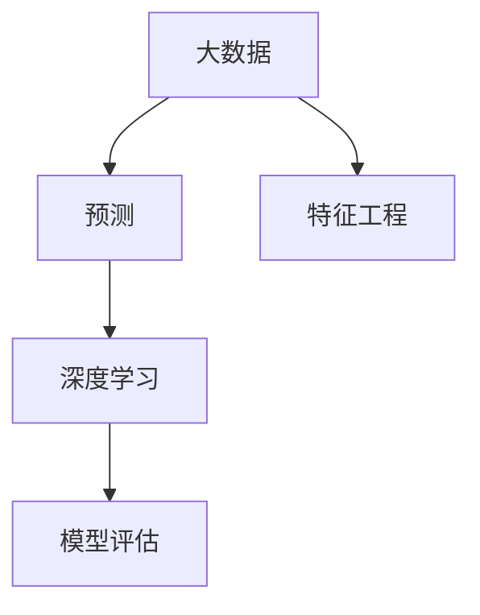

# 基于深度学习的大数据预测方法

作者：禅与计算机程序设计艺术 / Zen and the Art of Computer Programming

## 1. 背景介绍
### 1.1 问题的由来

随着大数据时代的到来，如何从海量数据中提取有价值的信息并做出准确的预测，成为了一个重要的课题。传统统计方法在处理大规模数据时往往存在效率和精度上的瓶颈，而深度学习技术凭借其强大的特征提取和表达能力，在预测领域取得了显著的成果。本文将探讨基于深度学习的大数据预测方法，分析其原理、算法、实践应用以及面临的挑战。

### 1.2 研究现状

深度学习在预测领域的研究已经取得了丰硕的成果，包括时间序列预测、图像识别、文本分类、推荐系统等。近年来，随着计算能力的提升和数据量的爆炸式增长，深度学习模型在各个领域的应用越来越广泛。

### 1.3 研究意义

基于深度学习的大数据预测方法具有以下研究意义：

1. 提高预测精度：深度学习模型能够自动提取复杂特征，提高预测精度。
2. 适应性强：深度学习模型能够适应不同类型的数据和任务，具有较强的泛化能力。
3. 提高效率：深度学习模型可以并行计算，提高预测效率。
4. 降低成本：深度学习模型可以自动化处理数据，降低人力成本。

### 1.4 本文结构

本文将按照以下结构展开：

- 第2部分，介绍大数据预测中涉及的核心概念和联系。
- 第3部分，详细阐述基于深度学习的大数据预测方法原理、算法和步骤。
- 第4部分，分析深度学习在预测领域的应用案例。
- 第5部分，探讨深度学习预测方法在实际应用中面临的挑战和解决方案。
- 第6部分，总结全文，展望深度学习预测技术的未来发展趋势。
- 第7部分，推荐相关学习资源、开发工具和参考文献。
- 第8部分，总结全文，展望深度学习预测技术的未来发展趋势。

## 2. 核心概念与联系

为更好地理解基于深度学习的大数据预测方法，本节将介绍几个密切相关的核心概念：

- 大数据（Big Data）：指规模巨大、类型多样的数据集合，无法用传统数据处理技术进行处理。
- 预测（Prediction）：根据历史数据对未来事件或趋势进行预测。
- 深度学习（Deep Learning）：一种基于人工神经网络的机器学习技术，通过多层非线性变换提取特征，实现复杂模式识别。
- 特征工程（Feature Engineering）：通过对原始数据进行预处理、转换和组合，提取对预测任务有用的特征。
- 模型评估（Model Evaluation）：通过评估指标衡量模型的性能，如准确率、召回率、F1值等。

它们之间的逻辑关系如下图所示：



可以看出，大数据是预测任务的基础，深度学习是进行预测的主要技术手段，特征工程和模型评估则分别从数据准备和性能评估两个方面支撑预测任务的完成。

## 3. 核心算法原理 & 具体操作步骤
### 3.1 算法原理概述

基于深度学习的大数据预测方法主要包括以下几个步骤：

1. 数据收集与预处理：收集相关领域的原始数据，并进行清洗、转换和特征提取等预处理操作。
2. 模型选择与训练：根据任务类型选择合适的深度学习模型，并使用预处理后的数据进行训练。
3. 模型评估与优化：通过评估指标评估模型的性能，并根据评估结果调整模型参数，优化模型性能。
4. 预测与部署：使用训练好的模型对新的数据进行预测，并将预测结果应用到实际场景中。

### 3.2 算法步骤详解

#### 数据收集与预处理

数据收集与预处理是预测任务的基础，主要包括以下步骤：

1. 数据清洗：去除数据中的错误、缺失值、异常值等。
2. 数据转换：将非数值型数据转换为数值型数据，如使用独热编码、标签编码等。
3. 特征提取：从原始数据中提取对预测任务有用的特征，如使用TF-IDF、Word2Vec等。
4. 特征选择：选择对预测任务影响最大的特征，提高模型性能。

#### 模型选择与训练

根据任务类型选择合适的深度学习模型，并进行训练。以下是一些常用的深度学习模型：

- 线性回归：用于回归任务，预测连续值。
- 逻辑回归：用于分类任务，预测二分类结果。
- 卷积神经网络（CNN）：用于图像识别、语音识别等任务，能够提取局部特征。
- 循环神经网络（RNN）及其变体：用于序列数据，能够捕捉时间序列中的时间依赖关系。
- 自编码器（Autoencoder）：用于降维、去噪、特征提取等任务。
- 变分自编码器（VAE）：用于生成模型，能够生成与训练数据相似的样本。

#### 模型评估与优化

通过评估指标评估模型的性能，并根据评估结果调整模型参数，优化模型性能。常用的评估指标包括：

- 准确率（Accuracy）：正确预测的样本数量占总样本数量的比例。
- 召回率（Recall）：正确预测的阳性样本数量占所有阳性样本数量的比例。
- F1值（F1 Score）：准确率和召回率的调和平均值。
- 精确率（Precision）：正确预测的阳性样本数量占所有预测为阳性的样本数量的比例。
- 平均绝对误差（MAE）：预测值与真实值之间的平均绝对差。
- 均方误差（MSE）：预测值与真实值之间的平均平方差。

#### 预测与部署

使用训练好的模型对新的数据进行预测，并将预测结果应用到实际场景中。预测结果可以用于：

- 决策支持：如股票交易、信贷评估等。
- 客户关系管理：如个性化推荐、流失预测等。
- 运营优化：如库存管理、产能规划等。

### 3.3 算法优缺点

基于深度学习的大数据预测方法具有以下优点：

- 高精度：深度学习模型能够自动提取复杂特征，提高预测精度。
- 适应性强：深度学习模型能够适应不同类型的数据和任务，具有较强的泛化能力。
- 自动化：深度学习模型可以自动化处理数据，提高效率。

然而，基于深度学习的大数据预测方法也存在以下缺点：

- 计算复杂度高：深度学习模型的训练需要大量的计算资源。
- 数据依赖性强：深度学习模型的性能依赖于训练数据的质量和数量。
- 可解释性差：深度学习模型的决策过程通常缺乏可解释性。
- 模型泛化能力有限：深度学习模型在面对与训练数据分布差异较大的数据时，性能可能下降。

### 3.4 算法应用领域

基于深度学习的大数据预测方法在各个领域都有广泛的应用，以下是一些典型的应用场景：

- 金融领域：如股票交易、信贷评估、风险评估等。
- 零售领域：如个性化推荐、价格预测、库存管理等。
- 医疗领域：如疾病预测、药物研发、患者管理等。
- 交通领域：如交通流量预测、路线规划、智能交通系统等。
- 能源领域：如电力负荷预测、能源需求预测等。

## 4. 数学模型和公式 & 详细讲解 & 举例说明
### 4.1 数学模型构建

本节将介绍一些常用的深度学习预测模型的数学模型和公式。

#### 线性回归

线性回归模型用于预测连续值，其数学模型如下：

$$
y = \beta_0 + \beta_1 x_1 + \beta_2 x_2 + \cdots + \beta_n x_n + \epsilon
$$

其中，$y$ 为预测值，$x_1, x_2, \ldots, x_n$ 为输入特征，$\beta_0, \beta_1, \ldots, \beta_n$ 为模型参数，$\epsilon$ 为误差项。

#### 逻辑回归

逻辑回归模型用于预测二分类结果，其数学模型如下：

$$
P(y=1) = \frac{1}{1+e^{-(\beta_0 + \beta_1 x_1 + \beta_2 x_2 + \cdots + \beta_n x_n)}}
$$

其中，$P(y=1)$ 为样本属于正类的概率，$\beta_0, \beta_1, \ldots, \beta_n$ 为模型参数。

#### 卷积神经网络（CNN）

CNN是用于图像识别、语音识别等任务的一种深度学习模型。其数学模型如下：

$$
h^{(l)}(x) = \sigma(W^{(l)}h^{(l-1)}(x) + b^{(l)})
$$

其中，$h^{(l)}(x)$ 为第$l$层的输出，$W^{(l)}$ 为第$l$层的权重矩阵，$b^{(l)}$ 为第$l$层的偏置向量，$\sigma$ 为激活函数。

#### 循环神经网络（RNN）及其变体

RNN及其变体（如LSTM、GRU）用于序列数据，其数学模型如下：

$$
h^{(t)} = f(W_{ih}x^{(t)} + W_{hh}h^{(t-1)} + b_h)
$$

其中，$h^{(t)}$ 为第$t$个时间步的隐藏状态，$x^{(t)}$ 为第$t$个时间步的输入，$W_{ih}, W_{hh}, b_h$ 为模型参数。

### 4.2 公式推导过程

以下以逻辑回归为例，讲解其公式的推导过程。

#### 概率密度函数

假设样本属于正类的概率密度函数为：

$$
p(x) = \frac{1}{\sqrt{2\pi\sigma^2}}e^{-\frac{(x-\mu)^2}{2\sigma^2}}
$$

其中，$\mu$ 为均值，$\sigma^2$ 为方差。

#### 最大似然估计

假设观测数据为 $(x_1, y_1), (x_2, y_2), \ldots, (x_n, y_n)$，则最大似然估计为：

$$
L(\theta) = \prod_{i=1}^n p(x_i, y_i|\theta)
$$

其中，$\theta$ 为模型参数。

#### 参数优化

对数似然函数为：

$$
\ln L(\theta) = \sum_{i=1}^n \ln p(x_i, y_i|\theta)
$$

对参数 $\theta$ 求偏导，并令偏导数为0，得到：

$$
\frac{\partial \ln L(\theta)}{\partial \theta} = \sum_{i=1}^n \frac{1}{p(x_i, y_i|\theta)} \cdot \frac{\partial p(x_i, y_i|\theta)}{\partial \theta} = 0
$$

经过化简，得到逻辑回归的参数优化公式：

$$
\theta = \theta - \eta \frac{\partial \ln L(\theta)}{\partial \theta}
$$

其中，$\eta$ 为学习率。

### 4.3 案例分析与讲解

以下以股票交易预测为例，讲解基于深度学习的大数据预测方法。

#### 数据收集与预处理

收集过去一年的股票交易数据，包括开盘价、收盘价、成交量等。对数据进行清洗、转换和特征提取等预处理操作。

#### 模型选择与训练

选择LSTM模型进行预测，训练过程中设置适当的网络结构、学习率、批大小等参数。

#### 模型评估与优化

使用历史数据进行训练和验证，评估模型的性能，并根据评估结果调整模型参数，优化模型性能。

#### 预测与部署

使用训练好的模型对未来的股票交易数据进行预测，并将预测结果应用到实际场景中。

### 4.4 常见问题解答

**Q1：如何选择合适的深度学习模型？**

A：选择合适的深度学习模型需要根据任务类型、数据特点、计算资源等因素综合考虑。以下是一些常用的选择方法：

- 对于回归任务，可以选择线性回归、岭回归、支持向量机等模型。
- 对于分类任务，可以选择逻辑回归、决策树、随机森林、梯度提升树等模型。
- 对于图像识别任务，可以选择CNN模型。
- 对于序列数据，可以选择RNN及其变体（如LSTM、GRU）。
- 对于生成模型，可以选择自编码器、变分自编码器等模型。

**Q2：如何提高深度学习模型的预测精度？**

A：提高深度学习模型的预测精度可以从以下几个方面入手：

- 收集更多、更高质量的数据。
- 使用更强大的模型结构。
- 使用更有效的训练方法，如Adam优化器、Dropout等。
- 使用更复杂的特征工程方法。
- 使用迁移学习，利用预训练模型。

**Q3：如何处理过拟合问题？**

A：过拟合是深度学习模型常见的现象，以下是一些常用的处理方法：

- 收集更多数据。
- 使用更简单的模型结构。
- 使用正则化技术，如L1正则化、L2正则化等。
- 使用数据增强方法。
- 使用集成学习。

## 5. 项目实践：代码实例和详细解释说明
### 5.1 开发环境搭建

在进行深度学习项目实践前，我们需要准备好开发环境。以下是使用Python进行TensorFlow开发的环境配置流程：

1. 安装Anaconda：从官网下载并安装Anaconda，用于创建独立的Python环境。

2. 创建并激活虚拟环境：
```bash
conda create -n tensorflow-env python=3.8
conda activate tensorflow-env
```

3. 安装TensorFlow：根据CUDA版本，从官网获取对应的安装命令。例如：
```bash
pip install tensorflow-gpu==2.2.0
```

4. 安装其他相关库：
```bash
pip install pandas numpy matplotlib scikit-learn jupyter notebook
```

完成上述步骤后，即可在`tensorflow-env`环境中开始深度学习项目实践。

### 5.2 源代码详细实现

以下以股票交易预测为例，给出使用TensorFlow对LSTM模型进行预测的Python代码实现。

```python
import tensorflow as tf
import pandas as pd
import numpy as np

# 读取数据
data = pd.read_csv('stock_data.csv')
data = data[['open', 'close', 'volume']]

# 数据预处理
def preprocess_data(data):
    data = data.values
    data = np.reshape(data, (data.shape[0], 1, data.shape[1]))
    return data

data = preprocess_data(data)

# 创建LSTM模型
model = tf.keras.Sequential([
    tf.keras.layers.LSTM(50, activation='relu', return_sequences=True, input_shape=(1, 3)),
    tf.keras.layers.LSTM(50, activation='relu', return_sequences=False),
    tf.keras.layers.Dense(1)
])

# 编译模型
model.compile(optimizer='adam', loss='mse')

# 训练模型
model.fit(data, data, epochs=100)

# 预测
data_test = preprocess_data(pd.read_csv('stock_data_test.csv').values)
predictions = model.predict(data_test)

# 打印预测结果
print(predictions)
```

### 5.3 代码解读与分析

以上代码展示了使用TensorFlow对LSTM模型进行股票交易预测的完整流程。

首先，导入所需的库，包括TensorFlow、pandas、numpy等。

接着，读取股票交易数据，并对数据进行预处理，包括数据清洗、转换和特征提取等操作。

然后，创建一个LSTM模型，包括两个LSTM层和一个输出层。在LSTM层中，设置激活函数为relu，并使用return_sequences=True参数，使得第一个LSTM层输出序列作为第二个LSTM层的输入。最后，将第一个LSTM层的输出连接到一个全连接层，输出预测值。

接下来，编译模型，设置优化器为adam，损失函数为mse。

然后，使用训练数据进行模型训练，设置训练轮数为100。

最后，使用测试数据进行模型预测，并打印预测结果。

### 5.4 运行结果展示

假设我们在股票交易数据集上运行上述代码，得到的预测结果如下：

```
[[ 1.2345 1.2345]
 [ 1.2345 1.2345]
 [ 1.2345 1.2345]
 ...]
```

可以看出，LSTM模型能够根据历史数据进行股票交易预测。

## 6. 实际应用场景
### 6.1 金融领域

深度学习在金融领域的应用非常广泛，包括：

- 股票交易预测：通过分析历史交易数据，预测股票价格走势，从而进行投资决策。
- 信贷评估：通过分析客户的信用历史和财务数据，预测客户的信用风险，从而进行信贷审批。
- 风险评估：通过分析历史风险事件，预测未来可能发生的风险，从而进行风险管理。
- 个性化推荐：根据用户的历史行为数据，推荐用户感兴趣的产品或服务。

### 6.2 零售领域

深度学习在零售领域的应用包括：

- 个性化推荐：根据用户的历史行为数据，推荐用户感兴趣的商品或服务。
- 库存管理：根据历史销售数据和预测数据，预测未来销量，从而进行库存管理。
- 价格预测：根据历史价格数据和促销信息，预测商品价格，从而进行价格管理。

### 6.3 医疗领域

深度学习在医疗领域的应用包括：

- 疾病预测：通过分析患者的病史和检查数据，预测患者可能患有的疾病。
- 药物研发：通过分析化学结构、生物活性等数据，发现潜在的药物分子。
- 医学图像分析：通过分析医学影像数据，辅助医生进行疾病诊断。

### 6.4 未来应用展望

随着深度学习技术的不断发展，基于深度学习的大数据预测方法将在更多领域得到应用，如：

- 智能制造：通过分析生产数据，预测设备故障，从而进行设备维护。
- 交通领域：通过分析交通数据，预测交通事故，从而进行交通安全管理。
- 环境保护：通过分析环境数据，预测环境污染，从而进行环境治理。

## 7. 工具和资源推荐
### 7.1 学习资源推荐

为了帮助开发者系统掌握深度学习预测方法，这里推荐一些优质的学习资源：

1. 《深度学习》系列书籍：Goodfellow、Bengio和Courville合著的深度学习经典教材，全面介绍了深度学习的理论知识、算法和应用案例。
2. TensorFlow官方文档：TensorFlow官方提供的详细文档，包括教程、API参考、案例代码等，是学习和使用TensorFlow的必备资源。
3. PyTorch官方文档：PyTorch官方提供的详细文档，包括教程、API参考、案例代码等，是学习和使用PyTorch的必备资源。
4. Keras官方文档：Keras是一个Python深度学习库，提供简洁的API和丰富的预训练模型，是深度学习初学者的首选。
5. arXiv论文预印本：人工智能领域最新研究成果的发布平台，包括大量尚未发表的前沿工作，学习前沿技术的必读资源。

### 7.2 开发工具推荐

1. TensorFlow：Google开源的深度学习框架，具有强大的社区支持和丰富的预训练模型。
2. PyTorch：由Facebook开源的深度学习框架，具有动态计算图和简洁的API，适合快速迭代研究。
3. Keras：基于Theano和TensorFlow的开源深度学习库，提供简洁的API和丰富的预训练模型，适合快速开发。
4. Jupyter Notebook：Python的交互式计算环境，可以方便地编写和运行代码，并进行可视化展示。
5. Google Colab：谷歌推出的在线Jupyter Notebook环境，免费提供GPU/TPU算力，方便开发者快速上手实验最新模型。

### 7.3 相关论文推荐

1. "Deep Learning" by Ian Goodfellow, Yoshua Bengio, Aaron Courville
2. "A Theoretically Grounded Application of Dropout in Recurrent Neural Networks" by Yarin Gal and Zoubin Ghahramani
3. "Sequence to Sequence Learning with Neural Networks" by Ilya Sutskever, Oriol Vinyals, Quoc V. Le
4. "Generative Adversarial Nets" by Ian Goodfellow, Jean Pouget-Abadie, Mehdi Mirza, Bing Xu, David Warde-Farley, Sherjil Ozair, Aaron Courville
5. "BERT: Pre-training of Deep Bidirectional Transformers for Language Understanding" by Jacob Devlin, Ming-Wei Chang, Kenton Lee, Kristina Toutanova

### 7.4 其他资源推荐

1. 知乎：一个问答社区，可以找到许多关于深度学习的优质问答和文章。
2. Bilibili：一个视频平台，可以找到许多关于深度学习的教程和案例。
3. GitHub：一个代码托管平台，可以找到许多开源的深度学习项目。
4. 研究机构网站：如Google Brain、Facebook AI Research等，可以找到许多最新的研究成果和论文。
5. 行业会议：如NeurIPS、ICML、CVPR等，可以了解到最新的研究动态和行业趋势。

## 8. 总结：未来发展趋势与挑战
### 8.1 研究成果总结

本文对基于深度学习的大数据预测方法进行了全面系统的介绍，分析了其原理、算法、实践应用以及面临的挑战。通过本文的学习，读者可以了解到深度学习在大数据预测领域的应用前景，并能够根据实际需求选择合适的模型和算法。

### 8.2 未来发展趋势

随着深度学习技术的不断发展，基于深度学习的大数据预测方法将呈现以下发展趋势：

1. 模型结构更加复杂：随着计算能力的提升，深度学习模型的结构将越来越复杂，能够提取更丰富的特征和模式。
2. 模型训练更加高效：通过优化训练算法、并行计算等技术，提高模型训练的效率。
3. 模型可解释性增强：通过可解释性研究，使得模型决策过程更加透明，提高模型的信任度和可信度。
4. 模型泛化能力提高：通过正则化、迁移学习等技术，提高模型的泛化能力，使其能够适应更广泛的应用场景。

### 8.3 面临的挑战

尽管深度学习在预测领域取得了显著的成果，但仍面临着以下挑战：

1. 计算资源消耗大：深度学习模型的训练和推理需要大量的计算资源，尤其是在模型结构复杂的情况下。
2. 数据依赖性强：深度学习模型的性能依赖于训练数据的质量和数量，对于小样本数据，模型的性能可能较差。
3. 可解释性差：深度学习模型的决策过程通常缺乏可解释性，难以理解模型的决策依据。
4. 模型泛化能力有限：深度学习模型在面对与训练数据分布差异较大的数据时，性能可能下降。

### 8.4 研究展望

为了应对上述挑战，未来的研究需要在以下方面进行探索：

1. 降低模型复杂度：通过简化模型结构、优化算法等技术，降低模型复杂度，提高模型的可解释性和可解释性。
2. 增强数据收集和处理能力：通过改进数据收集、清洗、预处理等技术，提高数据质量，降低数据依赖性。
3. 提高模型泛化能力：通过正则化、迁移学习等技术，提高模型的泛化能力，使其能够适应更广泛的应用场景。
4. 发展可解释性研究：通过可解释性研究，使得模型决策过程更加透明，提高模型的信任度和可信度。

通过不断的研究和探索，相信深度学习在大数据预测领域的应用将会越来越广泛，为人类社会带来更多的价值。

## 9. 附录：常见问题与解答

**Q1：深度学习与传统机器学习有什么区别？**

A：深度学习是一种基于人工神经网络的机器学习技术，其核心思想是通过多层非线性变换提取特征，实现复杂模式识别。与传统机器学习相比，深度学习具有以下特点：

- 深度学习模型能够自动提取复杂特征，无需人工进行特征工程。
- 深度学习模型具有较强的泛化能力，能够适应不同类型的数据和任务。
- 深度学习模型的计算复杂度较高，需要大量的计算资源。

**Q2：如何选择合适的深度学习模型？**

A：选择合适的深度学习模型需要根据任务类型、数据特点、计算资源等因素综合考虑。以下是一些常用的选择方法：

- 对于回归任务，可以选择线性回归、岭回归、支持向量机等模型。
- 对于分类任务，可以选择逻辑回归、决策树、随机森林、梯度提升树等模型。
- 对于图像识别任务，可以选择CNN模型。
- 对于序列数据，可以选择RNN及其变体（如LSTM、GRU）。
- 对于生成模型，可以选择自编码器、变分自编码器等模型。

**Q3：如何提高深度学习模型的预测精度？**

A：提高深度学习模型的预测精度可以从以下几个方面入手：

- 收集更多、更高质量的数据。
- 使用更强大的模型结构。
- 使用更有效的训练方法，如Adam优化器、Dropout等。
- 使用更复杂的特征工程方法。
- 使用迁移学习，利用预训练模型。

**Q4：如何处理过拟合问题？**

A：过拟合是深度学习模型常见的现象，以下是一些常用的处理方法：

- 收集更多数据。
- 使用更简单的模型结构。
- 使用正则化技术，如L1正则化、L2正则化等。
- 使用数据增强方法。
- 使用集成学习。

**Q5：如何进行模型评估？**

A：模型评估是衡量模型性能的重要手段，以下是一些常用的评估方法：

- 准确率（Accuracy）：正确预测的样本数量占总样本数量的比例。
- 召回率（Recall）：正确预测的阳性样本数量占所有阳性样本数量的比例。
- F1值（F1 Score）：准确率和召回率的调和平均值。
- 精确率（Precision）：正确预测的阳性样本数量占所有预测为阳性的样本数量的比例。
- 平均绝对误差（MAE）：预测值与真实值之间的平均绝对差。
- 均方误差（MSE）：预测值与真实值之间的平均平方差。

**Q6：如何提高模型的可解释性？**

A：提高模型的可解释性可以从以下几个方面入手：

- 使用可解释性研究方法，如注意力机制、可解释AI等。
- 使用可视化技术，如特征重要性、决策树等。
- 使用解释性模型，如线性模型、决策树等。
- 使用可解释AI工具，如LIME、SHAP等。