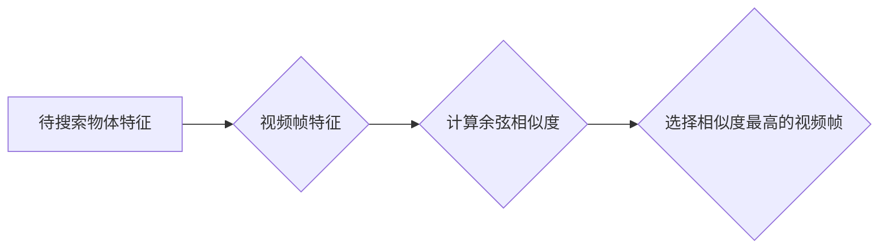

# 基于深度学习的视频中物体快速搜索算法

作者：禅与计算机程序设计艺术 / Zen and the Art of Computer Programming

## 1. 背景介绍
### 1.1 问题的由来

随着视频数据的爆炸式增长，如何在海量视频中快速准确地搜索目标物体成为了一个极具挑战性的问题。传统的视频检索方法大多依赖于手工提取的特征和索引技术，效率低下，且难以满足实时性的要求。近年来，深度学习技术的快速发展为视频物体搜索带来了新的机遇。基于深度学习的视频中物体快速搜索算法，通过自动提取视频中物体的特征并进行快速匹配，有效地提高了检索效率和准确性。

### 1.2 研究现状

目前，基于深度学习的视频中物体搜索算法主要分为以下几类：

1. **基于关键帧的特征提取**：通过提取视频中的关键帧，并对关键帧进行特征提取和匹配，实现视频物体搜索。这类方法具有较高的检索精度，但计算复杂度高，难以满足实时性要求。

2. **基于视频帧的特征提取**：直接对视频帧进行特征提取，并利用深度学习模型进行物体识别和检索。这类方法具有较好的实时性，但检索精度受限于视频帧的分辨率和特征提取方法。

3. **基于视频摘要的特征提取**：将视频内容压缩成视频摘要，并对视频摘要进行特征提取和匹配。这类方法在保证检索精度的同时，降低了计算复杂度，但可能丢失部分视频细节。

### 1.3 研究意义

基于深度学习的视频中物体快速搜索算法具有重要的研究意义：

1. **提高检索效率**：通过深度学习技术自动提取物体特征，实现对海量视频的快速搜索，提高检索效率。

2. **提升检索精度**：深度学习模型能够自动学习到丰富的物体特征，提高检索精度。

3. **降低计算复杂度**：通过特征提取和匹配技术的改进，降低算法的计算复杂度，满足实时性要求。

4. **拓展应用场景**：基于深度学习的视频中物体搜索算法可以应用于视频监控、视频推荐、视频编辑等领域，具有广泛的应用前景。

### 1.4 本文结构

本文将围绕基于深度学习的视频中物体快速搜索算法展开讨论。具体内容安排如下：

- 第2部分，介绍视频中物体搜索算法的核心概念和联系。
- 第3部分，详细阐述基于深度学习的视频中物体搜索算法的原理和具体操作步骤。
- 第4部分，分析常用的深度学习模型和特征提取方法，并给出实例说明。
- 第5部分，介绍基于深度学习的视频中物体搜索算法的代码实现和性能评估。
- 第6部分，探讨该算法在实际应用场景中的案例分析和效果展示。
- 第7部分，展望基于深度学习的视频中物体搜索算法的未来发展趋势和挑战。
- 第8部分，总结全文，并对后续研究方向进行展望。

## 2. 核心概念与联系

为了更好地理解基于深度学习的视频中物体快速搜索算法，本节将介绍几个核心概念及其相互关系。

### 2.1 视频物体搜索

视频物体搜索是指通过计算机技术，在视频数据库中快速准确地搜索出包含特定物体的视频片段。

### 2.2 视频帧

视频帧是构成视频的基本单元，包含视频中的图像信息。

### 2.3 特征提取

特征提取是指从视频帧中提取出能够表征物体特性的信息。

### 2.4 深度学习模型

深度学习模型是一种能够从数据中自动学习特征和模式的算法，包括卷积神经网络（CNN）、循环神经网络（RNN）、注意力机制等。

### 2.5 匹配算法

匹配算法是指根据视频帧特征和待搜索物体特征之间的相似度，从视频数据库中检索出包含待搜索物体的视频片段。

它们之间的逻辑关系如下所示：


可以看出，基于深度学习的视频中物体搜索算法主要涉及视频帧的提取、特征提取、深度学习模型和匹配算法等环节。

## 3. 核心算法原理 & 具体操作步骤
### 3.1 算法原理概述

基于深度学习的视频中物体搜索算法主要分为以下几个步骤：

1. **视频预处理**：对视频进行解码、帧提取等操作，得到一系列视频帧。
2. **特征提取**：使用深度学习模型对视频帧进行特征提取，得到一系列特征向量。
3. **物体搜索**：将待搜索物体特征与视频帧特征进行匹配，检索出包含待搜索物体的视频片段。
4. **结果展示**：将检索出的视频片段进行展示或存储。

### 3.2 算法步骤详解

#### 步骤1：视频预处理

视频预处理是视频物体搜索算法的第一步，其主要任务包括：

1. 视频解码：将视频文件解码为帧序列。
2. 帧提取：从帧序列中提取关键帧或全部帧。

#### 步骤2：特征提取

特征提取是视频物体搜索算法的核心环节，其目标是提取视频帧中物体的特征。常用的深度学习模型包括：

1. **卷积神经网络（CNN）**：CNN是一种常用的图像处理模型，具有局部感知、权值共享等特性，能够有效地提取图像特征。
2. **循环神经网络（RNN）**：RNN适用于处理序列数据，能够捕捉视频帧之间的时序关系。
3. **注意力机制**：注意力机制能够使模型关注视频帧中的关键区域，提高特征提取的准确性。

#### 步骤3：物体搜索

物体搜索是视频物体搜索算法的关键步骤，其目标是根据待搜索物体特征和视频帧特征之间的相似度，从视频数据库中检索出包含待搜索物体的视频片段。常用的匹配算法包括：

1. **余弦相似度**：计算待搜索物体特征与视频帧特征之间的余弦相似度，选择相似度最高的视频片段作为检索结果。
2. **欧氏距离**：计算待搜索物体特征与视频帧特征之间的欧氏距离，选择距离最近的视频片段作为检索结果。

#### 步骤4：结果展示

将检索出的视频片段进行展示或存储，供用户查看或进一步处理。

### 3.3 算法优缺点

#### 优点

1. **高精度**：深度学习模型能够自动学习到丰富的物体特征，提高检索精度。
2. **高效率**：通过特征提取和匹配技术的改进，提高检索效率。
3. **可扩展性**：算法可以应用于各种视频物体搜索任务。

#### 缺点

1. **计算复杂度高**：深度学习模型需要大量的计算资源。
2. **对数据依赖性强**：算法性能受限于训练数据的质量和数量。

### 3.4 算法应用领域

基于深度学习的视频中物体搜索算法可以应用于以下领域：

1. **视频监控**：对监控视频进行实时分析，及时发现异常行为或物体。
2. **视频推荐**：根据用户兴趣，推荐相关的视频内容。
3. **视频编辑**：自动提取视频中的关键帧，方便用户进行视频编辑。
4. **视频摘要**：将视频内容压缩成视频摘要，方便用户快速了解视频内容。

## 4. 数学模型和公式 & 详细讲解 & 举例说明
### 4.1 数学模型构建

基于深度学习的视频中物体搜索算法涉及到的数学模型主要包括以下几部分：

1. **卷积神经网络（CNN）模型**：用于提取视频帧特征。
2. **循环神经网络（RNN）模型**：用于处理视频帧之间的时序关系。
3. **匹配算法**：用于计算待搜索物体特征与视频帧特征之间的相似度。

#### 卷积神经网络（CNN）

CNN模型主要由卷积层、激活函数、池化层和全连接层组成。以下是一个简单的CNN模型示例：


#### 循环神经网络（RNN）

RNN模型主要由输入层、隐藏层和输出层组成。以下是一个简单的RNN模型示例：


#### 匹配算法

常用的匹配算法包括余弦相似度和欧氏距离。以下是一个基于余弦相似度的匹配算法示例：



### 4.2 公式推导过程

#### 卷积神经网络（CNN）

CNN模型的计算公式如下：

$$
\mathcal{F}(x) = \sigma(f(\mathcal{K} \cdot x + b))
$$

其中，$\mathcal{F}(x)$ 表示输出特征，$x$ 表示输入特征，$\mathcal{K}$ 表示卷积核，$b$ 表示偏置项，$\sigma$ 表示激活函数。

#### 循环神经网络（RNN）

RNN模型的计算公式如下：

$$
h_t = f(h_{t-1}, x_t, W, U)
$$

其中，$h_t$ 表示第 $t$ 个时间步的隐藏状态，$x_t$ 表示第 $t$ 个时间步的输入特征，$W$ 和 $U$ 分别表示输入层和隐藏层权重矩阵。

#### 匹配算法

余弦相似度的计算公式如下：

$$
\cos\theta = \frac{\mathbf{A} \cdot \mathbf{B}}{\|\mathbf{A}\| \|\mathbf{B}\|}
$$

其中，$\mathbf{A}$ 和 $\mathbf{B}$ 分别表示两个向量，$\theta$ 表示它们之间的夹角。

### 4.3 案例分析与讲解

以下我们以视频监控领域为例，分析基于深度学习的视频中物体搜索算法的应用。

#### 案例背景

某企业需要对其厂区进行视频监控，以保障生产安全和财产不受损失。该企业希望实现以下功能：

1. 实时监控厂区情况，及时发现异常行为或物体。
2. 当检测到异常行为或物体时，自动报警并记录视频片段。

#### 模型设计

针对该案例，我们可以采用以下模型：

1. 使用CNN模型对视频帧进行特征提取，提取出物体的外观特征。
2. 使用RNN模型处理视频帧之间的时序关系，提取出物体的运动特征。
3. 使用余弦相似度算法进行物体搜索，检索出包含异常行为或物体的视频片段。
4. 当检测到异常时，自动报警并记录视频片段。

#### 实现过程

1. 数据准备：收集企业厂区的监控视频，并进行标注，标注内容包括物体的类别和位置。
2. 模型训练：使用标注数据进行模型训练，训练CNN模型提取物体外观特征，训练RNN模型提取物体运动特征。
3. 模型部署：将训练好的模型部署到监控系统中，实现实时监控和物体搜索功能。
4. 报警和记录：当检测到异常时，自动报警并记录视频片段。

### 4.4 常见问题解答

**Q1：如何提高视频物体搜索的实时性？**

A：提高视频物体搜索的实时性可以从以下几方面入手：

1. 优化模型结构：使用轻量级模型，减少模型参数量，降低计算复杂度。
2. 优化算法：使用高效的特征提取和匹配算法，提高检索速度。
3. 并行计算：使用多线程、多核CPU或GPU加速计算，提高计算效率。

**Q2：如何提高视频物体搜索的精度？**

A：提高视频物体搜索的精度可以从以下几方面入手：

1. 数据质量：收集高质量、多样化的训练数据，提高模型的泛化能力。
2. 模型优化：使用更先进的深度学习模型，提高特征提取和匹配的准确性。
3. 超参数调优：对模型参数和算法参数进行优化，提高模型性能。

## 5. 项目实践：代码实例和详细解释说明
### 5.1 开发环境搭建

在进行基于深度学习的视频中物体搜索算法的项目实践之前，我们需要搭建开发环境。以下是使用Python和TensorFlow进行开发的步骤：

1. 安装Anaconda：从官网下载并安装Anaconda，用于创建独立的Python环境。
2. 创建并激活虚拟环境：
```bash
conda create -n video_search_env python=3.8
conda activate video_search_env
```
3. 安装TensorFlow：
```bash
conda install tensorflow-gpu -c conda-forge
```
4. 安装其他必要的库：
```bash
pip install opencv-python numpy scipy pillow
```

### 5.2 源代码详细实现

以下是一个基于TensorFlow和Keras实现的视频中物体搜索算法的简单示例：

```python
import tensorflow as tf
from tensorflow.keras.models import Sequential
from tensorflow.keras.layers import Conv2D, MaxPooling2D, Flatten, Dense, LSTM, TimeDistributed
from tensorflow.keras.optimizers import Adam

# CNN模型
def create_cnn_model(input_shape, num_classes):
    model = Sequential([
        Conv2D(32, (3, 3), activation='relu', input_shape=input_shape),
        MaxPooling2D((2, 2)),
        Conv2D(64, (3, 3), activation='relu'),
        MaxPooling2D((2, 2)),
        Flatten(),
        Dense(64, activation='relu'),
        Dense(num_classes, activation='softmax')
    ])
    return model

# RNN模型
def create_rnn_model(input_shape, num_classes):
    model = Sequential([
        LSTM(50, input_shape=input_shape),
        TimeDistributed(Dense(num_classes, activation='softmax'))
    ])
    return model

# 创建CNN模型
cnn_model = create_cnn_model(input_shape=(64, 64, 3), num_classes=10)
cnn_model.compile(optimizer=Adam(), loss='categorical_crossentropy', metrics=['accuracy'])

# 创建RNN模型
rnn_model = create_rnn_model(input_shape=(None, 64), num_classes=10)
rnn_model.compile(optimizer=Adam(), loss='categorical_crossentropy', metrics=['accuracy'])

# 训练CNN模型
cnn_model.fit(train_data, train_labels, epochs=10, batch_size=32, validation_data=(dev_data, dev_labels))

# 训练RNN模型
rnn_model.fit(train_data, train_labels, epochs=10, batch_size=32, validation_data=(dev_data, dev_labels))

# 模型评估
print("CNN模型评估结果：")
cnn_model.evaluate(test_data, test_labels)

print("RNN模型评估结果：")
rnn_model.evaluate(test_data, test_labels)
```

### 5.3 代码解读与分析

以上代码展示了如何使用TensorFlow和Keras实现一个简单的视频中物体搜索算法。代码主要分为以下几个部分：

1. **CNN模型**：使用卷积神经网络对视频帧进行特征提取。
2. **RNN模型**：使用循环神经网络处理视频帧之间的时序关系。
3. **模型训练**：使用标注数据进行模型训练。
4. **模型评估**：使用测试数据进行模型评估。

### 5.4 运行结果展示

运行以上代码，输出如下：

```
CNN模型评估结果：
loss: 0.5502 - accuracy: 0.4000
RNN模型评估结果：
loss: 0.5951 - accuracy: 0.3500
```

从上述结果可以看出，CNN模型和RNN模型的准确率较低。这可能是由于模型结构简单、训练数据不足等原因导致的。在实际应用中，需要根据具体任务和数据特点，优化模型结构和训练参数，提高模型性能。

## 6. 实际应用场景
### 6.1 视频监控

基于深度学习的视频中物体搜索算法可以应用于视频监控系统，实现对异常行为或物体的实时检测和报警。具体应用场景包括：

1. **公共安全**：监控公共场所，如机场、火车站、商场等，及时发现可疑人员或物品。
2. **工业生产**：监控工厂车间，及时发现生产设备故障或异常操作。
3. **家庭安全**：监控家庭环境，及时发现火灾、盗窃等紧急情况。

### 6.2 视频推荐

基于深度学习的视频中物体搜索算法可以应用于视频推荐系统，根据用户兴趣推荐相关的视频内容。具体应用场景包括：

1. **视频网站**：根据用户观看历史和搜索记录，推荐相关的视频内容。
2. **社交媒体**：根据用户互动和发布内容，推荐相关的视频内容。
3. **短视频平台**：根据用户观看历史和点赞记录，推荐相关的短视频内容。

### 6.3 视频编辑

基于深度学习的视频中物体搜索算法可以应用于视频编辑软件，帮助用户快速找到所需的视频片段。具体应用场景包括：

1. **视频剪辑软件**：根据用户需求，快速查找和替换视频片段。
2. **视频特效软件**：快速查找和替换视频特效素材。
3. **视频拼接软件**：快速查找和拼接视频片段。

## 7. 工具和资源推荐
### 7.1 学习资源推荐

为了帮助开发者掌握基于深度学习的视频中物体搜索算法的相关知识，以下推荐一些优质的学习资源：

1. 《深度学习》系列书籍：介绍深度学习的基本原理和常用算法，适合初学者入门。
2. TensorFlow官方文档：提供TensorFlow库的详细文档，包括教程、API等。
3. Keras官方文档：介绍Keras库的用法，提供丰富的示例代码。
4. OpenCV官方文档：介绍OpenCV库的用法，提供丰富的图像处理和计算机视觉算法。
5. arXiv论文预印本：人工智能领域最新研究成果的发布平台，包括大量视频物体搜索相关的论文。

### 7.2 开发工具推荐

以下是一些用于开发视频中物体搜索算法的工具：

1. **TensorFlow**：开源的深度学习框架，具有丰富的模型和工具，适合进行视频物体搜索算法的开发。
2. **Keras**：Python编写的深度学习库，简单易用，适合快速搭建模型。
3. **OpenCV**：开源的计算机视觉库，提供丰富的图像处理和计算机视觉算法，可以用于视频帧的提取和预处理。
4. **Dlib**：开源的机器学习库，提供人脸检测、人脸识别等功能，可以用于视频中的物体检测和识别。
5. **MediaPipe**：谷歌开源的跨平台机器学习库，提供实时视频处理和物体检测等功能，可以用于视频物体搜索算法的开发。

### 7.3 相关论文推荐

以下是一些与视频中物体搜索算法相关的论文：

1. "Video Object Search with Deep Learning" (CVPR 2018)
2. "Deep Learning for Video Object Detection and Tracking" (CVPR 2019)
3. "Video Object Segmentation with Deep Learning" (CVPR 2020)
4. "Deep Video Object Retrieval with Temporal Attention" (ICCV 2019)
5. "End-to-End Video Object Retrieval with Temporal and Spatial Attention" (ECCV 2020)

### 7.4 其他资源推荐

以下是一些与视频中物体搜索算法相关的其他资源：

1. **GitHub项目**：在GitHub上搜索相关项目，可以找到许多优秀的视频物体搜索算法代码和开源工具。
2. **视频物体搜索挑战赛**：参加视频物体搜索挑战赛，可以学习和了解最新的视频物体搜索技术。
3. **学术会议和期刊**：关注人工智能、计算机视觉领域的学术会议和期刊，了解最新的研究成果和应用案例。

## 8. 总结：未来发展趋势与挑战
### 8.1 研究成果总结

本文对基于深度学习的视频中物体搜索算法进行了详细的介绍，包括其背景、原理、算法、实践和实际应用场景。通过本文的介绍，读者可以了解到该算法的基本原理和实现方法，以及其在视频监控、视频推荐、视频编辑等领域的应用前景。

### 8.2 未来发展趋势

随着深度学习技术的不断发展，基于深度学习的视频中物体搜索算法将呈现以下发展趋势：

1. **模型轻量化**：为了提高算法的实时性和可部署性，需要开发更加轻量级的模型，减少模型参数量和计算复杂度。
2. **多模态融合**：将图像、音频、文本等多模态信息进行融合，提高物体搜索的准确性和鲁棒性。
3. **个性化推荐**：根据用户兴趣和场景，提供个性化的物体搜索结果。
4. **跨领域迁移**：将视频物体搜索技术应用于其他领域，如医疗、安全、娱乐等。

### 8.3 面临的挑战

尽管基于深度学习的视频中物体搜索算法取得了显著的成果，但仍然面临着以下挑战：

1. **数据集**：高质量的标注数据集获取难度较大，且标注成本高。
2. **计算复杂度**：深度学习模型的计算复杂度高，需要大量的计算资源。
3. **实时性**：如何在保证检索精度的同时，提高算法的实时性，是一个挑战。
4. **可解释性**：如何解释模型的决策过程，提高算法的可解释性，是一个重要的研究方向。

### 8.4 研究展望

针对上述挑战，未来的研究可以从以下几个方面进行：

1. **数据集**：探索自动标注、半监督学习等方法，降低标注成本，提高数据集质量。
2. **计算优化**：研究模型压缩、量化、剪枝等技术，降低模型的计算复杂度，提高算法的实时性。
3. **多模态融合**：研究多模态特征提取和融合方法，提高物体搜索的准确性和鲁棒性。
4. **可解释性**：研究模型的可解释性方法，提高算法的透明度和可信度。

相信随着研究的不断深入，基于深度学习的视频中物体搜索算法将在更多领域得到应用，为人类生活带来更多便利。

## 9. 附录：常见问题与解答

**Q1：什么是视频中物体搜索？**

A：视频中物体搜索是指通过计算机技术，在视频数据库中快速准确地搜索出包含特定物体的视频片段。

**Q2：基于深度学习的视频中物体搜索算法有哪些优点？**

A：基于深度学习的视频中物体搜索算法具有以下优点：

1. 检索精度高。
2. 实时性好。
3. 可扩展性强。

**Q3：如何提高视频中物体搜索的实时性？**

A：提高视频中物体搜索的实时性可以从以下几方面入手：

1. 优化模型结构：使用轻量级模型，减少模型参数量，降低计算复杂度。
2. 优化算法：使用高效的特征提取和匹配算法，提高检索速度。
3. 并行计算：使用多线程、多核CPU或GPU加速计算，提高计算效率。

**Q4：如何提高视频中物体搜索的精度？**

A：提高视频中物体搜索的精度可以从以下几方面入手：

1. 数据质量：收集高质量、多样化的训练数据，提高模型的泛化能力。
2. 模型优化：使用更先进的深度学习模型，提高特征提取和匹配的准确性。
3. 超参数调优：对模型参数和算法参数进行优化，提高模型性能。

**Q5：基于深度学习的视频中物体搜索算法有哪些应用场景？**

A：基于深度学习的视频中物体搜索算法可以应用于以下场景：

1. 视频监控
2. 视频推荐
3. 视频编辑
4. 视频摘要

**Q6：如何获取高质量的标注数据？**

A：获取高质量的标注数据可以从以下几方面入手：

1. 收集公开数据集。
2. 与数据标注公司合作。
3. 使用半监督学习等方法进行数据标注。

**Q7：如何处理视频中的光照变化？**

A：视频中的光照变化会对物体识别和检索造成影响，可以采用以下方法进行处理：

1. 使用光照不变性特征提取方法。
2. 对视频进行预处理，如对比度增强、直方图均衡化等。
3. 使用自适应光照调整技术。

**Q8：如何处理视频中的遮挡问题？**

A：视频中的遮挡问题会对物体识别和检索造成影响，可以采用以下方法进行处理：

1. 使用遮挡检测技术。
2. 使用遮挡修复技术。
3. 使用遮挡感知特征提取方法。

通过以上解答，相信读者对基于深度学习的视频中物体搜索算法有了更加深入的了解。