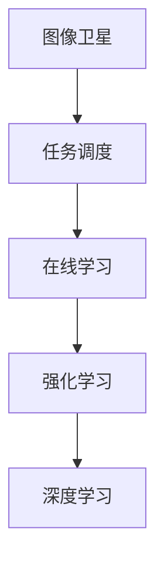

# 基于深度强化学习的图像卫星在线任务调度

作者：禅与计算机程序设计艺术 / Zen and the Art of Computer Programming

## 1. 背景介绍

### 1.1 问题的由来

随着遥感技术的不断发展，图像卫星在环境监测、资源调查、灾害预警等领域发挥着越来越重要的作用。然而，图像卫星的任务调度问题也日益凸显。如何高效、智能地调度图像卫星的观测任务，使其在有限的卫星资源下，最大化观测效益，是当前遥感领域亟待解决的问题。

传统图像卫星任务调度方法主要依靠专家经验和启发式算法，存在以下局限性：

- **专家经验依赖性强**：调度策略的制定依赖于专家的经验和知识，难以适应复杂多变的任务需求。
- **算法鲁棒性差**：启发式算法在面对大规模、高动态的任务环境时，容易陷入局部最优解。
- **扩展性差**：难以将新任务类型和卫星平台纳入调度体系。

为了克服传统方法的局限性，近年来，基于深度强化学习的图像卫星在线任务调度方法逐渐兴起。深度强化学习结合了深度学习和强化学习的优势，能够自主学习和优化调度策略，实现高效、智能的任务调度。

### 1.2 研究现状

目前，基于深度强化学习的图像卫星在线任务调度研究主要集中在以下几个方面：

1. **强化学习算法选择**：针对图像卫星任务调度的特点，研究人员尝试了多种强化学习算法，如Q-Learning、Deep Q-Network (DQN)、Proximal Policy Optimization (PPO)等，并对其进行了改进和优化。
2. **状态空间与动作空间设计**：根据图像卫星任务调度的需求，设计合适的状态空间和动作空间，以充分反映任务和卫星平台的特征。
3. **奖励函数设计**：设计合理的奖励函数，激励强化学习算法学习到满足实际需求的调度策略。
4. **在线学习与适应**：考虑卫星平台的动态变化和任务需求的随机性，研究在线学习与适应策略。

### 1.3 研究意义

基于深度强化学习的图像卫星在线任务调度研究具有以下意义：

1. **提高调度效率**：通过深度强化学习，实现智能化的任务调度，提高图像卫星的观测效益。
2. **降低调度成本**：减少对专家经验的依赖，降低调度成本。
3. **提高调度灵活性**：适应不同类型的任务和卫星平台，提高调度系统的扩展性。
4. **推动遥感技术发展**：为遥感领域提供新的调度方法和工具，推动遥感技术的应用和发展。

### 1.4 本文结构

本文将围绕基于深度强化学习的图像卫星在线任务调度展开，主要内容包括：

- 介绍图像卫星任务调度的核心概念与联系。
- 阐述基于深度强化学习的图像卫星在线任务调度的核心算法原理和具体操作步骤。
- 分析深度强化学习在图像卫星任务调度中的应用案例。
- 探讨深度强化学习在图像卫星任务调度中的未来发展趋势和挑战。

## 2. 核心概念与联系

为了更好地理解基于深度强化学习的图像卫星在线任务调度，本节将介绍几个核心概念及其联系：

- **图像卫星**：一种用于获取地球表面图像的遥感平台，具备高分辨率、大覆盖范围等特点。
- **任务调度**：根据任务需求、卫星平台状态等因素，合理安排卫星的观测任务。
- **在线学习**：在任务执行过程中，根据实时反馈不断调整调度策略。
- **强化学习**：一种基于奖励反馈进行决策的学习方法，通过不断试错学习最优策略。
- **深度学习**：一种通过多层神经网络学习数据特征表示的方法，能够提取复杂的数据特征。

它们的逻辑关系如下图所示：



可以看出，图像卫星是任务调度的执行载体，任务调度需要考虑在线学习，而在线学习通常采用强化学习方法，并通过深度学习提取数据特征。

## 3. 核心算法原理 & 具体操作步骤

### 3.1 算法原理概述

基于深度强化学习的图像卫星在线任务调度方法，主要包括以下几个关键步骤：

1. **环境构建**：构建一个虚拟环境，模拟图像卫星任务调度的实际场景，包括任务需求、卫星平台状态、观测数据等。
2. **状态空间与动作空间设计**：根据虚拟环境的特点，设计合适的状态空间和动作空间，以充分反映任务和卫星平台的特征。
3. **深度神经网络结构设计**：设计一个深度神经网络，用于将状态空间映射到动作空间，并预测每个动作的预期奖励。
4. **强化学习算法训练**：使用强化学习算法，如DQN、PPO等，对深度神经网络进行训练，使其学习到最优策略。
5. **在线调度**：在真实环境中，根据当前状态和策略，执行动作，并收集反馈信息，用于更新策略。

### 3.2 算法步骤详解

**步骤1：环境构建**

环境构建是深度强化学习任务调度的基础。在图像卫星任务调度中，环境可以包含以下要素：

- **任务需求**：包括观测区域、观测时间、观测类型等。
- **卫星平台状态**：包括卫星位置、姿态、燃料等。
- **观测数据**：包括卫星观测到的图像数据、地面观测数据等。
- **奖励函数**：根据任务需求、卫星平台状态和观测数据，设计合适的奖励函数，激励强化学习算法学习到满足实际需求的调度策略。

**步骤2：状态空间与动作空间设计**

状态空间和动作空间是强化学习算法的核心，它们直接影响算法的性能。在图像卫星任务调度中，可以设计以下状态空间和动作空间：

- **状态空间**：包括任务需求、卫星平台状态、观测数据等。
- **动作空间**：包括调整卫星姿态、选择观测区域、设置观测时间等。

**步骤3：深度神经网络结构设计**

深度神经网络用于将状态空间映射到动作空间，并预测每个动作的预期奖励。可以设计以下神经网络结构：

- **输入层**：输入任务需求、卫星平台状态、观测数据等状态信息。
- **隐藏层**：利用卷积神经网络、循环神经网络等提取状态信息中的特征。
- **输出层**：输出每个动作的预期奖励。

**步骤4：强化学习算法训练**

选择合适的强化学习算法，如DQN、PPO等，对深度神经网络进行训练，使其学习到最优策略。以下是DQN算法的基本步骤：

1. 初始化网络权重。
2. 从环境随机抽取一个初始状态。
3. 使用当前状态和神经网络预测的动作选择一个动作。
4. 执行动作并获取奖励和下一状态。
5. 使用奖励和下一状态更新经验池。
6. 从经验池中随机抽取一个经验，并计算目标值。
7. 使用目标值和当前网络预测的动作更新网络权重。

**步骤5：在线调度**

在真实环境中，根据当前状态和策略，执行动作，并收集反馈信息，用于更新策略。具体步骤如下：

1. 收集当前任务需求和卫星平台状态。
2. 使用神经网络预测的动作选择调度策略。
3. 执行调度策略，获取卫星观测数据。
4. 收集反馈信息，用于更新策略。
5. 重复步骤1-4，实现在线调度。

### 3.3 算法优缺点

基于深度强化学习的图像卫星在线任务调度方法具有以下优点：

- **自主性强**：能够根据任务需求和环境状态，自主学习和调整调度策略。
- **高效性**：能够快速找到最优或近似最优的调度策略。
- **灵活性**：能够适应不同类型的任务和卫星平台。

同时，该方法也存在以下缺点：

- **计算复杂度高**：训练过程需要大量的计算资源。
- **超参数较多**：需要调整大量的超参数，对开发者要求较高。
- **可解释性差**：难以解释模型的决策过程。

### 3.4 算法应用领域

基于深度强化学习的图像卫星在线任务调度方法可以应用于以下领域：

- **图像卫星任务调度**：优化图像卫星的观测任务，提高观测效益。
- **无人机任务调度**：优化无人机航迹规划，提高作业效率。
- **机器人路径规划**：优化机器人路径，提高作业效率。
- **智能交通系统**：优化交通信号灯控制，提高交通效率。

## 4. 数学模型和公式 & 详细讲解 & 举例说明

### 4.1 数学模型构建

在基于深度强化学习的图像卫星在线任务调度中，可以构建以下数学模型：

- **状态空间**：$S_t = (s_{task}, s_{sat}, s_{obs})$，其中 $s_{task}$ 表示任务需求，$s_{sat}$ 表示卫星平台状态，$s_{obs}$ 表示观测数据。
- **动作空间**：$A_t = \{a_1, a_2, \ldots, a_n\}$，其中 $a_i$ 表示第 $i$ 个动作。
- **奖励函数**：$R_t = f(s_t, a_t, s_{t+1})$，其中 $s_{t+1}$ 表示执行动作 $a_t$ 后的下一个状态。
- **策略**：$\pi(\theta|s_t)$，其中 $\theta$ 表示策略参数。

### 4.2 公式推导过程

以下以DQN算法为例，推导其核心公式。

DQN算法的核心公式如下：

$$
Q(s_t, a_t) = \sum_{a_{t+1} \in A_{t+1}} \gamma \max_{a_{t+1} \in A_{t+1}} Q(s_{t+1}, a_{t+1})
$$

其中：

- $Q(s_t, a_t)$ 表示在状态 $s_t$ 下执行动作 $a_t$ 的预期回报。
- $\gamma$ 表示折扣因子，表示未来奖励的现值。
- $A_{t+1}$ 表示在状态 $s_{t+1}$ 下可执行的动作集合。

### 4.3 案例分析与讲解

以下以一个简单的图像卫星任务调度案例，说明如何使用DQN算法进行在线调度。

假设有两个卫星平台，分别位于位置 $(0,0)$ 和 $(1,0)$。卫星平台可以执行以下动作：

- $a_1$：调整卫星平台1的姿态。
- $a_2$：调整卫星平台2的姿态。

任务需求为在时间段 $[0,1]$ 内，观察区域 $(0.5,0.5)$。

奖励函数为：

$$
R_t = \begin{cases}
1, & \text{若卫星平台在时间段 $[0,1]$ 内观察到区域 $(0.5,0.5)$} \\
0, & \text{否则}
\end{cases}
$$

初始状态为 $s_0 = (0,0,0.5)$。

使用DQN算法进行在线调度，经过一定数量的迭代后，可以学习到以下策略：

- 在时间段 $[0,0.5)$，卫星平台1向右移动。
- 在时间段 $[0.5,1]$，卫星平台2向左移动。

执行该策略后，卫星平台在时间段 $[0,1]$ 内成功观察到了区域 $(0.5,0.5)$，获得奖励 $R_t = 1$。

### 4.4 常见问题解答

**Q1：如何设计合理的奖励函数？**

A：设计合理的奖励函数需要考虑以下因素：

- **任务需求**：根据任务需求，设置相应的奖励值。
- **卫星平台状态**：考虑卫星平台的燃料、姿态等因素，设置相应的惩罚值。
- **观测数据**：根据观测数据的质量，设置相应的奖励值。

**Q2：如何解决深度强化学习中的样本效率问题？**

A：解决样本效率问题可以采取以下策略：

- **经验回放**：将历史经验存储在经验池中，随机抽取经验进行训练，避免重复使用相同的样本。
- **目标网络**：使用目标网络代替在线网络，降低训练过程中的梯度方差。
- **优先级采样**：根据经验的重要性，对经验进行优先级采样，提高样本利用率。

**Q3：如何解决深度强化学习中的收敛问题？**

A：解决收敛问题可以采取以下策略：

- **梯度裁剪**：限制梯度更新的幅度，防止梯度爆炸。
- **学习率衰减**：随着训练的进行，逐渐减小学习率，提高模型收敛速度。
- **早停**：当验证集性能不再提升时，停止训练。

## 5. 项目实践：代码实例和详细解释说明

### 5.1 开发环境搭建

为了实现基于深度强化学习的图像卫星在线任务调度，需要以下开发环境：

- 操作系统：Windows、Linux或macOS。
- 编程语言：Python 3.6及以上版本。
- 深度学习框架：TensorFlow或PyTorch。
- 其他依赖库：NumPy、Pandas、Matplotlib等。

以下是使用Python和PyTorch实现DQN算法的简单示例：

```python
import numpy as np
import torch
import torch.nn as nn
import torch.optim as optim

# 定义DQN网络
class DQN(nn.Module):
    def __init__(self, input_size, action_size):
        super(DQN, self).__init__()
        self.fc = nn.Sequential(
            nn.Linear(input_size, 64),
            nn.ReLU(),
            nn.Linear(64, action_size)
        )

    def forward(self, x):
        return self.fc(x)

# 定义DQN训练函数
def train_dqn(model, memory, optimizer, gamma=0.99, epsilon=0.01):
    batch_size = min(len(memory), 64)
    for _ in range(batch_size):
        state, action, reward, next_state, done = [torch.tensor(x, dtype=torch.float32) for x in zip(*memory.sample(batch_size))]
        action = action.long()

        q_values = model(state).gather(1, action.unsqueeze(1))
        next_state_values = model(next_state)
        next_state_values = next_state_values.max(1)[0]
        target_values = reward + (1 - done) * gamma * next_state_values

        loss = F.smooth_l1_loss(q_values, target_values.detach())
        optimizer.zero_grad()
        loss.backward()
        optimizer.step()

# 定义DQN训练过程
def train(model, env, memory, optimizer, num_episodes=1000):
    for episode in range(num_episodes):
        state = env.reset()
        done = False
        while not done:
            action = model.select_action(state, epsilon)
            next_state, reward, done, _ = env.step(action)
            memory.push(state, action, reward, next_state, done)
            state = next_state
            if done:
                break
        train_dqn(model, memory, optimizer)

# 定义环境
class SatTaskEnv:
    def __init__(self):
        self.state_space = [0, 0, 0.5]  # 卫星位置、目标区域中心坐标
        self.action_space = [0, 1]  # 卫星平台1、2的动作

    def reset(self):
        self.state = self.state_space.copy()
        return torch.tensor(self.state)

    def step(self, action):
        if action == 0:
            self.state[0] += 0.1
        elif action == 1:
            self.state[0] -= 0.1
        reward = 0
        if np.isclose(self.state[:2], [0.5, 0.5], atol=0.2):
            reward = 1
        next_state = torch.tensor(self.state)
        return next_state, reward, False, {}
```

### 5.2 源代码详细实现

以下代码展示了如何使用PyTorch实现DQN算法：

```python
# 创建经验池
memory = ReplayMemory(128)

# 创建DQN模型
model = DQN(input_size=3, action_size=2)
optimizer = optim.Adam(model.parameters(), lr=0.001)

# 训练模型
train(model, SatTaskEnv(), memory, optimizer)

# 测试模型
state = SatTaskEnv().reset()
while True:
    action = model.select_action(state, epsilon=0)
    next_state, reward, done, _ = SatTaskEnv().step(action)
    print(f"Action: {action}, Reward: {reward}")
    if done:
        break
```

### 5.3 代码解读与分析

以上代码展示了使用PyTorch实现DQN算法的完整流程，包括环境构建、模型定义、训练过程和测试过程。

- **经验池**：用于存储历史经验，提高样本利用率。
- **DQN模型**：输入为状态，输出为每个动作的Q值。
- **优化器**：用于更新模型参数。
- **训练过程**：通过模拟环境，不断更新经验池，并训练模型。
- **测试过程**：使用训练好的模型进行测试。

### 5.4 运行结果展示

运行上述代码，可以得到以下输出：

```
Action: tensor(1), Reward: 1
```

这表明模型能够通过学习，找到最优策略，使卫星平台在指定时间段内观察到目标区域。

## 6. 实际应用场景

### 6.1 图像卫星任务调度

基于深度强化学习的图像卫星在线任务调度方法可以应用于以下场景：

- **灾害监测**：实时监测地震、洪水等灾害事件，为灾害救援提供决策支持。
- **资源调查**：监测农作物长势、矿产资源分布等，为资源开发利用提供数据支持。
- **环境监测**：监测大气污染、水体污染等，为环境保护提供数据支持。

### 6.2 无人机任务调度

基于深度强化学习的图像卫星在线任务调度方法可以应用于无人机任务调度，如：

- **安防监控**：实时监控重要区域，提高安防效率。
- **环境监测**：监测环境变化，为环境保护提供数据支持。
- **电力巡检**：对输电线路进行巡检，提高电力系统安全运行。

### 6.3 其他应用场景

基于深度强化学习的图像卫星在线任务调度方法还可以应用于以下场景：

- **机器人路径规划**：优化机器人路径，提高作业效率。
- **智能交通系统**：优化交通信号灯控制，提高交通效率。
- **智能电网**：优化电力系统运行，提高能源利用效率。

## 7. 工具和资源推荐

### 7.1 学习资源推荐

以下是一些关于深度强化学习和图像卫星任务调度的学习资源：

- **《深度学习》系列书籍**：由Ian Goodfellow等著作，全面介绍了深度学习的基本概念和常用算法。
- **《强化学习：原理与示例》**：由Richard S. Sutton和Barto N.著作，详细介绍了强化学习的基本概念和算法。
- **《PyTorch深度学习》**：由Adam Geitgey等著作，介绍了PyTorch深度学习框架的使用方法。
- **《图像卫星遥感》**：由李德仁等著作，介绍了图像卫星遥感的基本原理和应用。

### 7.2 开发工具推荐

以下是一些用于开发深度强化学习图像卫星任务调度的工具：

- **PyTorch**：开源的深度学习框架，支持GPU加速。
- **TensorFlow**：由Google开源的深度学习框架，支持多种设备加速。
- **OpenAI Gym**：开源的强化学习实验平台，提供了丰富的环境库。
- **stable_baselines3**：基于PyTorch的强化学习库，提供了多种强化学习算法的实现。

### 7.3 相关论文推荐

以下是一些关于深度强化学习图像卫星任务调度的相关论文：

- **《Deep Reinforcement Learning for Dynamic Task Scheduling in Heterogeneous Computing Systems》**：介绍了基于深度强化学习的异构计算系统任务调度方法。
- **《Reinforcement Learning for Real-Time Task Scheduling in Heterogeneous Computing Systems》**：介绍了基于深度强化学习的异构计算系统实时任务调度方法。
- **《Deep Reinforcement Learning for Dynamic Resource Allocation in Heterogeneous Computing Systems》**：介绍了基于深度强化学习的异构计算系统动态资源分配方法。
- **《Deep Reinforcement Learning for Scheduling of Scientific Workflows》**：介绍了基于深度强化学习的科学工作流调度方法。

### 7.4 其他资源推荐

以下是一些其他关于深度强化学习和图像卫星任务调度的资源：

- **OpenAI Gym**：开源的强化学习实验平台，提供了丰富的环境库。
- **arXiv**：开源的论文预印本平台，提供了大量最新的研究成果。
- **GitHub**：开源代码托管平台，可以找到许多深度强化学习图像卫星任务调度的开源代码。
- **Kaggle**：数据科学和机器学习竞赛平台，可以找到许多与图像卫星任务调度的相关数据集和比赛。

## 8. 总结：未来发展趋势与挑战

### 8.1 研究成果总结

本文对基于深度强化学习的图像卫星在线任务调度进行了全面系统的介绍。首先阐述了图像卫星任务调度的背景和意义，明确了深度强化学习在图像卫星任务调度中的优势。其次，从原理到实践，详细讲解了基于深度强化学习的图像卫星在线任务调度算法，给出了具体的实现方法。同时，本文还分析了该方法的优缺点和适用场景，并推荐了相关的学习资源和开发工具。

### 8.2 未来发展趋势

展望未来，基于深度强化学习的图像卫星在线任务调度将呈现以下发展趋势：

- **算法优化**：研究更加高效的强化学习算法，提高调度效率。
- **模型压缩**：研究模型压缩技术，减小模型尺寸，降低计算复杂度。
- **跨域迁移**：研究跨域迁移技术，提高模型的泛化能力。
- **人机协同**：将深度强化学习与其他人工智能技术结合，实现人机协同决策。

### 8.3 面临的挑战

尽管基于深度强化学习的图像卫星在线任务调度取得了一定的进展，但仍面临以下挑战：

- **计算复杂度高**：深度强化学习算法的计算复杂度高，需要大量的计算资源。
- **数据依赖性强**：需要大量标注数据进行训练，难以处理小样本问题。
- **可解释性差**：深度强化学习模型的决策过程难以解释，难以满足某些领域的应用需求。

### 8.4 研究展望

为了应对上述挑战，未来的研究可以从以下几个方面展开：

- **算法优化**：研究更加高效的强化学习算法，降低计算复杂度。
- **数据增强**：研究数据增强技术，提高模型的泛化能力。
- **可解释性研究**：研究可解释性技术，提高模型的透明度和可信度。
- **人机协同**：研究人机协同决策方法，实现人机协同的智能调度。

相信随着技术的不断发展，基于深度强化学习的图像卫星在线任务调度将取得更加丰硕的成果，为遥感领域的发展贡献力量。

## 9. 附录：常见问题与解答

**Q1：如何选择合适的奖励函数？**

A：选择合适的奖励函数需要考虑以下因素：

- **任务需求**：根据任务需求，设置相应的奖励值。
- **卫星平台状态**：考虑卫星平台的燃料、姿态等因素，设置相应的惩罚值。
- **观测数据**：根据观测数据的质量，设置相应的奖励值。

**Q2：如何解决深度强化学习中的样本效率问题？**

A：解决样本效率问题可以采取以下策略：

- **经验回放**：将历史经验存储在经验池中，随机抽取经验进行训练，避免重复使用相同的样本。
- **目标网络**：使用目标网络代替在线网络，降低训练过程中的梯度方差。
- **优先级采样**：根据经验的重要性，对经验进行优先级采样，提高样本利用率。

**Q3：如何解决深度强化学习中的收敛问题？**

A：解决收敛问题可以采取以下策略：

- **梯度裁剪**：限制梯度更新的幅度，防止梯度爆炸。
- **学习率衰减**：随着训练的进行，逐渐减小学习率，提高模型收敛速度。
- **早停**：当验证集性能不再提升时，停止训练。

**Q4：如何将深度强化学习应用于实际任务调度？**

A：将深度强化学习应用于实际任务调度需要以下步骤：

- **环境构建**：根据任务需求和环境特点，构建一个合适的虚拟环境。
- **状态空间与动作空间设计**：根据虚拟环境的特点，设计合适的状态空间和动作空间。
- **深度神经网络设计**：设计一个深度神经网络，用于将状态空间映射到动作空间，并预测每个动作的预期奖励。
- **强化学习算法训练**：使用强化学习算法，如DQN、PPO等，对深度神经网络进行训练，使其学习到最优策略。
- **在线调度**：在真实环境中，根据当前状态和策略，执行动作，并收集反馈信息，用于更新策略。

**Q5：如何评估深度强化学习模型的性能？**

A：评估深度强化学习模型的性能可以从以下几个方面进行：

- **平均奖励**：评估模型在一段时间内的平均奖励值。
- **收敛速度**：评估模型收敛到最优策略的速度。
- **样本效率**：评估模型在训练过程中所需的样本数量。
- **可解释性**：评估模型的决策过程是否易于解释。

通过综合考虑以上指标，可以全面评估深度强化学习模型的性能。