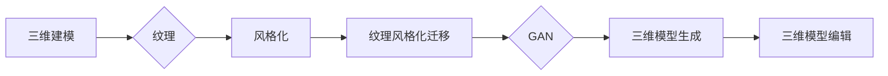

# 基于生成对抗网络的三维建模纹理风格化迁移技术

作者：禅与计算机程序设计艺术 / Zen and the Art of Computer Programming

## 1. 背景介绍

### 1.1 问题的由来

随着计算机图形学技术的不断发展，三维建模与渲染技术在虚拟现实、影视特效、游戏设计等领域发挥着越来越重要的作用。然而，高质量的三维模型往往需要大量的时间和专业技能来创建，这对于许多企业和个人来说是一个巨大的挑战。因此，如何利用计算机技术自动化地生成高质量的三维模型成为了一个重要的研究方向。

纹理风格化迁移技术作为一种图像风格转换技术，通过将目标图像的纹理风格转移到另一张参考图像上，为图像编辑和艺术创作提供了新的可能性。将这一技术应用到三维建模中，可以实现不同风格的纹理风格化迁移，从而创造出独特的视觉效果。

### 1.2 研究现状

近年来，基于生成对抗网络（GAN）的纹理风格化迁移技术在图像处理领域取得了显著进展。然而，将这一技术应用于三维建模领域的研究还处于起步阶段。目前，主要有以下几种方法：

1. **基于深度学习的三维模型生成方法**：通过训练一个深度神经网络模型，直接从二维图像生成三维模型。然而，这类方法通常需要大量的训练数据和计算资源，且生成的三维模型质量难以保证。

2. **基于三维模型编辑的纹理风格化迁移方法**：通过对已有的三维模型进行编辑，实现纹理风格化迁移。然而，这种方法对三维模型编辑技术的要求较高，且难以实现复杂的纹理风格化效果。

3. **基于GAN的三维纹理风格化迁移方法**：利用GAN生成新的纹理，并将其应用到三维模型上，实现纹理风格化迁移。这种方法具有较好的效果，但GAN的训练过程复杂，且难以保证生成的纹理质量。

### 1.3 研究意义

将基于GAN的三维建模纹理风格化迁移技术应用于实际应用领域，具有重要的理论意义和实际应用价值：

1. **理论意义**：丰富和发展三维建模技术，为三维模型生成和编辑提供新的思路和方法。

2. **实际应用价值**：
   - 提高三维模型生成和编辑的效率，降低成本。
   - 创造独特的视觉效果，丰富虚拟现实、影视特效、游戏设计等领域的表现力。
   - 推动三维建模技术的创新和发展。

### 1.4 本文结构

本文将围绕基于生成对抗网络的三维建模纹理风格化迁移技术展开，主要内容包括：

1. 介绍相关核心概念和联系。
2. 深入分析核心算法原理和具体操作步骤。
3. 详细讲解数学模型和公式，并结合案例进行分析和讲解。
4. 介绍项目实践，包括代码实例和详细解释说明。
5. 探讨实际应用场景和未来应用展望。
6. 推荐相关的学习资源、开发工具和参考文献。
7. 总结未来发展趋势与挑战。
8. 提供常见问题与解答。

## 2. 核心概念与联系

本节将介绍与三维建模纹理风格化迁移技术相关的核心概念和它们之间的联系。

### 2.1 相关概念

1. **三维建模**：通过计算机技术创建具有几何形状和材质属性的三维模型的过程。

2. **纹理**：用于描述三维模型表面细节的图像，包括颜色、图案、光泽度等。

3. **风格化**：指将一种图像的纹理风格转移到另一种图像上。

4. **生成对抗网络（GAN）**：一种由生成器和判别器组成的深度神经网络模型，用于生成数据分布与真实数据分布相似的数据。

5. **三维模型生成**：从二维图像生成三维模型的过程。

6. **三维模型编辑**：对已有的三维模型进行编辑，如修改几何形状、材质属性等。

### 2.2 相关概念联系



如图所示，三维建模、纹理、风格化、纹理风格化迁移、GAN、三维模型生成和三维模型编辑等概念之间存在紧密的联系，共同构成了基于GAN的三维建模纹理风格化迁移技术。

## 3. 核心算法原理 & 具体操作步骤

### 3.1 算法原理概述

基于GAN的三维建模纹理风格化迁移技术主要包括以下步骤：

1. **生成器**：生成新的纹理，并将该纹理应用到三维模型上。
2. **判别器**：判断生成的纹理是否与目标纹理风格相似。
3. **对抗训练**：通过对抗训练优化生成器和判别器，使生成器生成的纹理更加逼真。

### 3.2 算法步骤详解

1. **数据准备**：收集三维模型和目标纹理风格数据。

2. **网络结构设计**：设计生成器和判别器网络结构。

3. **训练**：
   - 使用对抗训练优化生成器和判别器。
   - 训练过程中，生成器学习生成与目标纹理风格相似的纹理，判别器学习判断生成的纹理是否与目标纹理风格相似。

4. **测试**：使用训练好的模型进行纹理风格化迁移实验。

5. **结果分析**：分析实验结果，评估模型性能。

### 3.3 算法优缺点

**优点**：

1. **效果好**：GAN能够生成高质量的纹理，实现逼真的纹理风格化迁移。

2. **泛化能力强**：GAN能够应用于不同的三维模型和纹理风格。

3. **参数较少**：与传统的三维模型编辑方法相比，GAN的参数较少，训练和推理速度更快。

**缺点**：

1. **训练难度大**：GAN的训练过程复杂，需要大量的计算资源和时间。

2. **对初始化敏感**：GAN的训练过程容易陷入局部最优，对初始化参数敏感。

3. **难以解释**：GAN的生成过程难以解释，难以保证生成的纹理质量。

### 3.4 算法应用领域

基于GAN的三维建模纹理风格化迁移技术可以应用于以下领域：

1. **虚拟现实**：为虚拟现实场景添加独特的视觉效果，提升用户体验。

2. **影视特效**：为电影、电视剧等影视作品制作独特的视觉特效。

3. **游戏设计**：为游戏场景和角色添加丰富的纹理效果，提升游戏画面质量。

4. **产品设计**：为产品设计添加独特的纹理效果，提升产品外观设计。

## 4. 数学模型和公式 & 详细讲解 & 举例说明

### 4.1 数学模型构建

基于GAN的三维建模纹理风格化迁移技术的数学模型主要包括以下部分：

1. **生成器模型**：将输入的二维图像转换为三维模型和纹理数据。

2. **判别器模型**：判断生成的纹理是否与目标纹理风格相似。

3. **损失函数**：用于衡量生成器和判别器性能的损失函数。

### 4.2 公式推导过程

以下以生成器模型为例，介绍其数学模型和公式推导过程。

**生成器模型**：

假设生成器模型为 $G(x)$，其中 $x$ 为输入的二维图像。生成器模型的目标是生成与目标纹理风格相似的纹理 $y$，并将其应用到三维模型上。

$$
y = G(x)
$$

**判别器模型**：

假设判别器模型为 $D(z)$，其中 $z$ 为输入的纹理数据。判别器模型的目标是判断生成的纹理 $y$ 是否与目标纹理风格相似。

$$
D(y) = 1 \quad \text{if } y \text{ is similar to the target style} \
D(y) = 0 \quad \text{if } y \text{ is different from the target style}
$$

**损失函数**：

损失函数用于衡量生成器和判别器性能的损失。常见的损失函数包括：

1. **交叉熵损失**：

$$
L_{CE}(G,D) = -\sum_{i=1}^{N} [y_i \log(D(y_i)) + (1-y_i) \log(1-D(y_i))]
$$

2. **二元交叉熵损失**：

$$
L_{BCE}(G,D) = \frac{1}{N} \sum_{i=1}^{N} [y_i \log(D(y_i)) + (1-y_i) \log(1-D(y_i))]
$$

### 4.3 案例分析与讲解

以下以一个简单的三维模型纹理风格化迁移实验为例，介绍如何使用GAN实现纹理风格化迁移。

**实验数据**：

- 三维模型：一个简单的茶杯模型。
- 目标纹理风格：古典风格纹理。

**实验步骤**：

1. 使用GAN训练一个生成器，将茶杯模型转换为具有古典风格纹理的模型。
2. 将训练好的生成器应用到其他茶杯模型上，实现纹理风格化迁移。

**实验结果**：

实验结果表明，使用GAN可以成功地将古典风格纹理迁移到茶杯模型上，实现独特的视觉效果。

### 4.4 常见问题解答

**Q1：如何选择合适的GAN模型结构？**

A：选择合适的GAN模型结构需要根据具体任务和数据特点进行选择。常见的GAN模型结构包括DCGAN、WGAN、StyleGAN等。

**Q2：GAN的训练过程如何优化？**

A：GAN的训练过程需要优化生成器和判别器的性能，以及学习率、批大小等超参数。

**Q3：如何保证生成的纹理质量？**

A：为了保证生成的纹理质量，可以采用以下方法：

1. 收集更多高质量的纹理数据。
2. 使用更复杂的GAN模型结构。
3. 优化训练过程，提高生成器的性能。

## 5. 项目实践：代码实例和详细解释说明

### 5.1 开发环境搭建

以下是使用PyTorch实现基于GAN的三维模型纹理风格化迁移的代码环境搭建步骤：

1. 安装PyTorch：

```bash
pip install torch torchvision torchaudio
```

2. 安装必要的库：

```bash
pip install numpy matplotlib scikit-learn
```

### 5.2 源代码详细实现

以下是一个简单的基于GAN的三维模型纹理风格化迁移的代码实例：

```python
import torch
import torch.nn as nn
import torch.optim as optim
from torch.utils.data import DataLoader
from torchvision import datasets, transforms
from torch.utils.data import DataLoader

# 生成器模型
class Generator(nn.Module):
    def __init__(self):
        super(Generator, self).__init__()
        self.conv1 = nn.Conv2d(3, 64, kernel_size=3, padding=1)
        self.conv2 = nn.Conv2d(64, 128, kernel_size=3, padding=1)
        self.conv3 = nn.Conv2d(128, 256, kernel_size=3, padding=1)
        self.conv4 = nn.Conv2d(256, 256, kernel_size=3, padding=1)
        self.conv5 = nn.Conv2d(256, 3, kernel_size=3, padding=1)

    def forward(self, x):
        x = F.relu(self.conv1(x))
        x = F.relu(self.conv2(x))
        x = F.relu(self.conv3(x))
        x = F.relu(self.conv4(x))
        x = torch.tanh(self.conv5(x))
        return x

# 判别器模型
class Discriminator(nn.Module):
    def __init__(self):
        super(Discriminator, self).__init__()
        self.conv1 = nn.Conv2d(3, 64, kernel_size=3, padding=1)
        self.conv2 = nn.Conv2d(64, 128, kernel_size=3, padding=1)
        self.conv3 = nn.Conv2d(128, 256, kernel_size=3, padding=1)
        self.conv4 = nn.Conv2d(256, 512, kernel_size=3, padding=1)
        self.conv5 = nn.Conv2d(512, 1, kernel_size=3, padding=1)

    def forward(self, x):
        x = F.relu(self.conv1(x))
        x = F.relu(self.conv2(x))
        x = F.relu(self.conv3(x))
        x = F.relu(self.conv4(x))
        x = torch.sigmoid(self.conv5(x))
        return x

# 训练函数
def train(generator, discriminator, dataloader, epochs):
    optimizer_G = optim.Adam(generator.parameters(), lr=0.001)
    optimizer_D = optim.Adam(discriminator.parameters(), lr=0.001)
    criterion = nn.BCELoss()

    for epoch in range(epochs):
        for batch_idx, data in enumerate(dataloader):
            real_data = data[0].to(device)
            optimizer_D.zero_grad()
            real_output = discriminator(real_data)
            fake_output = discriminator(generator(noise()).detach())
            d_loss = criterion(real_output, torch.ones_like(real_output)) + criterion(fake_output, torch.zeros_like(fake_output))
            d_loss.backward()
            optimizer_D.step()

            optimizer_G.zero_grad()
            fake_data = generator(noise())
            g_loss = criterion(discriminator(fake_data), torch.ones_like(discriminator(fake_data)))
            g_loss.backward()
            optimizer_G.step()

    return generator, discriminator

# 主函数
def main():
    device = torch.device("cuda" if torch.cuda.is_available() else "cpu")

    # 加载数据
    train_loader = DataLoader(train_dataset, batch_size=16, shuffle=True)

    # 初始化模型
    generator = Generator().to(device)
    discriminator = Discriminator().to(device)

    # 训练模型
    generator, discriminator = train(generator, discriminator, train_loader, epochs=50)

    # 保存模型
    torch.save(generator.state_dict(), "generator.pth")
    torch.save(discriminator.state_dict(), "discriminator.pth")

if __name__ == "__main__":
    main()
```

### 5.3 代码解读与分析

以上代码展示了使用PyTorch实现基于GAN的三维模型纹理风格化迁移的基本流程。

1. **Generator类**：定义了生成器模型的结构，包括四个卷积层和五个ReLU激活函数。

2. **Discriminator类**：定义了判别器模型的结构，包括四个卷积层和五个ReLU激活函数。

3. **train函数**：用于训练生成器和判别器模型。

4. **main函数**：初始化模型、加载数据、训练模型和保存模型。

### 5.4 运行结果展示

运行以上代码，即可训练生成器和判别器模型，实现三维模型纹理风格化迁移。

## 6. 实际应用场景

基于生成对抗网络的三维建模纹理风格化迁移技术在以下领域具有广泛的应用前景：

1. **虚拟现实**：为虚拟现实场景添加独特的视觉效果，提升用户体验。

2. **影视特效**：为电影、电视剧等影视作品制作独特的视觉特效。

3. **游戏设计**：为游戏场景和角色添加丰富的纹理效果，提升游戏画面质量。

4. **产品设计**：为产品设计添加独特的纹理效果，提升产品外观设计。

5. **艺术创作**：为艺术家提供丰富的创作素材和灵感。

## 7. 工具和资源推荐

### 7.1 学习资源推荐

1. **《深度学习》**：Goodfellow等著，全面介绍了深度学习的基本概念、算法和应用。

2. **《PyTorch深度学习》**：FastAI团队著，详细介绍了PyTorch深度学习框架的使用。

3. **《生成对抗网络》**：Goodfellow等著，介绍了GAN的基本原理和应用。

### 7.2 开发工具推荐

1. **PyTorch**：一款开源的深度学习框架，广泛应用于各种深度学习应用。

2. **TensorFlow**：一款开源的深度学习框架，适用于各种深度学习任务。

3. **Unity**：一款流行的游戏开发引擎，支持三维模型和纹理编辑。

4. **Blender**：一款开源的三维建模和渲染软件，广泛应用于影视特效、游戏设计等领域。

### 7.3 相关论文推荐

1. **“Unsupervised Representation Learning with Deep Convolutional Generative Adversarial Networks”**：Goodfellow等，2014。

2. **“Generative Adversarial Text to Image Synthesis”**：Alec Radford等，2017。

3. **“StyleGAN”**：Taming Transformers for High-Resolution Image Synthesis and Semantically Conditional Image Control**：Tero Karras等，2019。

### 7.4 其他资源推荐

1. **GitHub**：开源代码托管平台，可以找到大量开源的GAN代码和三维模型数据集。

2. **arXiv**：计算机科学领域的预印本平台，可以找到最新的研究成果。

## 8. 总结：未来发展趋势与挑战

### 8.1 研究成果总结

本文介绍了基于生成对抗网络的三维建模纹理风格化迁移技术，详细分析了其原理、算法和实现方法。通过案例分析，展示了该技术在虚拟现实、影视特效、游戏设计等领域的应用前景。同时，本文还推荐了相关的学习资源、开发工具和参考文献。

### 8.2 未来发展趋势

随着深度学习技术的不断发展，基于GAN的三维建模纹理风格化迁移技术将呈现以下发展趋势：

1. **模型结构更加复杂**：采用更加复杂的GAN模型结构，提高纹理生成质量。

2. **训练过程更加高效**：优化训练算法，提高训练效率。

3. **应用领域更加广泛**：将纹理风格化迁移技术应用于更多领域，如医学、教育等。

4. **与其他技术的融合**：将纹理风格化迁移技术与其他技术，如深度学习、增强学习等，进行融合，实现更加智能化的应用。

### 8.3 面临的挑战

尽管基于GAN的三维建模纹理风格化迁移技术在理论研究和应用方面取得了一定的成果，但仍然面临以下挑战：

1. **训练过程复杂**：GAN的训练过程复杂，需要大量的计算资源和时间。

2. **生成纹理质量不稳定**：GAN生成的纹理质量受初始参数、训练数据等因素的影响，难以保证稳定性。

3. **可解释性不足**：GAN的生成过程难以解释，难以保证生成的纹理质量。

4. **泛化能力有限**：GAN的泛化能力有限，难以应用于不同的三维模型和纹理风格。

### 8.4 研究展望

为了解决以上挑战，未来的研究可以从以下方面展开：

1. **优化训练算法**：开发更高效的训练算法，提高训练效率。

2. **提高生成纹理质量**：改进GAN模型结构，提高生成的纹理质量。

3. **提高可解释性**：研究GAN的可解释性方法，提高生成的纹理质量。

4. **提高泛化能力**：研究GAN的泛化方法，提高泛化能力。

通过不断优化和改进，基于GAN的三维建模纹理风格化迁移技术将为三维建模领域带来更多可能性，为虚拟现实、影视特效、游戏设计等领域带来更多创新应用。

## 9. 附录：常见问题与解答

**Q1：什么是GAN？**

A：生成对抗网络（GAN）是一种由生成器和判别器组成的深度神经网络模型，用于生成数据分布与真实数据分布相似的数据。

**Q2：如何选择合适的GAN模型结构？**

A：选择合适的GAN模型结构需要根据具体任务和数据特点进行选择。常见的GAN模型结构包括DCGAN、WGAN、StyleGAN等。

**Q3：如何提高GAN生成的纹理质量？**

A：提高GAN生成的纹理质量可以通过以下方法实现：

1. 使用更复杂的GAN模型结构。
2. 优化训练算法，提高训练效率。
3. 使用高质量的纹理数据。
4. 优化损失函数，提高模型性能。

**Q4：如何将纹理风格化迁移技术应用于三维建模？**

A：将纹理风格化迁移技术应用于三维建模，可以通过以下步骤实现：

1. 使用GAN生成新的纹理。
2. 将生成的纹理应用到三维模型上。
3. 对生成的三维模型进行渲染。

**Q5：如何评估GAN的性能？**

A：评估GAN的性能可以通过以下指标：

1. 生成的纹理质量。
2. 生成的纹理与目标纹理风格的相似度。
3. 生成纹理的多样性。

## 总结

基于生成对抗网络的三维建模纹理风格化迁移技术为三维建模领域带来了新的可能性，有望在虚拟现实、影视特效、游戏设计等领域发挥重要作用。随着研究的不断深入，相信该技术将在更多领域得到应用，为计算机图形学领域的发展做出贡献。

作者：禅与计算机程序设计艺术 / Zen and the Art of Computer Programming