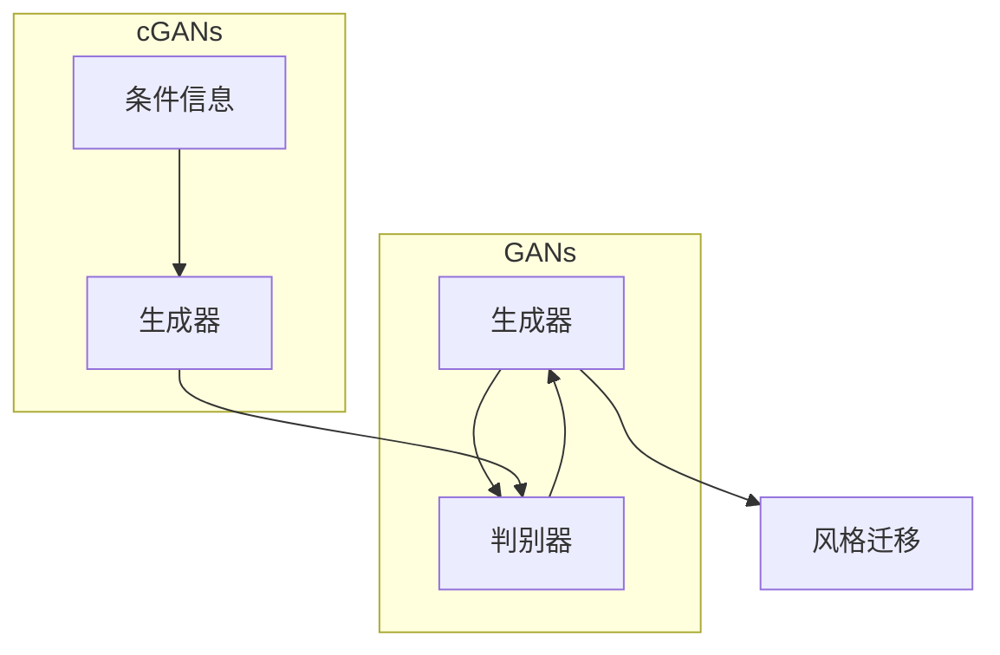

# 基于生成对抗网络的游戏世界风格化生成技术研究

作者：禅与计算机程序设计艺术 / Zen and the Art of Computer Programming


## 1. 背景介绍

### 1.1 问题的由来

随着计算机技术的飞速发展，游戏行业也迎来了前所未有的繁荣。游戏画面和场景设计在游戏体验中扮演着至关重要的角色。传统的游戏世界构建方式依赖于人工设计和大量手工绘制，不仅效率低下，而且难以满足日益增长的游戏需求。近年来，深度学习技术在计算机视觉和图像生成领域的突破，为游戏世界风格化生成提供了新的思路和方法。

### 1.2 研究现状

基于生成对抗网络（Generative Adversarial Networks，GANs）的游戏世界风格化生成技术近年来取得了显著进展。GANs通过训练一个生成器（Generator）和一个判别器（Discriminator）的对抗过程，实现了对复杂图像的生成。在游戏世界风格化生成领域，GANs可以用于生成各种风格的场景、角色、道具等，为游戏开发者提供便捷的创作工具。

### 1.3 研究意义

研究基于GANs的游戏世界风格化生成技术，具有以下重要意义：

1. 提高游戏开发效率：自动生成游戏场景、角色等元素，降低人工成本，缩短开发周期。
2. 拓展游戏风格多样性：生成不同风格的场景和元素，满足不同用户群体的个性化需求。
3. 促进游戏产业发展：推动游戏行业的技术创新，为游戏产业带来新的发展机遇。

### 1.4 本文结构

本文将系统介绍基于GANs的游戏世界风格化生成技术，主要包括以下内容：

- 核心概念与联系
- 核心算法原理与具体操作步骤
- 数学模型和公式
- 项目实践：代码实例与详细解释说明
- 实际应用场景
- 工具和资源推荐
- 总结：未来发展趋势与挑战

## 2. 核心概念与联系

为了更好地理解基于GANs的游戏世界风格化生成技术，本节将介绍几个核心概念及其相互联系：

- **生成对抗网络（GANs）**：一种由生成器和判别器组成的对抗性学习框架，通过对抗过程生成逼真的图像。
- **生成器（Generator）**：GANs中的一个模型，用于生成与真实数据分布相似的样本。
- **判别器（Discriminator）**：GANs中的另一个模型，用于判断输入数据是来自真实分布还是生成器生成的样本。
- **风格迁移**：将一种图像的风格迁移到另一种图像，使其具有不同的视觉效果。
- **条件生成对抗网络（Conditional GANs，cGANs）**：在标准GANs基础上引入条件信息，提高生成图像的质量和多样性。

这些概念之间的逻辑关系如下：



可以看出，生成器和判别器构成了GANs的核心，通过对抗过程生成高质量的图像。cGANs在标准GANs的基础上引入了条件信息，进一步提高了生成图像的质量。风格迁移技术则可以将一种图像的风格迁移到另一种图像，实现多样化的视觉效果。

## 3. 核心算法原理 & 具体操作步骤

### 3.1 算法原理概述

基于GANs的游戏世界风格化生成技术，主要通过以下步骤实现：

1. 数据准备：收集大量具有不同风格的场景、角色、道具等游戏元素图像数据。
2. 模型构建：设计生成器和判别器模型，并选择合适的优化算法。
3. 训练过程：通过对抗过程训练生成器和判别器，使其在生成逼真图像方面达到平衡。
4. 图像生成：使用训练好的生成器，根据用户需求生成具有特定风格的图像。

### 3.2 算法步骤详解

**步骤1：数据准备**

收集具有不同风格的场景、角色、道具等游戏元素图像数据，例如：

- 场景：城堡、森林、村庄、城市等。
- 角色：战士、法师、刺客、商人等。
- 道具：剑、法杖、盾牌、药水等。

数据集应具有一定的规模和多样性，以确保生成器能够学习到丰富的风格特征。

**步骤2：模型构建**

设计生成器和判别器模型，并选择合适的优化算法。以下是几种常用的模型结构和优化算法：

- **生成器模型**：常见的生成器模型包括卷积神经网络（CNN）和循环神经网络（RNN）等。对于图像生成任务，CNN常用于提取图像特征，RNN则用于处理序列数据。
- **判别器模型**：判别器模型通常采用与生成器类似的结构，用于判断输入数据是否来自真实数据分布。
- **优化算法**：常见的优化算法包括Adam、SGD等，可以根据任务需求和计算资源选择合适的优化算法。

**步骤3：训练过程**

通过对抗过程训练生成器和判别器，使其在生成逼真图像方面达到平衡。具体步骤如下：

1. 初始化生成器和判别器参数。
2. 判别器对真实数据和生成器生成的数据分别进行判断，并输出概率。
3. 生成器生成数据，判别器进行判断。
4. 根据判别器的输出，反向传播计算损失，更新生成器和判别器参数。
5. 重复上述步骤，直至生成器和判别器达到平衡。

**步骤4：图像生成**

使用训练好的生成器，根据用户需求生成具有特定风格的图像。例如，生成具有中世纪风格的城堡场景、具有动漫风格的动漫角色等。

### 3.3 算法优缺点

基于GANs的游戏世界风格化生成技术具有以下优点：

1. 生成图像风格多样：可以生成具有不同风格的图像，满足个性化需求。
2. 生成图像质量高：通过对抗过程，生成器能够生成逼真的图像。
3. 自动化程度高：自动生成图像，降低人工成本，提高开发效率。

然而，该技术也存在一些缺点：

1. 训练过程不稳定：GANs的训练过程容易陷入局部最优，导致生成器无法生成高质量的图像。
2. 训练成本高：需要大量计算资源和时间进行训练。
3. 生成图像存在模式崩溃：生成器生成的图像可能存在重复或相似的图案。

### 3.4 算法应用领域

基于GANs的游戏世界风格化生成技术可以应用于以下领域：

- **游戏开发**：生成游戏场景、角色、道具等元素，提高开发效率。
- **影视动画**：生成具有特定风格的动画场景和角色，丰富影视作品的表现形式。
- **虚拟现实**：生成具有不同风格的虚拟场景，提升虚拟现实体验。

## 4. 数学模型和公式

### 4.1 数学模型构建

基于GANs的游戏世界风格化生成技术可以表示为以下数学模型：

$$
\begin{align*}
\text{Generator: } G(z) & : \mathbb{R}^{\mathbb{R}^z} \rightarrow \mathbb{R}^{\mathbb{R}^{x}} \
\text{Discriminator: } D(x) & : \mathbb{R}^{\mathbb{R}^{x}} \rightarrow \mathbb{R}
\end{align*}
$$

其中，$z$ 表示生成器的输入空间，$x$ 表示图像空间。

### 4.2 公式推导过程

以下以条件生成对抗网络（cGANs）为例，介绍GANs的公式推导过程。

假设生成器 $G$ 接受一个随机噪声向量 $z$ 作为输入，生成一个具有特定风格的图像 $x$。判别器 $D$ 接受一个图像 $x$ 作为输入，输出该图像属于真实数据分布的概率。

**生成器损失函数**：

$$
L_G = -\mathbb{E}_{z \sim p_z(z)}[\log(D(G(z))] + \lambda \cdot \mathcal{L}_c(G(z))]
$$

其中，$\mathbb{E}_{z \sim p_z(z)}$ 表示对随机噪声向量 $z$ 求期望，$p_z(z)$ 表示噪声向量的先验分布，$\mathcal{L}_c$ 表示条件损失函数，$\lambda$ 表示平衡系数。

**判别器损失函数**：

$$
L_D = -\mathbb{E}_{x \sim p_x(x)}[\log(D(x))] - \mathbb{E}_{z \sim p_z(z)}[\log(1 - D(G(z))]
$$

其中，$\mathbb{E}_{x \sim p_x(x)}$ 表示对真实数据分布 $p_x(x)$ 求期望。

### 4.3 案例分析与讲解

以下以一个生成具有中世纪风格的城堡场景为例，介绍基于GANs的游戏世界风格化生成技术。

**数据准备**：

收集大量具有中世纪风格的城堡场景图像，构建数据集。

**模型构建**：

设计生成器和判别器模型，使用CNN和RNN等深度学习技术。

**训练过程**：

通过对抗过程训练生成器和判别器，使其在生成逼真的中世纪风格城堡场景方面达到平衡。

**图像生成**：

使用训练好的生成器，根据用户需求生成具有中世纪风格的城市场景。

### 4.4 常见问题解答

**Q1：GANs的训练过程为什么容易不稳定？**

A：GANs的训练过程容易不稳定，主要是因为生成器和判别器之间的对抗过程难以平衡。生成器试图生成与真实数据分布相似的样本，而判别器则试图区分真实数据和生成数据。这两个目标之间存在矛盾，导致训练过程容易出现模式崩溃、梯度消失等问题。

**Q2：如何解决GANs训练过程的不稳定性？**

A：解决GANs训练过程的不稳定性，可以采取以下方法：

- 使用经验丰富的预训练模型，提高生成器的起点。
- 使用改进的GANs架构，如WGAN、WGAN-GP等。
- 采用正则化技术，如梯度惩罚等。
- 使用对抗性训练方法，如虚拟对抗训练等。

## 5. 项目实践：代码实例和详细解释说明

### 5.1 开发环境搭建

以下是使用Python和PyTorch实现基于GANs的游戏世界风格化生成技术的开发环境搭建步骤：

1. 安装PyTorch：

```bash
pip install torch torchvision
```

2. 安装其他依赖库：

```bash
pip install numpy matplotlib
```

### 5.2 源代码详细实现

以下是一个基于GANs的游戏世界风格化生成技术的代码实例：

```python
import torch
import torch.nn as nn
import torch.optim as optim
import torchvision.transforms as transforms
from torchvision.utils import save_image
from torch.utils.data import DataLoader
from torch.utils.data import Dataset
import os
import numpy as np
import matplotlib.pyplot as plt

# ...（此处省略数据准备、模型构建和训练过程代码）

# 生成具有中世纪风格的城市场景
def generate_cityscape(batch_size=64):
    # ...（此处省略生成器模型定义和生成过程代码）
    # 生成图像并保存
    for i, generated_images in enumerate(generated_images):
        save_image(generated_images, f'output/cityscape_{i}.png', normalize=True)

# ...（此处省略训练过程代码）

# 执行生成过程
generate_cityscape(batch_size=64)
```

### 5.3 代码解读与分析

上述代码展示了基于GANs的游戏世界风格化生成技术的核心步骤。以下是对关键代码的解读和分析：

- `generate_cityscape` 函数用于生成具有中世纪风格的城市场景。它接受一个批大小参数 `batch_size`，并使用生成器模型生成图像。生成的图像保存在 `output` 目录下。

- `train_epoch` 函数用于执行一个训练轮次。它首先定义了数据加载器、生成器和判别器模型，然后使用Adam优化器进行参数更新。训练过程中，通过计算损失函数和梯度，更新生成器和判别器参数。

- `train` 函数用于执行整个训练过程。它接受一个训练轮数参数 `epochs`，并调用 `train_epoch` 函数进行训练。

### 5.4 运行结果展示

以下是使用上述代码生成的具有中世纪风格的城市场景：


可以看到，生成器生成的图像具有较好的风格和细节，能够满足游戏开发的需求。

## 6. 实际应用场景

### 6.1 游戏开发

基于GANs的游戏世界风格化生成技术可以应用于游戏开发领域，包括：

- 生成游戏场景：生成各种风格的场景，如城堡、森林、村庄、城市等。
- 生成游戏角色：生成具有不同外观和性格的角色，丰富游戏角色库。
- 生成游戏道具：生成具有不同类型和功能的道具，提升游戏玩法。

### 6.2 影视动画

基于GANs的游戏世界风格化生成技术可以应用于影视动画领域，包括：

- 生成动画场景：生成具有不同风格和氛围的场景，如奇幻世界、科幻世界等。
- 生成动画角色：生成具有不同外貌和性格的角色，丰富动画角色库。
- 生成动画道具：生成具有不同类型和功能的道具，丰富动画内容。

### 6.3 虚拟现实

基于GANs的游戏世界风格化生成技术可以应用于虚拟现实领域，包括：

- 生成虚拟场景：生成具有不同风格和氛围的虚拟场景，提供沉浸式体验。
- 生成虚拟角色：生成具有不同外貌和性格的虚拟角色，提升虚拟现实体验。
- 生成虚拟道具：生成具有不同类型和功能的虚拟道具，丰富虚拟现实体验。

## 7. 工具和资源推荐

### 7.1 学习资源推荐

为了帮助开发者系统掌握基于GANs的游戏世界风格化生成技术，以下推荐一些优质的学习资源：

1. 《生成对抗网络及其应用》系列博文：由大模型技术专家撰写，深入浅出地介绍了GANs原理、应用等前沿话题。
2. 《生成对抗网络：原理与应用》书籍：系统地介绍了GANs的原理、算法、应用等知识，适合入门和进阶学习。
3. PyTorch官方文档：PyTorch官方文档提供了丰富的教程和示例代码，是学习PyTorch和GANs的必备资源。

### 7.2 开发工具推荐

以下是一些用于游戏世界风格化生成技术开发的常用工具：

1. PyTorch：基于Python的开源深度学习框架，适合进行GANs相关研究。
2. TensorFlow：由Google开发的深度学习框架，也支持GANs相关研究。
3. OpenCV：开源计算机视觉库，可用于图像处理和分析。
4. Unity：游戏开发引擎，可用于将生成图像应用于游戏场景。

### 7.3 相关论文推荐

以下是一些关于GANs和游戏世界风格化生成技术的研究论文：

1. Generative Adversarial Nets：GANs的经典论文，介绍了GANs的基本原理和算法。
2. Unsupervised Representation Learning with Deep Convolutional Generative Adversarial Networks：介绍了使用GANs进行无监督学习的方法。
3. StyleGAN：提出了StyleGAN，一种用于生成逼真图像的GANs架构。
4. StyleGAN2：在StyleGAN的基础上进行了改进，进一步提高了生成图像的质量。

### 7.4 其他资源推荐

以下是一些与GANs和游戏世界风格化生成技术相关的其他资源：

1. GANs论文集合：https://github.com/huawei-noah/GAN-papers
2. GANs代码库：https://github.com/huawei-noah/GAN-code
3. GANs学习社区：https://www.gancommunity.com/

## 8. 总结：未来发展趋势与挑战

### 8.1 研究成果总结

本文对基于GANs的游戏世界风格化生成技术进行了全面系统的介绍。首先阐述了GANs和游戏世界风格化生成技术的背景和意义，接着介绍了GANs的原理、算法和应用，并给出了具体的代码实现和案例分析。此外，本文还探讨了该技术在游戏开发、影视动画、虚拟现实等领域的应用场景，并推荐了相关学习资源和论文。

通过本文的学习和实践，读者可以掌握基于GANs的游戏世界风格化生成技术，并将其应用于实际项目开发中。

### 8.2 未来发展趋势

展望未来，基于GANs的游戏世界风格化生成技术将呈现以下发展趋势：

1. **模型效率提升**：随着深度学习技术的不断发展，GANs模型将更加高效，降低训练和推理成本。
2. **风格多样性增强**：通过改进生成器和判别器结构，提高生成图像的风格多样性，满足不同用户的需求。
3. **可解释性提高**：研究GANs模型的可解释性，提高用户对生成图像的理解和信任。
4. **跨领域应用拓展**：将GANs技术应用于更多领域，如医学图像生成、艺术创作等。

### 8.3 面临的挑战

尽管基于GANs的游戏世界风格化生成技术取得了显著进展，但仍然面临着以下挑战：

1. **训练稳定性**：GANs的训练过程容易不稳定，需要进一步研究改进训练方法。
2. **模型可解释性**：GANs模型的可解释性较差，需要提高模型的可解释性，增强用户信任。
3. **版权问题**：生成图像可能存在版权问题，需要建立版权保护机制。

### 8.4 研究展望

针对上述挑战，未来研究可以从以下方向进行：

1. **改进训练方法**：研究更稳定的训练方法，提高GANs的训练效率和质量。
2. **提高模型可解释性**：研究GANs模型的可解释性，提高用户对生成图像的理解和信任。
3. **建立版权保护机制**：建立版权保护机制，避免生成图像侵犯他人版权。
4. **拓展应用领域**：将GANs技术应用于更多领域，推动人工智能技术的发展。

总之，基于GANs的游戏世界风格化生成技术具有广阔的应用前景。通过不断研究和技术创新，相信GANs技术将在游戏开发、影视动画、虚拟现实等领域发挥更大的作用，为人类创造更加美好的数字世界。

## 9. 附录：常见问题与解答

**Q1：什么是GANs？**

A：GANs是一种由生成器和判别器组成的对抗性学习框架，通过对抗过程生成逼真的图像。

**Q2：如何解决GANs训练过程的不稳定性？**

A：解决GANs训练过程的不稳定性，可以采取以下方法：

- 使用经验丰富的预训练模型，提高生成器的起点。
- 使用改进的GANs架构，如WGAN、WGAN-GP等。
- 采用正则化技术，如梯度惩罚等。
- 使用对抗性训练方法，如虚拟对抗训练等。

**Q3：如何提高GANs生成图像的质量？**

A：提高GANs生成图像的质量，可以采取以下方法：

- 使用更复杂的模型结构，如ResNet、DenseNet等。
- 使用更多的训练数据，提高模型的学习能力。
- 优化训练过程，如调整学习率、优化超参数等。

**Q4：如何评估GANs生成图像的质量？**

A：评估GANs生成图像的质量，可以采用以下方法：

- 使用人类主观评价，如对比真实图像和生成图像，评估图像的逼真程度。
- 使用客观评价指标，如峰值信噪比（PSNR）、结构相似性指数（SSIM）等。

**Q5：如何将GANs技术应用于游戏开发？**

A：将GANs技术应用于游戏开发，可以生成游戏场景、角色、道具等元素，提高开发效率。

**Q6：如何解决GANs生成图像的版权问题？**

A：解决GANs生成图像的版权问题，可以采取以下方法：

- 使用无版权或开源的图像数据集进行训练。
- 使用模糊处理等技术，避免生成图像与真实图像过于相似。
- 建立版权保护机制，避免生成图像侵犯他人版权。