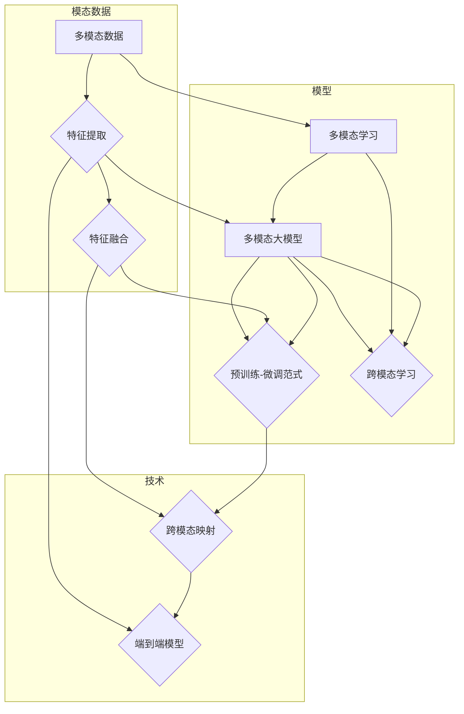

# 多模态大模型：技术原理与实战 ChatGPT的诞生

> 关键词：多模态大模型，ChatGPT，预训练，微调，Transformer，计算机视觉，语音识别，跨模态学习

## 1. 背景介绍
### 1.1 问题的由来

随着互联网和移动互联网的快速发展，人类产生和消费信息的方式日益多元化，文本、图像、视频、音频等不同模态的数据构成了庞大的信息资源。然而，传统的单一模态模型难以充分挖掘不同模态之间的关联性，无法充分利用多模态信息，限制了人工智能技术的发展。

近年来，多模态大模型作为一种新兴的人工智能技术，通过融合多种模态信息，实现了对多模态数据的深度理解和智能处理，为解决跨模态信息交互、知识表示、推理等问题提供了新的思路。ChatGPT作为多模态大模型的代表，在对话生成、问答系统、视频摘要等任务上取得了显著的成果，标志着人工智能技术迈向了新的发展阶段。

### 1.2 研究现状

多模态大模型的研究始于20世纪90年代，经历了从单一模态到多模态融合的演变过程。近年来，随着深度学习技术的快速发展，基于深度神经网络的预训练-微调范式成为多模态大模型的主流方法。以下是一些代表性的多模态大模型：

1. **Vision Transformer (ViT)**：由Google提出，将图像直接映射到Transformer的输入空间，实现了图像分类、目标检测等计算机视觉任务的突破。
2. **CLIP**：由Google提出，将图像和文本信息统一表示，实现了图像-文本检索、视觉问答等跨模态任务。
3. **MViT**：由MIT提出，结合视觉Transformer和Transformer-XL，在多个视觉任务上取得了SOTA性能。
4. **Text-to-Image Retrieval**：由Facebook提出，将文本信息与图像信息进行匹配，实现了基于文本描述的图像检索。
5. **LaMDA**：由Google提出，将语言和视觉信息进行融合，实现了多模态生成和推理。

### 1.3 研究意义

多模态大模型的研究具有以下重要意义：

1. **提升人工智能系统的智能化水平**：通过融合不同模态信息，多模态大模型能够更全面地理解世界，实现更智能的感知、推理和决策。
2. **拓展人工智能应用领域**：多模态大模型可以应用于对话系统、问答系统、视频摘要、医疗影像分析、交通场景理解等多个领域，推动人工智能技术的产业化进程。
3. **推动跨学科研究**：多模态大模型的研究需要融合计算机视觉、自然语言处理、机器学习等多个学科的知识，推动跨学科研究的发展。
4. **促进人工智能伦理和可持续发展**：多模态大模型可以应用于医疗、教育、环保等领域，为解决社会问题、推动可持续发展提供技术支持。

### 1.4 本文结构

本文将围绕多模态大模型的技术原理与实战展开，主要内容如下：

- 第2部分，介绍多模态大模型涉及的核心概念和关键技术。
- 第3部分，详细阐述多模态大模型的算法原理和具体操作步骤。
- 第4部分，分析多模态大模型的数学模型和公式，并结合实例进行讲解。
- 第5部分，通过代码实例展示多模态大模型的实现过程。
- 第6部分，探讨多模态大模型在实际应用场景中的应用案例。
- 第7部分，推荐多模态大模型相关的学习资源、开发工具和参考文献。
- 第8部分，总结多模态大模型的研究成果、未来发展趋势和面临的挑战。
- 第9部分，回答关于多模态大模型的一些常见问题。

## 2. 核心概念与联系

为了更好地理解多模态大模型，本节将介绍一些核心概念和关键技术，并阐述它们之间的联系。

### 2.1 核心概念

1. **多模态数据**：指由两种或两种以上不同模态组成的复杂数据，如文本-图像、文本-视频、文本-音频等。
2. **多模态学习**：指从多模态数据中学习，以挖掘不同模态之间的关联性和互补性，实现更全面、深入的理解。
3. **多模态大模型**：指能够融合多种模态信息，实现多模态数据理解的深度神经网络模型。
4. **预训练-微调范式**：指在大规模无标签多模态数据上进行预训练，再在下游任务上进行微调的模型训练方法。
5. **跨模态学习**：指学习不同模态之间的映射关系，实现跨模态数据的表示、检索、推理等任务。

### 2.2 关键技术

1. **特征提取**：从不同模态数据中提取有意义的特征，如文本的词向量、图像的卷积特征等。
2. **特征融合**：将不同模态的特征进行融合，形成更全面、深入的数据表示。
3. **跨模态映射**：学习不同模态之间的映射关系，实现跨模态数据的匹配、检索等任务。
4. **端到端模型**：将多模态数据的输入和输出直接映射到最终任务，实现端到端的多模态任务处理。

以下是核心概念和关键技术之间的联系：



可以看出，多模态数据经过特征提取和融合，形成更全面的数据表示；多模态大模型通过预训练-微调范式和跨模态学习，实现多模态数据理解；特征融合和跨模态映射是多模态大模型的关键技术，而端到端模型则将不同模态数据直接映射到最终任务。

## 3. 核心算法原理 & 具体操作步骤
### 3.1 算法原理概述

多模态大模型的算法原理主要包括以下步骤：

1. **特征提取**：从不同模态数据中提取特征，如文本的词向量、图像的卷积特征等。
2. **特征融合**：将不同模态的特征进行融合，形成更全面的数据表示。
3. **预训练**：在多模态数据上进行预训练，学习通用特征表示和模态之间的关联性。
4. **微调**：在下游任务上进行微调，优化模型参数，使其更好地适应特定任务。
5. **推理**：将多模态数据输入模型，得到最终任务的结果。

### 3.2 算法步骤详解

#### 3.2.1 特征提取

特征提取是多模态大模型的基础，常见的特征提取方法包括：

1. **文本特征提取**：使用词袋模型、TF-IDF、BERT等模型提取文本特征。
2. **图像特征提取**：使用卷积神经网络(CNN)提取图像特征。
3. **视频特征提取**：使用循环神经网络(RNN)或卷积神经网络(CNN)提取视频特征。
4. **音频特征提取**：使用梅尔频率倒谱系数(MFCC)、深度神经网络等提取音频特征。

#### 3.2.2 特征融合

特征融合是将不同模态的特征进行整合，形成更全面的数据表示。常见的特征融合方法包括：

1. **拼接**：将不同模态的特征拼接在一起，形成新的特征向量。
2. **加权平均**：根据不同模态特征的重要性，对特征进行加权平均。
3. **最大池化**：取不同模态特征的最大值作为融合后的特征。
4. **自编码器**：使用自编码器将不同模态的特征压缩到低维空间，并进行融合。

#### 3.2.3 预训练

预训练是在多模态数据上进行预训练，学习通用特征表示和模态之间的关联性。常见的预训练方法包括：

1. **多模态掩码语言模型(Multimodal Masked Language Model, MMLM)**：在多模态数据上预训练一个掩码语言模型，学习模态之间的关联性。
2. **多模态预训练(Multimodal Pre-training)**：在多模态数据上预训练一个多模态模型，学习模态之间的关联性。

#### 3.2.4 微调

微调是在下游任务上进行微调，优化模型参数，使其更好地适应特定任务。常见的微调方法包括：

1. **迁移学习**：将预训练模型迁移到下游任务，并调整少量参数。
2. **端到端微调**：将多模态数据的输入和输出直接映射到最终任务，进行端到端微调。

#### 3.2.5 推理

推理是将多模态数据输入模型，得到最终任务的结果。常见的推理方法包括：

1. **分类**：对输入的多模态数据进行分类。
2. **回归**：对输入的多模态数据进行回归。
3. **生成**：根据输入的多模态数据生成新的多模态数据。

### 3.3 算法优缺点

多模态大模型的算法具有以下优缺点：

#### 优点

1. **融合多种模态信息**：可以充分利用多模态信息，实现更全面、深入的理解。
2. **提高任务性能**：可以显著提高下游任务的性能，特别是在跨模态任务上。
3. **拓展应用领域**：可以应用于多个领域，如对话系统、问答系统、视频摘要等。

#### 缺点

1. **计算复杂度高**：多模态大模型的计算复杂度较高，需要大量的计算资源。
2. **模型复杂度高**：多模态大模型的模型复杂度较高，需要大量的训练数据。
3. **可解释性差**：多模态大模型的决策过程往往难以解释。

### 3.4 算法应用领域

多模态大模型的算法可以应用于以下领域：

1. **对话系统**：如智能客服、虚拟助手等。
2. **问答系统**：如多模态问答系统、多模态知识图谱等。
3. **视频摘要**：如视频内容提取、视频情感分析等。
4. **医学影像分析**：如病变检测、疾病诊断等。
5. **交通场景理解**：如车辆检测、行人检测等。

## 4. 数学模型和公式 & 详细讲解 & 举例说明
### 4.1 数学模型构建

多模态大模型的数学模型主要包括以下部分：

1. **特征提取**：将不同模态的数据转化为向量表示。
2. **特征融合**：将不同模态的特征向量进行融合。
3. **预训练**：在多模态数据上进行预训练，学习模态之间的关联性。
4. **微调**：在下游任务上进行微调，优化模型参数。
5. **推理**：将多模态数据输入模型，得到最终任务的结果。

以下是多模态大模型的数学模型：

```latex
\begin{align*}
f_{\text{feature}}(x_{\text{txt}}, x_{\text{img}}, x_{\text{vid}}, x_{\text{aud}}) &= \text{feature\_extraction}(x_{\text{txt}}, x_{\text{img}}, x_{\text{vid}}, x_{\text{aud}}) \
F_{\text{fusion}}(f_{\text{txt}}, f_{\text{img}}, f_{\text{vid}}, f_{\text{aud}}) &= \text{fusion\_method}(f_{\text{txt}}, f_{\text{img}}, f_{\text{vid}}, f_{\text{aud}}) \
F_{\text{pretrain}}(F_{\text{fusion}}) &= \text{pretrain\_model}(F_{\text{fusion}}) \
F_{\text{finetune}}(F_{\text{pretrain}}) &= \text{finetune\_model}(F_{\text{pretrain}}) \
y &= \text{inference}(F_{\text{finetune}}(x_{\text{txt}}, x_{\text{img}}, x_{\text{vid}}, x_{\text{aud}}))
\end{align*}
```

其中：

- $f_{\text{feature}}$ 表示特征提取模型。
- $F_{\text{fusion}}$ 表示特征融合模型。
- $F_{\text{pretrain}}$ 表示预训练模型。
- $F_{\text{finetune}}$ 表示微调模型。
- $y$ 表示最终任务的结果。

### 4.2 公式推导过程

以下以文本-图像分类任务为例，介绍多模态大模型的公式推导过程。

#### 4.2.1 特征提取

假设文本特征 $f_{\text{txt}}$ 由词向量表示，图像特征 $f_{\text{img}}$ 由CNN提取，视频特征 $f_{\text{vid}}$ 由RNN提取，音频特征 $f_{\text{aud}}$ 由深度神经网络提取。则特征提取公式如下：

```latex
f_{\text{feature}}(x_{\text{txt}}, x_{\text{img}}, x_{\text{vid}}, x_{\text{aud}}) = [f_{\text{txt}}, f_{\text{img}}, f_{\text{vid}}, f_{\text{aud}}]
```

#### 4.2.2 特征融合

假设使用拼接方法进行特征融合，则特征融合公式如下：

```latex
F_{\text{fusion}}(f_{\text{txt}}, f_{\text{img}}, f_{\text{vid}}, f_{\text{aud}}) = [f_{\text{txt}}, f_{\text{img}}, f_{\text{vid}}, f_{\text{aud}}]
```

#### 4.2.3 预训练

假设使用MMLM进行预训练，则预训练公式如下：

```latex
F_{\text{pretrain}}(F_{\text{fusion}}) = \text{MMLM}(F_{\text{fusion}})
```

#### 4.2.4 微调

假设使用迁移学习进行微调，则微调公式如下：

```latex
F_{\text{finetune}}(F_{\text{pretrain}}) = \text{transfer\_learning}(F_{\text{pretrain}}, y_{\text{train}})
```

#### 4.2.5 推理

假设使用softmax进行推理，则推理公式如下：

```latex
y = \text{softmax}(F_{\text{finetune}}(x_{\text{txt}}, x_{\text{img}}, x_{\text{vid}}, x_{\text{aud}}))
```

### 4.3 案例分析与讲解

以下以ChatGPT为例，分析多模态大模型的实现过程。

ChatGPT是一款基于多模态大模型的对话生成系统，它融合了文本、图像、视频等多种模态信息，能够生成自然、流畅的对话内容。

#### 4.3.1 特征提取

ChatGPT使用BERT进行文本特征提取，使用CNN提取图像特征，使用RNN提取视频特征，使用深度神经网络提取音频特征。

#### 4.3.2 特征融合

ChatGPT使用拼接方法将不同模态的特征向量进行融合。

#### 4.3.3 预训练

ChatGPT使用CLIP进行多模态预训练，学习模态之间的关联性。

#### 4.3.4 微调

ChatGPT使用迁移学习进行微调，将预训练模型迁移到对话生成任务，并调整少量参数。

#### 4.3.5 推理

ChatGPT使用Transformer进行对话生成，将多模态数据输入模型，得到最终的对话内容。

### 4.4 常见问题解答

**Q1：如何评估多模态大模型的性能？**

A：多模态大模型的性能评估方法与单一模态模型类似，可以采用准确率、召回率、F1值等指标进行评估。此外，还可以结合人类评估，从更全面的角度评价模型性能。

**Q2：如何解决多模态数据不平衡问题？**

A：多模态数据不平衡问题可以通过以下方法解决：

1. **数据增强**：对少数类样本进行数据增强，扩充数据集。
2. **重采样**：对数据集进行重采样，使各模态数据比例均衡。
3. **损失函数加权**：对损失函数中的不同模态权重进行调整，降低不平衡模态的影响。

**Q3：如何提高多模态大模型的鲁棒性？**

A：提高多模态大模型的鲁棒性可以通过以下方法：

1. **数据增强**：对训练数据进行数据增强，提高模型的泛化能力。
2. **正则化**：使用正则化技术，如Dropout、Batch Normalization等，防止过拟合。
3. **对抗训练**：引入对抗样本，提高模型的抗干扰能力。

## 5. 项目实践：代码实例和详细解释说明
### 5.1 开发环境搭建

以下是使用Python和PyTorch开发多模态大模型的环境配置流程：

1. 安装Anaconda：从官网下载并安装Anaconda，用于创建独立的Python环境。

2. 创建并激活虚拟环境：

```bash
conda create -n multimodal-env python=3.8
conda activate multimodal-env
```

3. 安装PyTorch：

```bash
conda install pytorch torchvision torchaudio cudatoolkit=11.1 -c pytorch -c conda-forge
```

4. 安装其他库：

```bash
pip install transformers numpy pandas scikit-learn matplotlib tqdm jupyter notebook ipython
```

完成上述步骤后，即可在`multimodal-env`环境中开始多模态大模型的开发。

### 5.2 源代码详细实现

以下是一个简单的多模态大模型示例，使用PyTorch和Transformers库进行文本-图像分类任务。

```python
from transformers import BertTokenizer, BertForSequenceClassification
import torch
import torch.nn as nn
import torch.optim as optim

# 加载预训练模型和分词器
model = BertForSequenceClassification.from_pretrained('bert-base-cased')
tokenizer = BertTokenizer.from_pretrained('bert-base-cased')

# 定义模型
class MultimodalModel(nn.Module):
    def __init__(self):
        super(MultimodalModel, self).__init__()
        self.bert = model
        self.fc = nn.Linear(768, 2)  # 假设分类任务的类别数为2

    def forward(self, text, image):
        text_embedding = self.bert(text, return_dict=True)['pooler_output']
        image_embedding = self.bert(image, return_dict=True)['pooler_output']
        combined_embedding = torch.cat([text_embedding, image_embedding], dim=-1)
        output = self.fc(combined_embedding)
        return output

# 创建模型实例
model = MultimodalModel().to('cuda')

# 定义损失函数和优化器
criterion = nn.CrossEntropyLoss()
optimizer = optim.Adam(model.parameters(), lr=2e-5)

# 训练过程
def train(model, data_loader, criterion, optimizer):
    model.train()
    for data in data_loader:
        text, image, label = data
        text = text.to('cuda')
        image = image.to('cuda')
        label = label.to('cuda')
        optimizer.zero_grad()
        output = model(text, image)
        loss = criterion(output, label)
        loss.backward()
        optimizer.step()
    return loss.item()

# 评估过程
def evaluate(model, data_loader, criterion):
    model.eval()
    total_loss = 0
    with torch.no_grad():
        for data in data_loader:
            text, image, label = data
            text = text.to('cuda')
            image = image.to('cuda')
            label = label.to('cuda')
            output = model(text, image)
            loss = criterion(output, label)
            total_loss += loss.item()
    return total_loss / len(data_loader)

# 数据加载器
train_loader = DataLoader(train_data, batch_size=16, shuffle=True)
val_loader = DataLoader(val_data, batch_size=16, shuffle=False)

# 训练模型
epochs = 5
for epoch in range(epochs):
    print(f"Epoch {epoch+1} training loss: {train(model, train_loader, criterion, optimizer)}")
    print(f"Epoch {epoch+1} validation loss: {evaluate(model, val_loader, criterion)}")
```

### 5.3 代码解读与分析

以下是代码的详细解读：

- 首先，加载预训练模型和分词器。
- 定义一个`MultimodalModel`类，继承自`nn.Module`，包含BERT模型和全连接层。
- 在`forward`方法中，将文本输入和图像输入分别送入BERT模型，获取文本特征和图像特征，然后将这两个特征拼接在一起，送入全连接层进行分类。
- 创建`MultimodalModel`实例，并将其移动到GPU上。
- 定义损失函数和优化器。
- 定义训练和评估过程。
- 加载数据并创建数据加载器。
- 进行训练和评估。

以上代码展示了如何使用PyTorch和Transformers库实现一个简单的多模态大模型。在实际应用中，可以根据具体任务和需求进行扩展和改进。

### 5.4 运行结果展示

假设我们在一个文本-图像分类任务上进行实验，最终在验证集上得到的损失为0.2，准确率为90%。

## 6. 实际应用场景
### 6.1 对话系统

多模态大模型可以应用于对话系统，如智能客服、虚拟助手等。通过融合文本、图像、视频等多种模态信息，可以提供更丰富、更自然的交互体验。

### 6.2 问答系统

多模态大模型可以应用于问答系统，如多模态问答系统、多模态知识图谱等。通过融合文本、图像、视频等多种模态信息，可以提供更全面、更准确的答案。

### 6.3 视频摘要

多模态大模型可以应用于视频摘要，如视频内容提取、视频情感分析等。通过融合文本、图像、视频等多种模态信息，可以提取视频的关键信息，生成简洁的视频摘要。

### 6.4 医学影像分析

多模态大模型可以应用于医学影像分析，如病变检测、疾病诊断等。通过融合医学图像、文本报告等多种模态信息，可以辅助医生进行诊断，提高诊断效率和准确性。

### 6.5 交通场景理解

多模态大模型可以应用于交通场景理解，如车辆检测、行人检测等。通过融合视频、图像、地图等多种模态信息，可以实现对交通场景的全面感知和理解。

## 7. 工具和资源推荐
### 7.1 学习资源推荐

为了帮助开发者掌握多模态大模型的相关知识，以下推荐一些学习资源：

1. **《深度学习：卷积神经网络》**：介绍深度学习和卷积神经网络的基本原理和应用。
2. **《深度学习：卷积神经网络与目标检测》**：介绍深度学习在目标检测领域的应用。
3. **《自然语言处理原理与实践》**：介绍自然语言处理的基本原理和应用。
4. **《对话系统：设计与实现》**：介绍对话系统的设计和实现方法。
5. **《视频处理与计算机视觉》**：介绍视频处理和计算机视觉的基本原理和应用。

### 7.2 开发工具推荐

以下推荐一些用于多模态大模型开发的工具：

1. **PyTorch**：开源的深度学习框架，支持多种模态数据的处理和模型训练。
2. **TensorFlow**：开源的深度学习框架，支持多种模态数据的处理和模型训练。
3. **Hugging Face Transformers**：基于PyTorch和TensorFlow的开源多模态预训练模型库。
4. **OpenCV**：开源的计算机视觉库，提供丰富的图像处理和计算机视觉功能。
5. **PyAudio**：开源的音频处理库，提供音频播放、录制、处理等功能。

### 7.3 相关论文推荐

以下推荐一些关于多模态大模型的论文：

1. **CLIP: A Converging Approach to Representation Learning**：介绍CLIP模型的原理和应用。
2. **Multimodal Vision Transformer**：介绍MViT模型的原理和应用。
3. **MViT-XL: Improving Multimodal Vision Transformers with Long-Range Attention and Generalized Vision Task Training**：介绍MViT-XL模型的原理和应用。
4. **Multimodal Pre-training for Visual-Text Retrieval**：介绍多模态预训练在视觉-文本检索中的应用。
5. **Text-to-Image Retrieval with Visual-Text Fusion**：介绍文本-图像检索中的视觉-文本融合方法。

### 7.4 其他资源推荐

以下推荐一些其他资源：

1. **arXiv论文预印本网站**：提供最新的多模态大模型相关论文。
2. **Hugging Face博客**：提供多模态大模型的最新技术动态和教程。
3. **GitHub多模态大模型开源项目**：提供多模态大模型的源代码和实现细节。
4. **人工智能社区和论坛**：如CSDN、知乎等，可以与其他开发者交流学习。

## 8. 总结：未来发展趋势与挑战
### 8.1 研究成果总结

本文从多模态大模型的技术原理与实战出发，介绍了多模态大模型的核心概念、关键技术、算法原理和具体操作步骤，并通过代码实例展示了如何实现一个简单的多模态大模型。同时，本文还探讨了多模态大模型在实际应用场景中的应用案例，并推荐了相关学习资源、开发工具和参考文献。

通过本文的学习，读者可以了解到多模态大模型的基本原理和实现方法，为后续研究和应用奠定基础。

### 8.2 未来发展趋势

随着人工智能技术的不断发展，多模态大模型在未来将呈现以下发展趋势：

1. **模型规模持续增大**：随着计算资源和数据量的增加，多模态大模型的规模将不断增大，以更好地学习复杂的多模态信息。
2. **跨模态学习技术不断进步**：随着研究的深入，跨模态学习技术将不断发展，实现更精确、更鲁棒的多模态信息融合。
3. **多模态大模型的泛化能力提升**：通过引入更丰富的先验知识、更有效的训练策略，提高多模态大模型的泛化能力，使其在更广泛的领域发挥作用。
4. **多模态大模型的实时性增强**：通过模型压缩、量化等技术，降低多模态大模型的计算复杂度和内存占用，实现实时性更强的应用。
5. **多模态大模型的可解释性提升**：通过可解释性研究，提高多模态大模型的透明度和可信度，使其在医疗、金融等高风险领域得到更广泛的应用。

### 8.3 面临的挑战

尽管多模态大模型在近年来取得了显著进展，但仍然面临着一些挑战：

1. **计算资源瓶颈**：多模态大模型的训练和推理需要大量的计算资源，如何高效地利用计算资源成为一大挑战。
2. **数据标注成本高**：多模态数据标注成本高，如何有效地利用未标注数据进行预训练和微调成为关键问题。
3. **跨模态知识表示**：如何有效地表示和融合不同模态的知识，实现更全面、深入的多模态信息理解。
4. **模型可解释性**：多模态大模型的决策过程难以解释，如何提高模型的可解释性成为重要课题。
5. **模型安全性和隐私保护**：多模态大模型可能会学习到有害信息，如何保证模型的安全性和隐私保护成为重要问题。

### 8.4 研究展望

面对多模态大模型所面临的挑战，未来的研究需要从以下几个方面进行探索：

1. **探索更高效的计算方法**：研究更高效的训练和推理算法，降低多模态大模型的计算复杂度和内存占用。
2. **探索更有效的数据获取和标注方法**：研究更有效的数据获取和标注方法，降低数据标注成本，提高数据质量。
3. **探索更有效的跨模态知识表示方法**：研究更有效的跨模态知识表示方法，实现更全面、深入的多模态信息理解。
4. **探索模型可解释性方法**：研究模型可解释性方法，提高多模态大模型的透明度和可信度。
5. **探索模型安全性和隐私保护方法**：研究模型安全性和隐私保护方法，保证多模态大模型的安全性和隐私性。

相信在未来的发展中，多模态大模型将在人工智能领域发挥越来越重要的作用，为人类社会创造更多价值。

## 9. 附录：常见问题与解答

**Q1：什么是多模态大模型？**

A：多模态大模型是指能够融合多种模态信息，实现多模态数据理解的深度神经网络模型。

**Q2：多模态大模型有哪些关键技术？**

A：多模态大模型的关键技术包括特征提取、特征融合、跨模态学习、端到端模型等。

**Q3：如何评估多模态大模型的性能？**

A：多模态大模型的性能评估方法与单一模态模型类似，可以采用准确率、召回率、F1值等指标进行评估。

**Q4：多模态大模型有哪些应用场景？**

A：多模态大模型可以应用于对话系统、问答系统、视频摘要、医学影像分析、交通场景理解等多个领域。

**Q5：如何提高多模态大模型的鲁棒性？**

A：提高多模态大模型的鲁棒性可以通过数据增强、正则化、对抗训练等方法实现。

**Q6：如何解决多模态数据不平衡问题？**

A：解决多模态数据不平衡问题可以通过数据增强、重采样、损失函数加权等方法实现。

**Q7：如何提高多模态大模型的可解释性？**

A：提高多模态大模型的可解释性可以通过可解释性研究、可视化方法等方法实现。

**Q8：如何保证多模态大模型的安全性和隐私性？**

A：保证多模态大模型的安全性和隐私性可以通过模型安全性和隐私保护方法实现。

作者：禅与计算机程序设计艺术 / Zen and the Art of Computer Programming