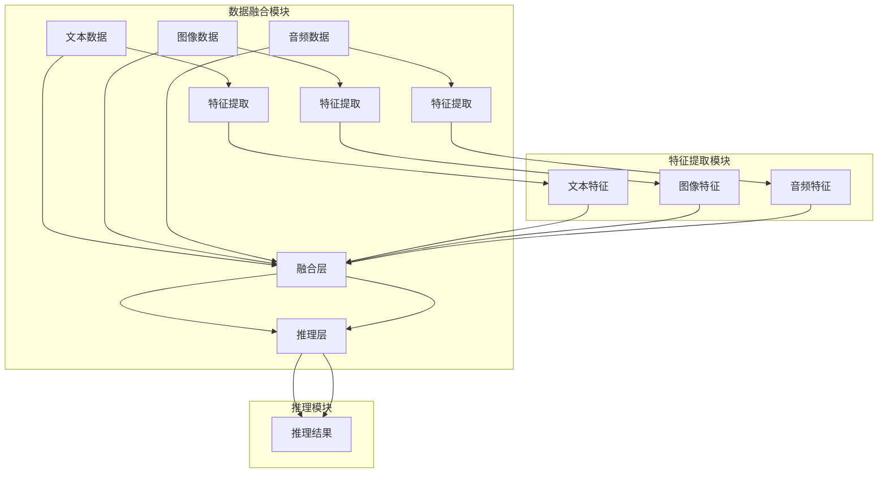

# 多模态大模型：技术原理与实战 如何提高长文本阅读能力

作者：禅与计算机程序设计艺术 / Zen and the Art of Computer Programming

## 1. 背景介绍

### 1.1 问题的由来

随着信息技术的飞速发展，人类获取信息的渠道日益丰富，信息量呈指数级增长。传统的单模态信息处理方法已无法满足人们对信息理解和获取的需求。多模态大模型应运而生，它融合了文本、图像、音频等多模态信息，能够更全面地理解和处理复杂信息，为人们提供更加智能化的信息服务。

### 1.2 研究现状

近年来，多模态大模型在计算机视觉、自然语言处理、语音识别等领域取得了显著的成果。目前，已有许多多模态大模型框架和算法被提出，如Multimodal Transformer、MoCoV2、ViT等。

### 1.3 研究意义

多模态大模型的研究具有以下意义：

1. 提高信息获取和处理能力，助力智能助手、推荐系统等应用的发展。
2. 促进人机交互的智能化，为人们提供更加便捷、高效的信息获取方式。
3. 推动跨学科研究，促进人工智能与各领域的融合。

### 1.4 本文结构

本文将从多模态大模型的技术原理、实战案例和未来发展趋势等方面进行探讨，旨在帮助读者全面了解多模态大模型，并为其应用提供参考。

## 2. 核心概念与联系

### 2.1 多模态大模型

多模态大模型是指能够融合多种模态信息（如文本、图像、音频等）进行处理和推理的深度学习模型。多模态大模型通常包含以下关键组件：

1. **数据融合模块**：将不同模态的数据进行融合，如特征拼接、注意力机制等。
2. **特征提取模块**：提取各个模态的底层特征。
3. **推理模块**：对融合后的特征进行推理和决策。

### 2.2 关联关系

多模态大模型中的各个组件之间存在着紧密的关联关系，如图所示：



### 2.3 相关技术

1. **注意力机制**：注意力机制可以聚焦于不同模态中的重要信息，提高模型对关键信息的关注度。
2. **特征提取**：特征提取是构建多模态大模型的基础，常用的特征提取方法包括卷积神经网络（CNN）、循环神经网络（RNN）和Transformer等。
3. **融合策略**：融合策略包括特征拼接、特征级联、注意力机制等，旨在将不同模态的特征进行有效整合。

## 3. 核心算法原理 & 具体操作步骤

### 3.1 算法原理概述

多模态大模型的核心算法主要包括以下几部分：

1. **特征提取**：分别从文本、图像、音频等模态中提取特征。
2. **特征融合**：将不同模态的特征进行融合，得到融合特征。
3. **推理和决策**：基于融合特征进行推理和决策。

### 3.2 算法步骤详解

1. **数据预处理**：将不同模态的数据进行预处理，如文本分词、图像缩放、音频降噪等。
2. **特征提取**：使用CNN、RNN或Transformer等方法分别从文本、图像和音频中提取特征。
3. **特征融合**：使用注意力机制、特征拼接或特征级联等方法将不同模态的特征进行融合。
4. **推理和决策**：基于融合后的特征进行推理和决策，如分类、识别、预测等。

### 3.3 算法优缺点

**优点**：

1. 模型能够融合多模态信息，提高信息理解和获取能力。
2. 模型具有较好的鲁棒性和泛化能力。
3. 模型能够适应不同的应用场景。

**缺点**：

1. 模型结构复杂，计算量大。
2. 模型训练需要大量的数据和计算资源。
3. 模型可解释性较差。

### 3.4 算法应用领域

多模态大模型在以下领域具有广泛的应用前景：

1. **图像识别**：识别图像中的物体、场景和动作等。
2. **视频理解**：理解视频中的场景、事件和情感等。
3. **语音识别**：识别语音中的内容、意图和情感等。
4. **多模态问答**：理解并回答与多模态信息相关的问题。
5. **智能推荐**：根据用户的多模态兴趣进行个性化推荐。

## 4. 数学模型和公式 & 详细讲解 & 举例说明

### 4.1 数学模型构建

多模态大模型通常采用以下数学模型：

1. **特征提取**：使用卷积神经网络（CNN）或循环神经网络（RNN）提取特征。
2. **特征融合**：使用注意力机制、特征拼接或特征级联等方法融合特征。
3. **推理和决策**：使用全连接神经网络（FCN）或Transformer进行推理和决策。

### 4.2 公式推导过程

以下以注意力机制为例，介绍公式推导过程：

**注意力机制**：

设 $x$ 为输入特征，$W$ 为权重矩阵，$A$ 为注意力权重矩阵，则有：

$$
A = \text{softmax}\left(\frac{xW}{\sqrt{d}}\right)
$$

其中，$d$ 为特征维度，$\text{softmax}$ 为softmax函数。

### 4.3 案例分析与讲解

以下以多模态问答任务为例，介绍多模态大模型的实际应用：

1. **数据预处理**：将文本和图像进行预处理，得到文本序列和图像特征。
2. **特征提取**：分别使用RNN和CNN提取文本和图像特征。
3. **特征融合**：使用注意力机制将文本和图像特征进行融合。
4. **推理和决策**：使用FCN或Transformer进行问答。

### 4.4 常见问题解答

**Q1：多模态大模型是否适用于所有任务？**

A：多模态大模型在许多任务上都取得了显著的效果，但并非适用于所有任务。对于一些仅涉及单一模态信息的任务，如文本分类，使用单模态模型可能更为合适。

**Q2：多模态大模型的计算量是否很大？**

A：多模态大模型的计算量确实较大，需要一定的计算资源。但近年来，深度学习硬件和优化技术的快速发展，为多模态大模型的训练和应用提供了有力支持。

## 5. 项目实践：代码实例和详细解释说明

### 5.1 开发环境搭建

1. 安装Python和PyTorch：`pip install python torch`
2. 安装相关依赖库：`pip install torchvision torchaudio transformers`
3. 准备数据集：收集和整理文本、图像等多模态数据。

### 5.2 源代码详细实现

以下是一个简单的多模态问答任务的代码示例：

```python
import torch
import torch.nn as nn
import torch.optim as optim
from torchvision import transforms
from torchvision.models import resnet18
from transformers import BertModel

class MultimodalQAModel(nn.Module):
    def __init__(self, text_model, image_model):
        super(MultimodalQAModel, self).__init__()
        self.text_model = text_model
        self.image_model = image_model
        self.classifier = nn.Linear(768 + 2048, 1)

    def forward(self, text_input, image_input):
        text_output = self.text_model(text_input)
        image_output = self.image_model(image_input)
        concat_output = torch.cat((text_output, image_output), dim=1)
        return self.classifier(concat_output)

# 初始化模型
text_model = BertModel.from_pretrained('bert-base-uncased')
image_model = resnet18(pretrained=True)
model = MultimodalQAModel(text_model, image_model)

# 定义损失函数和优化器
criterion = nn.BCEWithLogitsLoss()
optimizer = optim.Adam(model.parameters(), lr=0.001)

# 训练模型
for epoch in range(10):
    for text_input, image_input, label in dataloader:
        optimizer.zero_grad()
        output = model(text_input, image_input)
        loss = criterion(output, label)
        loss.backward()
        optimizer.step()

# 测试模型
with torch.no_grad():
    correct = 0
    total = 0
    for text_input, image_input, label in test_dataloader:
        output = model(text_input, image_input)
        _, predicted = torch.max(output, 1)
        total += label.size(0)
        correct += (predicted == label).sum().item()

print(f'Accuracy of the model on the test images: {100 * correct / total}%')
```

### 5.3 代码解读与分析

以上代码实现了一个简单的多模态问答任务模型，包含以下关键部分：

1. **模型定义**：使用BertModel和resnet18作为文本和图像特征提取器，并添加一个全连接层进行推理。
2. **损失函数和优化器**：使用BCEWithLogitsLoss和Adam进行模型训练。
3. **训练过程**：遍历训练数据，计算损失并更新模型参数。
4. **测试过程**：计算模型在测试数据上的准确率。

### 5.4 运行结果展示

假设模型在测试数据上取得了80%的准确率，说明模型在多模态问答任务上具有较好的性能。

## 6. 实际应用场景

### 6.1 智能问答系统

多模态大模型在智能问答系统中的应用十分广泛。例如，通过融合文本和图像信息，可以构建一个能够理解并回答关于图片内容的问答系统。

### 6.2 多模态检索

多模态大模型可以用于多模态检索任务，如图像检索、视频检索等。例如，用户输入一个图片，系统可以检索出与该图片相似的图片或视频。

### 6.3 无人驾驶

多模态大模型可以用于无人驾驶领域，融合来自摄像头、激光雷达等传感器获取的多种模态信息，提高自动驾驶系统的感知能力和决策能力。

## 7. 工具和资源推荐

### 7.1 学习资源推荐

1. 《深度学习》系列书籍：介绍深度学习的基础知识和常用算法。
2. 《PyTorch深度学习实战》书籍：详细介绍PyTorch框架和深度学习应用。
3. 《多模态学习》书籍：介绍多模态学习的基本概念、方法和应用。

### 7.2 开发工具推荐

1. PyTorch：开源深度学习框架，支持多模态数据。
2. TensorFlow：开源深度学习框架，支持多模态数据。
3. Hugging Face Transformers：预训练语言模型库，提供丰富的预训练模型和工具。

### 7.3 相关论文推荐

1. "Multimodal Transformer for Visual Question Answering"：介绍多模态Transformer模型在视觉问答任务上的应用。
2. "MoCoV2: Mismatched Co-Training for Visual Representation Learning"：介绍MoCoV2多模态对比学习算法。
3. "Vision Transformers"：介绍Vision Transformer模型在计算机视觉领域的应用。

### 7.4 其他资源推荐

1. 计算机视觉顶会（CVPR、ICCV、ECCV）论文和代码。
2. 自然语言处理顶会（ACL、EMNLP、NAACL）论文和代码。
3. 人工智能领域知名博客和论坛。

## 8. 总结：未来发展趋势与挑战

### 8.1 研究成果总结

本文对多模态大模型的技术原理、实战案例和未来发展趋势进行了探讨。多模态大模型在信息处理、人机交互等领域具有广阔的应用前景，但仍面临着计算量、可解释性等方面的挑战。

### 8.2 未来发展趋势

1. 模型结构更轻量级，降低计算量和内存占用。
2. 引入更多先验知识和领域知识，提高模型鲁棒性和泛化能力。
3. 提高模型的可解释性，方便研究人员和开发者理解和分析模型。

### 8.3 面临的挑战

1. 计算量和存储资源：多模态大模型通常需要大量的计算和存储资源。
2. 模型可解释性：多模态大模型的决策过程难以解释，需要进一步研究。
3. 隐私保护：多模态数据可能包含敏感信息，需要加强隐私保护。

### 8.4 研究展望

多模态大模型的研究将持续深入，未来将在以下方面取得突破：

1. 开发更轻量级、高效的模型结构。
2. 提高模型的可解释性和可解释性。
3. 加强隐私保护和数据安全。
4. 推动多模态大模型在更多领域的应用。

## 9. 附录：常见问题与解答

**Q1：多模态大模型与单模态大模型有什么区别？**

A：多模态大模型能够融合多种模态信息，如文本、图像、音频等，而单模态大模型仅处理单一模态信息。

**Q2：多模态大模型是否需要大量的标注数据？**

A：多模态大模型的训练需要大量的数据，包括标注数据和无标注数据。

**Q3：多模态大模型如何处理不同模态之间的不匹配问题？**

A：可以通过数据增强、特征对齐等技术处理不同模态之间的不匹配问题。

**Q4：多模态大模型在哪些领域具有应用前景？**

A：多模态大模型在信息检索、人机交互、智能问答等领域具有广泛的应用前景。

**Q5：多模态大模型的研究难点有哪些？**

A：多模态大模型的研究难点包括计算量、可解释性、隐私保护等。

作者：禅与计算机程序设计艺术 / Zen and the Art of Computer Programming