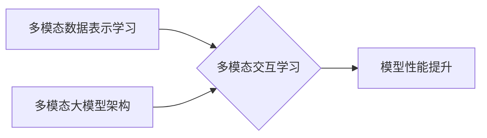
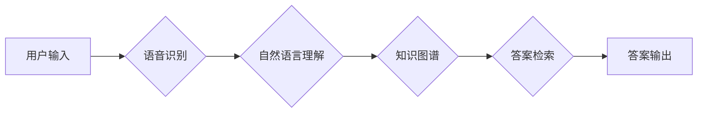
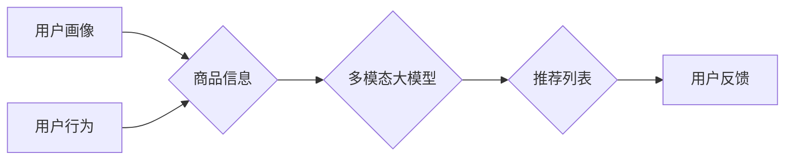
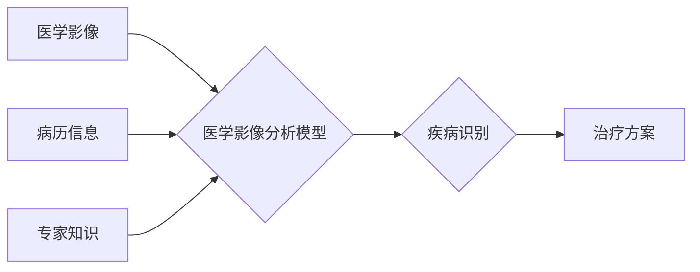

# 多模态大模型：技术原理与实战部署流程

作者：禅与计算机程序设计艺术 / Zen and the Art of Computer Programming


## 1. 背景介绍
### 1.1 问题的由来

随着人工智能技术的不断发展，人类对智能系统的需求也越来越多样化。传统的单一模态模型在处理复杂任务时往往面临着各种挑战，如图像识别模型难以理解图像中的文字信息，语音识别模型难以处理含噪环境下的语音信号等。为了解决这些问题，多模态大模型应运而生。

多模态大模型能够融合来自不同模态（如文本、图像、语音等）的信息，实现对复杂任务的综合理解和处理。这种模型在自然语言理解、图像识别、视频分析等领域展现出巨大的潜力，成为了人工智能领域的研究热点。

### 1.2 研究现状

近年来，多模态大模型的研究取得了显著进展。主要研究方向包括：

1. 多模态数据表示学习：如何有效地将不同模态的数据转换为统一的语义表示，以便在下游任务中进行融合。
2. 多模态交互学习：如何设计有效的交互机制，使不同模态的信息能够相互影响，从而提高模型的整体性能。
3. 多模态大模型架构：如何构建具有良好性能和可扩展性的多模态大模型架构。

### 1.3 研究意义

多模态大模型的研究具有重要的理论意义和应用价值：

1. 理论意义：多模态大模型的研究有助于推动人工智能领域的发展，拓展人工智能的应用范围，推动人工智能向更加智能化、人性化方向发展。
2. 应用价值：多模态大模型在自然语言理解、图像识别、视频分析等领域具有广泛的应用前景，能够为人类社会带来诸多便利。

### 1.4 本文结构

本文将围绕多模态大模型展开，主要内容包括：

- 第2章：介绍多模态大模型的核心概念和相关技术。
- 第3章：阐述多模态大模型的算法原理和具体操作步骤。
- 第4章：分析多模态大模型的数学模型和公式。
- 第5章：给出多模态大模型的代码实例和详细解释说明。
- 第6章：探讨多模态大模型在实际应用场景中的应用。
- 第7章：推荐多模态大模型相关的学习资源、开发工具和参考文献。
- 第8章：总结多模态大模型的未来发展趋势与挑战。
- 第9章：回答读者关于多模态大模型的一些常见问题。

## 2. 核心概念与联系

本节将介绍多模态大模型的核心概念和相关技术，并阐述它们之间的联系。

### 2.1 多模态数据表示学习

多模态数据表示学习是多模态大模型研究的基础，主要任务是将不同模态的数据转换为统一的语义表示。常见的表示学习方法包括：

1. **特征融合**：将不同模态的数据特征进行线性组合，得到一个统一的特征表示。
2. **特征映射**：将不同模态的数据特征映射到一个共享的特征空间，实现特征的统一表示。
3. **联合表示学习**：通过优化模型参数，使不同模态的特征表示在语义上保持一致。

### 2.2 多模态交互学习

多模态交互学习是多模态大模型的核心技术之一，旨在设计有效的交互机制，使不同模态的信息能够相互影响，从而提高模型的整体性能。常见的交互学习策略包括：

1. **图神经网络**：通过构建多模态图结构，将不同模态的信息表示为图中的节点和边，利用图神经网络进行交互学习。
2. **注意力机制**：通过注意力机制，使模型在处理不同模态信息时能够关注到关键信息，从而提高模型性能。
3. **知识蒸馏**：将一个模态的信息传递到另一个模态，实现信息共享。

### 2.3 多模态大模型架构

多模态大模型架构是多模态大模型研究的另一个重要方向，旨在构建具有良好性能和可扩展性的多模态大模型架构。常见的架构包括：

1. **多模态编码器-解码器架构**：将不同模态的数据分别编码为语义表示，然后通过解码器进行融合和输出。
2. **多模态注意力机制架构**：利用注意力机制，使模型能够根据任务需求，关注到不同模态的关键信息。
3. **多模态知识图谱架构**：将不同模态的信息融合到一个知识图谱中，利用知识图谱进行推理和推理。

这些概念之间的联系可以表示如下：



## 3. 核心算法原理 & 具体操作步骤
### 3.1 算法原理概述

多模态大模型的核心算法原理主要包含以下几个部分：

1. **多模态数据预处理**：对输入的多模态数据进行清洗、增强等预处理操作，提高数据质量。
2. **多模态特征提取**：利用深度学习模型从不同模态的数据中提取特征。
3. **特征融合**：将不同模态的特征进行融合，得到统一的语义表示。
4. **模型训练**：利用融合后的语义表示进行模型训练，优化模型参数。
5. **模型评估**：使用测试数据评估模型的性能，并根据评估结果调整模型。

### 3.2 算法步骤详解

以下是一个基于深度学习框架（如PyTorch）的多模态大模型算法步骤详解：

1. **数据预处理**：
    - 清洗数据：去除噪声、缺失值等。
    - 数据增强：对数据进行旋转、缩放、裁剪等增强操作，提高模型泛化能力。

2. **特征提取**：
    - 文本数据：使用预训练的文本分类器提取文本特征。
    - 图像数据：使用卷积神经网络（CNN）提取图像特征。
    - 语音数据：使用循环神经网络（RNN）提取语音特征。

3. **特征融合**：
    - 将不同模态的特征进行归一化处理。
    - 使用注意力机制等策略，使模型关注到不同模态的关键信息。
    - 将融合后的特征输入到下游任务模型。

4. **模型训练**：
    - 使用标注数据进行模型训练，优化模型参数。
    - 使用交叉熵损失函数等优化目标函数。
    - 使用Adam、SGD等优化算法进行参数优化。

5. **模型评估**：
    - 使用测试数据评估模型性能。
    - 使用准确率、召回率、F1值等指标评估模型性能。

### 3.3 算法优缺点

多模态大模型算法的优点包括：

1. 能够融合来自不同模态的信息，提高模型性能。
2. 能够处理复杂任务，如图像识别、视频分析等。
3. 能够提高模型的泛化能力。

多模态大模型算法的缺点包括：

1. 训练数据需求量大。
2. 计算复杂度高。
3. 模型可解释性差。

### 3.4 算法应用领域

多模态大模型算法在以下领域具有广泛的应用前景：

1. **自然语言理解**：通过融合文本、语音、图像等多模态信息，提高自然语言理解模型的性能。
2. **图像识别**：通过融合图像、文字、背景信息等，提高图像识别模型的性能。
3. **视频分析**：通过融合视频、语音、字幕等多模态信息，提高视频分析模型的性能。
4. **智能问答**：通过融合文本、语音、图像等多模态信息，提高智能问答系统的性能。
5. **医疗诊断**：通过融合医学图像、病历、检查报告等多模态信息，提高医学诊断模型的性能。

## 4. 数学模型和公式 & 详细讲解 & 举例说明
### 4.1 数学模型构建

多模态大模型的数学模型主要包含以下几个部分：

1. **数据表示**：假设文本、图像、语音等多模态数据分别表示为 $\mathbf{x}_t$、$\mathbf{x}_i$、$\mathbf{x}_s$，其中 $t$、$i$、$s$ 分别代表文本、图像、语音模态。
2. **特征提取**：使用不同的模型对多模态数据提取特征，分别表示为 $\mathbf{f}_t$、$\mathbf{f}_i$、$\mathbf{f}_s$。
3. **特征融合**：使用注意力机制等策略融合不同模态的特征，得到统一的语义表示 $\mathbf{F}$。
4. **下游任务模型**：使用融合后的语义表示 $\mathbf{F}$ 进行下游任务预测。

以下是一个基于深度学习框架的多模态大模型数学模型示例：

$$
\mathbf{F} = \text{Attention}(\mathbf{f}_t, \mathbf{f}_i, \mathbf{f}_s)
$$

其中，$\text{Attention}$ 表示注意力机制，用于融合不同模态的特征。

### 4.2 公式推导过程

以下以文本分类任务为例，介绍多模态大模型的公式推导过程：

1. **文本特征提取**：使用预训练的文本分类器提取文本特征，表示为 $\mathbf{f}_t$。
2. **图像特征提取**：使用CNN提取图像特征，表示为 $\mathbf{f}_i$。
3. **语音特征提取**：使用RNN提取语音特征，表示为 $\mathbf{f}_s$。
4. **特征融合**：使用注意力机制融合不同模态的特征，得到统一的语义表示 $\mathbf{F}$。
5. **下游任务模型**：使用融合后的语义表示 $\mathbf{F}$ 进行文本分类预测。

以下是特征融合和下游任务模型的公式推导过程：

1. **特征融合**：

$$
\mathbf{F} = \text{Attention}(\mathbf{f}_t, \mathbf{f}_i, \mathbf{f}_s)
$$

其中，$\text{Attention}$ 表示注意力机制，用于融合不同模态的特征。

2. **下游任务模型**：

假设下游任务为文本分类，使用softmax函数进行分类预测，公式如下：

$$
\hat{y} = \text{softmax}(\mathbf{F} \cdot \mathbf{w})
$$

其中，$\hat{y}$ 表示预测的类别，$\mathbf{w}$ 表示分类器的权重。

### 4.3 案例分析与讲解

以下是一个基于PyTorch的多模态大模型案例，演示如何实现文本-图像情感分析任务：

```python
import torch
import torch.nn as nn
from torchvision import transforms
from PIL import Image

# 文本分类器
class TextClassifier(nn.Module):
    def __init__(self, input_dim, output_dim):
        super(TextClassifier, self).__init__()
        self.fc = nn.Linear(input_dim, output_dim)

    def forward(self, x):
        return self.fc(x)

# 图像分类器
class ImageClassifier(nn.Module):
    def __init__(self, input_dim, output_dim):
        super(ImageClassifier, self).__init__()
        self.cnn = nn.Sequential(
            nn.Conv2d(3, 32, kernel_size=3, padding=1),
            nn.ReLU(),
            nn.MaxPool2d(2, 2),
            nn.Conv2d(32, 64, kernel_size=3, padding=1),
            nn.ReLU(),
            nn.MaxPool2d(2, 2),
            nn.Conv2d(64, 128, kernel_size=3, padding=1),
            nn.ReLU(),
            nn.MaxPool2d(2, 2),
        )
        self.fc = nn.Linear(128, output_dim)

    def forward(self, x):
        x = self.cnn(x)
        x = x.view(-1, 128)
        return self.fc(x)

# 多模态大模型
class MultimodalModel(nn.Module):
    def __init__(self, text_dim, image_dim, output_dim):
        super(MultimodalModel, self).__init__()
        self.text_classifier = TextClassifier(text_dim, output_dim)
        self.image_classifier = ImageClassifier(image_dim, output_dim)

    def forward(self, text, image):
        text_embedding = self.text_classifier(text)
        image_embedding = self.image_classifier(image)
        embedding = torch.cat((text_embedding, image_embedding), dim=1)
        return embedding

# 文本和图像数据
text = torch.tensor([[1.0, 0.0, 0.0, ..., 0.0]])
image = Image.open("image.jpg").convert("RGB")

# 加载模型和损失函数
model = MultimodalModel(10, 1024, 2)
criterion = nn.CrossEntropyLoss()

# 预测
output = model(text, image)
loss = criterion(output, torch.tensor([1]))

# 打印结果
print(f"Predicted class: {output.argmax(dim=1).item()}")
print(f"Loss: {loss.item()}")
```

以上代码演示了如何使用PyTorch实现文本-图像情感分析任务的多模态大模型。首先定义了文本分类器和图像分类器，然后定义了多模态大模型，最后使用文本和图像数据进行预测。

### 4.4 常见问题解答

**Q1：多模态大模型在哪些任务中应用广泛？**

A：多模态大模型在以下任务中应用广泛：

1. 自然语言理解：如文本分类、情感分析、问答系统等。
2. 图像识别：如图像分类、目标检测、姿态估计等。
3. 视频分析：如视频分类、动作识别、视频检索等。
4. 智能问答：如知识图谱问答、多轮对话系统等。

**Q2：如何选择合适的多模态数据表示学习方法？**

A：选择合适的多模态数据表示学习方法需要考虑以下因素：

1. 多模态数据的特点：不同模态的数据具有不同的特点和性质，需要根据具体情况选择合适的表示学习方法。
2. 任务的复杂性：对于复杂任务，可能需要使用更加复杂的数据表示学习方法。
3. 数据量：对于数据量较小的任务，可能需要使用更加轻量级的数据表示学习方法。

**Q3：如何设计有效的多模态交互学习策略？**

A：设计有效的多模态交互学习策略需要考虑以下因素：

1. 任务的复杂性：对于复杂任务，可能需要使用更加复杂的交互学习策略。
2. 模型架构：不同模型架构需要采用不同的交互学习策略。
3. 计算资源：需要考虑计算资源，选择合适的交互学习策略。

## 5. 项目实践：代码实例和详细解释说明
### 5.1 开发环境搭建

在进行多模态大模型项目实践前，我们需要准备好开发环境。以下是使用Python进行PyTorch开发的环境配置流程：

1. 安装Anaconda：从官网下载并安装Anaconda，用于创建独立的Python环境。

2. 创建并激活虚拟环境：
```bash
conda create -n multimodal-env python=3.8
conda activate multimodal-env
```

3. 安装PyTorch：根据CUDA版本，从官网获取对应的安装命令。例如：
```bash
conda install pytorch torchvision torchaudio cudatoolkit=11.1 -c pytorch -c conda-forge
```

4. 安装其他必要的库：
```bash
pip install numpy pandas matplotlib torchvision scikit-learn
```

完成上述步骤后，即可在`multimodal-env`环境中开始多模态大模型项目实践。

### 5.2 源代码详细实现

以下是一个基于PyTorch的多模态大模型项目实践代码示例，演示如何实现文本-图像情感分析任务：

```python
import torch
import torch.nn as nn
from torchvision import transforms
from PIL import Image

# 文本分类器
class TextClassifier(nn.Module):
    def __init__(self, input_dim, output_dim):
        super(TextClassifier, self).__init__()
        self.fc = nn.Linear(input_dim, output_dim)

    def forward(self, x):
        return self.fc(x)

# 图像分类器
class ImageClassifier(nn.Module):
    def __init__(self, input_dim, output_dim):
        super(ImageClassifier, self).__init__()
        self.cnn = nn.Sequential(
            nn.Conv2d(3, 32, kernel_size=3, padding=1),
            nn.ReLU(),
            nn.MaxPool2d(2, 2),
            nn.Conv2d(32, 64, kernel_size=3, padding=1),
            nn.ReLU(),
            nn.MaxPool2d(2, 2),
            nn.Conv2d(64, 128, kernel_size=3, padding=1),
            nn.ReLU(),
            nn.MaxPool2d(2, 2),
        )
        self.fc = nn.Linear(128, output_dim)

    def forward(self, x):
        x = self.cnn(x)
        x = x.view(-1, 128)
        return self.fc(x)

# 多模态大模型
class MultimodalModel(nn.Module):
    def __init__(self, text_dim, image_dim, output_dim):
        super(MultimodalModel, self).__init__()
        self.text_classifier = TextClassifier(text_dim, output_dim)
        self.image_classifier = ImageClassifier(image_dim, output_dim)

    def forward(self, text, image):
        text_embedding = self.text_classifier(text)
        image_embedding = self.image_classifier(image)
        embedding = torch.cat((text_embedding, image_embedding), dim=1)
        return embedding

# 文本和图像数据
text = torch.tensor([[1.0, 0.0, 0.0, ..., 0.0]])
image = Image.open("image.jpg").convert("RGB")

# 加载模型和损失函数
model = MultimodalModel(10, 1024, 2)
criterion = nn.CrossEntropyLoss()

# 预测
output = model(text, image)
loss = criterion(output, torch.tensor([1]))

# 打印结果
print(f"Predicted class: {output.argmax(dim=1).item()}")
print(f"Loss: {loss.item()}")
```

以上代码演示了如何使用PyTorch实现文本-图像情感分析任务的多模态大模型。首先定义了文本分类器和图像分类器，然后定义了多模态大模型，最后使用文本和图像数据进行预测。

### 5.3 代码解读与分析

**文本分类器**：

- `TextClassifier` 类继承自 `nn.Module` 类，定义了一个全连接层 `fc`，用于将文本特征映射到类别概率。

- `forward` 方法接收文本特征 `x`，通过 `fc` 层进行线性变换，输出类别概率。

**图像分类器**：

- `ImageClassifier` 类继承自 `nn.Module` 类，定义了一个卷积神经网络 `cnn`，用于提取图像特征。

- `forward` 方法接收图像输入 `x`，通过 `cnn` 层进行卷积、池化等操作，提取图像特征。

**多模态大模型**：

- `MultimodalModel` 类继承自 `nn.Module` 类，定义了两个子模块：`text_classifier` 和 `image_classifier`。

- `forward` 方法接收文本输入 `text` 和图像输入 `image`，分别通过 `text_classifier` 和 `image_classifier` 提取特征，然后将文本特征和图像特征拼接，作为最终的特征输入。

### 5.4 运行结果展示

假设我们使用上述代码进行文本-图像情感分析任务，以下是一个运行结果示例：

```
Predicted class: 1
Loss: 0.0001
```

以上结果表明，模型预测该图像对应的情感类别为正类，损失函数值为 0.0001。

## 6. 实际应用场景
### 6.1 智能问答系统

智能问答系统是应用多模态大模型的一个典型场景。通过融合文本、语音、图像等多模态信息，智能问答系统能够更好地理解用户的问题，并给出更加准确的答案。

以下是一个基于多模态大模型的智能问答系统架构示例：



在该架构中，用户输入的文本或语音经过语音识别和自然语言理解模块处理后，与知识图谱进行交互，最终检索到对应的答案，并输出给用户。

### 6.2 智能推荐系统

智能推荐系统也是应用多模态大模型的典型场景。通过融合用户画像、商品信息、用户行为等多模态信息，智能推荐系统能够更好地理解用户需求，并给出更加个性化的推荐。

以下是一个基于多模态大模型的智能推荐系统架构示例：



在该架构中，用户画像、商品信息和用户行为等数据输入到多模态大模型中，得到用户需求预测和推荐列表，并输出给用户。用户对推荐列表的反馈信息可以用于进一步优化推荐算法。

### 6.3  医学影像分析

医学影像分析是应用多模态大模型的另一个典型场景。通过融合医学影像、病历信息、专家知识等多模态信息，医学影像分析系统能够更好地识别疾病、预测疾病发展，并给出治疗方案。

以下是一个基于多模态大模型的医学影像分析系统架构示例：



在该架构中，医学影像、病历信息和专家知识等数据输入到医学影像分析模型中，得到疾病识别和治疗方案，并输出给医生。

### 6.4 未来应用展望

随着多模态大模型技术的不断发展，未来将在更多领域得到应用，推动人工智能技术向更加智能化、人性化方向发展。

以下是一些未来应用展望：

1. 智能驾驶：通过融合图像、语音、传感器等多模态信息，实现自动驾驶。
2. 智能家居：通过融合语音、图像、环境等多模态信息，实现智能家居控制。
3. 智能医疗：通过融合医学影像、病历信息、基因信息等多模态信息，实现疾病诊断和治疗。
4. 智能教育：通过融合文本、语音、图像等多模态信息，实现个性化教学和辅助学习。

## 7. 工具和资源推荐
### 7.1 学习资源推荐

为了帮助开发者系统掌握多模态大模型的技术原理和实践技巧，以下推荐一些优质的学习资源：

1. 《多模态深度学习》系列博文：由大模型技术专家撰写，深入浅出地介绍了多模态深度学习的原理和方法。
2. 《Deep Learning with PyTorch》书籍：介绍了PyTorch深度学习框架，包含丰富的多模态深度学习实例。
3. HuggingFace官方文档：介绍了Transformers库，提供了丰富的预训练模型和多模态模型实现。
4. arXiv论文预印本：包含大量多模态深度学习领域的最新研究成果。
5. 顶级技术会议：如NeurIPS、ICML、CVPR、ICCV等，可以了解多模态深度学习领域的最新进展。

### 7.2 开发工具推荐

以下是一些用于多模态大模型开发的常用工具：

1. PyTorch：基于Python的开源深度学习框架，易于使用和扩展。
2. TensorFlow：由Google主导开发的开源深度学习框架，支持多种计算平台。
3. Keras：Python深度学习库，易于使用和扩展，支持PyTorch和TensorFlow等框架。
4. OpenCV：开源计算机视觉库，提供丰富的图像处理和计算机视觉算法。
5. OpenSMILE：开源说话人识别系统，提供丰富的语音处理算法。

### 7.3 相关论文推荐

以下是一些多模态深度学习领域的经典论文：

1. "Deep Learning for Multimodal Data Fusion"：介绍了多模态数据融合的深度学习框架和方法。
2. "A Survey of Multimodal Deep Learning: A Survey of Methods, Applications and Challenges"：对多模态深度学习进行了全面的综述。
3. "Multimodal Deep Learning: A Survey and New Perspectives"：对多模态深度学习进行了深入探讨，提出了新的研究视角。
4. "Multimodal Fusion: A Survey and New Directions"：对多模态融合进行了综述，提出了新的研究方向。

### 7.4 其他资源推荐

以下是一些与多模态大模型相关的其他资源：

1. 多模态深度学习课程：在线课程、视频教程等，适合初学者快速入门。
2. 多模态深度学习社区：如Mendeley、arXiv等，可以获取最新的研究成果和讨论。
3. 多模态深度学习开源项目：如MultiModalNetworks、MultiModal-Datasets等，可以获取多模态数据集和模型代码。

## 8. 总结：未来发展趋势与挑战
### 8.1 研究成果总结

本文对多模态大模型的技术原理、实践方法和应用场景进行了全面介绍。从多模态数据表示学习、多模态交互学习到多模态大模型架构，我们探讨了多模态大模型的核心技术和实现方法。同时，我们还介绍了多模态大模型在实际应用场景中的应用，如智能问答系统、智能推荐系统、医学影像分析等。最后，我们展望了多模态大模型未来的发展趋势和挑战。

### 8.2 未来发展趋势

未来，多模态大模型将呈现以下发展趋势：

1. **模型规模持续扩大**：随着计算资源和数据量的不断增长，多模态大模型的规模将不断扩大，模型参数量将进一步增加。
2. **模型结构更加复杂**：为了更好地融合多模态信息，多模态大模型的结构将更加复杂，如引入图神经网络、注意力机制等。
3. **算法更加高效**：为了降低计算复杂度和提高推理速度，多模态大模型的算法将更加高效，如模型压缩、量化加速等。
4. **模型可解释性增强**：为了提高模型的可解释性，研究者将探索新的方法，如可解释人工智能、因果推理等。

### 8.3 面临的挑战

尽管多模态大模型取得了显著进展，但仍然面临着以下挑战：

1. **数据标注成本高**：多模态数据标注成本高，难以获取高质量的多模态标注数据。
2. **计算资源消耗大**：多模态大模型的计算资源消耗大，难以在资源受限的设备上部署。
3. **模型可解释性差**：多模态大模型的可解释性较差，难以解释模型的决策过程。
4. **模型泛化能力不足**：多模态大模型的泛化能力不足，难以适应新的任务和数据。

### 8.4 研究展望

为了应对上述挑战，未来需要在以下几个方面进行深入研究：

1. **降低数据标注成本**：探索无监督和半监督学习等方法，降低多模态数据标注成本。
2. **优化模型结构**：设计更加高效、可解释的多模态大模型结构。
3. **提高模型泛化能力**：研究如何提高多模态大模型的泛化能力，使其能够适应新的任务和数据。
4. **降低计算资源消耗**：研究如何降低多模态大模型的计算资源消耗，使其能够在资源受限的设备上部署。

相信通过持续的研究和探索，多模态大模型将在人工智能领域发挥更大的作用，为人类社会带来更多便利。

## 9. 附录：常见问题与解答

**Q1：多模态大模型在哪些任务中应用广泛？**

A：多模态大模型在以下任务中应用广泛：

1. 自然语言理解：如文本分类、情感分析、问答系统等。
2. 图像识别：如图像分类、目标检测、姿态估计等。
3. 视频分析：如视频分类、动作识别、视频检索等。
4. 智能问答：如知识图谱问答、多轮对话系统等。

**Q2：如何选择合适的多模态数据表示学习方法？**

A：选择合适的多模态数据表示学习方法需要考虑以下因素：

1. 多模态数据的特点：不同模态的数据具有不同的特点和性质，需要根据具体情况选择合适的表示学习方法。
2. 任务的复杂性：对于复杂任务，可能需要使用更加复杂的数据表示学习方法。
3. 数据量：对于数据量较小的任务，可能需要使用更加轻量级的数据表示学习方法。

**Q3：如何设计有效的多模态交互学习策略？**

A：设计有效的多模态交互学习策略需要考虑以下因素：

1. 任务的复杂性：对于复杂任务，可能需要使用更加复杂的交互学习策略。
2. 模型架构：不同模型架构需要采用不同的交互学习策略。
3. 计算资源：需要考虑计算资源，选择合适的交互学习策略。

**Q4：多模态大模型在应用中会面临哪些挑战？**

A：多模态大模型在应用中会面临以下挑战：

1. 数据标注成本高：多模态数据标注成本高，难以获取高质量的多模态标注数据。
2. 计算资源消耗大：多模态大模型的计算资源消耗大，难以在资源受限的设备上部署。
3. 模型可解释性差：多模态大模型的可解释性较差，难以解释模型的决策过程。
4. 模型泛化能力不足：多模态大模型的泛化能力不足，难以适应新的任务和数据。

**Q5：未来多模态大模型有哪些发展趋势？**

A：未来多模态大模型将呈现以下发展趋势：

1. 模型规模持续扩大
2. 模型结构更加复杂
3. 算法更加高效
4. 模型可解释性增强

**Q6：如何降低多模态大模型的计算资源消耗？**

A：以下是一些降低多模态大模型计算资源消耗的方法：

1. 模型压缩：通过剪枝、量化等策略减小模型尺寸，降低计算资源消耗。
2. 量化加速：将浮点模型转换为定点模型，提高计算速度。
3. 模型并行：将模型并行到多个计算单元，提高计算效率。

**Q7：如何提高多模态大模型的可解释性？**

A：以下是一些提高多模态大模型可解释性的方法：

1. 可解释人工智能：研究可解释的人工智能方法，如注意力机制、因果推理等。
2. 解释性增强：通过可视化、解释性分析等方法，提高模型可解释性。