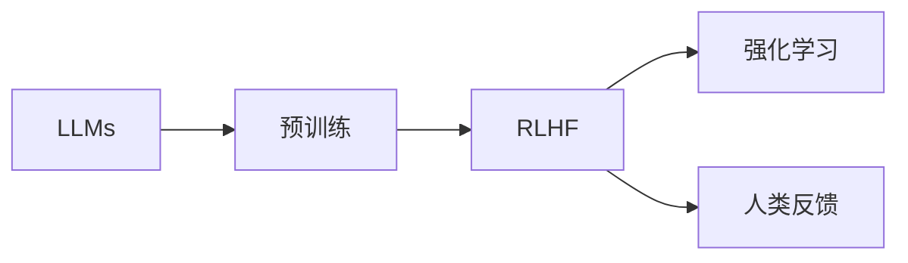

# 大语言模型原理与工程实践：RLHF 实战框架

作者：禅与计算机程序设计艺术 / Zen and the Art of Computer Programming

## 1. 背景介绍
### 1.1 问题的由来

近年来，随着深度学习技术的飞速发展，大语言模型（Large Language Models，LLMs）如雨后春笋般涌现。这些模型在自然语言处理（Natural Language Processing，NLP）领域取得了显著的成就，但同时也带来了新的挑战。其中，如何让大语言模型更好地理解人类意图和指令，以及如何引导其在复杂任务中展现出更加符合人类价值观的行为，成为了当前研究的热点。

### 1.2 研究现状

为了解决上述问题，研究者们提出了多种方法，其中最具代表性的当属“基于强化学习和人类反馈的预训练”（Reinforcement Learning from Human Feedback，RLHF）。RLHF 通过结合强化学习（Reinforcement Learning，RL）和人类反馈，使得大语言模型能够更好地学习人类意图和指令，并在复杂任务中展现出更加符合人类价值观的行为。

### 1.3 研究意义

RLHF 技术的研究意义主要体现在以下几个方面：

- 提升大语言模型在复杂任务中的性能，使其能够更好地理解人类意图和指令。
- 引导大语言模型展现出更加符合人类价值观的行为，避免潜在的风险和偏见。
- 推动大语言模型在各个领域的应用，为人类带来更多便利和福祉。

### 1.4 本文结构

本文将从以下几个方面对 RLHF 进行深入探讨：

- 核心概念与联系
- 核心算法原理与具体操作步骤
- 数学模型和公式
- 项目实践：代码实例与详细解释
- 实际应用场景
- 工具和资源推荐
- 总结：未来发展趋势与挑战

## 2. 核心概念与联系

本节将介绍 RLHF 相关的核心概念，并分析它们之间的联系。

### 2.1 大语言模型（LLMs）

LLMs 是一种基于深度学习技术的语言模型，通过在大量文本语料上进行预训练，学习到丰富的语言知识和模式，能够进行自然语言理解和生成。

### 2.2 强化学习（RL）

强化学习是一种通过与环境交互，学习如何采取最优策略以实现目标的方法。在 RLHF 中，LLMs 作为智能体，通过与人类交互学习如何满足人类需求。

### 2.3 人类反馈（HF）

人类反馈是指人类对 LLMs 的输出进行评价和反馈的过程。在 RLHF 中，人类反馈用于指导 LLMs 学习符合人类价值观的行为。

### 2.4 联系

LLMs 是 RLHF 的基础，通过预训练学习到丰富的语言知识。RLHF 则通过强化学习和人类反馈，使得 LLMs 能够更好地理解人类意图和指令，并在复杂任务中展现出更加符合人类价值观的行为。它们之间的关系可以用以下 Mermaid 流程图表示：



## 3. 核心算法原理与具体操作步骤
### 3.1 算法原理概述

RLHF 主要通过以下三个步骤实现：

1. **预训练**：使用大量无标签文本语料对 LLMs 进行预训练，使其学习到丰富的语言知识和模式。
2. **强化学习**：通过人类反馈和奖励信号，引导 LLMs 学习如何满足人类需求，实现目标。
3. **人类反馈**：收集人类对 LLMs 输出的评价和反馈，用于指导 LLMs 优化行为。

### 3.2 算法步骤详解

**步骤 1：预训练**

1. 收集大规模无标签文本语料，如维基百科、新闻报道等。
2. 选择合适的预训练模型，如 GPT-3、BERT 等。
3. 使用预训练模型对文本语料进行预训练，使其学习到丰富的语言知识和模式。

**步骤 2：强化学习**

1. 设计奖励信号，用于评估 LLMs 的输出是否符合人类需求。
2. 将 LLMs 作为智能体，与环境（人类）进行交互。
3. 根据人类反馈和奖励信号，更新 LLMs 的策略参数。

**步骤 3：人类反馈**

1. 收集人类对 LLMs 输出的评价和反馈。
2. 将人类反馈用于指导 LLMs 优化行为。

### 3.3 算法优缺点

**优点**：

- 可以有效地引导 LLMs 学习符合人类价值观的行为。
- 能够提高 LLMs 在复杂任务中的性能。

**缺点**：

- 需要大量的人类反馈数据。
- 强化学习过程可能存在收敛速度慢、不稳定等问题。

### 3.4 算法应用领域

RLHF 技术可以应用于以下领域：

- 对话系统：如聊天机器人、虚拟助手等。
- 自动问答：如问答系统、对话系统等。
- 文本生成：如自动写作、机器翻译等。
- 自动摘要：如文本摘要、新闻摘要等。

## 4. 数学模型和公式
### 4.1 数学模型构建

RLHF 的数学模型主要包括以下部分：

- **策略参数**：用于表示 LLMs 的策略，如 GPT-3 的权重参数。
- **奖励函数**：用于评估 LLMs 的输出是否符合人类需求，如基于人类反馈和奖励信号。
- **价值函数**：用于评估 LLMs 的策略在特定状态下的价值，如 Q-learning 中的 Q 值。

### 4.2 公式推导过程

以下以 Q-learning 为例，介绍 RLHF 的公式推导过程：

1. **状态转移方程**：
   $$
 Q(s,a) = Q(s,a) + \alpha [R + \gamma \max_{a'} Q(s',a') - Q(s,a)]
$$
   其中，$Q(s,a)$ 表示在状态 $s$ 下采取动作 $a$ 的期望回报，$R$ 表示奖励，$\gamma$ 为折扣因子，$\alpha$ 为学习率。

2. **目标函数**：
   $$
 J(\theta) = \sum_{s \in S} \sum_{a \in A(s)} Q(s,a) P(s,a)
$$
   其中，$S$ 表示所有可能的状态集合，$A(s)$ 表示在状态 $s$ 下可能采取的动作集合，$P(s,a)$ 表示在状态 $s$ 下采取动作 $a$ 的概率。

### 4.3 案例分析与讲解

以一个简单的对话系统为例，分析 RLHF 的应用过程。

1. **预训练**：使用大量对话数据对预训练模型进行预训练，使其学习到丰富的对话知识。
2. **强化学习**：设计奖励函数，如用户满意度、信息量等，并收集人类反馈。
3. **人类反馈**：根据人类反馈和奖励信号，更新预训练模型的权重参数。
4. **对话生成**：将预训练模型作为智能体，与环境（人类）进行交互，生成对话。

### 4.4 常见问题解答

**Q1：RLHF 的关键是什么**？

A：RLHF 的关键是结合强化学习和人类反馈，使得 LLMs 能够更好地理解人类意图和指令，并在复杂任务中展现出更加符合人类价值观的行为。

**Q2：如何设计合适的奖励函数**？

A：设计合适的奖励函数需要考虑具体的应用场景和任务目标。通常，奖励函数需要反映用户需求，如用户满意度、信息量、准确性等。

**Q3：如何处理人类反馈数据**？

A：处理人类反馈数据的方法包括：数据清洗、数据标注、数据增强等。

## 5. 项目实践：代码实例与详细解释
### 5.1 开发环境搭建

本节以 Python 和 TensorFlow 为例，介绍如何搭建 RLHF 的开发环境。

1. 安装 Python：
   ```
   sudo apt-get update
   sudo apt-get install python3.8
   ```
2. 安装 TensorFlow：
   ```
   pip install tensorflow
   ```
3. 安装其他依赖库：
   ```
   pip install transformers pandas numpy
   ```

### 5.2 源代码详细实现

以下是一个简单的 RLHF 代码示例：

```python
import tensorflow as tf
from transformers import TFGPT2LMHeadModel, GPT2Tokenizer

# 加载预训练模型和分词器
model = TFGPT2LMHeadModel.from_pretrained('gpt2')
tokenizer = GPT2Tokenizer.from_pretrained('gpt2')

# 定义奖励函数
def reward_function(prompt, response):
    # ...（根据具体任务设计奖励函数）
    pass

# 训练过程
for epoch in range(num_epochs):
    for i in range(num_steps):
        # 生成对话
        input_ids = tokenizer(prompt, return_tensors='tf')
        outputs = model.generate(**input_ids, num_return_sequences=1)
        response = tokenizer.decode(outputs[0], skip_special_tokens=True)

        # 计算奖励
        reward = reward_function(prompt, response)

        # 更新模型参数
        optimizer.minimize(lambda: loss_function(prompt, response), model)
```

### 5.3 代码解读与分析

以上代码展示了使用 TensorFlow 和 transformers 库进行 RLHF 的基本流程。首先，加载预训练模型和分词器。然后，定义奖励函数，用于评估对话的优劣。接下来，进行训练过程，包括生成对话、计算奖励、更新模型参数等步骤。

### 5.4 运行结果展示

通过训练，预训练模型将学习到更加符合人类价值观的对话生成策略。在实际应用中，可以根据具体任务需求，对代码进行修改和扩展。

## 6. 实际应用场景
### 6.1 对话系统

RLHF 技术可以应用于对话系统，如聊天机器人、虚拟助手等。通过训练，对话系统能够更好地理解用户意图，并生成更加自然、流畅的对话。

### 6.2 自动问答

RLHF 技术可以应用于自动问答系统，如问答机器人、知识库等。通过训练，自动问答系统能够更好地理解用户问题，并生成更加准确的答案。

### 6.3 文本生成

RLHF 技术可以应用于文本生成任务，如自动写作、机器翻译等。通过训练，文本生成系统能够更好地理解人类需求，并生成更加符合人类价值观的文本。

## 7. 工具和资源推荐
### 7.1 学习资源推荐

- **书籍**：
  - 《深度学习》（Ian Goodfellow、Yoshua Bengio、Aaron Courville 著）
  - 《强化学习：原理与练习》（Richard S. Sutton、Andrew G. Barto 著）
- **在线课程**：
  - Coursera 上的《深度学习》课程
  - Udacity 上的《强化学习》纳米学位课程

### 7.2 开发工具推荐

- **深度学习框架**：
  - TensorFlow
  - PyTorch
- **NLP 工具库**：
  - Transformers
  - NLTK

### 7.3 相关论文推荐

- **大语言模型**：
  - "Attention is All You Need"
  - "BERT: Pre-training of Deep Bidirectional Transformers for Language Understanding"
- **强化学习**：
  - "Reinforcement Learning: An Introduction"
  - "Algorithms for Reinforcement Learning"

### 7.4 其他资源推荐

- **GitHub 项目**：
  - Hugging Face Transformers
  - OpenAI GPT-3

## 8. 总结：未来发展趋势与挑战
### 8.1 研究成果总结

本文对 RLHF 技术进行了全面介绍，包括其背景、原理、应用场景等。通过学习本文，读者可以了解到 RLHF 技术的基本概念和操作步骤，并能够将其应用于实际的 NLP 任务中。

### 8.2 未来发展趋势

随着研究的不断深入，RLHF 技术将呈现以下发展趋势：

- **多模态融合**：将 RLHF 技术与其他模态（如图像、语音）进行融合，构建跨模态大语言模型。
- **个性化学习**：根据用户个性化需求，设计更加精细化的奖励函数和训练策略。
- **可解释性**：提高 RLHF 模型的可解释性，使其行为更加透明，便于理解和控制。

### 8.3 面临的挑战

尽管 RLHF 技术取得了显著的成果，但仍然面临着以下挑战：

- **数据质量和数量**：需要大量高质量的人类反馈数据，以指导 LLMs 学习符合人类价值观的行为。
- **模型可解释性**：提高 RLHF 模型的可解释性，使其行为更加透明，便于理解和控制。
- **伦理和道德**：避免 RLHF 模型在应用过程中产生偏见和歧视，确保其行为符合人类伦理和道德标准。

### 8.4 研究展望

未来，RLHF 技术将在以下方面取得进一步发展：

- **多模态融合**：将 RLHF 技术与其他模态进行融合，构建跨模态大语言模型。
- **个性化学习**：根据用户个性化需求，设计更加精细化的奖励函数和训练策略。
- **可解释性**：提高 RLHF 模型的可解释性，使其行为更加透明，便于理解和控制。
- **伦理和道德**：避免 RLHF 模型在应用过程中产生偏见和歧视，确保其行为符合人类伦理和道德标准。

## 9. 附录：常见问题与解答

**Q1：什么是 RLHF**？

A：RLHF 是“基于强化学习和人类反馈的预训练”的缩写，是一种结合强化学习和人类反馈，使得 LLMs 能够更好地理解人类意图和指令的技术。

**Q2：RLHF 的应用场景有哪些**？

A：RLHF 可以应用于对话系统、自动问答、文本生成、自动摘要等多个 NLP 任务。

**Q3：如何设计合适的奖励函数**？

A：设计合适的奖励函数需要考虑具体的应用场景和任务目标，如用户满意度、信息量、准确性等。

**Q4：如何处理人类反馈数据**？

A：处理人类反馈数据的方法包括数据清洗、数据标注、数据增强等。

**Q5：如何提高 RLHF 模型的可解释性**？

A：提高 RLHF 模型的可解释性可以通过以下方法实现：可视化模型结构、分析模型权重、解释模型决策过程等。

**Q6：如何避免 RLHF 模型在应用过程中产生偏见和歧视**？

A：避免 RLHF 模型在应用过程中产生偏见和歧视，可以通过以下方法实现：数据清洗、模型训练过程中引入公平性约束、使用对抗性训练等方法。

**Q7：RLHF 的未来发展趋势是什么**？

A：RLHF 的未来发展趋势包括多模态融合、个性化学习、可解释性、伦理和道德等方面。

---

作者：禅与计算机程序设计艺术 / Zen and the Art of Computer Programming