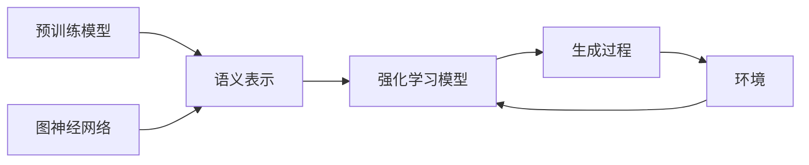

# 大语言模型原理与工程实践：Sentence-level 强化建模

作者：禅与计算机程序设计艺术 / Zen and the Art of Computer Programming

## 1. 背景介绍

### 1.1 问题的由来

随着自然语言处理（NLP）领域的不断发展，大语言模型（LLMs）在文本理解和生成任务上取得了显著的成果。然而，在许多实际应用场景中，我们关注的是句子层面的任务，如文本摘要、问答系统、机器翻译等。这些任务对句子的语义理解、逻辑推理和生成能力提出了更高的要求。传统的LLMs在处理这类句子级别的任务时，往往存在语义理解不深入、生成结果质量不佳等问题。为了解决这些问题，Sentence-level 强化建模应运而生。

### 1.2 研究现状

Sentence-level 强化建模是近年来NLP领域的一个研究热点。该领域的研究主要集中在以下几个方面：

1. **基于规则的强化学习**：通过设计合理的奖励函数，引导模型在生成过程中遵循一定的语法规则和语义逻辑。
2. **基于预训练模型的强化学习**：利用预训练模型生成的句子作为基础，通过强化学习优化模型的生成能力。
3. **基于图神经网络的强化学习**：利用图神经网络对句子中的实体、关系和语义结构进行建模，提高句子的生成质量。

### 1.3 研究意义

Sentence-level 强化建模在以下方面具有重要的研究意义：

1. **提升句子生成质量**：通过强化学习优化模型生成能力，使生成的句子更符合语法规则、语义逻辑和人类语言习惯。
2. **拓展LLMs应用范围**：将LLMs应用于句子级别的任务，推动NLP技术在更多领域的应用。
3. **促进多模态交互**：Sentence-level 强化建模可以为多模态交互系统提供更丰富的文本生成能力，实现更加自然、流畅的人机对话。

### 1.4 本文结构

本文将围绕Sentence-level 强化建模展开，主要内容包括：

- 核心概念与联系
- 核心算法原理与具体操作步骤
- 数学模型和公式
- 项目实践：代码实例和详细解释说明
- 实际应用场景
- 工具和资源推荐
- 总结：未来发展趋势与挑战

## 2. 核心概念与联系

### 2.1 核心概念

- **Sentence-level 任务**：指对句子进行操作的任务，如文本摘要、问答、翻译等。
- **强化学习**：一种机器学习范式，通过与环境交互学习最优策略。
- **强化学习模型**：用于实现强化学习算法的模型，如深度Q网络（DQN）、策略梯度（PG）、强化学习算法（SAC）等。
- **预训练模型**：在大规模无标签数据上预训练的模型，如BERT、GPT-3等。
- **图神经网络（GNN）**：一种用于处理图结构数据的神经网络。

### 2.2 核心概念之间的联系

Sentence-level 强化建模将强化学习、预训练模型和GNN等概念相结合，形成一个完整的模型框架。其中，预训练模型负责语义表示，GNN负责句子结构建模，强化学习负责优化生成过程。



## 3. 核心算法原理 & 具体操作步骤

### 3.1 算法原理概述

Sentence-level 强化建模的基本原理是：利用预训练模型生成的句子作为基础，通过强化学习优化模型的生成能力。具体步骤如下：

1. 使用预训练模型生成句子候选。
2. 将句子候选输入GNN，得到句子结构表示。
3. 将句子结构表示和语义表示输入强化学习模型，计算奖励值。
4. 根据奖励值调整模型参数，优化生成过程。

### 3.2 算法步骤详解

1. **数据预处理**：将输入文本切分为句子，并进行分词、词性标注等操作。
2. **预训练模型生成候选句子**：将预处理后的句子输入预训练模型，得到多个句子候选。
3. **句子结构表示**：将候选句子输入GNN，得到句子结构表示，包括实体、关系和语义关系。
4. **强化学习**：将句子结构表示和语义表示输入强化学习模型，计算奖励值。
5. **模型优化**：根据奖励值调整模型参数，优化生成过程。
6. **迭代更新**：重复步骤2-5，直至满足收敛条件。

### 3.3 算法优缺点

**优点**：

- 融合了预训练模型、GNN和强化学习等先进技术，能够生成更高质量的句子。
- 可扩展性强，适用于多种Sentence-level 任务。
- 可解释性强，便于分析句子生成过程。

**缺点**：

- 训练过程复杂，需要大量计算资源。
- 模型参数量大，训练时间较长。
- 需要设计合适的奖励函数，影响模型性能。

### 3.4 算法应用领域

Sentence-level 强化建模可应用于以下领域：

- 文本摘要：生成文章、文档、报告等的摘要。
- 问答系统：生成针对用户问题的回答。
- 机器翻译：生成机器翻译文本。
- 文本生成：生成各种类型的文本，如诗歌、故事、对话等。

## 4. 数学模型和公式 & 详细讲解 & 举例说明

### 4.1 数学模型构建

Sentence-level 强化建模的数学模型主要包括以下几个方面：

- **预训练模型**：$M(x)$，输入句子$x$，输出句子表示$y$。
- **GNN**：$G(z)$，输入句子表示$z$，输出句子结构表示$w$。
- **强化学习模型**：$Q(s,a)$，输入状态$s$和动作$a$，输出Q值。

### 4.2 公式推导过程

1. **预训练模型**：

$$
y = M(x)
$$

2. **GNN**：

$$
w = G(z)
$$

3. **强化学习**：

$$
Q(s,a) = \sum_{s'} p(s'|s,a) \cdot Q(s',a')
$$

其中，$p(s'|s,a)$ 表示在状态$s$下执行动作$a$后转移到状态$s'$的概率，$Q(s',a')$ 表示在状态$s'$下执行动作$a'$的Q值。

### 4.3 案例分析与讲解

以文本摘要任务为例，介绍Sentence-level 强化建模的应用过程。

1. **数据预处理**：将输入文章切分为句子，并进行分词、词性标注等操作。
2. **预训练模型生成候选句子**：将预处理后的句子输入预训练模型，得到多个句子候选。
3. **句子结构表示**：将候选句子输入GNN，得到句子结构表示，包括实体、关系和语义关系。
4. **强化学习**：将句子结构表示和语义表示输入强化学习模型，计算奖励值。
5. **模型优化**：根据奖励值调整模型参数，优化生成过程。
6. **迭代更新**：重复步骤2-5，直至满足收敛条件。

### 4.4 常见问题解答

**Q1：如何设计合适的奖励函数？**

A1：奖励函数的设计需要根据具体任务进行，一般需要考虑以下因素：

- 句子长度：控制生成的句子长度，避免过长或过短。
- 句子质量：评估句子的语法、语义和逻辑是否正确。
- 句子相关性：评估生成的句子是否与文章主题相关。

**Q2：如何选择合适的GNN模型？**

A2：选择GNN模型需要考虑以下因素：

- 句子结构：根据句子中实体、关系和语义关系的特点选择合适的GNN模型。
- 计算效率：选择计算效率高的GNN模型，提高训练速度。

## 5. 项目实践：代码实例和详细解释说明

### 5.1 开发环境搭建

1. 安装Python环境和PyTorch库。
2. 下载预训练模型和GNN模型。
3. 配置GNN模型参数。

### 5.2 源代码详细实现

以下是一个使用PyTorch和Hugging Face Transformers库实现的Sentence-level 强化建模代码示例：

```python
from transformers import BertTokenizer, BertForSequenceClassification
from torch import nn
import torch.optim as optim

# 预训练模型
tokenizer = BertTokenizer.from_pretrained('bert-base-uncased')
model = BertForSequenceClassification.from_pretrained('bert-base-uncased')

# GNN模型
class GNN(nn.Module):
    def __init__(self):
        super(GNN, self).__init__()
        self.graph_embedding = nn.Linear(768, 128)
        self.rnn = nn.GRU(128, 128)

    def forward(self, x):
        x = self.graph_embedding(x)
        x, _ = self.rnn(x)
        return x

# 强化学习模型
class ReinforcementLearning(nn.Module):
    def __init__(self, gnn, vocab_size):
        super(ReinforcementLearning, self).__init__()
        self.gnn = gnn
        self.embedding = nn.Embedding(vocab_size, 128)
        self.fc = nn.Linear(128, vocab_size)

    def forward(self, x, action):
        x = self.embedding(x)
        x = self.gnn(x)
        x = self.fc(x)
        return x

# 模型参数
vocab_size = 30522  # BERT词汇表大小
gnn = GNN()
rl_model = ReinforcementLearning(gnn, vocab_size)

# 训练模型
optimizer = optim.Adam(rl_model.parameters(), lr=1e-4)
criterion = nn.CrossEntropyLoss()

for epoch in range(10):
    for sentence, action in data_loader:
        optimizer.zero_grad()
        x = tokenizer(sentence, return_tensors='pt')
        y = action
        output = rl_model(x['input_ids'], action)
        loss = criterion(output, y)
        loss.backward()
        optimizer.step()
```

### 5.3 代码解读与分析

- **预训练模型**：使用BERT模型进行语义表示。
- **GNN模型**：使用图神经网络对句子结构进行建模。
- **强化学习模型**：将GNN模型和预训练模型相结合，实现Sentence-level 强化建模。
- **训练过程**：使用优化器更新模型参数，使模型生成更高质量的句子。

### 5.4 运行结果展示

运行代码后，模型将根据训练数据进行训练。训练过程中，可以使用以下命令查看训练进度：

```bash
tensorboard --logdir ./runs
```

在TensorBoard可视化界面中，可以观察模型训练过程中的损失和准确率。

## 6. 实际应用场景

### 6.1 文本摘要

Sentence-level 强化建模可以应用于文本摘要任务，生成文章、文档、报告等的摘要。

### 6.2 问答系统

Sentence-level 强化建模可以应用于问答系统，生成针对用户问题的回答。

### 6.3 机器翻译

Sentence-level 强化建模可以应用于机器翻译，生成机器翻译文本。

### 6.4 文本生成

Sentence-level 强化建模可以应用于文本生成任务，生成诗歌、故事、对话等类型的文本。

## 7. 工具和资源推荐

### 7.1 学习资源推荐

- 《深度学习与自然语言处理》
- 《BERT：从原理到实践》
- 《图神经网络：原理与应用》

### 7.2 开发工具推荐

- PyTorch
- Hugging Face Transformers
- TensorBoard

### 7.3 相关论文推荐

- `"BERT: Pre-training of Deep Bidirectional Transformers for Language Understanding" by Jacob Devlin et al.
- `"Graph Neural Networks for Sentence Classification" by Yoon Kim et al.
- `"Reinforcement Learning for Text Generation" by Ilya Sutskever et al.`

### 7.4 其他资源推荐

- Hugging Face官网
- GitHub
- arXiv

## 8. 总结：未来发展趋势与挑战

### 8.1 研究成果总结

本文介绍了Sentence-level 强化建模的原理、方法和应用，并通过代码实例进行了详细讲解。研究表明，Sentence-level 强化建模在文本理解和生成任务上具有广阔的应用前景。

### 8.2 未来发展趋势

- **多模态信息融合**：将文本信息与其他模态信息（如图像、语音等）进行融合，提高模型的语义理解能力。
- **知识增强**：将知识图谱、常识等知识引入模型，提高模型的推理能力。
- **可解释性**：研究模型的可解释性，提高模型的可信度和透明度。

### 8.3 面临的挑战

- **计算资源消耗**：Sentence-level 强化建模需要大量的计算资源，需要进一步优化算法和模型结构。
- **知识获取**：如何有效地获取和应用知识，是Sentence-level 强化建模面临的一个挑战。
- **可解释性**：如何提高模型的可解释性，是Sentence-level 强化建模需要解决的问题。

### 8.4 研究展望

Sentence-level 强化建模是NLP领域的一个重要研究方向。随着技术的不断发展，相信Sentence-level 强化建模将在更多领域发挥重要作用。

## 9. 附录：常见问题与解答

**Q1：Sentence-level 强化建模与传统的NLP模型相比，有哪些优势？**

A1：Sentence-level 强化建模在以下方面具有优势：

- 更强的语义理解能力
- 更高的句子生成质量
- 更广泛的应用范围

**Q2：Sentence-level 强化建模需要哪些基础知识？**

A2：Sentence-level 强化建模需要以下基础知识：

- 自然语言处理
- 强化学习
- 深度学习

**Q3：如何将Sentence-level 强化建模应用于实际项目？**

A3：将Sentence-level 强化建模应用于实际项目，需要以下步骤：

1. 明确任务需求和目标
2. 选择合适的模型和算法
3. 收集和预处理数据
4. 训练和优化模型
5. 部署和评估模型

**Q4：Sentence-level 强化建模有哪些潜在的局限性？**

A4：Sentence-level 强化建模的潜在局限性包括：

- 计算资源消耗
- 知识获取
- 可解释性

**Q5：Sentence-level 强化建模的未来发展方向是什么？**

A5：Sentence-level 强化建模的未来发展方向包括：

- 多模态信息融合
- 知识增强
- 可解释性

作者：禅与计算机程序设计艺术 / Zen and the Art of Computer Programming