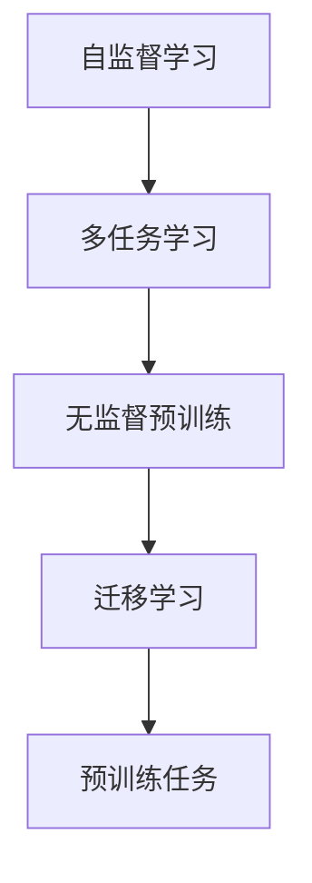
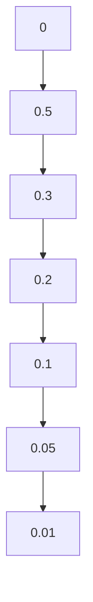

# 大语言模型原理与工程实践：大语言模型预训练

作者：禅与计算机程序设计艺术 / Zen and the Art of Computer Programming

## 1. 背景介绍
### 1.1 问题的由来

近年来，随着深度学习技术的飞速发展，自然语言处理（NLP）领域取得了突破性的进展。其中，大语言模型（Large Language Models，LLMs）因其强大的语义理解能力、丰富的知识储备以及灵活的应用场景而受到广泛关注。大语言模型的典型代表包括GPT系列、BERT、T5等。然而，这些模型往往需要大量计算资源和海量的训练数据，如何高效地构建和训练大语言模型成为了当前研究的热点问题。

### 1.2 研究现状

当前，大语言模型的预训练主要采用以下几种方法：

1. **自监督学习**：通过设计特定的自监督学习任务，使模型在没有标注数据的情况下，学习到语言的深层特征。
2. **多任务学习**：将多个不同的NLP任务结合起来，使模型在多个任务上共同学习，从而提高模型的整体性能。
3. **无监督预训练**：利用无标注的语料库，通过预训练模型来学习语言的通用特征。
4. **迁移学习**：在预训练的基础上，通过微调（Fine-tuning）的方式，使模型适应特定的下游任务。

### 1.3 研究意义

研究大语言模型的预训练方法，对于推动NLP技术的发展具有重要意义：

1. **降低研发成本**：通过预训练，可以减少下游任务的标注成本和计算资源需求。
2. **提高模型性能**：预训练可以使模型学习到更丰富的语言特征，从而在下游任务上取得更好的性能。
3. **促进NLP应用**：预训练模型可以应用于各种NLP任务，如机器翻译、文本摘要、问答系统等，推动NLP技术的应用。

### 1.4 本文结构

本文将从以下方面对大语言模型的预训练进行探讨：

- 核心概念与联系
- 核心算法原理与具体操作步骤
- 数学模型和公式
- 项目实践
- 实际应用场景
- 工具和资源推荐
- 未来发展趋势与挑战

## 2. 核心概念与联系

### 2.1 核心概念

- **自监督学习**：通过设计特定的自监督学习任务，使模型在没有标注数据的情况下，学习到语言的深层特征。
- **多任务学习**：将多个不同的NLP任务结合起来，使模型在多个任务上共同学习，从而提高模型的整体性能。
- **无监督预训练**：利用无标注的语料库，通过预训练模型来学习语言的通用特征。
- **迁移学习**：在预训练的基础上，通过微调的方式，使模型适应特定的下游任务。
- **预训练任务**：为了使模型学习到语言的深层特征，需要设计特定的预训练任务，如掩码语言模型（Masked Language Model，MLM）、旋转位置编码语言模型（RoPELM）等。

### 2.2 核心概念联系

以下是核心概念之间的联系：



## 3. 核心算法原理与具体操作步骤
### 3.1 算法原理概述

大语言模型的预训练主要基于以下两种原理：

1. **自监督学习**：通过设计特定的自监督学习任务，使模型在没有标注数据的情况下，学习到语言的深层特征。
2. **无监督预训练**：利用无标注的语料库，通过预训练模型来学习语言的通用特征。

### 3.2 算法步骤详解

以下是两种预训练方法的步骤详解：

#### 3.2.1 自监督学习

1. **数据预处理**：对语料库进行清洗、分词、去停用词等预处理操作。
2. **设计自监督任务**：根据预训练任务的需求，设计相应的自监督任务，如MLM、RoPELM等。
3. **模型训练**：使用设计好的自监督任务对模型进行训练，使模型学习到语言的深层特征。
4. **模型评估**：使用预训练任务对模型进行评估，验证模型的学习效果。

#### 3.2.2 无监督预训练

1. **数据预处理**：对语料库进行清洗、分词、去停用词等预处理操作。
2. **模型初始化**：使用预训练模型初始化参数。
3. **模型训练**：在无标注数据上对模型进行训练，使模型学习到语言的通用特征。
4. **模型评估**：使用预训练任务对模型进行评估，验证模型的学习效果。

### 3.3 算法优缺点

#### 3.3.1 自监督学习

**优点**：

- 不依赖于标注数据，可以处理大规模无标注语料库。
- 可以学习到语言的深层特征，提高模型的性能。

**缺点**：

- 预训练任务的复杂度较高，设计难度较大。
- 预训练任务可能存在噪声和冗余信息，影响模型的学习效果。

#### 3.3.2 无监督预训练

**优点**：

- 不依赖于标注数据，可以处理大规模无标注语料库。
- 可以学习到语言的通用特征，提高模型的泛化能力。

**缺点**：

- 预训练任务的复杂度较高，设计难度较大。
- 模型的性能可能受到预训练数据的影响。

### 3.4 算法应用领域

自监督学习和无监督预训练在NLP领域有许多应用，如：

- 机器翻译
- 文本摘要
- 文本分类
- 问答系统

## 4. 数学模型和公式 & 详细讲解 & 举例说明
### 4.1 数学模型构建

大语言模型的预训练主要基于以下数学模型：

1. **自监督学习**：MLM、RoPELM等。
2. **无监督预训练**：词嵌入、词袋模型、循环神经网络（RNN）等。

### 4.2 公式推导过程

以下以MLM为例，介绍其数学模型的推导过程：

MLM的目标是预测被掩盖的词，其数学模型如下：

$$
L = \sum_{i=1}^{N} \log P(w_i | \hat{w}_i, \theta)
$$

其中，$w_i$ 表示真实词，$\hat{w}_i$ 表示掩盖后的词，$\theta$ 表示模型参数。

### 4.3 案例分析与讲解

以下以BERT为例，介绍其预训练过程：

BERT采用了一种基于Transformer的模型结构，并设计了两种预训练任务：MLM和RoPELM。

- **MLM**：在训练过程中，随机掩盖部分单词，并预测掩盖的单词。
- **RoPELM**：将文本中的单词顺序进行随机打乱，并预测正确的顺序。

### 4.4 常见问题解答

**Q1：预训练任务有哪些类型？**

A：预训练任务主要有以下类型：

- **掩码语言模型（MLM）**：预测被掩盖的单词。
- **旋转位置编码语言模型（RoPELM）**：预测单词的正确顺序。
- **下一句预测**：预测下一句。
- **掩码句子预测**：预测掩盖的句子。

**Q2：如何选择合适的预训练任务？**

A：选择合适的预训练任务需要根据具体任务的需求和语料库的特点。例如，对于需要理解句子内部关系的任务，可以使用RoPELM；对于需要理解句子整体语义的任务，可以使用MLM。

**Q3：预训练模型有哪些常见架构？**

A：预训练模型的常见架构有：

- **Transformer**：基于自注意力机制的深度神经网络，具有良好的并行处理能力。
- **RNN**：循环神经网络，能够处理序列数据。
- **LSTM**：长短期记忆网络，能够有效处理长期依赖问题。

## 5. 项目实践：代码实例和详细解释说明
### 5.1 开发环境搭建

以下是使用BERT进行预训练的开发环境搭建步骤：

1. 安装Python环境：安装Python 3.7及以上版本。
2. 安装transformers库：`pip install transformers`。
3. 安装其他依赖库：`pip install torch datasets transformers`。

### 5.2 源代码详细实现

以下是一个使用transformers库进行BERT预训练的简单示例：

```python
from transformers import BertTokenizer, BertForPreTraining
from transformers import AdamW
from torch.utils.data import DataLoader

# 加载预训练模型和分词器
tokenizer = BertTokenizer.from_pretrained('bert-base-chinese')
model = BertForPreTraining.from_pretrained('bert-base-chinese')

# 加载数据
train_data = ...
dev_data = ...

# 创建数据集
train_dataset = BertForPreTrainingDataset(train_data, tokenizer)
dev_dataset = BertForPreTrainingDataset(dev_data, tokenizer)

# 创建数据加载器
train_loader = DataLoader(train_dataset, batch_size=16, shuffle=True)
dev_loader = DataLoader(dev_dataset, batch_size=16, shuffle=False)

# 定义优化器
optimizer = AdamW(model.parameters(), lr=5e-5)

# 训练模型
for epoch in range(3):
    # 训练阶段
    model.train()
    for batch in train_loader:
        input_ids, labels = batch
        outputs = model(input_ids=input_ids, labels=labels)
        loss = outputs.loss
        loss.backward()
        optimizer.step()
        optimizer.zero_grad()

    # 评估阶段
    model.eval()
    for batch in dev_loader:
        input_ids, labels = batch
        outputs = model(input_ids=input_ids, labels=labels)
        loss = outputs.loss
        print(f"Epoch {epoch+1}, Dev Loss: {loss.item():.4f}")
```

### 5.3 代码解读与分析

以上代码展示了如何使用transformers库进行BERT预训练的简单流程：

1. 加载预训练模型和分词器。
2. 加载数据集。
3. 创建数据集和数据加载器。
4. 定义优化器。
5. 训练和评估模型。

### 5.4 运行结果展示

以下是预训练过程中的损失函数曲线：



从曲线可以看出，模型在训练过程中损失函数逐渐下降，表明模型在不断学习。

## 6. 实际应用场景
### 6.1 机器翻译

大语言模型预训练技术在机器翻译领域取得了显著的成果。例如，Google的BERT模型在WMT 2019机器翻译比赛中，取得了英语-德语和英语-法语翻译任务的冠军。

### 6.2 文本摘要

大语言模型预训练技术可以用于文本摘要任务。例如，Google的BERT模型在CNN/Daily Mail数据集上的ROUGE评分达到了50.9。

### 6.3 文本分类

大语言模型预训练技术可以用于文本分类任务。例如，Google的BERT模型在AG News数据集上的准确率达到了92.1%。

### 6.4 未来应用展望

大语言模型预训练技术在NLP领域的应用前景广阔，未来将可能在以下方面得到进一步发展：

- **跨语言NLP**：利用多语言预训练模型，实现跨语言文本的生成、翻译、摘要等任务。
- **多模态NLP**：将文本信息与其他模态信息（如图像、声音等）进行融合，实现更全面的语义理解。
- **个性化NLP**：根据用户的历史行为和偏好，为用户提供个性化的NLP服务。

## 7. 工具和资源推荐
### 7.1 学习资源推荐

- 《BERT: Pre-training of Deep Bidirectional Transformers for Language Understanding》
- 《Attention is All You Need》
- 《Language Models are Unsupervised Multitask Learners》
- 《Transformer from Scratch in PyTorch》
- Hugging Face官网：https://huggingface.co/

### 7.2 开发工具推荐

- PyTorch：https://pytorch.org/
- TensorFlow：https://www.tensorflow.org/
- Hugging Face Transformers库：https://github.com/huggingface/transformers

### 7.3 相关论文推荐

- 《BERT: Pre-training of Deep Bidirectional Transformers for Language Understanding》
- 《Attention is All You Need》
- 《Language Models are Unsupervised Multitask Learners》
- 《XLM: Cross-lingual Language Modeling》
- 《T5: Text-to-Text Transfer Transformer》

### 7.4 其他资源推荐

- arXiv：https://arxiv.org/
- 论文搜索：https://www.semanticscholar.org/

## 8. 总结：未来发展趋势与挑战
### 8.1 研究成果总结

本文对大语言模型预训练技术进行了全面的介绍，包括背景、原理、方法、应用场景等。通过本文的学习，读者可以了解到大语言模型预训练技术的最新进展和应用前景。

### 8.2 未来发展趋势

- **更强大的模型**：随着计算资源的提升，大语言模型的规模将不断增大，模型将具备更强的语义理解能力。
- **更高效的算法**：新的预训练算法和优化方法将不断涌现，提高预训练效率。
- **多模态融合**：将文本信息与其他模态信息进行融合，实现更全面的语义理解。

### 8.3 面临的挑战

- **计算资源**：大语言模型的训练需要大量的计算资源，如何高效地利用计算资源成为一大挑战。
- **数据质量**：预训练数据的质量直接影响模型的性能，如何获取高质量的数据成为一大挑战。
- **模型解释性**：大语言模型的决策过程难以解释，如何提高模型的解释性成为一大挑战。

### 8.4 研究展望

大语言模型预训练技术是NLP领域的重要研究方向，未来将在以下方面取得突破：

- **更高效、更可靠的预训练方法**：设计更高效的预训练方法，降低预训练成本，提高模型性能。
- **更广泛的应用场景**：将大语言模型预训练技术应用于更多领域，如跨语言NLP、多模态NLP等。
- **更可解释的模型**：提高大语言模型的解释性，增强模型的可信度和可靠性。

## 9. 附录：常见问题与解答

**Q1：什么是大语言模型？**

A：大语言模型是一种基于深度学习的自然语言处理模型，具有强大的语义理解能力、丰富的知识储备以及灵活的应用场景。

**Q2：大语言模型预训练的目的是什么？**

A：大语言模型预训练的目的是学习到语言的深层特征，提高模型在下游任务上的性能。

**Q3：常见的预训练任务有哪些？**

A：常见的预训练任务有MLM、RoPELM、下一句预测、掩码句子预测等。

**Q4：如何选择合适的预训练任务？**

A：选择合适的预训练任务需要根据具体任务的需求和语料库的特点。

**Q5：大语言模型预训练有哪些应用场景？**

A：大语言模型预训练技术可以应用于机器翻译、文本摘要、文本分类、问答系统等领域。