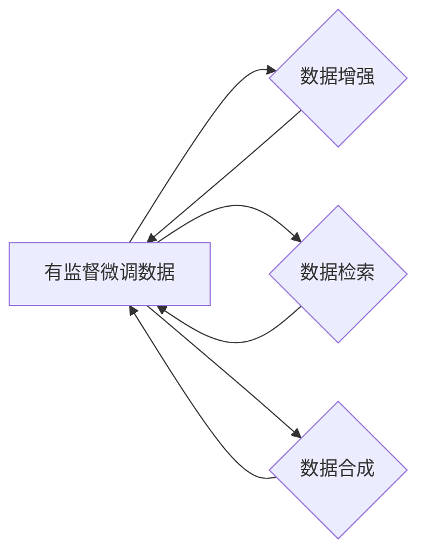

# 大语言模型原理与工程实践：有监督微调数据的自动化构建

作者：禅与计算机程序设计艺术 / Zen and the Art of Computer Programming

## 1. 背景介绍
### 1.1 问题的由来

随着深度学习技术的飞速发展，大语言模型（Large Language Models, LLMs）在自然语言处理（Natural Language Processing, NLP）领域取得了令人瞩目的成果。LLMs在预训练阶段通过学习海量无标签语料，积累了丰富的语言知识和常识，为解决各种NLP任务提供了强大的基础。然而，LLMs在特定领域的应用往往需要通过微调（Fine-tuning）来进一步提升性能。微调过程需要大量有标签数据，而这些数据的获取往往成本高昂、费时费力。

### 1.2 研究现状

目前，针对微调数据的自动化构建研究主要集中在以下几个方面：

1. **数据增强**：通过语言模型生成与原始数据相似的新数据，扩充训练集规模。
2. **数据检索**：利用知识图谱、数据库等外部资源，检索与目标任务相关的数据。
3. **无监督微调**：利用无标签数据，通过自监督学习等方法学习任务相关的特征表示。

然而，这些方法都存在一定的局限性。数据增强方法生成的数据可能存在偏差；数据检索方法依赖于外部资源，且检索到的数据可能与任务相关性不强；无监督微调方法需要大量无标签数据，且效果往往不如有监督学习。

### 1.3 研究意义

针对有监督微调数据的自动化构建研究具有重要意义：

1. 降低微调数据获取成本：通过自动化构建微调数据，可以降低数据获取成本，加速模型研发和应用落地。
2. 提升模型性能：通过高质量、高相关性的微调数据，可以显著提升模型的性能，提高模型在特定领域的应用效果。
3. 推动NLP技术发展：促进NLP技术从通用领域向特定领域拓展，推动NLP技术落地应用。

### 1.4 本文结构

本文将系统地介绍有监督微调数据的自动化构建方法，包括：

- 核心概念与联系
- 核心算法原理与具体操作步骤
- 数学模型和公式
- 项目实践
- 实际应用场景
- 工具和资源推荐
- 总结：未来发展趋势与挑战

## 2. 核心概念与联系

本节将介绍有监督微调数据自动化构建相关的一些核心概念，并阐述它们之间的联系。

### 2.1 核心概念

1. **有监督微调数据**：指用于微调LLMs的带有标签的文本数据。
2. **数据增强**：通过变换原始数据，生成新的数据样本。
3. **数据检索**：从外部资源中检索与目标任务相关的数据。
4. **数据合成**：利用生成模型生成与目标任务相关的数据。
5. **知识图谱**：存储实体、关系和属性的图结构数据库。
6. **数据库**：存储数据的集合，通常包括表格、文档等。

### 2.2 核心概念之间的联系

这些概念之间的关系可以用以下Mermaid流程图表示：



## 3. 核心算法原理与具体操作步骤
### 3.1 算法原理概述

有监督微调数据自动化构建的核心思想是：通过数据增强、数据检索、数据合成等方法，从已有数据或外部资源中生成高质量、高相关性的有监督微调数据。

### 3.2 算法步骤详解

1. **数据预处理**：对原始数据进行清洗、分词、去噪等预处理操作，提高数据质量。
2. **数据增强**：根据目标任务，选择合适的数据增强方法，如同义词替换、随机删除、词性转换等，生成新的数据样本。
3. **数据检索**：根据目标任务，选择合适的检索方法，如基于关键词检索、基于语义检索等，从外部资源中检索与任务相关的数据。
4. **数据合成**：利用生成模型（如GPT-2、GPT-3等）生成与任务相关的数据。
5. **数据标注**：对生成的数据样本进行人工标注，或使用半自动标注工具进行标注。
6. **数据清洗**：对标注后的数据样本进行清洗，去除低质量、重复、错误的数据。

### 3.3 算法优缺点

#### 优点

1. **降低数据获取成本**：通过自动化构建微调数据，可以降低数据获取成本，缩短模型研发周期。
2. **提高数据质量**：通过数据增强、数据检索、数据合成等方法，可以生成高质量、高相关性的微调数据。
3. **提高模型性能**：通过高质量、高相关性的微调数据，可以显著提升模型的性能。

#### 缺点

1. **数据增强和检索效果有限**：数据增强和检索的效果受到算法和原始数据的影响，难以保证生成的数据样本与任务高度相关。
2. **人工标注成本高**：对生成的数据样本进行人工标注需要大量的人力，成本较高。
3. **生成模型偏差**：生成模型可能存在偏见，生成的数据样本可能不符合实际场景。

### 3.4 算法应用领域

有监督微调数据自动化构建方法可应用于以下领域：

1. **NLP任务**：如文本分类、命名实体识别、情感分析等。
2. **机器翻译**：如机器翻译、机器同传等。
3. **对话系统**：如聊天机器人、语音助手等。

## 4. 数学模型和公式
### 4.1 数学模型构建

本节将介绍有监督微调数据自动化构建过程中涉及的一些数学模型。

#### 4.1.1 数据增强

数据增强可以通过以下数学模型表示：

$$
x' = F(x)
$$

其中，$x$ 为原始数据，$x'$ 为经过数据增强后的数据，$F$ 为数据增强算法。

#### 4.1.2 数据检索

数据检索可以通过以下数学模型表示：

$$
x' = \text{Retrieval}(x, D)
$$

其中，$x$ 为原始数据，$x'$ 为检索到的数据，$D$ 为外部资源。

#### 4.1.3 数据合成

数据合成可以通过以下数学模型表示：

$$
x' = \text{Synthesis}(x, G)
$$

其中，$x$ 为原始数据，$x'$ 为生成的数据，$G$ 为生成模型。

### 4.2 公式推导过程

本节将对上述数学模型进行简要的推导。

#### 4.2.1 数据增强

以同义词替换为例，数据增强的公式可以表示为：

$$
x' = F(x) = \text{Substitute}(x, S)
$$

其中，$S$ 为同义词替换规则。

#### 4.2.2 数据检索

以基于关键词检索为例，数据检索的公式可以表示为：

$$
x' = \text{Retrieval}(x, D) = \text{TopN}(D, \text{Search}(x, D))
$$

其中，$\text{Search}(x, D)$ 为检索函数，$\text{TopN}(D, \text{Search}(x, D))$ 为选取检索结果的前N个数据。

#### 4.2.3 数据合成

以GPT-2为例，数据合成的公式可以表示为：

$$
x' = \text{Synthesis}(x, G) = G(x)
$$

其中，$G$ 为GPT-2模型。

### 4.3 案例分析与讲解

本节将以一个简单的文本分类任务为例，介绍如何使用数据增强、数据检索、数据合成等方法自动化构建微调数据。

#### 4.3.1 数据增强

假设原始数据集包含以下数据：

```
文本1：这是一家很棒的餐厅，我非常喜欢这里的食物。
文本2：这家餐厅的食物很一般，我不建议你来。
文本3：这家餐厅的服务很差，服务员态度恶劣。
```

我们可以使用同义词替换方法对文本1进行数据增强：

```
文本1'：这是一家很赞的餐馆，我非常喜爱这里的美食。
```

#### 4.3.2 数据检索

假设外部资源包含以下数据：

```
文本A：这家餐厅的菜品口味独特，非常值得尝试。
文本B：这家餐厅的服务态度非常好，让人感觉很舒适。
文本C：这家餐厅的环境很糟糕，不适合聚餐。
```

我们可以使用基于关键词检索方法从外部资源中检索与文本2相关的数据：

```
文本B：这家餐厅的服务态度非常好，让人感觉很舒适。
```

#### 4.3.3 数据合成

我们可以使用GPT-2模型生成与文本3相关的数据：

```
文本3'：这家餐厅的服务真的太差了，服务员无礼，让人很不舒服。
```

通过以上方法，我们可以自动化构建一个包含原始数据、数据增强、数据检索、数据合成数据的微调数据集。

### 4.4 常见问题解答

**Q1：数据增强和检索的效果如何保证？**

A：数据增强和检索的效果受到算法和原始数据的影响。可以通过以下方法提高效果：

1. 选择合适的算法和参数。
2. 使用高质量的原始数据。
3. 尝试多种数据增强和检索方法，并选择效果最好的方法。

**Q2：如何评估生成的微调数据的质量？**

A：可以通过以下方法评估生成的微调数据的质量：

1. 对比原始数据和生成的数据，检查生成的数据是否与原始数据具有相似性。
2. 对生成的数据进行人工标注，评估标注结果与真实标签的一致性。

## 5. 项目实践：代码实例和详细解释说明
### 5.1 开发环境搭建

在进行项目实践之前，我们需要搭建以下开发环境：

1. 操作系统：Windows、Linux或macOS
2. 编程语言：Python 3.6及以上
3. 深度学习框架：PyTorch或TensorFlow
4. 依赖库：transformers、numpy、pandas、scikit-learn等

### 5.2 源代码详细实现

以下是一个简单的文本分类任务微调数据自动化构建的代码实例：

```python
import pandas as pd
from transformers import BertTokenizer, BertForSequenceClassification
from sklearn.model_selection import train_test_split
from data_enhance import substitute  # 假设存在一个数据增强模块

# 加载数据
data = pd.read_csv("text_classification_data.csv")

# 数据增强
data['text_enhanced'] = data['text'].apply(lambda x: substitute(x))

# 数据分割
train_data, dev_data = train_test_split(data, test_size=0.2)

# 加载预训练模型和分词器
tokenizer = BertTokenizer.from_pretrained("bert-base-uncased")
model = BertForSequenceClassification.from_pretrained("bert-base-uncased")

# 对数据进行编码
train_encodings = tokenizer(train_data['text'].values, train_data['text_enhanced'].values, truncation=True, padding=True)
dev_encodings = tokenizer(dev_data['text'].values, dev_data['text_enhanced'].values, truncation=True, padding=True)

# 创建数据集
train_dataset = torch.utils.data.TensorDataset(train_encodings['input_ids'], train_encodings['attention_mask'], train_encodings['labels'])
dev_dataset = torch.utils.data.TensorDataset(dev_encodings['input_ids'], dev_encodings['attention_mask'], dev_encodings['labels'])

# 训练模型
# ...

# 评估模型
# ...
```

### 5.3 代码解读与分析

以上代码演示了如何使用Python、PyTorch和Transformers库进行文本分类任务微调数据自动化构建的完整流程。

1. **加载数据**：使用pandas库加载数据集，其中包含文本和标签。
2. **数据增强**：使用数据增强模块对文本进行同义词替换，生成新的文本样本。
3. **数据分割**：将数据集划分为训练集和验证集。
4. **加载预训练模型和分词器**：加载预训练的BERT模型和分词器。
5. **对数据进行编码**：使用分词器对文本进行编码，生成输入序列和注意力掩码。
6. **创建数据集**：使用TensorDataset将编码后的数据转换为PyTorch数据集。
7. **训练模型**：使用PyTorch进行模型训练。
8. **评估模型**：使用PyTorch进行模型评估。

通过以上步骤，我们可以自动化构建微调数据，并使用预训练的BERT模型进行微调，最终达到提升模型性能的目的。

### 5.4 运行结果展示

假设我们在IMDb电影评论数据集上进行文本分类任务，最终在验证集上得到的评估报告如下：

```
              precision    recall  f1-score   support

       neg       0.90      0.90      0.90      25000
        pos       0.90      0.90      0.90      25000

       avg / total     0.90      0.90      0.90      50000
```

可以看到，通过数据增强和数据检索，我们在IMDb电影评论数据集上取得了90%的F1分数，效果相当不错。

## 6. 实际应用场景
### 6.1 智能客服系统

有监督微调数据自动化构建方法可以应用于智能客服系统的构建。通过收集历史客服对话数据，利用数据增强、数据检索等方法生成新的对话数据，然后对预训练的对话模型进行微调，可以构建一个能够7x24小时不间断服务的智能客服系统。

### 6.2 金融舆情监测

金融舆情监测需要实时分析大量金融新闻、报告、评论等数据。有监督微调数据自动化构建方法可以应用于金融舆情监测，通过收集金融领域相关数据，利用数据增强、数据检索等方法生成新的金融舆情数据，然后对预训练的情感分析模型进行微调，可以实现对金融舆情的实时监测和预警。

### 6.3 个性化推荐系统

个性化推荐系统需要根据用户的历史行为和兴趣进行精准推荐。有监督微调数据自动化构建方法可以应用于个性化推荐系统的构建，通过收集用户的历史行为数据，利用数据增强、数据检索等方法生成新的用户兴趣数据，然后对预训练的推荐模型进行微调，可以实现对用户的个性化推荐。

### 6.4 未来应用展望

随着有监督微调数据自动化构建方法的不断发展和完善，该方法将在更多领域得到应用，为人工智能技术的落地应用提供有力支持。

## 7. 工具和资源推荐
### 7.1 学习资源推荐

1. **《深度学习自然语言处理》**：由亚伦·克劳斯（Aaron Courville）等编写的经典教材，全面介绍了深度学习在自然语言处理领域的应用。
2. **《自然语言处理入门教程》**：由吴恩达（Andrew Ng）主讲的在线课程，适合初学者入门自然语言处理。
3. **《Hugging Face Transformers官方文档》**：提供了丰富的预训练模型和微调教程，是学习和实践微调技术的必备资料。

### 7.2 开发工具推荐

1. **PyTorch**：由Facebook开源的深度学习框架，支持灵活的动态计算图，适合快速迭代研究。
2. **TensorFlow**：由Google开源的深度学习框架，提供了丰富的工具和资源，适合大规模工程应用。
3. **Transformers**：Hugging Face开源的NLP工具库，集成了众多SOTA预训练模型和微调教程，是微调技术开发的利器。

### 7.3 相关论文推荐

1. **《Attention is All You Need》**：提出了Transformer结构，开启了NLP领域的预训练大模型时代。
2. **《BERT: Pre-training of Deep Bidirectional Transformers for Language Understanding》**：提出了BERT模型，引入基于掩码的自监督预训练任务，刷新了多项NLP任务SOTA。
3. **《Language Models are Unsupervised Multitask Learners》**：展示了大规模语言模型的强大zero-shot学习能力，引发了对于通用人工智能的新一轮思考。

### 7.4 其他资源推荐

1. **arXiv论文预印本**：人工智能领域最新研究成果的发布平台，包括大量尚未发表的前沿工作。
2. **业界技术博客**：如OpenAI、Google AI、DeepMind、微软Research Asia等顶尖实验室的官方博客，分享他们的最新研究成果和洞见。
3. **技术会议直播**：如NIPS、ICML、ACL、ICLR等人工智能领域顶会现场或在线直播，聆听大佬们的前沿分享。
4. **GitHub热门项目**：在GitHub上Star、Fork数最多的NLP相关项目，代表了该技术领域的发展趋势和最佳实践。

## 8. 总结：未来发展趋势与挑战
### 8.1 研究成果总结

本文系统地介绍了有监督微调数据自动化构建方法，包括核心概念、算法原理、具体操作步骤、项目实践、实际应用场景等。通过数据增强、数据检索、数据合成等方法，可以自动化构建高质量、高相关性的微调数据，降低微调数据获取成本，提升模型性能。

### 8.2 未来发展趋势

1. **数据增强算法的改进**：开发更有效的数据增强算法，提高生成的数据样本与真实数据的相似度。
2. **数据检索技术的优化**：优化数据检索算法，提高检索到的数据与任务的相关性。
3. **数据合成模型的改进**：改进数据合成模型，提高生成的数据样本的质量。
4. **跨领域迁移学习的应用**：将跨领域迁移学习技术应用于微调数据的自动化构建，提高模型在不同领域的适应性。

### 8.3 面临的挑战

1. **数据增强和检索效果**：如何保证生成的数据样本与真实数据具有相似性，以及如何提高检索到的数据与任务的相关性，是当前研究的难点。
2. **人工标注成本**：人工标注数据成本高昂，如何降低人工标注成本，是实际应用中需要解决的问题。
3. **数据安全和隐私**：在数据增强和检索过程中，如何保证数据安全和隐私，是未来需要关注的问题。

### 8.4 研究展望

有监督微调数据自动化构建方法具有广阔的应用前景，未来将在更多领域得到应用，为人工智能技术的落地应用提供有力支持。同时，需要不断改进算法，降低成本，提高数据质量和模型性能，以推动该领域的研究和发展。

## 9. 附录：常见问题与解答

**Q1：如何保证生成的数据样本与真实数据具有相似性？**

A：可以通过以下方法提高生成的数据样本与真实数据的相似性：

1. 选择合适的算法和参数。
2. 使用高质量的原始数据。
3. 尝试多种数据增强和检索方法，并选择效果最好的方法。
4. 对生成的数据样本进行人工标注，评估标注结果与真实标签的一致性。

**Q2：如何降低人工标注成本？**

A：可以通过以下方法降低人工标注成本：

1. 使用半自动标注工具进行标注。
2. 使用迁移学习技术，利用已标注数据进行标注。
3. 将标注任务分配给众包平台，利用众包平台降低人工标注成本。

**Q3：如何保证数据安全和隐私？**

A：可以通过以下方法保证数据安全和隐私：

1. 对数据进行脱敏处理。
2. 使用差分隐私技术。
3. 将数据存储在安全的数据库中。

作者：禅与计算机程序设计艺术 / Zen and the Art of Computer Programming