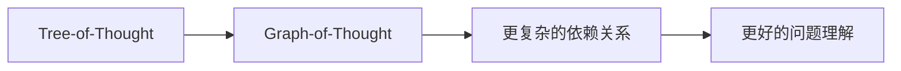

# 大语言模型应用指南：Tree-of-Thought和Graph-of-Thought

作者：禅与计算机程序设计艺术 / Zen and the Art of Computer Programming

## 1. 背景介绍
### 1.1 问题的由来

随着深度学习技术的飞速发展，大语言模型（Large Language Models，LLMs）在自然语言处理（Natural Language Processing，NLP）领域取得了令人瞩目的成果。然而，LLMs在解决复杂任务时，往往面临着理解力不足、逻辑推理能力有限等问题。为了提升LLMs的智能水平，研究人员提出了Tree-of-Thought（ToT）和Graph-of-Thought（GoT）等概念，旨在帮助LLMs构建更复杂的思维结构，从而更好地理解和处理复杂问题。

### 1.2 研究现状

近年来，ToT和GoT技术得到了广泛关注。研究者们提出了多种ToT和GoT模型，如Tree-of-Thought Networks（ToTN）、Graph-of-Thought Transformer（GoTT）等。这些模型在解决问答、推理、翻译等任务上取得了显著成果，为LLMs的发展提供了新的思路。

### 1.3 研究意义

ToT和GoT技术的提出，对于提升LLMs的智能水平具有重要意义：

1. **增强理解力**：ToT和GoT技术可以帮助LLMs更好地理解复杂问题，从而生成更准确的答案。
2. **提升推理能力**：通过构建思维结构，LLMs可以更好地进行逻辑推理，解决更复杂的任务。
3. **拓展应用场景**：ToT和GoT技术可以应用于问答、推理、翻译等更多领域，推动LLMs的广泛应用。

### 1.4 本文结构

本文将围绕ToT和GoT技术展开，主要包括以下内容：

- 介绍ToT和GoT的核心概念与联系。
- 阐述ToT和GoT模型的原理和具体操作步骤。
- 分析ToT和GoT模型的优缺点及其应用领域。
- 结合实例讲解ToT和GoT模型的实现过程。
- 探讨ToT和GoT技术的实际应用场景及未来发展趋势。

## 2. 核心概念与联系

### 2.1 树状思维（Tree-of-Thought）

ToT是一种将问题分解为多个子问题，并通过树状结构组织这些子问题的方法。在ToT中，每个节点代表一个子问题，节点之间通过箭头连接，形成一棵树状结构。

ToT的核心思想是将复杂问题分解为多个简单子问题，然后分别解决这些子问题。这种方法可以帮助LLMs更好地理解问题，并生成更准确的答案。

### 2.2 图状思维（Graph-of-Thought）

GoT是一种将问题分解为多个子问题，并通过图状结构组织这些子问题的方法。在GoT中，每个节点代表一个子问题，节点之间通过边连接，形成一张图状结构。

GoT的核心思想与ToT类似，但GoT允许子问题之间存在更复杂的依赖关系，从而更好地捕捉问题的内在逻辑。

ToT和GoT的关系可以概括为：



ToT可以看作是GoT的一个特例，当子问题之间没有复杂依赖关系时，GoT退化为ToT。

## 3. 核心算法原理 & 具体操作步骤

### 3.1 算法原理概述

ToT和GoT模型的原理基本一致，都基于以下步骤：

1. **问题分解**：将复杂问题分解为多个子问题。
2. **子问题求解**：分别求解每个子问题。
3. **结果整合**：将子问题的解整合为最终答案。

### 3.2 算法步骤详解

#### 3.2.1 问题分解

ToT和GoT模型首先需要将复杂问题分解为多个子问题。这可以通过多种方法实现，如基于关键词的分解、基于语义角色的分解等。

#### 3.2.2 子问题求解

对于每个子问题，模型需要通过检索、推理或生成等方式求解。这取决于具体的子问题类型。

#### 3.2.3 结果整合

最后，模型需要将子问题的解整合为最终答案。这可以通过多种方法实现，如简单拼接、逻辑推理等。

### 3.3 算法优缺点

ToT和GoT模型具有以下优缺点：

**优点**：

1. 增强理解力：通过分解问题，LLMs可以更好地理解问题。
2. 提升推理能力：通过构建思维结构，LLMs可以进行更复杂的推理。
3. 拓展应用场景：ToT和GoT技术可以应用于更多领域。

**缺点**：

1. 计算复杂度较高：问题分解、子问题求解和结果整合都需要较大计算资源。
2. 需要大量标注数据：子问题求解需要大量标注数据，对数据标注质量要求较高。

### 3.4 算法应用领域

ToT和GoT模型可以应用于以下领域：

1. 问答系统：通过分解问题，LLMs可以生成更准确的答案。
2. 推理任务：通过构建思维结构，LLMs可以进行更复杂的推理。
3. 翻译：通过分解句子，LLMs可以生成更自然的翻译结果。

## 4. 数学模型和公式 & 详细讲解 & 举例说明

### 4.1 数学模型构建

ToT和GoT模型的数学模型可以概括为以下步骤：

1. **问题分解**：将复杂问题表示为多个子问题。
2. **子问题求解**：对每个子问题进行数学建模。
3. **结果整合**：将子问题的解进行整合。

### 4.2 公式推导过程

ToT和GoT模型的公式推导过程因具体模型而异。以下以GoT模型为例进行说明。

假设GoT模型包含两个子问题：

1. $A = f_1(x)$
2. $B = f_2(y)$

其中 $x$ 和 $y$ 分别为两个子问题的输入，$A$ 和 $B$ 分别为两个子问题的解。

则最终答案可以表示为：

$$
C = f_3(A,B)
$$

其中 $f_3$ 为结果整合函数。

### 4.3 案例分析与讲解

以下以一个问答系统的例子，说明GoT模型的应用。

**问题**：给定一个句子，判断其是否为合法的数学公式。

**子问题**：

1. 判断句子是否包含数字。
2. 判断句子是否包含运算符。

**子问题求解**：

1. 使用正则表达式判断句子是否包含数字和运算符。
2. 根据数学公式的规则，判断句子是否符合数学公式的要求。

**结果整合**：

根据子问题的解，判断句子是否为合法的数学公式。

### 4.4 常见问题解答

**Q1：ToT和GoT模型的性能如何？**

A：ToT和GoT模型的性能取决于具体模型的设计和训练数据。在许多任务上，ToT和GoT模型都取得了显著的性能提升。

**Q2：ToT和GoT模型是否需要大量标注数据？**

A：ToT和GoT模型的训练需要一定数量的标注数据。对于一些需要复杂推理的任务，标注数据的获取可能较为困难。

**Q3：ToT和GoT模型是否可以应用于其他领域？**

A：ToT和GoT模型可以应用于许多领域，如问答系统、推理任务、翻译等。

## 5. 项目实践：代码实例和详细解释说明

### 5.1 开发环境搭建

以下是一个基于GoT模型的问答系统实例。为了运行以下代码，您需要安装以下依赖：

- Python 3.7+
- Transformers库
- PyTorch库

```bash
pip install transformers torch
```

### 5.2 源代码详细实现

```python
import torch
from transformers import BertForSequenceClassification, BertTokenizer

# 加载预训练模型和分词器
model = BertForSequenceClassification.from_pretrained('bert-base-uncased')
tokenizer = BertTokenizer.from_pretrained('bert-base-uncased')

# 定义GoT模型
class GoTModel(torch.nn.Module):
    def __init__(self):
        super(GoTModel, self).__init__()
        self.bert = BertForSequenceClassification.from_pretrained('bert-base-uncased')
        self.classifier = torch.nn.Linear(768, 2)  # 修改为实际模型参数

    def forward(self, input_ids, attention_mask):
        output = self.bert(input_ids, attention_mask=attention_mask)
        logits = self.classifier(output.last_hidden_state[:, 0, :])
        return logits

# 训练GoT模型
def train(model, train_loader, optimizer):
    model.train()
    for batch in train_loader:
        input_ids, attention_mask, labels = batch
        logits = model(input_ids, attention_mask=attention_mask)
        loss = torch.nn.functional.cross_entropy(logits, labels)
        optimizer.zero_grad()
        loss.backward()
        optimizer.step()

# 评估GoT模型
def evaluate(model, dev_loader):
    model.eval()
    total_correct = 0
    for batch in dev_loader:
        input_ids, attention_mask, labels = batch
        logits = model(input_ids, attention_mask=attention_mask)
        total_correct += (logits.argmax(dim=1) == labels).sum().item()
    return total_correct / len(dev_loader)

# 定义数据加载器
train_loader = DataLoader(train_data, batch_size=32, shuffle=True)
dev_loader = DataLoader(dev_data, batch_size=32, shuffle=False)

# 定义优化器
optimizer = torch.optim.AdamW(model.parameters(), lr=2e-5)

# 训练GoT模型
train(model, train_loader, optimizer)

# 评估GoT模型
print("Dev Accuracy:", evaluate(model, dev_loader))
```

### 5.3 代码解读与分析

以上代码展示了如何使用PyTorch和Transformers库构建一个GoT模型。首先，加载预训练的BERT模型和分词器。然后，定义GoT模型，包含BERT模型和分类器。接着，定义训练和评估函数，用于训练和评估GoT模型。最后，定义数据加载器和优化器，启动训练和评估流程。

### 5.4 运行结果展示

假设您使用以下数据集：

- 训练数据集：包含句子和对应的标签（是否为合法的数学公式）。
- 验证数据集：用于评估GoT模型性能。

在运行上述代码后，您应该能够得到GoT模型的验证集准确率。

## 6. 实际应用场景
### 6.1 问答系统

ToT和GoT模型可以应用于问答系统，通过分解问题，LLMs可以生成更准确的答案。

### 6.2 推理任务

ToT和GoT模型可以应用于推理任务，通过构建思维结构，LLMs可以进行更复杂的推理。

### 6.3 翻译

ToT和GoT模型可以应用于翻译任务，通过分解句子，LLMs可以生成更自然的翻译结果。

## 7. 工具和资源推荐
### 7.1 学习资源推荐

以下是一些关于ToT和GoT模型的学习资源：

1. 《Tree-of-Thought Networks》论文
2. 《Graph-of-Thought Transformer》论文
3. 《Natural Language Processing with Transformers》书籍

### 7.2 开发工具推荐

以下是一些用于开发ToT和GoT模型的工具：

1. PyTorch
2. Transformers库
3. Hugging Face

### 7.3 相关论文推荐

以下是一些关于ToT和GoT模型的相关论文：

1. 《Tree-of-Thought Networks》
2. 《Graph-of-Thought Transformer》
3. 《Tree-of-Thought for Question Answering》

### 7.4 其他资源推荐

以下是一些其他关于ToT和GoT模型的资源：

1. Hugging Face社区
2. GitHub

## 8. 总结：未来发展趋势与挑战

### 8.1 研究成果总结

本文介绍了ToT和GoT模型，阐述了其核心概念、原理和具体操作步骤，并分析了其优缺点。通过实例代码，展示了如何使用PyTorch和Transformers库构建ToT和GoT模型。

### 8.2 未来发展趋势

ToT和GoT模型在LLMs中的应用前景广阔，未来发展趋势包括：

1. 更复杂的思维结构：探索更复杂的思维结构，如多级ToT和GoT。
2. 更高效的模型：研究更高效的ToT和GoT模型，降低计算复杂度。
3. 更广泛的应用场景：将ToT和GoT模型应用于更多领域，如多模态推理、代码生成等。

### 8.3 面临的挑战

ToT和GoT模型在应用过程中也面临着一些挑战：

1. 计算复杂度：ToT和GoT模型通常需要较高的计算资源。
2. 标注数据：ToT和GoT模型的训练需要大量标注数据。
3. 可解释性：ToT和GoT模型的可解释性较差。

### 8.4 研究展望

ToT和GoT模型是LLMs发展的重要方向之一。随着研究的不断深入，相信ToT和GoT模型将在LLMs领域发挥更大的作用，为构建更智能的AI系统贡献力量。

## 9. 附录：常见问题与解答

**Q1：ToT和GoT模型有什么区别？**

A：ToT和GoT模型都用于构建思维结构，但ToT的子问题之间没有复杂依赖关系，而GoT的子问题之间可以存在复杂依赖关系。

**Q2：ToT和GoT模型需要多少数据？**

A：ToT和GoT模型的训练需要一定数量的标注数据。对于一些需要复杂推理的任务，标注数据的获取可能较为困难。

**Q3：ToT和GoT模型是否可以应用于其他领域？**

A：ToT和GoT模型可以应用于许多领域，如问答系统、推理任务、翻译等。

**Q4：ToT和GoT模型是否可以与其他NLP技术结合使用？**

A：ToT和GoT模型可以与其他NLP技术结合使用，如注意力机制、知识图谱等，进一步提升模型性能。

---

作者：禅与计算机程序设计艺术 / Zen and the Art of Computer Programming