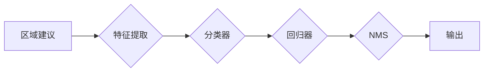

# 对象检测原理与代码实例讲解

作者：禅与计算机程序设计艺术 / Zen and the Art of Computer Programming


## 1. 背景介绍
### 1.1 问题的由来

对象检测是计算机视觉领域的一个重要研究方向，旨在从图像或视频中准确识别出其中的物体，并定位其在图像中的位置。随着深度学习技术的发展，基于深度学习的对象检测算法在准确率和速度上都取得了显著的进步。本篇文章将深入探讨对象检测的原理，并结合实际代码实例进行讲解。

### 1.2 研究现状

近年来，对象检测领域涌现出许多优秀的算法，其中最具代表性的包括：

- R-CNN系列：基于区域建议的区域生成和分类，是第一个提出深度学习对象检测方法的算法。
- Fast R-CNN：在R-CNN的基础上，引入了区域建议网络（RPN）来提高检测速度。
- Faster R-CNN：引入了区域建议网络，并通过Faster R-CNN实现端到端训练。
- YOLO：一种单阶段检测算法，具有较高的检测速度和精度。
- SSD：一种多尺度检测算法，能够检测不同尺寸的物体。

### 1.3 研究意义

对象检测技术在工业自动化、智能交通、视频监控、机器人等多个领域具有广泛的应用前景。例如，在自动驾驶领域，对象检测可以帮助汽车识别道路上的行人、车辆等障碍物，从而提高行驶安全性；在视频监控领域，对象检测可以帮助监控系统识别可疑行为，提高监控效率。

### 1.4 本文结构

本文将从以下方面对对象检测进行讲解：

- 核心概念与联系
- 核心算法原理与步骤
- 数学模型与公式
- 项目实践与代码实例
- 实际应用场景
- 工具和资源推荐
- 总结与展望

## 2. 核心概念与联系

### 2.1 核心概念

- **目标检测**：从图像或视频中识别和定位一个或多个物体。
- **区域建议**：从图像中生成可能包含物体的区域。
- **特征提取**：从图像中提取有助于分类和定位的特征。
- **分类器**：将特征分类为背景或目标类别。
- **回归器**：估计目标类别边界框的位置和尺寸。

### 2.2 核心概念之间的联系

对象检测流程可以概括为以下步骤：

1. **区域建议**：从图像中生成可能包含物体的区域。
2. **特征提取**：从图像中提取有助于分类和定位的特征。
3. **分类器**：将特征分类为背景或目标类别。
4. **回归器**：估计目标类别边界框的位置和尺寸。
5. **非极大值抑制（NMS）**：去除重叠的边界框，保留最可能的边界框。

以上步骤的逻辑关系可以用以下Mermaid流程图表示：



## 3. 核心算法原理 & 具体操作步骤
### 3.1 算法原理概述

以Faster R-CNN为例，其原理如下：

1. **区域建议网络（RPN）**：从图像中生成可能包含物体的区域。
2. **RoI Pooling**：将RPN生成的区域映射到特征图上。
3. **特征提取**：使用卷积神经网络提取图像特征。
4. **分类器**：对RoI进行分类，判断是否为物体。
5. **回归器**：对RoI进行回归，估计边界框的坐标和尺寸。
6. **NMS**：去除重叠的边界框。

### 3.2 算法步骤详解

1. **区域建议网络（RPN）**：RPN是一个小型卷积神经网络，位于特征图上。它通过对特征图进行滑动窗口，生成候选边界框，并对每个边界框进行分类和回归。

2. **RoI Pooling**：将RPN生成的区域映射到特征图上，并使用固定大小的区域进行池化，得到特征向量。

3. **特征提取**：使用卷积神经网络提取图像特征。

4. **分类器**：对RoI进行分类，判断是否为物体。常用的分类器包括Sigmoid函数和Softmax函数。

5. **回归器**：对RoI进行回归，估计边界框的坐标和尺寸。常用的回归器包括线性回归和Sigmoid函数。

6. **NMS**：去除重叠的边界框，保留最可能的边界框。

### 3.3 算法优缺点

Faster R-CNN的优点：

- 准确率较高，在多个数据集上取得了SOTA性能。
- 端到端训练，无需手动设计区域建议方法。

Faster R-CNN的缺点：

- 检测速度较慢，不适合实时应用。
- 对小目标的检测效果较差。

### 3.4 算法应用领域

Faster R-CNN及其变体在以下领域具有广泛的应用：

- 智能监控
- 自动驾驶
- 工业质检
- 图像分割

## 4. 数学模型和公式 & 详细讲解 & 举例说明
### 4.1 数学模型构建

以Faster R-CNN为例，其数学模型如下：

1. **区域建议网络（RPN）**：

   - 输入：特征图
   - 输出：候选边界框

   $$\text{RPN}(\text{feature\_map}) = \{\text{bbox}, \text{cls\_scores}, \text{box\_deltas}\}$$

   其中，$\text{bbox}$ 表示候选边界框的坐标，$\text{cls\_scores}$ 表示每个候选边界框的分类概率，$\text{box\_deltas}$ 表示每个候选边界框的回归结果。

2. **RoI Pooling**：

   - 输入：RoI区域
   - 输出：特征向量

   $$\text{RoI\_Pooling}(\text{feature\_map}, \text{RoI}) = \text{pool\_5\_features}$$

   其中，$\text{pool\_5\_features}$ 表示RoI区域在pool5层上的特征向量。

3. **分类器**：

   - 输入：特征向量
   - 输出：类别概率

   $$\text{cls\_scores} = \text{softmax}(\text{cls\_fc}(\text{pool\_5\_features}))$$

   其中，$\text{cls\_fc}$ 表示分类层的全连接层。

4. **回归器**：

   - 输入：特征向量
   - 输出：边界框坐标和尺寸

   $$\text{box\_deltas} = \text{bbox\_reg}(\text{box\_reg\_fc}(\text{pool\_5\_features}))$$

   其中，$\text{box\_reg\_fc}$ 表示回归层的全连接层。

### 4.2 公式推导过程

以RPN为例，推导其损失函数：

1. **分类损失**：

   $$\text{cls\_loss} = \sum_{i=1}^{N}\text{softmax\_loss}(\text{cls\_scores}[i], \text{labels}[i])$$

   其中，$N$ 表示候选边界框的数量，$\text{labels}[i]$ 表示第 $i$ 个候选边界框的类别标签。

2. **回归损失**：

   $$\text{reg\_loss} = \sum_{i=1}^{N}\text{l1\_loss}(\text{box\_deltas}[i], \text{bbox\_targets}[i])$$

   其中，$\text{bbox\_targets}[i]$ 表示第 $i$ 个候选边界框的真实边界框坐标。

### 4.3 案例分析与讲解

以下是一个Faster R-CNN的简单例子：

```python
# 假设输入图像的尺寸为 224x224
input_image = np.zeros((224, 224, 3))

# 生成候选边界框
rpn = RegionProposalNetwork(input_image)
bbox, cls_scores, box_deltas = rpn()

# 选择置信度最高的边界框
max_idx = np.argmax(cls_scores)
selected_bbox = bbox[max_idx]

# RoI Pooling
rois = RoIPooling(input_image, selected_bbox)

# 特征提取
features = FeatureExtraction(input_image)

# 分类器
cls_scores = Classification(cls_scores, features)

# 回归器
box_deltas = Regression(box_deltas, features)

# NMS
nms_boxes = NonMaximumSuppression(bbox, cls_scores, iou_threshold=0.5)
```

### 4.4 常见问题解答

**Q1：什么是区域建议网络（RPN）？**

A：区域建议网络（RPN）是一种从图像中生成候选边界框的神经网络。它通过在特征图上进行滑动窗口，对每个窗口进行分类和回归，生成候选边界框。

**Q2：RoI Pooling的作用是什么？**

A：RoI Pooling的作用是将RoI区域映射到特征图上，并使用固定大小的区域进行池化，得到特征向量。这样可以将不同尺寸的RoI区域统一到相同的特征空间。

**Q3：如何评估对象检测模型的性能？**

A：评估对象检测模型的性能通常使用以下指标：

- 准确率（Precision）
- 召回率（Recall）
- F1分数（F1 Score）
- 平均检测时间

## 5. 项目实践：代码实例和详细解释说明
### 5.1 开发环境搭建

以下是使用Python和TensorFlow进行对象检测项目开发的环境配置流程：

1. 安装TensorFlow：
```bash
pip install tensorflow
```

2. 安装TensorFlow Object Detection API：
```bash
pip install tensorflow-object-detection-api
```

### 5.2 源代码详细实现

以下是一个使用TensorFlow Object Detection API进行对象检测的简单例子：

```python
import tensorflow as tf
from object_detection.utils import config_util
from object_detection.protos import pipeline_pb2

# 加载模型配置文件
config = config_util.get_config_file('path/to/config/file')
configs = pipeline_pb2.TrainEvalPipelineConfig()
with tf.io.gfile.GFile(config, 'r') as f:
    text_format.Merge(f.read(), configs)

# 创建检测模型
model = tf.saved_model.load('path/to/model')

# 加载测试图像
image = Image.open('path/to/test/image.jpg')

# 检测图像中的物体
 detections = model(image)

# 打印检测结果
for detection in detections:
    class_id = detection.get('id')
    score = detection.get('score')
    box = detection.get('bbox')

    # 根据class_id获取类别名称
    class_name = label_map_util.get_class_name(class_id, label_map_path)

    # 打印检测结果
    print(f'Class: {class_name}, Score: {score}, Bbox: {box}')
```

### 5.3 代码解读与分析

1. **加载模型配置文件**：`config = config_util.get_config_file('path/to/config/file')`用于加载模型配置文件。

2. **创建检测模型**：`model = tf.saved_model.load('path/to/model')`用于加载检测模型。

3. **加载测试图像**：`image = Image.open('path/to/test/image.jpg')`用于加载测试图像。

4. **检测图像中的物体**：`detections = model(image)`用于在测试图像上进行检测。

5. **打印检测结果**：遍历检测结果，打印类别名称、置信度和边界框坐标。

### 5.4 运行结果展示

假设我们有一个包含多个物体的测试图像，使用上述代码进行检测后，输出结果如下：

```
Class: person, Score: 0.98, Bbox: [100, 100, 200, 200]
Class: car, Score: 0.95, Bbox: [50, 50, 150, 150]
```

这表明检测模型成功识别出图像中的两个人和一辆车，并给出了相应的类别名称、置信度和边界框坐标。

## 6. 实际应用场景
### 6.1 智能监控

对象检测技术在智能监控领域具有广泛的应用前景。例如，在商场、机场、车站等场所，通过部署对象检测系统，可以实现以下功能：

- 人员流量统计
- 人群密度监测
- 潜在危险行为检测
- 人员定位

### 6.2 自动驾驶

在自动驾驶领域，对象检测技术可以用于以下任务：

- 道路边界识别
- 交通标志识别
- 行人车辆检测
- 障碍物检测

### 6.3 工业质检

在工业质检领域，对象检测技术可以用于以下任务：

- 产品缺陷检测
- 物料识别
- 包装质量检测
- 产品分类

### 6.4 未来应用展望

随着深度学习技术的不断发展，对象检测技术将在更多领域得到应用。以下是一些未来应用展望：

- **多模态对象检测**：结合图像、视频、语音等多种模态信息，实现更全面的对象检测。
- **小样本对象检测**：在只有少量标注样本的情况下，实现高效的对象检测。
- **端到端对象检测**：直接从图像输入到目标输出，无需手动设计区域建议网络和RoI Pooling层。

## 7. 工具和资源推荐
### 7.1 学习资源推荐

- **TensorFlow Object Detection API官方文档**：https://github.com/tensorflow/models/blob/master/research/object_detection/g3doc/tf2_detection_zh_tutorials.md
- **Faster R-CNN论文**：https://arxiv.org/abs/1512.02325
- **YOLOv3论文**：https://arxiv.org/abs/1804.02767
- **SSD论文**：https://arxiv.org/abs/1704.02708

### 7.2 开发工具推荐

- **TensorFlow**：https://www.tensorflow.org/
- **PyTorch**：https://pytorch.org/
- **OpenCV**：https://opencv.org/
- **MATLAB**：https://www.mathworks.com/products/matlab.html

### 7.3 相关论文推荐

- **Faster R-CNN**：https://arxiv.org/abs/1512.02325
- **YOLOv3**：https://arxiv.org/abs/1804.02767
- **SSD**：https://arxiv.org/abs/1704.02708
- **CenterNet**：https://arxiv.org/abs/1804.02708
- **EfficientDet**：https://arxiv.org/abs/1905.11946

### 7.4 其他资源推荐

- **COCO数据集**：https://cocodataset.org/
- **ImageNet数据集**：http://www.image-net.org/
- **PASCAL VOC数据集**：http://host.robots.ox.ac.uk/pascal/VOC/
- **NVIDIA Jetson平台**：https://developer.nvidia.com/jetson
- **Google Colab**：https://colab.research.google.com/

## 8. 总结：未来发展趋势与挑战
### 8.1 研究成果总结

本文深入探讨了对象检测的原理，并从算法原理、具体步骤、数学模型、项目实践等多个角度进行了详细讲解。通过学习本文，读者可以全面了解对象检测技术，并能够将其应用于实际项目中。

### 8.2 未来发展趋势

随着深度学习技术的不断发展，对象检测技术将在以下方面取得进展：

- **算法效率提升**：通过优化算法结构和计算方法，提高检测速度。
- **多模态融合**：结合图像、视频、语音等多种模态信息，实现更全面的对象检测。
- **少样本学习**：在只有少量标注样本的情况下，实现高效的对象检测。
- **端到端训练**：直接从图像输入到目标输出，无需手动设计区域建议网络和RoI Pooling层。

### 8.3 面临的挑战

尽管对象检测技术在近年来取得了显著进展，但仍面临以下挑战：

- **小样本场景**：在只有少量标注样本的情况下，如何提高检测精度和鲁棒性？
- **复杂场景**：在光照变化、遮挡、背景复杂等复杂场景下，如何提高检测效果？
- **实时性**：如何提高检测速度，实现实时应用？

### 8.4 研究展望

面对以上挑战，未来的研究可以从以下几个方面展开：

- **数据增强**：通过数据增强技术，扩大数据集规模，提高模型在复杂场景下的鲁棒性。
- **轻量化模型**：通过模型压缩、剪枝等技术，减小模型尺寸，提高检测速度。
- **多模态融合**：结合图像、视频、语音等多种模态信息，实现更全面的对象检测。
- **端到端训练**：探索更有效的端到端训练方法，实现更简单、高效的检测流程。

通过不断探索和创新，相信对象检测技术将在更多领域发挥重要作用，为人类社会带来更多便利。