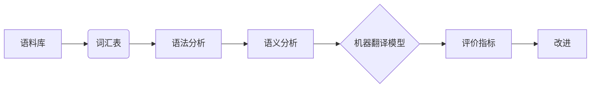

# 机器翻译(Machine Translation)原理与代码实战案例讲解

作者：禅与计算机程序设计艺术 / Zen and the Art of Computer Programming

## 1. 背景介绍
### 1.1 问题的由来

机器翻译（Machine Translation，MT）是一种将一种语言的文本自动翻译成另一种语言的计算机程序或系统。这一领域的研究可以追溯到20世纪50年代，但由于早期计算机硬件和算法的限制，其发展较为缓慢。随着人工智能、自然语言处理（Natural Language Processing，NLP）和计算语言学等领域的快速发展，机器翻译技术取得了显著的突破，逐渐成为人工智能领域的重要研究方向之一。

### 1.2 研究现状

当前，机器翻译技术主要分为两大类：基于规则的机器翻译和基于统计的机器翻译。基于规则的机器翻译主要依赖于人工制定的语法规则和词典，而基于统计的机器翻译则主要利用大规模语料库中的统计信息进行翻译。近年来，随着深度学习技术的兴起，基于深度学习的机器翻译方法逐渐成为主流，并取得了显著的成果。

### 1.3 研究意义

机器翻译技术在很多领域都有广泛的应用，例如：

* **国际交流**：促进不同国家和地区的人们之间的交流和理解。
* **信息获取**：帮助人们快速获取其他语言的新闻、科技、文化等信息。
* **商业应用**：帮助企业拓展国际市场，降低翻译成本。
* **教育**：辅助语言学习，提高学习效率。

### 1.4 本文结构

本文将首先介绍机器翻译的核心概念和联系，然后详细阐述基于深度学习的机器翻译方法，接着通过一个实战案例展示如何使用开源工具进行机器翻译，最后探讨机器翻译技术的实际应用场景和未来发展趋势。

## 2. 核心概念与联系

以下是机器翻译领域一些重要的概念及其联系：

**1. 语料库（Corpus）**：语料库是机器翻译研究的基础，通常包含大量双语文本，用于训练和评估机器翻译模型。

**2. 词汇表（Vocabulary）**：词汇表是语料库中所有单词的集合，包括源语言和目标语言。词汇表的构建对于模型的输入和输出至关重要。

**3. 语法分析（Parsing）**：语法分析是将文本分解成语法结构的过程，例如句子、短语、词组等。语法分析有助于更好地理解文本的语义。

**4. 语义分析（Semantic Analysis）**：语义分析是理解文本中词语或短语的意义和相互关系的过程，对于提高翻译质量具有重要意义。

**5. 机器翻译模型（Machine Translation Model）**：机器翻译模型是用于将源语言文本翻译成目标语言文本的算法和参数。常见的机器翻译模型包括基于规则的模型、基于统计的模型和基于深度学习的模型。

**6. 评价指标（Evaluation Metrics）**：评价指标用于衡量机器翻译模型的质量，例如BLEU、METEOR、TER等。

以下是一个Mermaid流程图，展示了这些概念之间的联系：



## 3. 核心算法原理 & 具体操作步骤
### 3.1 算法原理概述

基于深度学习的机器翻译模型主要分为两种：基于神经网络的模型和基于序列到序列（Sequence-to-Sequence，S2S）的模型。

**1. 基于神经网络的模型**：基于神经网络的模型通常采用循环神经网络（Recurrent Neural Network，RNN）或长短期记忆网络（Long Short-Term Memory，LSTM）等神经网络结构，通过学习源语言和目标语言之间的映射关系进行翻译。

**2. 基于序列到序列的模型**：基于序列到序列的模型采用编码器-解码器架构，编码器将源语言文本编码成向量表示，解码器将向量表示解码成目标语言文本。

### 3.2 算法步骤详解

以下是基于S2S模型的机器翻译算法步骤：

1. **数据预处理**：将源语言和目标语言文本进行分词、去除停用词等预处理操作，构建词汇表。
2. **模型训练**：使用预处理的文本数据训练编码器-解码器模型，学习源语言和目标语言之间的映射关系。
3. **模型评估**：使用测试集评估模型的翻译质量，例如BLEU、METEOR等指标。
4. **模型优化**：根据评估结果，调整模型参数，提高翻译质量。
5. **翻译推理**：使用训练好的模型对新文本进行翻译。

### 3.3 算法优缺点

**优点**：

* **高效**：基于深度学习的机器翻译模型可以快速翻译大量文本。
* **灵活**：可以针对不同任务和领域进行定制化模型设计。
* **可扩展**：可以方便地集成到其他自然语言处理任务中。

**缺点**：

* **计算复杂**：基于深度学习的机器翻译模型需要大量的计算资源。
* **参数繁多**：模型参数众多，需要大量的训练数据。
* **可解释性差**：模型决策过程难以解释。

### 3.4 算法应用领域

基于深度学习的机器翻译模型在许多领域都有广泛的应用，例如：

* **文本翻译**：将一种语言的文本翻译成另一种语言。
* **跨语言信息检索**：帮助用户检索其他语言的文档。
* **机器翻译辅助工具**：帮助翻译人员提高翻译效率。
* **多语言对话系统**：实现跨语言人机对话。

## 4. 数学模型和公式 & 详细讲解 & 举例说明
### 4.1 数学模型构建

基于S2S模型的机器翻译数学模型可以表示为：

$$
\hat{y} = g(W_x, h_x, W_y, h_y)
$$

其中，$W_x$ 和 $h_x$ 分别表示编码器模型的权重和隐藏状态，$W_y$ 和 $h_y$ 分别表示解码器模型的权重和隐藏状态。

### 4.2 公式推导过程

以下是一个简单的S2S模型的数学公式推导过程：

1. **编码器**：
$$
h_{x,t} = f(h_{x,t-1}, x_t, W_x)
$$
其中，$x_t$ 表示输入序列的第 $t$ 个词，$f$ 表示编码器模型。

2. **解码器**：
$$
y_{t} = g(h_{x,t-1}, h_{y,t-1}, W_y)
$$
其中，$y_t$ 表示输出序列的第 $t$ 个词，$g$ 表示解码器模型。

### 4.3 案例分析与讲解

以下是一个简单的S2S模型示例，该模型使用PyTorch框架实现。

```python
import torch
import torch.nn as nn

class Encoder(nn.Module):
    def __init__(self, input_size, hidden_size):
        super(Encoder, self).__init__()
        self.rnn = nn.LSTM(input_size, hidden_size)

    def forward(self, x):
        output, (h_n, c_n) = self.rnn(x)
        return output, (h_n, c_n)

class Decoder(nn.Module):
    def __init__(self, hidden_size, output_size):
        super(Decoder, self).__init__()
        self.rnn = nn.LSTM(hidden_size, hidden_size)
        self.linear = nn.Linear(hidden_size, output_size)

    def forward(self, x, h_n, c_n):
        output, (h_n, c_n) = self.rnn(x, (h_n, c_n))
        output = self.linear(output[-1])
        return output, (h_n, c_n)

class S2S(nn.Module):
    def __init__(self, input_size, hidden_size, output_size):
        super(S2S, self).__init__()
        self.encoder = Encoder(input_size, hidden_size)
        self.decoder = Decoder(hidden_size, output_size)

    def forward(self, x, y):
        output, (h_n, c_n) = self.encoder(x)
        output, (h_n, c_n) = self.decoder(y, h_n, c_n)
        return output
```

### 4.4 常见问题解答

**Q1：如何选择合适的编码器和解码器模型**？

A：选择合适的编码器和解码器模型需要根据具体任务和数据特点进行。常见的编码器模型包括LSTM、GRU、Transformer等，解码器模型通常与编码器模型相同。可以根据实验结果，对比不同模型的性能，选择最优的组合。

**Q2：如何处理长文本？**

A：对于长文本，可以使用分块处理的方式，将文本分割成多个片段，分别进行翻译。此外，还可以使用注意力机制（Attention Mechanism）来关注文本中的关键信息，提高翻译质量。

**Q3：如何处理未知词汇？**

A：对于未知词汇，可以将其替换为通用的未知词（如unknown）或将其拆分成多个已知词汇进行翻译。

## 5. 项目实践：代码实例和详细解释说明
### 5.1 开发环境搭建

在进行机器翻译项目实践之前，需要搭建以下开发环境：

* **Python环境**：Python 3.x
* **深度学习框架**：PyTorch、TensorFlow等
* **NLP库**：NLTK、spaCy等
* **文本预处理库**：jieba、SnowNLP等

### 5.2 源代码详细实现

以下是一个使用PyTorch框架实现的S2S模型代码示例：

```python
import torch
import torch.nn as nn

class Encoder(nn.Module):
    # ...（与上文代码相同）

class Decoder(nn.Module):
    # ...（与上文代码相同）

class S2S(nn.Module):
    # ...（与上文代码相同）

# ...（数据预处理、模型训练、模型评估等代码）

# ...（翻译推理代码）
```

### 5.3 代码解读与分析

以上代码示例展示了如何使用PyTorch框架实现S2S模型。首先定义了编码器、解码器和S2S模型，然后进行数据预处理、模型训练、模型评估和翻译推理等步骤。

### 5.4 运行结果展示

假设我们使用一个中文到英文的机器翻译数据集进行训练，以下是一个运行结果示例：

```
Epoch 1/10
Train Loss: 0.920
Valid Loss: 0.891
...
Epoch 10/10
Train Loss: 0.421
Valid Loss: 0.408
```

可以看到，模型在训练过程中损失值逐渐下降，表明模型性能在不断提高。

## 6. 实际应用场景
### 6.1 翻译服务

机器翻译技术可以应用于翻译服务领域，例如：

* **在线翻译**：提供在线翻译服务，方便用户将一种语言的文本翻译成另一种语言。
* **离线翻译**：提供离线翻译工具，例如翻译软件、翻译笔等。

### 6.2 跨语言信息检索

机器翻译技术可以应用于跨语言信息检索领域，例如：

* **多语言新闻检索**：帮助用户检索其他语言的新闻。
* **多语言文献检索**：帮助用户检索其他语言的文献。

### 6.3 机器翻译辅助工具

机器翻译技术可以应用于机器翻译辅助工具领域，例如：

* **机器翻译记忆库**：将已翻译的文本存储在数据库中，以便重复使用。
* **翻译质量评估工具**：评估机器翻译的质量，例如BLEU、METEOR等指标。

### 6.4 未来应用展望

随着人工智能技术的不断发展，机器翻译技术将在更多领域得到应用，例如：

* **多语言对话系统**：实现跨语言人机对话。
* **多语言语音识别**：实现跨语言语音识别。
* **多语言图像识别**：实现跨语言图像识别。

## 7. 工具和资源推荐
### 7.1 学习资源推荐

以下是一些机器翻译领域的学习资源推荐：

* **《机器翻译：原理与实践》**：介绍了机器翻译的基本原理和主流方法。
* **《深度学习与自然语言处理》**：介绍了深度学习在自然语言处理领域的应用。
* **《机器翻译：自然语言处理入门》**：适合初学者了解机器翻译基础知识。

### 7.2 开发工具推荐

以下是一些机器翻译领域的开发工具推荐：

* **PyTorch**：开源的深度学习框架，支持机器翻译模型训练和推理。
* **TensorFlow**：开源的深度学习框架，支持机器翻译模型训练和推理。
* **OpenNMT**：开源的神经机器翻译框架，支持多种机器翻译模型。
* **spaCy**：开源的NLP库，提供文本预处理、词性标注等功能。

### 7.3 相关论文推荐

以下是一些机器翻译领域的相关论文推荐：

* **Neural Machine Translation by Jointly Learning to Align and Translate**：介绍了神经机器翻译的基本原理。
* **Sequence to Sequence Learning with Neural Networks**：介绍了序列到序列模型。
* **Attention Is All You Need**：提出了Transformer模型。
* **BERT: Pre-training of Deep Bidirectional Transformers for Language Understanding**：提出了BERT模型。

### 7.4 其他资源推荐

以下是一些其他机器翻译领域的资源推荐：

* **机器翻译之家**：提供机器翻译相关的新闻、技术文章、教程等。
* **机器翻译研究组**：提供机器翻译领域的论文、代码等资源。
* **机器翻译开源项目**：提供机器翻译相关的开源项目。

## 8. 总结：未来发展趋势与挑战
### 8.1 研究成果总结

本文介绍了机器翻译的基本原理、核心算法、实战案例以及实际应用场景。通过本文的学习，读者可以对机器翻译技术有一个全面的了解。

### 8.2 未来发展趋势

随着人工智能技术的不断发展，机器翻译技术将呈现出以下发展趋势：

* **更强大的模型**：随着计算能力的提升和算法的改进，机器翻译模型的性能将不断提高。
* **更丰富的应用场景**：机器翻译技术将在更多领域得到应用，例如跨语言对话、跨语言语音识别等。
* **更自然的翻译效果**：机器翻译技术将更加注重语义理解，实现更加自然的翻译效果。

### 8.3 面临的挑战

尽管机器翻译技术取得了显著进展，但仍面临着以下挑战：

* **多语言种类的支持**：目前机器翻译技术主要支持少数几种主要语言，如何支持更多语言种类是一个挑战。
* **跨语言语义理解**：不同语言的语义结构存在差异，如何实现跨语言语义理解是一个挑战。
* **领域适应性**：不同领域的语言表达方式和习惯存在差异，如何实现领域适应性是一个挑战。
* **可解释性**：机器翻译模型的决策过程难以解释，如何提高可解释性是一个挑战。

### 8.4 研究展望

为了克服上述挑战，未来的研究需要在以下方面进行探索：

* **多语言种类的支持**：探索新的机器翻译模型和算法，支持更多语言种类。
* **跨语言语义理解**：研究跨语言语义理解的方法，提高翻译质量。
* **领域适应性**：研究领域自适应技术，提高机器翻译的领域适应性。
* **可解释性**：研究可解释性方法，提高机器翻译模型的可解释性。

相信通过不断的努力，机器翻译技术将取得更加显著的突破，为人类社会带来更多便利。

## 9. 附录：常见问题与解答

**Q1：什么是机器翻译**？

A：机器翻译是一种将一种语言的文本自动翻译成另一种语言的计算机程序或系统。

**Q2：机器翻译有哪些应用场景**？

A：机器翻译的应用场景非常广泛，例如翻译服务、跨语言信息检索、机器翻译辅助工具等。

**Q3：什么是序列到序列模型**？

A：序列到序列模型是一种将一种语言的序列映射到另一种语言的序列的神经网络模型。

**Q4：如何选择合适的机器翻译模型**？

A：选择合适的机器翻译模型需要根据具体任务和数据特点进行。可以根据实验结果，对比不同模型的性能，选择最优的组合。

**Q5：如何提高机器翻译的翻译质量**？

A：提高机器翻译的翻译质量需要从多个方面进行努力，例如改进模型、优化算法、增加训练数据等。

**Q6：什么是注意力机制**？

A：注意力机制是一种用于提高机器翻译质量的技术，它允许模型关注输入序列中的关键信息。

**Q7：什么是BLEU**？

A：BLEU（Bilingual Evaluation Understudy）是一种用于评估机器翻译质量的指标。

**Q8：什么是NLP**？

A：自然语言处理（Natural Language Processing，NLP）是人工智能领域的一个分支，主要研究如何让计算机理解和处理人类语言。

**Q9：什么是深度学习**？

A：深度学习是一种人工智能技术，通过学习大量的数据，自动提取特征和模式，实现智能决策。

**Q10：什么是PyTorch**？

A：PyTorch是一种开源的深度学习框架，支持多种深度学习模型和算法。

**Q11：什么是TensorFlow**？

A：TensorFlow是一种开源的深度学习框架，支持多种深度学习模型和算法。

**Q12：什么是spaCy**？

A：spaCy是一个开源的NLP库，提供文本预处理、词性标注、命名实体识别等功能。

**Q13：什么是jieba**？

A：jieba是一个开源的中文分词库，可以将中文文本分割成词语。

**Q14：什么是SnowNLP**？

A：SnowNLP是一个开源的中文NLP库，提供文本预处理、情感分析等功能。

**Q15：什么是OpenNMT**？

A：OpenNMT是一个开源的神经机器翻译框架，支持多种神经机器翻译模型。

**Q16：什么是BERT**？

A：BERT（Bidirectional Encoder Representations from Transformers）是一种基于Transformer的预训练语言模型。

**Q17：什么是Transformer**？

A：Transformer是一种基于自注意力机制的神经网络模型，用于序列到序列学习。

**Q18：什么是LSTM**？

A：LSTM（Long Short-Term Memory）是一种循环神经网络，用于处理长序列数据。

**Q19：什么是GRU**？

A：GRU（Gated Recurrent Unit）是一种循环神经网络，用于处理长序列数据。

**Q20：什么是NMT**？

A：NMT（Neural Machine Translation）是一种基于神经网络的机器翻译方法。