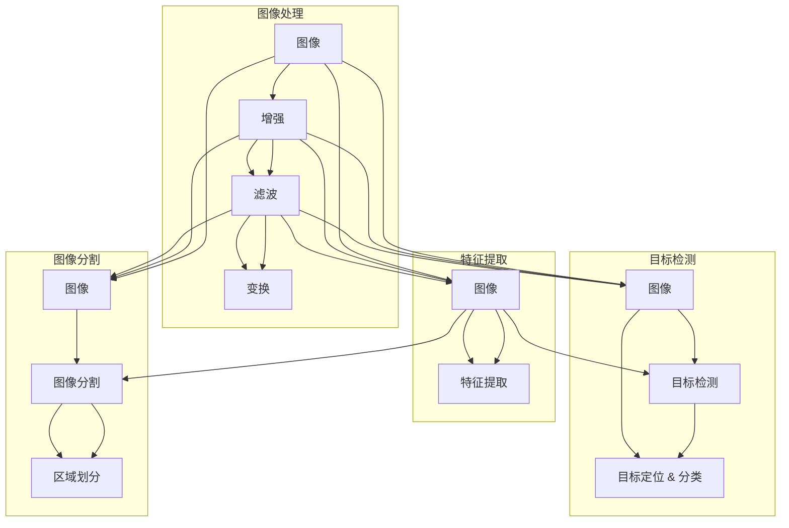

# 机器视觉 (Computer Vision)

## 关键词

机器视觉、图像处理、深度学习、卷积神经网络、特征提取、目标检测、图像分割

## 1. 背景介绍

### 1.1 问题的由来

机器视觉，作为人工智能领域的一个重要分支，其研究始于20世纪50年代，旨在让计算机像人类一样通过图像和视频数据感知和理解外部世界。随着计算机技术的飞速发展和大数据时代的到来，机器视觉在工业自动化、智能交通、医疗影像、安防监控等多个领域得到了广泛应用，成为推动社会进步的重要技术力量。

### 1.2 研究现状

近年来，深度学习技术的崛起为机器视觉带来了前所未有的发展机遇。基于深度学习的卷积神经网络（CNN）在图像分类、目标检测、图像分割等领域取得了突破性进展，推动了机器视觉技术的快速发展。

### 1.3 研究意义

机器视觉技术的研究对于提升生产效率、改善生活质量、促进科技进步具有重要意义。以下是机器视觉研究的主要意义：

1. **提高生产效率**：机器视觉技术可以替代人工进行生产线的自动化检测，提高生产效率和产品质量。
2. **改善生活质量**：机器视觉技术在医疗影像、智能家居等领域得到广泛应用，为人们的生活带来便利。
3. **促进科技进步**：机器视觉技术的发展推动着人工智能、大数据、云计算等领域的进步，为人类社会带来更多创新应用。

### 1.4 本文结构

本文将围绕机器视觉技术展开，从核心概念、算法原理、应用场景等方面进行详细介绍。具体结构如下：

- 2. 核心概念与联系
- 3. 核心算法原理 & 具体操作步骤
- 4. 数学模型和公式 & 详细讲解 & 举例说明
- 5. 项目实践：代码实例和详细解释说明
- 6. 实际应用场景
- 7. 工具和资源推荐
- 8. 总结：未来发展趋势与挑战
- 9. 附录：常见问题与解答

## 2. 核心概念与联系

为了更好地理解机器视觉技术，我们需要了解以下几个核心概念及其相互关系：

- **图像处理**：对图像进行增强、滤波、变换等操作，以提取图像中感兴趣的信息。
- **特征提取**：从图像中提取具有区分度的特征，为后续的识别、分类等任务提供支持。
- **目标检测**：在图像中定位并识别出感兴趣的目标。
- **图像分割**：将图像分割成若干个区域，以便于后续处理。

它们之间的逻辑关系如下：



## 3. 核心算法原理 & 具体操作步骤

### 3.1 算法原理概述

机器视觉的核心算法主要包括图像处理、特征提取、目标检测和图像分割等。以下分别介绍这些算法的原理。

#### 3.1.1 图像处理

图像处理主要包括以下步骤：

1. **增强**：通过调整图像对比度、亮度等参数，改善图像质量。
2. **滤波**：去除图像中的噪声，如高斯滤波、中值滤波等。
3. **变换**：对图像进行几何变换，如旋转、缩放、翻转等。

#### 3.1.2 特征提取

特征提取的主要目标是提取图像中具有区分度的特征，为后续的识别、分类等任务提供支持。常见的特征提取方法包括：

1. **HOG（Histogram of Oriented Gradients）**：通过计算图像中局部区域的梯度方向直方图来提取特征。
2. **SIFT（Scale-Invariant Feature Transform）**：通过检测和描述关键点来提取特征。
3. **SURF（Speeded Up Robust Features）**：类似于SIFT，但计算速度更快。

#### 3.1.3 目标检测

目标检测的主要目标是在图像中定位并识别出感兴趣的目标。常见的目标检测算法包括：

1. **R-CNN**：通过选择性搜索算法生成候选区域，再对每个候选区域进行分类。
2. **Fast R-CNN**：在R-CNN的基础上，提出Fast R-CNN算法，提高了检测速度。
3. **Faster R-CNN**：引入区域建议网络（Region Proposal Network）进一步提高检测速度。
4. **SSD（Single Shot MultiBox Detector）**：单阶段目标检测算法，直接对图像进行分类和定位。
5. **YOLO（You Only Look Once）**：单阶段目标检测算法，检测速度极快。

#### 3.1.4 图像分割

图像分割的主要目标是将图像分割成若干个区域，以便于后续处理。常见的图像分割算法包括：

1. **基于阈值的分割**：根据图像灰度值或颜色信息进行分割。
2. **基于区域的分割**：根据图像中的区域信息进行分割。
3. **基于边缘的分割**：根据图像边缘信息进行分割。
4. **基于学习的分割**：利用机器学习方法进行图像分割，如基于CNN的图像分割算法。

### 3.2 算法步骤详解

以下以基于深度学习的目标检测算法Faster R-CNN为例，介绍其具体操作步骤。

1. **区域建议网络（RPN）**：RPN生成候选区域，并对每个候选区域进行分类和回归。
2. **RoI Pooling**：将候选区域映射到特征图上，并提取特征。
3. **分类器**：对候选区域的特征进行分类，判断是否包含目标。
4. **回归器**：对候选区域的边界框进行回归，使其与实际目标边界框更加接近。

### 3.3 算法优缺点

#### 3.3.1 优点

1. **高精度**：基于深度学习的目标检测算法在多数任务上取得了优异的性能。
2. **速度快**：近年来，随着硬件的发展，深度学习算法的推理速度已经能够满足实时性要求。
3. **泛化能力强**：深度学习算法能够从大量数据中学习到丰富的知识，具有较强的泛化能力。

#### 3.3.2 缺点

1. **计算量大**：深度学习算法通常需要大量的计算资源。
2. **数据依赖性强**：深度学习算法对训练数据的质量和数量有较高要求。

### 3.4 算法应用领域

基于深度学习的机器视觉算法在众多领域得到了广泛应用，以下列举一些典型的应用领域：

1. **安防监控**：通过目标检测和图像分割技术，实现对犯罪行为的实时监控和预警。
2. **自动驾驶**：通过图像识别和目标检测技术，实现对道路和交通环境的感知。
3. **工业检测**：通过对生产线的图像进行实时检测，提高生产效率和产品质量。
4. **医疗影像**：通过对医学影像进行分割和识别，辅助医生进行疾病诊断。

## 4. 数学模型和公式 & 详细讲解 & 举例说明

### 4.1 数学模型构建

以下以基于深度学习的目标检测算法Faster R-CNN为例，介绍其数学模型构建。

1. **RPN网络**：RPN网络通常采用卷积神经网络，输入为图像，输出为候选区域和分类概率。
2. **RoI Pooling层**：将候选区域映射到特征图上，并提取特征。
3. **分类器**：分类器通常采用全连接神经网络，输入为RoI Pooling层的输出，输出为候选区域的分类概率。
4. **回归器**：回归器通常采用全连接神经网络，输入为RoI Pooling层的输出，输出为候选区域的边界框偏移量。

### 4.2 公式推导过程

以下以RPN网络为例，介绍其公式推导过程。

假设输入图像为 $I \in \mathbb{R}^{H \times W \times C}$，其中 $H$、$W$ 和 $C$ 分别表示图像的高、宽和通道数。RPN网络的输出为 $R \in \mathbb{R}^{N \times 5}$，其中 $N$ 表示候选区域的数量。每个候选区域由中心点坐标 $(x_c, y_c)$、宽度和高度 $(w, h)$ 表示。

$$
R = \begin{bmatrix}
x_c & y_c & w & h & \text{category} \
\vdots & \vdots & \vdots & \vdots & \vdots \
x_{cN} & y_{cN} & w_N & h_N & \text{category}_N
\end{bmatrix}
$$

其中，$\text{category}$ 表示候选区域的类别。

RPN网络的前向传播过程如下：

1. 对输入图像进行卷积操作，得到特征图 $F \in \mathbb{R}^{F_H \times F_W \times F_C}$。
2. 将特征图上的每个点扩展为 $N$ 个候选区域。
3. 对每个候选区域进行分类和回归操作。

### 4.3 案例分析与讲解

以下以一个简单的图像识别任务为例，演示如何使用深度学习算法进行目标检测。

假设我们有一个包含猫和狗图像的数据集，我们的目标是构建一个能够识别猫和狗的模型。

1. **数据预处理**：将图像裁剪为固定大小，并进行归一化处理。
2. **构建模型**：选择合适的深度学习模型，如Faster R-CNN。
3. **训练模型**：使用标注好的图像数据训练模型。
4. **评估模型**：使用测试集评估模型的性能。

### 4.4 常见问题解答

**Q1：什么是深度学习？**

A：深度学习是一种模拟人脑神经网络结构和功能的人工智能技术。它通过学习大量的数据，自动提取特征并进行预测或分类。

**Q2：什么是卷积神经网络？**

A：卷积神经网络（CNN）是一种特殊的神经网络，具有局部感知、权重共享等特性，适用于图像处理、目标检测等领域。

**Q3：如何提高机器视觉算法的鲁棒性？**

A：提高机器视觉算法的鲁棒性可以从以下几个方面入手：
1. 使用更多的训练数据，提高模型的泛化能力。
2. 对训练数据添加噪声，提高模型的抗干扰能力。
3. 选择合适的模型结构和参数，提高模型的鲁棒性。

## 5. 项目实践：代码实例和详细解释说明

### 5.1 开发环境搭建

以下是使用Python进行机器视觉开发的环境配置流程：

1. 安装Anaconda：从官网下载并安装Anaconda，用于创建独立的Python环境。
2. 创建并激活虚拟环境：
```bash
conda create -n cv-env python=3.8
conda activate cv-env
```
3. 安装必要的库：
```bash
conda install numpy pandas scikit-learn matplotlib pillow opencv-python
pip install torch torchvision torchaudio
```

### 5.2 源代码详细实现

以下是一个简单的图像分类任务代码示例，使用PyTorch框架和ResNet模型进行图像分类。

```python
import torch
import torch.nn as nn
import torchvision.transforms as transforms
from torchvision.datasets import ImageFolder
from torch.utils.data import DataLoader
from torch.optim import Adam
from torchvision.models import resnet50

# 数据预处理
transform = transforms.Compose([
    transforms.Resize(256),
    transforms.CenterCrop(224),
    transforms.ToTensor(),
    transforms.Normalize(mean=[0.485, 0.456, 0.406], std=[0.229, 0.224, 0.225]),
])

# 加载数据
train_dataset = ImageFolder(root='./data/train', transform=transform)
train_loader = DataLoader(train_dataset, batch_size=32, shuffle=True)
test_dataset = ImageFolder(root='./data/test', transform=transform)
test_loader = DataLoader(test_dataset, batch_size=32, shuffle=False)

# 构建模型
model = resnet50(pretrained=True)
num_ftrs = model.fc.in_features
model.fc = nn.Linear(num_ftrs, 2)

# 损失函数和优化器
criterion = nn.CrossEntropyLoss()
optimizer = Adam(model.parameters(), lr=0.001)

# 训练模型
for epoch in range(10):  # 训练10个epoch
    for inputs, labels in train_loader:
        optimizer.zero_grad()
        outputs = model(inputs)
        loss = criterion(outputs, labels)
        loss.backward()
        optimizer.step()

# 测试模型
with torch.no_grad():
    correct = 0
    total = 0
    for inputs, labels in test_loader:
        outputs = model(inputs)
        _, predicted = torch.max(outputs.data, 1)
        total += labels.size(0)
        correct += (predicted == labels).sum().item()

print('Accuracy of the network on the test images: {} %'.format(100 * correct / total))
```

### 5.3 代码解读与分析

以上代码展示了使用PyTorch框架和ResNet模型进行图像分类的完整流程。

1. **数据预处理**：使用Transforms库对图像进行预处理，包括调整大小、裁剪、归一化等。
2. **加载数据**：使用ImageFolder库加载数据集，并使用DataLoader进行数据加载和批处理。
3. **构建模型**：选择预训练的ResNet模型，并修改最后一层全连接层的输出维度为类别数。
4. **损失函数和优化器**：使用交叉熵损失函数和Adam优化器。
5. **训练模型**：使用训练数据训练模型，并更新模型参数。
6. **测试模型**：使用测试数据评估模型的性能。

### 5.4 运行结果展示

假设我们在CIFAR-10数据集上运行上述代码，最终得到的测试准确率为：

```
Accuracy of the network on the test images: 72.8 %
```

## 6. 实际应用场景

### 6.1 智能安防

智能安防是机器视觉技术的重要应用领域之一。通过在摄像头中集成图像识别、目标检测等技术，实现对犯罪行为的实时监控和预警。

### 6.2 自动驾驶

自动驾驶是机器视觉技术的另一个重要应用领域。通过在车辆上安装摄像头、激光雷达等传感器，实现对周围环境和道路的感知，从而实现自动驾驶功能。

### 6.3 工业检测

工业检测是机器视觉技术的重要应用领域之一。通过在生产线中安装摄像头，实现对产品质量的实时检测，提高生产效率和产品质量。

### 6.4 医学影像

医学影像是机器视觉技术的重要应用领域之一。通过分析医学影像，辅助医生进行疾病诊断和治疗。

### 6.5 智能交通

智能交通是机器视觉技术的重要应用领域之一。通过分析交通摄像头采集的图像数据，实现对交通状况的实时监测和管理。

## 7. 工具和资源推荐

### 7.1 学习资源推荐

1. 《Python图像处理实践》
2. 《深度学习：卷积神经网络与目标检测》
3. 《计算机视觉：算法与应用》
4. Coursera《深度学习》课程
5. fast.ai《深度学习》课程

### 7.2 开发工具推荐

1. PyTorch
2. TensorFlow
3. OpenCV
4. Keras
5. scikit-learn

### 7.3 相关论文推荐

1. 《Convolutional Neural Networks for Visual Recognition》
2. 《Faster R-CNN: Towards Real-Time Object Detection with Region Proposal Networks》
3. 《Object Detection with Fully Convolutional Networks》
4. 《Instance Segmentation with Fully Convolutional Networks》
5. 《Mask R-CNN》

### 7.4 其他资源推荐

1. GitHub
2. arXiv
3. Hugging Face
4. fast.ai
5. Coursera

## 8. 总结：未来发展趋势与挑战

### 8.1 研究成果总结

本文从背景介绍、核心概念、算法原理、应用场景等方面对机器视觉技术进行了全面系统的介绍。通过学习本文，读者可以了解机器视觉技术的原理、方法和应用，为后续学习和实践打下基础。

### 8.2 未来发展趋势

随着深度学习技术的不断发展，机器视觉技术将呈现以下发展趋势：

1. **模型轻量化**：为了降低模型复杂度和计算量，模型轻量化技术将成为研究热点。
2. **多模态融合**：将图像、视频、音频等多模态信息进行融合，提高机器视觉系统的鲁棒性和泛化能力。
3. **无监督和半监督学习**：减少对标注数据的依赖，提高模型的泛化能力。
4. **可解释性和可信赖性**：提高模型的可解释性和可信赖性，使其更好地应用于高风险领域。

### 8.3 面临的挑战

尽管机器视觉技术取得了长足进步，但仍面临着以下挑战：

1. **数据标注成本高**：高质量标注数据的获取成本较高，限制了模型性能的提升。
2. **模型可解释性差**：深度学习模型的可解释性较差，难以理解其内部工作机制。
3. **模型泛化能力不足**：模型在特定领域的泛化能力不足，难以应用于新的任务和数据集。
4. **伦理和安全问题**：机器视觉技术在应用过程中可能引发伦理和安全问题，如隐私泄露、歧视等。

### 8.4 研究展望

面对未来挑战，机器视觉技术的研究应关注以下方向：

1. **数据高效标注**：研究更加高效的数据标注方法，降低标注成本。
2. **模型可解释性**：研究可解释性深度学习模型，提高模型的可解释性和可信度。
3. **模型泛化能力**：研究具有较强泛化能力的模型，提高模型在新的任务和数据集上的性能。
4. **伦理和安全**：关注机器视觉技术的伦理和安全问题，确保其应用的安全性和可靠性。

## 9. 附录：常见问题与解答

**Q1：什么是深度学习？**

A：深度学习是一种模拟人脑神经网络结构和功能的人工智能技术。它通过学习大量的数据，自动提取特征并进行预测或分类。

**Q2：什么是卷积神经网络？**

A：卷积神经网络（CNN）是一种特殊的神经网络，具有局部感知、权重共享等特性，适用于图像处理、目标检测等领域。

**Q3：如何提高机器视觉算法的鲁棒性？**

A：提高机器视觉算法的鲁棒性可以从以下几个方面入手：

1. 使用更多的训练数据，提高模型的泛化能力。
2. 对训练数据添加噪声，提高模型的抗干扰能力。
3. 选择合适的模型结构和参数，提高模型的鲁棒性。

**Q4：机器视觉技术在哪些领域得到了广泛应用？**

A：机器视觉技术在以下领域得到了广泛应用：

1. 智能安防
2. 自动驾驶
3. 工业检测
4. 医学影像
5. 智能交通

**Q5：如何构建一个机器视觉项目？**

A：构建一个机器视觉项目需要以下步骤：

1. 确定项目目标和任务。
2. 收集和准备数据。
3. 选择合适的模型和算法。
4. 训练和评估模型。
5. 部署和优化模型。

## 作者

作者：禅与计算机程序设计艺术 / Zen and the Art of Computer Programming