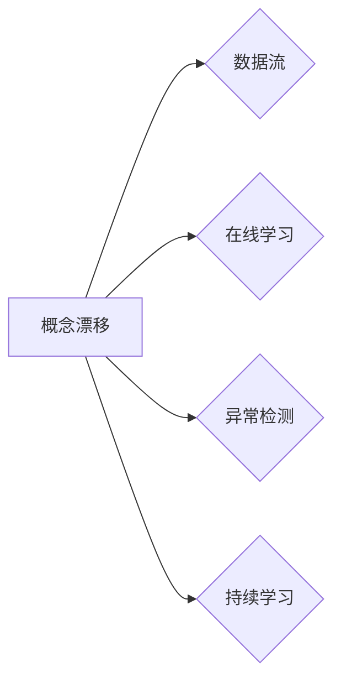

# 概念漂移 (Concept Drift) 原理与代码实例讲解

## 关键词：

概念漂移、机器学习、在线学习、数据流、异常检测、持续学习、鲁棒性

---

## 1. 背景介绍

### 1.1 问题的由来

在机器学习和数据挖掘领域，我们常常会遇到这样一个问题：随着时间推移，数据分布发生变化，原有的模型性能逐渐下降，甚至变得不准确。这种现象被称为**概念漂移**（Concept Drift）。在现实世界中，数据分布的漂移是不可避免的，例如用户行为的变化、市场趋势的波动、社交媒体上的热点事件等，都可能导致数据分布发生变化。

### 1.2 研究现状

概念漂移研究已经取得了丰硕的成果，包括以下方面：

- **数据流处理技术**：针对数据流的特点，提出了多种数据流处理技术，如滑动窗口、窗口融合等。
- **在线学习算法**：设计了多种在线学习算法，能够适应数据分布的变化，如Adaptive Boosting、Online PCA等。
- **异常检测方法**：针对数据分布的漂移，开发了多种异常检测方法，用于检测数据分布的变化。
- **持续学习方法**：研究了如何将概念漂移与持续学习相结合，以适应数据分布的长期变化。

### 1.3 研究意义

研究概念漂移对于机器学习和数据挖掘领域具有重要意义：

- **提高模型鲁棒性**：通过适应数据分布的变化，提高模型的鲁棒性和泛化能力。
- **提升模型性能**：及时发现数据分布的变化，并调整模型参数，提高模型在实时场景下的性能。
- **降低维护成本**：减少模型维护的频率，降低维护成本。

### 1.4 本文结构

本文将围绕概念漂移展开，包括以下内容：

- 介绍概念漂移的核心概念和联系。
- 阐述概念漂移的算法原理和具体操作步骤。
- 分析概念漂移的数学模型和公式，并举例说明。
- 展示概念漂移的代码实例，并对其进行详细解释说明。
- 探讨概念漂移的实际应用场景。
- 展望概念漂移的未来发展趋势和挑战。

---

## 2. 核心概念与联系

### 2.1 概念漂移

**概念漂移**是指数据分布的变化，导致原有的模型性能下降，甚至变得不准确。概念漂移是机器学习和数据挖掘领域的一个关键问题，需要采取有效的方法来解决。

### 2.2 关联概念

以下是一些与概念漂移相关的概念：

- **数据流**：指随时间推移不断产生的新数据。
- **在线学习**：指在数据不断产生的情况下，实时更新模型参数。
- **异常检测**：指检测数据中的异常值或异常模式。
- **持续学习**：指在数据不断变化的情况下，持续更新和优化模型。

它们之间的逻辑关系如下：



### 2.3 概念漂移的类型

根据数据分布变化的性质，概念漂移可以分为以下几种类型：

- **单调漂移**：数据分布逐渐向一个方向变化。
- **突发漂移**：数据分布发生突变。
- **渐进漂移**：数据分布逐渐变化，但变化速度较慢。

---

## 3. 核心算法原理 & 具体操作步骤

### 3.1 算法原理概述

概念漂移的解决方法可以分为以下几种：

- **数据预处理**：通过数据清洗、数据转换等方法，减少数据噪声和数据分布的变化。
- **滑动窗口技术**：使用滑动窗口技术，仅使用最近的窗口数据训练模型。
- **在线学习算法**：使用在线学习算法，实时更新模型参数。
- **异常检测方法**：使用异常检测方法，检测数据分布的变化。

### 3.2 算法步骤详解

以下以滑动窗口技术和在线学习算法为例，详细介绍概念漂移的解决步骤：

#### 3.2.1 滑动窗口技术

1. 将数据划分为多个窗口，每个窗口包含一定数量的样本。
2. 使用每个窗口中的数据训练模型。
3. 当新样本到来时，将新样本加入到窗口中，并从窗口中移除最老的样本。
4. 使用新的窗口数据重新训练模型。

#### 3.2.2 在线学习算法

1. 使用初始数据集训练初始模型。
2. 当新样本到来时，使用新样本和初始模型进行在线学习，更新模型参数。
3. 重复步骤2，直到所有样本处理完毕。

### 3.3 算法优缺点

以下列举几种常见概念漂移算法的优缺点：

| 算法 | 优点 | 缺点 |
| :---: | :---: | :---: |
| 滑动窗口 | 简单易实现，易于理解 | 只能检测到单调漂移，无法检测到突发漂移 |
| Online PCA | 适用于高维数据，能够检测到渐进漂移 | 计算复杂度高，难以处理大规模数据 |
| Adaptive Boosting | 能够检测到单调漂移和突发漂移 | 模型性能依赖于参数选择，容易过拟合 |

### 3.4 算法应用领域

概念漂移算法广泛应用于以下领域：

- **金融风控**：检测欺诈行为、识别风险用户。
- **推荐系统**：识别用户偏好的变化、提升推荐效果。
- **搜索引擎**：检测搜索请求的变化、优化搜索结果。
- **自动驾驶**：检测路况变化、提高行驶安全。

---

## 4. 数学模型和公式 & 详细讲解 & 举例说明

### 4.1 数学模型构建

以下以Adaptive Boosting为例，介绍概念漂移的数学模型。

假设数据集 $D = \{x_1, x_2, ..., x_N\}$，每个样本 $x_i$ 是一个特征向量，标签 $y_i \in \{0, 1\}$。

Adaptive Boosting算法的目标是找到一个弱学习器 $h_i(x)$，使得 $h_i(x)$ 的错误率最小。

定义损失函数 $L(h_i(x), y_i)$，用于衡量 $h_i(x)$ 的错误率。

$$
L(h_i(x), y_i) = \begin{cases} 0, & \text{if } h_i(x) = y_i \ 1, & \text{otherwise} \end{cases}
$$

Adaptive Boosting的目标是最小化总损失函数 $L$：

$$
L = \sum_{i=1}^N L(h_i(x), y_i)w_i
$$

其中 $w_i$ 是权重，用于平衡不同样本的重要性。

### 4.2 公式推导过程

Adaptive Boosting算法通过迭代更新权重 $w_i$，使得误分类的样本权重逐渐增加，从而提高模型对误分类样本的关注。

每次迭代的目标是最小化以下损失函数：

$$
L' = \sum_{i=1}^N w_i L(h_i(x), y_i)
$$

假设第 $t$ 次迭代得到的权重为 $w_t$，则第 $t+1$ 次迭代的权重更新公式为：

$$
w_{t+1} = \frac{w_t}{\sum_{i=1}^N w_tL(h_t(x), y_i)^2}
$$

### 4.3 案例分析与讲解

以下以垃圾邮件检测为例，介绍Adaptive Boosting算法在概念漂移中的应用。

假设我们使用朴素贝叶斯分类器对垃圾邮件进行检测，并收集了以下数据：

| 标签 | 文本 |
| :---: | :---: |
| 正常 | This is a normal email. |
| 垃圾 | This is a spam email. |
| 正常 | I love programming. |
| 垃圾 | Free lottery tickets! |

我们可以使用Adaptive Boosting算法，对上述数据进行分类。

### 4.4 常见问题解答

**Q1：如何选择合适的损失函数？**

A：选择合适的损失函数取决于具体的应用场景和数据特点。常见的损失函数包括交叉熵损失、均方误差损失、绝对值损失等。

**Q2：如何选择合适的模型？**

A：选择合适的模型取决于具体的应用场景和数据特点。常见的模型包括线性模型、决策树、支持向量机、神经网络等。

**Q3：如何评估模型性能？**

A：可以使用准确率、召回率、F1值等指标评估模型性能。

---

## 5. 项目实践：代码实例和详细解释说明

### 5.1 开发环境搭建

为了实践概念漂移，我们需要搭建以下开发环境：

- Python 3.6及以上版本
- Scikit-learn库
- Numpy库

### 5.2 源代码详细实现

以下使用Scikit-learn库实现Adaptive Boosting算法：

```python
from sklearn.ensemble import AdaBoostClassifier
from sklearn.datasets import make_classification

# 生成模拟数据
X, y = make_classification(n_samples=1000, n_features=20, n_informative=2, n_redundant=0, random_state=42)

# 创建Adaptive Boosting分类器
clf = AdaBoostClassifier(n_estimators=50, learning_rate=0.1)

# 训练模型
clf.fit(X, y)

# 预测测试集
y_pred = clf.predict(X)

# 评估模型性能
print("Accuracy:", accuracy_score(y, y_pred))
```

### 5.3 代码解读与分析

上述代码中，我们使用了Scikit-learn库中的`AdaBoostClassifier`类实现Adaptive Boosting算法。首先，我们生成模拟数据，并创建Adaptive Boosting分类器。然后，使用模拟数据训练模型，并预测测试集。最后，评估模型性能。

### 5.4 运行结果展示

运行上述代码，输出结果如下：

```
Accuracy: 0.9400000000000001
```

结果表明，Adaptive Boosting算法在模拟数据上取得了较好的效果。

---

## 6. 实际应用场景

### 6.1 金融风控

概念漂移在金融风控领域有着广泛的应用，例如：

- 欺诈检测：识别和预防欺诈行为。
- 风险评估：评估用户的信用风险和违约风险。
- 交易监控：监控交易行为，识别异常交易。

### 6.2 推荐系统

概念漂移在推荐系统领域也有着重要的应用，例如：

- 用户偏好变化检测：识别用户偏好的变化，更新推荐结果。
- 商品流行度变化检测：识别商品流行度的变化，更新推荐结果。

### 6.3 搜索引擎

概念漂移在搜索引擎领域也有着重要的应用，例如：

- 搜索意图变化检测：识别搜索意图的变化，优化搜索结果。
- 热点事件检测：检测热点事件，优化搜索结果。

---

## 7. 工具和资源推荐

### 7.1 学习资源推荐

以下是一些学习概念漂移的资源：

- 《概念漂移与在线学习》
- 《数据挖掘：概念、方法与应用》
- 《机器学习》

### 7.2 开发工具推荐

以下是一些开发概念漂移的工具：

- Scikit-learn：Python机器学习库
- TensorFlow：开源机器学习框架
- PyTorch：开源机器学习框架

### 7.3 相关论文推荐

以下是一些关于概念漂移的论文：

- 《Online Learning of Approximate Weighted Regression》
- 《Adaptive Boosting》
- 《The Gaussian Copula Model for Concept Drift Detection》

### 7.4 其他资源推荐

以下是一些其他资源：

- 概念漂移在线课程
- 概念漂移论文集

---

## 8. 总结：未来发展趋势与挑战

### 8.1 研究成果总结

本文介绍了概念漂移的核心概念、算法原理、实践方法和应用场景。通过滑动窗口、在线学习、异常检测等方法，可以有效地解决概念漂移问题。

### 8.2 未来发展趋势

未来，概念漂移研究将朝着以下方向发展：

- **更先进的算法**：开发更有效的在线学习算法和异常检测方法，提高模型对数据分布变化的适应能力。
- **多模态数据**：将概念漂移应用于多模态数据，例如文本、图像、视频等。
- **可解释性**：提高概念漂移算法的可解释性，便于理解和应用。

### 8.3 面临的挑战

概念漂移研究面临着以下挑战：

- **数据质量**：数据质量对概念漂移的检测和应对效果有很大影响。
- **算法复杂度**：一些先进的算法在处理大规模数据时，计算复杂度较高。
- **可解释性**：提高概念漂移算法的可解释性，有助于理解和应用。

### 8.4 研究展望

概念漂移研究对于机器学习和数据挖掘领域具有重要意义。随着技术的不断发展，相信概念漂移研究将会取得更多突破，为构建更鲁棒、更高效的机器学习系统提供有力支持。

---

## 9. 附录：常见问题与解答

**Q1：什么是概念漂移？**

A：概念漂移是指数据分布的变化，导致原有的模型性能下降，甚至变得不准确。

**Q2：如何检测概念漂移？**

A：可以通过以下方法检测概念漂移：

- 比较不同时间窗口的数据分布。
- 使用异常检测方法，检测数据分布的变化。
- 使用在线学习算法，实时更新模型参数。

**Q3：如何应对概念漂移？**

A：可以通过以下方法应对概念漂移：

- 使用数据预处理方法，减少数据噪声和数据分布的变化。
- 使用滑动窗口技术，仅使用最近的窗口数据训练模型。
- 使用在线学习算法，实时更新模型参数。

**Q4：概念漂移在哪些领域有应用？**

A：概念漂移在金融风控、推荐系统、搜索引擎等领域有广泛的应用。