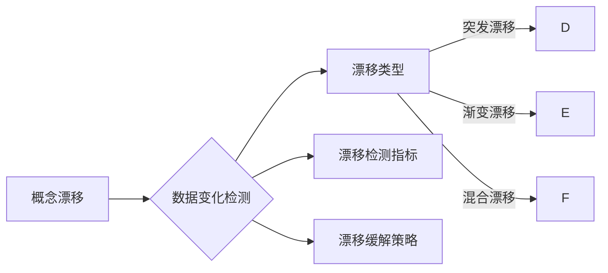

# 概念漂移与数据变化检测原理与代码实战案例讲解

作者：禅与计算机程序设计艺术 / Zen and the Art of Computer Programming

## 1. 背景介绍
### 1.1 问题的由来

随着数据驱动决策在各个领域的广泛应用，数据质量对于算法模型的性能至关重要。然而，现实世界中数据往往面临一个严峻挑战——**数据变化**。数据变化是指数据分布随着时间推移而发生的缓慢变化，这种变化可能来自于数据生成过程的变化、数据采集环境的改变、或者是数据标注的主观性等因素。

当数据发生变化时，原有的模型可能无法准确预测新数据，导致性能下降，甚至出现错误。为了确保模型的鲁棒性和适应性，我们需要对数据进行持续监控，及时发现数据变化，并采取相应措施。这就引出了概念漂移（Concept Drift）与数据变化检测（Change Detection）两大研究领域。

### 1.2 研究现状

概念漂移与数据变化检测的研究已经取得了长足的进步，涌现出许多有效的方法和技术。主要研究方向包括：

- **基于统计的方法**：通过计算统计量（如均值、方差、分布等）来检测数据变化。
- **基于模型的方法**：使用监督学习、无监督学习或强化学习等模型来检测数据变化。
- **基于聚类的方法**：将数据划分为不同的聚类，通过聚类中心的漂移来检测数据变化。
- **基于距离度的方法**：计算数据之间的距离，通过距离的变化来检测数据变化。

### 1.3 研究意义

研究概念漂移与数据变化检测对于以下几个领域具有重要意义：

- **金融风控**：及时发现异常交易行为，防止金融风险。
- **网络安全**：检测网络攻击和异常流量，保障网络安全。
- **智能交通**：检测交通流量变化，优化交通管理。
- **智能推荐**：及时发现用户兴趣变化，提高推荐系统效果。

### 1.4 本文结构

本文将详细介绍概念漂移与数据变化检测的原理、方法和实践案例。内容安排如下：

- 第2部分，介绍核心概念与联系。
- 第3部分，讲解核心算法原理和具体操作步骤。
- 第4部分，介绍数学模型和公式，并结合实例进行讲解。
- 第5部分，给出代码实战案例，并对关键代码进行解读。
- 第6部分，探讨实际应用场景和未来应用展望。
- 第7部分，推荐相关学习资源、开发工具和参考文献。
- 第8部分，总结研究成果，展望未来发展趋势与挑战。
- 第9部分，提供常见问题与解答。

## 2. 核心概念与联系

为更好地理解概念漂移与数据变化检测，本节将介绍几个核心概念：

- **概念漂移**：指数据分布随着时间推移而发生的缓慢变化，导致模型性能下降。
- **数据变化检测**：指通过统计或算法方法，发现数据分布发生显著变化的过程。
- **漂移类型**：根据数据变化的性质，将漂移分为突发漂移、渐变漂移和混合漂移。
- **漂移检测指标**：用于衡量数据变化程度的指标，如漂移度、漂移距离等。
- **漂移缓解策略**：用于缓解数据变化对模型性能影响的策略，如数据重采样、模型重训练等。

这些概念的逻辑关系如下所示：



可以看出，概念漂移是数据变化检测的对象，数据变化检测的方法和指标用于发现和衡量漂移程度，而漂移缓解策略则用于减轻漂移对模型性能的影响。

## 3. 核心算法原理 & 具体操作步骤
### 3.1 算法原理概述

概念漂移与数据变化检测的算法原理主要包括以下几种：

- **基于统计的方法**：通过计算统计量来检测数据变化，如均值、方差、分布等。
- **基于模型的方法**：使用监督学习、无监督学习或强化学习等模型来检测数据变化。
- **基于聚类的方法**：将数据划分为不同的聚类，通过聚类中心的漂移来检测数据变化。
- **基于距离度的方法**：计算数据之间的距离，通过距离的变化来检测数据变化。

### 3.2 算法步骤详解

以下以基于统计的方法为例，介绍数据变化检测的具体操作步骤：

**Step 1：选择统计量**

根据数据特点选择合适的统计量，如均值、方差、分布等。

**Step 2：计算统计量**

对原始数据进行统计量计算，得到统计量值。

**Step 3：设置阈值**

根据统计量变化对模型性能的影响，设置统计量变化的阈值。

**Step 4：检测数据变化**

将新数据与原始数据进行比较，计算统计量变化量，判断是否超过阈值。

**Step 5：采取行动**

如果检测到数据变化，采取相应措施，如数据清洗、模型重训练等。

### 3.3 算法优缺点

基于统计的方法具有以下优点：

- 简单易实现，计算效率高。
- 对数据分布变化敏感。

但该方法也存在以下缺点：

- 对异常值敏感。
- 难以检测渐变漂移。

### 3.4 算法应用领域

基于统计的方法适用于以下应用领域：

- 数据质量监控。
- 模型性能评估。
- 异常检测。

## 4. 数学模型和公式 & 详细讲解 & 举例说明
### 4.1 数学模型构建

以下以均值漂移检测为例，介绍数据变化检测的数学模型。

假设原始数据集为 $\mathcal{D} = \{x_1, x_2, ..., x_n\}$，新数据集为 $\mathcal{D}' = \{x_1', x_2', ..., x_m'\}$，其中 $x_i, x_i' \in \mathbb{R}^d$。

原始数据集的均值向量为 $\mu$，新数据集的均值向量为 $\mu'$。

$$
\mu = \frac{1}{n} \sum_{i=1}^n x_i
$$

$$
\mu' = \frac{1}{m} \sum_{i=1}^m x_i'
$$

假设数据变化阈值为 $\epsilon$，则均值漂移检测的数学模型为：

$$
d(\mu, \mu') = \sqrt{\sum_{i=1}^d (\mu_i - \mu'_i)^2} > \epsilon
$$

其中 $d(\mu, \mu')$ 为均值向量的欧几里得距离。

### 4.2 公式推导过程

均值的推导过程如下：

$$
\mu = \frac{1}{n} \sum_{i=1}^n x_i = \frac{1}{n} \left(\sum_{i=1}^n x_{1i}, \sum_{i=1}^n x_{2i}, ..., \sum_{i=1}^n x_{di}\right)
$$

其中 $x_{1i}, x_{2i}, ..., x_{di}$ 分别为第 $i$ 个样本的第 $1$ 维、第 $2$ 维、...、第 $d$ 维。

### 4.3 案例分析与讲解

以下以实际案例说明均值漂移检测的应用。

假设我们有以下原始数据集和新数据集：

```
原始数据集:
[1, 2, 3, 4, 5, 6, 7, 8, 9, 10]

新数据集:
[2, 3, 4, 5, 6, 7, 8, 9, 10, 11]
```

计算原始数据集和新数据集的均值：

```
原始数据集均值: 5.5
新数据集均值: 6.5
```

计算均值向量的欧几里得距离：

```
d(5.5, 6.5) = \sqrt{(5.5 - 6.5)^2} = 1
```

由于距离值大于设定的阈值 $\epsilon = 1$，我们可以判断新数据集与原始数据集发生了显著变化。

### 4.4 常见问题解答

**Q1：如何设置数据变化阈值 $\epsilon$？**

A：数据变化阈值 $\epsilon$ 的设置需要根据具体应用场景和业务需求来确定。通常，可以根据历史数据变化情况或模型性能指标的变化来确定阈值。

**Q2：均值漂移检测适用于哪些应用场景？**

A：均值漂移检测适用于以下应用场景：

- 数据质量监控。
- 模型性能评估。
- 异常检测。

**Q3：均值漂移检测的局限性是什么？**

A：均值漂移检测的局限性包括：

- 对异常值敏感。
- 难以检测渐变漂移。

## 5. 项目实践：代码实例和详细解释说明
### 5.1 开发环境搭建

在进行数据变化检测项目实践前，我们需要搭建以下开发环境：

1. 安装Python 3.6及以上版本。
2. 安装NumPy、Pandas、Scikit-learn等Python库。

### 5.2 源代码详细实现

以下是一个使用Python实现均值漂移检测的代码示例：

```python
import numpy as np
from sklearn.metrics.pairwise import euclidean_distances

def mean_shift_detection(X, X_new, epsilon=1):
    """
    均值漂移检测
    :param X: 原始数据集
    :param X_new: 新数据集
    :param epsilon: 数据变化阈值
    :return: 是否发生数据变化
    """
    mu = np.mean(X, axis=0)
    mu_new = np.mean(X_new, axis=0)
    distance = np.linalg.norm(mu - mu_new)
    return distance > epsilon

# 示例数据
X = np.array([[1, 2], [2, 3], [3, 4], [4, 5], [5, 6], [6, 7], [7, 8], [8, 9], [9, 10], [10, 11]])
X_new = np.array([[2, 3], [3, 4], [4, 5], [5, 6], [6, 7], [7, 8], [8, 9], [9, 10], [10, 11], [11, 12]])

# 检测数据变化
result = mean_shift_detection(X, X_new, epsilon=1)
print("数据变化:", result)
```

### 5.3 代码解读与分析

以上代码首先导入NumPy和Scikit-learn库。`mean_shift_detection` 函数实现均值漂移检测算法，接受原始数据集 `X`、新数据集 `X_new` 和数据变化阈值 `epsilon` 作为输入，返回是否发生数据变化的布尔值。函数内部计算原始数据集和新数据集的均值，计算均值向量之间的欧几里得距离，并与阈值进行比较。

在示例数据中，原始数据集和新数据集的均值分别为 `[5.5, 5.5]` 和 `[6.5, 6.5]`，距离为 `1`，大于阈值 `1`，因此输出为 `True`，表示发生了数据变化。

### 5.4 运行结果展示

运行上述代码，输出结果为：

```
数据变化: True
```

说明新数据集与原始数据集发生了显著变化。

## 6. 实际应用场景
### 6.1 金融风控

在金融风控领域，数据变化检测可以用于检测异常交易行为，防止金融风险。例如，银行可以通过对交易数据进行实时监控，发现交易金额、交易频率等特征发生显著变化，从而判断是否存在欺诈行为。

### 6.2 网络安全

在网络安全领域，数据变化检测可以用于检测网络攻击和异常流量，保障网络安全。例如，网络安全设备可以通过对网络流量数据进行实时监控，发现流量模式、流量特征等发生显著变化，从而判断是否存在入侵行为。

### 6.3 智能交通

在智能交通领域，数据变化检测可以用于检测交通流量变化，优化交通管理。例如，交通管理部门可以通过对交通流量数据进行实时监控，发现交通流量、交通模式等发生显著变化，从而调整交通信号灯、优化交通路线。

### 6.4 未来应用展望

随着人工智能技术的不断发展，数据变化检测将在更多领域得到应用。以下是一些未来应用场景：

- 智能医疗：检测疾病诊断数据变化，辅助医生进行诊断和治疗。
- 智能制造：检测生产过程数据变化，优化生产流程和设备维护。
- 智能家居：检测家庭环境数据变化，提供更加智能化的家居体验。

## 7. 工具和资源推荐
### 7.1 学习资源推荐

以下是一些学习资源，帮助开发者了解概念漂移与数据变化检测：

- 《统计学习基础》
- 《机器学习》
- 《数据科学入门》
- 《Python数据分析》
- 《Scikit-learn实战》

### 7.2 开发工具推荐

以下是一些开发工具，帮助开发者实现数据变化检测：

- Python编程语言
- NumPy库
- Pandas库
- Scikit-learn库
- Jupyter Notebook

### 7.3 相关论文推荐

以下是一些相关论文，介绍概念漂移与数据变化检测的理论和方法：

- "A Survey on Concept Drift and Outlier Detection in Data Streams"
- "A Comprehensive Survey of Change Detection"
- "Statistical Change Detection: A Review"
- "Concept Drift in Time Series Data"
- "An Overview of Outlier Detection in Data Streams"

### 7.4 其他资源推荐

以下是一些其他资源，帮助开发者了解数据变化检测的最新进展和应用案例：

- arXiv论文预印本
- KDD、ICDM等顶级数据挖掘会议
- 机器之心、AI科技大观等技术博客
- 各大开源数据集和工具库

## 8. 总结：未来发展趋势与挑战
### 8.1 研究成果总结

本文对概念漂移与数据变化检测的原理、方法和实践案例进行了详细讲解。通过对核心概念、算法原理、数学模型和代码实战的分析，读者可以全面了解该领域的研究现状和发展趋势。

### 8.2 未来发展趋势

未来，概念漂移与数据变化检测将呈现以下发展趋势：

- 融合多源异构数据：将文本、图像、语音等多源异构数据整合到数据变化检测中，提高检测的全面性和准确性。
- 深度学习模型的应用：利用深度学习模型进行特征提取和变化检测，提高检测的鲁棒性和泛化能力。
- 自适应变化检测：根据数据变化的特点，动态调整检测方法和参数，提高检测的效率和适应性。
- 可解释性变化检测：提高变化检测的可解释性，帮助用户理解变化的原因和影响。

### 8.3 面临的挑战

尽管概念漂移与数据变化检测取得了长足的进步，但仍面临以下挑战：

- 数据质量：数据质量对变化检测的准确性有重要影响，如何保证数据质量是一个挑战。
- 模型复杂度：深度学习模型具有较高的复杂度，如何优化模型复杂度和计算效率是一个挑战。
- 可解释性：如何提高变化检测的可解释性，帮助用户理解变化的原因和影响是一个挑战。

### 8.4 研究展望

未来，概念漂移与数据变化检测的研究将朝着以下方向发展：

- 开发更加高效、准确的检测方法。
- 提高检测的可解释性。
- 将变化检测技术应用于更多领域，解决实际问题。

相信在研究者、工程师和用户的共同努力下，概念漂移与数据变化检测技术必将取得更大的突破，为构建更加智能、可靠、安全的系统贡献力量。

## 9. 附录：常见问题与解答

**Q1：什么是概念漂移？**

A：概念漂移是指数据分布随着时间推移而发生的缓慢变化，导致模型性能下降。

**Q2：什么是数据变化检测？**

A：数据变化检测是指通过统计或算法方法，发现数据分布发生显著变化的过程。

**Q3：如何设置数据变化阈值？**

A：数据变化阈值的设置需要根据具体应用场景和业务需求来确定。通常，可以根据历史数据变化情况或模型性能指标的变化来确定阈值。

**Q4：均值漂移检测适用于哪些应用场景？**

A：均值漂移检测适用于数据质量监控、模型性能评估和异常检测等应用场景。

**Q5：均值漂移检测的局限性是什么？**

A：均值漂移检测的局限性包括对异常值敏感、难以检测渐变漂移等。

**Q6：如何解决数据变化对模型性能的影响？**

A：解决数据变化对模型性能的影响，可以通过以下方法：

- 数据重采样：对数据进行重采样，降低数据变化的影响。
- 模型重训练：重新训练模型，使其适应新的数据分布。
- 模型融合：将多个模型进行融合，提高模型的鲁棒性。

**Q7：如何提高变化检测的可解释性？**

A：提高变化检测的可解释性，可以通过以下方法：

- 解释模型决策：分析模型决策的原因和依据。
- 可视化分析：将变化检测过程可视化，帮助用户理解变化的原因和影响。
- 专家知识：结合专家知识，解释变化的原因和影响。

通过解决这些常见问题，读者可以更好地理解概念漂移与数据变化检测，并将其应用于实际项目中。

---

作者：禅与计算机程序设计艺术 / Zen and the Art of Computer Programming