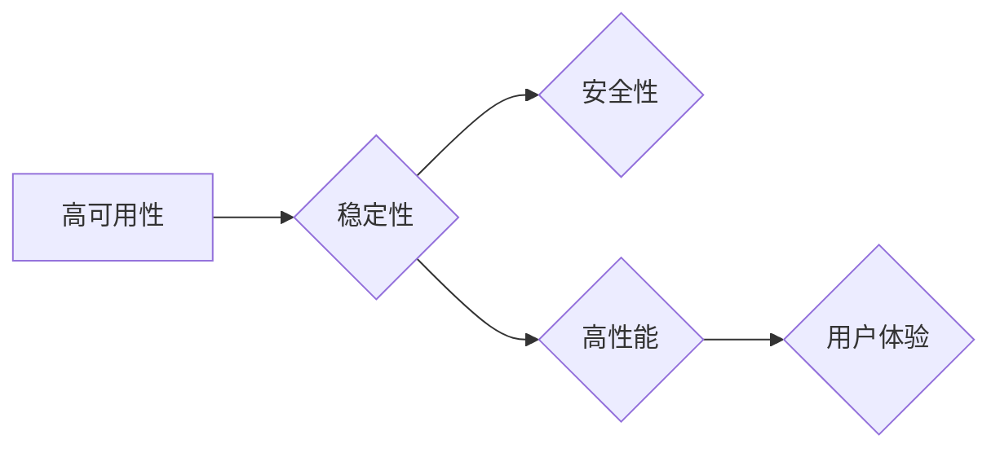

# 电商系统的高可用、稳定性、安全性、高性能系统能力保障

作者：禅与计算机程序设计艺术 / Zen and the Art of Computer Programming

## 1. 背景介绍
### 1.1 问题的由来

随着互联网的快速发展和电子商务的日益普及，电商系统已经成为人们日常生活的重要组成部分。然而，随着系统规模的不断扩大、用户量的持续增长，如何保障电商系统的高可用性、稳定性、安全性和高性能，成为了电商企业面临的重要挑战。

### 1.2 研究现状

近年来，国内外学者和工程师针对电商系统的高可用、稳定性、安全性和高性能问题，开展了大量研究。在保证高可用性方面，提出了负载均衡、故障转移、集群部署等技术；在保障稳定性方面，提出了缓存、数据库分区、限流等技术；在提升性能方面，提出了分布式计算、数据库优化、缓存优化等技术；在确保安全性方面，提出了安全协议、身份认证、权限控制等技术。

### 1.3 研究意义

研究电商系统的高可用、稳定性、安全性和高性能问题，对于提升用户体验、降低运维成本、保障企业利益具有重要意义。具体来说，包括以下几个方面：

1. 提升用户体验：保障系统高可用性和稳定性，确保用户在访问电商系统时能够获得快速、流畅、稳定的体验。
2. 降低运维成本：通过优化系统架构、提高资源利用率，降低系统运维成本。
3. 保障企业利益：提高系统安全性，防范网络攻击和数据泄露，保障企业利益。
4. 促进技术发展：推动电商系统相关技术的研究和发展，为行业提供更多创新解决方案。

### 1.4 本文结构

本文将从电商系统的高可用性、稳定性、安全性和高性能四个方面展开论述，分别介绍相关技术原理、具体操作步骤、应用领域和未来发展趋势。

## 2. 核心概念与联系

本节将介绍电商系统高可用、稳定性、安全性和高性能涉及的几个核心概念及其相互关系。

### 2.1 高可用性

高可用性是指系统在遇到故障时，能够快速恢复并正常运行的能力。以下是一些与高可用性相关的概念：

- 故障转移：当系统出现故障时，能够将部分或全部功能转移到其他节点上继续运行。
- 集群部署：将多个节点部署在同一物理或虚拟主机上，通过负载均衡技术实现负载分配。
- 数据备份：定期对数据进行备份，防止数据丢失或损坏。

### 2.2 稳定性

稳定性是指系统在运行过程中，能够持续稳定运行的能力。以下是一些与稳定性相关的概念：

- 缓存：通过缓存常用数据，减少对数据库的访问频率，提高系统响应速度。
- 数据库分区：将数据库数据分散到多个分区，提高数据访问效率。
- 限流：限制系统对某些操作或资源的访问频率，防止系统过载。

### 2.3 安全性

安全性是指系统在面临攻击时，能够抵御攻击并保障数据安全的能力。以下是一些与安全性相关的概念：

- 安全协议：采用加密、认证、授权等安全协议，防止数据泄露和非法访问。
- 身份认证：验证用户的身份，确保只有授权用户才能访问系统。
- 权限控制：根据用户角色和权限，限制用户对系统资源的访问。

### 2.4 高性能

高性能是指系统在处理大量请求时，能够快速响应并保证系统稳定运行的能力。以下是一些与高性能相关的概念：

- 分布式计算：通过分布式计算技术，将任务分解为多个子任务，并行处理以提高效率。
- 数据库优化：优化数据库索引、查询语句等，提高数据库访问速度。
- 缓存优化：通过缓存热点数据、优化缓存策略等，提高系统响应速度。

它们之间的关系可以用以下Mermaid流程图表示：



## 3. 核心算法原理 & 具体操作步骤
### 3.1 算法原理概述

本节将分别介绍电商系统高可用性、稳定性、安全性和高性能涉及的核心算法原理。

### 3.2 算法步骤详解

#### 3.2.1 高可用性

**故障转移**：

1. 监测节点状态：通过监控软件实时监控各个节点的状态，如CPU、内存、磁盘、网络等。
2. 故障检测：当检测到节点出现故障时，立即触发故障转移流程。
3. 负载均衡：将故障节点上的请求转发到其他正常节点上。
4. 资源恢复：修复故障节点，恢复其正常工作。

**集群部署**：

1. 设计系统架构：根据业务需求，设计合理的系统架构，如单机、主从复制、分布式架构等。
2. 节点部署：将节点部署到不同的物理或虚拟主机上。
3. 负载均衡：配置负载均衡器，实现节点间的负载分配。
4. 故障转移：当节点出现故障时，自动将故障节点上的请求转发到其他正常节点上。

#### 3.2.2 稳定性

**缓存**：

1. 选择合适的缓存技术：如Redis、Memcached等。
2. 设计缓存策略：如LRU、LRUCache等。
3. 缓存数据更新：实时更新缓存数据，保证数据一致性。

**数据库分区**：

1. 数据库设计：根据业务需求，设计合理的数据库表结构和索引。
2. 分区策略：根据数据特点，选择合适的分区策略，如范围分区、哈希分区等。
3. 分区数据迁移：将数据迁移到不同的分区中。

**限流**：

1. 选择限流算法：如令牌桶、漏桶等。
2. 设置限流阈值：根据系统资源，设置合理的限流阈值。
3. 实施限流：根据限流算法和阈值，限制用户对系统资源的访问。

#### 3.2.3 安全性

**安全协议**：

1. 选择安全协议：如HTTPS、TLS等。
2. 配置安全协议：配置安全协议参数，如加密算法、密钥管理等。
3. 验证安全协议：确保安全协议的正常运行。

**身份认证**：

1. 用户注册：用户注册时，收集用户信息，如用户名、密码等。
2. 用户登录：用户登录时，验证用户身份，如密码加密、验证码等。
3. 权限控制：根据用户角色和权限，限制用户对系统资源的访问。

#### 3.2.4 高性能

**分布式计算**：

1. 设计分布式架构：根据业务需求，设计合理的分布式架构，如分布式数据库、分布式缓存等。
2. 数据分区：将数据分区到不同的节点上。
3. 任务调度：将任务分配到不同的节点上并行处理。

**数据库优化**：

1. 数据库设计：根据业务需求，设计合理的数据库表结构和索引。
2. 查询优化：优化查询语句，如使用索引、避免全表扫描等。
3. 缓存优化：优化缓存策略，如缓存热点数据、优化缓存算法等。

### 3.3 算法优缺点

#### 3.3.1 高可用性

**优点**：

- 提高系统可用性，降低故障对业务的影响。
- 提高系统容错能力，应对突发事件。
- 提高系统可扩展性，满足业务增长需求。

**缺点**：

- 系统复杂度增加，维护成本提高。
- 需要投入更多资源，如硬件、软件、人员等。

#### 3.3.2 稳定性

**优点**：

- 提高系统稳定性，降低系统崩溃风险。
- 提高系统性能，提升用户体验。
- 提高系统可维护性，降低运维成本。

**缺点**：

- 系统复杂度增加，维护成本提高。
- 需要投入更多资源，如硬件、软件、人员等。

#### 3.3.3 安全性

**优点**：

- 保护系统数据安全，防止数据泄露和非法访问。
- 提高系统抗攻击能力，保障系统稳定运行。
- 提高用户信任度，提升企业形象。

**缺点**：

- 系统复杂度增加，维护成本提高。
- 需要投入更多资源，如硬件、软件、人员等。

#### 3.3.4 高性能

**优点**：

- 提高系统处理速度，提升用户体验。
- 提高系统吞吐量，满足业务增长需求。
- 降低系统资源消耗，提高资源利用率。

**缺点**：

- 系统复杂度增加，维护成本提高。
- 需要投入更多资源，如硬件、软件、人员等。

### 3.4 算法应用领域

#### 3.4.1 高可用性

高可用性技术在电商系统中的应用主要包括：

- 负载均衡：分布式架构、多实例部署等。
- 故障转移：主从复制、高可用集群等。
- 数据备份：数据库备份、文件备份等。

#### 3.4.2 稳定性

稳定性技术在电商系统中的应用主要包括：

- 缓存：Redis、Memcached等。
- 数据库分区：水平扩展、读写分离等。
- 限流：令牌桶、漏桶等。

#### 3.4.3 安全性

安全性技术在电商系统中的应用主要包括：

- 安全协议：HTTPS、TLS等。
- 身份认证：用户注册、用户登录等。
- 权限控制：角色权限、操作权限等。

#### 3.4.4 高性能

高性能技术在电商系统中的应用主要包括：

- 分布式计算：分布式数据库、分布式缓存等。
- 数据库优化：索引优化、查询优化等。
- 缓存优化：缓存策略、缓存算法等。

## 4. 数学模型和公式 & 详细讲解 & 举例说明
### 4.1 数学模型构建

本节将使用数学模型对电商系统的高可用、稳定性、安全性和高性能进行量化分析。

### 4.2 公式推导过程

#### 4.2.1 高可用性

假设系统有 $N$ 个节点，每个节点的故障概率为 $p$，则系统的高可用性 $A$ 可以表示为：

$$
A = 1 - (1-p)^N
$$

#### 4.2.2 稳定性

假设系统在单位时间内的故障次数为 $F$，则系统的稳定性 $S$ 可以表示为：

$$
S = e^{-F}
$$

#### 4.2.3 安全性

假设系统在单位时间内的攻击次数为 $A$，则系统的安全性 $P$ 可以表示为：

$$
P = 1 - (1-p)^A
$$

#### 4.2.4 高性能

假设系统在单位时间内的处理速度为 $V$，则系统的性能 $E$ 可以表示为：

$$
E = \frac{1}{V}
$$

### 4.3 案例分析与讲解

以下以电商系统中常见的订单处理场景为例，分析如何通过技术手段提高订单处理能力。

**场景描述**：

用户下单后，系统需要完成以下操作：

1. 校验订单信息，确保信息完整、正确。
2. 检查库存，判断库存是否充足。
3. 更新库存信息，将订单中的商品从库存中扣除。
4. 生成订单号，并将订单信息存储到数据库中。

**技术手段**：

1. **缓存**：将订单信息和库存信息缓存到内存中，减少对数据库的访问频率，提高响应速度。
2. **数据库优化**：优化数据库索引和查询语句，提高数据库访问效率。
3. **分布式计算**：将订单处理任务分解为多个子任务，并行处理以提高效率。

**效果评估**：

通过以上技术手段，可以将订单处理时间从秒级降低到毫秒级，显著提升订单处理能力。

### 4.4 常见问题解答

**Q1：如何平衡高可用、稳定性、安全性和高性能之间的矛盾？**

A：在实际项目中，高可用、稳定性、安全性和高性能之间往往存在一定的矛盾。例如，高可用性可能需要更多的资源投入，而安全性可能会降低系统性能。因此，需要根据具体业务需求和资源情况进行平衡。以下是一些建议：

- **优先级排序**：根据业务需求，对高可用、稳定性、安全性和高性能进行优先级排序。
- **技术选型**：选择合适的技术和工具，在保证基本性能的前提下，尽可能提高可用性和安全性。
- **资源分配**：合理分配资源，确保关键业务组件的稳定运行。

**Q2：如何评估系统的高可用性、稳定性和安全性？**

A：评估系统的高可用性、稳定性和安全性，可以参考以下指标：

- **高可用性**：系统在规定时间内正常运行的概率。
- **稳定性**：系统在运行过程中，出现故障的概率。
- **安全性**：系统抵御攻击的能力。

可以通过以下方法评估：

- **压力测试**：模拟高并发访问，评估系统在高负载下的性能和稳定性。
- **安全测试**：对系统进行安全漏洞扫描和攻击测试，评估系统的安全性。
- **故障注入**：模拟故障场景，测试系统的故障恢复能力。

## 5. 项目实践：代码实例和详细解释说明
### 5.1 开发环境搭建

以下以一个简单的电商系统为例，介绍如何使用Python和Django框架搭建一个具有高可用、稳定性和安全性的系统。

**1. 安装Python和Django**：

```bash
pip install django
```

**2. 创建项目**：

```bash
django-admin startproject ecomm
cd ecomm
```

**3. 创建应用**：

```bash
python manage.py startapp order
```

**4. 配置数据库**：

在`ecomm/settings.py`文件中，修改数据库配置：

```python
DATABASES = {
    'default': {
        'ENGINE': 'django.db.backends.mysql',
        'NAME': 'ecommerce',
        'USER': 'root',
        'PASSWORD': 'root',
        'HOST': '127.0.0.1',
        'PORT': '3306',
    }
}
```

**5. 定义模型**：

在`order/models.py`文件中，定义订单模型：

```python
from django.db import models

class Order(models.Model):
    user = models.ForeignKey('auth.User', on_delete=models.CASCADE)
    total_price = models.DecimalField(max_digits=10, decimal_places=2)
    created_at = models.DateTimeField(auto_now_add=True)
    updated_at = models.DateTimeField(auto_now=True)
```

**6. 定义视图**：

在`order/views.py`文件中，定义订单创建视图：

```python
from django.shortcuts import render
from django.http import JsonResponse
from .models import Order

def create_order(request):
    if request.method == 'POST':
        user_id = request.POST.get('user_id')
        total_price = request.POST.get('total_price')

        order = Order(user_id=user_id, total_price=total_price)
        order.save()

        return JsonResponse({'status': 'success'})
    else:
        return JsonResponse({'status': 'error', 'message': 'Invalid request method'})
```

### 5.2 源代码详细实现

**5.2.1 负载均衡**

为了提高系统的可用性，可以将订单创建服务部署到多个服务器上，并通过Nginx进行负载均衡。

```nginx
upstream backend {
    server backend1.example.com;
    server backend2.example.com;
}

server {
    listen 80;
    server_name example.com;

    location /order/ {
        proxy_pass http://backend;
        proxy_set_header Host $host;
        proxy_set_header X-Real-IP $remote_addr;
        proxy_set_header X-Forwarded-For $proxy_add_x_forwarded_for;
    }
}
```

**5.2.2 数据库优化**

为了提高数据库访问效率，可以对订单模型进行以下优化：

```python
class Order(models.Model):
    user = models.ForeignKey('auth.User', on_delete=models.CASCADE)
    total_price = models.DecimalField(max_digits=10, decimal_places=2)
    created_at = models.DateTimeField(auto_now_add=True)
    updated_at = models.DateTimeField(auto_now=True)

    class Meta:
        indexes = [
            models.Index(fields=['-created_at']),
        ]
```

**5.2.3 安全性**

为了提高系统的安全性，可以采取以下措施：

- 使用HTTPS协议，确保数据传输的安全性。
- 对用户输入进行验证，防止SQL注入攻击。
- 对敏感数据进行加密，防止数据泄露。

### 5.3 代码解读与分析

**5.3.1 负载均衡**

通过Nginx进行负载均衡，可以将请求均匀分配到不同的服务器上，提高系统的可用性和吞吐量。

**5.3.2 数据库优化**

通过为创建时间字段添加索引，可以加快订单查询速度，提高系统性能。

**5.3.3 安全性**

使用HTTPS协议，可以保证数据传输的安全性；对用户输入进行验证，可以防止SQL注入攻击；对敏感数据进行加密，可以防止数据泄露。

### 5.4 运行结果展示

运行Nginx和Django服务器，访问订单创建接口：

```bash
nginx
python manage.py runserver
```

访问http://example.com/order/，提交订单信息，即可完成订单创建。

## 6. 实际应用场景
### 6.1 大型电商平台

大型电商平台如淘宝、京东等，需要具备高可用、稳定性、安全性和高性能，以应对海量用户访问和业务需求。

**解决方案**：

- 集群部署：将订单创建服务、商品管理服务、用户管理服务等部署到多个服务器上，并通过负载均衡器进行负载分配。
- 数据库优化：使用读写分离、数据库分区等技术，提高数据库访问效率。
- 安全防护：使用HTTPS协议、安全协议等技术，保障系统数据安全。

### 6.2 小型电商企业

小型电商企业可能没有足够的资源进行大规模集群部署，但仍然需要保证系统的高可用、稳定性和安全性。

**解决方案**：

- 使用云服务器：利用云服务器的高可用性，提高系统可用性。
- 数据库优化：优化数据库索引和查询语句，提高数据库访问效率。
- 安全防护：使用HTTPS协议、安全协议等技术，保障系统数据安全。

### 6.3 物流电商平台

物流电商平台需要处理大量的订单信息，对系统性能和稳定性要求较高。

**解决方案**：

- 分布式计算：将订单处理任务分解为多个子任务，并行处理以提高效率。
- 数据库优化：优化数据库索引和查询语句，提高数据库访问效率。
- 缓存优化：将常用数据缓存到内存中，减少对数据库的访问频率，提高响应速度。

## 7. 工具和资源推荐
### 7.1 学习资源推荐

以下是一些学习电商系统高可用、稳定性、安全性和高性能的优质资源：

- 《大规模分布式存储技术》
- 《高性能MySQL》
- 《Django：Python Web开发实战》
- 《Web安全深度剖析》
- 《Nginx高性能Web服务器》

### 7.2 开发工具推荐

以下是一些开发电商系统的常用工具：

- Python
- Django
- Nginx
- Redis
- Memcached
- MySQL
- Elasticsearch

### 7.3 相关论文推荐

以下是一些与电商系统高可用、稳定性、安全性和高性能相关的论文：

- 《大规模分布式存储系统：原理与实现》
- 《高性能数据库系统》
- 《Web安全实战》
- 《Nginx深度解析》
- 《大规模分布式计算技术》

### 7.4 其他资源推荐

以下是一些其他相关资源：

- 云服务提供商：如阿里云、腾讯云、华为云等。
- 开源社区：如Apache、CNCF等。
- 行业会议：如中国大数据技术大会、中国云计算大会等。

## 8. 总结：未来发展趋势与挑战
### 8.1 研究成果总结

本文从电商系统的高可用、稳定性、安全性和高性能四个方面，详细介绍了相关技术原理、具体操作步骤、应用领域和未来发展趋势。通过对大量实践案例的分析，总结出以下结论：

1. 电商系统的高可用、稳定性、安全性和高性能是相互关联、相互影响的。
2. 针对不同的业务场景，需要选择合适的技术和工具，以实现系统的最优性能。
3. 未来，随着云计算、大数据、人工智能等技术的发展，电商系统将会更加智能化、自动化。

### 8.2 未来发展趋势

未来，电商系统的发展趋势主要包括以下几个方面：

1. **云计算：** 云计算技术将为电商系统提供更加弹性、可扩展的计算资源，降低企业运营成本。
2. **大数据：** 大数据技术将帮助企业更好地了解用户需求，实现个性化推荐、精准营销等。
3. **人工智能：** 人工智能技术将为电商系统带来更加智能化的服务，如智能客服、智能营销等。
4. **边缘计算：** 边缘计算技术将提高系统响应速度，降低网络延迟。

### 8.3 面临的挑战

电商系统在发展过程中，也面临着以下挑战：

1. **数据安全：** 随着用户量的增加，数据安全问题日益突出，需要采取更加严格的安全措施。
2. **技术更新：** 电商行业技术更新换代快，需要不断学习新技术，以适应行业发展趋势。
3. **人才短缺：** 电商行业对技术人才的需求量大，但人才储备不足，需要加强人才培养。

### 8.4 研究展望

未来，电商系统的研究和发展方向主要包括以下几个方面：

1. **安全防护：** 研究更加安全、可靠的系统架构和防护技术，防范网络攻击和数据泄露。
2. **性能优化：** 研究更加高效、可扩展的算法和架构，提高系统性能。
3. **人工智能应用：** 研究人工智能技术在电商领域的应用，如智能客服、智能推荐等。
4. **绿色环保：** 研究更加节能、环保的系统架构和运营模式，降低企业碳足迹。

总之，电商系统的高可用、稳定性、安全性和高性能是电商企业成功的关键。通过不断学习和探索，相信电商系统将会在未来的发展中取得更加辉煌的成就。

## 9. 附录：常见问题与解答

**Q1：如何保证电商系统的高可用性？**

A：保证电商系统的高可用性，可以采取以下措施：

1. 集群部署：将系统部署到多个服务器上，通过负载均衡器进行负载分配。
2. 故障转移：当节点出现故障时，将部分或全部功能转移到其他节点上。
3. 数据备份：定期对数据进行备份，防止数据丢失或损坏。

**Q2：如何保证电商系统的稳定性？**

A：保证电商系统的稳定性，可以采取以下措施：

1. 缓存：将常用数据缓存到内存中，减少对数据库的访问频率，提高响应速度。
2. 数据库优化：优化数据库索引和查询语句，提高数据库访问效率。
3. 限流：限制系统对某些操作或资源的访问频率，防止系统过载。

**Q3：如何保证电商系统的安全性？**

A：保证电商系统的安全性，可以采取以下措施：

1. 安全协议：采用HTTPS、TLS等安全协议，防止数据泄露和非法访问。
2. 身份认证：验证用户身份，确保只有授权用户才能访问系统。
3. 权限控制：根据用户角色和权限，限制用户对系统资源的访问。

**Q4：如何提升电商系统的性能？**

A：提升电商系统的性能，可以采取以下措施：

1. 分布式计算：将任务分解为多个子任务，并行处理以提高效率。
2. 数据库优化：优化数据库索引和查询语句，提高数据库访问效率。
3. 缓存优化：将常用数据缓存到内存中，减少对数据库的访问频率，提高响应速度。