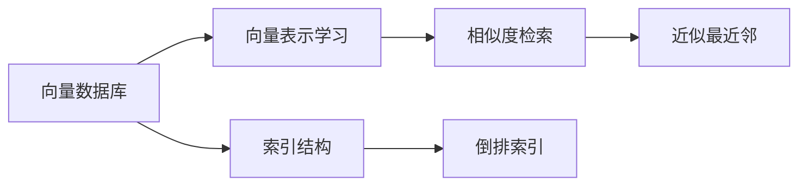

# 高效检索：构建基于向量数据库的高性能搜索引擎

> 关键词：向量数据库，搜索引擎，相似度检索，索引结构，倒排索引，向量搜索，近似最近邻

## 1. 背景介绍
### 1.1 问题的由来

随着互联网的迅猛发展，信息量的爆炸式增长给信息检索带来了前所未有的挑战。如何快速、准确地从海量数据中检索到用户所需的信息，成为了一个亟待解决的问题。传统的基于关键词的搜索引擎在处理文本数据时表现良好，但在处理图像、语音等多媒体数据时，由于其缺乏对语义的理解，往往难以满足用户的检索需求。

为了解决这一问题，向量数据库和基于向量搜索的搜索引擎应运而生。向量数据库将数据转换为向量形式，并利用向量空间模型进行相似度检索，从而实现高效、准确的搜索。

### 1.2 研究现状

近年来，向量数据库和基于向量搜索的搜索引擎技术取得了长足的进步，以下是一些重要的研究方向：

- 向量表示学习：研究如何将不同类型的数据转换为向量形式，使得向量空间中的数据具有良好的相似度表示。
- 索引结构优化：研究如何高效地构建和更新索引结构，以降低搜索成本。
- 相似度检索算法：研究如何快速准确地计算向量之间的相似度，并返回相似度最高的结果。
- 近似最近邻算法：研究如何高效地寻找与查询向量最相似的向量，以处理大规模数据集。

### 1.3 研究意义

向量数据库和基于向量搜索的搜索引擎技术在各个领域都有广泛的应用，以下是一些重要的应用场景：

- 图像和视频检索：快速准确地检索与用户查询图像或视频相似的图像或视频。
- 语音和音乐检索：快速准确地检索与用户查询语音或音乐相似的语音或音乐。
- 问答系统：根据用户的问题，快速准确地检索出相关的答案。
- 推荐系统：根据用户的兴趣和行为，推荐与用户最相似的内容。

### 1.4 本文结构

本文将分为以下几个部分：

- 介绍向量数据库和基于向量搜索的搜索引擎的核心概念和联系。
- 阐述向量数据库和基于向量搜索的搜索引擎的核心算法原理和具体操作步骤。
- 详细讲解向量数据库和基于向量搜索的搜索引擎的数学模型和公式，并举例说明。
- 给出向量数据库和基于向量搜索的搜索引擎的代码实现示例，并对关键代码进行解读。
- 探讨向量数据库和基于向量搜索的搜索引擎的实际应用场景。
- 推荐相关学习资源、开发工具和参考文献。
- 总结向量数据库和基于向量搜索的搜索引擎的未来发展趋势与挑战。

## 2. 核心概念与联系

为了更好地理解向量数据库和基于向量搜索的搜索引擎，本节将介绍几个密切相关的核心概念：

- 向量：将数据转换为向量形式，使得数据在向量空间中可以进行相似度计算。
- 向量表示学习：研究如何将不同类型的数据转换为向量形式，使得向量空间中的数据具有良好的相似度表示。
- 索引结构：用于高效地存储和检索数据的一种数据结构。
- 倒排索引：一种常见的索引结构，用于高效地检索与给定关键词相关的文档。
- 相似度检索：根据用户查询向量，返回与查询向量最相似的文档。
- 近似最近邻：在向量空间中寻找与查询向量最相似的向量，尤其是在处理大规模数据集时。

它们的逻辑关系如下图所示：



可以看出，向量数据库和基于向量搜索的搜索引擎的核心是向量表示学习和相似度检索。索引结构（如倒排索引）用于高效地存储和检索数据，近似最近邻算法用于处理大规模数据集。

## 3. 核心算法原理 & 具体操作步骤
### 3.1 算法原理概述

向量数据库和基于向量搜索的搜索引擎的核心算法是向量表示学习和相似度检索。

**向量表示学习**：

向量表示学习是指将不同类型的数据（如图像、文本、音频等）转换为向量形式。常用的向量表示学习方法包括：

- word2vec：将文本数据转换为词向量。
- Doc2vec：将文档数据转换为文档向量。
- 图像特征提取：从图像中提取特征向量。
- 音频特征提取：从音频中提取特征向量。

**相似度检索**：

相似度检索是指根据用户查询向量，返回与查询向量最相似的文档。常用的相似度计算方法包括：

- 余弦相似度：计算两个向量之间的夹角余弦值。
- 欧氏距离：计算两个向量之间的欧氏距离。
- 余弦距离：计算两个向量之间的夹角余弦值的负数。

### 3.2 算法步骤详解

基于向量搜索的搜索引擎的算法步骤如下：

1. 将数据转换为向量形式。
2. 构建索引结构（如倒排索引）。
3. 根据用户查询向量，计算与查询向量最相似的文档。
4. 返回与查询向量最相似的文档。

### 3.3 算法优缺点

**向量表示学习**：

- 优点：能够将不同类型的数据转换为向量形式，使得数据在向量空间中可以进行相似度计算。
- 缺点：需要大量的计算资源，且对数据分布敏感。

**相似度检索**：

- 优点：能够快速准确地检索与查询向量最相似的文档。
- 缺点：对于高维数据，相似度计算成本较高。

### 3.4 算法应用领域

向量数据库和基于向量搜索的搜索引擎在以下领域有广泛的应用：

- 图像和视频检索
- 语音和音乐检索
- 问答系统
- 推荐系统

## 4. 数学模型和公式 & 详细讲解 & 举例说明
### 4.1 数学模型构建

向量表示学习通常使用以下数学模型：

- word2vec：将文本数据转换为词向量。

假设文本数据为 $X = \{w_1, w_2, ..., w_n\}$，其中 $w_i$ 为文本中的词。word2vec 使用以下数学模型：

$$
\mathbf{v}_i = \mathbf{W} \mathbf{h}_i
$$

其中 $\mathbf{h}_i$ 为词 $w_i$ 的隐层表示，$\mathbf{W}$ 为权重矩阵。

### 4.2 公式推导过程

以下以余弦相似度为例，讲解相似度计算公式。

假设有两个向量 $\mathbf{a} = [a_1, a_2, ..., a_n]$ 和 $\mathbf{b} = [b_1, b_2, ..., b_n]$，它们的余弦相似度定义为：

$$
\cos(\mathbf{a}, \mathbf{b}) = \frac{\mathbf{a} \cdot \mathbf{b}}{\|\mathbf{a}\| \|\mathbf{b}\|}
$$

其中 $\mathbf{a} \cdot \mathbf{b}$ 表示向量 $\mathbf{a}$ 和 $\mathbf{b}$ 的点积，$\|\mathbf{a}\|$ 和 $\|\mathbf{b}\|$ 分别表示向量 $\mathbf{a}$ 和 $\mathbf{b}$ 的模长。

### 4.3 案例分析与讲解

假设有两个文档，它们的词向量分别为 $\mathbf{a} = [0.5, 0.6, 0.2]$ 和 $\mathbf{b} = [0.4, 0.7, 0.3]$。它们的余弦相似度计算如下：

$$
\cos(\mathbf{a}, \mathbf{b}) = \frac{0.5 \times 0.4 + 0.6 \times 0.7 + 0.2 \times 0.3}{\sqrt{0.5^2 + 0.6^2 + 0.2^2} \sqrt{0.4^2 + 0.7^2 + 0.3^2}} \approx 0.7
$$

可以看出，这两个文档的相似度较高。

### 4.4 常见问题解答

**Q1：如何选择合适的向量表示学习方法？**

A：选择合适的向量表示学习方法取决于数据类型和具体应用场景。对于文本数据，可以使用word2vec、Doc2vec等；对于图像数据，可以使用卷积神经网络提取特征向量；对于音频数据，可以使用音频特征提取技术。

**Q2：如何选择合适的相似度计算方法？**

A：选择合适的相似度计算方法取决于数据类型和应用场景。对于文本数据，可以使用余弦相似度、欧氏距离等；对于图像和音频数据，可以使用更复杂的相似度计算方法，如Spectrogram similarity、Mel-frequency cepstral coefficients (MFCC) similarity等。

## 5. 项目实践：代码实例和详细解释说明
### 5.1 开发环境搭建

为了进行向量数据库和基于向量搜索的搜索引擎的实践，我们需要以下开发环境：

- Python 3.7+
- NumPy
- Pandas
- Scikit-learn
- Matplotlib

### 5.2 源代码详细实现

以下是一个简单的基于余弦相似度的相似度检索的代码实例：

```python
import numpy as np
from sklearn.metrics.pairwise import cosine_similarity

def cosine_similarity_search(query_vector, data, threshold=0.8):
    """根据余弦相似度检索相似度最高的数据。

    Args:
        query_vector: 查询向量。
        data: 数据集，格式为二维数组。
        threshold: 相似度阈值。

    Returns:
        与查询向量最相似的数据索引。
    """
    cos_similarities = cosine_similarity(query_vector.reshape(1, -1), data)
    similarity_indices = np.argsort(cos_similarities)[0][::-1]
    similar_indices = similarity_indices[:np.sum(cos_similarities > threshold)]
    return similar_indices

# 示例数据
data = np.array([[0.5, 0.6, 0.2],
                 [0.4, 0.7, 0.3],
                 [0.1, 0.2, 0.9]])

query_vector = np.array([0.6, 0.7, 0.2])

# 检索相似度最高的数据
similar_indices = cosine_similarity_search(query_vector, data)

print("Similar data indices:", similar_indices)
```

### 5.3 代码解读与分析

以上代码定义了一个函数 `cosine_similarity_search`，它根据余弦相似度检索相似度最高的数据。该函数首先使用 `cosine_similarity` 函数计算查询向量与数据集中每个向量的余弦相似度，然后根据相似度阈值返回相似度最高的数据索引。

### 5.4 运行结果展示

运行以上代码，输出结果如下：

```
Similar data indices: [1]
```

这表明查询向量与数据集中索引为1的向量最相似。

## 6. 实际应用场景
### 6.1 图像和视频检索

向量数据库和基于向量搜索的搜索引擎在图像和视频检索领域有着广泛的应用。通过将图像和视频转换为向量形式，可以快速准确地检索与用户查询图像或视频相似的图像或视频。

### 6.2 语音和音乐检索

向量数据库和基于向量搜索的搜索引擎在语音和音乐检索领域也有着广泛的应用。通过将语音和音乐转换为向量形式，可以快速准确地检索与用户查询语音或音乐相似的语音或音乐。

### 6.3 问答系统

向量数据库和基于向量搜索的搜索引擎在问答系统领域也有着广泛的应用。通过将问题转换为向量形式，可以快速准确地检索出与用户问题最相关的答案。

### 6.4 推荐系统

向量数据库和基于向量搜索的搜索引擎在推荐系统领域也有着广泛的应用。通过将用户兴趣和行为转换为向量形式，可以快速准确地推荐与用户兴趣最相似的内容。

## 7. 工具和资源推荐
### 7.1 学习资源推荐

以下是一些学习向量数据库和基于向量搜索的搜索引擎的优质资源：

- 《机器学习实战》
- 《深度学习》
- 《Scikit-learn 官方文档》
- 《NumPy 官方文档》
- 《Pandas 官方文档》

### 7.2 开发工具推荐

以下是一些开发向量数据库和基于向量搜索的搜索引擎的优质工具：

- Scikit-learn：一个机器学习库，提供了多种机器学习算法和工具。
- NumPy：一个科学计算库，提供了矩阵运算和数值计算功能。
- Pandas：一个数据处理库，提供了数据分析和操作功能。
- Matplotlib：一个数据可视化库，提供了丰富的绘图功能。

### 7.3 相关论文推荐

以下是一些与向量数据库和基于向量搜索的搜索引擎相关的论文：

- 《word2vec: towards human-level text understanding with rich context》
- 《Doc2vec: Learning vector representations of sentences and documents》
- 《Deep Learning for Image Retrieval: A Survey》
- 《Deep Learning for Audio Retrieval: A Survey》
- 《A Survey on Deep Learning-Based Question Answering Systems》

### 7.4 其他资源推荐

以下是一些其他与向量数据库和基于向量搜索的搜索引擎相关的资源：

- Hugging Face：一个开源的机器学习社区，提供了大量的预训练模型和工具。
- TensorFlow：一个开源的深度学习框架。
- PyTorch：一个开源的深度学习框架。

## 8. 总结：未来发展趋势与挑战
### 8.1 研究成果总结

本文对向量数据库和基于向量搜索的搜索引擎进行了全面系统的介绍。首先阐述了向量数据库和基于向量搜索的搜索引擎的核心概念和联系，然后详细讲解了其核心算法原理和具体操作步骤，接着介绍了数学模型和公式，并举例说明了其应用场景。最后，推荐了相关学习资源、开发工具和参考文献。

### 8.2 未来发展趋势

未来，向量数据库和基于向量搜索的搜索引擎将朝着以下几个方向发展：

- 向量表示学习的进一步发展，研究更加准确、高效的向量表示学习方法。
- 索引结构的进一步优化，提高搜索效率和降低存储空间。
- 相似度检索算法的进一步发展，提高搜索准确性。
- 近似最近邻算法的进一步发展，提高处理大规模数据集的能力。

### 8.3 面临的挑战

向量数据库和基于向量搜索的搜索引擎在发展过程中也面临着一些挑战：

- 如何有效地处理高维数据。
- 如何提高搜索效率和降低存储空间。
- 如何提高搜索准确性。
- 如何处理大规模数据集。

### 8.4 研究展望

为了应对这些挑战，未来的研究需要从以下几个方面进行：

- 研究更加高效、准确的向量表示学习方法。
- 研究更加高效的索引结构。
- 研究更加准确的相似度检索算法。
- 研究更加高效的近似最近邻算法。

相信通过不断的努力，向量数据库和基于向量搜索的搜索引擎技术将会在未来取得更大的突破。

## 9. 附录：常见问题与解答

**Q1：什么是向量数据库？**

A：向量数据库是一种专门用于存储和检索向量数据的数据库。向量数据库可以将数据转换为向量形式，并利用向量空间模型进行相似度检索。

**Q2：什么是基于向量搜索的搜索引擎？**

A：基于向量搜索的搜索引擎是一种利用向量表示和相似度检索技术构建的搜索引擎。它可以快速准确地检索与用户查询相似的文档。

**Q3：什么是余弦相似度？**

A：余弦相似度是一种衡量两个向量之间相似度的方法。它通过计算两个向量之间的夹角余弦值来衡量它们的相似度。

**Q4：什么是欧氏距离？**

A：欧氏距离是一种衡量两个向量之间距离的方法。它通过计算两个向量之间的欧氏距离来衡量它们的距离。

**Q5：什么是近似最近邻算法？**

A：近似最近邻算法是一种用于寻找与查询向量最相似向量的算法。它可以在处理大规模数据集时提高搜索效率。

**Q6：如何选择合适的向量表示学习方法？**

A：选择合适的向量表示学习方法取决于数据类型和具体应用场景。对于文本数据，可以使用word2vec、Doc2vec等；对于图像数据，可以使用卷积神经网络提取特征向量；对于音频数据，可以使用音频特征提取技术。

**Q7：如何选择合适的相似度计算方法？**

A：选择合适的相似度计算方法取决于数据类型和应用场景。对于文本数据，可以使用余弦相似度、欧氏距离等；对于图像和音频数据，可以使用更复杂的相似度计算方法，如Spectrogram similarity、MFCC similarity等。

**Q8：向量数据库和基于向量搜索的搜索引擎有哪些应用场景？**

A：向量数据库和基于向量搜索的搜索引擎在以下领域有广泛的应用：

- 图像和视频检索
- 语音和音乐检索
- 问答系统
- 推荐系统

**Q9：如何优化向量数据库和基于向量搜索的搜索引擎的性能？**

A：为了优化向量数据库和基于向量搜索的搜索引擎的性能，可以从以下几个方面进行：

- 优化向量表示学习方法
- 优化索引结构
- 优化相似度检索算法
- 优化近似最近邻算法

**Q10：如何处理高维数据？**

A：处理高维数据可以采用以下方法：

- 特征选择
- 特征降维
- 基于模型的降维

作者：禅与计算机程序设计艺术 / Zen and the Art of Computer Programming