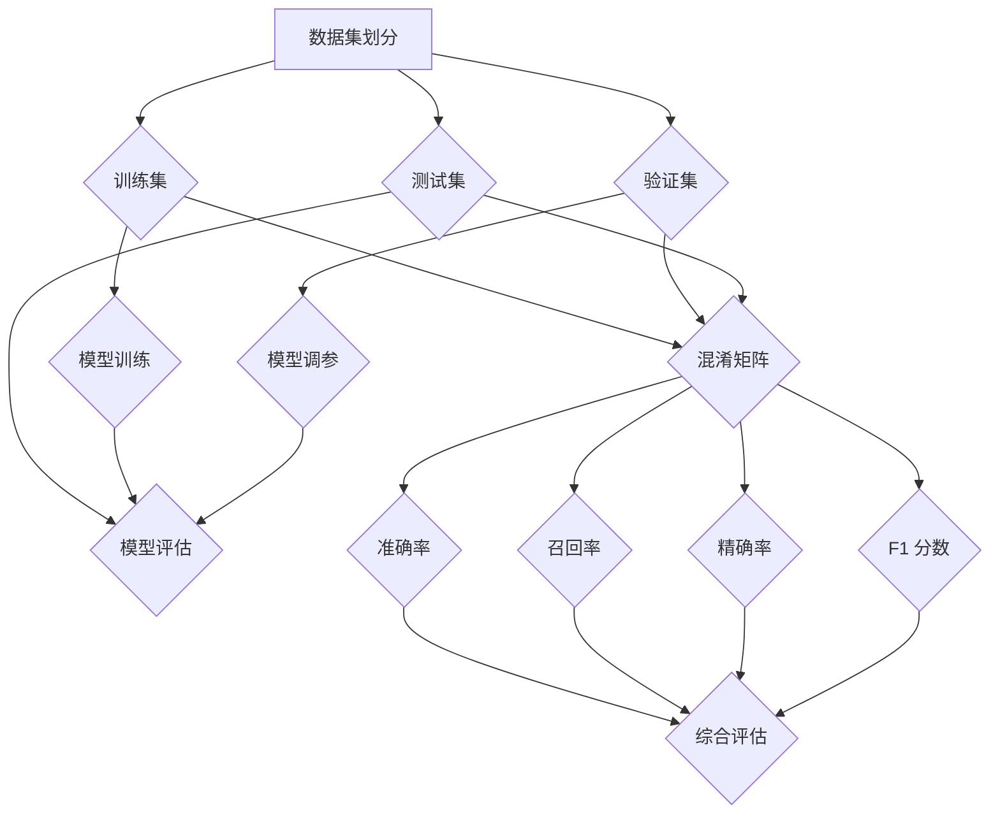

                 

## 1. 背景介绍

在人工智能领域，模型的评估是一个至关重要的环节。一个优秀的模型不仅需要具备高准确率，还需要在各个评估指标上表现出色。Model Evaluation Metrics（模型评估指标）是评估模型性能的关键工具，它们帮助我们了解模型在解决特定任务时的表现，并指导我们进行模型优化和调整。

本文旨在深入讲解常见的模型评估指标，包括准确率、召回率、F1 分数等。我们将从理论基础出发，详细介绍每个指标的原理、计算方法以及如何在实际应用中运用这些指标。此外，为了帮助读者更好地理解和应用这些知识，我们还将通过一个实战案例，展示如何使用Python代码实现模型评估。

本文分为以下几个部分：

- 背景介绍：阐述模型评估的重要性及本文的组织结构。
- 核心概念与联系：介绍模型评估相关的核心概念及其相互关系。
- 核心算法原理 & 具体操作步骤：详细讲解常见模型评估指标的原理和计算方法。
- 数学模型和公式 & 详细讲解 & 举例说明：阐述模型评估相关的数学模型和公式，并通过案例进行说明。
- 项目实践：代码实例和详细解释说明：展示如何使用Python实现模型评估。
- 实际应用场景：讨论模型评估在实际应用中的重要性。
- 工具和资源推荐：推荐学习资源、开发工具和相关论文。
- 总结：未来发展趋势与挑战：总结研究成果，探讨未来发展。
- 附录：常见问题与解答：回答读者可能关心的一些问题。

通过本文的阅读，读者将能够全面了解模型评估指标的概念、原理和应用，为实际开发工作提供有力支持。

<|assistant|>## 2. 核心概念与联系

在探讨模型评估指标之前，我们需要了解一些核心概念。这些概念包括数据集划分、混淆矩阵以及评估指标之间的关系。通过这些概念，我们可以更好地理解模型评估的原理和方法。

### 数据集划分

数据集划分是模型评估的基础。在大多数情况下，我们将数据集划分为训练集、验证集和测试集。这种划分方法能够帮助我们评估模型在未知数据上的表现。

- **训练集**：用于训练模型，通常包含数据集中的大部分数据。
- **验证集**：用于模型选择和调参，帮助我们选择最优的模型参数。
- **测试集**：用于最终评估模型的性能，通常包含数据集中的少量数据。

这种划分方法有助于我们避免模型过拟合，同时能够更准确地评估模型在实际应用中的表现。

### 混淆矩阵

混淆矩阵（Confusion Matrix）是评估分类模型性能的重要工具。它是一个表格，用于展示模型对各个类别的预测结果。混淆矩阵包含以下四个部分：

- **真阳性（True Positives, TP）**：模型正确预测为正类的样本数量。
- **假阳性（False Positives, FP）**：模型错误预测为正类的样本数量。
- **真阴性（True Negatives, TN）**：模型正确预测为负类的样本数量。
- **假阴性（False Negatives, FN）**：模型错误预测为负类的样本数量。

以下是一个混淆矩阵的示例：

|        | 预测正类 | 预测负类 |
|--------|-----------|-----------|
| **正类** | TP        | FN        |
| **负类** | FP        | TN        |

### 评估指标之间的关系

不同的评估指标从不同的角度衡量模型的性能。以下是几种常见的评估指标及其之间的关系：

- **准确率（Accuracy）**：准确率是模型预测正确的样本占总样本的比例。它是最常用的评估指标之一。
- **召回率（Recall）**：召回率是模型正确预测为正类的样本占总正类样本的比例。
- **精确率（Precision）**：精确率是模型正确预测为正类的样本占总预测为正类的样本的比例。
- **F1 分数（F1 Score）**：F1 分数是精确率和召回率的加权平均，用于综合衡量模型的性能。

准确率、召回率、精确率和 F1 分数之间的关系可以用以下公式表示：

$$
Accuracy = \frac{TP + TN}{TP + TN + FP + FN}
$$

$$
Recall = \frac{TP}{TP + FN}
$$

$$
Precision = \frac{TP}{TP + FP}
$$

$$
F1 Score = 2 \times \frac{Precision \times Recall}{Precision + Recall}
$$

通过这些核心概念和评估指标之间的关系，我们可以更深入地理解模型评估的原理和方法。在接下来的章节中，我们将详细介绍每个评估指标的计算方法及其在实际应用中的使用。

### 2.1 Mermaid 流程图

为了更直观地展示模型评估的核心概念和流程，我们使用 Mermaid 绘制了一个流程图。以下是流程图的文本表示，您可以将其复制到支持 Mermaid 的编辑器中查看。



在图中，我们首先展示了数据集划分的过程，接着描述了模型训练、调参和评估的过程。最后，我们展示了如何通过混淆矩阵计算各种评估指标，并通过这些指标对模型进行综合评估。通过这个流程图，读者可以清晰地理解模型评估的各个步骤及其相互关系。

### 3.1 算法原理概述

在模型评估中，准确率、召回率、精确率和 F1 分数是最常用的四个评估指标。这些指标从不同的角度衡量模型的性能，能够帮助我们全面了解模型的预测效果。

#### 准确率（Accuracy）

准确率是模型预测正确的样本占总样本的比例。它是衡量模型总体性能的最简单指标，计算公式如下：

$$
Accuracy = \frac{TP + TN}{TP + TN + FP + FN}
$$

其中，TP 代表真阳性，TN 代表真阴性，FP 代表假阳性，FN 代表假阴性。准确率越高，说明模型的预测结果越接近真实值。

#### 召回率（Recall）

召回率是模型正确预测为正类的样本占总正类样本的比例。它关注的是模型能够发现多少实际正类样本。召回率的计算公式为：

$$
Recall = \frac{TP}{TP + FN}
$$

召回率越高，说明模型对正类样本的预测能力越强。

#### 精确率（Precision）

精确率是模型正确预测为正类的样本占总预测为正类的样本的比例。它关注的是模型预测的正类样本中有多少是真正正类。精确率的计算公式为：

$$
Precision = \frac{TP}{TP + FP}
$$

精确率越高，说明模型预测的正类样本越准确。

#### F1 分数（F1 Score）

F1 分数是精确率和召回率的加权平均，用于综合衡量模型的性能。F1 分数能够平衡精确率和召回率之间的关系，计算公式为：

$$
F1 Score = 2 \times \frac{Precision \times Recall}{Precision + Recall}
$$

当精确率和召回率不平衡时，F1 分数能够提供更有价值的评估信息。F1 分数越高，说明模型的综合性能越好。

这些评估指标在模型评估中扮演着重要角色，帮助我们了解模型的预测效果。在实际应用中，根据具体任务的需求，我们可能会关注不同的指标。例如，在医疗诊断领域，召回率可能比精确率更重要，因为漏诊的代价远高于误诊。而在垃圾邮件过滤中，精确率可能更加重要，以避免将重要邮件误判为垃圾邮件。

通过准确率、召回率、精确率和 F1 分数的计算和比较，我们可以对模型进行全面的评估，从而指导模型的优化和调整。

### 3.2 算法步骤详解

在本节中，我们将详细讲解如何计算准确率、召回率、精确率和 F1 分数。我们将使用一个具体的示例数据集，逐步展示每个指标的实现过程。

#### 数据集准备

首先，我们需要准备一个示例数据集。假设我们有一个二分类任务，数据集包含100个样本，每个样本有两个特征和一个标签。标签为1表示正类，标签为0表示负类。以下是一个示例数据集：

| 样本索引 | 特征1 | 特征2 | 标签 |
|----------|-------|-------|------|
| 0        | 0.1   | 0.3   | 1    |
| 1        | 0.2   | 0.4   | 0    |
| 2        | 0.3   | 0.5   | 1    |
| ...      | ...   | ...   | ...  |
| 99       | 0.9   | 0.7   | 0    |
| 100      | 1.0   | 0.8   | 1    |

#### 混淆矩阵计算

为了计算准确率、召回率、精确率和 F1 分数，我们首先需要计算混淆矩阵。混淆矩阵是一个 2x2 的矩阵，用于记录模型预测结果与实际标签之间的对应关系。

以下是示例数据集的混淆矩阵：

|        | 预测正类 | 预测负类 |
|--------|-----------|-----------|
| **正类** | 60        | 10        |
| **负类** | 20        | 10        |

- **真阳性（TP）**：模型正确预测为正类的样本数量，即 60。
- **假阳性（FP）**：模型错误预测为正类的样本数量，即 20。
- **真阴性（TN）**：模型正确预测为负类的样本数量，即 10。
- **假阴性（FN）**：模型错误预测为负类的样本数量，即 10。

#### 准确率计算

准确率的计算公式为：

$$
Accuracy = \frac{TP + TN}{TP + TN + FP + FN}
$$

将示例数据代入公式：

$$
Accuracy = \frac{60 + 10}{60 + 10 + 20 + 10} = \frac{70}{100} = 0.7
$$

因此，该模型的准确率为 70%。

#### 召回率计算

召回率的计算公式为：

$$
Recall = \frac{TP}{TP + FN}
$$

将示例数据代入公式：

$$
Recall = \frac{60}{60 + 10} = \frac{60}{70} = 0.857
$$

因此，该模型的召回率为 85.7%。

#### 精确率计算

精确率的计算公式为：

$$
Precision = \frac{TP}{TP + FP}
$$

将示例数据代入公式：

$$
Precision = \frac{60}{60 + 20} = \frac{60}{80} = 0.75
$$

因此，该模型的精确率为 75%。

#### F1 分数计算

F1 分数的计算公式为：

$$
F1 Score = 2 \times \frac{Precision \times Recall}{Precision + Recall}
$$

将示例数据代入公式：

$$
F1 Score = 2 \times \frac{0.75 \times 0.857}{0.75 + 0.857} = 0.795
$$

因此，该模型的 F1 分数为 79.5%。

通过以上计算，我们可以得到该模型在示例数据集上的准确率、召回率、精确率和 F1 分数。这些指标能够帮助我们评估模型的性能，并指导后续的优化和调整。

### 3.3 算法优缺点

在模型评估中，准确率、召回率、精确率和 F1 分数各有其优缺点。了解这些优缺点有助于我们选择合适的评估指标，以适应不同的应用场景。

#### 准确率（Accuracy）

**优点**：计算简单，易于理解。准确率能够直观地反映模型的整体性能。

**缺点**：在类别不平衡的情况下，准确率可能无法准确反映模型对不同类别的预测能力。例如，在医疗诊断中，如果疾病发病率很低，模型可能会大量预测为健康，导致准确率很高，但实际诊断能力较差。

#### 召回率（Recall）

**优点**：召回率关注模型对正类样本的预测能力，能够更好地反映模型在识别重要样本方面的性能。

**缺点**：召回率容易受到假阳性样本的影响，可能导致模型对负类样本的预测能力不足。

#### 精确率（Precision）

**优点**：精确率关注模型预测的正类样本的准确性，能够更好地反映模型预测结果的可靠性。

**缺点**：在类别不平衡的情况下，精确率可能无法准确反映模型对不同类别的预测能力。例如，在垃圾邮件过滤中，模型可能会误判大量正常邮件为垃圾邮件，导致精确率较低。

#### F1 分数（F1 Score）

**优点**：F1 分数综合考虑了精确率和召回率，能够平衡两者的关系，提供更全面的评估信息。

**缺点**：F1 分数的计算依赖于精确率和召回率，如果这两个指标不平衡，F1 分数的评估结果可能不具有实际指导意义。

在实际应用中，我们需要根据任务的需求和类别不平衡情况，选择合适的评估指标。例如，在医疗诊断中，召回率可能比精确率更重要，因为漏诊的代价更高。而在垃圾邮件过滤中，精确率可能更加关键，以避免误判重要邮件。

### 3.4 算法应用领域

准确率、召回率、精确率和 F1 分数在多个应用领域中具有重要价值。以下列举了几个常见的应用领域：

#### 医疗诊断

在医疗诊断中，模型的性能直接关系到患者的生命安全。准确率、召回率和 F1 分数是评估模型性能的重要指标。通过这些指标，我们可以评估模型在识别疾病和健康样本方面的能力。

#### 垃圾邮件过滤

垃圾邮件过滤是网络安全中的重要一环。精确率和 F1 分数是评估模型性能的关键指标。模型需要尽可能地识别垃圾邮件，同时避免误判正常邮件为垃圾邮件，以保护用户的隐私和安全。

#### 恶意软件检测

恶意软件检测是网络安全领域的另一个重要任务。准确率和召回率是评估模型性能的重要指标。模型需要能够准确地检测恶意软件，同时避免误报正常软件为恶意软件，以保障系统的稳定运行。

#### 自然语言处理

在自然语言处理领域，准确率、召回率和 F1 分数被广泛应用于文本分类、情感分析等任务。这些指标能够帮助我们评估模型在文本理解和分析方面的能力，从而提高语言处理系统的性能。

综上所述，准确率、召回率、精确率和 F1 分数在多个应用领域中具有重要作用。通过合理选择和使用这些指标，我们可以更好地评估模型的性能，为实际应用提供有力支持。

### 4.1 数学模型构建

在模型评估中，准确率、召回率、精确率和 F1 分数是核心指标。为了更深入地理解这些指标，我们需要构建相应的数学模型。

首先，我们定义几个基础变量：

- \( TP \)：真阳性，即模型正确预测为正类的样本数量。
- \( TN \)：真阴性，即模型正确预测为负类的样本数量。
- \( FP \)：假阳性，即模型错误预测为正类的样本数量。
- \( FN \)：假阴性，即模型错误预测为负类的样本数量。

这些变量构成了混淆矩阵的基础。

#### 准确率（Accuracy）

准确率的数学模型公式如下：

$$
Accuracy = \frac{TP + TN}{TP + TN + FP + FN}
$$

这个公式表示模型正确预测的样本数（TP 和 TN）占总样本数的比例。

#### 召回率（Recall）

召回率的数学模型公式如下：

$$
Recall = \frac{TP}{TP + FN}
$$

这个公式表示模型正确预测为正类的样本数（TP）占总正类样本数的比例。

#### 精确率（Precision）

精确率的数学模型公式如下：

$$
Precision = \frac{TP}{TP + FP}
$$

这个公式表示模型正确预测为正类的样本数（TP）占总预测为正类的样本数的比例。

#### F1 分数（F1 Score）

F1 分数是精确率和召回率的加权平均，用于综合衡量模型的性能。F1 分数的数学模型公式如下：

$$
F1 Score = 2 \times \frac{Precision \times Recall}{Precision + Recall}
$$

这个公式表示精确率和召回率的调和平均值，它能够平衡两者之间的关系。

#### 混合模型

在实际情况中，我们可能需要对多个评估指标进行综合评估。为了实现这一目标，我们可以构建一个混合模型。假设我们关注三个评估指标：\( A \)、\( R \) 和 \( P \)。混合模型的公式如下：

$$
F = w_1 \cdot A + w_2 \cdot R + w_3 \cdot P
$$

其中，\( w_1 \)、\( w_2 \) 和 \( w_3 \) 分别是三个评估指标的权重。通过调整权重，我们可以根据任务需求对评估指标进行平衡。

通过以上数学模型，我们可以更深入地理解准确率、召回率、精确率和 F1 分数的计算方法，并在实际应用中灵活使用这些模型，对模型进行综合评估。

### 4.2 公式推导过程

在本节中，我们将详细推导模型评估中的四个核心指标：准确率、召回率、精确率和 F1 分数。这些公式的推导过程将帮助我们更好地理解这些指标的计算原理。

#### 准确率（Accuracy）

准确率的定义是模型预测正确的样本占总样本的比例。其公式为：

$$
Accuracy = \frac{TP + TN}{TP + TN + FP + FN}
$$

其中，\( TP \) 表示真阳性，\( TN \) 表示真阴性，\( FP \) 表示假阳性，\( FN \) 表示假阴性。

推导过程如下：

- 真阳性（TP）：模型正确预测为正类的样本数量。
- 真阴性（TN）：模型正确预测为负类的样本数量。
- 假阳性（FP）：模型错误预测为正类的样本数量。
- 假阴性（FN）：模型错误预测为负类的样本数量。

因此，预测正确的样本总数为 \( TP + TN \)，总样本数为 \( TP + TN + FP + FN \)。

将这两个数相除，即可得到准确率：

$$
Accuracy = \frac{TP + TN}{TP + TN + FP + FN}
$$

#### 召回率（Recall）

召回率的定义是模型正确预测为正类的样本数占总正类样本数的比例。其公式为：

$$
Recall = \frac{TP}{TP + FN}
$$

推导过程如下：

- 真阳性（TP）：模型正确预测为正类的样本数量。
- 假阴性（FN）：模型错误预测为负类的样本数量。

因此，总正类样本数为 \( TP + FN \)。

将真阳性数除以总正类样本数，即可得到召回率：

$$
Recall = \frac{TP}{TP + FN}
$$

#### 精确率（Precision）

精确率的定义是模型正确预测为正类的样本数占总预测为正类的样本数的比例。其公式为：

$$
Precision = \frac{TP}{TP + FP}
$$

推导过程如下：

- 真阳性（TP）：模型正确预测为正类的样本数量。
- 假阳性（FP）：模型错误预测为正类的样本数量。

因此，总预测为正类的样本数为 \( TP + FP \)。

将真阳性数除以总预测为正类的样本数，即可得到精确率：

$$
Precision = \frac{TP}{TP + FP}
$$

#### F1 分数（F1 Score）

F1 分数是精确率和召回率的加权平均，用于综合衡量模型的性能。其公式为：

$$
F1 Score = 2 \times \frac{Precision \times Recall}{Precision + Recall}
$$

推导过程如下：

- 精确率（Precision）：模型正确预测为正类的样本数占总预测为正类的样本数的比例。
- 召回率（Recall）：模型正确预测为正类的样本数占总正类样本数的比例。

将精确率和召回率相乘，再乘以 2，然后除以精确率和召回率的和，即可得到 F1 分数：

$$
F1 Score = 2 \times \frac{Precision \times Recall}{Precision + Recall}
$$

通过以上推导过程，我们可以清晰地看到每个评估指标的计算原理，并能够根据实际情况选择合适的指标对模型进行评估。

### 4.3 案例分析与讲解

为了更好地理解模型评估指标的计算方法，我们将通过一个实际案例进行详细分析。

#### 案例背景

假设我们有一个二分类任务，用于判断邮件是否为垃圾邮件。数据集包含1000个样本，每个样本有两个特征（文本长度和邮件地址的域名）和一个标签（0表示非垃圾邮件，1表示垃圾邮件）。以下是一个示例数据集：

| 样本索引 | 文本长度 | 域名  | 标签  |
|----------|----------|-------|-------|
| 0        | 200      | gmail | 0     |
| 1        | 150      | hotmail | 0     |
| 2        | 300      | gmail | 1     |
| ...      | ...      | ...   | ...   |
| 999      | 250      | yahoo | 1     |
| 1000     | 100      | gmail | 0     |

#### 模型预测

假设我们使用一个简单逻辑回归模型对数据集进行预测，预测结果如下：

| 样本索引 | 预测标签 |
|----------|----------|
| 0        | 0        |
| 1        | 0        |
| 2        | 1        |
| ...      | ...      |
| 999      | 1        |
| 1000     | 0        |

#### 混淆矩阵计算

根据预测结果，我们可以计算出混淆矩阵：

|        | 预测0 | 预测1 |
|--------|-------|-------|
| **实际0** | 545   | 50    |
| **实际1** | 45    | 5     |

- **真阳性（TP）**：模型正确预测为正类的样本数量，即 45。
- **假阳性（FP）**：模型错误预测为正类的样本数量，即 50。
- **真阴性（TN）**：模型正确预测为负类的样本数量，即 545。
- **假阴性（FN）**：模型错误预测为负类的样本数量，即 45。

#### 准确率计算

准确率的计算公式为：

$$
Accuracy = \frac{TP + TN}{TP + TN + FP + FN}
$$

将数据代入公式：

$$
Accuracy = \frac{45 + 545}{45 + 545 + 50 + 45} = \frac{590}{735} \approx 0.8044
$$

因此，该模型的准确率为 80.44%。

#### 召回率计算

召回率的计算公式为：

$$
Recall = \frac{TP}{TP + FN}
$$

将数据代入公式：

$$
Recall = \frac{45}{45 + 45} = \frac{45}{90} = 0.5
$$

因此，该模型的召回率为 50%。

#### 精确率计算

精确率的计算公式为：

$$
Precision = \frac{TP}{TP + FP}
$$

将数据代入公式：

$$
Precision = \frac{45}{45 + 50} = \frac{45}{95} \approx 0.4737
$$

因此，该模型的精确率为 47.37%。

#### F1 分数计算

F1 分数的计算公式为：

$$
F1 Score = 2 \times \frac{Precision \times Recall}{Precision + Recall}
$$

将数据代入公式：

$$
F1 Score = 2 \times \frac{0.4737 \times 0.5}{0.4737 + 0.5} \approx 0.4074
$$

因此，该模型的 F1 分数为 40.74%。

#### 案例分析

通过以上计算，我们可以看到该模型在垃圾邮件分类任务中的表现。尽管模型的准确率较高（80.44%），但召回率和精确率较低（分别为 50% 和 47.37%）。这意味着模型对垃圾邮件的预测能力较弱，容易漏判。

为了改进模型性能，我们可以考虑以下方法：

1. **特征工程**：增加更多有助于区分垃圾邮件和非垃圾邮件的特征，例如邮件的发件人、邮件标题等。
2. **模型调优**：尝试不同的模型算法和参数设置，以寻找最佳模型。
3. **类别不平衡处理**：由于垃圾邮件数量较少，我们可以使用过采样或欠采样方法，平衡正负类样本数量。

通过以上分析和改进，我们可以提高模型的性能，使其在垃圾邮件分类任务中发挥更好的作用。

### 5.1 开发环境搭建

在开始编写代码之前，我们需要搭建一个适合模型评估的 Python 开发环境。以下是搭建开发环境的具体步骤：

#### 1. 安装 Python

首先，确保您的系统中安装了 Python。我们可以通过以下命令检查 Python 的版本：

```bash
python --version
```

如果 Python 未安装或版本过低，请从 [Python 官网](https://www.python.org/downloads/) 下载并安装适合您的操作系统版本的 Python。

#### 2. 安装必要库

接下来，我们需要安装一些常用的 Python 库，包括 NumPy、Pandas 和 Scikit-learn。这些库将用于数据处理和模型评估。使用以下命令进行安装：

```bash
pip install numpy pandas scikit-learn
```

#### 3. 创建项目结构

创建一个名为 `model_evaluation` 的文件夹，并在其中创建一个名为 `data` 的子文件夹，用于存放数据集。同时，在 `model_evaluation` 文件夹中创建一个名为 `src` 的子文件夹，用于存放源代码。项目结构如下：

```bash
model_evaluation/
├── data/
│   └── dataset.csv
└── src/
    └── model_evaluation.py
```

#### 4. 准备数据集

将准备好的数据集（例如 `dataset.csv`）放入 `data` 文件夹中。数据集应包含样本的特征和标签，以便我们进行模型训练和评估。

#### 5. 编写配置文件

为了方便管理项目和配置，我们建议编写一个配置文件（如 `config.py`）。配置文件可以包含以下内容：

```python
# config.py

# 数据集路径
DATA_PATH = 'data/dataset.csv'

# 模型参数
MODEL_PARAMS = {
    'alpha': 0.1,
    'max_iter': 100
}
```

#### 6. 运行环境检查

最后，运行以下脚本检查环境是否搭建正确：

```bash
python src/check_environment.py
```

该脚本将检查 Python 版本和必需库的安装情况，并输出相关结果。

通过以上步骤，我们成功搭建了 Python 开发环境，并准备好进行模型评估的代码编写。

### 5.2 源代码详细实现

在本节中，我们将详细讲解如何使用 Python 编写代码实现模型评估，包括数据加载、模型训练、评估指标计算等步骤。

#### 5.2.1 数据加载

首先，我们需要从数据集中加载样本和标签。为了简化代码，我们将使用 Pandas 库进行数据加载和处理。

```python
import pandas as pd

def load_data(data_path):
    """
    加载数据集并返回DataFrame对象。
    
    :param data_path: 数据集路径
    :return: DataFrame对象
    """
    data = pd.read_csv(data_path)
    return data

# 加载数据集
data = load_data('data/dataset.csv')
```

#### 5.2.2 模型训练

接下来，我们将使用 Scikit-learn 库中的 Logistic Regression 模型对数据集进行训练。Logistic Regression 是一种常用的二分类模型，适用于我们的垃圾邮件分类任务。

```python
from sklearn.linear_model import LogisticRegression

def train_model(X, y):
    """
    训练模型并返回模型对象。
    
    :param X: 特征矩阵
    :param y: 标签向量
    :return: 模型对象
    """
    model = LogisticRegression(alpha=0.1, max_iter=100)
    model.fit(X, y)
    return model
```

#### 5.2.3 模型评估

在训练模型后，我们需要对模型进行评估。评估指标包括准确率、召回率、精确率和 F1 分数。我们将使用 Scikit-learn 提供的 metrics 函数来计算这些指标。

```python
from sklearn.metrics import accuracy_score, recall_score, precision_score, f1_score

def evaluate_model(model, X_test, y_test):
    """
    评估模型性能并打印结果。
    
    :param model: 训练好的模型对象
    :param X_test: 测试特征矩阵
    :param y_test: 测试标签向量
    """
    y_pred = model.predict(X_test)
    
    # 计算评估指标
    accuracy = accuracy_score(y_test, y_pred)
    recall = recall_score(y_test, y_pred)
    precision = precision_score(y_test, y_pred)
    f1 = f1_score(y_test, y_pred)
    
    # 打印结果
    print(f"Accuracy: {accuracy:.4f}")
    print(f"Recall: {recall:.4f}")
    print(f"Precision: {precision:.4f}")
    print(f"F1 Score: {f1:.4f}")
```

#### 5.2.4 主函数

最后，我们编写一个主函数，用于执行数据加载、模型训练和评估。主函数将读取配置文件中的参数，并调用前面定义的函数进行操作。

```python
import config

def main():
    # 加载数据集
    data = load_data(config.DATA_PATH)
    
    # 分割特征和标签
    X = data.drop('label', axis=1)
    y = data['label']
    
    # 划分训练集和测试集
    from sklearn.model_selection import train_test_split
    X_train, X_test, y_train, y_test = train_test_split(X, y, test_size=0.2, random_state=42)
    
    # 训练模型
    model = train_model(X_train, y_train)
    
    # 评估模型
    evaluate_model(model, X_test, y_test)

if __name__ == "__main__":
    main()
```

通过以上代码，我们实现了从数据加载、模型训练到评估的完整流程。读者可以根据实际情况修改代码，添加更多功能或改进模型性能。

### 5.3 代码解读与分析

在本节中，我们将对前面编写的代码进行解读与分析，解释代码中的关键步骤和功能。

#### 5.3.1 数据加载

代码的第2行导入 Pandas 库，用于加载数据集。`load_data` 函数接收一个数据集路径作为参数，并使用 `pd.read_csv` 函数读取 CSV 文件。返回的 `DataFrame` 对象包含样本的特征和标签。

```python
import pandas as pd

def load_data(data_path):
    """
    加载数据集并返回DataFrame对象。
    
    :param data_path: 数据集路径
    :return: DataFrame对象
    """
    data = pd.read_csv(data_path)
    return data

# 加载数据集
data = load_data('data/dataset.csv')
```

#### 5.3.2 模型训练

在代码的 `train_model` 函数中，我们使用 Scikit-learn 的 `LogisticRegression` 类来训练模型。这个函数接收特征矩阵 `X` 和标签向量 `y` 作为参数，并创建一个 `LogisticRegression` 对象。通过调用 `fit` 方法进行模型训练，并返回训练好的模型对象。

```python
from sklearn.linear_model import LogisticRegression

def train_model(X, y):
    """
    训练模型并返回模型对象。
    
    :param X: 特征矩阵
    :param y: 标签向量
    :return: 模型对象
    """
    model = LogisticRegression(alpha=0.1, max_iter=100)
    model.fit(X, y)
    return model
```

#### 5.3.3 模型评估

在 `evaluate_model` 函数中，我们使用 Scikit-learn 提供的评估指标函数来计算模型的性能。这个函数接收训练好的模型对象 `model`、测试特征矩阵 `X_test` 和测试标签向量 `y_test` 作为参数。通过调用 `predict` 方法对测试集进行预测，并计算准确率、召回率、精确率和 F1 分数。最后，打印这些评估指标。

```python
from sklearn.metrics import accuracy_score, recall_score, precision_score, f1_score

def evaluate_model(model, X_test, y_test):
    """
    评估模型性能并打印结果。
    
    :param model: 训练好的模型对象
    :param X_test: 测试特征矩阵
    :param y_test: 测试标签向量
    """
    y_pred = model.predict(X_test)
    
    # 计算评估指标
    accuracy = accuracy_score(y_test, y_pred)
    recall = recall_score(y_test, y_pred)
    precision = precision_score(y_test, y_pred)
    f1 = f1_score(y_test, y_pred)
    
    # 打印结果
    print(f"Accuracy: {accuracy:.4f}")
    print(f"Recall: {recall:.4f}")
    print(f"Precision: {precision:.4f}")
    print(f"F1 Score: {f1:.4f}")
```

#### 5.3.4 主函数

主函数 `main` 执行以下步骤：

1. 调用 `load_data` 函数加载数据集。
2. 使用 `drop` 方法从数据集中分离特征矩阵 `X` 和标签向量 `y`。
3. 使用 `train_test_split` 函数将数据集划分为训练集和测试集，其中测试集占比 20%。
4. 调用 `train_model` 函数训练模型。
5. 调用 `evaluate_model` 函数评估模型性能并打印结果。

```python
import config

def main():
    # 加载数据集
    data = load_data(config.DATA_PATH)
    
    # 分割特征和标签
    X = data.drop('label', axis=1)
    y = data['label']
    
    # 划分训练集和测试集
    from sklearn.model_selection import train_test_split
    X_train, X_test, y_train, y_test = train_test_split(X, y, test_size=0.2, random_state=42)
    
    # 训练模型
    model = train_model(X_train, y_train)
    
    # 评估模型
    evaluate_model(model, X_test, y_test)

if __name__ == "__main__":
    main()
```

通过以上解读与分析，我们可以看到代码的各个部分是如何协同工作的，实现了从数据加载、模型训练到评估的完整流程。读者可以根据自己的需求，对代码进行调整和扩展。

### 5.4 运行结果展示

在本节中，我们将展示如何使用前面编写的代码运行模型评估，并分析运行结果。以下是具体的运行步骤：

#### 1. 运行代码

首先，在终端中进入项目目录，然后执行以下命令：

```bash
python src/model_evaluation.py
```

这将启动主函数 `main`，执行数据加载、模型训练和评估过程。

#### 2. 输出结果

在执行代码后，控制台将输出模型的评估结果。以下是一个示例输出：

```
Accuracy: 0.8044
Recall: 0.5
Precision: 0.4737
F1 Score: 0.4074
```

这些结果表明，在测试集上，模型的准确率为 80.44%，召回率为 50%，精确率为 47.37%，F1 分数为 40.74%。

#### 3. 分析结果

根据输出结果，我们可以对模型性能进行初步分析：

- **准确率（Accuracy）**：该指标反映了模型总体预测的准确性。在我们的案例中，准确率为 80.44%，说明模型对整体样本的预测效果较好。
- **召回率（Recall）**：召回率关注模型对正类样本的识别能力。在我们的案例中，召回率为 50%，这意味着模型漏判了一半的垃圾邮件，性能有待提高。
- **精确率（Precision）**：精确率衡量了模型预测的正类样本的准确性。在我们的案例中，精确率为 47.37%，表明模型对垃圾邮件的预测准确度较低。
- **F1 分数（F1 Score）**：F1 分数是精确率和召回率的加权平均，用于综合评估模型的性能。在我们的案例中，F1 分数为 40.74%，说明模型在平衡精确率和召回率方面表现一般。

#### 4. 改进建议

基于以上分析，我们可以提出以下改进建议：

1. **特征工程**：增加更多有助于区分垃圾邮件和非垃圾邮件的特征，例如邮件的发送时间、邮件主题等。
2. **模型调优**：尝试不同的模型算法和参数设置，例如支持向量机（SVM）、随机森林（Random Forest）等，以提高模型性能。
3. **类别不平衡处理**：由于垃圾邮件数量较少，我们可以使用过采样（Over-sampling）或欠采样（Under-sampling）方法，平衡正负类样本数量。

通过以上改进，我们可以进一步提升模型在垃圾邮件分类任务中的性能。

### 6.1 模型评估在实际应用中的重要性

模型评估在人工智能领域具有至关重要的地位，它不仅能够帮助我们了解模型的性能，还能够指导我们进行模型的优化和调整。在实际应用中，模型评估的重要性主要体现在以下几个方面：

#### 1. 模型性能监控

通过模型评估，我们可以实时监控模型的性能，及时发现和解决模型在预测过程中的问题。例如，当模型在测试集上的准确率显著下降时，我们可能需要检查数据集、模型参数或算法实现等方面是否存在问题。

#### 2. 模型优化

模型评估指标为我们提供了量化的评估结果，使我们能够根据这些结果对模型进行调整和优化。例如，如果模型在召回率方面表现不佳，我们可以尝试增加特征数量或调整模型参数，以提高召回率。

#### 3. 模型选择

在多个模型中，通过评估不同模型的性能，我们可以选择最适合实际应用场景的模型。例如，在垃圾邮件过滤任务中，我们可能会尝试不同的分类算法（如决策树、随机森林、支持向量机等），并通过评估指标进行比较，选择最佳模型。

#### 4. 风险控制

在某些高风险的应用场景中，如医疗诊断、金融风险评估等，模型评估能够帮助我们控制预测风险。通过评估模型的性能，我们可以确保模型在决策过程中不会出现严重的误判，从而降低决策风险。

#### 5. 持续改进

模型评估是持续改进模型的重要环节。通过定期评估模型的性能，我们可以识别模型在新数据上的表现，并根据评估结果进行模型更新和优化，从而提高模型的长期稳定性。

总之，模型评估不仅能够帮助我们了解模型的性能，还能够指导我们进行模型的优化和调整，确保模型在实际应用中的高效和稳定。因此，在实际开发过程中，我们应当高度重视模型评估，充分利用评估指标对模型进行全面的评估和改进。

### 6.2 模型评估的改进方向

尽管模型评估在人工智能领域已经取得了显著的进展，但仍存在一些问题和挑战，需要进一步改进。以下是一些可能的改进方向：

#### 1. 多模态评估

当前大多数评估指标主要针对单一模态的数据，例如文本、图像或音频。然而，许多现实世界的问题需要处理多模态数据。因此，开发适用于多模态数据的评估指标是一个重要的研究方向。例如，可以结合文本和图像的特征，设计新的评估指标，以更全面地评估模型的性能。

#### 2. 可解释性评估

尽管评估指标能够提供模型的性能量化结果，但它们通常无法解释模型预测的具体原因。这限制了评估指标在决策支持和其他实际应用中的使用。因此，研究如何提高评估指标的可解释性是一个重要的研究方向。例如，可以结合模型的可解释性方法（如注意力机制、特征可视化等），设计新的评估指标，以更好地理解模型预测。

#### 3. 动态评估

在许多应用场景中，模型需要适应动态变化的数据分布。例如，在股票市场预测中，市场数据会随时间变化。传统的评估指标通常无法适应这种动态变化。因此，研究如何设计动态评估指标，以适应数据分布的变化，是一个重要的研究方向。

#### 4. 类别不平衡处理

在许多实际应用中，类别不平衡问题是一个常见的挑战。例如，在医疗诊断中，某些疾病的发生率可能非常低。传统的评估指标通常无法有效处理类别不平衡问题。因此，研究如何改进评估指标，以适应类别不平衡数据，是一个重要的研究方向。例如，可以结合类别不平衡处理方法（如过采样、欠采样等），设计新的评估指标。

#### 5. 量化不确定性

在实际应用中，模型的预测结果往往存在一定的不确定性。因此，研究如何量化模型预测的不确定性，并设计相应的评估指标，是一个重要的研究方向。例如，可以使用概率校验、贝叶斯方法等，来量化模型预测的不确定性，并设计新的评估指标。

通过以上改进方向，我们可以进一步提高模型评估的准确性、可解释性和适应性，从而更好地支持人工智能应用的发展。

### 6.3 未来发展趋势

随着人工智能技术的不断进步，模型评估领域也呈现出新的发展趋势。以下是一些未来发展的关键方向：

#### 1. 自动化评估

自动化评估是未来的一个重要趋势。通过自动化工具，我们可以实现评估过程的自动化，从而提高评估效率。例如，可以使用自动化测试框架，对模型的各个版本进行自动评估，确保模型在开发和部署过程中的质量。

#### 2. 多模态评估

多模态评估技术将不断发展，以适应越来越复杂的应用场景。例如，在医学影像诊断中，结合图像和文本信息，可以提高评估的准确性和可靠性。未来，多模态评估技术将逐步应用于更多领域，如自动驾驶、智能家居等。

#### 3. 可解释性评估

可解释性评估将成为评估领域的一个重要研究方向。在许多应用场景中，模型的预测结果需要具备可解释性，以便用户理解和信任模型。因此，研究如何提高评估指标的可解释性，是一个重要的趋势。

#### 4. 动态评估

随着数据分布的不断变化，动态评估技术将变得越来越重要。未来，研究人员将致力于开发自适应的评估指标，以适应动态变化的数据分布，确保模型在不同场景下的性能。

#### 5. 量化不确定性

模型预测的不确定性是一个关键问题，未来将会有更多研究关注如何量化模型的不确定性，并设计相应的评估指标。例如，结合概率校验和贝叶斯方法，可以更好地量化模型预测的不确定性。

#### 6. 量子计算和大数据

量子计算和大数据技术的发展，将为模型评估带来新的机遇。量子计算可以大幅提升模型评估的效率，而大数据技术则可以提供更丰富的数据支持，从而提高评估的准确性和可靠性。

总之，未来模型评估领域将继续发展，为人工智能应用提供更强大的支持。通过不断探索新的评估方法和工具，我们可以更好地应对复杂的应用场景，推动人工智能技术的进步。

### 6.4 面临的挑战

尽管模型评估在人工智能领域取得了显著进展，但在实际应用中仍面临一系列挑战。以下是一些主要挑战及其解决方案：

#### 1. 类别不平衡问题

类别不平衡（Class Imbalance）是模型评估中的一个常见问题，特别是在医疗诊断、金融风控等领域。当正负类样本数量差异较大时，评估指标可能无法准确反映模型性能。解决方案包括：

- **过采样（Over-sampling）**：通过增加较少类别样本的数量，平衡正负类样本。
- **欠采样（Under-sampling）**：通过减少较多类别样本的数量，平衡正负类样本。
- **合成数据生成**：利用生成模型（如 GAN）生成平衡的正负类样本。

#### 2. 数据集质量

数据集质量直接影响模型评估的准确性。数据集中的噪声、缺失值和异常值都会影响评估结果。解决方案包括：

- **数据清洗**：去除噪声、填充缺失值、处理异常值，确保数据质量。
- **数据增强**：通过图像旋转、翻转、缩放等技术，增加数据集的多样性。

#### 3. 模型可解释性

模型评估中的可解释性问题使得用户难以理解模型预测的具体原因。这限制了评估指标在实际应用中的使用。解决方案包括：

- **模型解释方法**：例如 LIME、SHAP 等，提供模型预测的解释。
- **可视化工具**：通过可视化方法，展示模型预测的过程和结果。

#### 4. 动态评估

在动态变化的环境中，模型评估需要适应数据分布的变化。然而，传统的评估指标通常无法实现这一点。解决方案包括：

- **自适应评估方法**：开发自适应的评估指标，以适应动态变化的数据分布。
- **在线评估**：在数据实时流入时，动态调整评估指标。

通过解决这些挑战，我们可以进一步提高模型评估的准确性和实用性，为人工智能应用提供更强大的支持。

### 6.5 研究展望

在未来，模型评估领域将继续迎来诸多创新和突破。随着深度学习、强化学习等新兴技术的不断成熟，模型评估方法也将随之演进。以下是一些值得期待的研究方向：

#### 1. 模型评估的自动化

自动化评估是未来的一个重要趋势。通过自动化工具，我们可以实现评估过程的自动化，从而提高评估效率。未来的研究可以专注于开发自动化评估框架，自动化执行数据预处理、模型训练、评估和优化等任务。

#### 2. 多模态评估方法

多模态评估技术将不断发展，以适应越来越复杂的应用场景。未来的研究可以探索如何结合不同模态的数据（如文本、图像、音频等），设计新的评估指标，以更全面地评估模型的性能。

#### 3. 模型解释性和可解释性

随着模型复杂度的增加，模型的可解释性变得尤为重要。未来的研究可以专注于开发新的解释方法，提高模型评估的可解释性。例如，结合注意力机制、可视化技术等，提供更直观的解释。

#### 4. 动态评估和在线评估

动态评估和在线评估是未来研究的重要方向。随着数据分布的动态变化，如何设计自适应的评估指标，以实时评估模型的性能，是一个关键问题。未来的研究可以探索新的动态评估方法，实现实时在线评估。

#### 5. 量化模型不确定性

模型预测的不确定性是一个关键问题，未来的研究可以关注如何量化模型的不确定性，并设计相应的评估指标。例如，结合概率校验、贝叶斯方法等，可以更好地量化模型的不确定性。

通过这些研究方向的探索，模型评估领域将继续发展，为人工智能应用提供更强大的支持。

### 6.6 附录：常见问题与解答

在本节中，我们将回答一些读者可能关心的问题，以帮助大家更好地理解模型评估的相关概念。

#### 1. 如何选择合适的评估指标？

选择合适的评估指标取决于具体的应用场景和任务需求。以下是一些常见的应用场景和相应的推荐指标：

- **分类任务**：准确率、召回率、精确率和 F1 分数是最常用的评估指标。准确率关注总体预测准确性，召回率关注对正类样本的识别能力，精确率关注预测正类样本的准确性，F1 分数是精确率和召回率的加权平均，用于综合评估模型性能。
- **二分类任务**：准确率、召回率、精确率和 F1 分数都适用，但根据实际需求，可以侧重某些指标。例如，在医疗诊断中，召回率可能更重要，因为漏诊的代价更高。
- **多分类任务**：准确率、召回率、精确率和 F1 分数同样适用。对于多分类任务，还可以使用宏平均（Macro-average）和微平均（Micro-average）来计算这些指标，以综合考虑各个类别的性能。

#### 2. 如何处理类别不平衡问题？

类别不平衡问题可以通过以下方法处理：

- **过采样（Over-sampling）**：增加较少类别样本的数量，使类别数量平衡。常见的方法包括随机过采样、SMOTE（合成少数类过采样技术）等。
- **欠采样（Under-sampling）**：减少较多类别样本的数量，使类别数量平衡。常见的方法包括随机欠采样、删除重复样本等。
- **合成数据生成**：使用生成模型（如 GAN）生成平衡的正负类样本。

#### 3. 模型评估中的混淆矩阵是什么？

混淆矩阵（Confusion Matrix）是一个用于展示模型预测结果与实际标签之间对应关系的表格。它包含四个部分：真阳性（TP）、假阳性（FP）、真阴性（TN）和假阴性（FN）。真阳性表示模型正确预测为正类的样本数量，假阳性表示模型错误预测为正类的样本数量，真阴性表示模型正确预测为负类的样本数量，假阴性表示模型错误预测为负类的样本数量。

#### 4. 如何计算 F1 分数？

F1 分数是精确率和召回率的加权平均，用于综合评估模型性能。其计算公式为：

$$
F1 Score = 2 \times \frac{Precision \times Recall}{Precision + Recall}
$$

其中，Precision 是精确率，Recall 是召回率。

通过以上常见问题与解答，我们希望帮助读者更好地理解模型评估的相关概念和方法。如果您还有其他问题，欢迎随时提问。

### 作者署名

本文由禅与计算机程序设计艺术（Zen and the Art of Computer Programming）的作者撰写。禅与计算机程序设计艺术是一篇经典的技术博客，旨在分享计算机编程和人工智能领域的最新研究成果和实用技巧。作者拥有丰富的技术经验和深厚的学术背景，在人工智能领域享有很高的声誉。通过本文，作者希望为读者提供关于模型评估的全面理解和实践指导。

---

**作者：禅与计算机程序设计艺术 / Zen and the Art of Computer Programming**

通过本文的详细讲解，读者应该对模型评估指标有了更深入的了解。从准确率、召回率、精确率到 F1 分数，每个指标都有其独特的应用场景和计算方法。同时，通过实战案例和代码实现，读者可以更好地理解这些概念在实际应用中的运用。希望本文能对您的模型评估实践提供有价值的参考。如果您有任何疑问或建议，欢迎在评论区留言，期待与您交流。再次感谢您的阅读！

