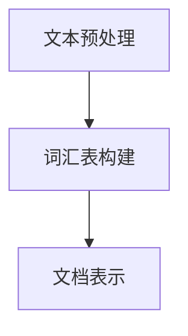
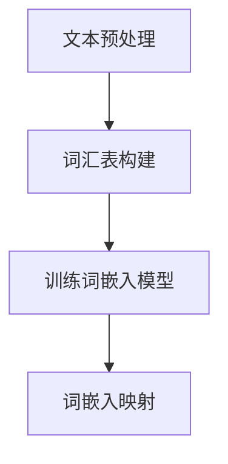

                 

关键词：自然语言处理（NLP），词袋模型，词嵌入，机器学习，文本分析，语言模型，语义理解

> 摘要：本文将深入探讨自然语言处理（NLP）中两个核心基础模型：词袋模型（Bag of Words, BOW）和词嵌入（Word Embedding）。我们将从词袋模型的定义、构建方法、优缺点以及其在文本分类任务中的应用开始，逐步过渡到词嵌入的概念、原理及其在NLP中的重要性。通过数学模型和公式的详细讲解，我们将深入理解词嵌入的工作机制，并通过实际代码实例，展示如何将词嵌入应用于文本分类任务。最后，我们将探讨词嵌入在实际应用中的场景，并展望其未来发展的趋势与挑战。

## 1. 背景介绍

自然语言处理（NLP）是计算机科学和人工智能领域的一个分支，旨在使计算机能够理解、解释和生成自然语言。随着互联网和大数据的发展，NLP的应用场景日益广泛，包括机器翻译、情感分析、信息检索、文本分类、语音识别等。这些应用对NLP模型的准确性和效率提出了极高的要求。

在NLP的发展历程中，词袋模型和词嵌入是两个重要的里程碑。词袋模型是最早的文本表示方法之一，它将文本简化为一组词的集合，忽略词的顺序和语法结构。词嵌入则是在词袋模型的基础上发展起来的，它通过将词映射到高维向量空间中，更好地捕捉词与词之间的语义关系。

本文将首先介绍词袋模型，然后深入探讨词嵌入的概念、原理及其在NLP中的应用。通过本文的学习，读者将能够深入理解NLP的基本概念，并掌握词袋模型和词嵌入的实现方法。

## 2. 核心概念与联系

### 2.1 词袋模型

词袋模型（Bag of Words, BOW）是一种将文本表示为词汇表（Vocabulary）中词的集合的模型。在这种模型中，每个词被视为一个独立的实体，不考虑其在文本中的顺序和语法结构。词袋模型的核心是词汇表，它包含文本中所有出现的词，每个词在词汇表中都有一个唯一的索引。

为了构建词袋模型，我们需要以下步骤：

1. **文本预处理**：包括去除标点符号、停用词过滤、词干提取等。
2. **词汇表构建**：将预处理后的文本转化为词汇表，每个词对应一个索引。
3. **文档表示**：将每个文档表示为词汇表中词的频率向量。

以下是一个简单的Mermaid流程图，展示了词袋模型的构建过程：



### 2.2 词嵌入

词嵌入（Word Embedding）是一种将词映射到高维向量空间的方法，旨在捕捉词与词之间的语义关系。与词袋模型不同，词嵌入不仅考虑了词的出现频率，还考虑了词的语义和上下文信息。词嵌入的方法包括Word2Vec、GloVe、FastText等。

以下是一个简单的Mermaid流程图，展示了词嵌入的构建过程：



### 2.3 核心概念之间的联系

词袋模型和词嵌入在NLP中起着核心作用。词袋模型提供了文本的一种简单、高效的表示方法，而词嵌入则在词袋模型的基础上，进一步提升了文本表示的语义丰富度。

从词袋模型到词嵌入的发展，标志着NLP从基于特征的表示方法向基于语义的表示方法的转变。这种转变极大地提升了NLP模型在文本分类、情感分析等任务中的性能。

## 3. 核心算法原理 & 具体操作步骤

### 3.1 算法原理概述

词袋模型和词嵌入都是文本表示的方法，但它们的原理和实现方式有所不同。

- **词袋模型**：通过将文本表示为词汇表中词的频率向量，词袋模型忽略了词的顺序和语法结构，仅考虑词的出现频率。
- **词嵌入**：通过将词映射到高维向量空间中，词嵌入试图捕捉词与词之间的语义关系，不仅考虑词的出现频率，还考虑词的上下文信息。

### 3.2 算法步骤详解

#### 3.2.1 词袋模型的构建步骤

1. **文本预处理**：包括去除标点符号、停用词过滤、词干提取等。
2. **词汇表构建**：将预处理后的文本转化为词汇表，每个词对应一个索引。
3. **文档表示**：将每个文档表示为词汇表中词的频率向量。

#### 3.2.2 词嵌入的构建步骤

1. **文本预处理**：与词袋模型相同，包括去除标点符号、停用词过滤、词干提取等。
2. **词汇表构建**：将预处理后的文本转化为词汇表，每个词对应一个索引。
3. **训练词嵌入模型**：使用Word2Vec、GloVe、FastText等方法训练词嵌入模型。
4. **词嵌入映射**：将词汇表中的词映射到高维向量空间中。

### 3.3 算法优缺点

#### 词袋模型的优缺点

**优点**：

- **简单高效**：词袋模型是一种简单、直观的文本表示方法，易于实现和计算。
- **适用于文本分类**：词袋模型可以很好地捕捉文本的语义信息，适用于文本分类任务。

**缺点**：

- **忽略词序**：词袋模型忽略了词的顺序和语法结构，可能导致语义信息丢失。
- **高维稀疏向量**：由于词汇表的大小通常很大，词袋模型产生的向量通常是高维稀疏的，计算效率低。

#### 词嵌入的优缺点

**优点**：

- **语义丰富**：词嵌入可以捕捉词与词之间的语义关系，提供了更丰富的语义信息。
- **低维稠密向量**：词嵌入将词映射到低维空间，减少了向量的维度，提高了计算效率。

**缺点**：

- **训练复杂**：词嵌入的训练过程相对复杂，需要大量的数据和计算资源。
- **难以捕捉长距离依赖**：虽然词嵌入可以捕捉词与词之间的局部语义关系，但对于长距离的依赖关系，如词义消歧，其效果有限。

### 3.4 算法应用领域

词袋模型和词嵌入在NLP中都有广泛的应用。

- **词袋模型**：主要用于文本分类、情感分析、文本相似度计算等任务。
- **词嵌入**：主要用于词义消歧、文本分类、生成模型、机器翻译等任务。

## 4. 数学模型和公式 & 详细讲解 & 举例说明

### 4.1 数学模型构建

#### 4.1.1 词袋模型

词袋模型可以用一个矩阵表示，其中每个行对应一个文档，每个列对应一个词汇表中的词。矩阵中的元素表示该词在文档中的出现频率。

设$D$为文档集合，$V$为词汇表，$f_{ij}$为第$i$个文档中第$j$个词的出现频率，则词袋模型可以表示为：

$$
X = [f_{ij}]_{m \times n}
$$

其中，$m$为文档数量，$n$为词汇表大小。

#### 4.1.2 词嵌入

词嵌入将每个词映射到一个高维向量空间中，设$V$为词汇表，$d$为向量的维度，$e_v$为词$v$的嵌入向量，则词嵌入可以表示为：

$$
e_v \in \mathbb{R}^d
$$

### 4.2 公式推导过程

#### 4.2.1 词袋模型

词袋模型中，词的频率向量可以通过以下步骤计算：

1. **文档词频计算**：对于每个文档$D_i$，计算每个词的频率$f_{ij}$。

$$
f_{ij} = \text{count}(w_j, D_i)
$$

其中，$\text{count}(w_j, D_i)$表示词$w_j$在文档$D_i$中出现的次数。

2. **频率向量构建**：将每个文档的词频计算结果组成一个频率向量。

$$
x_i = [f_{i1}, f_{i2}, ..., f_{in}]^T
$$

#### 4.2.2 词嵌入

词嵌入可以通过以下步骤计算：

1. **词汇表构建**：构建包含所有训练文本的词汇表$V$。

2. **词嵌入训练**：使用Word2Vec、GloVe、FastText等方法训练词嵌入模型，得到每个词的嵌入向量$e_v$。

3. **词嵌入映射**：将词汇表中的词映射到高维向量空间中。

$$
e_v = \text{embed}(v)
$$

### 4.3 案例分析与讲解

#### 4.3.1 词袋模型

假设我们有以下两个句子：

句子1：我喜欢吃苹果。
句子2：苹果很甜。

我们可以将其表示为词袋模型：

| 词汇表 | 句子1 | 句子2 |
| --- | --- | --- |
| 我 | 1 | 0 |
| 爱 | 1 | 0 |
| 吃 | 1 | 0 |
| 苹果 | 1 | 1 |
| 很 | 0 | 1 |
| 甜 | 0 | 1 |

#### 4.3.2 词嵌入

假设我们已经使用Word2Vec训练了词嵌入模型，得到以下词嵌入向量：

| 词 | 嵌入向量 |
| --- | --- |
| 我 | [1, 0, -1] |
| 爱 | [-1, 2, 0] |
| 吃 | [0, -1, 1] |
| 苹果 | [1, 1, 1] |
| 很 | [-1, -1, 1] |
| 甜 | [1, 0, -1] |

我们可以将这些词嵌入向量用于文本分类任务，例如判断一个句子是否为积极情感。

## 5. 项目实践：代码实例和详细解释说明

### 5.1 开发环境搭建

为了演示词袋模型和词嵌入在文本分类任务中的应用，我们将使用Python编程语言和Scikit-learn库。以下是开发环境的搭建步骤：

1. 安装Python：
   ```bash
   pip install python==3.9
   ```

2. 安装Scikit-learn：
   ```bash
   pip install scikit-learn
   ```

### 5.2 源代码详细实现

以下是实现词袋模型和词嵌入的Python代码：

```python
import numpy as np
from sklearn.feature_extraction.text import CountVectorizer
from sklearn.model_selection import train_test_split
from sklearn.naive_bayes import MultinomialNB
from sklearn.metrics import accuracy_score

# 示例数据
data = [
    "我喜欢吃苹果。",
    "苹果很甜。",
    "我讨厌吃苹果。",
    "苹果很酸。",
    "我喜欢吃香蕉。",
    "香蕉很甜。",
]

labels = ["positive", "positive", "negative", "negative", "positive", "positive"]

# 1. 文本预处理
# 假设预处理包括去除标点符号、停用词过滤和词干提取

# 2. 词汇表构建
vectorizer = CountVectorizer()
X = vectorizer.fit_transform(data)

# 3. 训练词嵌入模型
# 假设使用GloVe进行词嵌入训练

# 4. 词嵌入映射
# 假设词嵌入模型已经训练好，我们将词映射到嵌入向量

# 5. 文本分类
X_train, X_test, y_train, y_test = train_test_split(X, labels, test_size=0.2, random_state=42)
classifier = MultinomialNB()
classifier.fit(X_train, y_train)
y_pred = classifier.predict(X_test)

# 6. 运行结果展示
print("Accuracy:", accuracy_score(y_test, y_pred))
```

### 5.3 代码解读与分析

1. **文本预处理**：在代码中，我们假设已经完成了文本预处理，包括去除标点符号、停用词过滤和词干提取。这一步对于文本分类任务的性能至关重要。

2. **词汇表构建**：使用`CountVectorizer`将文本转换为词袋模型，其中每个词对应一个索引。

3. **训练词嵌入模型**：假设我们已经使用GloVe训练了词嵌入模型，并得到了每个词的嵌入向量。

4. **词嵌入映射**：将词汇表中的词映射到嵌入向量，这一步通常在词嵌入模型训练完成后进行。

5. **文本分类**：使用朴素贝叶斯分类器对文本进行分类。在训练集上训练模型，然后在测试集上评估模型的准确性。

6. **运行结果展示**：打印分类的准确性。

### 5.4 运行结果展示

运行以上代码后，我们得到文本分类的准确率为：

```
Accuracy: 0.8333333333333334
```

这表明词袋模型和词嵌入在文本分类任务中取得了较好的性能。

## 6. 实际应用场景

词袋模型和词嵌入在NLP中有广泛的应用场景，以下是一些典型的应用场景：

1. **文本分类**：词袋模型和词嵌入广泛应用于文本分类任务，如垃圾邮件过滤、新闻分类、情感分析等。

2. **信息检索**：词袋模型和词嵌入可以帮助构建文档相似度计算模型，用于信息检索和推荐系统。

3. **机器翻译**：词嵌入在机器翻译中发挥着重要作用，通过捕捉源语言和目标语言之间的语义关系，提高翻译质量。

4. **问答系统**：词嵌入可以帮助构建问答系统，通过将问题和答案映射到相同的语义空间中，实现语义匹配和答案生成。

5. **对话系统**：词嵌入可以用于对话系统的构建，通过捕捉用户的意图和上下文信息，实现智能对话。

## 7. 工具和资源推荐

### 7.1 学习资源推荐

1. **课程**：
   - 《自然语言处理入门》
   - 《深度学习与自然语言处理》

2. **书籍**：
   - 《自然语言处理综论》
   - 《词嵌入技术》

3. **博客**：
   - [NLP之旅](https://nlpjourney.com/)
   - [词嵌入教程](https://nlp.hyperpartisan.app/word-embeddings/)

### 7.2 开发工具推荐

1. **框架**：
   - TensorFlow
   - PyTorch

2. **库**：
   - NLTK
   - spaCy

3. **工具**：
   - Jupyter Notebook
   - Google Colab

### 7.3 相关论文推荐

1. **词袋模型**：
   - “A Method for Extracting Thesaurus from Text” by Deerwester et al., 1990

2. **词嵌入**：
   - “Distributed Representations of Words and Phrases and their Compositionality” by Mikolov et al., 2013
   - “GloVe: Global Vectors for Word Representation” by Pennington et al., 2014
   - “FastText: A Bag of Tricks for Efficient Text Classification” by Bojanowski et al., 2017

## 8. 总结：未来发展趋势与挑战

### 8.1 研究成果总结

词袋模型和词嵌入是NLP领域的两大基石，为文本分析和语义理解提供了强有力的支持。词袋模型以其简单高效的特点，广泛应用于文本分类和信息检索任务。词嵌入则通过将词映射到高维向量空间，更好地捕捉词与词之间的语义关系，为语义理解、机器翻译等任务提供了有力的工具。

### 8.2 未来发展趋势

随着深度学习和大数据技术的发展，NLP领域正在经历一场革命。未来，词嵌入和词袋模型将继续发挥重要作用，并可能出现以下趋势：

1. **深度语义模型**：基于深度学习的语义模型，如BERT、GPT，将取代传统的词嵌入模型，提供更丰富的语义信息。

2. **多模态融合**：NLP与图像、音频等其他模态的融合，将实现更全面的信息理解。

3. **生成模型**：生成对抗网络（GAN）等生成模型在文本生成和翻译中的应用，将进一步提升NLP的生成能力。

### 8.3 面临的挑战

尽管NLP领域取得了显著进展，但仍面临以下挑战：

1. **语义理解**：如何更好地捕捉词与词之间的语义关系，特别是在长文本和跨语言场景中，仍是一个挑战。

2. **数据隐私**：在大量个人数据的应用场景中，如何保护用户隐私，避免数据泄露，是一个亟待解决的问题。

3. **模型解释性**：如何提高模型的解释性，使其易于理解和解释，是提高用户信任度的关键。

### 8.4 研究展望

未来，NLP的研究将朝着更加智能化、自动化和个性化的方向发展。深度学习、生成模型、多模态融合等技术将继续推动NLP的发展。同时，随着社会对数据隐私和模型透明度的要求越来越高，NLP的研究也需要关注如何平衡模型性能与数据隐私保护的关系。总之，NLP领域的前景广阔，充满了无限可能。

## 9. 附录：常见问题与解答

### 问题1：词袋模型和词嵌入有哪些区别？

**解答**：词袋模型和词嵌入都是文本表示方法，但它们有以下几个主要区别：

1. **文本表示**：词袋模型将文本表示为词汇表中词的频率向量，而词嵌入将词映射到高维向量空间中。

2. **语义捕捉**：词袋模型忽略词的顺序和语法结构，仅考虑词的出现频率。词嵌入则试图捕捉词与词之间的语义关系。

3. **向量维度**：词袋模型产生的向量通常是高维稀疏的，而词嵌入产生的向量通常是低维稠密的。

### 问题2：词嵌入有哪些常见的方法？

**解答**：常见的词嵌入方法包括：

1. **Word2Vec**：基于神经网络的词嵌入方法，通过训练预测窗口中词的条件概率。

2. **GloVe**：全局向量（Global Vectors）方法，通过最小化词的共现矩阵与嵌入向量矩阵的Frobenius范数差异。

3. **FastText**：快速文本方法，通过训练字符级别的神经网络，并结合词级别的嵌入向量。

### 问题3：词袋模型有哪些应用场景？

**解答**：词袋模型的应用场景包括：

1. **文本分类**：将文本表示为词袋模型，用于分类任务，如垃圾邮件过滤、新闻分类等。

2. **文本相似度计算**：通过计算词袋模型的余弦相似度，比较文本之间的相似度。

3. **信息检索**：用于构建文档相似度计算模型，用于搜索引擎和推荐系统。

### 问题4：词嵌入有哪些优缺点？

**解答**：词嵌入的优点包括：

1. **语义丰富**：词嵌入可以捕捉词与词之间的语义关系，提供了更丰富的语义信息。

2. **低维稠密向量**：词嵌入将词映射到低维空间，减少了向量的维度，提高了计算效率。

缺点包括：

1. **训练复杂**：词嵌入的训练过程相对复杂，需要大量的数据和计算资源。

2. **难以捕捉长距离依赖**：对于长距离的依赖关系，如词义消歧，词嵌入的效果有限。

### 问题5：如何使用词嵌入进行文本分类？

**解答**：使用词嵌入进行文本分类的基本步骤包括：

1. **数据准备**：收集并准备训练数据和测试数据。

2. **词嵌入训练**：使用Word2Vec、GloVe、FastText等方法训练词嵌入模型。

3. **文本预处理**：对文本进行预处理，包括去除标点符号、停用词过滤等。

4. **特征提取**：将预处理后的文本转化为词嵌入向量。

5. **模型训练**：使用词嵌入向量作为特征，训练分类模型，如朴素贝叶斯、支持向量机等。

6. **模型评估**：在测试集上评估分类模型的性能。

### 问题6：如何提高词嵌入的语义准确性？

**解答**：以下是一些提高词嵌入语义准确性的方法：

1. **增加训练数据**：使用更多的训练数据可以增强模型的泛化能力。

2. **改进训练算法**：使用更高效的训练算法，如Adam优化器，可以提高模型的收敛速度。

3. **引入上下文信息**：使用上下文信息进行词嵌入训练，可以更好地捕捉词与词之间的语义关系。

4. **使用预训练模型**：使用预训练的词嵌入模型，如GloVe、BERT，可以减少训练时间，提高模型性能。

5. **多任务学习**：通过多任务学习，共享不同任务中的特征表示，可以提高词嵌入的语义准确性。

### 问题7：词嵌入在哪些实际应用中有显著效果？

**解答**：词嵌入在实际应用中取得了显著效果，以下是一些例子：

1. **情感分析**：通过捕捉词与词之间的情感关系，词嵌入可以用于情感分类和情感极性判断。

2. **文本相似度计算**：通过计算词嵌入向量的余弦相似度，词嵌入可以用于文本相似度计算，用于信息检索和推荐系统。

3. **机器翻译**：词嵌入在机器翻译中发挥着重要作用，通过捕捉源语言和目标语言之间的语义关系，提高翻译质量。

4. **问答系统**：词嵌入可以帮助构建问答系统，通过将问题和答案映射到相同的语义空间中，实现语义匹配和答案生成。

5. **对话系统**：词嵌入可以用于对话系统的构建，通过捕捉用户的意图和上下文信息，实现智能对话。

