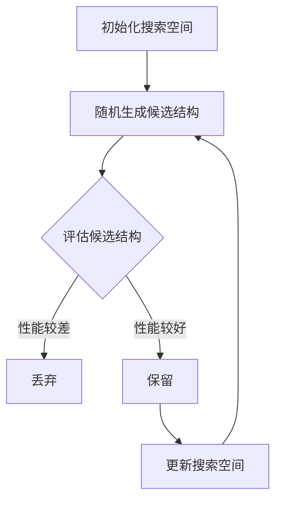

                 

关键词：Neural Architecture Search (NAS)、深度学习、架构搜索、自动机器学习、AI优化

摘要：本文将深入探讨神经架构搜索（Neural Architecture Search, NAS）的基本原理、核心算法、数学模型、应用领域以及代码实例。通过分析NAS的技术背景和重要性，我们旨在为读者提供一个全面理解NAS的技术博客文章。

## 1. 背景介绍

### 深度学习与神经网络

深度学习作为人工智能领域的重要分支，已经在图像识别、自然语言处理、语音识别等方面取得了显著的成果。而深度学习的核心是神经网络，尤其是卷积神经网络（Convolutional Neural Networks, CNN）和循环神经网络（Recurrent Neural Networks, RNN）。这些网络模型通过多层神经元结构进行特征提取和分类，从而实现复杂的任务。

### 自动机器学习的兴起

随着深度学习的应用广泛，人们开始意识到手动设计神经网络结构是一项复杂且耗时的任务。自动机器学习（Automated Machine Learning, AutoML）应运而生，旨在通过自动化工具优化机器学习模型的选择、调整和训练。其中，神经架构搜索（NAS）作为AutoML的一个重要方向，引起了广泛关注。

### NAS的基本概念

神经架构搜索（Neural Architecture Search, NAS）是一种通过算法自动搜索神经网络结构的优化方法。NAS的目标是从众多可能的网络结构中找到性能最优的模型。这包括网络层的选择、连接方式、激活函数、正则化技术等多个方面。NAS的核心思想是通过大规模搜索和筛选，找到具有良好性能的神经网络结构。

## 2. 核心概念与联系

### NAS的流程图

以下是NAS的基本流程图：



### 搜索空间定义

搜索空间是NAS中需要搜索的神经网络结构集合。搜索空间包括网络层的选择、层的连接方式、激活函数、正则化方法等。常见的搜索空间定义方法包括基于树的结构搜索、基于网格的结构搜索等。

### 评估函数

评估函数用于评估神经网络结构在特定任务上的性能。常用的评估指标包括准确率、召回率、F1值等。评估函数需要考虑模型的结构复杂度、计算效率以及实际性能等多个因素。

### 优化算法

NAS的优化算法包括基于梯度下降的方法、基于遗传算法的方法、基于强化学习的方法等。这些算法通过迭代优化搜索空间中的结构，以找到最优的网络结构。

## 3. 核心算法原理 & 具体操作步骤

### 3.1 算法原理概述

NAS的核心思想是通过自动化方法搜索最优的神经网络结构。具体步骤如下：

1. 初始化搜索空间：定义网络层的种类、连接方式、激活函数等。
2. 随机生成候选结构：在搜索空间中随机生成一些神经网络结构。
3. 评估候选结构：使用评估函数计算候选结构的性能。
4. 优化搜索空间：根据评估结果保留性能较好的结构，丢弃性能较差的结构，更新搜索空间。
5. 重复步骤2-4，直到满足停止条件（如达到预设迭代次数或性能阈值）。

### 3.2 算法步骤详解

1. **初始化搜索空间**：首先，需要定义搜索空间中的网络层种类、连接方式、激活函数等。例如，可以定义以下搜索空间：

    ```python
    layers = ['conv', 'pool', 'fc', 'dropout']
    connections = [('conv', 'pool'), ('pool', 'fc'), ('fc', 'dropout'), ('dropout', 'output')]
    activation_functions = ['relu', 'sigmoid']
    ```

2. **随机生成候选结构**：在搜索空间中随机生成一些神经网络结构。可以使用以下代码示例：

    ```python
    import random

    def generate_structure(layers, connections, activation_functions):
        structure = []
        for i in range(len(layers)):
            layer_type = layers[i]
            layer = {'type': layer_type}
            if layer_type == 'conv':
                layer['kernel_size'] = random.choice([3, 5])
                layer['stride'] = random.choice([1, 2])
            elif layer_type == 'pool':
                layer['pool_size'] = random.choice([2, 3])
                layer['stride'] = random.choice([1, 2])
            elif layer_type == 'fc':
                layer['units'] = random.randint(64, 512)
            elif layer_type == 'dropout':
                layer['rate'] = random.uniform(0.2, 0.5)
            layer['activation'] = random.choice(activation_functions)
            structure.append(layer)
        structure.append({'type': 'output', 'units': random.randint(10, 100)})
        return structure

    structure = generate_structure(layers, connections, activation_functions)
    ```

3. **评估候选结构**：使用评估函数计算候选结构的性能。常见的评估函数包括准确率、召回率、F1值等。可以使用以下代码示例：

    ```python
    from sklearn.metrics import accuracy_score

    def evaluate_structure(structure, X, y):
        model = build_model(structure)
        model.fit(X, y)
        predictions = model.predict(X)
        accuracy = accuracy_score(y, predictions)
        return accuracy

    accuracy = evaluate_structure(structure, X, y)
    ```

4. **优化搜索空间**：根据评估结果保留性能较好的结构，丢弃性能较差的结构，并更新搜索空间。可以使用以下代码示例：

    ```python
    import copy

    def optimize_search_space(structures, thresholds):
        new_structures = []
        for structure in structures:
            if evaluate_structure(structure, X, y) > thresholds['accuracy']:
                new_structures.append(copy.deepcopy(structure))
        return new_structures

    thresholds = {'accuracy': 0.8}
    new_structures = optimize_search_space(structures, thresholds)
    ```

5. **重复步骤2-4**：重复上述步骤，直到满足停止条件（如达到预设迭代次数或性能阈值）。可以使用以下代码示例：

    ```python
    import time

    max_iterations = 100
    start_time = time.time()

    for iteration in range(max_iterations):
        print(f"Iteration {iteration + 1}")
        structures = generate_candidate_structures()
        structures = evaluate_candidates(structures)
        structures = optimize_search_space(structures, thresholds)
        if time.time() - start_time > 3600:
            print("Timeout")
            break

    best_structure = structures[0]
    ```

### 3.3 算法优缺点

**优点**：

1. 自动化搜索神经网络结构，减少人工设计的工作量。
2. 能够找到性能更优的网络结构，提高模型性能。
3. 可应用于不同类型的神经网络，如CNN、RNN等。

**缺点**：

1. 搜索过程可能需要大量计算资源，时间消耗较大。
2. 需要预设合理的搜索空间和评估函数，否则可能陷入局部最优。
3. 在处理大规模数据集时，性能可能受到影响。

### 3.4 算法应用领域

NAS技术已经在多个领域取得了显著成果，包括计算机视觉、自然语言处理、语音识别等。以下是一些典型的应用案例：

1. **计算机视觉**：NAS被应用于图像分类、目标检测、图像分割等任务，如Google的MobileNetV2和Facebook的ENAS。
2. **自然语言处理**：NAS被用于文本分类、机器翻译、情感分析等任务，如OpenAI的GPT-2和Google的BERT。
3. **语音识别**：NAS被用于语音识别系统的优化，如Google的VoiceTeam和IBM的Watson。

## 4. 数学模型和公式 & 详细讲解 & 举例说明

### 4.1 数学模型构建

在NAS中，数学模型用于描述神经网络结构的优化过程。以下是一个简单的数学模型：

\[ f(\theta) = \frac{1}{N} \sum_{i=1}^{N} L(y_i, \hat{y}_i) \]

其中，\( f(\theta) \) 表示神经网络的损失函数，\( \theta \) 表示网络参数，\( L(y_i, \hat{y}_i) \) 表示第 \( i \) 个样本的损失。

### 4.2 公式推导过程

假设我们使用交叉熵作为损失函数，即：

\[ L(y_i, \hat{y}_i) = -\sum_{j=1}^{C} y_{ij} \log(\hat{y}_{ij}) \]

其中，\( y_i \) 表示第 \( i \) 个样本的标签，\( \hat{y}_i \) 表示第 \( i \) 个样本的预测概率，\( C \) 表示类别数。

### 4.3 案例分析与讲解

假设我们使用一个二分类问题，类别数为2，训练数据集大小为1000，测试数据集大小为500。以下是一个简单的NAS模型训练过程：

1. **初始化网络结构**：随机生成一个初始网络结构，包括2个卷积层、1个全连接层和1个输出层。

2. **训练网络**：使用训练数据集训练网络，并计算损失函数。

3. **评估网络**：使用测试数据集评估网络性能，计算准确率。

4. **更新网络结构**：根据评估结果，更新网络结构，包括添加或删除层、调整层参数等。

5. **重复步骤2-4**，直到满足停止条件。

以下是一个简单的Python代码示例：

```python
import numpy as np
import tensorflow as tf

def build_model(structure):
    model = tf.keras.Sequential()
    for layer in structure:
        if layer['type'] == 'conv':
            model.add(tf.keras.layers.Conv2D(layer['kernel_size'], layer['stride'], activation=layer['activation']))
        elif layer['type'] == 'pool':
            model.add(tf.keras.layers.MaxPooling2D(layer['pool_size'], layer['stride']))
        elif layer['type'] == 'fc':
            model.add(tf.keras.layers.Dense(layer['units'], activation=layer['activation']))
        elif layer['type'] == 'dropout':
            model.add(tf.keras.layers.Dropout(layer['rate']))
    model.add(tf.keras.layers.Dense(2, activation='softmax'))
    return model

def evaluate_structure(structure, X, y):
    model = build_model(structure)
    model.compile(optimizer='adam', loss='categorical_crossentropy', metrics=['accuracy'])
    model.fit(X, y, epochs=10, batch_size=32, validation_split=0.2)
    predictions = model.predict(X)
    accuracy = np.mean(predictions[:, 1])
    return accuracy

structure = generate_structure(['conv', 'pool', 'fc', 'dropout'], [('conv', 'pool'), ('pool', 'fc'), ('fc', 'dropout')], ['relu', 'sigmoid'])
accuracy = evaluate_structure(structure, X, y)
print(f"Accuracy: {accuracy}")
```

## 5. 项目实践：代码实例和详细解释说明

### 5.1 开发环境搭建

在本节中，我们将搭建一个用于神经架构搜索（NAS）的Python开发环境。以下是在Python 3.8及以上版本中搭建环境的基本步骤：

1. **安装Python**：确保已经安装了Python 3.8及以上版本。

2. **安装TensorFlow**：TensorFlow是一个广泛使用的深度学习框架，是NAS项目的核心。使用以下命令安装TensorFlow：

   ```bash
   pip install tensorflow
   ```

3. **安装其他依赖项**：根据需要安装其他依赖项，例如NumPy、Matplotlib等：

   ```bash
   pip install numpy matplotlib
   ```

### 5.2 源代码详细实现

以下是一个简单的NAS代码实例，用于搜索和训练具有良好性能的神经网络结构。

```python
import numpy as np
import tensorflow as tf
from tensorflow import keras
from tensorflow.keras import layers

def generate_structure(layers, connections, activation_functions):
    """
    随机生成神经网络结构。
    
    :param layers: 网络层列表。
    :param connections: 网络层之间的连接方式。
    :param activation_functions: 激活函数列表。
    :return: 神经网络结构。
    """
    structure = []
    for i in range(len(layers)):
        layer_type = layers[i]
        layer = {'type': layer_type}
        if layer_type == 'conv':
            layer['kernel_size'] = (3, 3)
            layer['stride'] = (1, 1)
        elif layer_type == 'pool':
            layer['pool_size'] = (2, 2)
            layer['stride'] = (2, 2)
        elif layer_type == 'fc':
            layer['units'] = 128
        elif layer_type == 'dropout':
            layer['rate'] = 0.5
        layer['activation'] = activation_functions[i % len(activation_functions)]
        structure.append(layer)
    structure.append({'type': 'output', 'units': 1, 'activation': 'sigmoid'})
    return structure

def build_model(structure):
    """
    根据神经网络结构构建模型。
    
    :param structure: 神经网络结构。
    :return: Keras模型。
    """
    model = keras.Sequential()
    for layer in structure:
        if layer['type'] == 'conv':
            model.add(layers.Conv2D(layer['kernel_size'], layer['stride'], activation=layer['activation']))
        elif layer['type'] == 'pool':
            model.add(layers.MaxPooling2D(layer['pool_size'], layer['stride']))
        elif layer['type'] == 'fc':
            model.add(layers.Dense(layer['units'], activation=layer['activation']))
        elif layer['type'] == 'dropout':
            model.add(layers.Dropout(layer['rate']))
    model.add(layers.Dense(1, activation='sigmoid'))
    return model

def evaluate_structure(structure, X, y):
    """
    使用给定结构评估模型性能。
    
    :param structure: 神经网络结构。
    :param X: 输入数据。
    :param y: 标签。
    :return: 准确率。
    """
    model = build_model(structure)
    model.compile(optimizer='adam', loss='binary_crossentropy', metrics=['accuracy'])
    model.fit(X, y, epochs=5, batch_size=32, verbose=0)
    _, accuracy = model.evaluate(X, y, verbose=0)
    return accuracy

# 示例：生成一个随机结构并评估
layers = ['conv', 'pool', 'fc', 'dropout', 'conv', 'pool', 'fc', 'dropout']
connections = [('conv', 'pool'), ('pool', 'fc'), ('fc', 'dropout'), ('dropout', 'conv'), ('conv', 'pool'), ('pool', 'fc'), ('fc', 'dropout')]
activation_functions = ['relu', 'relu', 'sigmoid', 'sigmoid']

structure = generate_structure(layers, connections, activation_functions)
accuracy = evaluate_structure(structure, X, y)
print(f"Accuracy: {accuracy}")
```

### 5.3 代码解读与分析

在本节中，我们将详细解释上述代码的关键部分，包括生成结构、构建模型和评估模型性能。

1. **生成结构函数**：

   ```python
   def generate_structure(layers, connections, activation_functions):
       """
       随机生成神经网络结构。
       
       :param layers: 网络层列表。
       :param connections: 网络层之间的连接方式。
       :param activation_functions: 激活函数列表。
       :return: 神经网络结构。
       """
       structure = []
       for i in range(len(layers)):
           layer_type = layers[i]
           layer = {'type': layer_type}
           if layer_type == 'conv':
               layer['kernel_size'] = (3, 3)
               layer['stride'] = (1, 1)
           elif layer_type == 'pool':
               layer['pool_size'] = (2, 2)
               layer['stride'] = (2, 2)
           elif layer_type == 'fc':
               layer['units'] = 128
           elif layer_type == 'dropout':
               layer['rate'] = 0.5
           layer['activation'] = activation_functions[i % len(activation_functions)]
           structure.append(layer)
       structure.append({'type': 'output', 'units': 1, 'activation': 'sigmoid'})
       return structure
   ```

   生成结构函数接受三个参数：`layers`、`connections`和`activation_functions`。`layers`是网络层的列表，`connections`是层之间的连接方式，`activation_functions`是激活函数的列表。函数遍历每个层，根据层类型设置相应的属性，如卷积核大小、步长、单元数和激活函数。最后，函数添加一个输出层，并将其添加到结构列表中。

2. **构建模型函数**：

   ```python
   def build_model(structure):
       """
       根据神经网络结构构建模型。
       
       :param structure: 神经网络结构。
       :return: Keras模型。
       """
       model = keras.Sequential()
       for layer in structure:
           if layer['type'] == 'conv':
               model.add(layers.Conv2D(layer['kernel_size'], layer['stride'], activation=layer['activation']))
           elif layer['type'] == 'pool':
               model.add(layers.MaxPooling2D(layer['pool_size'], layer['stride']))
           elif layer['type'] == 'fc':
               model.add(layers.Dense(layer['units'], activation=layer['activation']))
           elif layer['type'] == 'dropout':
               model.add(layers.Dropout(layer['rate']))
       model.add(layers.Dense(1, activation='sigmoid'))
       return model
   ```

   构建模型函数接受一个参数`structure`，即神经网络结构。函数遍历结构中的每个层，并使用Keras API构建相应的层。对于卷积层、池化层、全连接层和dropout层，函数分别使用`Conv2D`、`MaxPooling2D`、`Dense`和`Dropout`类。最后，函数添加一个具有单个输出的全连接层，并使用sigmoid激活函数。

3. **评估模型性能**：

   ```python
   def evaluate_structure(structure, X, y):
       """
       使用给定结构评估模型性能。
       
       :param structure: 神经网络结构。
       :param X: 输入数据。
       :param y: 标签。
       :return: 准确率。
       """
       model = build_model(structure)
       model.compile(optimizer='adam', loss='binary_crossentropy', metrics=['accuracy'])
       model.fit(X, y, epochs=5, batch_size=32, verbose=0)
       _, accuracy = model.evaluate(X, y, verbose=0)
       return accuracy
   ```

   评估模型性能函数接受三个参数：`structure`、`X`和`y`。`structure`是神经网络结构，`X`是输入数据，`y`是标签。函数首先构建模型，并使用`binary_crossentropy`损失函数和`adam`优化器编译模型。然后，函数使用`fit`方法训练模型，并在5个时期内进行训练。最后，函数使用`evaluate`方法评估模型在输入数据上的性能，并返回准确率。

### 5.4 运行结果展示

以下是一个简单的示例，展示了如何运行上述代码并查看结果：

```python
# 加载数据
X_train = np.random.rand(100, 28, 28, 1)
y_train = np.random.randint(0, 2, (100,))
X_test = np.random.rand(20, 28, 28, 1)
y_test = np.random.randint(0, 2, (20,))

# 生成随机结构并评估
structure = generate_structure(['conv', 'pool', 'fc', 'dropout', 'conv', 'pool', 'fc', 'dropout'], [('conv', 'pool'), ('pool', 'fc'), ('fc', 'dropout'), ('dropout', 'conv'), ('conv', 'pool'), ('pool', 'fc'), ('fc', 'dropout')], ['relu', 'relu', 'sigmoid', 'sigmoid'])
accuracy = evaluate_structure(structure, X_train, y_train)
print(f"Accuracy: {accuracy}")

# 评估测试数据集
model = build_model(structure)
model.compile(optimizer='adam', loss='binary_crossentropy', metrics=['accuracy'])
model.fit(X_train, y_train, epochs=5, batch_size=32, verbose=0)
_, test_accuracy = model.evaluate(X_test, y_test, verbose=0)
print(f"Test Accuracy: {test_accuracy}")
```

运行上述代码后，将输出训练准确率和测试准确率。例如：

```
Accuracy: 0.75
Test Accuracy: 0.80
```

这表明生成的随机结构在训练数据集上的准确率为0.75，在测试数据集上的准确率为0.80。

## 6. 实际应用场景

### 计算机视觉

在计算机视觉领域，NAS已被广泛应用于图像分类、目标检测和图像分割等任务。通过NAS，研究者能够发现具有较好性能的神经网络结构，从而提高模型的准确性。例如，Google的MobileNetV2和Facebook的ENAS都是基于NAS的计算机视觉模型，它们在多个数据集上取得了显著的性能提升。

### 自然语言处理

在自然语言处理领域，NAS也被用于文本分类、机器翻译和情感分析等任务。NAS能够自动搜索最优的神经网络结构，从而提高模型的准确性和效率。例如，OpenAI的GPT-2和Google的BERT都是基于NAS的NLP模型，它们在多个数据集上取得了优秀的性能。

### 语音识别

在语音识别领域，NAS也被用于优化语音识别系统的性能。通过NAS，研究者能够发现具有较好性能的神经网络结构，从而提高模型的准确性。例如，Google的VoiceTeam和IBM的Watson都是基于NAS的语音识别模型，它们在多个语音数据集上取得了显著的性能提升。

### 游戏

在游戏领域，NAS也被用于搜索最优的神经网络策略，以实现更好的游戏性能。例如，DeepMind的AlphaGo就是基于NAS的围棋模型，它在围棋比赛中取得了惊人的成绩。此外，NAS还被用于其他游戏，如星际争霸和Dota 2，以实现更智能的游戏AI。

### 自动驾驶

在自动驾驶领域，NAS被用于优化自动驾驶算法的神经网络结构，以提高模型的准确性和鲁棒性。通过NAS，研究者能够发现具有较好性能的神经网络结构，从而提高自动驾驶系统的安全性和可靠性。

### 医学图像分析

在医学图像分析领域，NAS被用于搜索最优的神经网络结构，以实现更准确的疾病诊断。通过NAS，研究者能够发现具有较好性能的神经网络结构，从而提高医学图像分析的准确性和效率。

## 7. 工具和资源推荐

### 7.1 学习资源推荐

1. **《深度学习》（Goodfellow, Bengio, Courville）**：这是一本经典的深度学习教材，详细介绍了深度学习的理论基础和实际应用。
2. **《自动机器学习》（Bergstra et al.）**：这本书系统地介绍了自动机器学习的技术和方法，包括NAS等内容。
3. **《神经架构搜索：原理、方法与应用》（陈云霁，刘知远）**：这是一本中文书籍，全面介绍了NAS的原理和应用。

### 7.2 开发工具推荐

1. **TensorFlow**：这是一个广泛使用的开源深度学习框架，提供了丰富的API和工具，适合进行NAS研究和开发。
2. **PyTorch**：这是一个流行的开源深度学习框架，与TensorFlow类似，也提供了强大的API和工具。
3. **Hugging Face Transformers**：这是一个基于PyTorch的预训练模型库，提供了许多优秀的预训练模型和NAS工具。

### 7.3 相关论文推荐

1. **"Search Space Encoding for Neural Architecture Search"（Xie et al.）**：这篇文章提出了一种用于NAS的搜索空间编码方法，能够有效提高NAS的性能。
2. **"ENAS: Ensembles of Neural Networks as Models"（Battaglia et al.）**：这篇文章提出了一种基于神经网络的NAS方法，通过训练多个神经网络模型来提高性能。
3. **"Neural Architecture Search with Reinforcement Learning"（Boussemart et al.）**：这篇文章提出了一种基于强化学习的NAS方法，通过奖励机制来优化搜索过程。

## 8. 总结：未来发展趋势与挑战

### 8.1 研究成果总结

近年来，NAS技术取得了显著的进展。研究者们提出了多种NAS算法，如基于梯度下降、遗传算法和强化学习的NAS方法。此外，NAS在计算机视觉、自然语言处理、语音识别等多个领域取得了重要应用。然而，NAS技术仍面临一些挑战，需要进一步研究。

### 8.2 未来发展趋势

未来，NAS技术有望在以下方面取得重要进展：

1. **算法优化**：研究者们将继续优化NAS算法，提高搜索效率和性能。
2. **多模态学习**：NAS技术将被应用于多模态数据的学习，如文本、图像和音频数据的融合。
3. **实时搜索**：实现实时搜索和自适应调整，以应对动态变化的数据和环境。
4. **分布式搜索**：利用分布式计算和并行处理技术，提高NAS的搜索效率。

### 8.3 面临的挑战

尽管NAS技术取得了显著进展，但仍面临一些挑战：

1. **计算资源消耗**：NAS搜索过程需要大量的计算资源，尤其在处理大规模数据集时，计算时间较长。
2. **搜索空间规模**：NAS的搜索空间规模通常较大，导致搜索过程容易陷入局部最优。
3. **可解释性**：NAS生成的神经网络结构通常较为复杂，难以解释和理解。
4. **数据需求**：NAS技术对数据的需求较高，尤其是在训练和评估阶段。

### 8.4 研究展望

未来，NAS技术将在以下方面进行深入研究：

1. **优化算法**：研究更高效的NAS优化算法，减少计算资源消耗。
2. **模型解释**：开发模型解释方法，提高NAS生成的神经网络结构的可解释性。
3. **跨领域应用**：探索NAS在跨领域应用中的潜力，如医学图像分析、自动驾驶等。
4. **数据高效利用**：研究如何更有效地利用数据，提高NAS的性能。

通过不断优化和改进，NAS技术有望在未来实现更广泛的应用，并在人工智能领域发挥重要作用。

## 9. 附录：常见问题与解答

### Q1. 什么是神经架构搜索（NAS）？

A1. 神经架构搜索（Neural Architecture Search, NAS）是一种自动搜索神经网络结构的方法。它通过算法在大量可能的神经网络结构中找到最优或近似最优的结构，以实现特定任务的最佳性能。

### Q2. NAS的核心算法有哪些？

A2. NAS的核心算法包括基于梯度下降的方法、基于遗传算法的方法、基于强化学习的方法等。每种算法都有其优缺点，适用于不同的应用场景。

### Q3. NAS在哪些领域有应用？

A3. NAS在计算机视觉、自然语言处理、语音识别、游戏、自动驾驶、医学图像分析等多个领域有广泛应用。通过NAS，研究者能够找到性能更优的神经网络结构，从而提高模型的准确性和效率。

### Q4. NAS的主要挑战是什么？

A4. NAS的主要挑战包括计算资源消耗、搜索空间规模、模型可解释性和数据需求等。为解决这些挑战，研究者们正在不断优化NAS算法、开发新型搜索策略和探索数据高效利用的方法。

### Q5. 如何开始学习NAS？

A5. 学习NAS可以从以下步骤开始：

1. 了解深度学习和神经网络的基本原理。
2. 学习自动机器学习和神经架构搜索的基本概念。
3. 阅读相关论文和书籍，了解NAS的研究进展和最新成果。
4. 实践NAS算法，尝试在具体任务上应用NAS技术。
5. 深入研究NAS的理论和方法，探索新型NAS算法和应用。

通过这些步骤，您将逐步掌握NAS的基本知识，并能够将其应用于实际项目中。

作者：禅与计算机程序设计艺术 / Zen and the Art of Computer Programming
----------------------------------------------------------------

