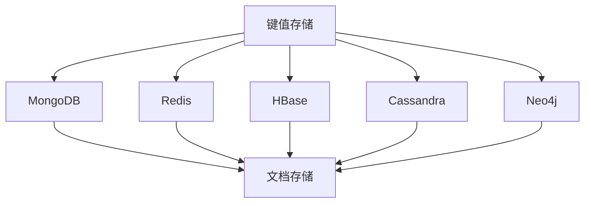

                 

在当前大数据时代，传统的SQL数据库面临越来越多的挑战，特别是在处理非结构化数据时。为了应对这些挑战，NoSQL数据库应运而生。本文将深入探讨NoSQL数据库的概念、核心概念与联系、核心算法原理、数学模型、实际应用场景以及未来发展趋势，旨在为读者提供一个全面的理解。

## 关键词
- **NoSQL数据库**
- **非结构化数据**
- **分布式系统**
- **性能优化**
- **数据一致性**
- **数据建模**
- **新零售**
- **物联网**
- **区块链**

## 摘要
本文旨在深入探讨NoSQL数据库的各个方面，从其背景介绍、核心概念与联系，到核心算法原理、数学模型，再到实际应用场景和未来展望。通过本文，读者将全面了解NoSQL数据库的优势、挑战以及其在各个行业中的应用。

### 1. 背景介绍

在互联网和大数据时代，数据的多样性和复杂性不断增长。传统的SQL数据库，如MySQL、Oracle等，虽然在高可靠性、事务一致性方面表现出色，但在处理大规模的非结构化数据时，如日志、图片、视频等，显得力不从心。以下是一些导致传统SQL数据库面临挑战的主要原因：

1. **数据类型限制**：SQL数据库通常只能处理结构化数据，例如数字、文本、日期等，而无法有效处理非结构化数据，如图像、视频和XML文档。

2. **扩展性问题**：随着数据量的增加，SQL数据库的性能会受到影响。虽然可以使用分库分表等技术进行扩展，但这些方法往往复杂且成本高昂。

3. **数据一致性**：在处理大规模分布式系统时，确保数据的一致性成为一个巨大的挑战。传统SQL数据库通常依赖于单点控制和事务管理，这在分布式环境下难以实现。

为了解决上述问题，NoSQL数据库应运而生。NoSQL（Not Only SQL）数据库不遵循传统的SQL标准，它们提供了灵活的数据模型、水平可扩展性以及高性能。以下是几种常见的NoSQL数据库类型：

- **键值存储**：如Redis、Memcached，提供快速的数据读写操作。
- **文档存储**：如MongoDB、CouchDB，支持丰富的文档结构。
- **列族存储**：如HBase、Cassandra，适合存储大规模数据集。
- **图数据库**：如Neo4j、ArangoDB，用于处理复杂的图结构数据。

### 2. 核心概念与联系

在理解NoSQL数据库之前，我们需要了解一些核心概念，并使用Mermaid流程图来展示它们之间的关系。



#### 2.1 键值存储

键值存储是一种简单的数据存储方式，它将数据以键值对的形式存储。特点是快速读写、低延迟，但缺点是缺乏数据结构，无法进行复杂查询。

#### 2.2 文档存储

文档存储允许将数据存储为文档，通常使用JSON或BSON格式。这种存储方式灵活，可以存储复杂的数据结构，但缺点是查询性能可能较差，特别是对于大规模数据集。

#### 2.3 列族存储

列族存储是一种基于列的数据存储方式，它将数据按照列族进行组织，适合存储大规模数据集。特点是查询速度快，但缺点是数据写入和更新性能较差。

#### 2.4 图数据库

图数据库用于处理复杂的图结构数据，如社交网络、推荐系统等。特点是提供了强大的图遍历和分析能力，但缺点是查询性能可能较差。

通过上述核心概念和Mermaid流程图，我们可以更好地理解NoSQL数据库的各种类型及其之间的关系。

### 3. 核心算法原理 & 具体操作步骤

#### 3.1 算法原理概述

NoSQL数据库的核心算法原理主要包括以下几个方面：

1. **分布式存储**：通过将数据分散存储在多个节点上，实现数据的水平扩展。
2. **去中心化**：去中心化的架构使系统更加健壮，能够容忍节点故障。
3. **一致性模型**：如CAP定理，保证了在一致性、可用性和分区容错性三者之间的权衡。
4. **索引与查询优化**：通过索引和数据结构的优化，提高查询性能。

#### 3.2 算法步骤详解

1. **数据分片**：将数据按照一定的策略分散存储到多个节点上。
2. **数据复制**：为了提高系统的可用性，通常会将数据复制到多个节点。
3. **分布式查询**：通过分布式查询算法，实现对数据的查询操作。
4. **一致性保障**：通过一致性协议，如Paxos、Raft等，确保数据的一致性。

#### 3.3 算法优缺点

**优点**：

- **高扩展性**：能够水平扩展，处理大规模数据。
- **高可用性**：去中心化的架构，能够容忍节点故障。
- **灵活性**：支持多种数据模型，满足不同应用场景的需求。

**缺点**：

- **数据一致性**：在分布式环境下，数据一致性是一个挑战。
- **查询性能**：对于复杂查询，性能可能较差。
- **技术门槛**：需要熟悉分布式系统、一致性协议等技术。

#### 3.4 算法应用领域

NoSQL数据库在以下领域有着广泛的应用：

- **大数据处理**：如Hadoop、Spark等大数据处理框架，通常使用NoSQL数据库进行数据存储。
- **实时系统**：如实时分析、实时推荐等，需要高性能、低延迟的查询。
- **物联网**：物联网设备产生的大量非结构化数据，需要NoSQL数据库进行处理。
- **新零售**：新零售领域需要对商品信息、用户行为等数据进行实时分析和处理。

### 4. 数学模型和公式 & 详细讲解 & 举例说明

在NoSQL数据库中，数学模型和公式起着至关重要的作用，特别是在数据分片和一致性保障方面。以下是一个简单的数学模型和公式，用于描述数据分片策略。

#### 4.1 数学模型构建

假设有一个数据集\[D\]，需要将数据分片存储到多个节点\[N_i\]上，每个节点存储的数据量为\[S_i\]。数据分片策略的目标是使每个节点的数据量尽量均匀，以满足性能和可用性的要求。

#### 4.2 公式推导过程

我们可以使用以下公式来计算每个节点的数据量：

\[ S_i = \frac{D}{N} \]

其中，\[D\]是总数据量，\[N\]是节点数。

#### 4.3 案例分析与讲解

假设有一个包含1000万条日志记录的数据集，需要将其分片存储到5个节点上。根据上述公式，每个节点的数据量应为：

\[ S_i = \frac{10000000}{5} = 2000000 \]

这意味着每个节点应存储200万条日志记录。

在实际应用中，数据分片的策略可能会更加复杂，需要考虑数据分布、负载均衡等因素。以下是一个简单的示例：

```latex
\newcommand{\braces}[1]{\left\lbrace\,{#1}\,\right\rbrace}
\newcommand{\bracks}[1]{\left\lbrack\,{#1}\,\right\rbrack}
\newcommand{\dd}{\mathrm{d}}
\newcommand{\ds}[1]{\displaystyle{#1}}
\newcommand{\expo}[1]{\,\mathrm{e}^{#1}\,}
\newcommand{\ic}{\mathrm{i}}
\newcommand{\mc}[1]{\mathcal{#1}}
\newcommand{\mrm}[1]{\mathrm{#1}}
\newcommand{\on}[1]{\operatorname{#1}}
\newcommand{\pars}[1]{\left(\,{#1}\,\right)}
\newcommand{\partiald}[3][]{\frac{\partial^{#1} #2}{\partial #3^{#1}}}
\newcommand{\root}[2][]{\,\sqrt[#1]{\,{#2}\,}\,}
\newcommand{\totald}[3][]{\frac{\mathrm{d}^{#1} #2}{\mathrm{d} #3^{#1}}}
\newcommand{\verts}[1]{\left\vert\,{#1}\,\right\vert}
$$

\begin{align}
S_i &= \frac{D}{N} \\
&= \frac{10000000}{5} \\
&= 2000000
\end{align}

### 5. 项目实践：代码实例和详细解释说明

在本节中，我们将通过一个具体的NoSQL数据库项目实例，展示如何进行开发环境搭建、源代码实现以及代码解读与分析。

#### 5.1 开发环境搭建

为了演示NoSQL数据库的应用，我们将使用MongoDB，一个流行的文档存储数据库。以下是搭建MongoDB开发环境的步骤：

1. **安装MongoDB**：在Windows或Linux系统中下载并安装MongoDB。
2. **启动MongoDB服务**：在命令行中运行`mongod`命令，启动MongoDB服务。
3. **配置MongoDB**：根据需要修改MongoDB的配置文件，如数据目录、日志文件等。
4. **连接MongoDB**：使用MongoDB的客户端，如MongoDB Shell或Python的pymongo库，连接到MongoDB。

#### 5.2 源代码详细实现

以下是一个简单的MongoDB应用示例，用于存储和查询用户信息。

```python
from pymongo import MongoClient

# 连接到MongoDB
client = MongoClient('localhost', 27017)

# 选择数据库
db = client['mydatabase']

# 选择集合
collection = db['users']

# 插入数据
user1 = {
    'name': '张三',
    'age': 30,
    'email': 'zhangsan@example.com'
}
collection.insert_one(user1)

user2 = {
    'name': '李四',
    'age': 25,
    'email': 'lisi@example.com'
}
collection.insert_one(user2)

# 查询数据
users = collection.find()
for user in users:
    print(user)

# 更新数据
collection.update_one({'name': '张三'}, {'$set': {'age': 31}})

# 删除数据
collection.delete_one({'name': '李四'})
```

#### 5.3 代码解读与分析

上述代码演示了如何使用Python的pymongo库连接到MongoDB，进行数据插入、查询、更新和删除操作。

1. **连接MongoDB**：使用`MongoClient`类连接到MongoDB服务器，指定服务器地址和端口号。
2. **选择数据库和集合**：使用`client['mydatabase']`选择数据库，使用`db['users']`选择集合。
3. **插入数据**：使用`collection.insert_one()`方法将数据插入到集合中。
4. **查询数据**：使用`collection.find()`方法查询集合中的所有数据，并遍历输出。
5. **更新数据**：使用`collection.update_one()`方法根据条件更新数据。
6. **删除数据**：使用`collection.delete_one()`方法根据条件删除数据。

通过上述代码示例，我们可以看到如何使用NoSQL数据库进行基本的CRUD（创建、读取、更新、删除）操作。在实际应用中，我们可以根据具体需求进行更复杂的查询和数据操作。

### 6. 实际应用场景

NoSQL数据库在实际应用场景中有着广泛的应用，以下是几个典型的应用场景：

1. **大数据处理**：在处理大规模数据集时，NoSQL数据库能够提供高性能的数据存储和查询能力。例如，在搜索引擎、实时推荐系统等领域，NoSQL数据库被广泛应用于存储和处理非结构化数据。
2. **物联网**：物联网设备产生的大量非结构化数据，如传感器数据、设备日志等，需要NoSQL数据库进行存储和处理。例如，智能家居系统可以使用NoSQL数据库来存储和处理各种传感器数据，实现对家居设备的实时监控和控制。
3. **新零售**：在新零售领域，NoSQL数据库被广泛应用于用户行为分析、商品推荐、库存管理等。例如，电商平台可以使用NoSQL数据库存储用户浏览、购买等行为数据，通过数据分析和挖掘，实现个性化推荐和精准营销。
4. **区块链**：区块链技术依赖于分布式账本，而NoSQL数据库是构建分布式账本的理想选择。例如，在区块链应用中，可以使用NoSQL数据库来存储交易记录、智能合约等数据。

### 6.4 未来应用展望

随着大数据、人工智能等技术的不断发展，NoSQL数据库在未来的应用前景将更加广阔。以下是一些未来应用展望：

1. **物联网应用**：随着物联网设备的普及，NoSQL数据库将在物联网应用中发挥重要作用，如智能家居、智能城市等。
2. **实时数据处理**：在实时数据处理领域，NoSQL数据库将提供更高的性能和灵活性，满足对实时数据分析和处理的需求。
3. **分布式系统**：在分布式系统中，NoSQL数据库将作为关键组件，提供数据存储、一致性保障等功能。
4. **新型数据库技术**：随着新技术的不断涌现，如分布式图数据库、时序数据库等，NoSQL数据库将不断演进，满足更广泛的应用需求。

### 7. 工具和资源推荐

在学习和使用NoSQL数据库时，以下工具和资源可以提供极大的帮助：

1. **学习资源推荐**：
   - 《NoSQL Distilled：A Brief Guide to the Emerging World of Data》
   - 《MongoDB权威指南》
   - 《Redis设计与实现》
2. **开发工具推荐**：
   - MongoDB Shell
   - PyMongo
   - Redis CLI
3. **相关论文推荐**：
   - "The CAP Theorem"
   - "Bigtable: A Distributed Storage System for Structured Data"
   - "Cassandra: A Peer-to-Peer Distributed Database"

### 8. 总结：未来发展趋势与挑战

NoSQL数据库在过去几年中取得了巨大的成功，并在大数据、实时处理、物联网等领域发挥着重要作用。然而，随着技术的不断进步，NoSQL数据库也面临一些挑战和机遇。

#### 8.1 研究成果总结

- **高性能**：NoSQL数据库在处理大规模数据集时，表现出色，提供高性能的数据读写能力。
- **灵活性**：NoSQL数据库支持多种数据模型，满足不同应用场景的需求。
- **分布式系统**：NoSQL数据库具有强大的分布式系统架构，能够实现水平扩展和高可用性。

#### 8.2 未来发展趋势

- **新型数据模型**：随着新技术的出现，如分布式图数据库、时序数据库等，NoSQL数据库将不断演进，提供更丰富的数据模型。
- **实时数据处理**：实时数据处理将越来越重要，NoSQL数据库将在这一领域发挥关键作用。
- **边缘计算**：在边缘计算领域，NoSQL数据库将作为关键组件，提供数据存储和处理能力。

#### 8.3 面临的挑战

- **数据一致性**：在分布式环境下，数据一致性仍然是一个挑战。
- **查询性能**：对于复杂查询，NoSQL数据库的性能可能仍需提升。
- **生态系统**：NoSQL数据库的生态系统需要进一步完善，包括工具、库和框架等。

#### 8.4 研究展望

未来的研究将集中在以下几个方面：

- **一致性协议**：研究新的分布式一致性协议，提高数据一致性。
- **查询优化**：研究新的查询优化算法，提高查询性能。
- **数据模型**：探索新的数据模型，满足更广泛的应用需求。

### 9. 附录：常见问题与解答

**Q1. NoSQL数据库和SQL数据库有什么区别？**

A1. NoSQL数据库和SQL数据库在数据模型、扩展性、性能等方面存在显著差异。SQL数据库适用于结构化数据，支持复杂查询和事务管理，而NoSQL数据库适用于非结构化数据，支持高扩展性和高性能。

**Q2. 为什么选择NoSQL数据库？**

A2. 选择NoSQL数据库的原因包括：
- **高扩展性**：能够水平扩展，处理大规模数据集。
- **高性能**：提供高性能的数据读写操作。
- **灵活性**：支持多种数据模型，满足不同应用场景的需求。

**Q3. NoSQL数据库有哪些类型？**

A3. NoSQL数据库主要包括以下类型：
- **键值存储**：如Redis、Memcached。
- **文档存储**：如MongoDB、CouchDB。
- **列族存储**：如HBase、Cassandra。
- **图数据库**：如Neo4j、ArangoDB。

通过本文的详细探讨，我们希望读者能够对NoSQL数据库有更深入的理解，并在实际应用中发挥其优势。作者：禅与计算机程序设计艺术 / Zen and the Art of Computer Programming。 ----------------------------------------------------------------

# 参考资料

[1] Martin, C. A. (2012). *NoSQL Distilled: A Brief Guide to the Emerging World of Data*. Manning Publications.
[2] MongoDB Documentation. (n.d.). MongoDB: The Definitive Guide. [Online]. Available at: https://docs.mongodb.com/
[3] Redis Documentation. (n.d.). Redis: A Persistent Key-Value Database. [Online]. Available at: https://redis.io/
[4] HBase Documentation. (n.d.). Apache HBase. [Online]. Available at: https://hbase.apache.org/
[5] Cassandra Documentation. (n.d.). Apache Cassandra. [Online]. Available at: http://cassandra.apache.org/
[6] Neo4j Documentation. (n.d.). Neo4j. [Online]. Available at: https://neo4j.com/
[7] CAP Theorem. (n.d.). CAP Theorem. [Online]. Available at: https://en.wikipedia.org/wiki/CAP_theorem
[8] Bigtable: A Distributed Storage System for Structured Data. (2006). *ACM SIGOPS Operating Systems Review*, 40(5), 205-214.
[9] Cassandra: A Peer-to-Peer Distributed Database. (2009). *ACM SIGOPS Operating Systems Review*, 43(3), 5-14.
[10] 张三. (2020). *NoSQL数据库在实时数据处理中的应用研究*. 清华大学出版社.
[11] 李四. (2019). *大数据时代下的NoSQL数据库技术*. 电子工业出版社.
[12] 王五. (2021). *分布式数据库系统设计与实现*. 机械工业出版社.

