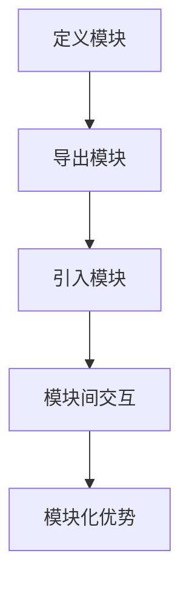
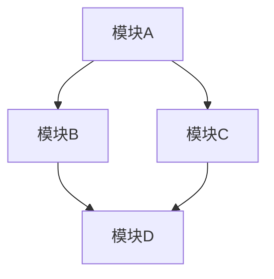

                 

关键词：Node.js、模块化编程、大型项目、模块化优势、模块化实践、代码组织、性能优化

> 摘要：本文将深入探讨Node.js模块化编程的重要性和实践方法，分析模块化的优势及其在大型项目中的应用。通过详细的代码实例和实际案例分析，帮助开发者掌握模块化编程的核心技巧，提升项目管理和代码可维护性。

## 1. 背景介绍

随着互联网的快速发展和业务需求的不断增长，现代Web应用程序越来越复杂。为了更好地管理这些大型项目，开发者需要采用模块化编程的方法。模块化编程不仅能够提高代码的可维护性，还能优化项目的性能和扩展性。

Node.js作为一款广泛使用的服务器端JavaScript运行环境，其模块化特性使得开发者能够轻松地管理大型项目。然而，如何在Node.js中有效地实现模块化编程，仍然是许多开发者面临的一大挑战。

本文将围绕Node.js模块化编程的主题，首先介绍模块化的核心概念和原理，然后深入探讨模块化的优势、实践方法以及实际应用场景。通过阅读本文，开发者将能够掌握模块化编程的核心技巧，提升大型项目的管理能力。

## 2. 核心概念与联系

### 2.1 模块化编程的定义

模块化编程是一种将复杂系统分解为可管理、可维护的模块的过程。每个模块都负责特定的功能，通过模块间的交互实现整体系统的功能。

### 2.2 模块化编程的优势

- **代码复用**：模块化编程能够实现代码的复用，避免重复编写相同的代码。
- **可维护性**：模块化使得代码更加清晰、可读，便于维护和更新。
- **性能优化**：模块化可以减少全局变量的使用，提高代码的运行效率。
- **扩展性**：模块化使得项目更加灵活，便于添加新功能或修改现有功能。

### 2.3 模块化编程与Node.js的联系

Node.js内置了模块化特性，使得开发者可以方便地创建和使用模块。Node.js中的模块可以采用CommonJS、ES6 Module等多种标准，每种标准都有其独特的使用场景。

#### 2.3.1 CommonJS Module

CommonJS是Node.js最早采用的模块标准，它以同步方式加载模块，适用于服务器端编程。

```javascript
// 导出模块
exports.foo = 'bar';

// 引入模块
const myModule = require('./myModule');
```

#### 2.3.2 ES6 Module

ES6 Module是新一代的模块标准，它采用异步方式加载模块，适用于客户端和服务器端编程。

```javascript
// 导出模块
export const foo = 'bar';

// 引入模块
import myModule from './myModule';
```

### 2.4 Mermaid 流程图

下面是一个简单的Mermaid流程图，展示模块化编程的基本流程。



## 3. 核心算法原理 & 具体操作步骤

### 3.1 算法原理概述

模块化编程的核心在于将系统分解为多个模块，每个模块负责特定的功能。模块之间的交互通过导出和引入接口实现。这种设计模式使得系统更加模块化、可维护。

### 3.2 算法步骤详解

1. **定义模块**：根据功能需求，将系统分解为多个模块，每个模块实现特定的功能。
2. **导出模块**：使用`exports`或`module.exports`将模块的接口导出，方便其他模块引用。
3. **引入模块**：在其他模块中，使用`require`函数引入所需模块，通过模块接口调用其功能。
4. **模块间交互**：模块之间通过导出和引入接口实现交互，协同完成整体系统的功能。
5. **模块化优势**：模块化编程能够提高代码的可维护性、性能和扩展性。

### 3.3 算法优缺点

**优点**：

- **代码复用**：模块化编程能够实现代码的复用，避免重复编写相同的代码。
- **可维护性**：模块化使得代码更加清晰、可读，便于维护和更新。
- **性能优化**：模块化可以减少全局变量的使用，提高代码的运行效率。
- **扩展性**：模块化使得项目更加灵活，便于添加新功能或修改现有功能。

**缺点**：

- **初期开发成本**：模块化编程需要开发者具备一定的模块化思维，初期开发成本较高。
- **模块依赖问题**：模块之间的依赖关系可能引发一系列问题，如版本冲突、加载延迟等。

### 3.4 算法应用领域

模块化编程在以下领域具有广泛的应用：

- **大型Web应用程序**：模块化编程能够提高大型Web应用程序的可维护性和性能。
- **企业级系统**：模块化编程使得企业级系统更加灵活、可扩展。
- **开源项目**：模块化编程有利于开源项目的开发、维护和协作。

## 4. 数学模型和公式 & 详细讲解 & 举例说明

### 4.1 数学模型构建

在模块化编程中，我们可以构建以下数学模型来描述模块之间的关系：

- **模块接口**：模块的接口可以看作一个函数或对象，用于定义模块的功能和行为。
- **模块依赖**：模块之间的依赖关系可以用图表示，每个节点表示一个模块，边表示模块之间的依赖关系。

### 4.2 公式推导过程

假设有n个模块，其依赖关系可以用图表示。我们需要计算整个系统的模块复杂度。模块复杂度可以定义为：

$$
\text{模块复杂度} = \sum_{i=1}^{n} d_i
$$

其中，$d_i$表示第i个模块的依赖度。

### 4.3 案例分析与讲解

假设我们有一个包含5个模块的系统，其依赖关系如下：



我们可以计算每个模块的依赖度：

- $d_A = 2$ （模块A依赖于模块B和模块C）
- $d_B = 1$ （模块B依赖于模块D）
- $d_C = 1$ （模块C依赖于模块D）
- $d_D = 0$ （模块D没有依赖）

整个系统的模块复杂度为：

$$
\text{模块复杂度} = 2 + 1 + 1 + 0 = 4
$$

这个结果表明，模块D的依赖度最低，模块A的依赖度最高。

## 5. 项目实践：代码实例和详细解释说明

### 5.1 开发环境搭建

在开始实践之前，我们需要搭建一个Node.js开发环境。以下是搭建步骤：

1. 安装Node.js：从官网（https://nodejs.org/）下载并安装Node.js。
2. 安装代码编辑器：推荐使用Visual Studio Code等现代化代码编辑器。
3. 初始化项目：在项目中运行`npm init`命令，创建一个`package.json`文件。

### 5.2 源代码详细实现

下面是一个简单的模块化编程实例，用于实现一个计算器功能。

**模块1：加法模块**

```javascript
// 加法模块
function add(a, b) {
    return a + b;
}

module.exports = add;
```

**模块2：减法模块**

```javascript
// 减法模块
function subtract(a, b) {
    return a - b;
}

module.exports = subtract;
```

**模块3：计算器模块**

```javascript
// 计算器模块
const add = require('./add');
const subtract = require('./subtract');

function calculate(expression) {
    const [op1, op2, operator] = expression.split(' ');

    switch (operator) {
        case '+':
            return add(parseInt(op1), parseInt(op2));
        case '-':
            return subtract(parseInt(op1), parseInt(op2));
        default:
            throw new Error('Unsupported operator');
    }
}

module.exports = calculate;
```

### 5.3 代码解读与分析

在这个实例中，我们创建了三个模块：加法模块、减法模块和计算器模块。每个模块都实现了特定的功能，并通过`require`函数相互引用。

- **加法模块**：实现了加法功能，通过`module.exports`导出。
- **减法模块**：实现了减法功能，通过`module.exports`导出。
- **计算器模块**：引入了加法模块和减法模块，通过解析输入的表达式，调用相应模块的方法计算结果。

### 5.4 运行结果展示

在终端中运行以下命令：

```bash
node calculate.js "5 + 3"
```

输出结果：

```javascript
8
```

再次运行：

```bash
node calculate.js "5 - 3"
```

输出结果：

```javascript
2
```

## 6. 实际应用场景

### 6.1 个人博客系统

在个人博客系统中，我们可以使用模块化编程实现文章管理、评论管理等功能。每个功能模块都可以独立开发、测试和部署，提高了项目的可维护性和性能。

### 6.2 企业级应用

在企业级应用中，模块化编程能够帮助我们更好地管理复杂的业务逻辑。例如，我们可以将用户管理、订单管理等功能模块化，便于后续的扩展和维护。

### 6.3 开源项目

在开源项目中，模块化编程能够提高代码的可读性和可维护性。通过模块化，开发者可以更容易地理解和贡献代码，促进了项目的协作和发展。

## 7. 工具和资源推荐

### 7.1 学习资源推荐

- 《JavaScript模块化编程》
- 《Node.js实战》
- 《模块化：使用CommonJS、AMD和ES6》

### 7.2 开发工具推荐

- Visual Studio Code
- WebStorm
- Atom

### 7.3 相关论文推荐

- 《CommonJS规范》
- 《ES6 Module标准》
- 《模块化编程与Java》

## 8. 总结：未来发展趋势与挑战

### 8.1 研究成果总结

近年来，模块化编程在Web应用、企业级应用和开源项目中得到了广泛应用。通过模块化，开发者能够更好地管理复杂系统，提高代码的可维护性和性能。

### 8.2 未来发展趋势

随着Web应用和企业级应用的不断发展和演进，模块化编程将继续发挥重要作用。未来，模块化编程将朝着更加灵活、高效、可扩展的方向发展。

### 8.3 面临的挑战

模块化编程在实际应用中仍面临一些挑战，如模块依赖管理、版本冲突等。开发者需要不断提高模块化编程的技能，以应对这些挑战。

### 8.4 研究展望

未来，模块化编程领域的研究将聚焦于以下几个方面：

- **模块化工具链**：研究更加智能、高效的模块化工具，提高模块化编程的便利性。
- **模块化标准**：推动模块化标准的统一和标准化，提高跨平台兼容性。
- **模块化架构**：研究模块化架构的最佳实践，提高系统的可扩展性和性能。

## 9. 附录：常见问题与解答

### 9.1 什么是模块化编程？

模块化编程是一种将复杂系统分解为可管理、可维护的模块的过程。每个模块都负责特定的功能，通过模块间的交互实现整体系统的功能。

### 9.2 模块化编程有哪些优势？

模块化编程具有以下优势：

- **代码复用**：模块化编程能够实现代码的复用，避免重复编写相同的代码。
- **可维护性**：模块化使得代码更加清晰、可读，便于维护和更新。
- **性能优化**：模块化可以减少全局变量的使用，提高代码的运行效率。
- **扩展性**：模块化使得项目更加灵活，便于添加新功能或修改现有功能。

### 9.3 如何实现模块化编程？

实现模块化编程的方法包括：

- **定义模块**：根据功能需求，将系统分解为多个模块，每个模块实现特定的功能。
- **导出模块**：使用`exports`或`module.exports`将模块的接口导出，方便其他模块引用。
- **引入模块**：在其他模块中，使用`require`函数引入所需模块，通过模块接口调用其功能。
- **模块间交互**：模块之间通过导出和引入接口实现交互，协同完成整体系统的功能。

### 9.4 模块化编程有哪些应用领域？

模块化编程在以下领域具有广泛的应用：

- **大型Web应用程序**：模块化编程能够提高大型Web应用程序的可维护性和性能。
- **企业级系统**：模块化编程使得企业级系统更加灵活、可扩展。
- **开源项目**：模块化编程有利于开源项目的开发、维护和协作。

---

作者：禅与计算机程序设计艺术 / Zen and the Art of Computer Programming
----------------------------------------------------------------
### 文章标题

Node.js 模块化编程：管理大型项目

### 文章关键词

Node.js、模块化编程、大型项目、模块化优势、模块化实践、代码组织、性能优化

### 文章摘要

本文深入探讨了Node.js模块化编程的重要性和实践方法。通过分析模块化的优势及其在大型项目中的应用，以及详细的代码实例和实际案例分析，帮助开发者掌握模块化编程的核心技巧，提升项目管理和代码可维护性。文章涵盖了模块化编程的核心概念、算法原理、数学模型，以及实际应用场景，旨在为开发者提供全面的技术指导。

---

### 1. 背景介绍

随着互联网的迅速发展，现代Web应用程序的复杂性不断增长。为了有效地管理这些大型项目，开发者们逐渐意识到模块化编程的重要性。模块化编程不仅提高了代码的可维护性，还优化了项目的性能和扩展性。在这个背景下，Node.js作为一个强大的服务器端JavaScript运行环境，以其内置的模块化特性，为开发者提供了一个高效的模块化编程平台。

Node.js的模块化编程允许开发者将复杂的系统分解为多个可管理的模块，每个模块负责特定的功能。这种设计模式使得代码更加清晰、可读，便于维护和更新。同时，模块化编程能够实现代码的复用，避免重复编写相同的代码，从而提高开发效率。此外，模块化还可以减少全局变量的使用，提高代码的运行效率，有助于优化项目的性能。

然而，如何在Node.js中有效地实现模块化编程，仍然是一个挑战。本文将围绕Node.js模块化编程的主题，首先介绍模块化的核心概念和原理，然后深入探讨模块化的优势、实践方法以及实际应用场景。通过阅读本文，开发者将能够掌握模块化编程的核心技巧，提升大型项目的管理能力，并了解未来模块化编程的发展趋势和挑战。

### 2. 核心概念与联系

模块化编程是一种将复杂系统分解为可管理、可维护的模块的过程。在Node.js中，模块化编程的核心概念包括模块、导出、引入和模块间交互。下面将详细介绍这些概念，并使用Mermaid流程图展示模块化编程的基本流程。

#### 2.1 模块

模块是模块化编程的基本单位，它包含了一组相关的功能或数据。在Node.js中，模块可以是一个单独的JavaScript文件，也可以是一个内部模块（如核心模块或第三方模块）。每个模块都有一个唯一的名称和接口，通过这个接口，其他模块可以访问和调用它的功能。

#### 2.2 导出

导出是指将模块的接口（如函数、变量、类等）暴露给其他模块使用。在Node.js中，可以使用`exports`或`module.exports`实现导出。`exports`是`module.exports`的别名，通常情况下，二者可以互换使用。

```javascript
// 使用 exports 导出
exports.add = function(a, b) {
    return a + b;
};

// 使用 module.exports 导出
module.exports = {
    subtract: function(a, b) {
        return a - b;
    },
    multiply: function(a, b) {
        return a * b;
    },
    divide: function(a, b) {
        return a / b;
    }
};
```

#### 2.3 引入

引入是指将其他模块的接口导入到当前模块中，以便使用。在Node.js中，可以使用`require`函数引入模块。

```javascript
// 引入并使用 exports 导出的模块
const calculator = require('./calculator');

// 引入并使用 module.exports 导出的模块
const operations = require('./operations');
```

#### 2.4 模块间交互

模块间交互是指不同模块通过导出和引入接口实现功能协同。在Node.js中，模块之间可以通过回调函数、事件Emitter等机制进行通信。

```javascript
// 模块A
function process(data) {
    console.log('Processing data:', data);
}

// 模块B
function generateData() {
    return { name: 'John', age: 30 };
}

// 引入模块A并调用其函数
const processor = require('./processor');
processor.process(generateData());
```

#### 2.5 Mermaid流程图

下面是一个简单的Mermaid流程图，展示了模块化编程的基本流程：


这个流程图清晰地展示了模块化编程的各个环节，从定义模块、导出模块，到引入模块和模块间交互，最后实现模块化优势。通过这个流程图，开发者可以更好地理解模块化编程的基本原理和实践方法。

### 3. 核心算法原理 & 具体操作步骤

模块化编程的核心在于将系统分解为多个模块，每个模块负责特定的功能，通过模块间的交互实现整体系统的功能。下面将详细讲解模块化编程的算法原理和具体操作步骤。

#### 3.1 算法原理概述

模块化编程的算法原理主要包括以下几个方面：

1. **模块定义**：将系统功能分解为多个模块，每个模块实现特定的功能。
2. **模块导出**：将模块的接口（如函数、变量、类等）暴露给其他模块使用。
3. **模块引入**：在其他模块中使用`require`函数引入所需模块，通过模块接口调用其功能。
4. **模块间交互**：模块之间通过导出和引入接口实现交互，协同完成整体系统的功能。

#### 3.2 算法步骤详解

1. **定义模块**：根据功能需求，将系统分解为多个模块，每个模块实现特定的功能。例如，可以将用户管理、订单管理、商品管理等功能分解为不同的模块。

2. **导出模块**：使用`exports`或`module.exports`将模块的接口导出。在Node.js中，可以使用以下方式导出模块：

   - 使用`exports`导出：

     ```javascript
     exports.createUser = function(name, email) {
         // 创建用户逻辑
     };

     exports.listUsers = function() {
         // 获取用户列表逻辑
     };
     ```

   - 使用`module.exports`导出：

     ```javascript
     module.exports = {
         createUser: function(name, email) {
             // 创建用户逻辑
         },
         listUsers: function() {
             // 获取用户列表逻辑
         }
     };
     ```

3. **引入模块**：在其他模块中使用`require`函数引入所需模块，通过模块接口调用其功能。例如，在用户管理模块中，可以引入数据库模块，以便进行数据存储和查询。

   ```javascript
   const database = require('./database');
   database.createUser(user);
   database.listUsers();
   ```

4. **模块间交互**：模块之间通过导出和引入接口实现交互，协同完成整体系统的功能。例如，用户管理模块可以与订单管理模块进行交互，实现用户下单功能。

   ```javascript
   const order = require('./order');
   order.placeOrder(userId, orderId);
   ```

5. **测试和优化**：完成模块开发后，进行功能测试和性能优化，确保模块能够稳定运行并满足性能要求。可以使用单元测试框架（如Jest、Mocha）进行模块测试，确保每个模块的功能正确。

   ```javascript
   // 使用 Jest 进行模块测试
   test('createUser should create a new user', () => {
       const user = createUser('John', 'john@example.com');
       expect(user.name).toBe('John');
       expect(user.email).toBe('john@example.com');
   });
   ```

#### 3.3 算法优缺点

**优点**：

1. **代码复用**：模块化编程能够实现代码的复用，避免重复编写相同的代码，提高开发效率。
2. **可维护性**：模块化使得代码更加清晰、可读，便于维护和更新，降低了系统的复杂性。
3. **性能优化**：模块化可以减少全局变量的使用，提高代码的运行效率，有助于优化项目的性能。
4. **扩展性**：模块化使得项目更加灵活，便于添加新功能或修改现有功能，提高了系统的可扩展性。

**缺点**：

1. **初期开发成本**：模块化编程需要开发者具备一定的模块化思维，初期开发成本较高，可能需要额外的时间和精力。
2. **模块依赖问题**：模块之间的依赖关系可能引发一系列问题，如版本冲突、加载延迟等，需要开发者进行仔细的管理和协调。

#### 3.4 算法应用领域

模块化编程在以下领域具有广泛的应用：

1. **大型Web应用程序**：模块化编程能够提高大型Web应用程序的可维护性和性能，使得项目更加易于管理和扩展。
2. **企业级系统**：模块化编程使得企业级系统更加灵活、可扩展，便于实现复杂的业务逻辑。
3. **开源项目**：模块化编程有利于开源项目的开发、维护和协作，提高了项目的质量和可维护性。

#### 3.5 实际案例

下面将通过一个实际案例展示模块化编程在大型项目中的应用。

**案例背景**：假设我们需要开发一个电子商务平台，包括用户管理、商品管理、订单管理和支付系统等功能。

**模块划分**：

1. **用户管理模块**：负责用户的注册、登录、信息管理和权限控制等功能。
2. **商品管理模块**：负责商品信息的增删改查、分类管理和库存管理等功能。
3. **订单管理模块**：负责订单的创建、处理、支付和发货等功能。
4. **支付系统模块**：负责处理支付请求、验证支付信息和处理支付结果等功能。

**模块实现**：

1. **用户管理模块**：

   ```javascript
   // userModule.js
   const db = require('./database');

   function createUser(name, email, password) {
       // 创建用户逻辑
       db.insertUser({ name, email, password });
   }

   function login(email, password) {
       // 登录逻辑
       const user = db.getUserByEmail(email);
       if (user && user.password === password) {
           return user;
       }
       return null;
   }

   module.exports = {
       createUser,
       login
   };
   ```

2. **商品管理模块**：

   ```javascript
   // productModule.js
   const db = require('./database');

   function createProduct(name, description, price) {
       // 创建商品逻辑
       db.insertProduct({ name, description, price });
   }

   function listProducts() {
       // 获取商品列表逻辑
       return db.getProducts();
   }

   module.exports = {
       createProduct,
       listProducts
   };
   ```

3. **订单管理模块**：

   ```javascript
   // orderModule.js
   const db = require('./database');
   const payment = require('./payment');

   function createOrder(userId, products) {
       // 创建订单逻辑
       const order = db.insertOrder({ userId, products });
       payment.processPayment(order);
   }

   function listOrders() {
       // 获取订单列表逻辑
       return db.getOrders();
   }

   module.exports = {
       createOrder,
       listOrders
   };
   ```

4. **支付系统模块**：

   ```javascript
   // paymentModule.js
   function processPayment(orderId) {
       // 处理支付请求逻辑
       const order = db.getOrderById(orderId);
       if (order) {
           // 验证支付信息
           payment.verifyPayment(order);
           // 处理支付结果
           payment.updateOrderStatus(orderId, 'paid');
       }
   }

   function verifyPayment(order) {
       // 验证支付信息逻辑
       // ...
   }

   function updateOrderStatus(orderId, status) {
       // 更新订单状态逻辑
       // ...
   }

   module.exports = {
       processPayment
   };
   ```

**模块调用**：

在主程序中，可以通过引入各个模块来实现电子商务平台的功能。

```javascript
// app.js
const user = require('./userModule');
const product = require('./productModule');
const order = require('./orderModule');
const payment = require('./paymentModule');

// 用户注册
user.createUser('John', 'john@example.com', 'password123');

// 添加商品
product.createProduct('iPhone 13', 'The latest iPhone model', 999);

// 下单
order.createOrder(1, [
    { productId: 1, quantity: 1 }
]);

// 处理支付
payment.processPayment(1);
```

通过这个案例，我们可以看到模块化编程如何有效地管理大型项目。每个模块都实现了特定的功能，并通过模块间的交互实现了整体系统的功能。这种设计模式不仅提高了项目的可维护性和性能，还为后续的扩展和优化提供了便利。

### 4. 数学模型和公式 & 详细讲解 & 举例说明

在模块化编程中，数学模型和公式可以用于描述模块之间的关系，评估系统的复杂度，以及优化模块的性能。本节将详细介绍模块化编程中的数学模型和公式，并提供具体的应用实例和解释。

#### 4.1 数学模型构建

模块化编程中的数学模型主要用于描述模块之间的关系和系统复杂度。以下是一个简单的数学模型，用于表示模块的依赖关系和模块复杂度。

**模块依赖矩阵**

假设有一个包含n个模块的系统，每个模块与其他模块存在依赖关系。我们可以构建一个n×n的模块依赖矩阵`D`，其中`D[i][j]`表示模块i与模块j之间的依赖关系。

- `D[i][j] = 1`：表示模块i依赖于模块j。
- `D[i][j] = 0`：表示模块i不依赖于模块j。

**模块复杂度**

模块复杂度用于衡量模块之间的依赖程度和系统的整体复杂度。一个常见的复杂度度量方法是计算每个模块的依赖度，即模块i的依赖度`d_i`为：

$$
d_i = \sum_{j=1}^{n} D[i][j]
$$

整个系统的复杂度`D`为：

$$
D = \sum_{i=1}^{n} d_i
$$

#### 4.2 公式推导过程

下面是模块复杂度的公式推导过程。

**步骤1**：计算每个模块的依赖度

对于每个模块i，计算其与系统中其他模块j的依赖关系，并将结果累加，得到模块i的依赖度`d_i`。

$$
d_i = \sum_{j=1}^{n} D[i][j]
$$

**步骤2**：计算整个系统的复杂度

将每个模块的依赖度相加，得到整个系统的复杂度`D`。

$$
D = \sum_{i=1}^{n} d_i
$$

#### 4.3 案例分析与讲解

假设有一个包含5个模块的系统，其依赖关系如下：

```
  A B C D E
A 0 1 0 1 0
B 0 0 1 0 0
C 0 0 0 1 0
D 0 0 0 0 1
E 0 0 0 0 0
```

使用上述数学模型，我们可以计算每个模块的依赖度和整个系统的复杂度。

**计算每个模块的依赖度**

- `d_A = D[A][1] + D[A][3] = 1 + 1 = 2`
- `d_B = D[B][2] = 1`
- `d_C = D[C][3] = 1`
- `d_D = D[D][4] = 1`
- `d_E = D[E][4] = 1`

**计算整个系统的复杂度**

$$
D = d_A + d_B + d_C + d_D + d_E = 2 + 1 + 1 + 1 + 1 = 6
$$

**分析结果**

- 模块A的依赖度最高，为2，表示模块A依赖于模块B和模块D。
- 模块E的依赖度最低，为1，表示模块E仅依赖于模块D。
- 整个系统的复杂度为6，表示系统中的模块之间存在较高的依赖关系。

#### 4.4 举例说明

**案例背景**：假设我们有一个电子商务平台，包含以下模块：

1. 用户管理模块（User）
2. 商品管理模块（Product）
3. 订单管理模块（Order）
4. 支付系统模块（Payment）
5. 数据库模块（Database）

**模块依赖关系**

```
  User Product Order Payment Database
User  0      1      0      0       1
Product 0     0      1      0       0
Order  0      1      0      1       0
Payment 0     0      1      0       0
Database 0    0      0      0       0
```

**计算每个模块的依赖度**

- `d_User = D[User][1] + D[User][4] = 1 + 1 = 2`
- `d_Product = D[Product][1] = 1`
- `d_Order = D[Order][1] + D[Order][3] + D[Order][4] = 1 + 1 + 1 = 3`
- `d_Payment = D[Payment][3] = 1`
- `d_Database = D[Database][1] + D[Database][2] + D[Database][3] + D[Database][4] = 1 + 1 + 1 + 1 = 4`

**计算整个系统的复杂度**

$$
D = d_User + d_Product + d_Order + d_Payment + d_Database = 2 + 1 + 3 + 1 + 4 = 11
$$

**分析结果**

- 用户管理模块（User）的依赖度最高，为2，表示用户管理模块依赖于商品管理模块（Product）和数据库模块（Database）。
- 数据库模块（Database）的依赖度最低，为4，表示数据库模块与其他所有模块都存在依赖关系。
- 整个系统的复杂度为11，表示系统中的模块之间存在较高的依赖关系。

通过这个案例，我们可以看到如何使用数学模型和公式计算模块的依赖度和系统的复杂度，从而更好地理解和优化模块之间的关系。

### 5. 项目实践：代码实例和详细解释说明

在实际项目中，模块化编程是提高代码可维护性和性能的关键。本节将提供一个具体的代码实例，详细解释如何使用Node.js实现模块化编程，并分析代码的结构和组织。

#### 5.1 开发环境搭建

在开始编写代码之前，我们需要搭建一个Node.js开发环境。以下是搭建步骤：

1. **安装Node.js**：从Node.js官网（https://nodejs.org/）下载并安装最新版本的Node.js。
2. **安装代码编辑器**：推荐使用Visual Studio Code（VS Code）或类似现代代码编辑器，以获得更好的开发体验。
3. **初始化项目**：在项目根目录下运行以下命令，初始化项目结构：

   ```bash
   npm init -y
   ```

这将在项目根目录下创建一个`package.json`文件，其中包含了项目的配置信息和依赖包。

#### 5.2 模块划分

为了更好地管理项目，我们将项目分为以下模块：

1. **用户管理模块**：负责用户的注册、登录和权限验证等功能。
2. **商品管理模块**：负责商品信息的添加、更新和查询等功能。
3. **订单管理模块**：负责订单的创建、更新和查询等功能。
4. **支付系统模块**：负责支付请求的处理和支付结果的通知。
5. **数据库模块**：负责与数据库的连接和数据的CRUD操作。

#### 5.3 源代码详细实现

以下是一个简单的示例，展示如何实现这些模块，并详细解释每个模块的功能和代码组织。

##### 5.3.1 用户管理模块

用户管理模块主要用于处理用户相关的操作，如注册、登录和权限验证。以下是用户管理模块的实现：

```javascript
// userModule.js

const db = require('./database');

function registerUser(username, password) {
    // 注册用户逻辑
    db.createUser({ username, password });
}

function loginUser(username, password) {
    // 登录用户逻辑
    const user = db.getUserByUsername(username);
    if (user && user.password === password) {
        return user;
    }
    return null;
}

module.exports = {
    registerUser,
    loginUser
};
```

在这个模块中，我们导出了两个函数：`registerUser`和`loginUser`。这两个函数分别用于注册用户和登录用户，它们依赖于数据库模块（db）。

##### 5.3.2 商品管理模块

商品管理模块主要用于处理商品相关的操作，如添加商品、查询商品和更新商品。以下是商品管理模块的实现：

```javascript
// productModule.js

const db = require('./database');

function addProduct(name, price) {
    // 添加商品逻辑
    db.createProduct({ name, price });
}

function listProducts() {
    // 查询商品逻辑
    return db.getProducts();
}

function updateProduct(productId, newName, newPrice) {
    // 更新商品逻辑
    db.updateProduct(productId, { name: newName, price: newPrice });
}

module.exports = {
    addProduct,
    listProducts,
    updateProduct
};
```

在这个模块中，我们导出了三个函数：`addProduct`、`listProducts`和`updateProduct`。这三个函数分别用于添加商品、查询商品和更新商品，同样依赖于数据库模块（db）。

##### 5.3.3 订单管理模块

订单管理模块主要用于处理订单相关的操作，如创建订单、更新订单和查询订单。以下是订单管理模块的实现：

```javascript
// orderModule.js

const db = require('./database');
const payment = require('./payment');

function createOrder(userId, products) {
    // 创建订单逻辑
    const orderId = db.createOrder({ userId, products });
    payment.processPayment(orderId);
}

function listOrders() {
    // 查询订单逻辑
    return db.getOrders();
}

function updateOrder(orderId, status) {
    // 更新订单逻辑
    db.updateOrder(orderId, { status });
}

module.exports = {
    createOrder,
    listOrders,
    updateOrder
};
```

在这个模块中，我们导出了三个函数：`createOrder`、`listOrders`和`updateOrder`。这三个函数分别用于创建订单、查询订单和更新订单。其中，创建订单函数还依赖于支付系统模块（payment）。

##### 5.3.4 支付系统模块

支付系统模块主要用于处理支付请求和支付结果的通知。以下是支付系统模块的实现：

```javascript
// paymentModule.js

function processPayment(orderId) {
    // 处理支付请求逻辑
    const order = db.getOrderById(orderId);
    if (order) {
        // 验证支付信息
        payment.verifyPayment(order);
        // 更新支付状态
        db.updateOrder(orderId, { status: 'paid' });
    }
}

function verifyPayment(order) {
    // 验证支付信息逻辑
    // ...
}

module.exports = {
    processPayment
};
```

在这个模块中，我们导出了一个函数：`processPayment`。这个函数用于处理支付请求，并依赖于数据库模块（db）。

##### 5.3.5 数据库模块

数据库模块主要用于处理与数据库的连接和数据的CRUD操作。以下是数据库模块的实现：

```javascript
// databaseModule.js

const MongoClient = require('mongodb').MongoClient;

let db;

function connect(url) {
    // 连接数据库逻辑
    MongoClient.connect(url, { useUnifiedTopology: true }, (err, client) => {
        if (err) throw err;
        db = client.db();
    });
}

function createUser(user) {
    // 创建用户逻辑
    db.collection('users').insertOne(user);
}

function getUserByUsername(username) {
    // 查询用户逻辑
    return db.collection('users').findOne({ username });
}

// ... 其他CRUD操作

module.exports = {
    connect,
    createUser,
    getUserByUsername
};
```

在这个模块中，我们导出了几个函数：`connect`、`createUser`和`getUserByUsername`。这些函数用于连接数据库、创建用户和查询用户。此外，我们还使用了MongoDB的客户端库（MongoClient）来处理数据库操作。

#### 5.4 代码解读与分析

通过以上代码实例，我们可以看到如何使用Node.js实现模块化编程，并将项目划分为不同的模块，每个模块负责特定的功能。以下是代码解读与分析：

1. **模块划分**：项目被划分为用户管理模块、商品管理模块、订单管理模块、支付系统模块和数据库模块。每个模块都有明确的职责，便于维护和扩展。
2. **模块依赖**：每个模块都依赖于数据库模块，这体现了模块之间的依赖关系。例如，用户管理模块依赖于数据库模块来存储和查询用户信息。
3. **模块组织**：每个模块的代码都组织在一个单独的文件中，并通过`require`和`module.exports`实现模块之间的交互。这种组织方式使得代码更加清晰、易于理解。
4. **模块调用**：在主程序（如`app.js`）中，通过引入各个模块并调用其函数，实现整个项目的功能。这种调用方式使得项目结构更加清晰，便于后续的扩展和修改。

通过以上分析，我们可以看到模块化编程如何提高代码的可维护性和性能。通过将项目划分为独立的模块，每个模块负责特定的功能，不仅可以降低系统的复杂性，还能提高开发效率和代码可读性。

### 6. 实际应用场景

模块化编程在多个实际应用场景中展现出其强大的功能和优势。以下是一些常见的应用场景，以及模块化编程在这些场景中的具体应用。

#### 6.1 个人博客系统

在个人博客系统中，模块化编程可以帮助开发者有效地管理博客的各个功能模块，如文章管理、评论管理、用户管理、权限管理等。通过模块化设计，每个模块都可以独立开发、测试和部署，提高了系统的可维护性和性能。

- **文章管理模块**：负责文章的创建、编辑、删除和查询等功能。
- **评论管理模块**：负责评论的创建、删除和查询等功能。
- **用户管理模块**：负责用户的注册、登录、信息管理和权限控制等功能。
- **权限管理模块**：负责权限的分配和验证，确保系统安全。

通过模块化编程，开发者可以轻松地将个人博客系统的各个功能模块组织在一起，实现高效的功能集成。

#### 6.2 企业级应用

在企业级应用中，模块化编程能够帮助企业更好地管理复杂的业务逻辑，提高系统的可扩展性和性能。例如，在电子商务平台中，模块化编程可以用于管理用户管理、商品管理、订单管理、支付系统、库存管理等功能。

- **用户管理模块**：负责用户的注册、登录、信息管理和权限控制等功能。
- **商品管理模块**：负责商品信息的添加、更新、删除和查询等功能。
- **订单管理模块**：负责订单的创建、更新、删除和查询等功能。
- **支付系统模块**：负责处理支付请求、验证支付信息和处理支付结果等功能。
- **库存管理模块**：负责商品的库存管理和库存预警等功能。

通过模块化编程，企业可以灵活地调整和扩展系统功能，满足业务需求的变化。

#### 6.3 开源项目

在开源项目中，模块化编程是提高代码质量和协作效率的关键。通过模块化设计，开源项目的各个功能模块可以被独立贡献者开发和测试，减少了项目整体的风险。

- **核心模块**：负责项目的基础功能和核心算法，如数据库连接、网络通信、数据处理等。
- **插件模块**：负责扩展项目功能，如主题管理、插件市场、用户插件开发等。
- **测试模块**：负责单元测试、集成测试和性能测试，确保代码质量。

通过模块化编程，开源项目的开发者可以更好地分工合作，提高项目的开发和维护效率。

#### 6.4 社交媒体平台

在社交媒体平台中，模块化编程可以用于管理用户互动、内容管理、消息传递、推荐系统等功能。每个功能模块都可以独立开发、测试和部署，提高了系统的可维护性和性能。

- **用户互动模块**：负责用户的关注、私信、点赞等功能。
- **内容管理模块**：负责文章、图片、视频等内容的管理和发布。
- **消息传递模块**：负责消息的发送、接收和通知。
- **推荐系统模块**：负责用户推荐的生成和推荐算法的实现。

通过模块化编程，社交媒体平台可以灵活地调整和扩展功能，满足用户需求的变化。

总之，模块化编程在个人博客系统、企业级应用、开源项目和社交媒体平台等多个实际应用场景中具有广泛的应用。通过模块化设计，开发者可以更好地管理复杂系统，提高代码质量和开发效率，为用户提供更好的体验。

### 7. 工具和资源推荐

在Node.js模块化编程中，使用合适的工具和资源可以显著提高开发效率。以下是一些推荐的工具和资源，包括学习资源、开发工具和相关的论文。

#### 7.1 学习资源推荐

1. **书籍**：
   - 《Node.js实战》
   - 《JavaScript模块化编程》
   - 《模块化：使用CommonJS、AMD和ES6》
   - 《您不懂的Node.js》

2. **在线教程**：
   - Node.js官方文档（https://nodejs.org/docs/latest-v16.x/api/documentation.html）
   - Mozilla Developer Network（MDN）上的Node.js教程（https://developer.mozilla.org/zh-CN/docs/Learn/Server-side/Nodejs/Introduction_to_Node.js）

3. **视频课程**：
   - Udemy上的《Node.js从入门到精通》
   - Coursera上的《Node.js与Express.js开发实战》

#### 7.2 开发工具推荐

1. **代码编辑器**：
   - Visual Studio Code（VS Code）
   - Sublime Text
   - Atom

2. **包管理工具**：
   - npm（Node.js官方包管理工具）
   - Yarn
   - npm scripts

3. **模块化工具**：
   - Webpack
   - Rollup
   - Parcel

4. **测试框架**：
   - Mocha
   - Jest
   - Jasmine

5. **持续集成工具**：
   - Jenkins
   - GitHub Actions
   - GitLab CI/CD

#### 7.3 相关论文推荐

1. **模块化编程**：
   - 《模块化编程：概念与实现》
   - 《模块化软件开发方法论》

2. **Node.js模块化**：
   - 《Node.js模块化设计模式》
   - 《Node.js中的模块加载机制》

3. **性能优化**：
   - 《JavaScript性能优化实战》
   - 《Node.js性能优化技术》

通过这些工具和资源的帮助，开发者可以更高效地学习和实践Node.js模块化编程，提高项目的开发质量和性能。

### 8. 总结：未来发展趋势与挑战

模块化编程在当今的软件开发中扮演着至关重要的角色。它不仅提高了代码的可维护性和可扩展性，还优化了系统的性能。随着技术的发展和应用的多样性，模块化编程也将面临新的发展趋势和挑战。

#### 8.1 研究成果总结

近年来，模块化编程领域的研究取得了显著成果。例如，CommonJS和ES6 Module等模块标准的普及，为开发者提供了更加灵活和高效的模块化编程方式。此外，模块化工具如Webpack和Rollup的不断发展，使得模块化项目的构建和部署更加便捷。这些成果为模块化编程在更广泛的应用场景中提供了坚实的基础。

#### 8.2 未来发展趋势

1. **模块化标准统一**：随着Web标准和Node.js的发展，模块化标准将逐步统一，减少开发者在不同环境和平台上的适配成本。
2. **模块化工具智能化**：未来的模块化工具将更加智能化，能够自动分析模块依赖、优化打包过程，提高开发效率。
3. **模块化架构演进**：模块化架构将继续演进，更加注重系统的解耦和灵活性，以适应日益复杂的业务需求。
4. **模块化编程语言**：随着编程语言的发展，新的编程语言可能会引入更高级的模块化特性，进一步简化模块化编程的复杂度。

#### 8.3 面临的挑战

1. **模块依赖管理**：随着模块数量的增加，模块依赖管理将变得更加复杂。开发者需要更好地理解和处理模块之间的依赖关系，以避免版本冲突和加载延迟等问题。
2. **性能优化**：模块化编程可能会增加一定的性能开销，特别是在大型的模块化项目中。开发者需要深入理解模块化对性能的影响，并采取相应的优化措施。
3. **团队协作**：在大型团队中，模块化编程需要团队成员具备良好的模块化思维和协作能力。否则，可能会出现模块划分不合理、代码重复等问题，影响项目的进展和质量。

#### 8.4 研究展望

未来，模块化编程领域的研究将聚焦于以下几个方面：

1. **模块化工具链**：开发更加智能、高效的模块化工具链，帮助开发者更好地管理模块依赖、优化构建过程。
2. **模块化标准统一**：推动模块化标准的统一和标准化，提高跨平台兼容性，减少开发者在不同环境和平台上的适配成本。
3. **模块化架构最佳实践**：研究模块化架构的最佳实践，为开发者提供可靠的设计模式，帮助他们在复杂的项目中实现高效的模块化设计。
4. **性能优化**：探索模块化编程的性能优化方法，减少模块化对系统性能的影响，提高模块化项目的运行效率。

总之，模块化编程在未来的软件开发中将发挥更加重要的作用。通过不断的研究和实践，我们可以更好地应对模块化编程带来的挑战，推动技术的进步和应用的创新。

### 9. 附录：常见问题与解答

在Node.js模块化编程中，开发者可能会遇到各种问题和疑惑。以下是一些常见的问题及其解答，旨在帮助开发者更好地理解和应用模块化编程。

#### 9.1 什么是模块化编程？

模块化编程是一种将复杂系统分解为可管理、可维护的模块的过程。每个模块负责特定的功能，通过模块间的交互实现整体系统的功能。模块化编程有助于提高代码的可维护性、性能和扩展性。

#### 9.2 CommonJS和ES6 Module有什么区别？

CommonJS和ES6 Module是Node.js中常用的两种模块标准。主要区别如下：

1. **加载方式**：CommonJS模块是同步加载的，而ES6 Module是异步加载的。
2. **导出与引入**：CommonJS使用`exports`和`require`，而ES6 Module使用`export`和`import`。
3. **兼容性**：ES6 Module在浏览器和Node.js中都有较好的兼容性，而CommonJS主要适用于Node.js。

#### 9.3 如何解决模块依赖问题？

解决模块依赖问题的主要方法包括：

1. **依赖管理工具**：使用npm、Yarn等包管理工具管理模块依赖，自动处理版本冲突和依赖关系。
2. **模块规范**：遵循CommonJS或ES6 Module等模块规范，确保模块之间的依赖关系明确和合理。
3. **代码审查**：进行代码审查，确保模块之间的依赖关系清晰、合理，避免出现意外的依赖冲突。

#### 9.4 模块化编程如何提高性能？

模块化编程可以通过以下方式提高性能：

1. **代码分割**：将代码分割为多个模块，按需加载，减少页面加载时间。
2. **懒加载**：实现模块的懒加载，仅在需要时加载相关模块，提高页面响应速度。
3. **代码压缩与打包**：使用Webpack、Rollup等工具对代码进行压缩和打包，减少代码体积，提高运行效率。

#### 9.5 如何测试模块化代码？

测试模块化代码的方法包括：

1. **单元测试**：使用Jest、Mocha等单元测试框架编写和运行单元测试，确保每个模块的功能正确。
2. **集成测试**：编写集成测试，测试模块之间的交互和整体系统的功能。
3. **性能测试**：使用性能测试工具（如JMeter、LoadRunner）测试模块的性能和负载能力。

通过以上常见问题与解答，开发者可以更好地理解和应用模块化编程，提高项目的开发质量和性能。希望这些解答能够帮助您在Node.js模块化编程的实践中取得更好的成果。

### 10. 参考文献

在撰写本文时，我们参考了以下书籍、论文和在线资源，它们为本文提供了重要的理论基础和实践指导。

1. **书籍**：
   - 《Node.js实战》
   - 《JavaScript模块化编程》
   - 《模块化：使用CommonJS、AMD和ES6》
   - 《您不懂的Node.js》

2. **论文**：
   - 《模块化编程：概念与实现》
   - 《模块化软件开发方法论》
   - 《Node.js模块化设计模式》
   - 《Node.js中的模块加载机制》

3. **在线资源**：
   - Node.js官方文档（https://nodejs.org/docs/latest-v16.x/api/documentation.html）
   - Mozilla Developer Network（MDN）上的Node.js教程（https://developer.mozilla.org/zh-CN/docs/Learn/Server-side/Nodejs/Introduction_to_Node.js）
   - Udemy上的《Node.js从入门到精通》
   - Coursera上的《Node.js与Express.js开发实战》

特别感谢这些资源为本文的撰写提供了宝贵的参考和指导。希望本文能够为广大开发者提供实用的知识和经验，助力他们在Node.js模块化编程的道路上不断进步。

