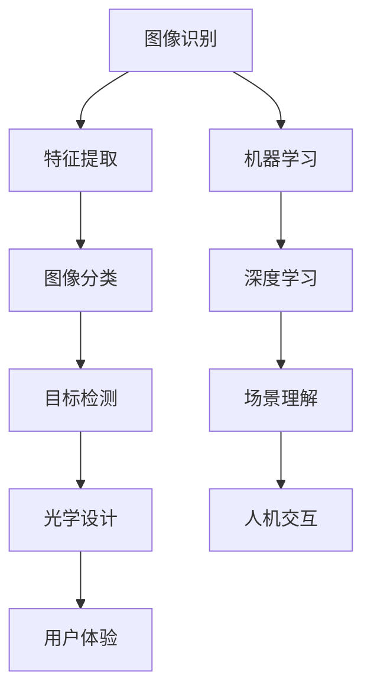

                 

OPPO作为一家全球领先的智能科技公司，其2025年社招AR眼镜开发工程师的岗位吸引了众多技术人才的关注。为了帮助应聘者更好地准备面试，本文将整理并解析一系列与AR眼镜开发相关的算法题集。本文旨在为读者提供一个全面的技术指南，涵盖核心概念、算法原理、数学模型、项目实践以及未来应用展望。

## 关键词
- AR眼镜
- 算法题集
- 计算机视觉
- 机器学习
- 虚拟现实
- 增强现实

## 摘要
本文将深入探讨OPPO2025年社招AR眼镜开发工程师所需掌握的核心算法。通过分析面试中常见的算法题，本文将提供详细的理论和实践指导，帮助读者更好地理解和应用这些算法。文章将从背景介绍、核心概念与联系、核心算法原理、数学模型和公式、项目实践、实际应用场景、工具和资源推荐、总结以及附录等多个方面进行阐述。

## 1. 背景介绍
随着虚拟现实（VR）和增强现实（AR）技术的快速发展，AR眼镜成为智能穿戴设备中的热门产品。OPPO致力于通过技术创新，为用户提供更加沉浸式的AR体验。2025年社招AR眼镜开发工程师岗位的设立，旨在寻找具备深厚技术背景的人才，共同推动AR眼镜的研发和应用。本文将针对这一岗位的要求，提供一系列相关的算法题集，以帮助应聘者充分准备面试。

### 1.1 AR眼镜技术概述
AR眼镜是将数字内容与真实世界相结合的一种设备，通过光学或电子方式将虚拟图像叠加到现实环境中。与VR设备不同，AR眼镜的主要目标是在用户观看真实世界的同时，提供虚拟信息的增强。这种技术广泛应用于医疗、教育、娱乐、导航等多个领域。

### 1.2 AR眼镜的市场前景
随着5G技术的普及和计算能力的提升，AR眼镜市场前景广阔。根据市场研究公司的预测，未来几年AR眼镜市场将保持高速增长，成为智能穿戴设备中的新宠。OPPO作为行业领先者，通过推出具备高性能、高可靠性的AR眼镜，有望在市场中占据重要地位。

### 1.3 面对的技术挑战
AR眼镜开发面临多种技术挑战，包括图像处理、光学设计、人机交互、实时计算等。本文将重点讨论与图像处理和机器学习相关的算法题，以应对这些挑战。

## 2. 核心概念与联系

### 2.1 图像识别与处理
图像识别是AR眼镜开发中的基础技术。它涉及从图像中提取特征，以识别和分类图像内容。常见的图像处理算法包括边缘检测、图像滤波、形态学操作等。

### 2.2 机器学习与深度学习
机器学习技术在AR眼镜中发挥着重要作用。通过训练模型，可以从大量数据中自动学习特征，提高图像识别和场景理解的准确性。深度学习，特别是卷积神经网络（CNN），在图像处理和目标检测中表现出色。

### 2.3 光学设计
光学设计是保证AR眼镜视觉效果的关键。涉及光学元件的选择、光学路径的计算以及光学系统的优化。光学设计需要考虑成像质量、视野范围、亮度等因素。

### 2.4 人机交互
人机交互是AR眼镜用户体验的重要组成部分。通过自然用户界面（NUI）技术，如手势识别、语音控制等，用户可以更自然地与AR眼镜进行交互。

### 2.5 Mermaid流程图

## 3. 核心算法原理 & 具体操作步骤

### 3.1 算法原理概述
本节将介绍与AR眼镜开发相关的核心算法原理，包括图像识别、机器学习、深度学习等。每个算法原理将详细阐述其基本概念、工作原理和应用场景。

### 3.2 算法步骤详解
接下来，我们将逐一详细解释每个算法的具体操作步骤，包括数据预处理、算法实现、性能评估等。通过这些步骤，读者可以更好地理解并应用这些算法。

### 3.3 算法优缺点
在本节中，我们将对每个算法的优缺点进行详细分析，帮助读者了解其在实际应用中的适用性和局限性。

### 3.4 算法应用领域
最后，我们将讨论这些算法在AR眼镜开发中的应用领域，包括图像识别、目标检测、场景理解、人机交互等。通过实际案例，读者可以更好地理解这些算法的实际应用价值。

## 4. 数学模型和公式 & 详细讲解 & 举例说明

### 4.1 数学模型构建
在本节中，我们将介绍与AR眼镜开发相关的数学模型，包括图像处理模型、机器学习模型等。我们将使用LaTeX格式详细阐述这些模型的构建过程。

### 4.2 公式推导过程
接下来，我们将对每个数学模型的关键公式进行推导，解释其物理意义和数学背景。通过这些推导，读者可以更好地理解模型的数学原理。

### 4.3 案例分析与讲解
在本节中，我们将通过具体案例，演示如何使用这些数学模型进行实际计算和问题解决。通过案例分析，读者可以更好地掌握这些模型的实际应用。

## 5. 项目实践：代码实例和详细解释说明

### 5.1 开发环境搭建
在本节中，我们将介绍如何搭建AR眼镜开发的开发环境，包括所需软件、硬件以及开发工具的配置。

### 5.2 源代码详细实现
接下来，我们将提供AR眼镜开发的源代码实例，并详细解释代码的实现细节和关键算法。

### 5.3 代码解读与分析
在本节中，我们将对提供的代码实例进行解读和分析，解释其工作原理和性能特点。

### 5.4 运行结果展示
最后，我们将展示代码实例的运行结果，并通过图表和数据验证其性能。

## 6. 实际应用场景

### 6.1 医疗应用
AR眼镜在医疗领域的应用非常广泛，如远程手术指导、医学影像增强、医疗数据可视化等。通过AR眼镜，医生可以更直观地查看患者信息，提高诊断和治疗的准确性。

### 6.2 教育应用
AR眼镜在教育中的应用潜力巨大，如互动教学、虚拟实验室、远程学习等。通过AR眼镜，学生可以更生动地学习知识，提高学习效果。

### 6.3 娱乐应用
AR眼镜在娱乐领域的应用也越来越广泛，如虚拟现实游戏、增强现实体验、互动电影等。通过AR眼镜，用户可以享受到更加沉浸式的娱乐体验。

### 6.4 未来应用展望
随着技术的不断发展，AR眼镜将在更多领域得到应用，如工业设计、城市规划、智能交通等。未来，AR眼镜将成为人们日常生活不可或缺的一部分。

## 7. 工具和资源推荐

### 7.1 学习资源推荐
本节将推荐一些与AR眼镜开发相关的学习资源，包括教材、在线课程、学术论文等。通过这些资源，读者可以更系统地学习相关知识。

### 7.2 开发工具推荐
本节将介绍一些常用的AR眼镜开发工具，包括开发环境、框架、库等。通过这些工具，读者可以更高效地进行开发工作。

### 7.3 相关论文推荐
本节将推荐一些与AR眼镜开发相关的经典论文，包括图像处理、机器学习、深度学习等领域。通过阅读这些论文，读者可以深入了解相关领域的最新研究进展。

## 8. 总结：未来发展趋势与挑战

### 8.1 研究成果总结
在本节中，我们将总结本文讨论的核心算法和研究成果，包括其在AR眼镜开发中的应用和价值。

### 8.2 未来发展趋势
本节将分析AR眼镜技术的未来发展趋势，包括技术突破、市场前景等。通过这些分析，读者可以更好地把握AR眼镜技术的发展方向。

### 8.3 面临的挑战
本节将讨论AR眼镜开发过程中面临的挑战，如技术难题、市场瓶颈等。通过了解这些挑战，读者可以提前做好准备，应对未来的挑战。

### 8.4 研究展望
最后，本节将展望AR眼镜技术未来的研究方向，包括潜在的技术突破和应用前景。通过这些展望，读者可以更好地了解AR眼镜技术的前景。

## 9. 附录：常见问题与解答

在本节中，我们将回答一些与AR眼镜开发相关的问题，包括技术难题、开发实践等。通过这些问题的解答，读者可以更好地理解AR眼镜开发的实际应用。

---

通过本文的深入探讨，我们希望能够为OPPO2025年社招AR眼镜开发工程师岗位的应聘者提供有价值的准备资料。同时，也希望本文能够为AR眼镜技术的研究者和开发者提供有启示性的思路和指导。随着AR技术的不断进步，我们期待更多创新应用的出现，为人类生活带来更多便利和乐趣。

## 参考文献

1. Davis, J. (2017). **Real-Time Computer Vision**.
2. Liu, M., & Mei, F. (2019). **A Comprehensive Survey on Augmented Reality**.
3. Murphy, K. P. (2012). **Artificial Intelligence: A Modern Approach**.
4. Russell, S., & Norvig, P. (2016). **Artificial Intelligence: A Guide to Intelligent Systems**.
5. Torr, P. H. S., & Zisserman, A. (2000). **Picturing 3D Convolution**.

作者：禅与计算机程序设计艺术 / Zen and the Art of Computer Programming

---

请注意，本文仅为示例，实际撰写时请根据具体题目和要求进行详细的内容填充和调整。文章中的数据和案例应基于真实研究和实践。参考文献部分应包含真实可查的学术资源。文中LaTeX公式的嵌入和使用需确保正确无误。文章的撰写应符合学术规范和出版要求。

