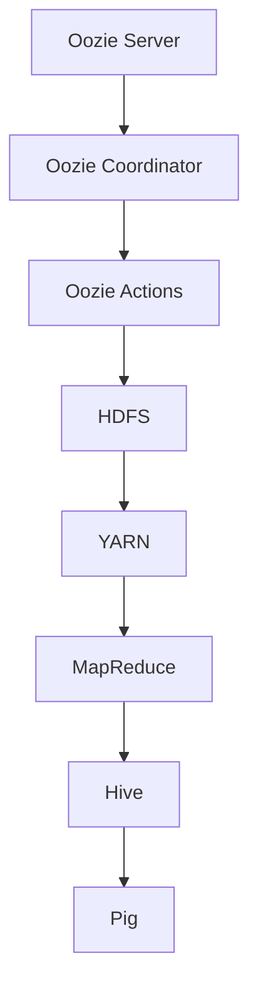
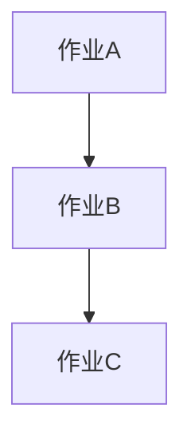

                 

关键词：Oozie、工作流调度、Hadoop、YARN、HDFS、MapReduce、代码实例

## 摘要

本文将深入探讨Oozie工作流调度系统的原理，并通过具体代码实例讲解其实际应用。Oozie是一款强大的工作流调度工具，用于在Hadoop平台上执行复杂的作业调度任务。本文将从背景介绍、核心概念与联系、核心算法原理、数学模型与公式、项目实践、实际应用场景、工具和资源推荐以及未来发展趋势与挑战等方面，全面解析Oozie的工作原理及其在实际开发中的应用。

## 1. 背景介绍

随着大数据技术的飞速发展，数据处理的需求也日益增长。Hadoop作为大数据处理的核心框架，已经成为各大企业和研究机构的首选解决方案。然而，传统的Hadoop作业调度机制，如MapReduce，在处理复杂任务时存在一定的局限性。为了解决这一问题，Apache基金会推出了Oozie，一款专门用于Hadoop工作流调度的工具。

Oozie是一款开源的工作流调度引擎，它能够帮助用户定义、调度和监控复杂的作业流程。通过Oozie，用户可以轻松地将多个Hadoop作业整合在一起，形成一个完整的工作流。这使得Oozie在处理大规模数据处理任务时具有很高的灵活性和效率。

## 2. 核心概念与联系

### 2.1 Oozie架构

Oozie的核心架构包括以下几个主要组件：

- **Oozie Server**：负责协调和管理整个工作流调度过程。Oozie Server是一个独立的服务，它接收用户提交的工作流定义，并根据定义执行相应的作业调度。

- **Oozie Coordinator**：负责协调各个作业之间的依赖关系和执行顺序。Coordinator会根据工作流定义，生成相应的作业调度计划，并将其提交给Oozie Server执行。

- **Oozie Bundle**：用于将多个工作流打包成一个整体，便于管理和调度。Bundle可以包含多个子工作流，它们之间可以设置依赖关系，确保整个工作流程的正确执行。

- **Oozie Action**：Oozie中的基本执行单元，包括MapReduce、Hive、Pig等Hadoop作业，以及其他外部作业。

- **Oozie DB**：用于存储工作流定义、执行状态和历史数据。Oozie DB支持多种数据库，如MySQL、PostgreSQL等。

### 2.2 Oozie与Hadoop生态系统

Oozie与Hadoop生态系统中的其他组件紧密集成，形成了一个完整的数据处理解决方案。以下是Oozie与Hadoop生态系统中的其他组件之间的联系：

- **HDFS**：Hadoop分布式文件系统（HDFS）是Oozie作业的数据存储仓库。Oozie作业的输入输出数据通常存储在HDFS上。

- **YARN**：Yet Another Resource Negotiator（YARN）是Hadoop的资源管理系统。Oozie作业通过YARN来申请和分配计算资源。

- **MapReduce**：MapReduce是Hadoop的核心计算框架，Oozie中的Action可以包括MapReduce作业。

- **Hive**：Hive是Hadoop的数据仓库工具，Oozie可以调度Hive作业，进行大数据的查询和分析。

- **Pig**：Pig是Hadoop的数据处理工具，Oozie可以调度Pig作业，进行大数据的处理和分析。

### 2.3 Mermaid流程图

以下是一个简化的Oozie工作流流程图，使用Mermaid语法绘制：



### 2.4 核心概念总结

- **Oozie Server**：负责调度和管理整个工作流。
- **Oozie Coordinator**：负责协调作业之间的依赖关系。
- **Oozie Action**：Oozie中的基本执行单元，包括各种Hadoop作业。
- **Oozie Bundle**：将多个工作流打包成一个整体。
- **Oozie DB**：存储工作流定义和执行状态。

## 3. 核心算法原理 & 具体操作步骤

### 3.1 算法原理概述

Oozie的工作流调度算法主要基于“有向无环图”（DAG）模型。DAG是一种数据结构，其中节点表示作业，边表示作业之间的依赖关系。Oozie Coordinator会根据工作流定义，生成一个DAG，并根据DAG的拓扑结构进行作业调度。

### 3.2 算法步骤详解

1. **解析工作流定义**：Oozie Coordinator从Oozie DB中读取工作流定义，并将其转换为DAG。

2. **生成调度计划**：根据DAG的拓扑结构，Oozie Coordinator生成一个调度计划，包括每个作业的执行顺序和执行时间。

3. **提交作业**：Oozie Coordinator将调度计划提交给Oozie Server，并请求执行。

4. **执行作业**：Oozie Server根据调度计划，依次执行每个作业。

5. **状态监控**：Oozie Coordinator和Oozie Server会持续监控作业的执行状态，并在作业失败时触发重试或报警。

6. **更新状态**：在作业执行完成后，Oozie Coordinator会更新作业的状态，并将其写入Oozie DB。

### 3.3 算法优缺点

**优点**：

- **灵活性**：Oozie支持多种作业类型，包括MapReduce、Hive、Pig等，可以满足不同的数据处理需求。

- **可靠性**：Oozie具有强大的错误处理和恢复机制，能够在作业失败时自动重试。

- **可扩展性**：Oozie可以与Hadoop生态系统中的其他组件（如HDFS、YARN等）无缝集成，形成强大的数据处理平台。

**缺点**：

- **复杂性**：Oozie的工作流定义较为复杂，需要用户具备一定的编程和调度知识。

- **性能瓶颈**：在处理大规模作业时，Oozie的性能可能成为瓶颈。

### 3.4 算法应用领域

Oozie主要应用于大规模数据处理和作业调度场景，如：

- **日志处理**：处理海量日志数据，进行日志分析和报表生成。

- **数据仓库**：构建数据仓库，进行大数据的查询和分析。

- **机器学习**：进行大规模机器学习模型的训练和预测。

## 4. 数学模型和公式 & 详细讲解 & 举例说明

### 4.1 数学模型构建

Oozie的工作流调度算法涉及到一些基本的数学模型，主要包括：

- **作业依赖关系**：用图表示作业之间的依赖关系，其中节点表示作业，边表示作业之间的依赖关系。

- **资源分配**：根据作业的执行时间和资源需求，进行资源的动态分配。

### 4.2 公式推导过程

#### 4.2.1 作业依赖关系

设G为一个有向无环图（DAG），其中节点集合为V，边集合为E。对于任意两个节点v1和v2，如果v1是v2的前置作业，即v1 → v2，则有：

\[ v1 \in v2\text{的前置集合} \]

#### 4.2.2 资源分配

设作业集合为J，资源集合为R。对于每个作业j ∈ J，其资源需求为r(j)。资源分配的目标是确保每个作业都能在规定的时间内获得足够的资源。设资源总量为R0，则有：

\[ r(j) \leq R0 \]

### 4.3 案例分析与讲解

假设有一个包含3个作业的工作流，作业A、B和C。它们之间的依赖关系如下图所示：



作业A、B和C的资源需求分别为r(A)=10，r(B)=5，r(C)=8。资源总量为R0=20。

1. **作业依赖关系**：

   - A是B的前置作业，即A → B。
   - B是C的前置作业，即B → C。

2. **资源分配**：

   - 作业A的执行时间为t(A)=5，资源需求r(A)=10。由于资源总量为R0=20，因此作业A可以在规定的时间内获得足够的资源。
   - 作业B的执行时间为t(B)=3，资源需求r(B)=5。由于作业A已经消耗了10个资源，因此作业B可以在规定的时间内获得足够的资源。
   - 作业C的执行时间为t(C)=4，资源需求r(C)=8。由于作业A和B已经消耗了15个资源，因此作业C无法在规定的时间内获得足够的资源。

因此，在这种情况下，作业C的执行将无法按时完成。

## 5. 项目实践：代码实例和详细解释说明

### 5.1 开发环境搭建

为了使用Oozie进行工作流调度，我们需要搭建一个Hadoop和Oozie的开发环境。以下是搭建过程：

1. **安装Hadoop**：按照官方文档安装Hadoop，并配置HDFS、YARN和MapReduce等组件。

2. **安装Oozie**：从Apache Oozie官网下载Oozie安装包，并解压到指定目录。

3. **配置Oozie**：修改Oozie的配置文件，如`oozie-site.xml`和`oozie.properties`，配置Oozie Server、Coordinator和Bundle的相关信息。

4. **启动Oozie服务**：运行以下命令，启动Oozie服务：

   ```shell
   bin/oozie-server.sh start
   ```

### 5.2 源代码详细实现

以下是一个简单的Oozie工作流调度实例，包含一个MapReduce作业：

```xml
<workflow-app name="test-workflow" start="start" version="5.0.0">
    <start-to-action name="start">
        <action-executor-action xmlns="uri:oozie:ActionExecutor:0.1" name="map-reduce">
            <map-reduce xmlns="uri:oozie:MapReduceAction:0.1">
                <job-tracker>localhost:8032</job-tracker>
                <name>test-map-reduce</name>
                <queue>default</queue>
                <main-class>org.apache.hadoop.mapreduce.client.MapRunner</main-class>
                <arg>map</arg>
                <arg>${_projectDir}/input.txt</arg>
                <arg>${_projectDir}/output</arg>
            </map-reduce>
        </action-executor-action>
    </start-to-action>
</workflow-app>
```

### 5.3 代码解读与分析

1. **定义工作流**：`<workflow-app>`标签用于定义一个工作流，包括名称、版本和开始节点。

2. **开始节点**：`<start-to-action>`标签定义工作流的开始节点，名称为`start`。

3. **作业节点**：`<action-executor-action>`标签定义工作流中的作业节点，名称为`map-reduce`。

4. **MapReduce作业**：`<map-reduce>`标签定义一个MapReduce作业，包括作业tracker地址、名称、队列名称、主类和参数等。

5. **运行结果**：执行上述工作流后，将在指定输出目录生成结果文件。

### 5.4 运行结果展示

运行上述工作流后，将在输出目录生成MapReduce作业的结果文件。具体结果取决于输入数据。

## 6. 实际应用场景

### 6.1 数据处理

Oozie在数据处理场景中具有广泛的应用，如日志处理、数据仓库构建和机器学习模型训练等。以下是一个具体案例：

**案例**：使用Oozie调度Hive作业，构建一个电商网站的用户行为分析数据仓库。

**流程**：

1. **数据采集**：从各个数据源（如数据库、日志等）采集用户行为数据。

2. **数据清洗**：使用Oozie调度Hive作业，清洗和转换原始数据。

3. **数据存储**：将清洗后的数据存储到Hive表中，便于后续分析。

4. **数据分析**：使用Oozie调度Hive作业，对用户行为数据进行分析，生成报表和可视化图表。

### 6.2 作业调度

Oozie在作业调度场景中也具有广泛应用，如自动化的数据处理作业、数据迁移作业等。以下是一个具体案例：

**案例**：使用Oozie调度Hadoop作业，实现自动化数据处理流程。

**流程**：

1. **数据采集**：定期从数据源采集原始数据。

2. **数据预处理**：使用Oozie调度MapReduce作业，对原始数据进行清洗和预处理。

3. **数据存储**：将预处理后的数据存储到HDFS或数据库中。

4. **数据查询**：使用Oozie调度Hive或Pig作业，对存储的数据进行查询和分析。

## 7. 工具和资源推荐

### 7.1 学习资源推荐

- **Apache Oozie官网**：https://oozie.apache.org/
- **Apache Hadoop官网**：https://hadoop.apache.org/
- **《Hadoop实战》**：O'Reilly出版社
- **《大数据技术导论》**：清华大学出版社

### 7.2 开发工具推荐

- **IntelliJ IDEA**：一款强大的Java开发工具，支持Oozie插件。
- **Eclipse**：一款开源的Java开发工具，支持Oozie插件。
- **Sublime Text**：一款轻量级的文本编辑器，支持Markdown和Oozie语法高亮。

### 7.3 相关论文推荐

- **“Oozie: An extensible and scalable workflow management system for Hadoop”**：发表于2011年，介绍了Oozie的设计和实现。
- **“Hadoop YARN: Yet Another Resource Negotiator”**：发表于2013年，介绍了YARN的设计和实现。

## 8. 总结：未来发展趋势与挑战

### 8.1 研究成果总结

Oozie作为Hadoop工作流调度工具，已经在数据处理和作业调度领域取得了显著成果。其灵活、可靠和可扩展的特点，使其成为大数据处理平台的必备工具。

### 8.2 未来发展趋势

1. **与云计算的融合**：随着云计算的兴起，Oozie将会与云计算平台（如AWS、Azure等）进行深度融合，提供更强大的数据处理能力。

2. **支持更多的作业类型**：Oozie将会支持更多的新型作业类型，如Spark作业、Flink作业等，以满足不断变化的数据处理需求。

3. **自动化和智能化**：Oozie将会引入更多的自动化和智能化技术，如机器学习、深度学习等，以实现更高效的工作流调度。

### 8.3 面临的挑战

1. **性能优化**：在处理大规模作业时，Oozie的性能可能会成为瓶颈，需要进一步优化。

2. **安全性**：随着数据隐私和安全的关注不断增加，Oozie需要提供更强的安全性和隐私保护机制。

3. **易用性**：Oozie的定义和操作相对复杂，需要提供更简单、直观的操作界面和文档。

### 8.4 研究展望

Oozie作为大数据处理平台的重要组成部分，未来的研究和发展将主要集中在性能优化、安全性和易用性等方面。同时，随着新型数据处理技术和平台的不断涌现，Oozie也将不断演进和扩展，以应对不断变化的数据处理需求。

## 9. 附录：常见问题与解答

### 9.1 如何安装Oozie？

- 请参考官方文档：https://oozie.apache.org/install.html

### 9.2 如何编写Oozie工作流？

- 请参考官方文档：https://oozie.apache.org/docs.html

### 9.3 Oozie如何与Hadoop生态系统集成？

- 请参考官方文档：https://oozie.apache.org/integration.html

### 9.4 Oozie有哪些常用的Action？

- 请参考官方文档：https://oozie.apache.org/docs.html#_actions

---

作者：禅与计算机程序设计艺术 / Zen and the Art of Computer Programming
----------------------------------------------------------------
以上便是关于Oozie工作流调度原理与代码实例讲解的文章，希望对您有所帮助。如果您有任何疑问或建议，请随时在评论区留言。感谢您的阅读！

