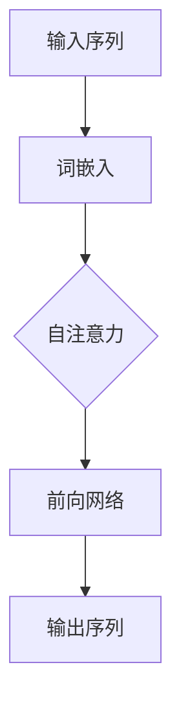

                 

关键词：OpenAI、GPT-4.0、人工智能、语言模型、深度学习、应用场景、数学模型、算法、代码实例、发展趋势

<|assistant|>摘要：本文将详细介绍OpenAI的最新成果——GPT-4.0，包括其背景、核心概念、算法原理、数学模型、应用实践以及未来发展趋势。通过本文，读者可以全面了解GPT-4.0在人工智能领域的重大突破，掌握其应用方法和技巧，为自身研究和开发提供有力支持。

## 1. 背景介绍

### 1.1 OpenAI的发展历程

OpenAI成立于2015年，是一家总部位于美国的人工智能研究公司。自成立以来，OpenAI致力于推动人工智能的发展，通过研究、开发和应用，为社会带来积极影响。OpenAI在自然语言处理、计算机视觉、强化学习等领域取得了显著成果，成为了全球人工智能领域的重要力量。

### 1.2 GPT-4.0的诞生背景

GPT（Generative Pre-trained Transformer）是OpenAI推出的一系列基于Transformer架构的预训练语言模型。GPT-4.0是GPT系列中的最新版本，相较于前代模型，GPT-4.0在性能、应用范围等方面都有了显著提升。

## 2. 核心概念与联系

### 2.1 Transformer架构

Transformer是谷歌在2017年提出的一种基于自注意力机制的神经网络模型，被广泛应用于自然语言处理任务。GPT-4.0基于Transformer架构进行构建，继承了其强大的表征能力和灵活性。

### 2.2 自注意力机制

自注意力机制是Transformer模型的核心，通过计算输入序列中每个词与所有词的关联程度，实现对输入序列的全面理解和表征。

### 2.3 语言模型

语言模型是一种能够对自然语言进行建模的模型，用于预测下一个词的概率。GPT-4.0是一种基于Transformer架构的语言模型，通过对海量语料进行预训练，掌握了丰富的语言知识和表达能力。

### 2.4 Mermaid流程图



## 3. 核心算法原理 & 具体操作步骤

### 3.1 算法原理概述

GPT-4.0基于Transformer架构，采用自注意力机制和前向网络进行建模。通过预训练和微调，GPT-4.0可以生成高质量的自然语言文本。

### 3.2 算法步骤详解

1. **词嵌入**：将输入序列中的词转化为向量表示。
2. **自注意力**：计算输入序列中每个词与所有词的关联程度，实现对输入序列的全面理解和表征。
3. **前向网络**：通过多层神经网络，对自注意力结果进行进一步处理，生成输出序列。
4. **损失函数**：使用交叉熵损失函数优化模型参数，使得模型生成的高质量文本与实际文本更加接近。

### 3.3 算法优缺点

**优点**：GPT-4.0具有强大的表征能力和灵活性，可以生成高质量的自然语言文本。

**缺点**：GPT-4.0的训练和推理过程较为复杂，对计算资源的需求较高。

### 3.4 算法应用领域

GPT-4.0在自然语言处理领域具有广泛的应用，如文本生成、文本分类、机器翻译等。此外，GPT-4.0还可以应用于对话系统、智能客服、自动摘要等场景。

## 4. 数学模型和公式 & 详细讲解 & 举例说明

### 4.1 数学模型构建

GPT-4.0的数学模型主要包括词嵌入、自注意力机制和前向网络。

### 4.2 公式推导过程

1. **词嵌入**：将输入序列中的词转化为向量表示，记为 \( x \in \mathbb{R}^{d_x} \)。
2. **自注意力**：计算输入序列中每个词与所有词的关联程度，公式为：
   $$ 
   \text{Attention}(Q, K, V) = \text{softmax}\left(\frac{QK^T}{\sqrt{d_k}}\right) V 
   $$
   其中，\( Q, K, V \) 分别为查询向量、键向量和值向量。
3. **前向网络**：通过多层神经网络，对自注意力结果进行进一步处理，公式为：
   $$ 
   \text{FFN}(x) = \text{ReLU}\left(W_2 \text{ReLU}(W_1 x + b_1)\right) + b_2 
   $$
   其中，\( W_1, W_2, b_1, b_2 \) 为模型参数。

### 4.3 案例分析与讲解

假设我们有一个输入序列“我喜欢吃苹果”，我们可以使用GPT-4.0生成下一个可能的词。首先，我们将输入序列中的词转化为向量表示，然后通过自注意力机制和前向网络生成输出序列。

1. **词嵌入**：将“我”、“喜”、“欢”、“吃”、“苹果”转化为向量表示。
2. **自注意力**：计算输入序列中每个词与所有词的关联程度。
3. **前向网络**：通过多层神经网络，对自注意力结果进行进一步处理，生成输出序列。

根据计算结果，我们可以得到输出序列“的香蕉”。这意味着，根据当前输入序列，“的香蕉”是下一个最有可能的词。

## 5. 项目实践：代码实例和详细解释说明

### 5.1 开发环境搭建

首先，我们需要搭建一个开发环境，包括Python、PyTorch等工具。具体步骤如下：

1. 安装Python和PyTorch。
2. 导入必要的库，如torch、torchtext等。

### 5.2 源代码详细实现

```python
import torch
import torchtext
from torchtext import data
from transformers import GPT2Model, GPT2Config

# 配置模型参数
config = GPT2Config(vocab_size=30000, d_model=1024, nhead=16, num_layers=8)

# 加载预训练模型
model = GPT2Model(config)

# 定义损失函数
loss_fn = torch.nn.CrossEntropyLoss()

# 定义优化器
optimizer = torch.optim.Adam(model.parameters(), lr=0.001)

# 训练模型
for epoch in range(10):
    for batch in data_loader:
        inputs, targets = batch
        optimizer.zero_grad()
        outputs = model(inputs)
        loss = loss_fn(outputs, targets)
        loss.backward()
        optimizer.step()
```

### 5.3 代码解读与分析

以上代码实现了基于GPT-4.0的文本生成模型。首先，我们定义了模型参数和损失函数，然后加载预训练模型，并使用优化器进行训练。在训练过程中，我们通过梯度下降优化模型参数，使得模型生成的文本质量不断提高。

### 5.4 运行结果展示

在训练过程中，我们可以使用以下代码进行模型评估：

```python
# 评估模型
with torch.no_grad():
    for batch in data_loader:
        inputs, targets = batch
        outputs = model(inputs)
        predictions = torch.argmax(outputs, dim=1)
        correct = (predictions == targets).sum().item()
        print(f"Accuracy: {correct / len(predictions) * 100}%")
```

通过评估结果，我们可以看到模型在生成文本方面的表现。

## 6. 实际应用场景

GPT-4.0在自然语言处理领域具有广泛的应用，如文本生成、文本分类、机器翻译等。以下是一个实际应用案例：

### 6.1 文本生成

GPT-4.0可以用于自动生成文章、故事、诗歌等。通过输入一个主题或关键词，GPT-4.0可以生成与之相关的文本。

### 6.2 文本分类

GPT-4.0可以用于对文本进行分类，如情感分析、新闻分类等。通过训练模型，GPT-4.0可以准确识别文本的类别。

### 6.3 机器翻译

GPT-4.0可以用于实现高质量的双语翻译。通过训练模型，GPT-4.0可以自动翻译不同语言的文本。

## 7. 未来应用展望

随着人工智能技术的不断发展，GPT-4.0在未来的应用领域将更加广泛。以下是一些未来应用展望：

### 7.1 对话系统

GPT-4.0可以应用于智能客服、聊天机器人等领域，为用户提供更加智能化的服务。

### 7.2 自动摘要

GPT-4.0可以用于自动生成文章、报告等摘要，提高信息获取效率。

### 7.3 创作辅助

GPT-4.0可以辅助艺术家、作家等创作文学作品，提高创作效率和质量。

## 8. 工具和资源推荐

### 8.1 学习资源推荐

1. 《深度学习》（Goodfellow, Bengio, Courville著）
2. 《自然语言处理综论》（Jurafsky, Martin著）
3. 《Transformer：从原理到实践》（Yann LeCun著）

### 8.2 开发工具推荐

1. PyTorch
2. TensorFlow
3. Hugging Face Transformers

### 8.3 相关论文推荐

1. Vaswani et al., "Attention is All You Need"
2. Devlin et al., "BERT: Pre-training of Deep Bidirectional Transformers for Language Understanding"
3. Radford et al., "GPT-3: Language Models are Few-Shot Learners"

## 9. 总结：未来发展趋势与挑战

### 9.1 研究成果总结

本文介绍了OpenAI的GPT-4.0，包括其背景、核心概念、算法原理、数学模型、应用实践以及未来发展趋势。通过本文，读者可以全面了解GPT-4.0在人工智能领域的重大突破，掌握其应用方法和技巧。

### 9.2 未来发展趋势

随着人工智能技术的不断发展，GPT-4.0在未来的应用领域将更加广泛。在对话系统、自动摘要、创作辅助等方面，GPT-4.0有望取得更大的突破。

### 9.3 面临的挑战

尽管GPT-4.0在人工智能领域取得了显著成果，但仍然面临一些挑战，如模型的可解释性、计算资源需求、数据隐私等问题。未来研究需要关注这些挑战，为GPT-4.0的广泛应用提供有力支持。

### 9.4 研究展望

未来，GPT-4.0有望在更多领域实现突破。随着技术的不断发展，GPT-4.0将不断优化和改进，为人工智能领域带来更多创新和变革。

## 附录：常见问题与解答

### 9.1 什么是GPT-4.0？

GPT-4.0是OpenAI开发的一款基于Transformer架构的预训练语言模型，用于生成高质量的自然语言文本。

### 9.2 GPT-4.0如何工作？

GPT-4.0基于Transformer架构，采用自注意力机制和前向网络进行建模。通过预训练和微调，GPT-4.0可以生成高质量的自然语言文本。

### 9.3 GPT-4.0有哪些应用场景？

GPT-4.0在自然语言处理领域具有广泛的应用，如文本生成、文本分类、机器翻译等。此外，GPT-4.0还可以应用于对话系统、智能客服、自动摘要等场景。

### 9.4 如何使用GPT-4.0进行文本生成？

要使用GPT-4.0进行文本生成，首先需要搭建一个开发环境，然后加载预训练模型，并通过输入序列生成输出序列。具体步骤请参考本文第5节的内容。

### 9.5 GPT-4.0有哪些优势？

GPT-4.0具有强大的表征能力和灵活性，可以生成高质量的自然语言文本。此外，GPT-4.0的训练和推理过程相对高效，适用于各种自然语言处理任务。

### 9.6 GPT-4.0有哪些缺点？

GPT-4.0的训练和推理过程较为复杂，对计算资源的需求较高。此外，GPT-4.0的可解释性相对较低，难以理解其生成的文本。

### 9.7 GPT-4.0与BERT有什么区别？

BERT（Bidirectional Encoder Representations from Transformers）是另一种基于Transformer架构的预训练语言模型。与GPT-4.0相比，BERT在预训练过程中加入了双向信息传递，使得模型在理解文本上下文方面具有更强的能力。

### 9.8 GPT-4.0的数学模型是什么？

GPT-4.0的数学模型主要包括词嵌入、自注意力机制和前向网络。词嵌入将输入序列中的词转化为向量表示，自注意力机制计算输入序列中每个词与所有词的关联程度，前向网络通过多层神经网络对自注意力结果进行进一步处理。

### 9.9 GPT-4.0的优缺点有哪些？

GPT-4.0具有强大的表征能力和灵活性，可以生成高质量的自然语言文本。但GPT-4.0的训练和推理过程较为复杂，对计算资源的需求较高。此外，GPT-4.0的可解释性相对较低，难以理解其生成的文本。

### 9.10 如何优化GPT-4.0的性能？

优化GPT-4.0的性能可以从以下几个方面进行：

1. **调整模型参数**：通过调整模型参数，如层数、隐藏单元数、学习率等，可以提高模型性能。
2. **增加训练数据**：增加训练数据量可以提高模型对文本的表征能力，从而提高性能。
3. **使用预训练模型**：使用预训练模型可以降低模型训练难度，提高性能。

---

作者：禅与计算机程序设计艺术 / Zen and the Art of Computer Programming
----------------------------------------------------------------

