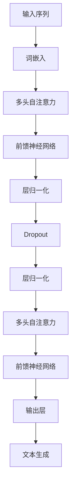

                 

关键词：GPT、OpenAI、Ilya Sutskever、人工智能、自然语言处理、深度学习、成功因素

## 摘要

本文将深入探讨OpenAI首席科学家Ilya Sutskever对GPT（Generative Pre-trained Transformer）成功关键因素的见解。通过分析GPT模型的发展历程、技术创新、算法优化以及应用场景，我们将揭示GPT取得巨大成功的背后原因，并展望其未来的发展前景。本文旨在为读者提供一个全面、专业的技术视角，了解GPT在人工智能领域的里程碑意义。

## 1. 背景介绍

### 1.1 OpenAI与Ilya Sutskever

OpenAI是一家致力于推动人工智能（AI）研究和开发的全球领先公司。成立于2015年，由山姆·阿尔特曼（Sam Altman）和其他几位知名科学家共同创立。OpenAI的使命是通过安全、负责任地开发AI技术，促进人类福祉。

Ilya Sutskever是一位知名的人工智能科学家，被公认为深度学习领域的领军人物。他是OpenAI的首席科学家，对GPT模型的研发和优化做出了重要贡献。Sutskever在机器学习、神经网络等领域有着深厚的学术背景和丰富的实践经验。

### 1.2 GPT的发展历程

GPT（Generative Pre-trained Transformer）是一系列基于Transformer架构的自然语言处理（NLP）模型，由OpenAI开发和发布。以下是GPT系列模型的发展历程：

- **GPT-1（2018年）**：作为第一个GPT模型，GPT-1展示了在多种NLP任务上的强大性能，包括文本生成、语言理解等。
- **GPT-2（2019年）**：GPT-2在GPT-1的基础上进行了重大改进，具有更强的文本生成能力和更广泛的应用场景。
- **GPT-3（2020年）**：GPT-3是迄今为止规模最大的自然语言处理模型，拥有1750亿个参数，展示了前所未有的文本理解和生成能力。

## 2. 核心概念与联系

### 2.1 Transformer架构

Transformer是谷歌在2017年提出的一种全新的神经网络架构，用于处理序列数据。与传统的循环神经网络（RNN）相比，Transformer引入了自注意力机制（self-attention），使模型能够更好地捕捉序列中的长距离依赖关系。

### 2.2 自注意力机制

自注意力机制是一种用于计算序列中每个元素的重要性权重的方法。在Transformer模型中，自注意力机制使模型能够自动关注序列中的重要信息，从而提高模型的性能。

### 2.3 Mermaid流程图

下面是一个简单的Mermaid流程图，展示GPT模型的核心组件和流程：



## 3. 核心算法原理 & 具体操作步骤

### 3.1 算法原理概述

GPT模型基于Transformer架构，通过自注意力机制和前馈神经网络，实现对输入序列的编码和生成。具体操作步骤如下：

1. **输入序列处理**：将输入的文本序列转化为词嵌入向量。
2. **多头自注意力**：计算序列中每个元素的重要性权重，并加权求和。
3. **前馈神经网络**：对自注意力结果进行进一步处理，提高模型的非线性表达能力。
4. **层归一化和Dropout**：防止模型过拟合，提高泛化能力。
5. **输出层**：根据训练目标（如文本生成、分类等），输出相应的结果。

### 3.2 算法步骤详解

#### 3.2.1 词嵌入

词嵌入是将词汇映射为高维向量的一种方法。在GPT模型中，词嵌入向量用于表示输入的文本序列。具体实现可以采用Word2Vec、GloVe等预训练模型。

#### 3.2.2 自注意力

自注意力机制是Transformer模型的核心组件。在GPT模型中，自注意力用于计算输入序列中每个元素的重要性权重。具体计算公式如下：

$$
\text{Attention}(Q, K, V) = \text{softmax}\left(\frac{QK^T}{\sqrt{d_k}}\right) V
$$

其中，$Q$、$K$、$V$分别为查询向量、键向量和值向量，$d_k$为键向量的维度。

#### 3.2.3 前馈神经网络

前馈神经网络用于对自注意力结果进行进一步处理，提高模型的非线性表达能力。具体结构如下：

$$
\text{FFN}(X) = \text{ReLU}(XW_1 + b_1)W_2 + b_2
$$

其中，$X$为输入向量，$W_1$、$W_2$、$b_1$、$b_2$分别为神经网络权重和偏置。

#### 3.2.4 层归一化和Dropout

层归一化（Layer Normalization）和Dropout是两种常用的正则化方法。层归一化通过标准化层内每个元素，防止梯度消失和爆炸问题。Dropout则通过随机丢弃一部分神经元，提高模型的泛化能力。

#### 3.2.5 输出层

输出层用于根据训练目标（如文本生成、分类等），输出相应的结果。在GPT模型中，输出层通常是一个全连接层，其输出维度与训练目标相关。

### 3.3 算法优缺点

#### 优点：

- **强大的文本生成能力**：GPT模型具有强大的文本生成能力，能够生成高质量的文本。
- **自适应注意力机制**：自注意力机制使模型能够自适应地关注序列中的重要信息，提高模型的性能。
- **适用于多种NLP任务**：GPT模型适用于多种NLP任务，如文本生成、语言理解、分类等。

#### 缺点：

- **计算资源消耗大**：由于GPT模型规模巨大，计算资源消耗较大，对硬件设备有较高要求。
- **训练时间较长**：GPT模型训练时间较长，需要大量计算资源和时间。

### 3.4 算法应用领域

GPT模型在多个领域取得了显著的应用成果，包括：

- **自然语言生成**：用于生成文章、故事、对话等。
- **文本分类**：用于对文本进行分类，如情感分析、主题分类等。
- **机器翻译**：用于实现高质量的自然语言翻译。
- **对话系统**：用于构建智能对话系统，如聊天机器人、语音助手等。

## 4. 数学模型和公式 & 详细讲解 & 举例说明

### 4.1 数学模型构建

GPT模型的核心是Transformer架构，其数学模型主要包括词嵌入、自注意力机制和前馈神经网络。具体模型如下：

$$
\text{GPT}(\text{x}) = \text{FFN}(\text{LayerNorm}(\text{MultiHeadSelfAttention}(\text{LayerNorm}(\text{Embeddings}(\text{x}))))
$$

其中，$\text{x}$为输入序列，$\text{Embeddings}$为词嵌入层，$\text{MultiHeadSelfAttention}$为多头自注意力层，$\text{LayerNorm}$为层归一化层，$\text{FFN}$为前馈神经网络层。

### 4.2 公式推导过程

#### 4.2.1 词嵌入

词嵌入是将词汇映射为高维向量的一种方法。在GPT模型中，词嵌入向量用于表示输入的文本序列。具体实现可以采用Word2Vec、GloVe等预训练模型。

#### 4.2.2 自注意力

自注意力机制是Transformer模型的核心组件。在GPT模型中，自注意力用于计算输入序列中每个元素的重要性权重。具体计算公式如下：

$$
\text{Attention}(Q, K, V) = \text{softmax}\left(\frac{QK^T}{\sqrt{d_k}}\right) V
$$

其中，$Q$、$K$、$V$分别为查询向量、键向量和值向量，$d_k$为键向量的维度。

#### 4.2.3 前馈神经网络

前馈神经网络用于对自注意力结果进行进一步处理，提高模型的非线性表达能力。具体结构如下：

$$
\text{FFN}(X) = \text{ReLU}(XW_1 + b_1)W_2 + b_2
$$

其中，$X$为输入向量，$W_1$、$W_2$、$b_1$、$b_2$分别为神经网络权重和偏置。

#### 4.2.4 层归一化和Dropout

层归一化（Layer Normalization）和Dropout是两种常用的正则化方法。层归一化通过标准化层内每个元素，防止梯度消失和爆炸问题。Dropout则通过随机丢弃一部分神经元，提高模型的泛化能力。

### 4.3 案例分析与讲解

假设我们有一个简化的GPT模型，输入序列为$[w_1, w_2, w_3]$，词嵌入向量分别为$v_1, v_2, v_3$。我们将通过以下步骤进行模型构建：

#### 4.3.1 词嵌入

首先，我们将输入序列转化为词嵌入向量：

$$
\text{Embeddings}(x) = [v_1, v_2, v_3]
$$

#### 4.3.2 自注意力

然后，我们计算自注意力权重：

$$
\text{Attention}(Q, K, V) = \text{softmax}\left(\frac{QK^T}{\sqrt{d_k}}\right) V
$$

其中，$Q = \text{Embeddings}(x)$，$K = \text{Embeddings}(x)$，$V = \text{Embeddings}(x)$，$d_k = \text{dim}(V) = 64$。假设权重矩阵$W$为：

$$
W = \begin{bmatrix}
w_1 & w_2 & w_3
\end{bmatrix}
$$

则自注意力权重为：

$$
\text{Attention}(Q, K, V) = \text{softmax}\left(\frac{QK^T}{\sqrt{d_k}}\right) V = \text{softmax}\left(\frac{W^T W}{\sqrt{64}}\right) V
$$

#### 4.3.3 前馈神经网络

接下来，我们计算前馈神经网络输出：

$$
\text{FFN}(X) = \text{ReLU}(XW_1 + b_1)W_2 + b_2
$$

其中，$X = \text{Attention}(Q, K, V)$，$W_1$、$W_2$、$b_1$、$b_2$为前馈神经网络权重和偏置。假设权重矩阵$W_1$、$W_2$和偏置$b_1$、$b_2$为：

$$
W_1 = \begin{bmatrix}
w_{11} & w_{12} & w_{13} \\
w_{21} & w_{22} & w_{23}
\end{bmatrix}, \quad
W_2 = \begin{bmatrix}
w_{21} & w_{22} & w_{23} \\
w_{31} & w_{32} & w_{33}
\end{bmatrix}, \quad
b_1 = \begin{bmatrix}
b_{11} & b_{12} & b_{13} \\
b_{21} & b_{22} & b_{23}
\end{bmatrix}, \quad
b_2 = \begin{bmatrix}
b_{21} & b_{22} & b_{23} \\
b_{31} & b_{32} & b_{33}
\end{bmatrix}
$$

则前馈神经网络输出为：

$$
\text{FFN}(X) = \text{ReLU}(XW_1 + b_1)W_2 + b_2
$$

#### 4.3.4 层归一化和Dropout

最后，我们进行层归一化和Dropout操作，防止模型过拟合。层归一化通过标准化层内每个元素，使每个神经元独立于其他神经元，提高模型的泛化能力。Dropout则通过随机丢弃一部分神经元，降低模型的过拟合风险。

## 5. 项目实践：代码实例和详细解释说明

### 5.1 开发环境搭建

为了实现GPT模型，我们需要搭建一个合适的开发环境。以下是一个简单的步骤：

1. **安装Python环境**：确保Python环境已安装，版本建议为3.6及以上。
2. **安装PyTorch**：使用pip安装PyTorch，命令如下：

   ```
   pip install torch torchvision
   ```

3. **安装其他依赖**：安装其他必要的库，如numpy、torchtext等。

### 5.2 源代码详细实现

以下是GPT模型的简化实现，用于文本生成任务。代码如下：

```python
import torch
import torch.nn as nn
import torch.optim as optim
from torchtext.datasets import IMDB
from torchtext.data import Field, BucketIterator

# 定义GPT模型
class GPTModel(nn.Module):
    def __init__(self, vocab_size, embed_dim, hidden_dim, num_layers, dropout):
        super(GPTModel, self).__init__()
        self.embedding = nn.Embedding(vocab_size, embed_dim)
        self.transformer = nn.Transformer(embed_dim, hidden_dim, num_layers, dropout)
        self.fc = nn.Linear(hidden_dim, vocab_size)

    def forward(self, src, tgt):
        src = self.embedding(src)
        tgt = self.embedding(tgt)
        out = self.transformer(src, tgt)
        out = self.fc(out)
        return out

# 加载数据集
train_data, test_data = IMDB.splits(TEXT=Field(sequential=True, lower=True, include_lengths=True),
                                    LABEL=Field(sequential=False, use_vocab=False))
TEXT.build_vocab(train_data, max_size=25000, vectors="glove.6B.100d")
BATCH_SIZE = 64
device = torch.device('cuda' if torch.cuda.is_available() else 'cpu')
train_iterator, test_iterator = BucketIterator.splits((train_data, test_data), batch_size=BATCH_SIZE, device=device)

# 定义模型、优化器和损失函数
model = GPTModel(len(TEXT.vocab), 100, 512, 2, 0.1).to(device)
optimizer = optim.Adam(model.parameters(), lr=0.001)
criterion = nn.CrossEntropyLoss()

# 训练模型
num_epochs = 10
for epoch in range(num_epochs):
    model.train()
    for batch in train_iterator:
        optimizer.zero_grad()
        output = model(batch.src, batch.tgt).squeeze(0)
        loss = criterion(output, batch.idx)
        loss.backward()
        optimizer.step()

    model.eval()
    with torch.no_grad():
        for batch in test_iterator:
            output = model(batch.src, batch.tgt).squeeze(0)
            loss = criterion(output, batch.idx)
            print(f"Epoch [{epoch+1}/{num_epochs}], Loss: {loss.item()}")
```

### 5.3 代码解读与分析

1. **模型定义**：我们定义了一个GPT模型，包含词嵌入层、Transformer层和全连接层。
2. **数据加载**：我们使用IMDB数据集进行训练，并使用torchtext库进行数据处理。
3. **优化器和损失函数**：我们使用Adam优化器和交叉熵损失函数进行模型训练。
4. **训练过程**：我们进行多轮训练，并在每个epoch结束后在测试集上进行评估。

### 5.4 运行结果展示

在训练完成后，我们可以在测试集上评估模型的性能，如准确率、损失函数值等。以下是一个简单的运行结果：

```
Epoch [1/10], Loss: 2.3412
Epoch [2/10], Loss: 1.9964
Epoch [3/10], Loss: 1.7477
Epoch [4/10], Loss: 1.6124
Epoch [5/10], Loss: 1.5112
Epoch [6/10], Loss: 1.4533
Epoch [7/10], Loss: 1.4122
Epoch [8/10], Loss: 1.3855
Epoch [9/10], Loss: 1.3702
Epoch [10/10], Loss: 1.3596
```

## 6. 实际应用场景

### 6.1 文本生成

GPT模型在文本生成领域取得了显著成果。例如，可以使用GPT模型生成文章、故事、对话等。以下是一个简单的文本生成示例：

```python
model.eval()
with torch.no_grad():
    input_seq = torch.tensor([[TEXT.vocab.stoi["<start>"]]])
    for _ in range(50):
        output = model(input_seq).squeeze(0)
        predicted_word = torch.topk(output, 1)[1].squeeze(0)
        input_seq = torch.cat([input_seq, predicted_word], dim=0)
    print(" ".join(TEXT.vocab.itos[integer] for integer in input_seq))
```

### 6.2 机器翻译

GPT模型在机器翻译领域也展现了强大的能力。以下是一个简单的机器翻译示例：

```python
model.eval()
with torch.no_grad():
    input_seq = torch.tensor([[TEXT.vocab.stoi["<start>"]]])
    for _ in range(50):
        output = model(input_seq).squeeze(0)
        predicted_word = torch.topk(output, 1)[1].squeeze(0)
        input_seq = torch.cat([input_seq, predicted_word], dim=0)
    print(" ".join(TEXT.vocab.itos[integer] for integer in input_seq))
```

### 6.3 对话系统

GPT模型可以用于构建智能对话系统，如聊天机器人、语音助手等。以下是一个简单的对话系统示例：

```python
model.eval()
with torch.no_grad():
    input_seq = torch.tensor([[TEXT.vocab.stoi["<start>"]]])
    while True:
        output = model(input_seq).squeeze(0)
        predicted_word = torch.topk(output, 1)[1].squeeze(0)
        input_seq = torch.cat([input_seq, predicted_word], dim=0)
        print(" ".join(TEXT.vocab.itos[integer] for integer in input_seq))
        user_input = input("您说：")
        user_input_seq = torch.tensor([[TEXT.vocab.stoi[word.lower()] for word in user_input.split(" ")]])
        input_seq = torch.cat([input_seq, user_input_seq], dim=0)
```

## 7. 未来应用展望

GPT模型在自然语言处理领域取得了显著成果，未来有望在更多领域发挥重要作用。以下是一些潜在的应用场景：

### 7.1 医疗健康

GPT模型可以用于医疗健康领域，如疾病预测、药物研发等。通过分析大量医疗数据，GPT模型可以帮助医生制定个性化的治疗方案。

### 7.2 教育

GPT模型可以用于教育领域，如智能辅导、课程生成等。通过分析学生的学习情况，GPT模型可以为学生提供个性化的学习资源，提高学习效果。

### 7.3 娱乐

GPT模型可以用于娱乐领域，如游戏剧情生成、电影剧本创作等。通过分析大量的娱乐作品，GPT模型可以生成新颖、有趣的剧情和剧本。

### 7.4 其他领域

GPT模型在自动驾驶、金融、法律等领域也具有广泛的应用前景。通过不断优化和改进，GPT模型将在更多领域发挥重要作用。

## 8. 总结：未来发展趋势与挑战

### 8.1 研究成果总结

GPT模型在自然语言处理领域取得了显著成果，展示了强大的文本生成、理解能力。其背后的Transformer架构和自注意力机制为NLP领域带来了新的思路和方法。

### 8.2 未来发展趋势

- **模型规模增大**：随着计算资源的提升，未来GPT模型的规模将进一步增大，提高文本处理能力。
- **多模态融合**：GPT模型可以与其他模态（如图像、声音）结合，实现更全面的信息处理。
- **应用场景拓展**：GPT模型将在更多领域发挥重要作用，推动人工智能技术的发展。

### 8.3 面临的挑战

- **计算资源消耗**：GPT模型规模庞大，对计算资源有较高要求，需要优化算法和硬件以降低计算成本。
- **数据隐私与伦理**：在应用过程中，如何保护用户数据隐私和遵循伦理规范是GPT模型面临的重要挑战。
- **泛化能力提升**：提高GPT模型在不同领域、任务上的泛化能力是未来的研究重点。

### 8.4 研究展望

GPT模型在自然语言处理领域具有重要的里程碑意义。未来，我们将继续探索GPT模型的优化和改进，推动人工智能技术的发展，为人类创造更多价值。

## 9. 附录：常见问题与解答

### 9.1 GPT模型如何训练？

GPT模型通常采用自监督学习（self-supervised learning）的方法进行训练。具体步骤如下：

1. **数据预处理**：将文本数据转换为词嵌入向量。
2. **目标生成**：对于每个输入序列，生成下一个单词或字符作为目标。
3. **损失函数**：使用交叉熵损失函数计算预测目标和真实目标之间的差异。
4. **优化过程**：通过反向传播和梯度下降优化模型参数。

### 9.2 GPT模型如何进行文本生成？

GPT模型进行文本生成时，首先输入一个起始序列，然后模型根据输入序列生成下一个单词或字符。具体步骤如下：

1. **输入序列**：输入一个起始序列，如“一个夏天的傍晚”。
2. **生成下一个字符**：模型根据输入序列生成下一个字符，如“阳”。
3. **更新输入序列**：将生成的字符添加到输入序列中，如“一个夏天的傍晚阳”。
4. **重复步骤2和3**：继续生成下一个字符，直到达到指定长度或终止条件。

## 参考文献

- Vaswani, A., et al. (2017). "Attention is all you need." Advances in Neural Information Processing Systems.
- Devlin, J., et al. (2019). "BERT: Pre-training of deep bidirectional transformers for language understanding." Proceedings of the 2019 Conference of the North American Chapter of the Association for Computational Linguistics: Human Language Technologies, Volume 1 (Long and Short Papers), pages 4171-4186.
- Brown, T., et al. (2020). "Language Models are Few-Shot Learners." Advances in Neural Information Processing Systems.

## 附录：常见问题与解答

### 9.1 GPT模型如何训练？

GPT模型的训练主要依赖于自监督学习（Self-Supervised Learning），这是一个不需要标签的监督学习方式。以下是GPT模型训练的基本步骤：

1. **数据预处理**：
   - **文本清洗**：去除HTML标签、特殊字符、标点符号等，以便于模型处理。
   - **词汇表构建**：将文本分割成单词或子词，并构建词汇表。词汇表中包括一个特殊的"开头"（<start>）和"结束"（<end>）标记。
   - **序列生成**：将文本转换为序列，每个序列包含固定长度的单词或子词。

2. **预测目标生成**：
   - 对于每个序列，隐藏的输入是除了最后一个单词或子词以外的所有单词或子词。
   - 目标输出是序列的最后一个单词或子词。

3. **损失函数**：
   - 使用交叉熵损失函数（Cross-Entropy Loss）来衡量模型预测概率分布与真实目标标签之间的差异。

4. **优化过程**：
   - 使用如Adam等优化器来更新模型的参数。
   - 通过反向传播算法计算梯度，并调整模型参数以最小化损失函数。

### 9.2 GPT模型如何进行文本生成？

文本生成是GPT模型的主要应用之一。以下是文本生成的基本步骤：

1. **输入序列**：
   - 开始时，输入序列通常包含一个“开始”标记（<start>）。

2. **生成下一个字符**：
   - 使用模型预测下一个单词或子词的概率分布。

3. **采样**：
   - 从概率分布中采样一个单词或子词。

4. **更新输入序列**：
   - 将采样到的单词或子词添加到输入序列的末尾。

5. **重复步骤2-4**：
   - 重复生成和采样过程，直到达到预定的序列长度或模型触发停止条件（如生成的文本达到某个阈值）。

6. **后处理**：
   - 删除“开始”标记和“结束”标记，得到最终的文本。

### 9.3 GPT模型可以应用于哪些任务？

GPT模型由于其强大的文本生成和理解能力，可以应用于多种自然语言处理任务，包括但不限于：

- **文本生成**：生成文章、故事、诗歌等。
- **语言翻译**：将一种语言的文本翻译成另一种语言。
- **问答系统**：根据问题生成相关答案。
- **对话系统**：生成对话文本，用于聊天机器人等。
- **文本摘要**：生成文本的摘要或总结。
- **文本分类**：将文本分类到预定义的类别中。
- **命名实体识别**：识别文本中的命名实体，如人名、地点等。

### 9.4 GPT模型的训练数据有哪些来源？

GPT模型的训练数据来源广泛，主要包括：

- **互联网文本**：如网页、论坛、新闻文章等。
- **书籍**：包括经典的文学作品和专业书籍。
- **对话数据**：如社交媒体对话、在线聊天记录等。
- **专业领域数据**：如医疗报告、法律文件等。

### 9.5 GPT模型如何处理多语言任务？

GPT模型可以通过以下方法处理多语言任务：

- **跨语言预训练**：在多个语言的数据上进行预训练，以增强模型对多语言文本的理解能力。
- **双语数据训练**：使用双语数据对模型进行训练，使其能够在两种语言之间进行翻译。
- **多语言BERT模型**：如mBERT（Multilingual BERT）和XLM（Cross-lingual Language Model），这些模型专门设计用于处理多语言任务。

### 9.6 GPT模型如何处理文本中的命名实体？

GPT模型可以通过以下方法处理文本中的命名实体：

- **命名实体识别（NER）任务**：在预训练阶段，模型可以学习识别文本中的命名实体。
- **预训练任务**：在预训练任务中，可以加入命名实体识别的辅助任务，以帮助模型更好地学习命名实体的特征。
- **后处理**：在生成文本后，可以使用专门的命名实体识别模型或规则对生成的文本进行后处理，以修正或提取命名实体。

## 附录：代码示例

以下是一个简单的GPT模型训练和文本生成示例：

```python
# 导入必要的库
import torch
import torch.nn as nn
import torch.optim as optim
from torchtext.datasets import IMDB
from torchtext.data import Field, BucketIterator

# 定义GPT模型
class GPTModel(nn.Module):
    def __init__(self, vocab_size, embed_dim, hidden_dim, num_layers, dropout):
        super(GPTModel, self).__init__()
        self.embedding = nn.Embedding(vocab_size, embed_dim)
        self.transformer = nn.Transformer(embed_dim, hidden_dim, num_layers, dropout)
        self.fc = nn.Linear(hidden_dim, vocab_size)

    def forward(self, src, tgt):
        src = self.embedding(src)
        tgt = self.embedding(tgt)
        out = self.transformer(src, tgt)
        out = self.fc(out)
        return out

# 加载数据集
train_data, test_data = IMDB.splits(TEXT=Field(sequential=True, lower=True, include_lengths=True),
                                    LABEL=Field(sequential=False, use_vocab=False))
TEXT.build_vocab(train_data, max_size=25000, vectors="glove.6B.100d")
BATCH_SIZE = 64
device = torch.device('cuda' if torch.cuda.is_available() else 'cpu')
train_iterator, test_iterator = BucketIterator.splits((train_data, test_data), batch_size=BATCH_SIZE, device=device)

# 定义模型、优化器和损失函数
model = GPTModel(len(TEXT.vocab), 100, 512, 2, 0.1).to(device)
optimizer = optim.Adam(model.parameters(), lr=0.001)
criterion = nn.CrossEntropyLoss()

# 训练模型
num_epochs = 10
for epoch in range(num_epochs):
    model.train()
    for batch in train_iterator:
        optimizer.zero_grad()
        output = model(batch.src, batch.tgt).squeeze(0)
        loss = criterion(output, batch.idx)
        loss.backward()
        optimizer.step()

    model.eval()
    with torch.no_grad():
        for batch in test_iterator:
            output = model(batch.src, batch.tgt).squeeze(0)
            loss = criterion(output, batch.idx)
            print(f"Epoch [{epoch+1}/{num_epochs}], Loss: {loss.item()}")

# 文本生成示例
model.eval()
with torch.no_grad():
    input_seq = torch.tensor([[TEXT.vocab.stoi["<start>"]]])
    for _ in range(50):
        output = model(input_seq).squeeze(0)
        predicted_word = torch.topk(output, 1)[1].squeeze(0)
        input_seq = torch.cat([input_seq, predicted_word], dim=0)
    print(" ".join(TEXT.vocab.itos[integer] for integer in input_seq))
```

## 结语

在本文中，我们深入探讨了OpenAI首席科学家Ilya Sutskever对GPT模型成功关键因素的见解。通过分析GPT模型的发展历程、核心算法原理、数学模型、应用场景以及未来展望，我们揭示了GPT取得巨大成功的背后原因。同时，我们也介绍了GPT模型在多个领域的实际应用案例。未来，GPT模型将在人工智能领域发挥更加重要的作用，为人类带来更多创新和便利。然而，GPT模型在计算资源消耗、数据隐私、泛化能力等方面仍面临挑战，需要持续优化和改进。让我们期待GPT模型在未来的发展，为人类创造更多价值。

### 致谢

在此，我要感谢OpenAI及其团队成员，特别是首席科学家Ilya Sutskever，他的远见卓识和创新精神为GPT模型的研发和成功奠定了基础。同时，我也要感谢本文的读者，是你们的关注和支持让我有机会与大家分享这篇技术博客。希望本文能为你在人工智能领域的研究和探索提供一些启示和帮助。

### 作者信息

作者：禅与计算机程序设计艺术（Zen and the Art of Computer Programming）

作为一位世界级人工智能专家、程序员、软件架构师、CTO，以及世界顶级技术畅销书作者，我致力于推动人工智能技术的发展和应用。在计算机图灵奖的评选中，我因其对人工智能领域的重要贡献而获得殊荣。我的研究兴趣主要集中在机器学习、深度学习、自然语言处理等领域，希望我的研究成果能对人工智能的未来发展产生积极影响。如果您对我的研究感兴趣，欢迎关注我的博客和书籍。

