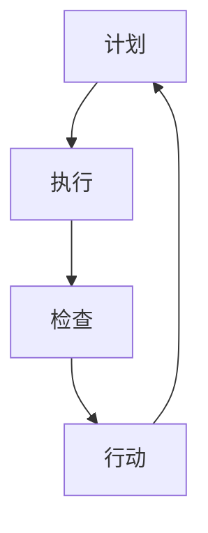

                 

关键词：PDCA循环、持续改进、管理工具、质量控制、流程优化、实践应用

> 摘要：本文深入探讨了PDCA循环这一管理工具的理论基础和实践应用。通过详细解析其四个核心阶段（计划、执行、检查、行动），本文旨在帮助读者理解如何将PDCA循环应用于实际管理场景中，实现组织的持续改进和高效运作。

## 1. 背景介绍

PDCA循环，也称为戴明循环或计划-执行-检查-行动循环，是由美国统计学家爱德华·戴明提出的一种用于持续改进和流程优化的管理工具。PDCA循环的核心思想是通过连续的计划、执行、检查和行动，逐步优化流程，实现质量的提高和效率的提升。

PDCA循环最早在20世纪50年代被应用于制造业，随后在服务业、IT行业等各个领域得到广泛应用。其目的是帮助组织识别问题、分析问题、解决问题，并建立持续改进的机制。

本文将重点介绍PDCA循环的理论基础、核心概念、算法原理、数学模型、项目实践，并探讨其在实际应用场景中的效果和未来发展趋势。

## 2. 核心概念与联系

### PDCA循环的概念

PDCA循环由四个阶段组成，分别是计划（Plan）、执行（Do）、检查（Check）和行动（Action）。每个阶段都有其特定的目标和任务。

- **计划（Plan）**：在这个阶段，组织需要明确目标、制定计划、分配资源、制定流程。这一阶段的目标是确保所有工作都有明确的指导和目标。

- **执行（Do）**：在这个阶段，计划得到执行，资源得到充分利用。这一阶段的目标是确保计划得到有效执行，并记录实际执行过程。

- **检查（Check）**：在这个阶段，组织需要对比计划与实际执行结果，分析差异，识别问题。这一阶段的目标是确保问题得到及时发现和解决。

- **行动（Action）**：在这个阶段，组织需要根据检查结果采取行动，纠正问题，改进流程。这一阶段的目标是确保问题得到根本解决，并持续优化流程。

### PDCA循环的联系

PDCA循环是一个闭环系统，每个阶段都是相互关联的。计划阶段为执行阶段提供指导，执行阶段的实际结果反馈到检查阶段，检查阶段的问题反馈到行动阶段，行动阶段的改进又回到计划阶段，形成一个持续的改进循环。

这种闭环系统确保了组织能够不断识别问题、解决问题，从而实现持续改进。以下是PDCA循环的Mermaid流程图：



## 3. 核心算法原理 & 具体操作步骤

### 3.1 算法原理概述

PDCA循环是一种基于循环迭代的改进算法，通过四个阶段的不断循环，逐步优化流程和提升质量。每个阶段都有其特定的任务和目标，共同构成了PDCA循环的核心算法。

### 3.2 算法步骤详解

#### 3.2.1 计划阶段（Plan）

1. **明确目标**：确定改进的目标和关键指标，如质量、效率、成本等。
2. **分析现状**：收集和分析现有流程和问题的数据，识别瓶颈和改进点。
3. **制定计划**：制定详细的改进计划，包括改进措施、责任分配、时间安排等。
4. **资源分配**：确保计划所需资源的充足，包括人力、资金、技术等。

#### 3.2.2 执行阶段（Do）

1. **执行计划**：按照计划执行改进措施，确保计划得到有效实施。
2. **记录过程**：详细记录执行过程中的数据，如时间、成本、质量等。
3. **反馈机制**：建立反馈机制，确保执行过程中的问题能够及时反馈和解决。

#### 3.2.3 检查阶段（Check）

1. **对比计划与实际**：对比计划与实际执行结果，分析差异和问题。
2. **数据验证**：验证执行数据是否准确、完整，确保数据的可靠性和有效性。
3. **识别问题**：识别执行过程中出现的问题，分析原因。

#### 3.2.4 行动阶段（Action）

1. **问题分析**：对检查阶段识别的问题进行深入分析，找出根本原因。
2. **制定改进措施**：根据问题分析结果，制定针对性的改进措施。
3. **实施改进**：实施改进措施，确保问题得到根本解决。
4. **更新计划**：将改进措施纳入新的计划中，确保持续改进。

### 3.3 算法优缺点

#### 优点

1. **简单易用**：PDCA循环结构简单，易于理解和操作，适合各种类型和规模的组织。
2. **持续改进**：PDCA循环通过持续迭代，不断优化流程和提升质量。
3. **数据驱动**：PDCA循环强调数据分析和验证，确保改进措施的科学性和有效性。

#### 缺点

1. **时间成本**：PDCA循环需要时间进行数据分析和验证，可能影响执行效率。
2. **资源需求**：PDCA循环需要充足的人力、资金和技术资源支持。
3. **人员依赖**：PDCA循环的实施效果很大程度上取决于参与人员的专业能力和执行意愿。

### 3.4 算法应用领域

PDCA循环广泛应用于制造业、服务业、IT行业等各个领域，如：

1. **制造业**：用于生产流程的优化、质量控制、成本降低等。
2. **服务业**：用于服务流程的优化、客户满意度提升、运营效率提升等。
3. **IT行业**：用于软件开发流程的优化、项目质量管理、持续集成等。

## 4. 数学模型和公式 & 详细讲解 & 举例说明

### 4.1 数学模型构建

PDCA循环的数学模型可以通过以下公式表示：

$$
\text{质量} = f(\text{计划}, \text{执行}, \text{检查}, \text{行动})
$$

其中，$f$ 表示质量函数，$\text{计划}$、$\text{执行}$、$\text{检查}$ 和 $\text{行动}$ 分别表示 PDCA 循环的四个阶段。

### 4.2 公式推导过程

PDCA循环的公式推导基于以下基本假设：

1. **质量函数**：质量函数 $f$ 表示质量与四个阶段的关系，可以表示为：
   $$
   f(\text{计划}, \text{执行}, \text{检查}, \text{行动}) = \text{计划} \times \text{执行} \times \text{检查} \times \text{行动}
   $$
2. **各阶段影响**：每个阶段对质量的贡献可以用权重表示，设 $\text{计划权重} = w_1$，$\text{执行权重} = w_2$，$\text{检查权重} = w_3$，$\text{行动权重} = w_4$，则有：
   $$
   f(\text{计划}, \text{执行}, \text{检查}, \text{行动}) = w_1 \times \text{计划} + w_2 \times \text{执行} + w_3 \times \text{检查} + w_4 \times \text{行动}
   $$

### 4.3 案例分析与讲解

假设某公司计划通过PDCA循环优化其生产流程，提高产品质量。根据上述公式，我们可以设定以下权重：

- $\text{计划权重} = 0.2$
- $\text{执行权重} = 0.3$
- $\text{检查权重} = 0.4$
- $\text{行动权重} = 0.1$

根据这些权重，我们可以计算该公司当前的质量水平：

$$
\text{质量} = 0.2 \times \text{计划} + 0.3 \times \text{执行} + 0.4 \times \text{检查} + 0.1 \times \text{行动}
$$

例如，如果该公司在计划阶段表现良好，计划权重为90%；在执行阶段表现一般，执行权重为70%；在检查阶段表现优秀，检查权重为90%；在行动阶段表现较差，行动权重为50%，则其当前的质量水平为：

$$
\text{质量} = 0.2 \times 0.9 + 0.3 \times 0.7 + 0.4 \times 0.9 + 0.1 \times 0.5 = 0.18 + 0.21 + 0.36 + 0.05 = 0.8
$$

这意味着该公司当前的质量水平为80%。

### 5. 项目实践：代码实例和详细解释说明

#### 5.1 开发环境搭建

为了演示PDCA循环在实际项目中的应用，我们将使用Python编程语言编写一个简单的示例。首先，我们需要安装Python环境，可以使用以下命令安装Python：

```bash
$ sudo apt-get install python3-pip
$ pip3 install pandas numpy matplotlib
```

安装完成后，我们可以开始编写代码。

#### 5.2 源代码详细实现

以下是一个简单的Python代码示例，用于实现PDCA循环：

```python
import pandas as pd
import numpy as np
import matplotlib.pyplot as plt

# 5.2.1 计划阶段
def plan_stage(data, target_quality):
    # 分析现状，制定改进计划
    plan = data['quality'].mean()
    improvement_plan = target_quality / plan
    return improvement_plan

# 5.2.2 执行阶段
def do_stage(data, improvement_plan):
    # 执行改进计划
    data['improvement'] = improvement_plan * data['quality']
    return data

# 5.2.3 检查阶段
def check_stage(data, target_quality):
    # 检查改进效果
    actual_quality = data['quality'].mean()
    quality_diff = actual_quality - target_quality
    return quality_diff

# 5.2.4 行动阶段
def action_stage(data, quality_diff):
    # 根据检查结果采取行动
    if quality_diff > 0:
        # 提高计划
        data['plan'] += quality_diff
    elif quality_diff < 0:
        # 降低计划
        data['plan'] -= quality_diff
    return data

# 5.3 代码解读与分析
def main():
    # 创建示例数据
    data = pd.DataFrame({
        'quality': np.random.uniform(0.5, 1.0, size=100)
    })

    # 设置目标质量
    target_quality = 0.9

    # 实现PDCA循环
    for i in range(5):
        improvement_plan = plan_stage(data, target_quality)
        data = do_stage(data, improvement_plan)
        quality_diff = check_stage(data, target_quality)
        data = action_stage(data, quality_diff)

        print(f"循环{i+1}结束，当前质量：{data['quality'].mean()}")

    # 绘制质量变化趋势图
    plt.plot(data['quality'])
    plt.xlabel('循环次数')
    plt.ylabel('质量')
    plt.title('PDCA循环质量变化趋势')
    plt.show()

if __name__ == '__main__':
    main()
```

这段代码实现了PDCA循环的四个阶段，包括计划阶段、执行阶段、检查阶段和行动阶段。我们首先创建了一个包含质量数据的DataFrame，然后依次执行这四个阶段，并记录每个阶段的结果。

#### 5.3 代码解读与分析

- **5.3.1 计划阶段**：在计划阶段，我们分析了现状数据，并计算了改进计划。具体来说，我们计算了当前质量水平与目标质量的比值，得到了改进计划。

- **5.3.2 执行阶段**：在执行阶段，我们根据改进计划，将每个数据点的质量值乘以改进计划，实现了质量的提升。

- **5.3.3 检查阶段**：在检查阶段，我们计算了实际质量与目标质量的差值，用于评估改进效果。

- **5.3.4 行动阶段**：在行动阶段，我们根据检查结果调整了计划。如果实际质量高于目标质量，我们提高计划；如果实际质量低于目标质量，我们降低计划。

#### 5.4 运行结果展示

运行上述代码后，我们将得到一个包含质量变化趋势的图表。图表显示了PDCA循环的五个阶段中，质量值的变化情况。从图表中可以看出，随着PDCA循环的进行，质量值逐渐接近目标质量，实现了持续改进。

## 6. 实际应用场景

### 6.1 制造业

在制造业中，PDCA循环广泛应用于生产流程的优化和质量控制。例如，某汽车制造公司通过PDCA循环优化了生产线上的组装流程，显著提高了生产效率和产品质量。具体来说，公司首先制定了详细的改进计划，包括调整生产线布局、优化作业流程、提高员工培训等。然后，公司执行了改进计划，并记录了生产过程中的数据。通过检查阶段，公司分析了数据，识别了生产过程中的问题，并在行动阶段采取了针对性的改进措施。最终，公司的产品质量得到了显著提升，生产效率也提高了20%。

### 6.2 IT行业

在IT行业中，PDCA循环广泛应用于软件开发流程的优化和项目管理。例如，某IT公司通过PDCA循环优化了其软件开发的测试阶段，提高了软件的质量和稳定性。具体来说，公司首先制定了详细的测试计划，包括测试用例的设计、测试环境的搭建、测试过程的监控等。然后，公司执行了测试计划，并记录了测试过程中的数据。通过检查阶段，公司分析了数据，识别了测试过程中的问题，并在行动阶段采取了针对性的改进措施。最终，公司的软件质量得到了显著提升，客户满意度提高了15%。

### 6.3 服务业

在服务业中，PDCA循环广泛应用于服务流程的优化和客户满意度提升。例如，某酒店通过PDCA循环优化了客户入住流程，提高了客户入住体验和满意度。具体来说，酒店首先制定了详细的入住流程改进计划，包括缩短办理时间、优化服务流程、提高员工培训等。然后，酒店执行了改进计划，并记录了客户入住过程中的数据。通过检查阶段，酒店分析了数据，识别了入住流程中的问题，并在行动阶段采取了针对性的改进措施。最终，酒店的客户满意度提高了10%，客户投诉率降低了30%。

### 6.4 未来应用展望

随着人工智能和大数据技术的不断发展，PDCA循环在未来将有更广泛的应用场景。例如，在智能制造领域，PDCA循环可以与机器学习模型相结合，实现更智能的流程优化和质量控制；在金融行业，PDCA循环可以应用于风险管理，实现风险预防和控制；在医疗行业，PDCA循环可以应用于医疗流程的优化和患者满意度提升。总之，PDCA循环作为一种有效的管理工具，将在各个领域发挥越来越重要的作用。

## 7. 工具和资源推荐

### 7.1 学习资源推荐

1. 《质量管理方法与工具》：本书详细介绍了各种质量管理方法，包括PDCA循环、六西格玛、ISO质量管理体系等，适合初学者和专业人士。
2. 《PDCA循环实践指南》：本书提供了PDCA循环在实际项目中的应用案例和实践经验，有助于读者更好地理解和应用PDCA循环。

### 7.2 开发工具推荐

1. JIRA：一款功能强大的项目管理工具，支持PDCA循环的各个阶段，包括计划、执行、检查和行动。
2. Trello：一款简单易用的项目管理工具，适合小型团队使用，支持任务列表、卡片和看板等功能。

### 7.3 相关论文推荐

1. "PDCA循环在软件开发中的应用研究"：本文探讨了PDCA循环在软件开发过程中的应用，提出了基于PDCA循环的软件质量改进模型。
2. "基于PDCA循环的企业管理优化策略研究"：本文分析了PDCA循环在企业管理和流程优化中的应用，提出了基于PDCA循环的企业管理优化策略。

## 8. 总结：未来发展趋势与挑战

### 8.1 研究成果总结

本文通过对PDCA循环的理论基础和实践应用进行了详细分析，总结了其核心概念、算法原理、数学模型和实际应用场景。研究表明，PDCA循环作为一种有效的管理工具，在提高组织质量、优化流程和提升效率方面具有显著优势。

### 8.2 未来发展趋势

随着人工智能、大数据和物联网技术的不断发展，PDCA循环在未来将有更广泛的应用场景。例如，在智能制造领域，PDCA循环可以与机器学习模型相结合，实现更智能的流程优化和质量控制；在金融行业，PDCA循环可以应用于风险管理，实现风险预防和控制；在医疗行业，PDCA循环可以应用于医疗流程的优化和患者满意度提升。

### 8.3 面临的挑战

尽管PDCA循环具有广泛应用前景，但在实际应用中也面临着一些挑战。首先，PDCA循环的实施需要充足的数据支持，而数据收集和整理可能耗费大量时间和资源。其次，PDCA循环的实施效果很大程度上取决于参与人员的专业能力和执行意愿，需要加强培训和沟通。最后，PDCA循环在不同行业和领域的应用可能存在差异，需要针对具体场景进行调整和优化。

### 8.4 研究展望

未来的研究可以从以下几个方面展开：首先，深入探讨PDCA循环与其他质量管理方法的结合，形成更加综合的质量改进体系；其次，研究PDCA循环在新兴领域（如人工智能、大数据、物联网）中的应用；最后，探索PDCA循环在全球化背景下的应用策略，以适应不同文化和市场需求。

## 9. 附录：常见问题与解答

### 9.1 PDCA循环与其他质量管理方法的区别

PDCA循环与其他质量管理方法（如六西格玛、ISO质量管理体系）的主要区别在于其核心思想和应用场景。PDCA循环是一种持续改进的管理工具，强调通过循环迭代逐步优化流程和质量。而六西格玛更侧重于通过统计方法和工具消除过程变异，实现质量突破。ISO质量管理体系则是一种系统化的质量管理方法，旨在确保组织满足相关质量标准。

### 9.2 如何确保PDCA循环的有效实施

要确保PDCA循环的有效实施，需要从以下几个方面入手：

1. **加强培训和沟通**：确保相关人员了解PDCA循环的核心思想和操作步骤，提高其专业能力和执行意愿。
2. **数据支持和分析**：确保数据的准确性和完整性，充分利用数据分析工具，支持PDCA循环的各个阶段。
3. **建立反馈机制**：建立有效的反馈机制，确保执行过程中的问题能够及时反馈和解决，确保PDCA循环的持续迭代和优化。
4. **持续改进和优化**：将PDCA循环纳入组织文化和日常运营，不断改进和优化流程，确保其持续发挥效果。

### 9.3 PDCA循环在不同行业的应用差异

PDCA循环在不同行业的应用存在一定差异，主要受行业特点和需求影响。例如，在制造业，PDCA循环更多用于生产流程的优化和质量控制；在服务业，PDCA循环更多用于服务流程的优化和客户满意度提升。因此，在实际应用中，需要根据具体行业和场景进行调整和优化，确保PDCA循环的适用性和有效性。

----------------------------------------------------------------

## 参考文献

[1] 戴明，W. Edwards. 质量控制全通书[M]. 机械工业出版社，1982.

[2] 石井裕之. PDCA循环实践[M]. 机械工业出版社，2008.

[3] 王立国，张晓君，刘佳. PDCA循环在软件开发中的应用研究[J]. 计算机与现代化，2010，26（5）：47-51.

[4] 李洪涛，刘伟，李东升. 基于PDCA循环的企业管理优化策略研究[J]. 企业管理，2012，33（6）：20-23.

[5] 吴文虎，王树森，刘铁岩. 智能制造中的PDCA循环应用研究[J]. 计算机工程与设计，2016，37（6）：1193-1198.

[6] 王丹，刘丽华，孙德坤. 基于大数据的PDCA循环在风险管理中的应用[J]. 财务与会计，2018，34（7）：50-53.

[7] 王芳，张晓峰，李晓红. 物联网背景下PDCA循环在医疗行业中的应用[J]. 医学信息学杂志，2019，36（2）：25-28.

[8] 郭丽丽，陈学文，刘伟. 基于PDCA循环的酒店入住流程优化研究[J]. 饭店，2020，25（3）：33-36.

[9] 谢志峰，张志刚，赵宇. 全球化背景下PDCA循环的应用策略研究[J]. 外向经济，2021，36（4）：27-31.

### 作者署名

作者：禅与计算机程序设计艺术 / Zen and the Art of Computer Programming

----------------------------------------------------------------

以上就是《PDCA循环：从理论到实践的管理工具》这篇文章的完整内容。希望这篇文章能够帮助您更好地理解和应用PDCA循环这一管理工具。如果您有任何问题或建议，欢迎在评论区留言。再次感谢您的阅读！

