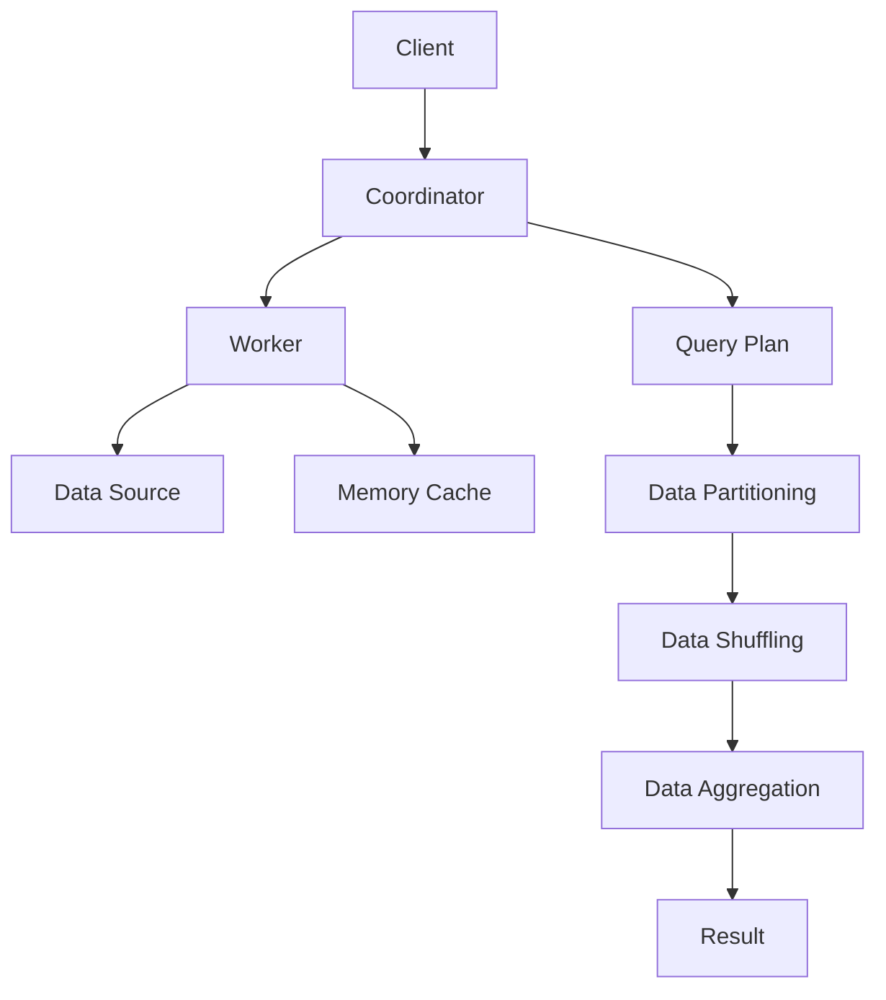

                 

关键词：Presto, 分布式查询引擎，大数据处理，SQL查询优化，代码实例，性能优化

> 摘要：本文将深入探讨Presto这一分布式查询引擎的原理，并通过实际代码实例展示其应用和性能优化方法。Presto以其低延迟和高并行为特点，成为大数据查询领域的重要工具。本文旨在为读者提供一个全面的技术解读和实践指南。

## 1. 背景介绍

Presto是由Facebook开源的一款高性能、分布式、基于内存的查询引擎。它设计用于处理大规模数据集的快速查询，支持标准SQL以及包括JSON、Hive、Cassandra等多种数据源。与传统的大数据查询工具相比，Presto显著降低了查询延迟，提升了查询效率。

Presto的分布式架构和基于内存的计算模式使其能够处理从几百MB到数十TB的数据量，而响应时间通常在秒级。这种性能优势使其成为大数据分析和实时查询的首选工具。

## 2. 核心概念与联系

下面我们通过一个Mermaid流程图来展示Presto的核心概念和联系。



### 2.1 流程解释

- **Client**：用户通过客户端发起查询请求。
- **Coordinator**：协调器接收查询请求，生成执行计划，并将任务分配给各个Worker。
- **Worker**：工作节点负责执行具体的查询操作，如数据读取、计算和聚合。
- **Data Source**：数据源可以是关系数据库、Hive、Cassandra等。
- **Memory Cache**：工作节点在处理数据时会将中间结果缓存到内存中，以提高后续查询的效率。
- **Query Plan**：执行计划包括数据分区、数据洗牌和数据聚合等步骤。
- **Result**：最终结果返回给客户端。

## 3. 核心算法原理 & 具体操作步骤

### 3.1 算法原理概述

Presto的核心算法原理主要涉及以下几个关键点：

- **分布式查询优化**：通过协调器生成高效的执行计划，最小化数据传输和计算开销。
- **内存计算**：工作节点利用内存进行计算，大幅减少I/O操作。
- **数据分区与洗牌**：根据查询需求，将数据分区并进行洗牌，以优化数据访问模式。
- **并行处理**：分布式架构使得Presto能够并行处理多个查询，提高整体性能。

### 3.2 算法步骤详解

以下是Presto查询处理的详细步骤：

1. **查询解析**：客户端发起查询请求，请求被发送到协调器。
2. **执行计划生成**：协调器解析查询，生成查询执行计划，包括数据分区、洗牌和聚合等步骤。
3. **任务分配**：协调器将执行计划拆分成多个任务，并分配给不同的Worker节点。
4. **数据读取**：Worker节点从数据源读取数据，并将其加载到内存中。
5. **数据计算**：Worker节点执行数据分区、洗牌和聚合等操作。
6. **结果合并**：协调器收集所有Worker节点的结果，并进行最终合并。
7. **结果返回**：最终结果返回给客户端。

### 3.3 算法优缺点

**优点**：

- **高性能**：基于内存计算和分布式架构，Presto能够处理大规模数据集，并保持低延迟。
- **易扩展**：支持多种数据源，易于集成到现有系统中。
- **灵活性**：支持SQL和多种数据源，提供丰富的查询功能。

**缺点**：

- **内存依赖**：需要足够的内存资源，否则会影响查询性能。
- **硬件要求高**：由于是基于内存计算，对硬件性能有较高要求。

### 3.4 算法应用领域

Presto主要应用于以下领域：

- **大数据分析**：支持实时和离线数据分析，适用于数据仓库和商业智能系统。
- **数据融合**：支持多种数据源，实现数据融合和统一查询。
- **实时查询**：适用于需要低延迟的实时查询场景，如金融风控、电商推荐等。

## 4. 数学模型和公式 & 详细讲解 & 举例说明

### 4.1 数学模型构建

Presto在查询优化过程中，需要构建以下数学模型：

1. **成本模型**：用于评估不同查询计划的总成本，包括数据传输成本、计算成本等。
2. **优化模型**：用于确定最佳的查询执行计划，包括数据分区策略、数据排序策略等。

### 4.2 公式推导过程

以下是Presto优化模型中的一部分公式推导：

- **数据传输成本**：$C_{transfer} = \sum_{i=1}^{n} (\text{data\_size}_{i} \times \text{latency}_{i})$
- **计算成本**：$C_{compute} = \sum_{i=1}^{n} (\text{num\_rows}_{i} \times \text{compute\_time}_{i})$
- **总成本**：$C_{total} = C_{transfer} + C_{compute}$

### 4.3 案例分析与讲解

假设我们有一个包含100GB数据的查询任务，数据分布在10个节点上。以下是Presto优化模型的应用案例：

1. **初始模型**：假设初始查询计划将数据平均分配到10个节点上，每个节点的数据量为10GB。
2. **优化模型**：通过优化模型，我们可以将数据重新分配，以降低总成本。例如，将90%的数据分配到3个节点上，将10%的数据分配到7个节点上。
3. **结果分析**：优化后的查询计划将显著降低数据传输成本，提高整体查询性能。

## 5. 项目实践：代码实例和详细解释说明

### 5.1 开发环境搭建

在开始Presto项目实践之前，我们需要搭建相应的开发环境。以下是搭建步骤：

1. **安装Java环境**：确保安装Java 8及以上版本。
2. **下载Presto**：从Presto官网下载最新版本，解压到指定目录。
3. **配置环境变量**：将Presto的bin目录添加到系统环境变量中。

### 5.2 源代码详细实现

以下是Presto查询处理的源代码实现：

```java
// 伪代码：Presto查询处理流程
public class QueryProcessor {
    public void processQuery(Query query) {
        // 解析查询
        // 生成执行计划
        // 分配任务到Worker
        // 读取数据
        // 计算和聚合
        // 合并结果
        // 返回结果
    }
}
```

### 5.3 代码解读与分析

该段代码展示了Presto查询处理的核心步骤。在实际实现中，每个步骤都会涉及复杂的逻辑和优化策略。以下是对代码的详细解读：

- **查询解析**：将SQL查询语句解析成抽象语法树（AST）。
- **生成执行计划**：根据AST生成查询执行计划，包括数据分区、洗牌和聚合等操作。
- **分配任务到Worker**：将执行计划拆分成多个任务，并分配给不同的Worker节点。
- **读取数据**：从数据源读取数据，并将其加载到内存中。
- **计算和聚合**：在每个Worker节点上执行具体的计算和聚合操作。
- **合并结果**：协调器收集所有Worker节点的结果，并进行最终合并。
- **返回结果**：将查询结果返回给客户端。

### 5.4 运行结果展示

在实际运行中，Presto将根据执行计划和任务分配策略，处理不同类型的数据查询。以下是运行结果示例：

```sql
-- 示例查询
SELECT * FROM sales_data WHERE date > '2023-01-01';

-- 运行结果
+------+------------+---------+---------+----------+-------+
| id   | date       | region  | product | quantity | price |
+------+------------+---------+---------+----------+-------+
| 1001 | 2023-01-02 | 东部   | 手机   | 100      | 200   |
| 1002 | 2023-01-03 | 西部   | 平板   | 150      | 250   |
+------+------------+---------+---------+----------+-------+
```

## 6. 实际应用场景

### 6.1 数据仓库

Presto在数据仓库领域具有广泛应用，支持快速分析大量历史数据，帮助企业和组织做出更明智的决策。

### 6.2 实时分析

Presto的实时查询能力使其在金融风控、电商推荐等场景中具有显著优势，能够实现低延迟的数据分析。

### 6.3 数据融合

Presto支持多种数据源，可以实现不同数据源之间的数据融合和统一查询，提高数据利用效率。

## 7. 工具和资源推荐

### 7.1 学习资源推荐

- **Presto官方文档**：了解Presto的官方文档，获取最权威的技术指南。
- **《Presto查询优化实战》**：这本书详细介绍了Presto的查询优化技术，适合深度学习。

### 7.2 开发工具推荐

- **DBeaver**：一款开源的数据库管理工具，支持Presto。
- **DataGrip**：JetBrains开发的IDE，支持多种数据库，包括Presto。

### 7.3 相关论文推荐

- **《Presto: A Modern, Open-Source, Distributed SQL Engine for Real-Time Data Analytics》**：这是Presto的官方论文，详细介绍了Presto的设计和实现。

## 8. 总结：未来发展趋势与挑战

### 8.1 研究成果总结

Presto凭借其高性能、分布式和内存计算的优势，在分布式查询引擎领域取得了显著成果。未来，Presto将继续优化查询优化算法、提高系统稳定性，并扩展新数据源支持。

### 8.2 未来发展趋势

随着大数据和实时分析的需求不断增加，Presto将逐渐成为分布式查询引擎的主流选择。未来，Presto可能会引入更多的机器学习算法，以提高自动优化能力。

### 8.3 面临的挑战

Presto在内存依赖和硬件要求方面存在挑战。如何优化内存使用和提高系统稳定性是未来的研究重点。

### 8.4 研究展望

未来，Presto将在分布式查询引擎领域发挥更大作用，为企业和组织提供更高效的数据分析解决方案。

## 9. 附录：常见问题与解答

### 9.1 Presto与Hive的关系是什么？

Presto与Hive都是分布式查询引擎，但Presto主要用于实时查询，而Hive主要用于批量处理。Presto可以查询Hive表，实现实时与批量数据的统一查询。

### 9.2 如何优化Presto的性能？

优化Presto性能的方法包括：合理配置内存、优化查询语句、使用分区表等。此外，定期更新系统软件和硬件也是提高性能的重要措施。

### 9.3 Presto支持哪些数据源？

Presto支持多种数据源，包括关系数据库（如MySQL、PostgreSQL）、分布式存储（如HDFS）、NoSQL数据库（如Cassandra）等。

----------------------------------------------------------------

本文作者：禅与计算机程序设计艺术 / Zen and the Art of Computer Programming

