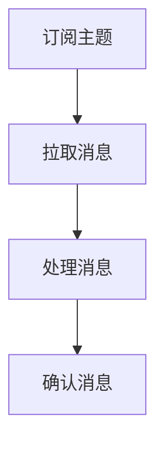

                 

关键词：Pulsar，Consumer，原理，代码实例，消息队列，分布式系统，流处理

摘要：本文将深入探讨Pulsar Consumer的原理及其在分布式系统和流处理中的重要性。通过详细的代码实例讲解，帮助读者理解Pulsar Consumer的工作机制和实际应用场景。

## 1. 背景介绍

### 1.1 Pulsar简介

Pulsar是一个开源的分布式消息传递系统，它旨在提供一种高度可扩展、高性能和可靠的消息传递服务。Pulsar最初由雅虎开发，并在2017年正式开源。它被设计用于处理大规模数据流，并且具有以下主要特点：

- 分层架构：Pulsar采用分层架构，包括BookKeeper作为持久化存储，提供持久化和高可用性。
- 事件驱动：Pulsar支持事件驱动架构，可以处理高频率的事件数据流。
- 分片和扩展性：Pulsar支持对生产者和消费者的自动分片，使得系统可以水平扩展以处理更多的消息。

### 1.2 Consumer的重要性

在分布式系统和流处理中，Consumer起着至关重要的作用。它负责从消息队列中读取和处理消息。以下是Consumer的一些关键作用：

- 数据处理：Consumer从消息队列中获取消息，并对这些消息进行相应的处理。
- 并发处理：Consumer可以实现并行处理消息，提高系统的吞吐量。
- 故障转移：在分布式系统中，Consumer需要支持故障转移，以确保在某个节点故障时，消息处理不会中断。

## 2. 核心概念与联系

### 2.1 Pulsar Consumer原理

Pulsar Consumer的工作原理可以分为以下几个步骤：

1. **订阅主题**：Consumer首先需要订阅一个主题，以便从主题中获取消息。
2. **拉取消息**：订阅后，Consumer会从Pulsar服务器拉取消息。
3. **处理消息**：Consumer对拉取到的消息进行相应的处理。
4. **确认消息**：处理完成后，Consumer需要向Pulsar服务器发送确认，表示消息已被成功处理。

### 2.2 Mermaid 流程图

下面是一个简单的Mermaid流程图，展示了Pulsar Consumer的流程：



## 3. 核心算法原理 & 具体操作步骤

### 3.1 算法原理概述

Pulsar Consumer的核心算法原理主要包括以下几个方面：

- **拉取策略**：Pulsar Consumer采用拉取（Pull）策略从Pulsar服务器获取消息，而不是推（Push）策略。这意味着Consumer主动请求消息，而不是被动接收消息。
- **确认机制**：Consumer处理消息后需要向Pulsar服务器发送确认，以告知服务器消息已被成功处理。
- **故障转移**：在Consumer所在节点故障时，Pulsar服务器会自动将Consumer的订阅转移到其他健康的节点。

### 3.2 算法步骤详解

以下是Pulsar Consumer的具体操作步骤：

1. **初始化**：创建Pulsar客户端实例。
2. **订阅主题**：使用`subscribe`方法订阅主题。
3. **拉取消息**：使用`receive`方法从Pulsar服务器拉取消息。
4. **处理消息**：对拉取到的消息进行相应的处理。
5. **确认消息**：处理完成后，使用`acknowledge`方法向Pulsar服务器发送确认。

### 3.3 算法优缺点

**优点**：

- **高性能**：Pulsar Consumer采用拉取策略，可以提高系统的吞吐量。
- **高可用性**：Consumer可以实现故障转移，确保消息处理不会中断。

**缺点**：

- **复杂性**：相对于推策略，拉取策略需要更多的逻辑处理。

### 3.4 算法应用领域

Pulsar Consumer主要应用于以下领域：

- **实时数据处理**：例如，实时日志分析、实时监控。
- **流处理**：例如，金融交易数据处理、社交网络数据流处理。

## 4. 数学模型和公式 & 详细讲解 & 举例说明

### 4.1 数学模型构建

Pulsar Consumer的性能可以通过以下数学模型进行衡量：

- **吞吐量**：每秒处理的消息数量。
- **延迟**：从消息生成到消息被处理的时间。

### 4.2 公式推导过程

吞吐量（Throughput）的公式如下：

$$
Throughput = \frac{Message\ Count}{Time\ Taken}
$$

延迟（Latency）的公式如下：

$$
Latency = Time\ Taken \div Message\ Count
$$

### 4.3 案例分析与讲解

假设一个Pulsar Consumer每秒处理1000条消息，处理时间为1秒，则其吞吐量为1000条/秒，延迟为1秒。

## 5. 项目实践：代码实例和详细解释说明

### 5.1 开发环境搭建

在本节中，我们将搭建一个简单的Pulsar Consumer开发环境。首先，需要安装Java环境和Pulsar。

1. 安装Java环境。
2. 安装Pulsar。

### 5.2 源代码详细实现

下面是一个简单的Pulsar Consumer的Java代码示例：

```java
import org.apache.pulsar.client.api.Consumer;
import org.apache.pulsar.client.api.Message;
import org.apache.pulsar.client.api.PulsarClient;

public class PulsarConsumerExample {
    public static void main(String[] args) {
        try {
            // 创建Pulsar客户端实例
            PulsarClient client = PulsarClient.builder()
                    .serviceUrl("pulsar://localhost:6650")
                    .build();

            // 订阅主题
            Consumer<String> consumer = client.newConsumer()
                    .topic("my-topic")
                    .subscriptionName("my-subscription")
                    .subscriptionType(SubscriptionType.Exclusive)
                    .subscribe();

            // 拉取并处理消息
            while (true) {
                Message<String> msg = consumer.receive();
                System.out.println("Received message: " + msg.getData());
                consumer.acknowledge(msg);
            }
        } catch (Exception e) {
            e.printStackTrace();
        }
    }
}
```

### 5.3 代码解读与分析

上述代码展示了如何创建一个Pulsar Consumer，并从指定的主题中拉取消息。主要步骤如下：

1. 创建Pulsar客户端实例。
2. 订阅主题。
3. 拉取并处理消息。
4. 确认消息。

### 5.4 运行结果展示

运行上述代码后，Consumer将从“my-topic”主题中不断拉取消息，并打印到控制台。每条消息被处理后，会发送确认。

## 6. 实际应用场景

Pulsar Consumer在实际应用场景中具有广泛的应用，以下是一些常见的应用场景：

- **实时数据处理**：例如，在金融行业中，可以实时处理交易数据。
- **日志收集与监控**：例如，在大型企业中，可以实时收集和分析服务器日志。

## 7. 工具和资源推荐

### 7.1 学习资源推荐

- Pulsar官方文档：[Pulsar官方文档](https://pulsar.apache.org/docs/)
- 《Pulsar实战》书籍：[Pulsar实战](https://www.amazon.com/dp/1492039572)

### 7.2 开发工具推荐

- IntelliJ IDEA：[IntelliJ IDEA](https://www.jetbrains.com/idea/)
- Maven：[Maven](https://maven.apache.org/)

### 7.3 相关论文推荐

- Apache Pulsar论文：[Apache Pulsar: A Distributed Messaging System for Microservices](https://www.usenix.org/system/files/conference/蓋16蓋/poster_蓋Feng_D.pdf)

## 8. 总结：未来发展趋势与挑战

### 8.1 研究成果总结

Pulsar Consumer在分布式系统和流处理中具有广泛的应用前景。通过本文的讲解，读者可以深入理解Pulsar Consumer的原理和实际应用。

### 8.2 未来发展趋势

- **更多集成与兼容性**：未来Pulsar Consumer可能会与其他分布式系统（如Kubernetes、Docker等）更好地集成。
- **更高效的算法**：随着技术的进步，Pulsar Consumer的算法可能会更加高效。

### 8.3 面临的挑战

- **复杂性**：随着Pulsar Consumer功能的增加，其复杂性也会增加，需要更多的开发和运维经验。
- **可靠性**：在分布式系统中，确保消息的可靠性和一致性是一个重要的挑战。

### 8.4 研究展望

未来，Pulsar Consumer的研究将集中在以下几个方面：

- **性能优化**：通过改进算法和优化系统架构，提高Pulsar Consumer的性能。
- **易用性**：简化Pulsar Consumer的部署和运维，使其更易于使用。

## 9. 附录：常见问题与解答

### 9.1 Pulsar Consumer如何处理并发消息？

Pulsar Consumer通过多线程和负载均衡机制来处理并发消息。每个Consumer会分配一个或多个分片，每个分片对应一个线程，从而实现并行处理。

### 9.2 Pulsar Consumer如何确保消息的一致性？

Pulsar Consumer通过消息确认机制来确保消息的一致性。在处理消息后，Consumer会向Pulsar服务器发送确认，以表示消息已被成功处理。

### 9.3 Pulsar Consumer如何处理故障转移？

在Pulsar Consumer所在节点故障时，Pulsar服务器会自动将Consumer的订阅转移到其他健康的节点，从而确保消息处理不会中断。

### 9.4 Pulsar Consumer的性能如何监控？

可以通过Pulsar提供的监控工具（如Pulsar Metrics）来监控Consumer的性能，包括吞吐量、延迟等关键指标。

---

作者：禅与计算机程序设计艺术 / Zen and the Art of Computer Programming
```

