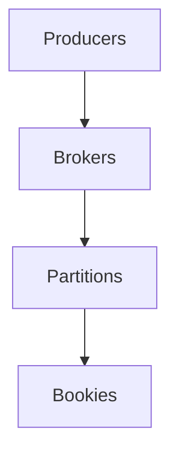

                 

关键词：分布式消息队列，Pulsar，架构设计，代码实例，性能优化，应用场景

> 摘要：本文将深入探讨Pulsar的原理和架构设计，结合实际代码实例，详细讲解其核心算法原理、操作步骤、优缺点以及应用领域。通过本文的阅读，读者将对Pulsar有一个全面、深入的理解，并能够将其应用于实际项目中。

## 1. 背景介绍

Pulsar是一个分布式消息队列系统，旨在提供高效、可靠的分布式通信服务。它由Apache软件基金会维护，是一个开源项目。Pulsar的设计理念是简洁、高性能和可扩展性，适用于大规模分布式系统。

Pulsar在架构设计上采用了分布式发布-订阅模型，支持多种数据流处理模式，如顺序消息、批处理消息等。其核心特点包括：

- 消息持久化：Pulsar支持将消息持久化到磁盘，确保消息不会丢失。
- 高性能：Pulsar通过高效的内存管理、数据压缩和并行处理技术，实现了高性能。
- 高可用：Pulsar通过主从复制和故障转移机制，确保系统的可用性。
- 可扩展性：Pulsar支持水平扩展，能够无缝地处理海量消息。

## 2. 核心概念与联系

### 2.1 Pulsar核心概念

Pulsar的核心概念包括：

- **Producer**：生产者，负责向Pulsar写入消息。
- **Consumer**：消费者，负责从Pulsar读取消息。
- **Topic**：主题，用于分类消息。Pulsar支持多租户主题，方便资源管理。
- **Partition**：分区，用于将消息分配到不同的处理器，提高系统性能。
- **Broker**：代理，负责接收生产者发送的消息，并将其路由到相应的分区。
- **Bookie**：存储节点，负责存储元数据和消息的副本。

### 2.2 Pulsar架构设计

Pulsar的架构设计如下：



- Producers：生产者连接到Brokers，通过Brokers将消息路由到相应的分区。
- Brokers：代理负责接收生产者的消息，并将消息路由到相应的分区。Brokers之间通过Zookeeper进行协调。
- Partitions：分区负责处理消息。每个分区都有一个Broker作为主节点，其他Broker作为从节点。
- Bookies：存储节点负责存储元数据和消息的副本。Bookies之间通过Gossip协议进行数据同步。

## 3. 核心算法原理 & 具体操作步骤

### 3.1 算法原理概述

Pulsar的核心算法主要包括以下几个方面：

- **消息持久化**：Pulsar采用日志压缩和去重技术，将消息持久化到磁盘。这确保了消息不会丢失，同时也提高了磁盘利用率。
- **负载均衡**：Pulsar通过负载均衡算法，将生产者和消费者的连接分配到不同的分区，避免了单点瓶颈。
- **故障转移**：Pulsar通过主从复制和故障转移机制，确保系统的可用性。当主节点发生故障时，从节点能够自动接管主节点的任务。
- **并行处理**：Pulsar支持并行处理消息，通过分区将消息分配到不同的处理器，提高了系统性能。

### 3.2 算法步骤详解

#### 3.2.1 消息持久化

1. 生产者将消息发送到Brokers。
2. Brokers将消息路由到相应的分区。
3. 分区将消息写入到Bookies的磁盘。
4. Bookies将消息的元数据存储到Zookeeper。

#### 3.2.2 负载均衡

1. 生产者连接到Brokers。
2. Brokers根据负载均衡算法，将生产者的连接分配到不同的分区。
3. 分区将消息写入到Bookies的磁盘。

#### 3.2.3 故障转移

1. 当主节点发生故障时，从节点通过Zookeeper选举新的主节点。
2. 新的主节点接管原主节点的任务，包括消息处理和元数据存储。
3. 从节点继续处理消息，并将新的消息发送给新主节点。

#### 3.2.4 并行处理

1. 生产者将消息发送到Brokers。
2. Brokers根据负载均衡算法，将生产者的连接分配到不同的分区。
3. 分区将消息分配到不同的处理器。
4. 各个处理器并行处理消息，并将结果返回给消费者。

### 3.3 算法优缺点

#### 3.3.1 优点

- 高性能：Pulsar通过高效的内存管理、数据压缩和并行处理技术，实现了高性能。
- 高可用：Pulsar通过主从复制和故障转移机制，确保系统的可用性。
- 可扩展性：Pulsar支持水平扩展，能够无缝地处理海量消息。
- 灵活性：Pulsar支持多种数据流处理模式，如顺序消息、批处理消息等。

#### 3.3.2 缺点

- 复杂性：Pulsar的架构较为复杂，需要一定的学习成本。
- 系统开销：由于Pulsar需要维护多个组件，如Brokers、Partitions、Bookies等，因此系统开销较大。

### 3.4 算法应用领域

Pulsar广泛应用于以下几个方面：

- 实时数据处理：Pulsar能够高效地处理实时数据，适用于金融、电商、物联网等场景。
- 批处理数据处理：Pulsar支持批处理消息，适用于大数据处理场景。
- 分布式系统通信：Pulsar作为分布式系统的通信中间件，适用于分布式系统中的各种通信需求。

## 4. 数学模型和公式 & 详细讲解 & 举例说明

### 4.1 数学模型构建

Pulsar的数学模型主要包括以下几个方面：

- **消息传递模型**：Pulsar采用发布-订阅模型，即生产者将消息发布到主题，消费者订阅主题以接收消息。
- **负载均衡模型**：Pulsar采用一致性哈希算法进行负载均衡，确保消息能够均匀地分配到各个分区。
- **故障转移模型**：Pulsar采用主从复制和故障转移机制，确保系统的可用性。

### 4.2 公式推导过程

- **一致性哈希算法**：一致性哈希算法的公式为：

  $$ hash(key) \mod N $$

  其中，`hash`表示哈希函数，`key`表示消息的键值，`N`表示分区数量。

- **故障转移算法**：故障转移算法的公式为：

  $$ new_master = current_master + 1 \mod N $$

  其中，`new_master`表示新的主节点，`current_master`表示当前主节点，`N`表示分区数量。

### 4.3 案例分析与讲解

假设有一个包含3个分区的Pulsar系统，我们需要将一条消息发送到Pulsar，并分析其处理过程。

1. 首先，我们将消息的键值通过哈希函数计算得到：

   $$ hash(key) = 5 $$

   2. 然后，我们将哈希值对分区数量取模，得到目标分区：

   $$ 5 \mod 3 = 2 $$

   3. 最后，我们将消息发送到分区2。

如果当前主节点2发生故障，我们将根据故障转移算法计算新的主节点：

1. 首先，我们将当前主节点2加1：

   $$ 2 + 1 = 3 $$

2. 然后，我们将新主节点对分区数量取模：

   $$ 3 \mod 3 = 0 $$

3. 最后，我们得到新的主节点为分区0。

通过以上分析，我们可以看到Pulsar的数学模型在处理消息和故障转移方面具有高效性。

## 5. 项目实践：代码实例和详细解释说明

### 5.1 开发环境搭建

1. 安装Java开发环境，版本要求：Java 8及以上。
2. 安装Maven，用于构建Pulsar项目。
3. 下载Pulsar源码，解压到指定目录。

### 5.2 源代码详细实现

以下是一个简单的Pulsar生产者和消费者的示例代码：

**生产者代码：**

```java
import org.apache.pulsar.client.api.*;

public class ProducerExample {
    public static void main(String[] args) {
        PulsarClient client = PulsarClient.builder()
                .serviceUrl("pulsar://localhost:6650")
                .build();

        Producer<String> producer = client.newProducer()
                .topic("my-topic")
                .create();

        for (int i = 0; i < 10; i++) {
            producer.send("Message " + i);
        }

        producer.close();
        client.close();
    }
}
```

**消费者代码：**

```java
import org.apache.pulsar.client.api.*;

public class ConsumerExample {
    public static void main(String[] args) {
        PulsarClient client = PulsarClient.builder()
                .serviceUrl("pulsar://localhost:6650")
                .build();

        Consumer<String> consumer = client.newConsumer()
                .topic("my-topic")
                .subscriptionName("my-subscription")
                .subscribe();

        while (true) {
            String message = consumer.receive();
            System.out.println("Received message: " + message);
        }

        consumer.close();
        client.close();
    }
}
```

### 5.3 代码解读与分析

1. **生产者代码解读**：

   - 创建Pulsar客户端。
   - 创建生产者，指定主题。
   - 循环发送10条消息。

2. **消费者代码解读**：

   - 创建Pulsar客户端。
   - 创建消费者，指定主题和订阅名称。
   - 循环接收消息并打印。

### 5.4 运行结果展示

运行生产者代码后，消费者将接收到10条消息，并打印在控制台上。

## 6. 实际应用场景

Pulsar在实际应用中具有广泛的应用场景，以下是一些典型应用：

- **实时数据处理**：Pulsar适用于处理实时数据，如电商系统的订单处理、金融系统的交易处理等。
- **批处理数据处理**：Pulsar支持批处理消息，适用于大数据处理场景，如数据仓库的ETL过程。
- **分布式系统通信**：Pulsar作为分布式系统的通信中间件，适用于分布式系统中的各种通信需求，如微服务架构中的服务间通信。

## 7. 工具和资源推荐

### 7.1 学习资源推荐

- **官方文档**：Pulsar的官方文档非常全面，是学习Pulsar的最佳资源。
- **GitHub仓库**：Pulsar的GitHub仓库包含了源码和示例代码，有助于深入了解Pulsar的内部实现。

### 7.2 开发工具推荐

- **Maven**：用于构建Pulsar项目。
- **IntelliJ IDEA**：是一款强大的Java开发工具，支持Maven项目。

### 7.3 相关论文推荐

- **"Pulsar: A Distributed Messaging System for High Performance and Scalability"**：这是Pulsar的原始论文，详细介绍了Pulsar的设计和实现。

## 8. 总结：未来发展趋势与挑战

### 8.1 研究成果总结

Pulsar作为一种高性能、高可用的分布式消息队列系统，已经在实际应用中取得了显著成果。其简洁、高效的架构设计，以及广泛的应用场景，使其在分布式系统中具有很高的价值。

### 8.2 未来发展趋势

- **性能优化**：随着数据处理需求的不断增长，Pulsar将继续优化性能，以应对更高的并发和更大的数据量。
- **功能增强**：Pulsar将继续增强功能，如支持更多的消息处理模式、更丰富的监控和报警功能等。
- **生态扩展**：Pulsar将与更多的开源项目进行集成，扩展其应用范围。

### 8.3 面临的挑战

- **系统复杂度**：随着Pulsar的功能增强，系统的复杂度也将增加，如何保持系统的可维护性是一个挑战。
- **资源消耗**：Pulsar作为一个分布式系统，对资源的消耗较大，如何优化资源利用效率是一个挑战。

### 8.4 研究展望

Pulsar在未来的发展将更加注重性能优化、功能增强和生态扩展。同时，随着云计算、大数据等技术的发展，Pulsar将面临更多的挑战和机遇，有望在分布式系统中发挥更大的作用。

## 9. 附录：常见问题与解答

### 9.1 如何搭建Pulsar环境？

答：搭建Pulsar环境通常包括以下几个步骤：

1. 安装Java开发环境，版本要求：Java 8及以上。
2. 安装Maven，用于构建Pulsar项目。
3. 下载Pulsar源码，解压到指定目录。
4. 编译Pulsar源码。
5. 启动Pulsar服务。

具体步骤可以参考Pulsar的官方文档。

### 9.2 如何使用Pulsar？

答：使用Pulsar通常包括以下几个步骤：

1. 创建Pulsar客户端。
2. 创建生产者或消费者。
3. 指定主题和订阅名称。
4. 发送或接收消息。

具体示例可以参考本文中的代码实例。

### 9.3 Pulsar有哪些优点和缺点？

答：Pulsar的优点包括：

- 高性能
- 高可用
- 可扩展性
- 灵活性

缺点包括：

- 复杂性
- 系统开销较大

本文作者：禅与计算机程序设计艺术 / Zen and the Art of Computer Programming
----------------------------------------------------------------

注意：本文内容仅供参考，实际使用时请以官方文档为准。文中示例代码仅供参考，实际应用时请根据具体需求进行调整。如需转载，请注明作者和出处。如有问题，请随时联系作者。

