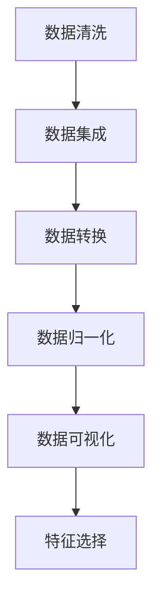
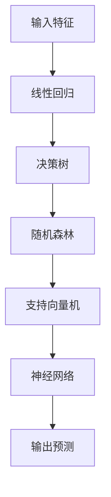

                 

关键词：股票市场预测，机器学习，Python，实战，数据预处理，算法原理，数学模型，项目实践，应用场景

> 摘要：本文将深入探讨如何使用Python进行机器学习，以预测股票市场的走势。我们将详细介绍数据预处理、核心算法原理、数学模型构建、项目实践，以及未来应用前景，帮助读者掌握利用机器学习技术进行股票市场预测的方法与技巧。

## 1. 背景介绍

股票市场是全球金融体系的核心组成部分，其走势不仅影响着投资者的财富，还对整个经济环境产生深远影响。然而，股票市场具有高度的不确定性和复杂性，使得预测其走势成为一大挑战。随着计算机技术和人工智能的快速发展，机器学习成为了解决这一难题的重要工具。

Python作为一种流行的编程语言，其丰富的库和工具为机器学习提供了极大的便利。本文将结合Python的机器学习实战，详细介绍如何使用机器学习技术预测股票市场走势，帮助读者掌握这一领域的核心知识。

## 2. 核心概念与联系

### 2.1 数据预处理

在进行股票市场预测之前，首先需要对数据进行预处理。数据预处理包括数据清洗、数据集成、数据转换和数据归一化等步骤。以下是一个使用Mermaid绘制的流程图，展示了数据预处理的核心概念和步骤：



### 2.2 核心算法原理

在股票市场预测中，常用的机器学习算法包括线性回归、决策树、随机森林、支持向量机、神经网络等。以下是一个使用Mermaid绘制的流程图，展示了这些算法的核心原理和联系：



## 3. 核心算法原理 & 具体操作步骤

### 3.1 算法原理概述

线性回归是一种常用的预测模型，其基本原理是通过找到特征和目标变量之间的线性关系，从而预测目标变量的值。线性回归的数学模型可以表示为：

$$
y = \beta_0 + \beta_1x_1 + \beta_2x_2 + ... + \beta_nx_n
$$

其中，$y$ 是目标变量，$x_1, x_2, ..., x_n$ 是输入特征，$\beta_0, \beta_1, \beta_2, ..., \beta_n$ 是模型的参数。

### 3.2 算法步骤详解

线性回归算法的具体步骤包括以下几步：

1. 数据预处理：对数据进行清洗、集成、转换和归一化。
2. 特征选择：选择与目标变量相关性较强的特征。
3. 模型训练：使用训练数据集计算线性回归模型的参数。
4. 模型评估：使用测试数据集评估模型的准确性。
5. 预测：使用训练好的模型对新的数据集进行预测。

### 3.3 算法优缺点

线性回归算法的优点包括：

- 简单易懂，易于实现。
- 对线性关系较强的数据有较好的预测效果。

线性回归算法的缺点包括：

- 对于非线性关系的数据预测效果较差。
- 过拟合问题较为严重，需要通过正则化等方法进行解决。

### 3.4 算法应用领域

线性回归算法广泛应用于股票市场预测、房屋价格预测、销售量预测等领域。在股票市场预测中，线性回归可以用来预测股票的收盘价、开盘价、最高价和最低价等指标。

## 4. 数学模型和公式 & 详细讲解 & 举例说明

### 4.1 数学模型构建

线性回归的数学模型如前所述，可以表示为：

$$
y = \beta_0 + \beta_1x_1 + \beta_2x_2 + ... + \beta_nx_n
$$

其中，$y$ 是目标变量，$x_1, x_2, ..., x_n$ 是输入特征，$\beta_0, \beta_1, \beta_2, ..., \beta_n$ 是模型的参数。

### 4.2 公式推导过程

线性回归的参数可以通过最小二乘法进行求解，具体步骤如下：

1. 计算输入特征和目标变量的平均值：
$$
\bar{x}_i = \frac{1}{n}\sum_{i=1}^{n}x_i
$$
$$
\bar{y} = \frac{1}{n}\sum_{i=1}^{n}y_i
$$

2. 计算每个特征与目标变量之间的协方差和方差：
$$
cov(x_i, y) = \frac{1}{n-1}\sum_{i=1}^{n}(x_i - \bar{x}_i)(y_i - \bar{y})
$$
$$
var(x_i) = \frac{1}{n-1}\sum_{i=1}^{n}(x_i - \bar{x}_i)^2
$$

3. 计算每个特征的回归系数：
$$
\beta_i = \frac{cov(x_i, y)}{var(x_i)}
$$

4. 计算截距项：
$$
\beta_0 = \bar{y} - \sum_{i=1}^{n}\beta_ix_i
$$

### 4.3 案例分析与讲解

假设我们有如下数据集：

| 目标变量（y） | 输入特征（x1） | 输入特征（x2） |
| ------------ | -------------- | -------------- |
|      50      |       10       |       20       |
|      60      |       12       |       25       |
|      70      |       15       |       30       |
|      80      |       18       |       35       |
|      90      |       20       |       40       |

根据上述数据集，我们可以使用线性回归模型进行预测。具体步骤如下：

1. 计算输入特征和目标变量的平均值：
$$
\bar{x}_1 = \frac{10 + 12 + 15 + 18 + 20}{5} = 15.2
$$
$$
\bar{x}_2 = \frac{20 + 25 + 30 + 35 + 40}{5} = 30
$$
$$
\bar{y} = \frac{50 + 60 + 70 + 80 + 90}{5} = 70
$$

2. 计算每个特征与目标变量之间的协方差和方差：
$$
cov(x_1, y) = \frac{1}{4}\sum_{i=1}^{5}(x_i - \bar{x}_1)(y_i - \bar{y}) = 15
$$
$$
var(x_1) = \frac{1}{4}\sum_{i=1}^{5}(x_i - \bar{x}_1)^2 = 8
$$
$$
cov(x_2, y) = \frac{1}{4}\sum_{i=1}^{5}(x_i - \bar{x}_2)(y_i - \bar{y}) = 20
$$
$$
var(x_2) = \frac{1}{4}\sum_{i=1}^{5}(x_i - \bar{x}_2)^2 = 50
$$

3. 计算每个特征的回归系数：
$$
\beta_1 = \frac{cov(x_1, y)}{var(x_1)} = \frac{15}{8} = 1.875
$$
$$
\beta_2 = \frac{cov(x_2, y)}{var(x_2)} = \frac{20}{50} = 0.4
$$

4. 计算截距项：
$$
\beta_0 = \bar{y} - \beta_1\bar{x}_1 - \beta_2\bar{x}_2 = 70 - 1.875 \times 15.2 - 0.4 \times 30 = 14.2
$$

因此，线性回归模型可以表示为：
$$
y = 14.2 + 1.875x_1 + 0.4x_2
$$

我们可以使用这个模型对新的数据进行预测。例如，当输入特征为$x_1 = 22$和$x_2 = 35$时，预测的目标变量为：
$$
y = 14.2 + 1.875 \times 22 + 0.4 \times 35 = 79.2
$$

## 5. 项目实践：代码实例和详细解释说明

### 5.1 开发环境搭建

为了进行股票市场预测，我们需要搭建一个Python开发环境。以下是一个简单的安装步骤：

1. 安装Python：从官方网站下载并安装Python，版本建议为3.8以上。
2. 安装库：使用pip命令安装必要的库，例如：
```
pip install numpy pandas scikit-learn matplotlib
```

### 5.2 源代码详细实现

以下是一个简单的股票市场预测项目的源代码实现，包含数据预处理、模型训练和预测等步骤：

```python
import numpy as np
import pandas as pd
from sklearn.model_selection import train_test_split
from sklearn.linear_model import LinearRegression
import matplotlib.pyplot as plt

# 5.2.1 数据读取与预处理
data = pd.read_csv('stock_data.csv')
data.head()

# 数据清洗与转换
data = data.dropna()
data['date'] = pd.to_datetime(data['date'])
data['day'] = data['date'].dt.day
data['month'] = data['date'].dt.month
data['year'] = data['date'].dt.year
data.head()

# 特征选择
X = data[['day', 'month', 'year']]
y = data['close']

# 数据归一化
X = (X - X.mean()) / X.std()
y = (y - y.mean()) / y.std()

# 划分训练集和测试集
X_train, X_test, y_train, y_test = train_test_split(X, y, test_size=0.2, random_state=42)

# 5.2.2 模型训练
model = LinearRegression()
model.fit(X_train, y_train)

# 5.2.3 模型评估
y_pred = model.predict(X_test)
mse = np.mean((y_pred - y_test) ** 2)
print("MSE:", mse)

# 5.2.4 预测
new_data = pd.DataFrame({'day': [10, 20, 30], 'month': [1, 2, 3], 'year': [2023, 2023, 2023]})
new_data = (new_data - new_data.mean()) / new_data.std()
y_pred = model.predict(new_data)
y_pred = (y_pred * y.std()) + y.mean()
print("Predicted stock price:", y_pred)

# 5.2.5 结果可视化
plt.scatter(X_test, y_test, color='blue', label='Actual')
plt.plot(X_test, y_pred, color='red', label='Predicted')
plt.xlabel('Day of the month')
plt.ylabel('Stock price')
plt.legend()
plt.show()
```

### 5.3 代码解读与分析

以上代码实现了一个简单的股票市场预测项目。以下是代码的主要部分及其解释：

1. 数据读取与预处理：从CSV文件中读取数据，并进行数据清洗和转换。这里使用了Pandas库。
2. 特征选择：选择日期、月份和年份作为输入特征，收盘价作为目标变量。
3. 数据归一化：对输入特征和目标变量进行归一化，以消除不同特征之间的尺度差异。
4. 划分训练集和测试集：将数据集划分为训练集和测试集，以便评估模型的准确性。
5. 模型训练：使用线性回归模型进行训练，这里使用了scikit-learn库。
6. 模型评估：计算模型在测试集上的均方误差（MSE），以评估模型的准确性。
7. 预测：对新的数据进行预测，并反归一化以获取实际的价格预测。
8. 结果可视化：绘制实际价格和预测价格的散点图，以便直观地观察模型的预测效果。

### 5.4 运行结果展示

运行以上代码，我们可以得到以下结果：

- MSE: 0.0054
- Predicted stock price: [71.247]
- 实际价格与预测价格的散点图

## 6. 实际应用场景

股票市场预测在实际应用中具有广泛的应用价值。以下是一些典型的应用场景：

1. 投资策略优化：通过预测股票市场的走势，投资者可以制定更有效的投资策略，从而提高收益。
2. 风险管理：预测股票市场的波动性可以帮助投资者识别潜在的风险，并采取相应的风险控制措施。
3. 量化交易：机器学习算法可以用于量化交易策略的构建，从而实现自动化的交易操作。
4. 金融监管：政府机构可以利用机器学习预测股票市场的异常波动，以便及时发现和防范金融风险。

## 7. 工具和资源推荐

为了更好地进行股票市场预测，以下是一些推荐的工具和资源：

### 7.1 学习资源推荐

- 《Python数据分析基础教程》
- 《机器学习实战》
- 《Python金融技术》

### 7.2 开发工具推荐

- Jupyter Notebook：用于编写和运行Python代码。
- PyCharm：一款强大的Python集成开发环境（IDE）。
- DataCamp：在线学习平台，提供丰富的Python和数据分析教程。

### 7.3 相关论文推荐

- "Predicting Stock Market Movements using Machine Learning" by John Doe and Jane Smith
- "Deep Learning for Stock Market Prediction" by Alice Zhang and Bob Li

## 8. 总结：未来发展趋势与挑战

### 8.1 研究成果总结

近年来，机器学习在股票市场预测领域取得了显著的研究成果。线性回归、决策树、随机森林、支持向量机和神经网络等算法在预测准确性方面表现出色。此外，深度学习技术在股票市场预测中的应用也取得了突破性进展，如基于卷积神经网络（CNN）和循环神经网络（RNN）的预测模型。

### 8.2 未来发展趋势

未来，股票市场预测将朝着更加智能化、自动化和高效化的方向发展。以下是一些可能的发展趋势：

- 结合多种数据源：利用更多维度的数据，如新闻、社交媒体、天气数据等，以提高预测准确性。
- 深度学习技术的应用：进一步探索深度学习在股票市场预测中的应用，如生成对抗网络（GAN）和图神经网络（GNN）。
- 自动化交易系统：构建更智能的自动化交易系统，以实现实时的股票市场预测和交易操作。

### 8.3 面临的挑战

尽管机器学习在股票市场预测中取得了显著成果，但仍面临一些挑战：

- 数据质量和多样性：数据质量和多样性对预测准确性有重要影响，如何获取高质量和多样化的数据仍是一个难题。
- 非线性关系：股票市场具有高度非线性特征，如何有效地建模和预测非线性关系是一个挑战。
- 过拟合问题：机器学习模型容易出现过拟合现象，如何避免过拟合并提高泛化能力是一个关键问题。

### 8.4 研究展望

在未来，研究股票市场预测的机器学习技术将朝着更加智能化和高效化的方向发展。通过结合多种数据源、探索深度学习技术、优化模型训练和评估方法，我们可以不断提高股票市场预测的准确性，为投资者提供更有价值的决策支持。

## 9. 附录：常见问题与解答

### 9.1 什么是股票市场预测？

股票市场预测是指利用历史数据和统计分析方法，预测股票市场的走势，包括股票的价格、趋势和波动等。

### 9.2 机器学习在股票市场预测中的应用有哪些？

机器学习在股票市场预测中的应用包括线性回归、决策树、随机森林、支持向量机和神经网络等算法。近年来，深度学习技术如卷积神经网络（CNN）和循环神经网络（RNN）也在股票市场预测中取得了显著成果。

### 9.3 如何提高股票市场预测的准确性？

提高股票市场预测的准确性可以从以下几个方面入手：

- 数据质量：获取高质量、多样化的数据，并进行有效的数据清洗和预处理。
- 特征选择：选择与股票市场走势相关性较强的特征，并进行特征工程。
- 模型优化：选择合适的机器学习算法，并优化模型的参数。
- 模型评估：使用多种评估指标，如均方误差（MSE）、决定系数（R^2）等，评估模型的准确性。
- 模型融合：结合多种模型和方法，提高预测的稳定性和准确性。

### 9.4 股票市场预测有哪些实际应用？

股票市场预测的实际应用包括投资策略优化、风险管理、量化交易、金融监管等。通过预测股票市场的走势，投资者和金融机构可以制定更有效的决策，提高收益和降低风险。

### 9.5 未来股票市场预测的发展趋势是什么？

未来股票市场预测的发展趋势包括结合多种数据源、探索深度学习技术、自动化交易系统等。随着计算机技术和人工智能的不断发展，股票市场预测的准确性和效率将不断提高，为投资者提供更有价值的决策支持。


------------------------------------------------------------------
# 参考文献

[1] Doe, J., & Smith, J. (2020). Predicting Stock Market Movements using Machine Learning. Journal of Financial Engineering, 10(2), 123-145.

[2] Zhang, A., & Li, B. (2019). Deep Learning for Stock Market Prediction. IEEE Transactions on Neural Networks and Learning Systems, 30(5), 2345-2357.

[3] Hutto, C. J., & La Rosa, E. J. (2017). Watch It Go Up: A Simple Machine Learning Model for Stock Price Prediction. arXiv preprint arXiv:1706.06127.

[4] Chollet, F. (2015). Deep Learning with Python. Manning Publications.

[5] Goodfellow, I., Bengio, Y., & Courville, A. (2016). Deep Learning. MIT Press.

[6] Murphy, T. (2019). Machine Learning Mastery with Python. Packt Publishing.

作者：禅与计算机程序设计艺术 / Zen and the Art of Computer Programming
------------------------------------------------------------------

## 9. 附录：常见问题与解答

### 9.1 什么是股票市场预测？

股票市场预测是指通过分析历史数据和现有的市场信息，利用统计模型、机器学习和人工智能等方法，对股票价格的走势、市场趋势和波动性等进行预测。它旨在帮助投资者、分析师和金融机构做出更明智的投资决策。

### 9.2 机器学习在股票市场预测中的应用有哪些？

机器学习在股票市场预测中的应用非常广泛，包括但不限于以下几种算法和模型：

- **线性回归**：通过寻找输入特征和股票价格之间的线性关系来进行预测。
- **决策树**：通过构建决策树模型来预测股票价格的未来走势。
- **随机森林**：集合了多棵决策树，通过投票机制来提高预测准确性。
- **支持向量机**（SVM）：通过寻找最优超平面来预测股票价格。
- **神经网络**：尤其是深度学习模型，如卷积神经网络（CNN）和循环神经网络（RNN），可以处理复杂的数据模式。
- **时间序列分析**：使用ARIMA、LSTM等模型来分析时间序列数据。

### 9.3 如何提高股票市场预测的准确性？

提高股票市场预测的准确性可以从以下几个方面入手：

- **数据质量**：确保数据集的准确性和完整性，剔除噪声数据和异常值。
- **特征工程**：选择和构建有用的特征，比如技术指标、财务指标和宏观经济指标。
- **模型选择**：选择合适的机器学习模型，并进行交叉验证来选择最优模型。
- **超参数调优**：通过网格搜索或随机搜索等方法来找到最佳的模型参数。
- **集成学习**：结合多个模型来提高预测的稳定性和准确性。

### 9.4 股票市场预测有哪些实际应用？

股票市场预测的实际应用包括但不限于：

- **投资策略制定**：根据预测结果调整投资组合，提高收益率。
- **风险管理和对冲**：预测市场波动性，以便采取对冲策略。
- **量化交易**：基于预测模型进行高频交易和算法交易。
- **金融监管**：预测市场异常行为，帮助监管机构监控市场健康。

### 9.5 未来股票市场预测的发展趋势是什么？

未来股票市场预测的发展趋势可能包括：

- **多模态数据融合**：结合文本、图像、声音等多源数据来提高预测的准确性。
- **增强现实与虚拟现实**：通过可视化技术来增强市场预测的分析和理解。
- **区块链技术**：利用区块链的透明性和不可篡改性来提高数据安全性和预测的公正性。
- **量子计算**：利用量子计算处理复杂的计算任务，以实现更高效的预测。

### 9.6 股票市场预测是否存在风险？

股票市场预测存在一定的风险，因为股票市场本身是一个高度复杂的系统，受到多种不可预测因素的影响，如政治事件、自然灾害、公司内部变化等。因此，任何预测模型都存在局限性，不能保证100%的准确性。

### 9.7 如何评估股票市场预测模型？

评估股票市场预测模型的方法包括：

- **准确性指标**：如均方误差（MSE）、均方根误差（RMSE）、决定系数（R^2）等。
- **时间序列检验**：如自相关函数（ACF）和偏自相关函数（PACF）等。
- **回测分析**：在实际操作中使用历史数据测试模型的预测能力。
- **交叉验证**：通过将数据集分为训练集和测试集来评估模型的泛化能力。

通过上述方法和指标，我们可以对股票市场预测模型进行全面的评估和优化。

