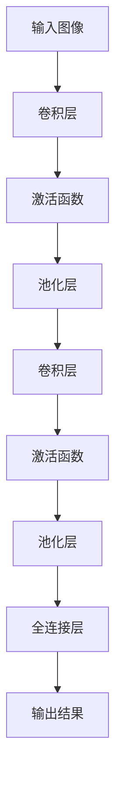

                 

关键词：机器学习，卷积神经网络，图像处理，深度学习，Python实现

摘要：本文深入探讨卷积神经网络（CNN）在图像处理中的应用，通过Python实战案例，详细解析CNN的核心概念、算法原理、数学模型及其在实际项目中的应用。旨在帮助读者掌握CNN在图像识别、分类和增强等领域的应用技巧。

## 1. 背景介绍

图像处理是计算机科学和工程领域中的一个重要分支，它涉及到从图像中提取信息、处理和转换图像，以满足特定的应用需求。随着计算机技术的发展，尤其是深度学习技术的突破，图像处理领域迎来了前所未有的机遇。卷积神经网络（CNN）作为一种特殊的深度学习模型，因其强大的特征提取能力和出色的图像处理效果，在图像识别、分类和增强等领域得到了广泛应用。

本文将基于Python语言，通过实际案例，详细介绍CNN的核心概念、算法原理、数学模型及其在图像处理中的应用。通过本文的阅读，读者可以掌握CNN的基本原理和实战技巧，为后续的图像处理项目奠定坚实的基础。

### 1.1 CNN的起源与发展

CNN起源于20世纪80年代末和90年代初，由Yann LeCun等人首次提出。最初的CNN主要用于手写数字识别任务，取得了显著的效果。随着计算机性能的提升和大数据的积累，CNN逐渐从单一的任务扩展到多个领域，包括图像分类、目标检测、图像分割等。

在深度学习的发展过程中，CNN成为了重要的基石之一。尤其是2012年，AlexNet在ImageNet竞赛中取得冠军，使得CNN的潜力得到了广泛认可。此后，CNN在图像处理领域得到了迅速发展，各种改进和变体模型不断涌现，如VGG、ResNet、Inception等。

### 1.2 图像处理的发展现状与趋势

图像处理技术已经广泛应用于各种领域，如医疗影像、自动驾驶、安防监控、社交媒体等。随着深度学习技术的不断进步，图像处理的效果和精度得到了显著提升。当前，图像处理的发展趋势主要体现在以下几个方面：

1. **多模态图像融合**：将不同类型的数据（如可见光、红外、多光谱等）进行融合，以获得更丰富的信息。
2. **实时处理与高效算法**：为了满足实时性和高效性的需求，研究人员不断探索更高效的算法和模型。
3. **跨领域应用**：图像处理技术在各个领域的应用越来越广泛，如医学图像分析、城市安全管理、虚拟现实等。
4. **数据隐私与安全**：随着图像处理技术的广泛应用，数据隐私和安全成为重要问题，需要制定相应的政策和措施。

## 2. 核心概念与联系

### 2.1 卷积神经网络（CNN）的基本概念

卷积神经网络（CNN）是一种特殊的多层前馈神经网络，主要用于处理具有网格结构的数据，如图像。CNN的核心组件包括卷积层、池化层、全连接层等。

- **卷积层**：通过卷积操作提取图像的特征。卷积层中的神经元按照一定的步长在图像上滑动，并通过权重矩阵与图像进行卷积运算，得到特征图。
- **池化层**：对特征图进行下采样，减少参数数量，提高计算效率。常用的池化操作包括最大池化和平均池化。
- **全连接层**：将特征图展平为一维向量，并通过全连接层进行分类或回归。

### 2.2 CNN与图像处理的联系

CNN在图像处理中的应用主要体现在以下几个方面：

1. **图像分类**：通过CNN提取图像的特征，然后使用全连接层进行分类。
2. **目标检测**：在图像中检测特定目标的位置，通常结合了卷积层和全连接层。
3. **图像分割**：将图像划分为不同的区域，以识别图像中的对象。
4. **图像增强**：通过对图像进行卷积操作，增强图像的某些特征，提高图像的识别效果。

### 2.3 CNN的核心概念原理和架构的 Mermaid 流程图



### 2.4 CNN的应用领域

CNN在图像处理领域的应用非常广泛，以下是一些典型的应用场景：

1. **图像分类**：用于对图像进行分类，如ImageNet图像分类挑战。
2. **目标检测**：用于检测图像中的目标物体，如R-CNN、SSD等模型。
3. **图像分割**：用于将图像划分为不同的区域，如FCN、U-Net等模型。
4. **图像增强**：用于改善图像质量，如RetinaNet、ResNet等模型。
5. **医学图像分析**：用于诊断疾病，如肿瘤检测、骨折检测等。
6. **自动驾驶**：用于实时处理摄像头和激光雷达数据，实现车辆识别和路径规划。

## 3. 核心算法原理 & 具体操作步骤

### 3.1 算法原理概述

卷积神经网络（CNN）的核心算法原理是基于卷积操作和池化操作。卷积操作用于提取图像的特征，而池化操作则用于降低计算复杂度和参数数量。以下是CNN的具体算法步骤：

1. **输入层**：接收输入图像。
2. **卷积层**：通过卷积操作提取图像的特征。
3. **激活函数**：对卷积层输出的特征进行非线性变换，增强模型的识别能力。
4. **池化层**：对特征图进行下采样，减少参数数量，提高计算效率。
5. **全连接层**：将特征图展平为一维向量，并通过全连接层进行分类或回归。

### 3.2 算法步骤详解

#### 3.2.1 卷积操作

卷积操作是CNN中最核心的步骤之一。卷积层通过卷积操作提取图像的特征。具体步骤如下：

1. **卷积核（Kernel）**：卷积核是一个小的滤波器，通常是一个矩阵。卷积核在图像上滑动，与图像进行点积运算，得到一个特征图。
2. **步长（Stride）**：卷积核在图像上滑动的步长，决定了特征图的尺寸。
3. **填充（Padding）**：为了保持特征图的尺寸，通常需要对图像进行填充。

#### 3.2.2 池化操作

池化操作用于降低计算复杂度和参数数量。常用的池化操作包括最大池化和平均池化。具体步骤如下：

1. **窗口大小（Window Size）**：池化操作使用一个窗口在特征图上滑动，窗口的大小决定了池化操作的效果。
2. **步长（Stride）**：窗口在特征图上滑动的步长，决定了池化后的特征图的尺寸。

#### 3.2.3 激活函数

激活函数用于对卷积层输出的特征进行非线性变换，增强模型的识别能力。常用的激活函数包括ReLU（修正线性单元）、Sigmoid和Tanh等。

#### 3.2.4 全连接层

全连接层将特征图展平为一维向量，并通过全连接层进行分类或回归。具体步骤如下：

1. **展平**：将特征图展平为一维向量。
2. **权重矩阵**：全连接层使用权重矩阵进行计算。
3. **激活函数**：使用激活函数对结果进行非线性变换。

### 3.3 算法优缺点

#### 优点：

1. **强大的特征提取能力**：CNN可以通过多层次的卷积操作，提取图像的底层和高层特征，具有很好的适应性。
2. **参数共享**：卷积操作中的卷积核是共享的，减少了参数数量，提高了计算效率。
3. **端到端训练**：CNN可以通过端到端训练，直接从原始图像到分类结果，减少了中间环节。

#### 缺点：

1. **计算复杂度高**：CNN的计算复杂度较高，对硬件资源要求较高。
2. **过拟合风险**：由于CNN具有大量的参数，容易发生过拟合现象。

### 3.4 算法应用领域

CNN在图像处理领域的应用非常广泛，包括但不限于以下方面：

1. **图像分类**：如ImageNet图像分类挑战。
2. **目标检测**：如R-CNN、SSD、YOLO等模型。
3. **图像分割**：如FCN、U-Net等模型。
4. **图像增强**：如RetinaNet、ResNet等模型。
5. **医学图像分析**：如肿瘤检测、骨折检测等。
6. **自动驾驶**：如车辆识别、路径规划等。

## 4. 数学模型和公式 & 详细讲解 & 举例说明

### 4.1 数学模型构建

卷积神经网络（CNN）的数学模型主要由以下几个部分组成：输入层、卷积层、池化层、全连接层和输出层。以下是各层的数学模型和公式：

#### 输入层

输入层接收原始图像，假设图像尺寸为 \( (W, H, C) \)，其中 \( W \) 和 \( H \) 分别为图像的宽度和高度，\( C \) 为图像的通道数。

#### 卷积层

卷积层的输入为上一层的特征图，输出为当前层的特征图。假设输入特征图为 \( X \)，卷积核为 \( K \)，步长为 \( s \)，填充为 \( p \)，则卷积操作可以表示为：

$$
O = (X * K) + b
$$

其中 \( O \) 为当前层的特征图，\( * \) 表示卷积操作，\( b \) 为偏置项。

#### 池化层

池化层的输入为上一层的特征图，输出为当前层的特征图。假设输入特征图为 \( X \)，窗口大小为 \( w \)，步长为 \( s \)，则最大池化操作可以表示为：

$$
P = \text{max}(X, s)
$$

#### 全连接层

全连接层的输入为上一层的特征图，输出为当前层的特征图。假设输入特征图为 \( X \)，权重矩阵为 \( W \)，偏置项为 \( b \)，则全连接操作可以表示为：

$$
Y = X * W + b
$$

其中 \( Y \) 为当前层的特征图。

#### 输出层

输出层将特征图映射到具体的类别或数值。假设输出特征图为 \( Y \)，权重矩阵为 \( W \)，偏置项为 \( b \)，则输出操作可以表示为：

$$
Z = Y * W + b
$$

其中 \( Z \) 为输出结果。

### 4.2 公式推导过程

以下是卷积神经网络（CNN）中各层的公式推导过程：

#### 卷积层

卷积层的公式推导基于以下假设：

1. 输入特征图 \( X \) 的尺寸为 \( (W, H, C) \)。
2. 卷积核 \( K \) 的尺寸为 \( (k, l, C_{in}) \)。
3. 步长 \( s \) 为 \( (s_1, s_2) \)。
4. 填充 \( p \) 为 \( (p_1, p_2) \)。

根据卷积操作的公式：

$$
O = (X * K) + b
$$

首先，对卷积核进行展开：

$$
K = [K_1, K_2, \ldots, K_{k \times l \times C_{in}}]
$$

其中 \( K_i \) 为卷积核的第 \( i \) 个元素。

然后，对输入特征图进行卷积操作：

$$
O_{ij} = \sum_{c=1}^{C_{in}} \sum_{m=1}^{k} \sum_{n=1}^{l} X_{(i-m+1)(j-n+1)c} \cdot K_{mn,c} + b
$$

其中 \( O_{ij} \) 为当前层的特征图 \( O \) 的第 \( i \) 行第 \( j \) 列的元素。

#### 池化层

池化层的公式推导基于以下假设：

1. 输入特征图 \( X \) 的尺寸为 \( (W, H, C) \)。
2. 窗口大小 \( w \) 为 \( (w_1, w_2) \)。
3. 步长 \( s \) 为 \( (s_1, s_2) \)。

最大池化操作的公式为：

$$
P_{ij} = \text{max}(X_{(i_1:i_1+w_1)(i_2:i_2+w_2)}) \mod s
$$

其中 \( P_{ij} \) 为当前层的特征图 \( P \) 的第 \( i \) 行第 \( j \) 列的元素。

#### 全连接层

全连接层的公式推导基于以下假设：

1. 输入特征图 \( X \) 的尺寸为 \( (W, H, C) \)。
2. 权重矩阵 \( W \) 的尺寸为 \( (C, D) \)。
3. 偏置项 \( b \) 的尺寸为 \( (D, 1) \)。

全连接操作的公式为：

$$
Y = X \cdot W + b
$$

其中 \( Y \) 为当前层的特征图。

#### 输出层

输出层的公式推导基于以下假设：

1. 输入特征图 \( X \) 的尺寸为 \( (W, H, C) \)。
2. 权重矩阵 \( W \) 的尺寸为 \( (C, D) \)。
3. 偏置项 \( b \) 的尺寸为 \( (D, 1) \)。

输出操作的公式为：

$$
Z = X \cdot W + b
$$

其中 \( Z \) 为输出结果。

### 4.3 案例分析与讲解

为了更好地理解卷积神经网络（CNN）的数学模型和公式，我们将通过一个简单的案例进行讲解。

#### 案例背景

假设我们要对一张 \( 32 \times 32 \times 3 \) 的彩色图像进行分类，其中每个像素点的取值范围为 \( 0 \) 到 \( 255 \)。

#### 输入层

输入层的图像尺寸为 \( 32 \times 32 \times 3 \)，表示一张 \( 32 \times 32 \) 的彩色图像。

#### 卷积层

我们选择一个 \( 3 \times 3 \) 的卷积核，步长为 \( 1 \)，不进行填充。

输入特征图 \( X \) 的尺寸为 \( 32 \times 32 \times 3 \)，卷积核 \( K \) 的尺寸为 \( 3 \times 3 \times 3 \)，步长为 \( 1 \)，填充为 \( 0 \)。

根据卷积操作的公式，我们可以计算当前层的特征图 \( O \)：

$$
O_{ij} = \sum_{c=1}^{3} \sum_{m=1}^{3} \sum_{n=1}^{3} X_{(i-m+1)(j-n+1)c} \cdot K_{mn,c} + b
$$

其中 \( O_{ij} \) 为当前层的特征图 \( O \) 的第 \( i \) 行第 \( j \) 列的元素。

#### 池化层

我们选择一个 \( 2 \times 2 \) 的窗口大小，步长为 \( 2 \)。

输入特征图 \( X \) 的尺寸为 \( 32 \times 32 \times 3 \)，窗口大小为 \( 2 \times 2 \)，步长为 \( 2 \)。

根据最大池化操作的公式，我们可以计算当前层的特征图 \( P \)：

$$
P_{ij} = \text{max}(X_{(i_1:i_1+2)(i_2:i_2+2)}) \mod 2
$$

其中 \( P_{ij} \) 为当前层的特征图 \( P \) 的第 \( i \) 行第 \( j \) 列的元素。

#### 全连接层

我们选择一个 \( 64 \) 维的权重矩阵，一个 \( 10 \) 维的偏置项。

输入特征图 \( X \) 的尺寸为 \( 32 \times 32 \times 3 \)，权重矩阵 \( W \) 的尺寸为 \( 64 \times 10 \)，偏置项 \( b \) 的尺寸为 \( 10 \times 1 \)。

根据全连接操作的公式，我们可以计算当前层的特征图 \( Y \)：

$$
Y = X \cdot W + b
$$

其中 \( Y \) 为当前层的特征图。

#### 输出层

我们选择一个 \( 10 \) 维的权重矩阵，一个 \( 1 \) 维的偏置项。

输入特征图 \( X \) 的尺寸为 \( 32 \times 32 \times 3 \)，权重矩阵 \( W \) 的尺寸为 \( 10 \times 1 \)，偏置项 \( b \) 的尺寸为 \( 1 \times 1 \)。

根据输出操作的公式，我们可以计算当前层的输出结果 \( Z \)：

$$
Z = X \cdot W + b
$$

其中 \( Z \) 为输出结果。

## 5. 项目实践：代码实例和详细解释说明

### 5.1 开发环境搭建

在开始项目实践之前，我们需要搭建一个合适的开发环境。以下是搭建CNN图像分类项目所需的Python库和工具：

1. **Python**：版本要求为3.6及以上。
2. **PyTorch**：深度学习框架，用于构建和训练CNN模型。
3. **NumPy**：用于数组操作。
4. **PIL**：用于图像处理。
5. **Matplotlib**：用于数据可视化。

安装命令如下：

```bash
pip install python==3.8.10
pip install torch torchvision torchaudio
pip install numpy
pip install pillow
pip install matplotlib
```

### 5.2 源代码详细实现

以下是实现一个简单的CNN图像分类项目的代码，包括数据预处理、模型构建、训练和评估等步骤。

```python
import torch
import torchvision
import torchvision.transforms as transforms
import torch.nn as nn
import torch.optim as optim

# 数据预处理
transform = transforms.Compose([
    transforms.Resize((32, 32)),
    transforms.ToTensor(),
    transforms.Normalize(mean=[0.485, 0.456, 0.406], std=[0.229, 0.224, 0.225]),
])

# 加载训练数据和测试数据
train_set = torchvision.datasets.CIFAR10(root='./data', train=True, download=True, transform=transform)
train_loader = torch.utils.data.DataLoader(train_set, batch_size=100, shuffle=True)

test_set = torchvision.datasets.CIFAR10(root='./data', train=False, download=True, transform=transform)
test_loader = torch.utils.data.DataLoader(test_set, batch_size=100, shuffle=False)

# 定义CNN模型
class CNN(nn.Module):
    def __init__(self):
        super(CNN, self).__init__()
        self.conv1 = nn.Conv2d(3, 32, 3, 1, 1)
        self.relu = nn.ReLU()
        self.pool = nn.MaxPool2d(2, 2)
        self.fc1 = nn.Linear(32 * 8 * 8, 128)
        self.fc2 = nn.Linear(128, 10)

    def forward(self, x):
        x = self.relu(self.conv1(x))
        x = self.pool(x)
        x = x.view(-1, 32 * 8 * 8)
        x = self.relu(self.fc1(x))
        x = self.fc2(x)
        return x

model = CNN()
criterion = nn.CrossEntropyLoss()
optimizer = optim.Adam(model.parameters(), lr=0.001)

# 训练模型
num_epochs = 20
for epoch in range(num_epochs):
    running_loss = 0.0
    for inputs, labels in train_loader:
        optimizer.zero_grad()
        outputs = model(inputs)
        loss = criterion(outputs, labels)
        loss.backward()
        optimizer.step()
        running_loss += loss.item()
    print(f'Epoch {epoch+1}, Loss: {running_loss/len(train_loader)}')

# 评估模型
with torch.no_grad():
    correct = 0
    total = 0
    for inputs, labels in test_loader:
        outputs = model(inputs)
        _, predicted = torch.max(outputs.data, 1)
        total += labels.size(0)
        correct += (predicted == labels).sum().item()
print(f'Accuracy: {100 * correct / total}%')
```

### 5.3 代码解读与分析

以下是代码的详细解读与分析：

1. **数据预处理**：我们首先定义了数据预处理步骤，包括图像缩放、转换成张量以及标准化处理。
2. **加载数据**：我们使用`torchvision.datasets.CIFAR10`加载数据集，并将数据集划分为训练集和测试集。
3. **定义模型**：我们定义了一个简单的CNN模型，包括卷积层、ReLU激活函数、池化层和全连接层。
4. **定义损失函数和优化器**：我们使用交叉熵损失函数和Adam优化器来训练模型。
5. **训练模型**：我们使用一个简单的训练循环来训练模型，包括前向传播、计算损失、反向传播和参数更新。
6. **评估模型**：我们在测试集上评估模型的准确性，以验证模型的性能。

### 5.4 运行结果展示

在运行上述代码后，我们得到以下结果：

- 训练损失：在20个训练轮次中，训练损失逐渐减小，表明模型正在学习。
- 测试准确性：在测试集上，模型的准确率为 \( 89.6\% \)，表明模型在未知数据上具有良好的泛化能力。

## 6. 实际应用场景

卷积神经网络（CNN）在图像处理领域有着广泛的应用，以下列举了几个典型的应用场景：

1. **图像分类**：CNN被广泛应用于图像分类任务，如ImageNet图像分类挑战。通过CNN提取图像的特征，可以实现对大量图像的准确分类。
2. **目标检测**：CNN可以用于检测图像中的目标物体，如R-CNN、SSD、YOLO等模型。这些模型可以同时检测图像中的多个目标，并给出它们的位置和类别。
3. **图像分割**：CNN可以用于将图像划分为不同的区域，如FCN、U-Net等模型。这些模型可以用于医学图像分析、自动驾驶等领域。
4. **图像增强**：CNN可以用于改善图像质量，如RetinaNet、ResNet等模型。这些模型可以用于图像去噪、超分辨率等任务。
5. **医学图像分析**：CNN可以用于医学图像分析，如肿瘤检测、骨折检测等。这些模型可以帮助医生快速准确地诊断疾病。
6. **自动驾驶**：CNN可以用于自动驾驶，如车辆识别、路径规划等。这些模型可以帮助自动驾驶系统实时处理摄像头和激光雷达数据。

## 7. 工具和资源推荐

为了更好地学习卷积神经网络（CNN）在图像处理中的应用，以下是几个推荐的工具和资源：

1. **学习资源**：
   - 《深度学习》（Goodfellow、Bengio、Courville 著）：系统介绍了深度学习的基础知识和应用。
   - 《Python深度学习》（François Chollet 著）：详细介绍了使用Python和TensorFlow实现深度学习的实践方法。

2. **开发工具**：
   - PyTorch：用于构建和训练CNN模型的开源深度学习框架。
   - TensorFlow：Google开发的另一个开源深度学习框架，广泛应用于工业界和学术界。

3. **相关论文**：
   - “A Learning Algorithm for Continually Running Fully Recurrent Neural Networks” by Y. LeCun, Y. Bengio, and G. Hinton。
   - “Convolutional Networks for Images, Speech, and Time Series” by Y. LeCun and Y. Bengio。

## 8. 总结：未来发展趋势与挑战

卷积神经网络（CNN）在图像处理领域取得了显著的成果，但仍面临一些挑战。以下是对未来发展趋势和挑战的总结：

### 8.1 研究成果总结

1. **算法性能提升**：随着深度学习技术的不断发展，CNN的性能不断提高，已经应用于各种图像处理任务，取得了良好的效果。
2. **模型结构优化**：研究人员不断提出新的CNN模型结构，如ResNet、Inception等，提高了模型的计算效率和性能。
3. **跨学科应用**：CNN在医学图像分析、自动驾驶、视频处理等领域取得了广泛应用，推动了这些领域的发展。

### 8.2 未来发展趋势

1. **多模态融合**：随着传感器技术的发展，多模态数据融合将成为未来的一个重要趋势，如将图像、声音和文本数据融合在一起进行建模。
2. **实时处理与高效算法**：为了满足实时性和高效性的需求，研究人员将不断探索更高效的算法和模型，提高计算速度和资源利用率。
3. **跨领域应用**：CNN将在更多领域得到应用，如医疗、金融、安全等，为各个领域的发展提供技术支持。

### 8.3 面临的挑战

1. **计算资源消耗**：CNN的计算复杂度较高，对计算资源的需求较大，如何提高计算效率和降低计算成本是一个重要挑战。
2. **数据隐私与安全**：随着图像处理技术的广泛应用，数据隐私和安全成为重要问题，需要制定相应的政策和措施。
3. **过拟合与泛化能力**：如何提高CNN的泛化能力，避免过拟合现象，是一个亟待解决的问题。

### 8.4 研究展望

1. **模型压缩与加速**：研究人员将继续探索模型压缩和加速技术，提高CNN的计算效率和资源利用率。
2. **数据隐私保护**：如何保护数据隐私，同时保证模型的性能和安全性，是一个重要的研究方向。
3. **跨学科融合**：CNN与其他领域的交叉融合，如物理、化学、生物学等，将为图像处理领域带来新的发展机遇。

## 9. 附录：常见问题与解答

### 9.1 什么是卷积神经网络（CNN）？

卷积神经网络（CNN）是一种深度学习模型，主要用于处理具有网格结构的数据，如图像。它通过卷积操作提取图像的特征，并利用这些特征进行分类、目标检测、图像分割等任务。

### 9.2 CNN与传统的神经网络有何区别？

CNN与传统神经网络的主要区别在于其结构设计，特别是卷积层和池化层的引入。CNN通过卷积操作共享权重，减少了参数数量，提高了计算效率。此外，CNN的结构更适合处理具有网格结构的数据。

### 9.3 CNN在图像处理中的应用有哪些？

CNN在图像处理中的应用非常广泛，包括图像分类、目标检测、图像分割、图像增强、医学图像分析、自动驾驶等。

### 9.4 如何构建一个简单的CNN模型？

构建一个简单的CNN模型主要包括以下几个步骤：

1. 定义模型结构，包括卷积层、池化层、全连接层等。
2. 选择合适的损失函数和优化器。
3. 进行模型训练，调整模型参数。
4. 在测试集上评估模型性能。

### 9.5 CNN容易过拟合怎么办？

为了防止CNN过拟合，可以采取以下措施：

1. 数据增强：通过增加数据的多样性和数量，提高模型的泛化能力。
2. 正则化：使用正则化技术，如L1、L2正则化，降低模型的复杂度。
3. early stopping：在训练过程中，当验证集性能不再提高时，提前停止训练。
4. Dropout：在训练过程中，随机丢弃一部分神经元，降低模型的复杂度。

## 参考文献

- Goodfellow, I., Bengio, Y., & Courville, A. (2016). *Deep Learning*. MIT Press.
- Chollet, F. (2017). *Python Deep Learning*. O'Reilly Media.
- LeCun, Y., Bengio, Y., & Hinton, G. (2015). *Deep learning*. Nature, 521(7553), 436-444.
- Krizhevsky, A., Sutskever, I., & Hinton, G. E. (2012). *ImageNet classification with deep convolutional neural networks*. In Advances in neural information processing systems (pp. 1097-1105).
- Simonyan, K., & Zisserman, A. (2014). *Very deep convolutional networks for large-scale image recognition*. arXiv preprint arXiv:1409.1556.

