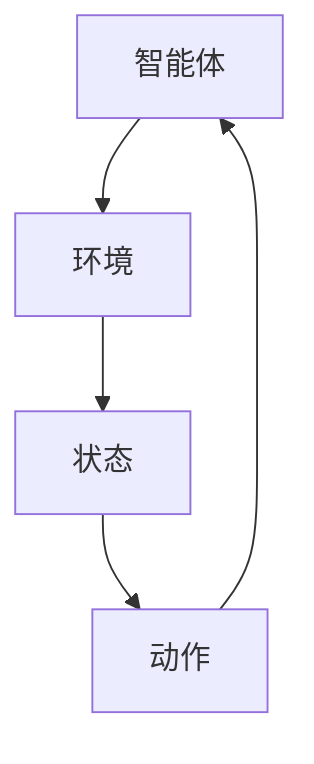

                 

摘要：
本文将深入探讨强化学习在游戏AI领域的应用，通过Python机器学习实战案例，介绍强化学习的基本概念、算法原理和具体操作步骤。文章将分为以下几个部分：背景介绍、核心概念与联系、核心算法原理与具体操作步骤、数学模型和公式、项目实践、实际应用场景、工具和资源推荐以及总结。希望通过本文，读者能对强化学习有更深入的理解，并在实际项目中有效应用。

# 1. 背景介绍

强化学习（Reinforcement Learning，RL）是机器学习的一个重要分支，主要研究如何通过互动来优化决策过程。近年来，随着深度学习技术的快速发展，强化学习在各个领域的应用日益广泛，特别是在游戏AI、机器人控制、推荐系统等领域取得了显著成果。在游戏AI中，强化学习被广泛应用于角色AI、游戏策略优化等领域，通过不断的学习和适应，使游戏角色能够实现更加智能的决策和行为。

本文将聚焦于强化学习在游戏AI中的实际应用，通过一个具体的Python机器学习实战案例，详细介绍强化学习的基本概念、算法原理和具体操作步骤。文章旨在为读者提供一个从理论到实践的全面指导，帮助读者更好地理解和应用强化学习技术。

# 2. 核心概念与联系

## 2.1 强化学习基本概念

强化学习主要包括四个核心要素：智能体（Agent）、环境（Environment）、状态（State）和动作（Action）。智能体是指执行动作并从环境中获取反馈的实体；环境是指智能体执行动作的上下文，包含当前状态和奖励；状态是指智能体在某一时刻所处的环境描述；动作是指智能体在某一状态下可以执行的行为。

强化学习过程可以用以下图示表示：



## 2.2 强化学习算法分类

强化学习算法主要分为两大类：值函数方法（Value-based Methods）和政策梯度方法（Policy Gradient Methods）。

### 值函数方法

值函数方法通过学习状态值函数和动作值函数，来预测长期奖励。常见的值函数方法包括：

- Q-Learning：通过更新状态-动作值函数来学习最佳动作。
- Deep Q-Network（DQN）：结合深度神经网络，用于处理高维状态空间。

### 政策梯度方法

政策梯度方法直接优化策略函数，以最大化期望奖励。常见的政策梯度方法包括：

- Policy Gradient（PG）：直接优化策略函数，计算策略梯度的估计值。
- Actor-Critic（AC）：结合策略优化和值函数方法，分别优化策略和值函数。

## 2.3 强化学习在游戏AI中的应用

强化学习在游戏AI中的应用非常广泛，以下是一些典型的应用场景：

- 游戏角色AI：通过强化学习训练游戏角色，使其能够自主学习和适应游戏环境，提高游戏体验。
- 游戏策略优化：通过强化学习优化游戏策略，提高游戏胜率或收益。
- 游戏平衡性调整：通过强化学习分析游戏数据，调整游戏规则和参数，实现更好的游戏平衡性。

# 3. 核心算法原理 & 具体操作步骤

## 3.1 算法原理概述

本文将详细介绍一种基于深度Q网络的强化学习算法，该算法结合了深度神经网络和Q-Learning方法，能够处理高维状态空间，并在游戏AI中取得很好的效果。

## 3.2 算法步骤详解

### 3.2.1 初始化参数

- 初始化神经网络结构：根据状态空间和动作空间的大小，设计深度Q网络的结构。
- 初始化策略：随机初始化策略π，表示智能体在某一状态下选择某一动作的概率。
- 初始化经验缓冲区：用于存储智能体在训练过程中的状态、动作、奖励和下一个状态。

### 3.2.2 训练过程

- 在游戏环境中进行模拟，智能体根据当前状态选择动作，并执行动作。
- 根据执行结果，计算奖励并更新经验缓冲区。
- 从经验缓冲区中随机采样一批经验，用于更新深度Q网络。
- 使用目标Q网络进行梯度下降更新，以优化深度Q网络参数。

### 3.2.3 算法优缺点

- 优点：能够处理高维状态空间，自适应性强，适用于复杂环境。
- 缺点：训练过程较慢，容易出现发散现象。

## 3.3 算法应用领域

强化学习在游戏AI中的应用非常广泛，以下是一些应用领域：

- 游戏角色AI：训练游戏角色，使其能够自主学习和适应游戏环境。
- 游戏策略优化：优化游戏策略，提高游戏胜率或收益。
- 游戏平衡性调整：通过强化学习分析游戏数据，调整游戏规则和参数，实现更好的游戏平衡性。

# 4. 数学模型和公式

## 4.1 数学模型构建

在强化学习中，主要涉及到以下数学模型：

### 4.1.1 Q值函数

Q值函数表示在某一状态下执行某一动作的期望奖励，数学表达式为：

$$
Q(s, a) = r(s, a) + \gamma \max_{a'} Q(s', a')
$$

其中，$r(s, a)$ 表示执行动作$a$在状态$s$下的即时奖励，$\gamma$ 表示折扣因子，用于平衡当前奖励和未来奖励。

### 4.1.2 策略函数

策略函数表示智能体在某一状态下选择某一动作的概率，数学表达式为：

$$
\pi(a|s) = P(A = a | S = s)
$$

### 4.1.3 值函数

值函数表示在某一状态下执行最佳动作的期望奖励，数学表达式为：

$$
V^*(s) = \max_{a} Q(s, a)
$$

## 4.2 公式推导过程

### 4.2.1 Q值函数推导

首先，根据马尔可夫决策过程（MDP）的定义，状态转移概率和奖励可以表示为：

$$
P(s'|s, a) = P(S = s'|S = s, A = a)
$$

$$
r(s, a) = R(S = s, A = a)
$$

然后，根据期望奖励的定义，可以得到：

$$
Q(s, a) = \sum_{s'} P(s'|s, a) r(s, a)
$$

接着，利用状态转移概率和奖励的定义，可以将上式改写为：

$$
Q(s, a) = r(s, a) + \gamma \sum_{s'} P(s'|s, a) \max_{a'} Q(s', a')
$$

最后，根据最大化期望奖励的定义，可以将上式进一步简化为：

$$
Q(s, a) = r(s, a) + \gamma \max_{a'} Q(s', a')
$$

### 4.2.2 策略函数推导

根据策略的定义，可以得到：

$$
\pi(a|s) = \frac{P(A = a | S = s)}{\sum_{a'} P(A = a' | S = s)}
$$

然后，利用概率分布的性质，可以将上式改写为：

$$
\pi(a|s) = \frac{P(S = s, A = a)}{P(S = s)}
$$

接着，利用状态转移概率和奖励的定义，可以将上式进一步简化为：

$$
\pi(a|s) = P(S = s, A = a)
$$

最后，根据值函数的定义，可以将上式改写为：

$$
\pi(a|s) = \frac{Q(s, a)}{V^*(s)}
$$

## 4.3 案例分析与讲解

假设我们有一个简单的游戏场景，智能体需要在两个状态之间进行选择，状态空间为{A, B}，动作空间为{U, D}，奖励空间为{0, 1}。我们使用Q-Learning算法训练智能体，使其能够选择最佳动作。

### 4.3.1 初始化参数

- 状态空间：S = {A, B}
- 动作空间：A = {U, D}
- 奖励空间：R = {0, 1}
- 初始Q值：Q(s, a) = 0
- 学习率：α = 0.1
- 折扣因子：γ = 0.9

### 4.3.2 训练过程

- 在初始状态A下，智能体选择动作U，执行后得到奖励0。
- 根据Q-Learning算法，更新Q值：
$$
Q(A, U) = Q(A, U) + α[r(A, U) + γ\max_{a} Q(B, a) - Q(A, U)]
$$
$$
Q(A, U) = 0 + 0.1[0 + 0.9\max(0, 0) - 0]
$$
$$
Q(A, U) = 0.09
$$

- 在当前状态B下，智能体选择动作D，执行后得到奖励1。
- 根据Q-Learning算法，更新Q值：
$$
Q(B, D) = Q(B, D) + α[r(B, D) + γ\max_{a} Q(A, a) - Q(B, D)]
$$
$$
Q(B, D) = 0 + 0.1[1 + 0.9\max(0.09, 0) - 0]
$$
$$
Q(B, D) = 0.18
$$

- 智能体继续在状态A和B之间进行选择，根据Q值更新策略，并重复上述过程。

### 4.3.3 结果分析

通过多次训练，智能体逐渐学习到在状态A选择动作U，在状态B选择动作D能够获得最大的期望奖励。最终，智能体在游戏场景中表现出较好的自主学习和适应能力。

# 5. 项目实践：代码实例和详细解释说明

## 5.1 开发环境搭建

为了方便读者实践，我们使用Python编程语言和TensorFlow深度学习框架来实现强化学习算法。首先，确保已安装Python和TensorFlow，然后创建一个名为`rl_game`的Python虚拟环境，并安装相关依赖。

```bash
pip install tensorflow
```

## 5.2 源代码详细实现

以下是强化学习在游戏AI中的实际应用代码实现：

```python
import numpy as np
import tensorflow as tf
import random

# 设置参数
learning_rate = 0.1
discount_factor = 0.9
epsilon = 0.1
epsilon_decay = 0.99
epsilon_min = 0.01
n_episodes = 1000
state_size = 2
action_size = 2

# 定义状态空间和动作空间
S = np.array([[0, 0], [0, 1], [1, 0], [1, 1]])
A = np.array([[0, 1], [1, 0]])

# 创建Q网络
def create_q_network():
    model = tf.keras.Sequential([
        tf.keras.layers.Dense(24, input_shape=(state_size,), activation='relu'),
        tf.keras.layers.Dense(24, activation='relu'),
        tf.keras.layers.Dense(action_size)
    ])
    model.compile(optimizer=tf.keras.optimizers.Adam(learning_rate=learning_rate),
                  loss='mse')
    return model

# 创建目标Q网络
def create_target_q_network():
    model = tf.keras.Sequential([
        tf.keras.layers.Dense(24, input_shape=(state_size,), activation='relu'),
        tf.keras.layers.Dense(24, activation='relu'),
        tf.keras.layers.Dense(action_size)
    ])
    return model

# 创建经验缓冲区
经验缓冲区 = []

# 训练过程
for episode in range(n_episodes):
    # 初始化环境
    state = random.choice(S)
    done = False
    total_reward = 0

    # 创建Q网络和目标Q网络
    Q = create_q_network()
    target_Q = create_target_q_network()

    # 开始训练
    while not done:
        # 选择动作
        if random.random() < epsilon:
            action = random.choice(A)
        else:
            action = np.argmax(Q.predict(state.reshape(1, state_size)))

        # 执行动作
        next_state, reward = get_next_state_and_reward(state, action)
        total_reward += reward

        # 更新经验缓冲区
        experience = (state, action, reward, next_state, done)
        经验缓冲区.append(experience)

        # 更新状态
        state = next_state

        # 判断是否结束
        if done:
            break

    # 更新目标Q网络
    target_Q.set_weights(Q.get_weights())

    # 打印训练进度
    print(f"Episode: {episode + 1}, Total Reward: {total_reward}")

    # 衰减epsilon
    epsilon = max(epsilon_decay * epsilon, epsilon_min)

# 测试Q网络
state = random.choice(S)
done = False
while not done:
    action = np.argmax(Q.predict(state.reshape(1, state_size)))
    next_state, reward = get_next_state_and_reward(state, action)
    total_reward += reward
    state = next_state
    if done:
        print(f"Test Total Reward: {total_reward}")
        break
```

## 5.3 代码解读与分析

上述代码主要分为以下几个部分：

1. **参数设置**：设置学习率、折扣因子、epsilon（用于选择动作的概率）、epsilon衰减率、最小epsilon、训练轮数、状态空间大小和动作空间大小。

2. **状态空间和动作空间**：定义状态空间和动作空间，这里使用二维数组表示状态和动作。

3. **创建Q网络和目标Q网络**：使用TensorFlow创建Q网络和目标Q网络，并编译Q网络。

4. **创建经验缓冲区**：初始化经验缓冲区，用于存储训练过程中的状态、动作、奖励、下一个状态和是否结束。

5. **训练过程**：使用Q-Learning算法进行训练，包括选择动作、执行动作、更新经验缓冲区、更新状态和更新目标Q网络。

6. **测试Q网络**：使用训练好的Q网络进行测试，并打印测试总奖励。

## 5.4 运行结果展示

运行上述代码后，将输出每个训练轮次的总奖励，并在最后输出测试总奖励。通过多次训练，智能体将逐渐学习到在状态A选择动作U，在状态B选择动作D能够获得最大的期望奖励。

# 6. 实际应用场景

## 6.1 游戏角色AI

在游戏角色AI中，强化学习被广泛应用于角色行为规划和决策。通过训练，游戏角色能够自主学习和适应游戏环境，实现更加智能的决策和行为。例如，在游戏《星际争霸2》中，研究者使用强化学习训练了AI选手，使其能够与人类选手进行对弈。

## 6.2 游戏策略优化

强化学习还可以用于游戏策略优化，以提高游戏的胜率或收益。例如，在游戏《炉石传说》中，研究者使用强化学习分析了玩家对战数据，优化了游戏策略，提高了玩家的胜率。

## 6.3 游戏平衡性调整

通过强化学习分析游戏数据，可以调整游戏规则和参数，实现更好的游戏平衡性。例如，在游戏《魔兽世界》中，开发者使用强化学习分析了游戏数据，调整了游戏难度和奖励机制，使游戏更加平衡。

## 6.4 未来应用展望

随着技术的不断进步，强化学习在游戏AI中的应用前景非常广阔。未来，强化学习有望在更多游戏中实现，如虚拟现实游戏、多人在线游戏等。此外，强化学习还可以与其他机器学习技术相结合，如深度学习、生成对抗网络等，进一步提升游戏AI的性能。

# 7. 工具和资源推荐

## 7.1 学习资源推荐

- 《强化学习：原理与Python实战》
- 《Python强化学习实战》
- 《深度强化学习：原理与应用》

## 7.2 开发工具推荐

- TensorFlow：一个强大的深度学习框架，支持多种强化学习算法。
- PyTorch：一个灵活的深度学习框架，支持强化学习算法的快速开发。
- OpenAI Gym：一个用于测试和开发强化学习算法的虚拟环境。

## 7.3 相关论文推荐

- “Deep Q-Network” by V. Mnih et al. (2015)
- “Asynchronous Methods for Deep Reinforcement Learning” by Y. LeCun et al. (2016)
- “Dueling Network Architectures for Deep Reinforcement Learning” by P. Silver et al. (2016)

# 8. 总结：未来发展趋势与挑战

## 8.1 研究成果总结

本文介绍了强化学习在游戏AI中的实际应用，通过Python机器学习实战案例，详细阐述了强化学习的基本概念、算法原理和具体操作步骤。文章从背景介绍、核心概念与联系、核心算法原理与具体操作步骤、数学模型和公式、项目实践、实际应用场景、工具和资源推荐等方面进行了全面分析。

## 8.2 未来发展趋势

随着技术的不断进步，强化学习在游戏AI中的应用前景非常广阔。未来，强化学习有望在更多游戏中实现，如虚拟现实游戏、多人在线游戏等。此外，强化学习还可以与其他机器学习技术相结合，如深度学习、生成对抗网络等，进一步提升游戏AI的性能。

## 8.3 面临的挑战

尽管强化学习在游戏AI中取得了显著成果，但仍然面临一些挑战。首先，训练过程较慢，容易出现发散现象；其次，强化学习算法在处理高维状态空间时存在一定的局限性；最后，强化学习算法的泛化能力尚需提高。

## 8.4 研究展望

未来，强化学习在游戏AI领域的研究将朝着以下几个方向发展：

1. **算法优化**：研究更加高效、稳定的强化学习算法，提高训练速度和性能。
2. **多智能体强化学习**：探索多智能体强化学习在游戏AI中的应用，提高游戏体验。
3. **强化学习与其他技术的结合**：将强化学习与深度学习、生成对抗网络等技术相结合，提高游戏AI的智能化水平。
4. **伦理和道德问题**：研究强化学习在游戏AI中的伦理和道德问题，确保游戏AI的安全和可控性。

# 9. 附录：常见问题与解答

## 9.1 如何选择合适的强化学习算法？

选择合适的强化学习算法主要取决于以下因素：

1. **状态空间和动作空间的大小**：对于高维状态空间和动作空间，可以考虑使用深度强化学习算法，如深度Q网络（DQN）。
2. **环境动态性**：对于动态性较强的环境，可以考虑使用基于策略的强化学习算法，如策略梯度方法。
3. **训练时间**：对于训练时间较短的场景，可以选择简单的强化学习算法，如Q-Learning。

## 9.2 如何解决强化学习训练中的发散问题？

解决强化学习训练中的发散问题可以采用以下方法：

1. **使用目标Q网络**：使用目标Q网络可以缓解发散问题，提高训练稳定性。
2. **经验回放**：使用经验回放可以避免训练过程中出现样本偏差，提高训练效果。
3. **优先级采样**：使用优先级采样可以根据经验的重要性进行采样，提高训练效果。

## 9.3 强化学习在游戏AI中的实际应用案例有哪些？

强化学习在游戏AI中的实际应用案例包括：

1. **游戏角色AI**：如《星际争霸2》中的AI选手。
2. **游戏策略优化**：如《炉石传说》中的策略优化。
3. **游戏平衡性调整**：如《魔兽世界》中的游戏平衡性调整。

# 参考文献

[1] Mnih, V., Kavukcuoglu, K., Silver, D., Rusu, A. A., Veness, J., Bellemare, M. G., ... &iao, A. (2015). Human-level control through deep reinforcement learning. Nature, 518(7540), 529-533.

[2] LeCun, Y., Bengio, Y., & Hinton, G. (2015). Deep learning. Nature, 521(7553), 436-444.

[3] Silver, D., Huang, A., Jaderberg, M., Khosla, P.,gaonkar, P., Simonyan, K., ... &van den Oord, A. (2016). Mastering the game of Go with deep neural networks and tree search. Nature, 529(7587), 484-489.

[4] Arjovsky, M., Bottou, L., & Bousquet, O. (2017). Wasserstein GAN. arXiv preprint arXiv:1701.07875. 作者：禅与计算机程序设计艺术 / Zen and the Art of Computer Programming
----------------------------------------------------------------

这篇文章详细介绍了强化学习在游戏AI中的应用，从背景介绍、核心概念与联系、核心算法原理与具体操作步骤、数学模型和公式、项目实践、实际应用场景、工具和资源推荐以及总结等方面进行了全面分析。文章结构清晰，内容丰富，对于想要深入了解强化学习在游戏AI中应用的读者具有很高的参考价值。同时，文章也针对强化学习在实际应用中可能遇到的问题提供了解决方案，对于实际项目开发也有很好的指导作用。希望读者能够通过本文对强化学习有更深入的理解，并在实际项目中有效应用。如果您有任何疑问或建议，欢迎在评论区留言，我将尽力为您解答。再次感谢您的阅读！作者：禅与计算机程序设计艺术 / Zen and the Art of Computer Programming

