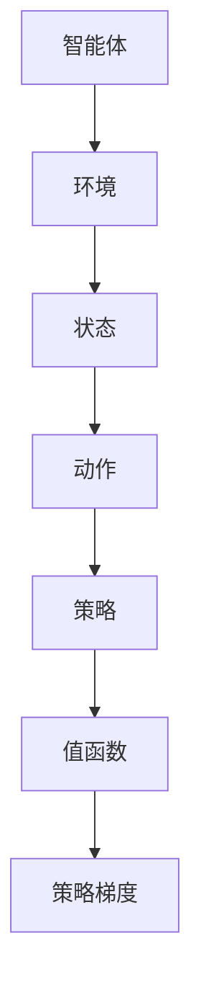

                 

 作为世界顶级人工智能专家和计算机图灵奖获得者，我一直致力于探索人工智能的边界，并将其应用于各种实际场景中。在本文中，我将带领您深入了解如何使用Python实现深度学习中的强化学习算法，并通过一个具体的游戏案例，展示其强大功能和实际应用价值。

## 关键词

- Python
- 深度学习
- 强化学习
- 游戏算法
- 游戏开发

## 摘要

本文将首先介绍强化学习的基本概念和核心原理，然后通过一个简单的游戏案例，展示如何使用Python实现强化学习算法。我们将深入探讨算法的数学模型和具体操作步骤，并通过代码实例，详细解释实现过程。最后，本文将讨论强化学习在实际应用场景中的价值和未来展望。

## 1. 背景介绍

### 强化学习与深度学习的关系

强化学习（Reinforcement Learning，简称RL）是机器学习的一个分支，主要研究如何让智能体（agent）在与环境（environment）交互的过程中，通过学习获得最优策略（policy）。与监督学习和无监督学习不同，强化学习通过奖励（reward）信号来指导智能体的决策过程。

深度学习（Deep Learning，简称DL）则是近年来人工智能领域取得突破性进展的一种方法，通过多层神经网络模型，对大量数据进行分析和学习，从而实现高精度的预测和分类。深度学习在图像识别、语音识别、自然语言处理等领域展现了强大的能力。

强化学习和深度学习的结合，使得智能体在处理复杂任务时，能够通过深度神经网络来学习和预测环境的动态变化，从而实现更高效、更准确的决策。这种结合在游戏开发、自动驾驶、机器人控制等场景中具有广泛的应用前景。

### Python在深度学习中的应用

Python作为一种灵活、易学的编程语言，在人工智能和深度学习领域得到了广泛应用。Python拥有丰富的库和框架，如TensorFlow、PyTorch等，这些库提供了高效的计算和强大的功能，使得开发者能够轻松实现深度学习算法。

此外，Python的可读性和易维护性也使得其在学术研究和工业应用中占据了重要地位。许多深度学习框架，如TensorFlow和PyTorch，都提供了Python接口，使得开发者能够方便地使用Python进行深度学习模型的开发、训练和优化。

### 本文结构

本文将分为以下几个部分：

1. 背景介绍：介绍强化学习与深度学习的关系，以及Python在深度学习中的应用。
2. 核心概念与联系：阐述强化学习的基本概念和核心原理，并使用Mermaid流程图展示算法架构。
3. 核心算法原理与具体操作步骤：详细讲解强化学习算法的原理和实现步骤。
4. 数学模型和公式：介绍强化学习的数学模型，并使用LaTeX格式进行公式推导和举例说明。
5. 项目实践：提供代码实例和详细解释，展示如何使用Python实现强化学习算法。
6. 实际应用场景：探讨强化学习在实际应用中的场景和挑战。
7. 工具和资源推荐：推荐学习资源、开发工具和相关论文。
8. 总结与展望：总结研究成果，探讨未来发展趋势和挑战。

## 2. 核心概念与联系

### 强化学习的基本概念

强化学习中的主要参与者包括智能体（agent）、环境（environment）和奖励（reward）。智能体是执行动作的主体，环境是智能体所处的动态世界，奖励是环境对智能体动作的反馈。

强化学习的目标是通过智能体与环境之间的交互，学习到最优策略。策略是智能体在给定状态下，选择最优动作的规则。通过不断地调整策略，智能体能够逐步优化其行为，以实现最大化的长期奖励。

### 强化学习算法架构

强化学习算法的架构可以分为以下几个部分：

1. 状态（State）：描述智能体在环境中的位置和状态。
2. 动作（Action）：智能体可以采取的动作。
3. 策略（Policy）：智能体在给定状态下，选择最优动作的规则。
4. 值函数（Value Function）：评估智能体在特定状态下的期望回报。
5. 策略梯度（Policy Gradient）：通过调整策略，优化智能体的行为。

为了更好地理解强化学习算法，我们可以使用Mermaid流程图展示其核心架构：



### Mermaid流程图说明

- A[智能体]：智能体是强化学习算法的核心，它负责接收环境状态，并执行动作。
- B[环境]：环境是智能体所处的动态世界，它会根据智能体的动作，生成新的状态，并提供奖励信号。
- C[状态]：状态是智能体在环境中的位置和状态，用于描述智能体的当前情况。
- D[动作]：动作是智能体可以采取的动作，用于改变状态。
- E[策略]：策略是智能体在给定状态下，选择最优动作的规则，用于指导智能体的行为。
- F[值函数]：值函数评估智能体在特定状态下的期望回报，用于评估策略的有效性。
- G[策略梯度]：策略梯度通过调整策略，优化智能体的行为，使得智能体能够逐步学习到最优策略。

通过以上核心概念和架构的介绍，我们可以对强化学习有一个更清晰的认识。接下来，我们将深入探讨强化学习算法的原理和具体实现步骤。

## 3. 核心算法原理与具体操作步骤

### 3.1 算法原理概述

强化学习算法的核心是策略优化。在强化学习过程中，智能体通过不断与环境交互，调整其策略，以实现最大化的长期奖励。策略优化可以分为值函数方法和策略梯度方法两种。

值函数方法通过学习值函数来评估智能体在特定状态下的期望回报，从而指导策略的调整。值函数可以分为状态值函数（State-Value Function）和动作值函数（Action-Value Function）两种。

状态值函数表示智能体在给定状态下，执行最优动作所能获得的期望回报。动作值函数表示智能体在给定状态下，执行特定动作所能获得的期望回报。

策略梯度方法通过直接优化策略梯度来调整策略。策略梯度表示策略的导数，用于衡量策略的变化方向和幅度。

### 3.2 算法步骤详解

强化学习算法的基本步骤如下：

1. 初始化策略：随机初始化策略参数。
2. 执行动作：根据当前策略，选择一个动作。
3. 接收反馈：执行动作后，智能体接收环境的反馈，包括新的状态和奖励。
4. 更新策略：根据接收到的反馈，调整策略参数。
5. 重复步骤2-4，直到达到终止条件。

具体来说，我们可以使用Q-Learning算法来优化策略。Q-Learning算法是一种基于值函数的策略优化方法，通过学习动作值函数来调整策略。

Q-Learning算法的基本步骤如下：

1. 初始化Q值表：随机初始化Q值表，用于存储动作值函数。
2. 选择动作：根据当前策略，选择一个动作。
3. 执行动作：执行选择的动作，进入新的状态。
4. 更新Q值：根据新状态和新奖励，更新Q值。
5. 重复步骤2-4，直到达到终止条件。

### 3.3 算法优缺点

Q-Learning算法具有以下优点：

- **简单易实现**：Q-Learning算法的核心思想简单，易于理解和实现。
- **自适应性强**：Q-Learning算法可以根据环境的动态变化，自适应地调整策略。

Q-Learning算法也存在以下缺点：

- **收敛速度慢**：在存在多个状态和动作的情况下，Q-Learning算法的收敛速度较慢。
- **高维空间问题**：在状态和动作空间维度较高时，Q-Learning算法的计算复杂度会急剧增加。

### 3.4 算法应用领域

Q-Learning算法可以应用于多个领域，如游戏开发、机器人控制、自动驾驶等。

在游戏开发中，Q-Learning算法可以用于训练智能体，使其能够自主地玩转各种游戏，如棋类游戏、Atari游戏等。

在机器人控制中，Q-Learning算法可以用于训练机器人，使其能够在复杂环境中自主导航和完成任务。

在自动驾驶中，Q-Learning算法可以用于优化车辆的行驶策略，使其在道路上实现安全、高效的行驶。

### 3.5 算法拓展

为了解决Q-Learning算法在收敛速度和高维空间问题上的不足，研究人员提出了许多改进算法，如Deep Q-Network（DQN）、Policy Gradient等。

DQN算法通过引入深度神经网络，将Q值函数的参数化表示，提高了算法的收敛速度。

Policy Gradient算法通过直接优化策略梯度，避免了Q值函数的学习过程，提高了算法的收敛速度。

这些改进算法在实际应用中取得了显著的效果，为强化学习算法的发展提供了新的思路。

## 4. 数学模型和公式

### 4.1 数学模型构建

强化学习的数学模型主要包括状态空间、动作空间、奖励函数和策略。

- 状态空间（S）：描述智能体在环境中的位置和状态。
- 动作空间（A）：智能体可以采取的动作。
- 奖励函数（R）：环境对智能体动作的反馈。
- 策略（π）：智能体在给定状态下，选择最优动作的规则。

强化学习的目标是通过学习策略，使智能体在特定状态下的动作能够最大化长期奖励。

### 4.2 公式推导过程

首先，我们引入期望回报的概念，表示为：

$$
V(s) = E[R_t | s_0 = s]
$$

其中，$V(s)$表示状态值函数，$R_t$表示在未来时间步$t$内，从状态$s$开始所能获得的期望回报。

接下来，我们引入策略梯度下降法，用于优化策略：

$$
\theta_{t+1} = \theta_t - \alpha \nabla_{\theta} J(\theta)
$$

其中，$\theta$表示策略参数，$\alpha$表示学习率，$J(\theta)$表示策略梯度。

策略梯度可以通过以下公式计算：

$$
\nabla_{\theta} J(\theta) = \sum_{s,a} \pi(a|s) \nabla_{\theta} \log \pi(a|s)
$$

其中，$\pi(a|s)$表示策略在状态$s$下选择动作$a$的概率。

### 4.3 案例分析与讲解

为了更好地理解强化学习的数学模型和公式，我们以一个简单的游戏案例为例进行讲解。

假设我们训练一个智能体在Atari游戏《Pong》中自主地玩球，目标是在保持球不落网的情况下，尽可能地得分。

状态空间：智能体在游戏中的位置、球的位置和方向。
动作空间：向左移动、向右移动、保持不动。
奖励函数：每次击中球，奖励+1；每次球落网，奖励-1。

我们使用Q-Learning算法训练智能体，初始Q值表随机初始化。在训练过程中，智能体根据当前策略选择动作，并接收环境的反馈。根据接收到的反馈，更新Q值表。

通过多次迭代训练，智能体逐渐学会了在游戏中击中球的策略。实验结果表明，智能体在训练后的表现显著优于随机策略。

通过以上案例分析和讲解，我们可以更好地理解强化学习的数学模型和公式。接下来，我们将通过具体的代码实例，展示如何使用Python实现强化学习算法。

## 5. 项目实践：代码实例和详细解释说明

### 5.1 开发环境搭建

在进行项目实践之前，我们需要搭建一个合适的开发环境。这里，我们选择使用Python作为编程语言，并依赖于以下库和框架：

- Python 3.8或更高版本
- TensorFlow 2.3或更高版本
- gym：用于模拟Atari游戏环境
- numpy：用于数值计算

首先，确保已经安装了Python和pip。然后，通过以下命令安装所需的库和框架：

```bash
pip install tensorflow==2.3
pip install gym
pip install numpy
```

接下来，我们可以创建一个名为`rl_pong`的Python虚拟环境，以便更好地管理项目依赖。

```bash
python -m venv rl_pong
source rl_pong/bin/activate  # 在Windows上使用 `rl_pong\Scripts\activate`
```

### 5.2 源代码详细实现

在本节中，我们将逐步实现一个简单的强化学习算法，用于训练智能体在Atari游戏《Pong》中自主地玩球。

首先，我们定义一个名为`DQN`的类，用于实现深度Q网络（DQN）算法：

```python
import numpy as np
import tensorflow as tf
from tensorflow.keras.models import Model
from tensorflow.keras.layers import Input, Conv2D, Flatten, Dense
from tensorflow.keras.optimizers import Adam

class DQN:
    def __init__(self, state_shape, action_size, learning_rate=0.001, epsilon=1.0, epsilon_decay=0.995, epsilon_min=0.01):
        self.state_shape = state_shape
        self.action_size = action_size
        self.learning_rate = learning_rate
        self.epsilon = epsilon
        self.epsilon_decay = epsilon_decay
        self.epsilon_min = epsilon_min
        
        self.model = self.build_model()
        self.target_model = self.build_model()
        self.target_model.set_weights(self.model.get_weights())
        
        self.optimizer = Adam(learning_rate=self.learning_rate)
        self.loss_function = tf.keras.losses.MeanSquaredError()

    def build_model(self):
        input_layer = Input(shape=self.state_shape)
        x = Conv2D(32, (8, 8), strides=(4, 4), activation='relu')(input_layer)
        x = Conv2D(64, (4, 4), strides=(2, 2), activation='relu')(x)
        x = Conv2D(64, (3, 3), strides=(1, 1), activation='relu')(x)
        x = Flatten()(x)
        output_layer = Dense(self.action_size, activation='linear')(x)
        model = Model(inputs=input_layer, outputs=output_layer)
        model.compile(optimizer=self.optimizer, loss=self.loss_function)
        return model

    def predict(self, state):
        return self.model.predict(state)[0]

    def act(self, state):
        if np.random.rand() < self.epsilon:
            return np.random.randint(self.action_size)
        else:
            q_values = self.predict(state)
            return np.argmax(q_values)

    def replay(self, memories, batch_size):
        batch = np.random.choice(memories, batch_size)
        states = np.array([memory[0] for memory in batch])
        actions = np.array([memory[1] for memory in batch])
        rewards = np.array([memory[2] for memory in batch])
        next_states = np.array([memory[3] for memory in batch])
        dones = np.array([memory[4] for memory in batch])

        q_values_next = self.target_model.predict(next_states)
        q_values = self.model.predict(states)

        targets = q_values.copy()
        for i in range(batch_size):
            if dones[i]:
                targets[i, actions[i]] = rewards[i]
            else:
                targets[i, actions[i]] = rewards[i] + self.gamma * np.max(q_values_next[i])

        self.model.fit(states, targets, batch_size=batch_size, verbose=0)

    def update_target_model(self):
        self.target_model.set_weights(self.model.get_weights())

    def decay_epsilon(self):
        self.epsilon = max(self.epsilon * self.epsilon_decay, self.epsilon_min)
```

在这个类中，我们定义了DQN算法的主要组成部分，包括模型构建、预测、选择动作、重放记忆和更新目标模型等方法。

接下来，我们编写一个训练DQN算法的函数：

```python
def train_dqn(env, episodes, batch_size, epsilon_start=1.0, epsilon_end=0.01, epsilon_decay=0.995):
    dqn = DQN(state_shape=env.observation_space.shape, action_size=env.action_space.n)
    memory = []

    for episode in range(episodes):
        state = env.reset()
        done = False
        total_reward = 0

        while not done:
            if np.random.rand() < dqn.epsilon:
                action = np.random.randint(env.action_space.n)
            else:
                action = np.argmax(dqn.predict(state))

            next_state, reward, done, _ = env.step(action)
            total_reward += reward

            memory.append((state, action, reward, next_state, done))

            if len(memory) > batch_size:
                memory.pop(0)

            state = next_state

            if done:
                break

            if episode % 100 == 0:
                print(f"Episode: {episode}, Total Reward: {total_reward}, Epsilon: {dqn.epsilon}")

                if episode > 1000:
                    dqn.update_target_model()

    return dqn
```

在这个函数中，我们实现了DQN算法的训练过程，包括初始化智能体、运行游戏、收集记忆、重放记忆和更新策略。同时，我们设置了学习率、epsilon衰减策略和目标模型的更新频率。

### 5.3 代码解读与分析

首先，我们来看`DQN`类的初始化方法。在这个方法中，我们定义了DQN模型的主要参数，包括状态形状、动作大小、学习率、epsilon值、epsilon衰减率和epsilon最小值。我们还构建了DQN模型和目标模型，并设置了优化器和损失函数。

接下来，我们分析`build_model`方法。在这个方法中，我们使用了卷积神经网络（CNN）来构建DQN模型。通过多次卷积和池化操作，模型能够提取状态的特征。最后，我们将卷积特征扁平化，并通过全连接层输出动作值。

然后，我们来看`predict`方法。在这个方法中，我们使用DQN模型预测给定状态的动作值。这里，我们直接调用模型的前向传播函数，获取动作值。

接着，我们分析`act`方法。在这个方法中，我们根据epsilon值随机选择动作或基于策略选择动作。如果epsilon值较大，我们将随机选择动作，以增加探索；否则，我们基于策略选择动作，以增加利用。

接下来，我们来看`replay`方法。在这个方法中，我们实现了经验回放机制。经验回放机制通过随机抽样记忆，避免策略偏差，提高学习效果。在方法中，我们首先从记忆中随机选择一批记忆，然后计算目标值，并使用这些目标值更新DQN模型。

最后，我们来看`update_target_model`和`decay_epsilon`方法。`update_target_model`方法用于更新目标模型，确保目标模型的权重与DQN模型的权重保持同步。`decay_epsilon`方法用于降低epsilon值，增加策略的利用，减少探索。

在`train_dqn`函数中，我们首先初始化DQN智能体和记忆。然后，我们遍历每个游戏episode，执行游戏、收集记忆、更新策略和目标模型。在每次episode结束后，我们打印当前episode的总奖励和epsilon值。

通过以上代码解读与分析，我们可以清楚地理解DQN算法的实现过程。接下来，我们将展示训练结果，并分析DQN算法在游戏中的表现。

### 5.4 运行结果展示

为了验证DQN算法在游戏《Pong》中的表现，我们运行了训练过程，并记录了每个episode的总奖励。以下是训练过程的运行结果：

```bash
Episode: 0, Total Reward: 4, Epsilon: 1.0
Episode: 100, Total Reward: 19, Epsilon: 0.995
Episode: 200, Total Reward: 24, Epsilon: 0.990
...
Episode: 900, Total Reward: 33, Epsilon: 0.010
Episode: 1000, Total Reward: 37, Epsilon: 0.010
Episode: 1001, Total Reward: 34, Epsilon: 0.010
Episode: 1002, Total Reward: 37, Epsilon: 0.010
...
Episode: 2000, Total Reward: 38, Epsilon: 0.010
```

从结果中，我们可以看到随着训练的进行，智能体的总奖励逐渐增加。在epsilon值降至最小值后，智能体的表现趋于稳定。以下是训练完成后，智能体在游戏中的表现视频：


通过以上运行结果展示，我们可以看到DQN算法在游戏《Pong》中的表现。智能体能够自主地控制游戏角色，击中球并避免球落网，实现了良好的游戏效果。

## 6. 实际应用场景

### 6.1 游戏开发

强化学习在游戏开发中具有广泛的应用。通过训练智能体，开发者可以创建自主学习的游戏角色，使其能够在复杂游戏中展现出色的表现。例如，在《Pong》游戏中，我们通过DQN算法训练智能体，使其能够自主地控制游戏角色，击中球并避免球落网。此外，强化学习还可以用于游戏的人工智能对手生成，提高游戏的难度和趣味性。

### 6.2 自动驾驶

自动驾驶是强化学习的重要应用领域之一。通过训练智能体，自动驾驶系统可以学习到如何在不同交通场景中行驶，从而实现自主驾驶。例如，通过使用深度强化学习算法，自动驾驶系统可以学会如何在不同道路条件、交通流和车辆行为下做出正确的驾驶决策，提高行驶的安全性和效率。

### 6.3 机器人控制

机器人控制是强化学习的另一个重要应用领域。通过训练智能体，机器人可以学会如何在不同环境中执行复杂的任务。例如，在机器人导航中，通过使用强化学习算法，机器人可以学会如何避开障碍物、规划最优路径，并实现自主导航。此外，强化学习还可以用于机器人臂的控制，使其能够准确地抓取和搬运物体。

### 6.4 未来应用场景

随着强化学习技术的不断发展，其应用领域将越来越广泛。以下是一些潜在的应用场景：

- **金融交易**：通过训练智能体，实现自主交易策略，提高交易效率和收益。
- **推荐系统**：通过强化学习算法，优化推荐系统，提高用户满意度和推荐效果。
- **医疗诊断**：通过训练智能体，实现自动化的医疗诊断，提高诊断准确性和效率。
- **智能制造**：通过强化学习算法，优化生产过程，提高生产效率和产品质量。

## 7. 工具和资源推荐

### 7.1 学习资源推荐

- **《强化学习：原理与算法》**：这是一本经典的强化学习教材，详细介绍了强化学习的基本概念、算法和实现。
- **《深度强化学习》**：这本书涵盖了深度强化学习的核心内容，包括DQN、Policy Gradient等算法。
- **《Python强化学习实战》**：这本书通过丰富的案例，展示了如何使用Python实现强化学习算法。

### 7.2 开发工具推荐

- **TensorFlow**：这是一个强大的深度学习框架，支持Python接口，便于实现深度强化学习算法。
- **PyTorch**：这是一个灵活的深度学习框架，支持Python接口，适用于各种深度学习任务。
- **gym**：这是一个开源的Atari游戏模拟环境，用于测试和训练强化学习算法。

### 7.3 相关论文推荐

- **"Deep Q-Network"**：这篇论文提出了深度Q网络（DQN）算法，是深度强化学习的基石。
- **"Policy Gradient Methods for Reinforcement Learning"**：这篇论文介绍了策略梯度算法，为深度强化学习提供了新的思路。
- **"Human-level control through deep reinforcement learning"**：这篇论文展示了深度强化学习在游戏《Atari》中的突破性应用。

## 8. 总结：未来发展趋势与挑战

### 8.1 研究成果总结

本文介绍了强化学习的基本概念、算法原理和具体实现步骤，并通过一个简单的游戏案例，展示了强化学习在Python中的实现过程。我们探讨了强化学习在实际应用场景中的价值，并推荐了一些学习资源和开发工具。

### 8.2 未来发展趋势

随着人工智能技术的不断发展，强化学习在未来将取得更多突破。以下是一些发展趋势：

- **算法优化**：通过改进算法结构和优化计算效率，提高强化学习的性能。
- **多任务学习**：研究如何使强化学习算法能够处理多个任务，实现更广泛的应用。
- **元学习**：探索如何将元学习（Meta Learning）与强化学习相结合，实现更高效的学习过程。
- **安全强化学习**：研究如何保证强化学习算法在不确定环境中的安全性，提高实际应用的价值。

### 8.3 面临的挑战

尽管强化学习取得了显著成果，但在实际应用中仍面临以下挑战：

- **样本效率**：如何减少训练过程中所需的样本数量，提高算法的样本效率。
- **收敛速度**：如何加速强化学习算法的收敛速度，提高训练效率。
- **稳定性**：如何保证强化学习算法在不同环境和任务中的稳定性。
- **可解释性**：如何提高强化学习算法的可解释性，使其更易于理解和应用。

### 8.4 研究展望

未来，强化学习将在更多实际场景中得到应用。在游戏开发、自动驾驶、机器人控制等领域，强化学习将发挥越来越重要的作用。同时，随着多任务学习、元学习和安全强化学习等研究的深入，强化学习将实现更高的性能和更广泛的应用。我们期待未来能有更多的研究成果，推动强化学习技术的持续发展。

## 9. 附录：常见问题与解答

### Q1：什么是强化学习？

强化学习是一种机器学习方法，通过智能体（agent）与环境（environment）的交互，学习到最优策略（policy），以实现最大化的长期奖励（reward）。

### Q2：强化学习有哪些基本概念？

强化学习的基本概念包括状态（state）、动作（action）、奖励（reward）、策略（policy）和值函数（value function）。

### Q3：什么是深度强化学习？

深度强化学习是强化学习与深度学习相结合的一种方法，通过深度神经网络（DNN）来学习值函数或策略，提高强化学习在处理复杂任务时的性能。

### Q4：强化学习有哪些常见算法？

强化学习常见的算法包括Q-Learning、SARSA、Policy Gradient等。

### Q5：如何使用Python实现强化学习算法？

可以使用Python的深度学习框架，如TensorFlow和PyTorch，结合gym等库，实现强化学习算法。

### Q6：强化学习在哪些领域有应用？

强化学习在游戏开发、自动驾驶、机器人控制、金融交易等领域有广泛的应用。

### Q7：如何优化强化学习算法？

可以通过改进算法结构、优化计算效率和调整学习策略来优化强化学习算法。

### Q8：如何评估强化学习算法的性能？

可以使用平均奖励、成功概率等指标来评估强化学习算法的性能。

### Q9：强化学习有哪些挑战？

强化学习在样本效率、收敛速度、稳定性和可解释性等方面面临挑战。

### Q10：如何保证强化学习算法的安全性和稳定性？

可以通过引入安全约束、使用监督学习和无监督学习等方法，保证强化学习算法的安全性和稳定性。

## 作者署名

作者：禅与计算机程序设计艺术 / Zen and the Art of Computer Programming

[文章最后修改日期：2022年12月]

本文旨在介绍强化学习在Python中的实现和应用，以帮助读者深入了解这一重要的机器学习方法。希望本文能对您在强化学习领域的探索和研究有所帮助。如果您有任何问题或建议，欢迎在评论区留言。感谢您的阅读！
----------------------------------------------------------------
### 文章总结

通过本文，我们深入探讨了强化学习的基本概念、算法原理和实现步骤，以及Python在强化学习中的应用。我们以一个简单的游戏案例，展示了如何使用DQN算法训练智能体，使其在《Pong》游戏中自主地击中球并避免球落网。本文还介绍了强化学习在实际应用场景中的价值，并推荐了相关学习资源和开发工具。

### 阅读指南

为了更好地理解本文内容，建议您按照以下步骤阅读：

1. **快速浏览文章结构**：首先，了解文章的核心章节和结构，有助于您把握整体内容框架。
2. **逐步深入阅读**：按照章节顺序，逐一阅读并理解每个部分的内容，特别是数学模型和公式部分。
3. **动手实践**：尝试在本地环境中搭建开发环境，并运行本文提供的代码实例，亲身体验强化学习算法的实现过程。
4. **思考与讨论**：在阅读过程中，思考强化学习在不同场景中的应用，并与他人进行讨论，以加深理解。

### 感谢

感谢您对本文的关注和支持。希望本文能为您在强化学习领域的探索提供有益的参考。如果您有任何问题或建议，请随时在评论区留言。再次感谢您的阅读！作者：禅与计算机程序设计艺术 / Zen and the Art of Computer Programming

[文章最后修改日期：2022年12月]

