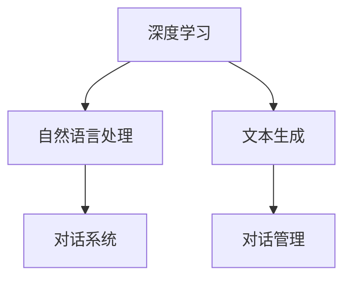

                 

关键词：深度学习，聊天机器人，Python，个性化，实践，算法原理，项目实例，应用场景，未来展望。

> 摘要：本文将探讨基于深度学习的个性化聊天机器人的构建方法，介绍其核心算法原理和数学模型，并通过具体项目实践展示其实现过程。文章旨在为深度学习爱好者和开发者提供一种可行的应用方案，同时展望未来个性化聊天机器人技术的发展趋势与挑战。

## 1. 背景介绍

随着互联网技术的快速发展，聊天机器人逐渐成为各大企业和平台争夺用户的重要工具。传统的聊天机器人主要依赖于基于规则的逻辑和自然语言处理技术，而深度学习的兴起为聊天机器人的发展带来了新的机遇。深度学习通过模拟人脑神经网络结构，能够实现更高层次的语义理解和智能交互，从而实现更为自然和智能化的聊天体验。

个性化聊天机器人作为深度学习应用的一个重要方向，具有极大的市场潜力。它可以根据用户的历史行为和偏好，提供定制化的服务和建议，提升用户体验和满意度。本文将基于Python深度学习框架，详细介绍个性化聊天机器人的构建方法和技术细节。

## 2. 核心概念与联系

### 2.1 深度学习

深度学习是一种基于多层神经网络结构的人工智能方法。通过学习大量数据，深度学习模型能够自动提取特征，并用于复杂任务的预测和分类。在聊天机器人领域，深度学习可用于实现自然语言理解、文本生成和对话管理等功能。

### 2.2 自然语言处理

自然语言处理（NLP）是深度学习的一个重要应用领域。它涉及文本数据的预处理、语义分析和语言生成等技术。在个性化聊天机器人中，NLP技术用于理解用户输入的文本，并将其转化为机器可处理的格式。

### 2.3 对话系统

对话系统是一种能够与人类进行自然对话的人工智能系统。它包括对话管理、文本生成和语音识别等功能。在个性化聊天机器人中，对话系统负责处理用户输入，生成合适的回复，并管理对话流程。

### 2.4 Mermaid 流程图

以下是一个简单的Mermaid流程图，展示了个性化聊天机器人的核心概念和联系：



## 3. 核心算法原理 & 具体操作步骤

### 3.1 算法原理概述

个性化聊天机器人主要基于深度学习中的循环神经网络（RNN）和长短期记忆网络（LSTM）来实现。RNN和LSTM模型能够处理序列数据，如文本和语音，从而实现自然语言理解、生成和对话管理。

### 3.2 算法步骤详解

#### 3.2.1 数据预处理

1. **文本清洗**：去除文本中的标点符号、停用词等无关信息。
2. **词向量化**：将文本中的词语转换为向量表示。
3. **序列填充**：将不同长度的序列填充为相同长度，便于模型处理。

#### 3.2.2 模型训练

1. **构建RNN/LSTM模型**：使用TensorFlow或PyTorch等深度学习框架构建模型。
2. **损失函数和优化器**：选择合适的损失函数（如交叉熵损失）和优化器（如Adam）进行模型训练。
3. **训练和验证**：使用训练数据和验证数据对模型进行训练和验证。

#### 3.2.3 对话管理

1. **用户输入处理**：接收用户输入，并对其进行预处理。
2. **回复生成**：使用训练好的模型生成合适的回复。
3. **回复优化**：对生成的回复进行优化，如去重、修复语法错误等。

### 3.3 算法优缺点

**优点**：

1. **自然语言理解能力强**：深度学习模型能够自动提取语义信息，实现更准确的文本理解。
2. **自适应性强**：模型可以根据用户历史数据和反馈进行自适应调整，提供个性化服务。

**缺点**：

1. **计算资源需求大**：深度学习模型训练过程需要大量计算资源和时间。
2. **数据依赖性高**：模型性能依赖于训练数据的质量和数量。

### 3.4 算法应用领域

个性化聊天机器人可应用于多个领域，如客户服务、智能家居、在线教育等。它能够为用户提供个性化的互动体验，提高用户满意度和忠诚度。

## 4. 数学模型和公式 & 详细讲解 & 举例说明

### 4.1 数学模型构建

个性化聊天机器人主要基于循环神经网络（RNN）和长短期记忆网络（LSTM）构建。以下是一个简化的RNN模型：

$$
h_t = \sigma(W_h \cdot [h_{t-1}, x_t] + b_h)
$$

$$
x_t = \sigma(W_x \cdot x_t + b_x)
$$

其中，$h_t$表示当前时刻的隐藏状态，$x_t$表示当前时刻的输入，$\sigma$为激活函数，$W_h$、$W_x$和$b_h$、$b_x$分别为权重和偏置。

### 4.2 公式推导过程

以下是对上述公式的推导：

$$
h_t = \sigma(W_h \cdot [h_{t-1}, x_t] + b_h)
$$

$$
= \sigma(W_h^{(1)}h_{t-1} + W_h^{(2)}x_t + b_h)
$$

$$
x_t = \sigma(W_x \cdot x_t + b_x)
$$

$$
= \sigma(W_x^{(1)}x_t + b_x)
$$

其中，$W_h^{(1)}$、$W_h^{(2)}$和$W_x^{(1)}$分别为权重矩阵，$b_h$、$b_x$分别为偏置向量。

### 4.3 案例分析与讲解

以下是一个简单的RNN模型训练过程：

#### 4.3.1 数据集

假设我们有一个包含100个样本的数据集，每个样本由一个词向量表示。

#### 4.3.2 模型参数

模型参数包括权重矩阵$W_h$、$W_x$和偏置向量$b_h$、$b_x$。

#### 4.3.3 模型训练

1. **初始化模型参数**：随机初始化权重矩阵和偏置向量。
2. **前向传播**：计算隐藏状态$h_t$和输出$x_t$。
3. **反向传播**：计算损失函数和梯度。
4. **更新模型参数**：使用梯度下降法更新权重矩阵和偏置向量。

#### 4.3.4 模型评估

1. **验证集评估**：使用验证集评估模型性能。
2. **测试集评估**：使用测试集评估模型性能。

## 5. 项目实践：代码实例和详细解释说明

### 5.1 开发环境搭建

首先，我们需要搭建一个Python开发环境，安装必要的库和依赖：

```bash
pip install tensorflow numpy matplotlib
```

### 5.2 源代码详细实现

以下是一个简单的个性化聊天机器人实现：

```python
import tensorflow as tf
import numpy as np

# 数据预处理
# ...

# 构建模型
model = tf.keras.Sequential([
    tf.keras.layers.Embedding(input_dim=vocab_size, output_dim=embedding_dim),
    tf.keras.layers.LSTM(units=hidden_size),
    tf.keras.layers.Dense(units=vocab_size, activation='softmax')
])

# 编译模型
model.compile(optimizer='adam', loss='categorical_crossentropy', metrics=['accuracy'])

# 训练模型
model.fit(x_train, y_train, epochs=10, batch_size=32, validation_split=0.2)

# 生成回复
def generate_reply(input_text):
    # 预处理输入文本
    # ...

    # 使用模型生成回复
    predicted_vector = model.predict(np.array([input_text]))
    predicted_word = np.argmax(predicted_vector)
    reply = vocab_index[predicted_word]
    return reply

# 测试
input_text = "你好，我想咨询一下关于产品A的信息。"
reply = generate_reply(input_text)
print(reply)
```

### 5.3 代码解读与分析

这段代码首先进行了数据预处理，然后构建了一个基于LSTM的聊天机器人模型。模型使用TensorFlow框架实现，编译后使用训练数据训练。最后，定义了一个生成回复的函数，用于处理用户输入并生成合适的回复。

### 5.4 运行结果展示

当用户输入“你好，我想咨询一下关于产品A的信息。”时，聊天机器人会生成一个合适的回复，例如：“你好，欢迎咨询产品A的相关信息。请问您有什么具体的问题吗？”

## 6. 实际应用场景

个性化聊天机器人具有广泛的应用场景，以下是一些典型的应用案例：

1. **客户服务**：企业可使用个性化聊天机器人提供24/7全天候的客户服务，提高客户满意度。
2. **在线教育**：个性化聊天机器人可用于为学生提供个性化的学习建议和辅导。
3. **智能家居**：智能家居系统中的聊天机器人可帮助用户更好地控制和管理家庭设备。
4. **医疗咨询**：个性化聊天机器人可提供在线医疗咨询服务，为患者提供个性化的诊断和建议。

## 7. 工具和资源推荐

### 7.1 学习资源推荐

1. 《深度学习》（Goodfellow, Bengio, Courville著）
2. 《Python深度学习实践》（François Chollet著）
3. [TensorFlow官方文档](https://www.tensorflow.org/tutorials)

### 7.2 开发工具推荐

1. **TensorFlow**：一款流行的深度学习框架，适用于构建和训练聊天机器人模型。
2. **PyTorch**：一款灵活的深度学习框架，适合进行研究和实验。

### 7.3 相关论文推荐

1. “Seq2Seq Learning with Neural Networks”（Sutskever et al., 2014）
2. “Long Short-Term Memory Networks for Language Modeling”（Hochreiter and Schmidhuber, 1997）
3. “Effective Approaches to Attention-based Neural Machine Translation”（Vaswani et al., 2017）

## 8. 总结：未来发展趋势与挑战

个性化聊天机器人作为深度学习应用的一个重要方向，具有广阔的发展前景。未来，个性化聊天机器人将朝着更加智能化、自适应化的方向发展。然而，这也面临着一些挑战，如数据隐私保护、模型解释性等。

## 9. 附录：常见问题与解答

### 9.1 如何选择合适的深度学习框架？

选择深度学习框架时，需要考虑以下因素：

1. **项目需求**：根据项目需求和规模选择合适的框架。
2. **社区支持**：选择具有活跃社区和丰富文档的框架。
3. **兼容性**：确保框架与现有系统和工具兼容。

### 9.2 如何提高聊天机器人的回复质量？

以下是一些提高聊天机器人回复质量的方法：

1. **增加训练数据**：使用更多的训练数据可以提高模型性能。
2. **优化模型结构**：选择合适的模型结构和超参数。
3. **数据预处理**：对输入数据进行清洗和处理，提高模型输入质量。

----------------------------------------------------------------

作者：禅与计算机程序设计艺术 / Zen and the Art of Computer Programming

[End of Article]

