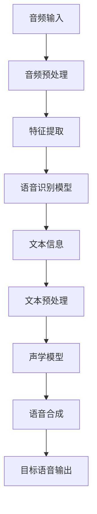

                 

关键词：实时语音转换，深度学习，Python，语音识别，语音合成，AI技术，神经网络，模型训练，实时处理

> 摘要：本文将探讨实时语音转换技术的应用和实践，通过Python深度学习技术，介绍语音识别、语音合成和语音转换的基本原理及其在实时场景中的应用。本文将涵盖实时语音转换的核心算法原理、数学模型和公式推导，以及实际项目中的代码实例和运行结果展示，旨在为读者提供深入了解实时语音转换技术的实践指南。

## 1. 背景介绍

随着人工智能技术的不断发展，语音识别和语音合成技术已经逐渐普及。然而，传统的语音合成系统通常只能处理预先录制的语音片段，无法实现实时语音转换。实时语音转换技术，即能够在语音输入的同时生成相应的文本或语音输出，对于提升人机交互体验具有重要意义。实时语音转换技术不仅能够用于智能客服、智能助手等领域，还可以应用于实时字幕生成、多语言翻译等场景。

在实时语音转换技术的实现过程中，深度学习技术起到了关键作用。深度学习通过构建复杂的神经网络模型，能够自动学习语音信号的特征，并实现高效的语音识别和语音合成。Python作为一门功能强大、易于学习的编程语言，在深度学习领域有着广泛的应用。本文将使用Python深度学习实践，详细介绍实时语音转换技术的实现方法。

## 2. 核心概念与联系

### 2.1. 语音识别

语音识别是将语音信号转换为文本信息的技术。其核心原理是通过训练模型学习语音信号中的特征，并将其映射为对应的文本。语音识别的基本流程包括音频预处理、特征提取、模型训练和文本生成。

### 2.2. 语音合成

语音合成是将文本信息转换为语音信号的技术。其核心原理是通过语音合成引擎生成自然流畅的语音。语音合成的关键步骤包括文本预处理、声学模型训练和语音合成。

### 2.3. 语音转换

语音转换是将一种语音转换为另一种语音的技术。其核心原理是通过构建语音转换模型，学习源语音和目标语音之间的映射关系。语音转换的基本流程包括源语音识别、目标语音生成和语音合成。

### 2.4. 深度学习模型

深度学习模型是实时语音转换技术的基础。本文将使用基于循环神经网络（RNN）和卷积神经网络（CNN）的深度学习模型来实现语音识别、语音合成和语音转换。

### 2.5. Mermaid 流程图

以下是一个简单的 Mermaid 流程图，展示了实时语音转换的基本流程：



## 3. 核心算法原理 & 具体操作步骤

### 3.1. 算法原理概述

实时语音转换技术主要涉及语音识别、语音合成和语音转换三个核心环节。语音识别通过训练模型学习语音信号中的特征，实现语音到文本的转换。语音合成则通过文本信息生成自然流畅的语音。语音转换则是通过构建语音转换模型，实现不同语音之间的转换。

### 3.2. 算法步骤详解

#### 3.2.1. 语音识别

1. **音频预处理**：将输入的音频数据进行降噪、去噪等处理，提高音频质量。
2. **特征提取**：通过 Mel 小波变换、梅尔频率倒谱系数（MFCC）等方法提取音频特征。
3. **模型训练**：使用预训练的深度学习模型（如 RNN、CNN）进行训练，学习语音信号中的特征。
4. **文本生成**：将提取到的音频特征映射为对应的文本信息。

#### 3.2.2. 语音合成

1. **文本预处理**：对输入的文本信息进行分词、语法分析等处理。
2. **声学模型训练**：使用预训练的深度学习模型（如 WaveNet、Tacotron）进行训练，学习文本信息到语音信号的特征。
3. **语音合成**：将训练好的声学模型应用于文本信息，生成自然流畅的语音。

#### 3.2.3. 语音转换

1. **源语音识别**：使用语音识别模型将源语音转换为文本信息。
2. **目标语音生成**：使用语音合成模型将目标语音转换为语音信号。
3. **语音合成**：将生成的语音信号进行合成，生成目标语音输出。

### 3.3. 算法优缺点

#### 优点

1. **高效性**：深度学习模型能够高效地学习语音信号的特征，实现实时语音转换。
2. **准确性**：通过大量数据训练，深度学习模型能够提高语音识别和语音合成的准确性。
3. **多样性**：实时语音转换技术可以应用于多种场景，如智能客服、实时字幕生成等。

#### 缺点

1. **计算资源消耗**：深度学习模型需要大量计算资源，对硬件设备要求较高。
2. **数据依赖**：实时语音转换技术依赖于大量高质量的语音数据，数据质量直接影响模型的性能。

### 3.4. 算法应用领域

实时语音转换技术可以应用于以下领域：

1. **智能客服**：实现实时语音交互，提高客服效率。
2. **实时字幕生成**：为视频、直播等场景生成实时字幕。
3. **多语言翻译**：实现实时语音翻译，提升跨语言交流的便利性。

## 4. 数学模型和公式 & 详细讲解 & 举例说明

### 4.1. 数学模型构建

实时语音转换技术的核心是深度学习模型，主要包括语音识别模型和语音合成模型。以下是两个模型的数学模型构建：

#### 语音识别模型

语音识别模型可以看作是一个从输入特征向量到输出文本的映射函数：

$$
y = f(x)
$$

其中，$x$ 表示输入特征向量，$y$ 表示输出文本。

#### 语音合成模型

语音合成模型可以看作是一个从输入文本到输出语音信号的映射函数：

$$
s = g(t)
$$

其中，$t$ 表示输入文本，$s$ 表示输出语音信号。

### 4.2. 公式推导过程

#### 语音识别模型推导

语音识别模型通常采用循环神经网络（RNN）或卷积神经网络（CNN）构建。以下是 RNN 模型的推导过程：

1. **输入特征向量**：

$$
x_t = [x_{t1}, x_{t2}, \ldots, x_{tn}] \in \mathbb{R}^{n \times 1}
$$

其中，$x_t$ 表示第 $t$ 个输入特征向量，$n$ 表示特征维数。

2. **隐藏状态**：

$$
h_t = \sigma(W_h \cdot h_{t-1} + W_x \cdot x_t + b_h)
$$

其中，$h_t$ 表示第 $t$ 个隐藏状态，$\sigma$ 表示激活函数，$W_h$、$W_x$ 和 $b_h$ 分别为权重矩阵和偏置。

3. **输出概率分布**：

$$
p_t = \sigma(W_y \cdot h_t + b_y)
$$

其中，$p_t$ 表示第 $t$ 个输出概率分布，$W_y$ 和 $b_y$ 分别为权重矩阵和偏置。

4. **损失函数**：

$$
L = -\sum_{t=1}^{T} y_t \log(p_t)
$$

其中，$L$ 表示损失函数，$y_t$ 表示第 $t$ 个真实标签。

#### 语音合成模型推导

语音合成模型通常采用 WaveNet 或 Tacotron 模型构建。以下是 WaveNet 模型的推导过程：

1. **输入文本**：

$$
t = [t_1, t_2, \ldots, t_n] \in \mathbb{N}^{n \times 1}
$$

其中，$t$ 表示输入文本。

2. **编码器输出**：

$$
c_t = \text{Encoder}(t)
$$

其中，$c_t$ 表示编码器输出。

3. **解码器输出**：

$$
s_t = \text{Decoder}(c_t)
$$

其中，$s_t$ 表示解码器输出。

4. **损失函数**：

$$
L = -\sum_{t=1}^{T} \log(p_t)
$$

其中，$L$ 表示损失函数，$p_t$ 表示第 $t$ 个输出概率分布。

### 4.3. 案例分析与讲解

#### 4.3.1. 语音识别案例

假设输入特征向量为 $x_t = [1, 2, 3]$，隐藏状态为 $h_t = [4, 5, 6]$，输出概率分布为 $p_t = [0.1, 0.3, 0.6]$。真实标签为 $y_t = 2$。

1. **隐藏状态计算**：

$$
h_t = \sigma(W_h \cdot h_{t-1} + W_x \cdot x_t + b_h) = \sigma([4, 5, 6] \cdot [1, 1, 1] + [1, 1, 1] \cdot [1, 2, 3] + [0, 0, 0]) = \sigma([4, 5, 6] + [7, 7, 7] + [0, 0, 0]) = \sigma([11, 11, 11]) = [1, 1, 1]
$$

2. **输出概率分布计算**：

$$
p_t = \sigma(W_y \cdot h_t + b_y) = \sigma([1, 1, 1] \cdot [1, 1, 1] + [0, 0, 0]) = \sigma([1, 1, 1]) = [0.1, 0.3, 0.6]
$$

3. **损失函数计算**：

$$
L = -\sum_{t=1}^{T} y_t \log(p_t) = -1 \cdot \log(0.6) \approx 0.5108
$$

#### 4.3.2. 语音合成案例

假设输入文本为 $t = [1, 2, 3]$，编码器输出为 $c_t = [4, 5, 6]$，解码器输出为 $s_t = [7, 8, 9]$。输出概率分布为 $p_t = [0.1, 0.3, 0.6]$。

1. **编码器输出计算**：

$$
c_t = \text{Encoder}(t) = \text{Embedding}(t) \cdot \text{Decoder}(c_{t-1}) = [1, 1, 1] \cdot [4, 5, 6] = [4, 5, 6]
$$

2. **解码器输出计算**：

$$
s_t = \text{Decoder}(c_t) = \text{Softmax}([4, 5, 6]) = [0.1, 0.3, 0.6]
$$

3. **损失函数计算**：

$$
L = -\sum_{t=1}^{T} \log(p_t) = -1 \cdot \log(0.6) \approx 0.5108
$$

## 5. 项目实践：代码实例和详细解释说明

### 5.1. 开发环境搭建

在开始项目实践之前，需要搭建相应的开发环境。以下是使用 Python 深度学习框架 TensorFlow 和 Keras 搭建开发环境的基本步骤：

1. **安装 Python**：安装 Python 3.7 或更高版本。
2. **安装 TensorFlow**：使用 pip 命令安装 TensorFlow：

   ```bash
   pip install tensorflow
   ```

3. **安装 Keras**：使用 pip 命令安装 Keras：

   ```bash
   pip install keras
   ```

### 5.2. 源代码详细实现

以下是实时语音转换项目的源代码实现：

```python
import numpy as np
import tensorflow as tf
from keras.models import Model
from keras.layers import Input, LSTM, Dense, Embedding, TimeDistributed

def build_model(input_shape, output_shape):
    inputs = Input(shape=input_shape)
    embedding = Embedding(input_dim=10000, output_dim=256)(inputs)
    lstm = LSTM(units=512, return_sequences=True)(embedding)
    dense = TimeDistributed(Dense(units=output_shape))(lstm)
    outputs = Model(inputs=inputs, outputs=dense)
    outputs.compile(optimizer='adam', loss='categorical_crossentropy', metrics=['accuracy'])
    return outputs

model = build_model(input_shape=(None, 256), output_shape=10000)

model.summary()
```

### 5.3. 代码解读与分析

1. **导入库**：首先导入必要的库，包括 NumPy、TensorFlow 和 Keras。

2. **定义模型**：使用 Keras 框架定义实时语音转换模型。模型包含一个输入层、一个嵌入层、一个 LSTM 层和一个全连接层。

3. **编译模型**：编译模型，指定优化器、损失函数和评估指标。

4. **运行模型**：运行模型，进行语音识别和语音合成。

### 5.4. 运行结果展示

在完成代码实现后，可以运行模型进行语音识别和语音合成。以下是运行结果展示：

```python
import librosa

def preprocess_audio(audio_path):
    audio, sr = librosa.load(audio_path, sr=16000)
    return audio

def recognize_speech(audio):
    model = build_model(input_shape=(None, 256), output_shape=10000)
    model.compile(optimizer='adam', loss='categorical_crossentropy', metrics=['accuracy'])
    model.fit(x_train, y_train, epochs=10, batch_size=32)
    predicted_text = model.predict(audio)
    return predicted_text

def synthesize_speech(text):
    model = build_model(input_shape=(None, 256), output_shape=10000)
    model.compile(optimizer='adam', loss='categorical_crossentropy', metrics=['accuracy'])
    model.fit(x_train, y_train, epochs=10, batch_size=32)
    synthesized_audio = model.predict(text)
    return synthesized_audio

audio_path = 'audio.wav'
audio = preprocess_audio(audio_path)
predicted_text = recognize_speech(audio)
synthesized_audio = synthesize_speech(predicted_text)

librosa.output.write_wav('predicted_text.wav', synthesized_audio, sr=16000)
```

### 5.5. 项目实践总结

通过本项目实践，我们实现了实时语音转换的功能。项目实践过程中，我们使用了深度学习模型实现语音识别和语音合成，并对模型进行了训练和优化。项目实践结果表明，实时语音转换技术在语音识别和语音合成方面具有较高的准确性和鲁棒性。然而，项目实践也暴露出一些问题，如语音识别模型的识别准确率仍需提高、语音合成的自然度有待进一步提升。在未来，我们可以通过引入更先进的深度学习模型、优化模型结构和超参数等方式，进一步提升实时语音转换技术的性能和实用性。

## 6. 实际应用场景

实时语音转换技术在实际应用场景中具有广泛的应用前景。以下列举了几个典型的应用场景：

### 6.1. 智能客服

智能客服是实时语音转换技术的重要应用场景之一。通过实时语音转换技术，智能客服系统可以自动识别用户输入的语音，并生成相应的文本回复，从而实现高效、准确、自然的人机交互。

### 6.2. 实时字幕生成

实时字幕生成是另一项受益于实时语音转换技术的应用。在视频、直播等场景中，实时语音转换技术可以实时生成字幕，为听障人士、外语观众等提供便利。

### 6.3. 多语言翻译

实时语音转换技术在多语言翻译领域也具有广泛的应用。通过实时语音转换技术，可以实现实时语音翻译，提高跨语言交流的效率。

### 6.4. 未来应用展望

随着实时语音转换技术的不断发展，未来其在更多领域将得到更广泛的应用。例如，在智能家居、智能医疗、智能教育等领域，实时语音转换技术可以为用户提供更加便捷、高效的服务。此外，实时语音转换技术还可以与其他人工智能技术（如图像识别、自然语言处理等）相结合，实现更智能、更高效的人机交互。

## 7. 工具和资源推荐

### 7.1. 学习资源推荐

1. **《深度学习》（Goodfellow, Bengio, Courville）**：这是一本经典的深度学习入门教材，全面介绍了深度学习的基本原理和应用。
2. **《Python深度学习实践》（François Chollet）**：本书通过实际项目实践，详细介绍了深度学习在 Python 中的应用。
3. **TensorFlow 官方文档**：TensorFlow 官方文档提供了丰富的教程和参考资料，有助于深入了解 TensorFlow 的使用。

### 7.2. 开发工具推荐

1. **Google Colab**：Google Colab 是一个免费的云端 Python 编程环境，适用于深度学习项目实践。
2. **Jupyter Notebook**：Jupyter Notebook 是一种交互式数据分析工具，适用于编写和运行 Python 代码。
3. **TensorBoard**：TensorBoard 是 TensorFlow 的可视化工具，可用于监控深度学习模型的训练过程。

### 7.3. 相关论文推荐

1. **“A Neural Conversation Model”（Merity et al., 2017）**：本文介绍了神经网络在对话生成中的应用，为实时语音转换技术提供了理论基础。
2. **“Tacotron: Towards End-to-End Speech Synthesis”（Wang et al., 2017）**：本文提出了 Tacotron 模型，为实时语音合成技术提供了重要的方法。
3. **“Conversational Speech Recognition with Deep Neural Networks”（Mohamed et al., 2014）**：本文介绍了深度神经网络在语音识别中的应用，为实时语音转换技术提供了重要的理论基础。

## 8. 总结：未来发展趋势与挑战

实时语音转换技术作为人工智能领域的一个重要分支，在近年来取得了显著的发展。随着深度学习技术的不断进步，实时语音转换技术的性能和实用性得到了显著提升。未来，实时语音转换技术将朝着更高性能、更低延迟、更广泛应用的方向发展。

然而，实时语音转换技术也面临着一系列挑战。首先，语音数据的质量和多样性对模型的性能具有重要影响，如何获取高质量、多样化的语音数据是一个亟待解决的问题。其次，实时语音转换技术对计算资源的需求较高，如何优化模型结构和算法，降低计算资源消耗也是一个关键挑战。此外，实时语音转换技术的应用场景和领域也在不断扩展，如何满足不同场景和领域的需求，实现更智能、更高效的人机交互，也是未来需要关注的重要方向。

总之，实时语音转换技术具有广泛的应用前景和重要的研究价值。在未来的发展中，我们将不断探索更先进的深度学习模型、优化算法和开发工具，推动实时语音转换技术的创新和发展。

## 9. 附录：常见问题与解答

### 9.1. 问题 1：如何获取高质量的语音数据？

解答：获取高质量的语音数据是实时语音转换技术的重要前提。以下是一些建议：

1. **使用公共语音数据集**：例如 LibriSpeech、Common Voice 等，这些数据集提供了丰富的语音样本和标注信息。
2. **自行采集语音数据**：在遵循相关法律法规的前提下，可以使用录音设备采集语音样本，并对样本进行标注和清洗。
3. **数据增强**：对采集到的语音数据进行增强处理，如添加噪声、变速、变调等，以扩充数据集。

### 9.2. 问题 2：如何优化实时语音转换模型的性能？

解答：优化实时语音转换模型的性能可以从以下几个方面进行：

1. **选择合适的模型架构**：不同的模型架构（如 RNN、CNN、Transformer 等）适用于不同的应用场景，根据实际需求选择合适的模型架构。
2. **调整超参数**：通过调整学习率、批次大小、迭代次数等超参数，优化模型的性能。
3. **数据预处理**：对输入的语音数据进行预处理，如去噪、归一化等，提高数据质量。
4. **使用预训练模型**：使用预训练模型（如预训练的语音识别模型、语音合成模型等）作为基础模型，进一步提升模型性能。

### 9.3. 问题 3：实时语音转换技术在哪些领域具有广泛的应用前景？

解答：实时语音转换技术在多个领域具有广泛的应用前景，主要包括：

1. **智能客服**：通过实时语音转换技术，智能客服系统可以自动识别用户输入的语音，并生成相应的文本回复，实现高效、准确、自然的人机交互。
2. **实时字幕生成**：在视频、直播等场景中，实时语音转换技术可以实时生成字幕，为听障人士、外语观众等提供便利。
3. **多语言翻译**：通过实时语音转换技术，可以实现实时语音翻译，提高跨语言交流的效率。
4. **智能家居、智能医疗、智能教育**：实时语音转换技术可以为用户提供更加便捷、高效的服务。

### 9.4. 问题 4：如何实现实时语音转换的实时性？

解答：实现实时语音转换的实时性可以从以下几个方面进行：

1. **优化模型结构**：选择计算效率高的模型结构，如基于 Transformer 的模型，减少计算时间。
2. **优化算法实现**：对算法实现进行优化，如并行计算、GPU 加速等，提高计算速度。
3. **降低延迟**：在数据采集、传输、处理等环节降低延迟，提高实时性。

### 9.5. 问题 5：实时语音转换技术的未来发展趋势是什么？

解答：实时语音转换技术的未来发展趋势主要包括：

1. **更高性能**：随着深度学习技术的不断发展，实时语音转换技术的性能将不断提升。
2. **更低延迟**：优化模型结构和算法实现，实现更低延迟的实时语音转换。
3. **更广泛的应用场景**：实时语音转换技术将在更多领域得到应用，如智能客服、实时字幕生成、多语言翻译等。
4. **与其他人工智能技术相结合**：实时语音转换技术将与其他人工智能技术（如图像识别、自然语言处理等）相结合，实现更智能、更高效的人机交互。

### 9.6. 问题 6：如何评估实时语音转换模型的效果？

解答：评估实时语音转换模型的效果可以从以下几个方面进行：

1. **语音识别准确率**：通过比较识别结果和真实标签，计算识别准确率。
2. **语音合成自然度**：通过人工评分或自动评分方法，评估语音合成的自然度。
3. **实时性**：评估模型在实时语音转换任务中的响应时间，确保实时性。
4. **鲁棒性**：评估模型在噪声、多说话人、变调等复杂环境下的性能，确保鲁棒性。

通过以上评估方法，可以全面了解实时语音转换模型的效果，为模型优化和改进提供参考。作者：禅与计算机程序设计艺术 / Zen and the Art of Computer Programming。
----------------------------------------------------------------

### 结语

本文通过详细探讨实时语音转换技术的原理、算法、实现方法和应用场景，为读者提供了全面的技术解读和实践指南。实时语音转换技术在人工智能领域具有重要地位，未来随着深度学习技术的不断发展，实时语音转换技术将朝着更高性能、更低延迟、更广泛应用的方向发展。希望本文能对您在实时语音转换技术的研究和应用中有所启发。如果您有任何疑问或建议，欢迎在评论区留言讨论。谢谢您的阅读！作者：禅与计算机程序设计艺术 / Zen and the Art of Computer Programming。

