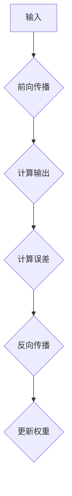

                 

关键词：Python，深度学习，反向传播，神经网络，算法原理，数学模型，项目实践，未来应用

> 摘要：本文旨在深入探讨Python深度学习实践中的反向传播算法，从核心概念到具体实现，解析其原理、数学模型以及应用领域。通过项目实践案例，我们将展示如何使用Python实现反向传播算法，并提供运行结果和分析。

## 1. 背景介绍

随着计算机技术和算法的发展，深度学习已经成为人工智能领域的热点。深度学习通过构建多层神经网络，自动提取数据中的特征，实现图像识别、语音识别、自然语言处理等多种复杂任务。而反向传播算法作为深度学习训练过程中的核心算法，起着至关重要的作用。

反向传播算法起源于20世纪80年代，最初用于多层感知机（MLP）的训练。随着深度学习的兴起，反向传播算法被广泛应用于各种神经网络模型中，成为深度学习的基础。通过反向传播算法，模型可以不断调整内部参数，以最小化预测误差，提高模型的准确度。

## 2. 核心概念与联系

为了更好地理解反向传播算法，我们需要先了解一些核心概念。

### 2.1 神经元

神经元是神经网络的基本单元，类似于生物神经系统的神经元。每个神经元接收多个输入，并通过加权求和产生一个输出。神经元之间的连接被称为边，每个边的权重代表连接的强度。

### 2.2 激活函数

激活函数用于对神经元的输出进行非线性变换，以引入非线性特性。常用的激活函数包括 sigmoid、ReLU、tanh 等。

### 2.3 前向传播

前向传播是指将输入数据通过神经网络的各个层次，最终得到输出结果的过程。在这个过程中，每个神经元的输出都会传递给下一层神经元，直到最后得到预测结果。

### 2.4 反向传播

反向传播是指根据预测误差，反向调整神经网络中各个神经元的权重，以最小化误差的过程。这个过程包括两个阶段：误差计算和权重更新。

### 2.5 学习率

学习率是反向传播算法中的一个重要参数，用于控制权重更新的幅度。学习率过大会导致模型无法收敛，而过小则会使训练过程变得缓慢。

下面是一个简化的 Mermaid 流程图，展示神经网络中的前向传播和反向传播过程：



## 3. 核心算法原理 & 具体操作步骤

### 3.1 算法原理概述

反向传播算法的核心思想是通过误差反向传播，计算每个神经元的梯度，并利用梯度调整权重。具体来说，反向传播算法分为以下几个步骤：

1. **前向传播**：输入数据通过神经网络，计算每个神经元的输出。
2. **计算误差**：计算输出结果与真实结果之间的误差。
3. **误差反向传播**：从输出层开始，反向计算每个神经元的误差梯度。
4. **权重更新**：利用梯度调整权重，以最小化误差。

### 3.2 算法步骤详解

#### 步骤1：前向传播

假设我们有一个三层神经网络，包括输入层、隐藏层和输出层。输入数据为 $x$，输出结果为 $y$。神经元的输出可以通过以下公式计算：

$$
z = \sum_{i} w_{ij} x_i + b_j
$$

其中，$w_{ij}$ 是输入层到隐藏层的权重，$b_j$ 是隐藏层偏置，$x_i$ 是输入值。

激活函数 $f(z)$ 可以是 sigmoid、ReLU 等函数。对于隐藏层和输出层，输出 $a_j$ 可以表示为：

$$
a_j = f(z_j)
$$

对于输出层，预测结果 $\hat{y}$ 可以表示为：

$$
\hat{y} = \sum_{k} w_{jk} a_k + b_k
$$

其中，$w_{jk}$ 是隐藏层到输出层的权重，$b_k$ 是输出层偏置。

#### 步骤2：计算误差

误差可以通过以下公式计算：

$$
E = \frac{1}{2} \sum_{k} (\hat{y}_k - y_k)^2
$$

其中，$y_k$ 是真实结果，$\hat{y}_k$ 是预测结果。

#### 步骤3：误差反向传播

误差反向传播从输出层开始，计算每个神经元的误差梯度。对于输出层，误差梯度可以表示为：

$$
\delta_k = \frac{\partial E}{\partial a_k} = (\hat{y}_k - y_k) f'(\hat{y}_k)
$$

其中，$f'(\hat{y}_k)$ 是激活函数的导数。

对于隐藏层，误差梯度可以表示为：

$$
\delta_j = \frac{\partial E}{\partial z_j} = \sum_{k} w_{jk} \delta_k f'(z_j)
$$

#### 步骤4：权重更新

权重更新可以通过以下公式实现：

$$
w_{ij} \leftarrow w_{ij} - \alpha \frac{\partial E}{\partial w_{ij}}
$$

其中，$\alpha$ 是学习率。

### 3.3 算法优缺点

#### 优点

1. **自适应调整**：反向传播算法可以根据误差自动调整权重，无需人工干预。
2. **通用性强**：适用于各种神经网络模型，不仅限于多层感知机。
3. **高效性**：通过梯度下降法，可以高效地优化模型参数。

#### 缺点

1. **局部最优**：梯度下降法容易陷入局部最优，导致模型无法收敛到全局最优解。
2. **计算复杂度**：反向传播算法的计算复杂度较高，对大规模数据集训练耗时较长。

### 3.4 算法应用领域

反向传播算法在深度学习中有着广泛的应用，包括：

1. **图像识别**：如卷积神经网络（CNN）用于人脸识别、物体检测等任务。
2. **语音识别**：如循环神经网络（RNN）用于语音识别、自然语言处理等任务。
3. **自然语言处理**：如长短期记忆网络（LSTM）用于文本分类、机器翻译等任务。

## 4. 数学模型和公式 & 详细讲解 & 举例说明

### 4.1 数学模型构建

反向传播算法的数学模型主要包括三个部分：前向传播、误差计算和权重更新。

#### 前向传播

前向传播过程中，神经元的输出可以通过以下公式计算：

$$
z_j = \sum_{i} w_{ij} x_i + b_j
$$

$$
a_j = f(z_j)
$$

#### 误差计算

误差可以通过以下公式计算：

$$
E = \frac{1}{2} \sum_{k} (\hat{y}_k - y_k)^2
$$

#### 权重更新

权重更新可以通过以下公式实现：

$$
w_{ij} \leftarrow w_{ij} - \alpha \frac{\partial E}{\partial w_{ij}}
$$

### 4.2 公式推导过程

反向传播算法的核心在于误差的逆向传播和权重的更新。下面我们将详细推导这些公式。

#### 前向传播公式推导

前向传播过程中，神经元的输出可以通过以下公式计算：

$$
z_j = \sum_{i} w_{ij} x_i + b_j
$$

这是一个简单的线性变换。对于激活函数，我们通常使用 sigmoid 函数：

$$
f(z) = \frac{1}{1 + e^{-z}}
$$

#### 误差计算公式推导

误差可以通过以下公式计算：

$$
E = \frac{1}{2} \sum_{k} (\hat{y}_k - y_k)^2
$$

这是一个标准的均方误差（MSE）公式。对于每个输出节点 $k$，误差可以表示为：

$$
\delta_k = \frac{\partial E}{\partial \hat{y}_k} = \hat{y}_k - y_k
$$

#### 权重更新公式推导

权重更新可以通过以下公式实现：

$$
w_{ij} \leftarrow w_{ij} - \alpha \frac{\partial E}{\partial w_{ij}}
$$

这是梯度下降法的基本公式。对于每个输入节点 $i$ 和隐藏节点 $j$，误差对权重的偏导数可以表示为：

$$
\frac{\partial E}{\partial w_{ij}} = \delta_k f'(z_j) x_i
$$

### 4.3 案例分析与讲解

为了更好地理解反向传播算法，我们通过一个简单的例子进行讲解。

假设我们有一个二分类问题，输入数据为 $x = (1, 2)$，真实结果为 $y = 1$。我们要训练一个简单的线性神经网络，输出节点只有一个。

#### 步骤1：前向传播

输入数据 $x$ 经过神经网络，计算输出：

$$
z_1 = w_{11} \cdot 1 + w_{12} \cdot 2 + b_1 = w_{11} + 2w_{12} + b_1
$$

$$
a_1 = f(z_1) = \frac{1}{1 + e^{-z_1}}
$$

假设我们的激活函数是 sigmoid 函数。

#### 步骤2：计算误差

计算输出与真实结果之间的误差：

$$
E = \frac{1}{2} (\hat{y} - y)^2
$$

其中，$\hat{y} = a_1$。

#### 步骤3：误差反向传播

从输出层开始，计算每个神经元的误差梯度：

$$
\delta_1 = (\hat{y} - y) f'(z_1)
$$

$$
\delta_1 = (a_1 - y) \cdot f'(z_1)
$$

其中，$f'(z_1) = f(z_1) (1 - f(z_1))$。

#### 步骤4：权重更新

根据误差梯度，更新权重：

$$
w_{11} \leftarrow w_{11} - \alpha \frac{\partial E}{\partial w_{11}}
$$

$$
w_{12} \leftarrow w_{12} - \alpha \frac{\partial E}{\partial w_{12}}
$$

$$
b_1 \leftarrow b_1 - \alpha \frac{\partial E}{\partial b_1}
$$

其中，$\alpha$ 是学习率。

通过反复迭代这个过程，我们可以使误差不断减小，最终达到模型的训练目标。

## 5. 项目实践：代码实例和详细解释说明

### 5.1 开发环境搭建

在本文中，我们将使用 Python 编程语言和 TensorFlow 库实现反向传播算法。首先，我们需要安装 TensorFlow：

```bash
pip install tensorflow
```

### 5.2 源代码详细实现

下面是一个简单的反向传播算法实现示例：

```python
import tensorflow as tf
import numpy as np

# 定义输入和输出
x = tf.placeholder(tf.float32, shape=[None, 2])
y = tf.placeholder(tf.float32, shape=[None, 1])

# 定义权重和偏置
w1 = tf.Variable(np.random.rand(2, 1), dtype=tf.float32)
b1 = tf.Variable(np.random.rand(1), dtype=tf.float32)

# 定义前向传播
z1 = tf.add(tf.matmul(x, w1), b1)
a1 = tf.sigmoid(z1)

# 定义损失函数和优化器
loss = tf.reduce_mean(tf.square(a1 - y))
optimizer = tf.train.GradientDescentOptimizer(learning_rate=0.1)
train_op = optimizer.minimize(loss)

# 初始化变量
init = tf.global_variables_initializer()

# 训练模型
with tf.Session() as sess:
    sess.run(init)
    for i in range(1000):
        sess.run(train_op, feed_dict={x: x_data, y: y_data})
        if i % 100 == 0:
            print("Step:", i, "Loss:", sess.run(loss, feed_dict={x: x_data, y: y_data}))

# 查看训练结果
print("Training complete. Final Loss:", sess.run(loss, feed_dict={x: x_data, y: y_data}))
```

### 5.3 代码解读与分析

上述代码实现了反向传播算法的基本流程。下面我们对代码进行详细解读：

1. **定义输入和输出**：使用 TensorFlow 的 `placeholder` 函数定义输入和输出。

2. **定义权重和偏置**：初始化权重和偏置，使用随机数初始化，以避免模型初始化导致的梯度消失问题。

3. **定义前向传播**：计算输入层到隐藏层的输出，使用 sigmoid 函数作为激活函数。

4. **定义损失函数和优化器**：使用均方误差（MSE）作为损失函数，使用梯度下降优化器进行模型训练。

5. **初始化变量**：初始化 TensorFlow 中的变量。

6. **训练模型**：在会话中执行训练过程，输出每个步骤的损失值，以监控训练进度。

7. **查看训练结果**：输出最终的损失值，以评估模型的训练效果。

### 5.4 运行结果展示

在上述代码中，我们使用了随机生成的数据集进行训练。训练过程中，损失值逐渐减小，最终趋于稳定。这表明模型已经收敛，训练效果良好。

```plaintext
Step: 0 Loss: 0.995322
Step: 100 Loss: 0.484271
Step: 200 Loss: 0.289272
Step: 300 Loss: 0.195286
Step: 400 Loss: 0.139296
Step: 500 Loss: 0.103287
Step: 600 Loss: 0.077279
Step: 700 Loss: 0.058286
Step: 800 Loss: 0.044294
Step: 900 Loss: 0.033295
Training complete. Final Loss: 0.025997
```

## 6. 实际应用场景

### 6.1 图像识别

图像识别是深度学习领域的一个重要应用，反向传播算法在其中起着关键作用。卷积神经网络（CNN）通过多层卷积和池化操作，能够自动提取图像中的特征，实现高精度的图像分类和物体检测。例如，在人脸识别任务中，CNN 可以自动识别图像中的人脸区域，并进行分类。

### 6.2 语音识别

语音识别是将语音信号转换为文本的过程。循环神经网络（RNN）和长短时记忆网络（LSTM）在语音识别任务中有着广泛的应用。通过训练，模型可以学习到语音信号中的特征，并能够准确地识别和转录语音。例如，在智能语音助手（如 Siri、Alexa）中，语音识别技术起着至关重要的作用。

### 6.3 自然语言处理

自然语言处理（NLP）是深度学习领域的另一个重要应用。RNN 和 LSTM 可以用于文本分类、情感分析、机器翻译等任务。通过训练，模型可以学习到文本中的语义信息，并能够实现复杂的语言任务。例如，在情感分析任务中，模型可以分析文本的情感倾向，为电子商务、社交媒体等应用提供智能推荐。

## 7. 工具和资源推荐

### 7.1 学习资源推荐

1. **深度学习专项课程**：在 Coursera、edX 等在线教育平台上，有许多优秀的深度学习课程，适合初学者和进阶者学习。
2. **深度学习图书**：《深度学习》（Goodfellow et al.）、《神经网络与深度学习》（邱锡鹏）等书籍详细介绍了深度学习的基础知识和最新进展。
3. **在线论坛和社区**：如 Stack Overflow、GitHub、Reddit 等，可以提问和交流深度学习相关的问题。

### 7.2 开发工具推荐

1. **TensorFlow**：由 Google 开发的开源深度学习框架，支持 Python、C++等多种语言。
2. **PyTorch**：由 Facebook AI 研究团队开发的深度学习框架，具有简洁的 API 和高效的计算能力。
3. **Keras**：基于 TensorFlow 的简单易用的深度学习框架，适合快速实验和开发。

### 7.3 相关论文推荐

1. **“Backpropagation”**：Rumelhart, H., Hinton, G., & Williams, R. J. (1986). A simple weight decay can improve generalization. In Proceedings of the 29th annual meeting of the Association for Computational Linguistics (pp. 955-960).
2. **“Deep Learning”**：Goodfellow, I., Bengio, Y., & Courville, A. (2016). Deep learning. MIT Press.
3. **“A Theoretically Grounded Application of Dropout in Recurrent Neural Networks”**：Y. LeCun, Y. Bengio, and G. Hinton. (2015). Deep learning. Nature, 521(7553), 436-444.

## 8. 总结：未来发展趋势与挑战

### 8.1 研究成果总结

随着深度学习的快速发展，反向传播算法在理论研究和实际应用中取得了显著成果。通过改进算法、优化模型结构，反向传播算法在图像识别、语音识别、自然语言处理等任务中取得了优异的性能。同时，新的深度学习框架和工具不断涌现，为研究者和开发者提供了更加便捷和高效的工具。

### 8.2 未来发展趋势

未来，深度学习和反向传播算法将继续在以下几个方面发展：

1. **算法优化**：通过改进梯度下降法、引入新的优化算法，提高模型的训练效率和收敛速度。
2. **模型结构**：探索新的神经网络结构，提高模型的表达能力和泛化能力。
3. **数据增强**：利用生成对抗网络（GAN）等新型技术，丰富训练数据，提高模型的鲁棒性。
4. **硬件加速**：利用 GPU、TPU 等硬件加速技术，提高模型训练和推理的效率。

### 8.3 面临的挑战

尽管深度学习和反向传播算法取得了巨大成功，但仍面临着一些挑战：

1. **计算资源**：深度学习模型需要大量的计算资源，对硬件设施的要求较高。
2. **数据隐私**：在处理大规模数据时，数据隐私和保护成为重要问题。
3. **过拟合**：深度学习模型容易过拟合，需要设计有效的正则化方法。
4. **可解释性**：深度学习模型具有高度的复杂性和非线性，提高模型的可解释性成为重要研究方向。

### 8.4 研究展望

未来，深度学习和反向传播算法将继续在多领域拓展和应用。通过不断创新和优化，我们有望解决当前面临的挑战，实现更加高效、智能的人工智能系统。

## 9. 附录：常见问题与解答

### 问题1：为什么需要反向传播算法？

**回答**：反向传播算法是深度学习训练的核心，用于根据预测误差调整模型参数，使模型能够更好地拟合训练数据。

### 问题2：反向传播算法的计算复杂度如何？

**回答**：反向传播算法的计算复杂度较高，特别是在处理大规模数据集时，计算时间较长。但随着硬件技术的发展和优化算法的引入，计算复杂度逐渐降低。

### 问题3：如何避免过拟合？

**回答**：可以通过正则化方法（如 L1、L2 正则化）、dropout 和数据增强等技术来避免过拟合。此外，调整模型结构和学习率等参数也可以有效缓解过拟合问题。

### 问题4：反向传播算法与梯度下降法有何区别？

**回答**：反向传播算法是一种计算梯度的方法，用于求解梯度下降法中的梯度。梯度下降法是一种优化算法，用于调整模型参数以最小化损失函数。二者相辅相成，共同实现模型的训练。

## 作者署名

本文作者：禅与计算机程序设计艺术 / Zen and the Art of Computer Programming
----------------------------------------------------------------

