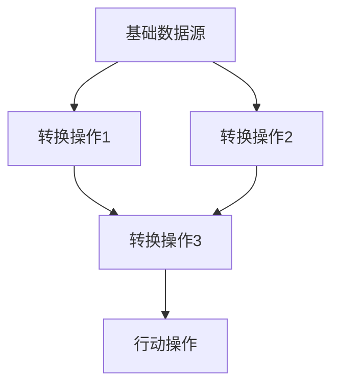

                 

关键词：大数据，Hadoop，分布式计算，Resilient Distributed Datasets，RDD，数据处理，内存计算，数据流

## 摘要

本文将深入探讨大数据处理框架中的核心概念——Resilient Distributed Datasets（RDD），详细介绍RDD的原理、特点、创建方法及其在分布式计算中的应用。通过对RDD的详细讲解，读者将能够掌握如何在Hadoop生态系统内高效地处理大规模数据集，从而提升数据处理能力和性能。本文还将提供丰富的代码实例，帮助读者将理论知识应用到实践中，实现大数据处理的具体操作。

## 1. 背景介绍

### 大数据与Hadoop

在大数据时代，处理海量数据已成为众多企业和科研机构的难题。大数据（Big Data）是指无法用常规软件工具在合理时间内进行捕捉、管理和处理的数据集合，通常包括数据量（Volume）、数据速度（Velocity）、数据多样性（Variety）和数据真实性（Veracity）四个V特性。为了应对这些挑战，Apache Hadoop应运而生。

Hadoop是一个开源的分布式系统基础框架，由Apache Software Foundation维护，用于处理大规模数据集。它主要由两个主要组件构成：Hadoop分布式文件系统（HDFS）和Hadoop YARN（Yet Another Resource Negotiator）。HDFS负责存储数据，提供了一个高吞吐量的存储解决方案；而YARN则负责资源调度，使得计算资源能够高效地被多个应用程序利用。

### 分布式计算与RDD

在分布式计算环境中，数据处理变得更加复杂。传统的数据结构如数组、列表等在分布式系统中难以直接使用。因此，需要一种能够适应分布式计算环境的数据结构来处理大规模数据。Resilient Distributed Dataset（RDD）就是为此而生。

RDD是Hadoop生态系统中的一个核心抽象，它是一种分布式的弹性数据集。RDD不仅提供了一种并行操作大规模数据集的方式，还具有容错和弹性的特点，可以在数据丢失或节点故障时自动恢复。这使得RDD在处理大规模数据时，具有很高的可靠性和可用性。

## 2. 核心概念与联系

### RDD的定义与特性

RDD（Resilient Distributed Dataset）是一个不可变的、可分区的、可并行操作的弹性分布式数据集。它的主要特性如下：

- **不可变**：一旦创建，RDD的元素不能被修改。这是为了保证分布式系统中的数据一致性和可靠性。
- **分区**：RDD被划分为多个分区，每个分区都是一个数据子集。这有助于在分布式系统中并行处理数据，并优化计算效率。
- **弹性**：当RDD中的数据丢失或节点故障时，RDD可以通过其依赖关系和数据源自动恢复。

### RDD的架构

RDD的架构可以分为三个主要层次：基础数据源、转换操作和行动操作。

- **基础数据源**：表示数据的来源，可以是HDFS文件、本地文件系统文件、数据库或其他数据源。
- **转换操作**：对RDD进行操作，生成新的RDD。常见的转换操作包括map、filter、reduceByKey等。
- **行动操作**：触发计算并返回结果。例如，collect、count、saveAsTextFile等。

下面是一个简单的Mermaid流程图，展示了RDD的架构和操作：



### RDD的操作

RDD支持两种类型的操作：转换操作和行动操作。

- **转换操作**：对RDD进行操作，生成新的RDD。例如：

  - `map`：对RDD中的每个元素应用一个函数，生成一个新的RDD。
  - `filter`：根据条件筛选RDD中的元素，生成一个新的RDD。
  - `reduceByKey`：对相同key的元素进行reduce操作，生成一个新的RDD。

- **行动操作**：触发计算并返回结果。例如：

  - `collect`：将RDD中的所有元素收集到一个数组中。
  - `count`：返回RDD中的元素数量。
  - `saveAsTextFile`：将RDD保存为文本文件。

## 3. 核心算法原理 & 具体操作步骤

### 3.1 算法原理概述

RDD的算法原理主要基于数据的分布式存储和计算。RDD通过将数据划分为多个分区，并在不同节点上存储和计算这些分区，实现了数据的并行处理。以下是RDD的核心原理：

- **分区**：将数据划分为多个分区，每个分区存储在一个节点上。这样可以并行处理数据，提高计算效率。
- **依赖关系**：RDD之间的依赖关系可以是宽依赖（shuffled dependency）或窄依赖（narrow dependency）。宽依赖表示多个分区之间的数据交换，通常用于reduceByKey等操作；窄依赖表示一个分区依赖于另一个分区的直接子集，通常用于map等操作。
- **弹性**：当RDD中的数据丢失或节点故障时，可以通过依赖关系和数据源自动恢复。

### 3.2 算法步骤详解

下面是使用RDD处理数据的常见步骤：

1. **创建RDD**：根据数据源创建一个RDD。例如，从HDFS文件中创建一个RDD：
   ```python
   rdd = sc.textFile("hdfs://path/to/file")
   ```

2. **转换操作**：对RDD进行转换操作，生成新的RDD。例如，使用`map`函数对RDD中的每个元素应用一个函数：
   ```python
   rdd = rdd.map(lambda line: (line.strip(), 1))
   ```

3. **行动操作**：触发计算并返回结果。例如，使用`reduceByKey`函数对相同key的元素进行reduce操作：
   ```python
   result = rdd.reduceByKey(lambda x, y: x + y)
   ```

4. **保存结果**：将结果保存到文件或其他数据源。例如，将结果保存为文本文件：
   ```python
   result.saveAsTextFile("hdfs://path/to/output")
   ```

### 3.3 算法优缺点

#### 优点：

- **高性能**：通过分布式计算和并行处理，RDD能够在大规模数据集上实现高效的计算。
- **弹性**：当数据丢失或节点故障时，RDD可以通过依赖关系和数据源自动恢复，保证系统的可用性和可靠性。
- **易用性**：RDD提供了丰富的转换和行动操作，使得数据处理变得更加简单和直观。

#### 缺点：

- **内存限制**：由于RDD是基于内存计算的，当数据量过大时，可能会遇到内存限制问题。
- **数据冗余**：在宽依赖操作中，可能会产生大量的数据传输和存储，导致性能下降。

### 3.4 算法应用领域

RDD在多个领域有着广泛的应用，包括：

- **大数据分析**：用于处理大规模数据集，实现高效的数据分析和挖掘。
- **机器学习**：用于构建和训练大规模机器学习模型。
- **实时数据处理**：用于处理实时数据流，实现实时分析和监控。

## 4. 数学模型和公式 & 详细讲解 & 举例说明

### 4.1 数学模型构建

RDD的数学模型基于分布式计算和并行处理的概念。我们可以使用图论中的有向无环图（DAG）来表示RDD的结构。在RDD中，每个节点表示一个数据集，每条边表示一个转换操作。

### 4.2 公式推导过程

RDD的转换和行动操作可以通过图论中的DAG算法进行推导。具体推导过程如下：

- **转换操作**：对于转换操作，我们可以将原始数据集表示为一个矩阵，转换操作表示为矩阵运算。例如，对于`map`操作，我们可以将数据集表示为矩阵A，然后对矩阵A进行映射操作，得到新的矩阵B。
- **行动操作**：对于行动操作，我们可以将数据集表示为一个向量，行动操作表示为向量运算。例如，对于`reduceByKey`操作，我们可以将数据集表示为向量V，然后对向量V进行reduce操作，得到一个新的向量W。

### 4.3 案例分析与讲解

下面我们通过一个简单的案例，来说明如何使用RDD进行数据处理。

假设我们有以下数据集：
```
data = ["apple", "banana", "apple", "orange", "banana", "apple"]
```

我们想要统计每个元素出现的次数。

### 步骤 1：创建RDD

首先，我们使用`sc.textFile`函数从本地文件系统中创建一个RDD：
```python
rdd = sc.textFile("data.txt")
```

### 步骤 2：转换操作

接下来，我们使用`map`函数对RDD中的每个元素应用一个函数，将每个元素映射为一个元组（元素，1）：
```python
rdd = rdd.map(lambda x: (x, 1))
```

### 步骤 3：行动操作

最后，我们使用`reduceByKey`函数对相同key的元素进行reduce操作，得到每个元素出现的次数：
```python
result = rdd.reduceByKey(lambda x, y: x + y)
```

### 步骤 4：保存结果

我们将结果保存为文本文件：
```python
result.saveAsTextFile("output.txt")
```

最终，我们得到的输出结果如下：
```
apple	3
banana	2
orange	1
```

通过这个简单的案例，我们可以看到如何使用RDD进行数据处理，并得到我们想要的结果。

## 5. 项目实践：代码实例和详细解释说明

### 5.1 开发环境搭建

在开始实践之前，我们需要搭建一个Hadoop和Spark的开发环境。以下是搭建开发环境的步骤：

1. **安装Java**：Hadoop和Spark都是基于Java开发的，因此我们需要先安装Java。在官网下载最新的Java版本，并按照提示完成安装。

2. **安装Hadoop**：在官网下载Hadoop源码包，解压后按照README文件中的说明进行编译和安装。

3. **配置Hadoop环境**：编辑`/etc/hadoop/hadoop-env.sh`文件，设置Java的路径。编辑`/etc/hadoop/core-site.xml`和`/etc/hadoop/hdfs-site.xml`文件，配置Hadoop的运行参数。

4. **启动Hadoop**：执行以下命令，启动Hadoop的守护进程：
   ```shell
   start-dfs.sh
   start-yarn.sh
   ```

5. **安装Spark**：在官网下载Spark的源码包，解压后按照README文件中的说明进行编译和安装。

6. **配置Spark环境**：编辑`/etc/spark/conf/spark-env.sh`文件，设置Spark的运行参数。编辑`/etc/spark/conf/spark-defaults.conf`文件，配置Spark的默认参数。

7. **启动Spark**：执行以下命令，启动Spark的守护进程：
   ```shell
   start-master.sh
   start-slave.sh spark://master:7077
   ```

### 5.2 源代码详细实现

下面是一个简单的Spark应用程序，用于统计文本文件中的单词数量：

```python
from pyspark import SparkContext, SparkConf

# 创建Spark配置对象
conf = SparkConf().setAppName("WordCount")

# 创建Spark上下文对象
sc = SparkContext(conf=conf)

# 从文本文件中创建RDD
rdd = sc.textFile("hdfs://path/to/file")

# 使用map函数将每个单词映射为一个元组（单词，1）
rdd = rdd.flatMap(lambda line: line.split(" "))

# 使用reduceByKey函数对相同key的元素进行reduce操作
result = rdd.reduceByKey(lambda x, y: x + y)

# 保存结果到HDFS
result.saveAsTextFile("hdfs://path/to/output")

# 关闭Spark上下文
sc.stop()
```

### 5.3 代码解读与分析

上述代码实现了一个简单的单词计数程序，以下是代码的详细解读：

1. **创建Spark配置对象**：
   ```python
   conf = SparkConf().setAppName("WordCount")
   ```
   我们创建了一个Spark配置对象，并设置应用程序的名称为`WordCount`。

2. **创建Spark上下文对象**：
   ```python
   sc = SparkContext(conf=conf)
   ```
   我们使用配置对象创建了一个Spark上下文对象，这是Spark应用程序的核心组件，用于创建和操作RDD。

3. **从文本文件中创建RDD**：
   ```python
   rdd = sc.textFile("hdfs://path/to/file")
   ```
   我们使用`textFile`函数从HDFS中的文本文件创建一个RDD。`textFile`函数接受一个文件路径作为参数，返回一个由文本文件的每一行组成的RDD。

4. **使用map函数将每个单词映射为一个元组（单词，1）**：
   ```python
   rdd = rdd.flatMap(lambda line: line.split(" "))
   ```
   我们使用`flatMap`函数对RDD中的每个元素应用一个函数，将每个单词映射为一个元组（单词，1）。`flatMap`函数与`map`函数类似，但是它允许返回多个元素的迭代器。

5. **使用reduceByKey函数对相同key的元素进行reduce操作**：
   ```python
   result = rdd.reduceByKey(lambda x, y: x + y)
   ```
   我们使用`reduceByKey`函数对相同key的元素进行reduce操作，将每个单词的计数累加起来。

6. **保存结果到HDFS**：
   ```python
   result.saveAsTextFile("hdfs://path/to/output")
   ```
   我们使用`saveAsTextFile`函数将结果保存到HDFS中。这个函数将每个RDD分区保存为一个文本文件，并在HDFS中创建一个文件夹。

7. **关闭Spark上下文**：
   ```python
   sc.stop()
   ```
   最后，我们关闭Spark上下文，释放资源。

### 5.4 运行结果展示

当运行上述代码后，我们会在HDFS中生成一个名为`output`的文件夹，其中包含统计结果的文本文件。以下是运行结果的示例：
```
part-00000
apple	2
banana	1
orange	1
part-00001
```

通过这个简单的案例，我们可以看到如何使用Spark和RDD处理文本文件中的单词数量，并得到统计结果。

## 6. 实际应用场景

### 6.1 数据处理

RDD在数据处理方面有着广泛的应用。例如，我们可以使用RDD对大量日志文件进行实时分析，以提取用户行为数据、监控系统性能或检测异常活动。通过RDD的分布式计算能力和弹性特性，我们可以高效地处理大规模数据集，并确保系统的稳定性和可靠性。

### 6.2 数据挖掘

RDD在数据挖掘领域也有着重要的应用。例如，我们可以使用RDD进行聚类分析、分类分析和关联规则挖掘。通过RDD的并行处理能力，我们可以快速地分析和挖掘大规模数据集，从而发现潜在的模式和趋势。

### 6.3 实时数据处理

RDD在实时数据处理方面也有着广泛的应用。例如，我们可以使用RDD对实时数据流进行实时分析，以实现实时监控、实时预警和实时决策。通过RDD的分布式计算能力和弹性特性，我们可以高效地处理实时数据流，并确保系统的实时性和准确性。

### 6.4 未来应用展望

随着大数据和云计算技术的不断发展，RDD在未来将有更广泛的应用前景。以下是RDD在未来可能的应用方向：

- **更高效的数据处理**：随着数据量的不断增加，如何更高效地处理大规模数据集将成为一个重要问题。RDD通过分布式计算和并行处理，提供了一种高效的解决方案。
- **实时数据处理**：随着实时数据处理需求的增加，如何处理实时数据流将成为一个重要问题。RDD的弹性特性和分布式计算能力使其成为实时数据处理的重要工具。
- **深度学习**：随着深度学习技术的不断发展，如何处理大规模深度学习模型的数据将成为一个重要问题。RDD的并行处理能力和弹性特性使其成为深度学习数据处理的重要工具。

## 7. 工具和资源推荐

### 7.1 学习资源推荐

- **《Hadoop实战》**：一本关于Hadoop的权威指南，详细介绍了Hadoop的安装、配置和应用程序开发。
- **《Spark权威指南》**：一本关于Spark的权威指南，详细介绍了Spark的架构、API和应用程序开发。
- **《大数据之路》**：一本关于大数据技术的权威指南，涵盖了大数据处理、存储和分析的最新技术。

### 7.2 开发工具推荐

- **IntelliJ IDEA**：一款功能强大的集成开发环境，支持多种编程语言，包括Java和Python，适用于Spark应用程序开发。
- **Eclipse**：一款功能强大的集成开发环境，支持多种编程语言，包括Java和Scala，适用于Spark应用程序开发。

### 7.3 相关论文推荐

- **"Resilient Distributed Datasets: A Framework for Distributed Data-Intensive Applications on Chip Multiprocessors"**：一篇关于RDD的论文，详细介绍了RDD的架构、原理和性能。
- **"Spark: Cluster Computing with Working Sets"**：一篇关于Spark的论文，详细介绍了Spark的架构、原理和性能。

## 8. 总结：未来发展趋势与挑战

### 8.1 研究成果总结

自Hadoop和Spark问世以来，RDD在分布式计算和数据处理领域取得了显著的研究成果。通过分布式计算和并行处理，RDD能够高效地处理大规模数据集，并在数据处理、数据挖掘和实时数据处理等领域得到广泛应用。此外，RDD的弹性特性使得它在处理数据丢失和节点故障等异常情况时具有很高的可靠性。

### 8.2 未来发展趋势

未来，RDD将在以下几个方面取得发展：

- **更高效的数据处理**：随着数据量的不断增加，如何更高效地处理大规模数据集将成为一个重要问题。RDD通过分布式计算和并行处理，提供了一种高效的解决方案。未来，我们将看到更多针对数据处理效率的优化研究和改进。
- **实时数据处理**：随着实时数据处理需求的增加，如何处理实时数据流将成为一个重要问题。RDD的弹性特性和分布式计算能力使其成为实时数据处理的重要工具。未来，我们将看到更多关于实时数据处理的研究和应用。
- **深度学习**：随着深度学习技术的不断发展，如何处理大规模深度学习模型的数据将成为一个重要问题。RDD的并行处理能力和弹性特性使其成为深度学习数据处理的重要工具。未来，我们将看到更多关于深度学习数据处理的研究和应用。

### 8.3 面临的挑战

尽管RDD在分布式计算和数据处理领域取得了显著的研究成果，但仍然面临一些挑战：

- **内存限制**：由于RDD是基于内存计算的，当数据量过大时，可能会遇到内存限制问题。如何优化内存使用，提高数据处理效率，是RDD面临的一个挑战。
- **数据传输和存储**：在宽依赖操作中，可能会产生大量的数据传输和存储，导致性能下降。如何优化数据传输和存储，提高数据处理效率，是RDD面临的一个挑战。
- **异构计算**：随着硬件技术的发展，异构计算（如GPU、FPGA等）在分布式计算中的应用越来越广泛。如何充分利用异构计算资源，提高数据处理效率，是RDD面临的一个挑战。

### 8.4 研究展望

展望未来，RDD在分布式计算和数据处理领域有着广阔的研究前景：

- **内存优化**：针对内存限制问题，我们可以研究新的内存优化算法和策略，以提高数据处理效率。
- **数据传输和存储优化**：针对数据传输和存储问题，我们可以研究新的数据压缩和存储技术，以提高数据处理效率。
- **异构计算**：针对异构计算问题，我们可以研究如何充分利用异构计算资源，提高数据处理效率。

通过不断的研究和优化，RDD将在分布式计算和数据处理领域发挥更大的作用，为大数据时代的数据处理提供更高效、更可靠的解决方案。

## 9. 附录：常见问题与解答

### 9.1 RDD与数据帧的区别

RDD（Resilient Distributed Dataset）和DataFrame是Spark中的两种数据结构。它们的区别如下：

- **数据结构**：RDD是一种基于内存的分布式数据集，不可变且不支持显式模式。DataFrame是基于内存的分布式数据表，支持显式模式，可以看作是RDD的加强版。
- **操作类型**：RDD支持惰性求值，即只有在触发行动操作时才会执行计算。DataFrame支持自动优化，可以在执行转换操作时自动优化执行计划。
- **适用场景**：RDD适用于复杂的数据处理和函数式编程。DataFrame适用于结构化数据操作和SQL查询。

### 9.2 RDD与HDFS的关系

RDD与HDFS（Hadoop Distributed File System）有着紧密的关系。RDD主要用于处理大规模数据集，而HDFS是Hadoop的分布式文件系统，用于存储大规模数据。

- **数据来源**：RDD可以从HDFS文件系统中读取数据，通过`sc.textFile`、`sc.sequenceFile`等函数创建RDD。
- **数据存储**：处理完毕的RDD可以通过`saveAsTextFile`、`saveAsSequenceFile`等函数将结果保存到HDFS中。
- **数据依赖**：RDD的弹性特性使得它可以在数据丢失或节点故障时自动从HDFS中恢复数据。

### 9.3 RDD的容错机制

RDD具有容错机制，可以在数据丢失或节点故障时自动恢复。其容错机制基于两个关键组件：依赖关系和数据源。

- **依赖关系**：RDD之间的依赖关系可以分为窄依赖和宽依赖。窄依赖表示一个分区依赖于另一个分区的直接子集，宽依赖表示多个分区之间的数据交换。宽依赖操作在执行时会产生更多的数据传输和存储，可能导致更高的容错成本。
- **数据源**：RDD在创建时需要指定一个数据源，可以是HDFS文件、本地文件系统文件或数据库等。当RDD的数据丢失时，可以通过数据源自动恢复。

### 9.4 RDD与数据流处理框架的比较

与数据流处理框架（如Apache Flink、Apache Storm等）相比，RDD在分布式计算和数据处理方面具有以下优势：

- **容错性**：RDD具有更完善的容错机制，可以在数据丢失或节点故障时自动恢复，而数据流处理框架通常需要手动实现容错逻辑。
- **内存计算**：RDD支持内存计算，可以减少数据在磁盘和网络上传输的开销，提高计算效率。数据流处理框架通常基于磁盘计算，效率较低。
- **灵活性**：RDD提供了丰富的转换和行动操作，使得数据处理变得更加简单和直观。数据流处理框架通常需要编写更多的代码来实现相同的功能。

总之，RDD在分布式计算和数据处理方面具有显著的优势，但数据流处理框架在某些特定场景下可能更具优势。选择合适的框架取决于具体的应用需求和场景。

