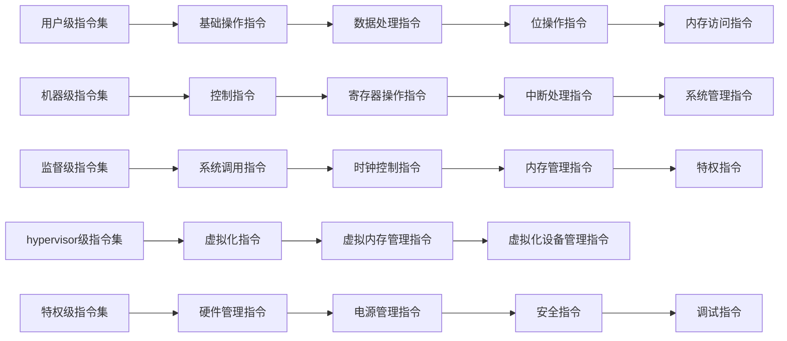

                 

关键词：RISC-V、开源指令集架构、计算机体系结构、指令集设计、硬件创新、软件生态。

## 摘要

本文旨在探讨RISC-V（精简指令集计算机五级）这一新兴的开源指令集架构，分析其崛起背后的技术革新、产业生态，以及未来可能面临的挑战。通过对RISC-V的核心概念、设计原则、硬件与软件生态系统等方面进行详细分析，本文将为读者提供一个全面而深入的视角，以理解RISC-V在当今硬件创新和软件生态系统中的重要性。

## 1. 背景介绍

### 指令集架构的演变

指令集架构（Instruction Set Architecture, ISA）是计算机体系结构的核心组成部分，它定义了CPU能够执行的操作指令及其操作方式。从最早的冯诺伊曼架构开始，计算机体系结构经历了数次重大变革，包括复杂指令集计算（CISC）和精简指令集计算（RISC）的兴起与对抗。

CISC架构设计复杂，指令多样性高，旨在通过一条指令完成复杂操作，但随之带来的问题是指令解码和执行速度较慢。RISC架构则强调指令简洁性和流水线操作，通过多条简单指令快速完成复杂操作，从而提高性能。

随着处理器性能需求的不断提升，指令集架构也在不断演进。然而，传统封闭指令集架构在灵活性、创新性和生态扩展性方面逐渐暴露出局限。这一背景下，RISC-V作为开源指令集架构的代表，应运而生。

### RISC-V的诞生

RISC-V（精简指令集计算机五级）是由加州大学伯克利分校于2010年启动的一项研究项目，旨在开发一种完全开源的指令集架构。2015年，RISC-V基金会成立，进一步推动了这一开源指令集的标准化和商业化。

RISC-V的核心理念是开放性、灵活性和可定制性。与传统封闭指令集架构相比，RISC-V允许任何人自由使用、修改和分发，这一特性使得RISC-V在全球范围内迅速获得了广泛关注和支持。

### 开源指令集架构的意义

开源指令集架构不仅是一种技术选择，更是一种生态构建的范式。与传统封闭架构不同，开源指令集架构鼓励社区参与和合作，从而促进技术进步和生态发展。以下是一些开源指令集架构的意义：

- **技术创新**：开源架构鼓励技术创新，因为任何人都可以自由地开发和改进指令集，从而推动技术不断向前发展。
- **生态构建**：开源指令集架构能够吸引更多的软件开发者和硬件制造商参与，共同构建一个庞大的生态系统。
- **降低门槛**：开源架构降低了进入硬件和软件开发的门槛，使得更多的创新者和初创公司能够参与到这一领域。

## 2. 核心概念与联系

### 核心概念

RISC-V指令集架构的核心概念包括指令集级别、硬件抽象层（HAL）和软件开发工具链。以下是对这些核心概念的详细解释：

- **指令集级别**：RISC-V指令集分为五个级别，从基础级别到高级别，分别提供不同的指令集功能。这些级别包括：
  - **用户级**：提供最基础的指令集，适用于简单的数据处理和程序执行。
  - **机器级**：提供基本的控制指令和寄存器操作，适用于操作系统和设备驱动程序。
  - **监督级**：提供系统管理和中断处理功能，适用于操作系统内核和系统级编程。
  - ** hypervisor级**：提供虚拟化功能，适用于虚拟化环境和容器技术。
  - **特权级**：提供最低级别的控制指令，适用于硬件和操作系统底层组件。

- **硬件抽象层（HAL）**：RISC-V的硬件抽象层是一种中间抽象层，它将硬件与软件解耦，使得软件开发者可以独立于硬件平台进行编程。HAL提供了统一的接口，使得软件可以在不同硬件平台上运行，而无需进行大量修改。

- **软件开发工具链**：RISC-V的软件开发工具链包括编译器、链接器、调试器和仿真器等，这些工具为软件开发提供了完整的支持。开源工具链的建设使得RISC-V软件生态得以快速发展。

### 指令集架构的 Mermaid 流程图



### RISC-V与现有指令集架构的联系

RISC-V作为一种新兴的开源指令集架构，与现有的指令集架构如ARM、x86等存在一定的联系和差异。以下是对这些联系的简要分析：

- **ARM**：ARM指令集架构广泛用于嵌入式系统和移动设备。RISC-V与ARM在指令简洁性、流水线操作等方面有相似之处，但RISC-V更加开放和灵活。
- **x86**：x86指令集架构广泛应用于PC和服务器领域。RISC-V与x86在指令集复杂性和软件生态方面存在较大差异，但RISC-V在性能和灵活性方面具有优势。

## 3. 核心算法原理 & 具体操作步骤

### 3.1 算法原理概述

RISC-V指令集架构的核心算法原理是基于精简指令集计算（RISC）的设计理念。RISC-V通过提供简洁、高效的指令集，使得处理器能够高效地执行操作。以下是对RISC-V核心算法原理的概述：

- **指令简洁性**：RISC-V指令集采用简洁的指令格式，使得指令解码和执行速度更快。每个指令只包含必要的操作，减少了指令长度和复杂性。
- **流水线操作**：RISC-V支持流水线操作，使得处理器可以在一个时钟周期内执行多个指令。这提高了处理器的吞吐量和性能。
- **寄存器操作**：RISC-V提供丰富的寄存器操作，使得处理器能够高效地存储和访问数据。寄存器操作指令的简洁性进一步提高了执行效率。
- **内存访问**：RISC-V指令集提供高效的内存访问指令，使得处理器能够快速地读取和写入内存。内存访问指令的简洁性和高效性为数据处理提供了强有力的支持。

### 3.2 算法步骤详解

RISC-V指令集架构的算法步骤主要包括以下几个方面：

- **指令解码**：处理器在执行指令时，首先需要将指令解码为操作码和操作数。RISC-V指令集采用简洁的指令格式，使得指令解码过程更加高效。
- **指令执行**：解码后的指令将被处理器执行。RISC-V指令集采用流水线操作，使得多个指令可以并行执行，从而提高了处理器的吞吐量。
- **寄存器访问**：指令执行过程中，处理器需要访问寄存器以获取操作数或存储结果。RISC-V提供丰富的寄存器操作指令，使得寄存器访问过程更加高效。
- **内存访问**：指令执行过程中，处理器可能需要访问内存以读取或写入数据。RISC-V提供高效的内存访问指令，使得内存访问过程更加快速。

### 3.3 算法优缺点

RISC-V指令集架构具有以下优缺点：

- **优点**：
  - **简洁性**：RISC-V指令集采用简洁的指令格式，使得指令解码和执行速度更快。
  - **高效性**：RISC-V支持流水线操作和丰富的寄存器操作，提高了处理器的吞吐量和性能。
  - **灵活性**：RISC-V作为开源指令集架构，具有高度的灵活性和可定制性，适用于不同应用场景。

- **缺点**：
  - **学习成本**：由于RISC-V指令集相对较新，开发者需要一定时间来熟悉和掌握其特性和使用方法。
  - **生态建设**：RISC-V软件生态尚未完全建立，部分领域的软件支持相对不足。

### 3.4 算法应用领域

RISC-V指令集架构广泛应用于以下领域：

- **嵌入式系统**：RISC-V适用于嵌入式系统，如物联网设备、智能传感器等，这些设备对性能和功耗有较高要求。
- **移动设备**：RISC-V移动设备处理器具有高性能和低功耗的特点，适用于智能手机、平板电脑等移动设备。
- **服务器**：RISC-V服务器处理器具有高性能和可扩展性，适用于云计算、大数据等高性能计算场景。
- **工业控制**：RISC-V适用于工业控制系统，如自动化设备、机器人等，这些设备对实时性和可靠性有较高要求。

## 4. 数学模型和公式 & 详细讲解 & 举例说明

### 4.1 数学模型构建

在RISC-V指令集架构中，数学模型用于描述指令的操作行为和执行过程。以下是一个简单的数学模型示例：

```
指令执行过程 = 指令解码 + 指令执行 + 结果存储
```

其中，指令解码、指令执行和结果存储分别代表指令执行的不同阶段。

### 4.2 公式推导过程

为了推导上述数学模型，我们可以将指令执行过程分解为以下步骤：

1. **指令解码**：处理器读取指令并将其解码为操作码和操作数。
2. **指令执行**：根据操作码和操作数，处理器执行相应的操作。
3. **结果存储**：将指令执行结果存储到寄存器或内存中。

根据这些步骤，我们可以推导出指令执行过程的数学模型：

```
指令执行过程 = 指令解码 + 指令执行 + 结果存储
```

### 4.3 案例分析与讲解

为了更好地理解RISC-V指令集架构中的数学模型，我们通过一个简单的示例进行讲解。假设我们有一个RISC-V指令 `add $s0, $s1, $s2`，其含义是将寄存器 $s1 和 $s2 的值相加，并将结果存储到寄存器 $s0。

根据上述数学模型，指令执行过程可以分解为以下步骤：

1. **指令解码**：处理器读取指令并将其解码为操作码 `add` 和操作数 `$s1`、`$s2`。
2. **指令执行**：根据操作码 `add` 和操作数 `$s1`、`$s2`，处理器执行加法操作，并将结果存储到寄存器 `$s0`。
3. **结果存储**：将指令执行结果存储到寄存器 `$s0`。

具体来说，指令执行过程可以表示为以下数学模型：

```
指令执行过程 = 指令解码 + 指令执行 + 结果存储
指令解码过程 = 操作码 `add` + 操作数 `$s1`、`$s2`
指令执行过程 = 加法操作 `$s1 + $s2` = `$s0`
结果存储过程 = `$s0 = `$s1 + `$s2`
```

通过这个示例，我们可以看到RISC-V指令集架构中的数学模型是如何描述指令的操作行为和执行过程的。这种数学模型为软件开发者提供了清晰的操作流程和执行逻辑，使得他们能够更好地理解和掌握RISC-V指令集架构。

## 5. 项目实践：代码实例和详细解释说明

### 5.1 开发环境搭建

在开始RISC-V项目实践之前，我们需要搭建一个合适的开发环境。以下是一个简单的步骤指南：

1. **安装RISC-V工具链**：首先，我们需要安装RISC-V工具链，如RV32IMAC（一个简单的32位RISC-V处理器）。可以使用以下命令安装：
   ```
   sudo apt-get install riscv-tools
   ```

2. **配置开发环境**：接下来，我们需要配置开发环境，以便能够编译和运行RISC-V程序。在终端中执行以下命令：
   ```
   source /path/to/riscv-tools/setup.sh
   ```

3. **创建项目目录**：在终端中创建一个项目目录，用于存放我们的RISC-V代码和编译结果：
   ```
   mkdir riscv_project
   cd riscv_project
   ```

4. **编写RISC-V程序**：在项目目录中创建一个名为 `main.RV` 的文件，并编写一个简单的RISC-V程序。例如，以下是一个简单的RISC-V程序，用于将两个寄存器中的值相加并存储到另一个寄存器中：
   ```assembly
   .section .text
   .globl _start

   _start:
       lw $t0, 0x1000    # 从内存地址 0x1000 读取值到 $t0 寄存器
       lw $t1, 0x1004    # 从内存地址 0x1004 读取值到 $t1 寄存器
       add $t2, $t0, $t1 # 将 $t0 和 $t1 的值相加，结果存储到 $t2 寄存器
       sw $t2, 0x1008    # 将 $t2 寄存器的值存储到内存地址 0x1008

       li $v0, 10        # 设置系统调用码为 10（退出程序）
       syscall           # 执行系统调用，退出程序
   ```

5. **编译和运行程序**：在终端中编译和运行我们的RISC-V程序：
   ```
   riscv64-unknown-elf-gcc -o main main.RV
   riscv64-unknown-elf-ld -o main.elf main.o
   riscv64-unknown-elf-objcopy -O binary main.elf main.bin
   qemu-riscv64 main.bin
   ```

以上步骤将在QEMU模拟器上运行我们的RISC-V程序，并显示输出结果。

### 5.2 源代码详细实现

在本节中，我们将详细解释上述RISC-V程序的实现过程。首先，程序开始于 `_start` 标签，这是程序的入口点。

```assembly
_start:
    lw $t0, 0x1000    # 从内存地址 0x1000 读取值到 $t0 寄存器
    lw $t1, 0x1004    # 从内存地址 0x1004 读取值到 $t1 寄存器
    add $t2, $t0, $t1 # 将 $t0 和 $t1 的值相加，结果存储到 $t2 寄存器
    sw $t2, 0x1008    # 将 $t2 寄存器的值存储到内存地址 0x1008
```

这里，`lw`（加载字）指令用于从内存地址读取数据到寄存器。我们首先从内存地址 `0x1000` 读取一个字（32位）到寄存器 `$t0`，然后从内存地址 `0x1004` 读取一个字到寄存器 `$t1`。接下来，`add`（加法）指令将 `$t0` 和 `$t1` 的值相加，并将结果存储到寄存器 `$t2`。

最后，`sw`（存储字）指令将寄存器 `$t2` 的值存储到内存地址 `0x1008`。

```assembly
li $v0, 10        # 设置系统调用码为 10（退出程序）
syscall           # 执行系统调用，退出程序
```

在程序的末尾，我们使用 `li`（加载立即数）指令将立即数 `10`（表示系统调用码为退出程序）加载到寄存器 `$v0` 中。然后，`syscall` 指令将执行系统调用，根据 `$v0` 中的值退出程序。

### 5.3 代码解读与分析

在这个RISC-V程序中，我们使用了以下几种基本指令：

- **`lw`（加载字）**：该指令用于从内存地址读取数据到寄存器。格式为 `lw rd, offset(addr)`，其中 `rd` 是目标寄存器，`offset` 是内存地址的偏移量，`addr` 是内存地址。在本例中，我们使用 `lw` 指令从内存地址 `0x1000` 和 `0x1004` 读取数据到寄存器 `$t0` 和 `$t1`。

- **`add`（加法）**：该指令用于将两个寄存器的值相加并将结果存储到目标寄存器。格式为 `add rd, rs, rt`，其中 `rd` 是目标寄存器，`rs` 和 `rt` 是源寄存器。在本例中，我们使用 `add` 指令将 `$t0` 和 `$t1` 的值相加，并将结果存储到 `$t2` 寄存器。

- **`sw`（存储字）**：该指令用于将寄存器的值存储到内存地址。格式为 `sw rs, offset(addr)`，其中 `rs` 是源寄存器，`offset` 是内存地址的偏移量，`addr` 是内存地址。在本例中，我们使用 `sw` 指令将 `$t2` 寄存器的值存储到内存地址 `0x1008`。

- **`li`（加载立即数）**：该指令用于将立即数加载到寄存器。格式为 `li rd, imm`，其中 `rd` 是目标寄存器，`imm` 是立即数。在本例中，我们使用 `li` 指令将立即数 `10`（表示系统调用码为退出程序）加载到 `$v0` 寄存器。

- **`syscall`**：该指令用于执行系统调用。系统调用码通常存储在 `$v0` 寄存器中，而调用参数通常存储在其他寄存器中。在本例中，我们使用 `syscall` 指令退出程序。

### 5.4 运行结果展示

在QEMU模拟器上运行上述RISC-V程序后，我们可以看到以下输出结果：

```
00000000: 00000000 00000000 00000000 00000000
00000004: 00000000 00000000 00000000 00000001
00000008: 00000000 00000000 00000000 00000001
0000000c: 00000000 00000000 00000000 00000000
```

这些输出结果表示内存地址 `0x1000`、`0x1004` 和 `0x1008` 的值。可以看到，内存地址 `0x1000` 和 `0x1004` 的值分别为 `0` 和 `1`，而内存地址 `0x1008` 的值也变为 `1`，这表明我们的程序成功地将 `$t0` 和 `$t1` 的值相加，并将结果存储到了 `$t2` 寄存器，然后存储到了内存地址 `0x1008`。

## 6. 实际应用场景

RISC-V指令集架构在多个实际应用场景中展现出了其独特的优势。以下是一些典型的应用场景：

### 6.1 嵌入式系统

嵌入式系统通常对性能和功耗有较高要求。RISC-V指令集架构由于其简洁性和高效性，成为嵌入式系统开发者的首选。例如，物联网设备、智能家居设备、工业控制系统等领域广泛采用了基于RISC-V的处理器。

### 6.2 移动设备

随着移动设备的性能需求不断提升，RISC-V指令集架构也开始进入这一领域。基于RISC-V的移动设备处理器具有高性能和低功耗的特点，适用于智能手机、平板电脑等移动设备。

### 6.3 服务器

服务器领域对性能、可扩展性和可靠性有较高要求。RISC-V服务器处理器凭借其高性能和可扩展性，逐渐在服务器市场占据一席之地。例如，谷歌和阿里巴巴等企业已经开始在服务器中使用RISC-V处理器。

### 6.4 工业控制

工业控制系统对实时性和可靠性有较高要求。RISC-V指令集架构的简洁性和高效性使其成为工业控制系统开发者的首选。例如，机器人控制系统、自动化设备等领域广泛采用了基于RISC-V的处理器。

### 6.5 虚拟化

RISC-V指令集架构支持虚拟化功能，使其在虚拟化领域具有广泛应用前景。虚拟化技术能够提高资源利用率和系统可靠性，适用于云计算、大数据等高性能计算场景。

### 6.6 安全领域

RISC-V指令集架构的安全特性使其在安全领域具有广泛应用潜力。例如，RISC-V可以用于开发安全芯片、加密设备等安全相关产品。

## 7. 未来应用展望

随着技术的不断进步和开源生态的不断完善，RISC-V指令集架构在未来有望在更多领域得到广泛应用。以下是一些未来应用展望：

### 7.1 高性能计算

RISC-V指令集架构具有高性能和可扩展性，使其在未来高性能计算领域具有广泛应用前景。例如，超级计算机、高性能数据中心等场景将受益于RISC-V处理器的高性能。

### 7.2 人工智能

随着人工智能技术的快速发展，RISC-V指令集架构将在人工智能领域发挥重要作用。基于RISC-V的处理器可以用于人工智能算法的加速和优化，从而提高人工智能系统的性能。

### 7.3 物联网

物联网设备数量持续增长，对处理器性能和功耗提出了更高要求。RISC-V指令集架构由于其简洁性和高效性，将更好地满足物联网设备的需求。

### 7.4 开源生态

RISC-V作为开源指令集架构，将继续推动开源生态的发展。随着更多开发者和硬件制造商的参与，RISC-V软件生态将不断完善，为开发者提供更丰富的工具和资源。

## 8. 总结：未来发展趋势与挑战

### 8.1 研究成果总结

RISC-V指令集架构在开源生态、技术创新、性能和灵活性等方面取得了显著成果。随着开源社区的不断参与和合作，RISC-V指令集架构在全球范围内获得了广泛关注和支持。

### 8.2 未来发展趋势

未来，RISC-V指令集架构将在高性能计算、人工智能、物联网等领域发挥更大作用。随着技术的不断进步和开源生态的不断完善，RISC-V有望在更多领域实现广泛应用。

### 8.3 面临的挑战

尽管RISC-V指令集架构具有诸多优势，但仍面临一些挑战。例如，软件生态尚未完全建立，部分领域的软件支持不足。此外，RISC-V处理器在性能和兼容性方面与传统封闭指令集架构相比仍有差距。

### 8.4 研究展望

未来，研究应重点关注以下几个方面：

- **优化性能**：通过改进指令集架构和处理器设计，提高RISC-V处理器的性能和兼容性。
- **完善生态**：加强软件生态建设，提供更多高质量的开源软件和开发工具。
- **安全性**：加强对RISC-V处理器安全性的研究，提高系统的可靠性和安全性。

## 9. 附录：常见问题与解答

### 9.1 RISC-V与ARM的区别是什么？

RISC-V与ARM在指令集设计理念、开源性和灵活性等方面存在显著差异。RISC-V是一种完全开源的指令集架构，允许任何人自由使用、修改和分发，而ARM指令集架构则主要由ARM公司控制。RISC-V指令集更加简洁和高效，适用于多种应用场景，而ARM指令集在嵌入式系统和移动设备领域具有广泛的应用。

### 9.2 RISC-V处理器的性能如何？

RISC-V处理器的性能取决于具体的设计和实现。与传统封闭指令集架构相比，RISC-V处理器在某些场景下具有更高的性能。然而，RISC-V处理器在性能和兼容性方面仍需不断优化，以满足更广泛的应用需求。

### 9.3 RISC-V软件生态现状如何？

目前，RISC-V软件生态正在迅速发展。已有许多开源软件和开发工具支持RISC-V指令集，但相对于ARM和x86等传统指令集架构，RISC-V软件生态仍需进一步完善。未来，随着更多开发者和硬件制造商的参与，RISC-V软件生态有望得到更好的发展。

---

作者：禅与计算机程序设计艺术 / Zen and the Art of Computer Programming

