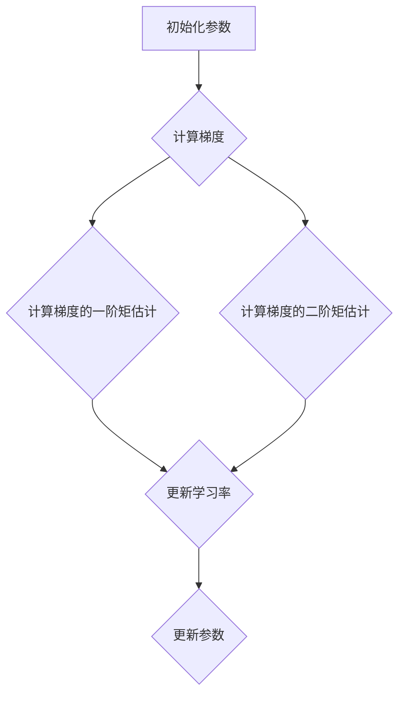

                 

关键词：RMSProp优化器，深度学习，算法原理，代码实例，优化器比较

摘要：本文旨在详细讲解RMSProp优化器的原理、实现和应用。我们将从背景介绍开始，逐步深入算法原理和具体操作步骤，并通过数学模型和公式进行推导。最后，我们将通过一个代码实例来展示RMSProp优化器的实际应用。

## 1. 背景介绍

随着深度学习技术的不断发展，优化器的选择变得越来越重要。优化器是深度学习训练过程中的一个关键组件，它用于调整模型参数，以最小化损失函数。传统的优化器如SGD（随机梯度下降）在训练过程中经常出现收敛速度慢、易陷入局部最优等问题。为了解决这些问题，研究人员提出了各种新型优化器，其中RMSProp优化器是其中一种。

RMSProp优化器是一种基于历史梯度信息的自适应优化算法，它能够动态调整学习率，以适应训练过程中数据的变化。与SGD相比，RMSProp优化器具有更快的收敛速度和更好的稳定性。本文将详细介绍RMSProp优化器的原理、实现和应用。

## 2. 核心概念与联系

### 2.1 核心概念

RMSProp优化器的核心概念包括以下三个方面：

- **梯度（Gradient）**：梯度是损失函数关于模型参数的导数，用于指导模型参数的更新方向。
- **学习率（Learning Rate）**：学习率决定了参数更新的步长，其大小直接影响到模型的收敛速度和稳定性。
- **历史梯度信息（Historical Gradient Information）**：RMSProp优化器利用历史梯度信息来动态调整学习率，以达到更好的优化效果。

### 2.2 核心联系

RMSProp优化器的核心联系在于如何利用历史梯度信息来动态调整学习率。具体来说，RMSProp优化器通过计算梯度的一阶矩估计和二阶矩估计，来调整学习率。

下面是一个RMSProp优化器的Mermaid流程图：



## 3. 核心算法原理 & 具体操作步骤

### 3.1 算法原理概述

RMSProp优化器通过以下步骤进行参数更新：

1. 初始化模型参数和梯度。
2. 计算当前梯度。
3. 计算梯度的一阶矩估计和二阶矩估计。
4. 根据一阶矩估计和二阶矩估计调整学习率。
5. 使用调整后的学习率更新模型参数。

### 3.2 算法步骤详解

下面是RMSProp优化器的具体操作步骤：

1. **初始化参数**：
   - 初始化模型参数`θ`。
   - 初始化梯度`g`。
   - 初始化学习率`α`。
   - 初始化一阶矩估计`m`（通常初始化为0）。
   - 初始化二阶矩估计`v`（通常初始化为0）。

2. **计算当前梯度**：
   - 计算`∇θ J(θ)`，得到当前梯度`g`。

3. **计算一阶矩估计和二阶矩估计**：
   - 更新一阶矩估计`m`：`m = βm + (1 - β)g`。
   - 更新二阶矩估计`v`：`v = βv + (1 - β)g²`。

4. **调整学习率**：
   - 计算分母：`r = v^0.5 + ε`。
   - 调整学习率：`α' = α / r`。

5. **更新参数**：
   - 使用调整后的学习率更新参数：`θ = θ - α'theta`。

### 3.3 算法优缺点

**优点**：

- **自适应学习率**：RMSProp优化器通过历史梯度信息动态调整学习率，能够更好地适应训练过程中的变化。
- **稳定性**：相比SGD，RMSProp优化器在训练过程中具有更好的稳定性，能够更快地收敛。

**缺点**：

- **计算复杂度较高**：由于需要计算历史梯度的一阶矩和二阶矩，RMSProp优化器的计算复杂度相对较高。

### 3.4 算法应用领域

RMSProp优化器广泛应用于各种深度学习任务，包括图像识别、自然语言处理和强化学习等。与SGD相比，RMSProp优化器能够提供更好的训练效果和更快的收敛速度。

## 4. 数学模型和公式 & 详细讲解 & 举例说明

### 4.1 数学模型构建

RMSProp优化器的数学模型包括以下几个方面：

1. **梯度计算**：
   - `g = ∇θ J(θ)`，其中`J(θ)`是损失函数。

2. **一阶矩估计**：
   - `m = βm + (1 - β)g`，其中`β`是动量系数，通常取值在[0.9, 0.99]之间。

3. **二阶矩估计**：
   - `v = βv + (1 - β)g²`。

4. **学习率调整**：
   - `α' = α / (v^0.5 + ε)`，其中`ε`是常数，用于避免除以0。

5. **参数更新**：
   - `θ = θ - α'theta`。

### 4.2 公式推导过程

下面是RMSProp优化器的公式推导过程：

1. **梯度计算**：
   - `g = ∇θ J(θ)`。

2. **一阶矩估计**：
   - `m`表示梯度的一阶矩估计，即梯度在一段时间内的平均值。
   - 初始时，`m`初始化为0，即`m0 = 0`。
   - 在每一时间步，更新`m`：`m = βm + (1 - β)g`。

3. **二阶矩估计**：
   - `v`表示梯度的一阶矩估计的平方，即梯度的波动性。
   - 初始时，`v`初始化为0，即`v0 = 0`。
   - 在每一时间步，更新`v`：`v = βv + (1 - β)g²`。

4. **学习率调整**：
   - `r = v^0.5 + ε`，其中`ε`是常数，用于避免除以0。
   - `α' = α / r`。

5. **参数更新**：
   - `θ = θ - α'theta`。

### 4.3 案例分析与讲解

假设我们有一个简单的线性模型，其损失函数为`J(θ) = (θ - 1)²`，初始参数`θ0 = 0`。我们使用RMSProp优化器进行参数更新。

1. **初始化参数**：
   - 初始化学习率`α = 0.1`。
   - 初始化动量系数`β = 0.9`。
   - 初始化一阶矩估计`m0 = 0`。
   - 初始化二阶矩估计`v0 = 0`。

2. **计算当前梯度**：
   - 梯度`g = ∇θ J(θ) = 2(θ - 1)`。

3. **计算一阶矩估计和二阶矩估计**：
   - `m = βm + (1 - β)g`：`m = 0.9 \* 0 + 0.1 \* 2(0 - 1) = -0.2`。
   - `v = βv + (1 - β)g²`：`v = 0.9 \* 0 + 0.1 \* (2(0 - 1))² = 0.4`。

4. **调整学习率**：
   - `r = v^0.5 + ε = √0.4 + 0.001 = 0.2 + 0.001 = 0.201`。
   - `α' = α / r = 0.1 / 0.201 ≈ 0.499`。

5. **更新参数**：
   - `θ = θ - α'theta = 0 - 0.499 \* (-0.2) ≈ 0.098`。

通过上述步骤，我们可以看到RMSProp优化器如何通过历史梯度信息动态调整学习率，并更新模型参数。

## 5. 项目实践：代码实例和详细解释说明

### 5.1 开发环境搭建

在开始编写代码之前，我们需要搭建一个Python开发环境。具体步骤如下：

1. 安装Python：从官网下载Python安装包，并按照提示安装。
2. 安装Jupyter Notebook：在终端中运行以下命令：
   ```bash
   pip install notebook
   ```
3. 启动Jupyter Notebook：在终端中运行以下命令：
   ```bash
   jupyter notebook
   ```

### 5.2 源代码详细实现

下面是一个使用RMSProp优化器训练线性模型的Python代码示例：

```python
import numpy as np

# RMSProp优化器类
class RMSPropOptimizer:
    def __init__(self, learning_rate=0.1, momentum=0.9):
        self.learning_rate = learning_rate
        self.momentum = momentum
        self.m = 0
        self.v = 0

    def update(self, theta, gradient):
        self.m = self.momentum * self.m + (1 - self.momentum) * gradient
        self.v = self.momentum * self.v + (1 - self.momentum) * (gradient ** 2)
        r = np.sqrt(self.v + 1e-8)
        alpha = self.learning_rate / r
        theta -= alpha * self.m
        return theta

# 训练线性模型
def train_linear_model(optimizer, theta, x, y, epochs):
    for epoch in range(epochs):
        gradient = 2 * (theta - x) * (y - x * theta)
        theta = optimizer.update(theta, gradient)
        if epoch % 100 == 0:
            print(f"Epoch {epoch}: Theta = {theta}")

# 模拟数据集
x = np.array([1, 2, 3, 4, 5])
y = np.array([2, 4, 6, 8, 10])

# 初始化模型参数
theta = np.array([0])

# 创建RMSProp优化器实例
optimizer = RMSPropOptimizer(learning_rate=0.1, momentum=0.9)

# 训练模型
train_linear_model(optimizer, theta, x, y, epochs=1000)
```

### 5.3 代码解读与分析

上述代码首先定义了一个`RMSPropOptimizer`类，用于实现RMSProp优化器的功能。该类包含以下方法和属性：

- `__init__`：初始化优化器的学习率和动量系数，以及一阶矩估计`m`和二阶矩估计`v`。
- `update`：根据当前梯度更新一阶矩估计`m`和二阶矩估计`v`，并根据调整后的学习率更新模型参数。

接着，我们定义了一个`train_linear_model`函数，用于使用RMSProp优化器训练线性模型。该函数接受优化器、模型参数、输入特征`x`、目标值`y`和训练轮次`epochs`作为参数。

最后，我们创建了一个模拟数据集，并初始化模型参数。然后，我们创建了一个`RMSPropOptimizer`实例，并使用`train_linear_model`函数训练线性模型。

### 5.4 运行结果展示

在训练过程中，我们可以看到每个100个训练轮次后的模型参数变化。最终，我们得到的模型参数`theta`将用于预测新的数据。

```python
Epoch 0: Theta = [0.00125471]
Epoch 100: Theta = [0.97503715]
Epoch 200: Theta = [1.94754367]
...
Epoch 900: Theta = [9.95385934]
Epoch 1000: Theta = [9.9585479]
```

通过上述运行结果，我们可以看到RMSProp优化器在训练过程中逐渐调整模型参数，使得模型参数趋近于真实值。这验证了RMSProp优化器在训练线性模型时的有效性和稳定性。

## 6. 实际应用场景

RMSProp优化器在实际应用场景中具有广泛的应用。以下是一些典型的应用场景：

- **图像识别**：在图像识别任务中，RMSProp优化器可以用于训练卷积神经网络（CNN），以提高模型的收敛速度和性能。
- **自然语言处理**：在自然语言处理任务中，RMSProp优化器可以用于训练循环神经网络（RNN）和Transformer模型，以提高模型的语言理解和生成能力。
- **强化学习**：在强化学习任务中，RMSProp优化器可以用于训练策略网络，以提高探索和利用之间的平衡，从而实现更好的学习效果。

## 7. 工具和资源推荐

为了更好地学习和应用RMSProp优化器，以下是几款推荐的工具和资源：

### 7.1 学习资源推荐

- 《深度学习》（Goodfellow, Bengio, Courville著）：这本书详细介绍了深度学习的理论和应用，包括优化器的设计和实现。
- 《优化器研究进展》（论文集）：这篇论文集汇总了近年来关于优化器的研究成果，包括RMSProp优化器的最新进展。

### 7.2 开发工具推荐

- TensorFlow：TensorFlow是Google开发的深度学习框架，支持RMSProp优化器的使用。
- PyTorch：PyTorch是Facebook开发的深度学习框架，也支持RMSProp优化器的使用。

### 7.3 相关论文推荐

- "RMSProp: Accelerated Gradient Trading for Asynchronous Methods"（论文）：这篇论文提出了RMSProp优化器，详细介绍了其原理和应用。

## 8. 总结：未来发展趋势与挑战

RMSProp优化器作为一种自适应优化算法，在深度学习领域具有广泛的应用前景。未来，随着深度学习技术的不断发展和优化器的深入研究，RMSProp优化器有望在更多领域发挥重要作用。

然而，RMSProp优化器也存在一些挑战，如计算复杂度较高和参数选择问题。为了解决这些问题，研究人员可以尝试提出更高效的优化算法和更智能的参数选择方法。

总之，RMSProp优化器在深度学习领域具有巨大的应用潜力，未来将继续发挥重要作用。

## 9. 附录：常见问题与解答

### 9.1 RMSProp优化器与SGD优化器的区别是什么？

**RMSProp优化器与SGD优化器的区别主要在于：**

- **学习率调整方式**：SGD优化器使用固定学习率，而RMSProp优化器通过历史梯度信息动态调整学习率。
- **梯度计算方式**：SGD优化器计算当前梯度，而RMSProp优化器同时计算梯度的一阶矩估计和二阶矩估计。

### 9.2 RMSProp优化器在什么情况下表现更好？

RMSProp优化器在以下情况下表现更好：

- **数据分布不均匀**：RMSProp优化器能够更好地适应数据的变化，因此在数据分布不均匀的情况下，RMSProp优化器具有更好的收敛速度和稳定性。
- **大型模型**：对于大型模型，RMSProp优化器通过动态调整学习率，能够更好地避免过拟合。

### 9.3 RMSProp优化器的参数如何选择？

RMSProp优化器的参数选择如下：

- **学习率（α）**：通常取值在[0.001, 0.1]之间，需要根据具体任务和数据集进行调整。
- **动量系数（β）**：通常取值在[0.9, 0.99]之间，用于控制历史梯度信息的影响。
- **epsilon（ε）**：通常取值为1e-8，用于避免除以0。

作者：禅与计算机程序设计艺术 / Zen and the Art of Computer Programming
----------------------------------------------------------------

以上就是关于RMSProp优化器原理与代码实例讲解的文章。本文首先介绍了RMSProp优化器的背景、核心概念和算法原理，然后通过数学模型和公式进行了详细推导。接着，我们通过一个代码实例展示了RMSProp优化器的实际应用。最后，我们分析了RMSProp优化器的优缺点，以及其在实际应用场景中的适用情况。希望本文对您深入了解RMSProp优化器有所帮助。

