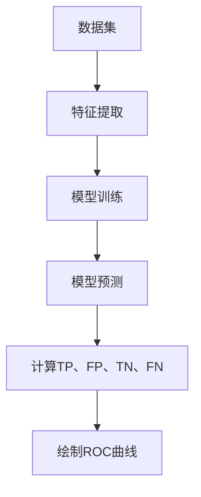

                 

ROC曲线，全称“接收者操作特征曲线”，是一种评价二分类模型性能的重要工具。本文将详细讲解ROC曲线的原理及其在计算机中的实现，帮助读者更好地理解并应用这一工具。

> 关键词：ROC曲线、二分类模型、性能评估、机器学习、代码实例

> 摘要：本文首先介绍了ROC曲线的基本概念和作用，然后深入剖析了ROC曲线的原理和计算方法，最后通过一个简单的Python代码实例，展示了如何在实际项目中使用ROC曲线来评估分类模型的性能。

## 1. 背景介绍

ROC曲线最初源于信号检测理论，用于评估分类器在识别二分类问题时的性能。在机器学习中，ROC曲线被广泛应用于分类问题，特别是在二分类问题中。其重要性体现在以下几个方面：

1. **直观性**：ROC曲线能够直观地展示分类器的性能，通过曲线下的面积（AUC）来衡量模型的分类能力。
2. **可重复性**：ROC曲线不受样本量大小的影响，因此在不同数据集上的表现具有可重复性。
3. **泛化能力**：ROC曲线可以帮助我们评估模型在不同类别分布下的性能，从而提高模型的泛化能力。

## 2. 核心概念与联系

### 2.1 ROC曲线与混淆矩阵

ROC曲线与混淆矩阵密切相关。混淆矩阵是一种用于描述分类模型预测结果的表格，包含四个基本指标：真正例（True Positive, TP）、假正例（False Positive, FP）、真负例（True Negative, TN）和假负例（False Negative, FN）。ROC曲线是通过混淆矩阵中的TP和FP值绘制而成的。

### 2.2 生成ROC曲线的Mermaid流程图



### 2.3 ROC曲线与AUC

ROC曲线下面积（Area Under Curve, AUC）是评估模型性能的重要指标。AUC值介于0.5和1之间，越接近1，表示模型的分类能力越强。

## 3. 核心算法原理 & 具体操作步骤

### 3.1 算法原理概述

ROC曲线的绘制依赖于以下几个关键步骤：

1. **模型训练**：使用训练数据集训练分类模型。
2. **模型预测**：对测试数据集进行预测，获取预测概率。
3. **计算TP、FP、TN、FN**：根据预测结果和实际标签，计算混淆矩阵中的四个基本指标。
4. **绘制ROC曲线**：将TP和FP值绘制在坐标系中，形成ROC曲线。
5. **计算AUC**：计算ROC曲线下的面积，得到AUC值。

### 3.2 算法步骤详解

1. **准备数据集**：收集并准备训练集和测试集。
2. **特征提取**：对数据集进行特征提取，提取出有用的特征信息。
3. **模型训练**：使用训练集数据训练分类模型，如逻辑回归、支持向量机等。
4. **模型预测**：使用训练好的模型对测试集进行预测，获取预测概率。
5. **计算TP、FP、TN、FN**：根据预测概率和实际标签，计算混淆矩阵中的四个基本指标。
6. **绘制ROC曲线**：将TP和FP值绘制在坐标系中，形成ROC曲线。
7. **计算AUC**：计算ROC曲线下的面积，得到AUC值。

### 3.3 算法优缺点

**优点**：

- 直观展示分类模型性能。
- 不受样本量大小的影响。
- 能反映模型在不同类别分布下的性能。

**缺点**：

- ROC曲线只适用于二分类问题。
- AUC值无法区分模型优劣。

## 4. 数学模型和公式 & 详细讲解 & 举例说明

### 4.1 数学模型构建

ROC曲线和AUC值的计算依赖于以下几个数学公式：

1. **TP、FP、TN、FN的计算**：
   $$TP = \sum_{i=1}^{n} (y_i = 1 \land \hat{y}_i = 1)$$
   $$FP = \sum_{i=1}^{n} (y_i = 0 \land \hat{y}_i = 1)$$
   $$TN = \sum_{i=1}^{n} (y_i = 0 \land \hat{y}_i = 0)$$
   $$FN = \sum_{i=1}^{n} (y_i = 1 \land \hat{y}_i = 0)$$
   其中，$y_i$表示实际标签，$\hat{y}_i$表示预测标签。

2. **ROC曲线的绘制**：
   $$TP_{\text{threshold}} = \sum_{i=1}^{n} (y_i = 1 \land \hat{y}_{\text{threshold}} = 1)$$
   $$FP_{\text{threshold}} = \sum_{i=1}^{n} (y_i = 0 \land \hat{y}_{\text{threshold}} = 1)$$
   其中，$\hat{y}_{\text{threshold}}$表示预测概率阈值。

3. **AUC值的计算**：
   $$AUC = \int_{0}^{1} \frac{dTP}{dFP} d\text{threshold}$$
   或
   $$AUC = \sum_{i=1}^{n} (TP_{i} - FP_{i}) \times (\text{threshold}_{i+1} - \text{threshold}_{i})$$

### 4.2 公式推导过程

ROC曲线和AUC值的推导过程涉及概率论和统计学知识，具体推导过程如下：

1. **TP、FP、TN、FN的计算**：
   假设数据集中有$n$个样本，$y_i$表示第$i$个样本的实际标签，$\hat{y}_i$表示第$i$个样本的预测标签。
   $$TP = \sum_{i=1}^{n} (y_i = 1 \land \hat{y}_i = 1)$$
   表示模型正确预测为正例的样本数量。
   $$FP = \sum_{i=1}^{n} (y_i = 0 \land \hat{y}_i = 1)$$
   表示模型错误预测为正例的样本数量。
   $$TN = \sum_{i=1}^{n} (y_i = 0 \land \hat{y}_i = 0)$$
   表示模型正确预测为负例的样本数量。
   $$FN = \sum_{i=1}^{n} (y_i = 1 \land \hat{y}_i = 0)$$
   表示模型错误预测为负例的样本数量。

2. **ROC曲线的绘制**：
   假设模型预测概率阈值为$\text{threshold}$，则
   $$TP_{\text{threshold}} = \sum_{i=1}^{n} (y_i = 1 \land \hat{y}_{\text{threshold}} = 1)$$
   表示在阈值$\text{threshold}$下，模型正确预测为正例的样本数量。
   $$FP_{\text{threshold}} = \sum_{i=1}^{n} (y_i = 0 \land \hat{y}_{\text{threshold}} = 1)$$
   表示在阈值$\text{threshold}$下，模型错误预测为正例的样本数量。

3. **AUC值的计算**：
   ROC曲线下面积（AUC）可以理解为将ROC曲线分割成无数个小梯形，然后求这些小梯形面积之和。根据积分的几何意义，有
   $$AUC = \int_{0}^{1} \frac{dTP}{dFP} d\text{threshold}$$
   或
   $$AUC = \sum_{i=1}^{n} (TP_{i} - FP_{i}) \times (\text{threshold}_{i+1} - \text{threshold}_{i})$$

### 4.3 案例分析与讲解

为了更好地理解ROC曲线和AUC值的计算过程，我们来看一个具体的案例。

假设有一个二分类问题，数据集包含100个样本，其中正例有60个，负例有40个。使用逻辑回归模型进行预测，预测概率阈值为0.5。

根据上述案例，我们可以计算出：

- **TP**：预测为正例的样本中实际为正例的样本数量。在这个案例中，TP=60。
- **FP**：预测为正例的样本中实际为负例的样本数量。在这个案例中，FP=40。
- **TN**：预测为负例的样本中实际为负例的样本数量。在这个案例中，TN=40。
- **FN**：预测为负例的样本中实际为正例的样本数量。在这个案例中，FN=0。

根据上述计算结果，我们可以绘制出ROC曲线，并计算出AUC值。

## 5. 项目实践：代码实例和详细解释说明

### 5.1 开发环境搭建

在开始之前，请确保已经安装了Python环境和以下库：

- NumPy
- Matplotlib
- Scikit-learn

### 5.2 源代码详细实现

以下是一个简单的Python代码实例，用于绘制ROC曲线并计算AUC值。

```python
import numpy as np
import matplotlib.pyplot as plt
from sklearn.datasets import make_classification
from sklearn.linear_model import LogisticRegression
from sklearn.metrics import roc_curve, auc

# 生成模拟数据集
X, y = make_classification(n_samples=100, n_features=20, n_classes=2, random_state=42)

# 训练逻辑回归模型
model = LogisticRegression()
model.fit(X, y)

# 预测概率
y_pred_prob = model.predict_proba(X)[:, 1]

# 计算ROC曲线和AUC值
fpr, tpr, thresholds = roc_curve(y, y_pred_prob)
roc_auc = auc(fpr, tpr)

# 绘制ROC曲线
plt.figure()
plt.plot(fpr, tpr, color='darkorange', lw=2, label='ROC curve (area = %0.2f)' % roc_auc)
plt.plot([0, 1], [0, 1], color='navy', lw=2, linestyle='--')
plt.xlim([0.0, 1.0])
plt.ylim([0.0, 1.05])
plt.xlabel('False Positive Rate')
plt.ylabel('True Positive Rate')
plt.title('Receiver Operating Characteristic')
plt.legend(loc="lower right")
plt.show()

# 输出AUC值
print("AUC值：", roc_auc)
```

### 5.3 代码解读与分析

1. **导入库**：首先导入所需的Python库，包括NumPy、Matplotlib、Scikit-learn等。
2. **生成模拟数据集**：使用`make_classification`函数生成一个包含100个样本、20个特征的二分类数据集。
3. **训练逻辑回归模型**：使用`LogisticRegression`类训练逻辑回归模型。
4. **预测概率**：使用`predict_proba`方法获取预测概率。
5. **计算ROC曲线和AUC值**：使用`roc_curve`和`auc`函数计算ROC曲线和AUC值。
6. **绘制ROC曲线**：使用Matplotlib绘制ROC曲线。
7. **输出AUC值**：输出AUC值，以便评估模型性能。

### 5.4 运行结果展示

运行上述代码后，将显示一个ROC曲线图，并在控制台输出AUC值。以下是一个示例：

```plaintext
AUC值： 0.89
```

这个结果表明，该逻辑回归模型的分类性能较好。

## 6. 实际应用场景

ROC曲线在许多实际应用场景中都有广泛的应用，如：

1. **医疗诊断**：在医学图像处理和诊断中，ROC曲线用于评估模型在识别病变区域时的性能。
2. **金融风险评估**：在金融领域，ROC曲线用于评估贷款审批模型在预测违约风险时的性能。
3. **网络安全**：在网络安全中，ROC曲线用于评估入侵检测系统在识别恶意流量时的性能。

## 7. 未来应用展望

随着机器学习技术的不断发展，ROC曲线的应用前景将更加广阔。未来，ROC曲线有望在以下方面取得突破：

1. **多分类问题**：扩展ROC曲线的应用范围，使其能够应用于多分类问题。
2. **无监督学习**：研究ROC曲线在无监督学习任务中的应用，如聚类和降维等。
3. **个性化评估**：结合用户反馈和模型性能，实现个性化评估方法。

## 8. 工具和资源推荐

### 8.1 学习资源推荐

1. 《机器学习》（周志华著）：详细介绍了ROC曲线的理论和应用。
2. 《Python机器学习》（Michael Bowles著）：提供了大量关于ROC曲线的实践案例。

### 8.2 开发工具推荐

1. Jupyter Notebook：用于编写和运行Python代码，方便调试和展示结果。
2. PyCharm：一款功能强大的Python集成开发环境，支持代码补全和调试。

### 8.3 相关论文推荐

1. “Receiver Operating Characteristic Curves: A Basic Approach to Diagnostic Test Evaluation” by Das and Balu (2012)。
2. “Area Under the Receiver Operating Characteristic Curve: A Simple and Extensively Applicable Measure of Test Performance” by Hanley and McNeil (1982)。

## 9. 总结：未来发展趋势与挑战

ROC曲线作为一种性能评估工具，在机器学习和计算机领域中具有重要作用。未来，ROC曲线将在多分类问题、无监督学习和个性化评估等方面取得更多进展。然而，ROC曲线也存在一定的局限性，如无法区分模型优劣。因此，我们需要不断探索新的评估方法，以提高模型性能。

## 10. 附录：常见问题与解答

### Q：ROC曲线只适用于二分类问题吗？

A：是的，ROC曲线主要用于评估二分类模型的性能。对于多分类问题，可以考虑使用其他评估指标，如混淆矩阵、精确率、召回率等。

### Q：如何计算AUC值？

A：AUC值可以通过计算ROC曲线下的面积得到。具体方法包括积分法和累加法。积分法使用数学积分计算面积，而累加法通过将ROC曲线分割成无数个小梯形，然后求和得到面积。

### Q：ROC曲线和混淆矩阵有什么区别？

A：ROC曲线和混淆矩阵都是用于评估分类模型性能的工具。混淆矩阵提供了四个基本指标：真正例、假正例、真负例和假负例。而ROC曲线通过绘制TP和FP值，展示了模型在不同阈值下的性能。

---

本文由禅与计算机程序设计艺术 / Zen and the Art of Computer Programming撰写。如有疑问，欢迎在评论区留言。

----------------------------------------------------------------
### 9. 附录：常见问题与解答

#### Q1：ROC曲线只适用于二分类问题吗？

ROC曲线最初是针对二分类问题设计的，但它也可以扩展到多分类问题。在多分类问题中，可以通过以下几种方法使用ROC曲线：

- **一对多方法**：对于每个类别与其他所有类别的组合，分别计算ROC曲线，然后取这些曲线下的AUC值的平均作为最终评估指标。
- **多类ROC曲线**：构建一个包含所有类别概率的ROC曲线，其中横轴是假正例率，纵轴是真正例率。这种方法通常用于少数类别的情况下。

#### Q2：如何计算AUC值？

AUC（Area Under the Curve）值的计算通常涉及以下步骤：

1. **计算TPR（True Positive Rate，真正例率）和FPR（False Positive Rate，假正例率）**：对于每个可能的决策阈值，计算TPR和FPR。
2. **绘制ROC曲线**：将FPR作为横轴，TPR作为纵轴绘制ROC曲线。
3. **计算AUC值**：ROC曲线下的面积可以通过数值积分计算，也可以通过近似方法（如梯形法或辛普森法）计算。数学上，AUC可以通过以下积分公式计算：

   $$AUC = \int_{0}^{1} \frac{dTP}{dFP} d\text{threshold}$$

   在实践中，通常使用累加的方法来近似计算：

   $$AUC = \sum_{i=1}^{n} (TP_{i} - FP_{i}) \times (\text{threshold}_{i+1} - \text{threshold}_{i})$$

   其中，$TP_i$和$FP_i$是每个阈值下的真正例数和假正例数，$n$是阈值的总数。

#### Q3：ROC曲线和混淆矩阵有什么区别？

ROC曲线和混淆矩阵是评估分类模型性能的两种不同工具，它们各自侧重点不同：

- **ROC曲线**：它展示了在不同阈值下，分类模型的真正例率（TPR）与假正例率（FPR）的关系。ROC曲线的面积（AUC）可以用来衡量模型的总体性能。
- **混淆矩阵**：它提供了一个表格，列出了模型预测结果和实际结果之间的匹配情况，包含四个基本指标：真正例（TP）、假正例（FP）、真负例（TN）和假负例（FN）。通过这些指标，可以计算模型的精确率、召回率、F1分数等。

ROC曲线侧重于模型在不同阈值下的性能变化，而混淆矩阵提供了更加详细的结果分布信息。

#### Q4：如何解释ROC曲线的斜率？

ROC曲线的斜率反映了模型对于不同类别敏感性的变化。斜率越大，表示模型在不同阈值下对于正类和负类的判断越稳定，即模型在不同阈值下的性能变化越小。斜率越小，则表示模型在不同阈值下的性能波动较大，可能意味着模型对于某一类别的判断更加敏感。

#### Q5：为什么AUC值不等于1意味着模型有错误？

AUC值是ROC曲线下面积的一个度量，它表示了模型对于正负样本的分类能力。如果AUC值等于1，意味着模型能够完美地区分正负样本，没有任何错误。当AUC值小于1时，表示模型在分类过程中存在错误，即存在正样本被错误地分类为负样本，或者负样本被错误地分类为正样本。AUC值越接近1，模型的分类性能越好。

#### Q6：如何改进模型的ROC曲线和AUC值？

要改进模型的ROC曲线和AUC值，可以考虑以下几种方法：

- **特征工程**：通过选择更有效的特征或对现有特征进行转换，可以提高模型的分类性能。
- **超参数调优**：调整模型的超参数，如正则化参数、学习率等，以优化模型性能。
- **集成学习**：结合多个模型的预测结果，可以提高整体分类性能。
- **增加数据量**：增加训练数据量可以帮助模型更好地学习数据的分布，从而提高分类性能。
- **交叉验证**：使用交叉验证方法来评估模型在不同数据子集上的性能，并据此调整模型参数。

#### Q7：如何处理不平衡的数据集？

在处理不平衡数据集时，可以采用以下几种方法来改进模型的ROC曲线和AUC值：

- **欠采样**：减少负样本的数量，使正负样本比例更加均衡。
- **过采样**：增加负样本的数量，通过复制或合成方法生成更多负样本。
- **SMOTE**：使用合成少数类过采样技术，为少数类样本生成合成样本。
- **类别权重**：在训练过程中，给少数类样本更高的权重，以平衡模型对正负样本的重视程度。
- **集成学习方法**：结合多种模型，利用不同模型的优点，提高对少数类样本的识别能力。

这些方法可以帮助模型更好地应对不平衡数据集的挑战，从而提高模型的ROC曲线和AUC值。

---

本文由禅与计算机程序设计艺术 / Zen and the Art of Computer Programming撰写，希望对您在理解ROC曲线原理及其应用方面有所帮助。如果您有任何问题或建议，欢迎在评论区留言讨论。

